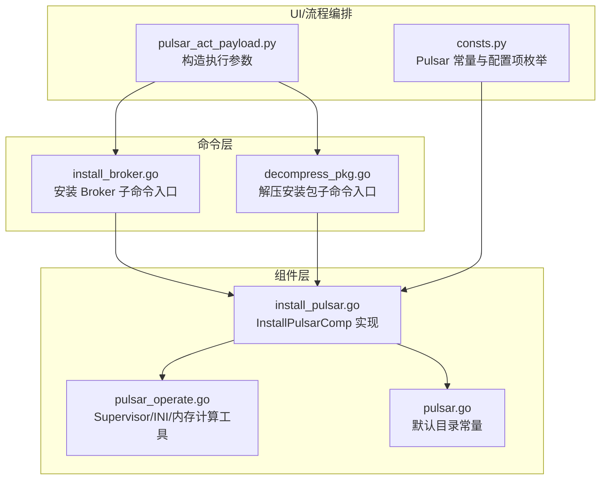
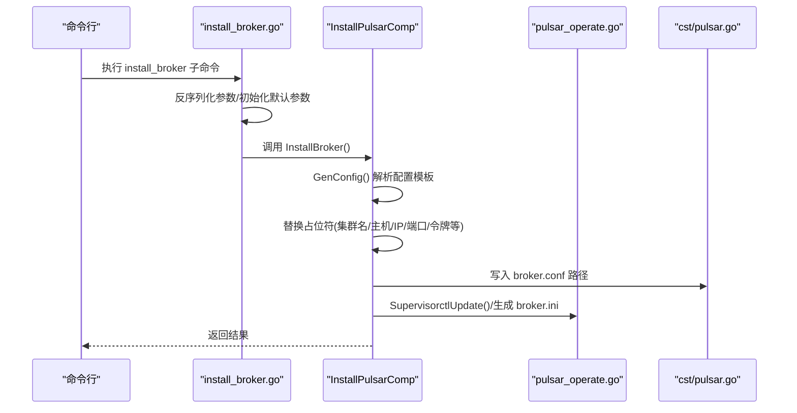
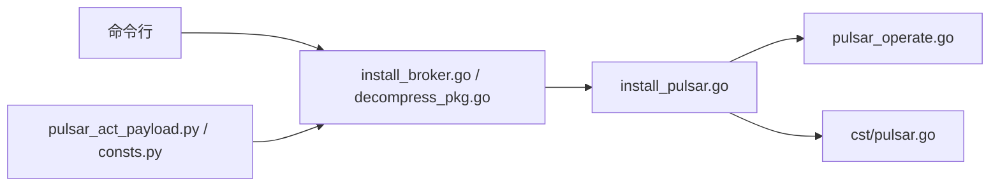

# Broker 部署

<cite>
**本文引用的文件**
- [install_broker.go](file://dbm-services/bigdata/db-tools/dbactuator/internal/subcmd/pulsarcmd/install_broker.go)
- [decompress_pkg.go](file://dbm-services/bigdata/db-tools/dbactuator/internal/subcmd/pulsarcmd/decompress_pkg.go)
- [install_pulsar.go](file://dbm-services/bigdata/db-tools/dbactuator/pkg/components/pulsar/install_pulsar.go)
- [pulsar_operate.go](file://dbm-services/bigdata/db-tools/dbactuator/pkg/util/pulsarutil/pulsar_operate.go)
- [pulsar.go](file://dbm-services/bigdata/db-tools/dbactuator/pkg/core/cst/pulsar.go)
- [pulsar_act_payload.py](file://dbm-ui/backend/flow/utils/pulsar/pulsar_act_payload.py)
- [consts.py](file://dbm-ui/backend/flow/utils/pulsar/consts.py)
- [mysql_os_init.py](file://dbm-ui/backend/flow/plugins/components/collections/mysql/mysql_os_init.py)
</cite>

## 目录
1. [简介](#简介)
2. [项目结构](#项目结构)
3. [核心组件](#核心组件)
4. [架构总览](#架构总览)
5. [详细组件分析](#详细组件分析)
6. [依赖关系分析](#依赖关系分析)
7. [性能考量](#性能考量)
8. [故障排查指南](#故障排查指南)
9. [结论](#结论)
10. [附录：从零开始部署示例](#附录从零开始部署示例)

## 简介
本文件面向需要在生产环境中部署 Pulsar Broker 节点的工程师，围绕 dbactuator 中的 Pulsar 子命令实现进行深入解析。重点覆盖以下方面：
- 如何通过 install_broker.go 调用组件层完成 Broker 部署全流程；
- 如何通过 decompress_pkg.go 解压安装包并建立软链接；
- 如何配置 broker.conf 关键参数（监听地址、端口、ZooKeeper 连接信息、认证令牌等）；
- 如何设置日志与数据目录、权限与环境初始化；
- 如何与文件服务器交互获取安装介质；
- 部署失败时的常见错误码与排查方法。

## 项目结构
与 Broker 部署直接相关的代码位于 dbactuator 的 pulsarcmd 子命令与 pulsar 组件层，同时依赖 pulasrutil 工具与 cst 常量定义。

图表来源
- [install_broker.go](file://dbm-services/bigdata/db-tools/dbactuator/internal/subcmd/pulsarcmd/install_broker.go#L1-L105)
- [decompress_pkg.go](file://dbm-services/bigdata/db-tools/dbactuator/internal/subcmd/pulsarcmd/decompress_pkg.go#L1-L105)
- [install_pulsar.go](file://dbm-services/bigdata/db-tools/dbactuator/pkg/components/pulsar/install_pulsar.go#L1-L120)
- [pulsar_operate.go](file://dbm-services/bigdata/db-tools/dbactuator/pkg/util/pulsarutil/pulsar_operate.go#L1-L120)
- [pulsar.go](file://dbm-services/bigdata/db-tools/dbactuator/pkg/core/cst/pulsar.go#L1-L39)
- [pulsar_act_payload.py](file://dbm-ui/backend/flow/utils/pulsar/pulsar_act_payload.py#L67-L103)
- [consts.py](file://dbm-ui/backend/flow/utils/pulsar/consts.py#L20-L40)

章节来源
- [install_broker.go](file://dbm-services/bigdata/db-tools/dbactuator/internal/subcmd/pulsarcmd/install_broker.go#L1-L105)
- [decompress_pkg.go](file://dbm-services/bigdata/db-tools/dbactuator/internal/subcmd/pulsarcmd/decompress_pkg.go#L1-L105)
- [install_pulsar.go](file://dbm-services/bigdata/db-tools/dbactuator/pkg/components/pulsar/install_pulsar.go#L1-L120)
- [pulsar_operate.go](file://dbm-services/bigdata/db-tools/dbactuator/pkg/util/pulsarutil/pulsar_operate.go#L1-L120)
- [pulsar.go](file://dbm-services/bigdata/db-tools/dbactuator/pkg/core/cst/pulsar.go#L1-L39)
- [pulsar_act_payload.py](file://dbm-ui/backend/flow/utils/pulsar/pulsar_act_payload.py#L67-L103)
- [consts.py](file://dbm-ui/backend/flow/utils/pulsar/consts.py#L20-L40)

## 核心组件
- 命令入口：install_broker.go 提供 install_broker 子命令，负责参数反序列化、初始化默认参数、执行部署步骤。
- 组件实现：install_pulsar.go 中的 InstallPulsarComp 提供 InstallBroker、DecompressPulsarPkg、InitPulsarDirs、InstallSupervisor 等能力。
- 工具函数：pulsar_operate.go 提供内存估算、Supervisor 更新、INI 文件生成等辅助能力。
- 常量定义：pulsar.go 定义默认安装目录、日志目录、配置文件路径等。

章节来源
- [install_broker.go](file://dbm-services/bigdata/db-tools/dbactuator/internal/subcmd/pulsarcmd/install_broker.go#L1-L105)
- [install_pulsar.go](file://dbm-services/bigdata/db-tools/dbactuator/pkg/components/pulsar/install_pulsar.go#L1-L120)
- [pulsar_operate.go](file://dbm-services/bigdata/db-tools/dbactuator/pkg/util/pulsarutil/pulsar_operate.go#L1-L120)
- [pulsar.go](file://dbm-services/bigdata/db-tools/dbactuator/pkg/core/cst/pulsar.go#L1-L39)

## 架构总览
下图展示从命令到组件再到工具与常量的整体调用链路，以及 Broker 配置生成的关键步骤。

图表来源
- [install_broker.go](file://dbm-services/bigdata/db-tools/dbactuator/internal/subcmd/pulsarcmd/install_broker.go#L77-L105)
- [install_pulsar.go](file://dbm-services/bigdata/db-tools/dbactuator/pkg/components/pulsar/install_pulsar.go#L391-L471)
- [pulsar_operate.go](file://dbm-services/bigdata/db-tools/dbactuator/pkg/util/pulsarutil/pulsar_operate.go#L48-L108)
- [pulsar.go](file://dbm-services/bigdata/db-tools/dbactuator/pkg/core/cst/pulsar.go#L28-L33)

## 详细组件分析

### 1) 安装 Broker 子命令入口（install_broker.go）
- 参数校验与初始化：从 JSON 反序列化到 Params，设置运行时通用参数，初始化默认目录。
- 步骤编排：调用 InstallBroker() 执行部署主流程。
- 回滚上下文：若步骤失败，将 RollBackContext 序列化输出，便于后续回滚。

章节来源
- [install_broker.go](file://dbm-services/bigdata/db-tools/dbactuator/internal/subcmd/pulsarcmd/install_broker.go#L44-L105)

### 2) 解压安装包子命令入口（decompress_pkg.go）
- 功能：调用 InstallPulsarComp.DecompressPulsarPkg() 完成安装包解压与角色软链接建立。
- 角色软链接：根据 Role 自动建立 zookeeper/bookkeeper/broker 对应的软链接，指向解压后的版本目录。

章节来源
- [decompress_pkg.go](file://dbm-services/bigdata/db-tools/dbactuator/internal/subcmd/pulsarcmd/decompress_pkg.go#L1-L105)
- [install_pulsar.go](file://dbm-services/bigdata/db-tools/dbactuator/pkg/components/pulsar/install_pulsar.go#L498-L552)

### 3) 组件实现：InstallPulsarComp（install_pulsar.go）
- 目录与权限初始化（InitPulsarDirs）
  - 创建 /data、/data/pulsarenv、/data/pulsarlog 等目录并设置属主为 mysql。
  - 为每个挂载盘下的 pulsardata 目录创建并授权。
  - 写入 /data/pulsarenv/pulsarprofile 并追加到 /etc/profile，设置 ulimit、JAVA 环境变量。
- 解压与软链接（DecompressPulsarPkg）
  - 切换工作目录至 /data/pulsarenv，删除旧的解压目录后解压指定版本 tar 包。
  - 根据 Role 建立 zookeeper/bookkeeper/broker 的软链接。
- Broker 配置生成（InstallBroker）
  - 从 Params.BrokerConfigs 解析配置模板，替换占位符：
    - 集群名、ZooKeeper 主机列表、本地 IP、令牌、默认分区、保留时间、副本策略等。
  - 写入 broker.conf；按内存动态调整 broker 的 JVM 堆与直接内存参数。
  - 生成 broker.ini 并通过 supervisorctl update 生效。
  - 同步更新 client.conf 的 authParams。
- Supervisor 安装与启动（InstallSupervisor）
  - 建立 /etc/supervisord.conf、supervisorctl、supervisord 的软链接。
  - 设置 mysql 用户的 crontab 定时检查脚本，后台启动 supervisord。
- 其他能力
  - ZooKeeper/BookKeeper/Manager 的配置与启动流程（由其他方法实现）。

章节来源
- [install_pulsar.go](file://dbm-services/bigdata/db-tools/dbactuator/pkg/components/pulsar/install_pulsar.go#L85-L155)
- [install_pulsar.go](file://dbm-services/bigdata/db-tools/dbactuator/pkg/components/pulsar/install_pulsar.go#L498-L552)
- [install_pulsar.go](file://dbm-services/bigdata/db-tools/dbactuator/pkg/components/pulsar/install_pulsar.go#L391-L471)
- [install_pulsar.go](file://dbm-services/bigdata/db-tools/dbactuator/pkg/components/pulsar/install_pulsar.go#L554-L711)

### 4) 工具函数：pulsar_operate.go
- 内存估算：根据系统内存自动计算堆大小与直接内存大小，用于动态设置 JVM 参数。
- Supervisor 控制：封装 supervisorctl update，简化组件更新流程。
- INI 生成：生成 zookeeper、bookkeeper、broker、pulsar-manager 的 supervisor 程序段配置。

章节来源
- [pulsar_operate.go](file://dbm-services/bigdata/db-tools/dbactuator/pkg/util/pulsarutil/pulsar_operate.go#L1-L120)
- [pulsar_operate.go](file://dbm-services/bigdata/db-tools/dbactuator/pkg/util/pulsarutil/pulsar_operate.go#L110-L128)

### 5) 常量定义：cst/pulsar.go
- 默认安装目录、日志目录、配置文件路径等常量，确保组件与工具对路径的一致性。

章节来源
- [pulsar.go](file://dbm-services/bigdata/db-tools/dbactuator/pkg/core/cst/pulsar.go#L1-L39)

### 6) 配置参数与 UI 编排
- UI 层通过 PulsarActPayload 与 PulsarConfigEnum 构造执行参数，包含 Broker 端口、ZooKeeper 端口、管理端口、默认分区、保留时间、副本策略等。
- dbactuator 在执行时将这些参数注入到 Params 中，最终被组件层用于生成配置文件。

章节来源
- [pulsar_act_payload.py](file://dbm-ui/backend/flow/utils/pulsar/pulsar_act_payload.py#L67-L103)
- [consts.py](file://dbm-ui/backend/flow/utils/pulsar/consts.py#L20-L40)

## 依赖关系分析
- 命令层依赖组件层：install_broker.go/decompress_pkg.go 通过 Cobra 注册子命令，调用 InstallPulsarComp 的具体方法。
- 组件层依赖工具层与常量层：InstallPulsarComp 使用 pulsar_operate.go 的内存估算与 supervisor 控制，使用 cst/pulsar.go 的路径常量。
- UI 层依赖组件层：通过构造 payload 将配置下发给 dbactuator 执行。

图表来源
- [install_broker.go](file://dbm-services/bigdata/db-tools/dbactuator/internal/subcmd/pulsarcmd/install_broker.go#L1-L105)
- [decompress_pkg.go](file://dbm-services/bigdata/db-tools/dbactuator/internal/subcmd/pulsarcmd/decompress_pkg.go#L1-L105)
- [install_pulsar.go](file://dbm-services/bigdata/db-tools/dbactuator/pkg/components/pulsar/install_pulsar.go#L1-L120)
- [pulsar_operate.go](file://dbm-services/bigdata/db-tools/dbactuator/pkg/util/pulsarutil/pulsar_operate.go#L1-L120)
- [pulsar.go](file://dbm-services/bigdata/db-tools/dbactuator/pkg/core/cst/pulsar.go#L1-L39)
- [pulsar_act_payload.py](file://dbm-ui/backend/flow/utils/pulsar/pulsar_act_payload.py#L67-L103)
- [consts.py](file://dbm-ui/backend/flow/utils/pulsar/consts.py#L20-L40)

## 性能考量
- JVM 内存参数：组件层会根据系统内存动态计算堆大小与直接内存大小，避免固定值导致资源浪费或 OOM。
- 日志轮转：各组件的启动日志采用固定大小与备份数量，建议结合业务流量规模评估轮转策略。
- Supervisor 管理：通过 supervisorctl update 统一管理进程，减少手工维护成本。

章节来源
- [pulsar_operate.go](file://dbm-services/bigdata/db-tools/dbactuator/pkg/util/pulsarutil/pulsar_operate.go#L1-L120)
- [install_pulsar.go](file://dbm-services/bigdata/db-tools/dbactuator/pkg/components/pulsar/install_pulsar.go#L391-L471)

## 故障排查指南
- 解压阶段失败
  - 症状：解压 tar 包报错或目录不存在。
  - 排查要点：确认 /data/install 下对应版本包已存在；检查磁盘空间与权限；查看解压日志。
  - 参考实现：DecompressPulsarPkg() 的解压与软链接逻辑。
  
  章节来源
  - [install_pulsar.go](file://dbm-services/bigdata/db-tools/dbactuator/pkg/components/pulsar/install_pulsar.go#L498-L552)

- 目录与权限问题
  - 症状：无法创建目录、chown 失败、进程无权限写日志。
  - 排查要点：确认 /data/pulsarenv、/data/pulsarlog、/data/pulsardata 是否存在且属主为 mysql；检查 /etc/profile 是否正确注入。
  - 参考实现：InitPulsarDirs() 的目录创建与授权逻辑。

  章节来源
  - [install_pulsar.go](file://dbm-services/bigdata/db-tools/dbactuator/pkg/components/pulsar/install_pulsar.go#L85-L155)

- Broker 配置不生效
  - 症状：Broker 启动失败或连接 ZooKeeper 失败。
  - 排查要点：核对 broker.conf 中的集群名、ZooKeeper 地址列表、本地 IP、令牌等是否正确；确认 client.conf 的 authParams 已同步。
  - 参考实现：InstallBroker() 的配置生成与替换逻辑。

  章节来源
  - [install_pulsar.go](file://dbm-services/bigdata/db-tools/dbactuator/pkg/components/pulsar/install_pulsar.go#L391-L471)

- Supervisor 未生效
  - 症状：Broker 进程未被管理或无法自动重启。
  - 排查要点：执行 supervisorctl update 是否成功；检查 /etc/supervisord.conf 软链接；确认 crontab 中的检查脚本已生效。
  - 参考实现：InstallSupervisor() 的软链接与 crontab 设置。

  章节来源
  - [install_pulsar.go](file://dbm-services/bigdata/db-tools/dbactuator/pkg/components/pulsar/install_pulsar.go#L554-L711)
  - [pulsar_operate.go](file://dbm-services/bigdata/db-tools/dbactuator/pkg/util/pulsarutil/pulsar_operate.go#L48-L108)

- 文件服务器下载介质失败
  - 症状：/data/install 下缺少安装包。
  - 排查要点：确认下载 URL、域名头、用户名/密码；检查网络连通性与重试次数；验证 rpm 包名查询是否成功。
  - 参考实现：UI 层的下载逻辑（与 dbactuator 解压流程配合）。

  章节来源
  - [mysql_os_init.py](file://dbm-ui/backend/flow/plugins/components/collections/mysql/mysql_os_init.py#L393-L419)

## 结论
本文基于 dbactuator 的 Pulsar 子命令与组件实现，系统梳理了 Broker 部署的全链路流程，包括安装包解压、配置生成、目录与权限初始化、Supervisor 管理以及与 UI 编排的对接。通过参数化配置与动态内存估算，部署过程具备良好的可移植性与稳定性。遇到问题时，可依据本文的排查清单快速定位根因。

## 附录：从零开始部署示例
以下为从零开始部署 Pulsar Broker 节点的操作步骤，涵盖介质准备、目录与权限初始化、解压、配置生成、Supervisor 管理与启动验证。

- 准备介质与网络
  - 在目标节点上准备 /data/install 目录，并确保安装包存在（可由 UI 流程触发下载）。
  - 确保网络可达文件服务器，域名解析正常。

- 目录与权限初始化
  - 执行目录创建与授权：创建 /data、/data/pulsarenv、/data/pulsarlog、/data/pulsardata 等目录并设置属主为 mysql。
  - 写入环境变量脚本并追加到 /etc/profile，确保 ulimit 与 JAVA 环境生效。

- 解压安装包
  - 切换工作目录至 /data/pulsarenv，删除旧的解压目录后解压对应版本 tar 包。
  - 根据 Role 建立 broker 的软链接，指向解压后的版本目录。

- 生成 Broker 配置
  - 从 Params.BrokerConfigs 解析配置模板，替换集群名、ZooKeeper 地址列表、本地 IP、令牌、默认分区、保留时间、副本策略等。
  - 写入 broker.conf；按内存动态调整 JVM 堆与直接内存参数。
  - 生成 broker.ini 并通过 supervisorctl update 生效。
  - 同步更新 client.conf 的 authParams。

- Supervisor 管理与启动
  - 建立 /etc/supervisord.conf、supervisorctl、supervisord 的软链接。
  - 设置 mysql 用户的 crontab 定时检查脚本，后台启动 supervisord。
  - 等待一段时间后检查 Broker 进程状态与日志。

- 验证
  - 通过 supervisorctl status 查看 broker 状态。
  - 检查 /data/pulsarenv/broker/broker_startup.log 是否有异常。
  - 使用客户端工具连接 Broker，验证基本功能。

章节来源
- [install_pulsar.go](file://dbm-services/bigdata/db-tools/dbactuator/pkg/components/pulsar/install_pulsar.go#L85-L155)
- [install_pulsar.go](file://dbm-services/bigdata/db-tools/dbactuator/pkg/components/pulsar/install_pulsar.go#L498-L552)
- [install_pulsar.go](file://dbm-services/bigdata/db-tools/dbactuator/pkg/components/pulsar/install_pulsar.go#L391-L471)
- [install_pulsar.go](file://dbm-services/bigdata/db-tools/dbactuator/pkg/components/pulsar/install_pulsar.go#L554-L711)
- [mysql_os_init.py](file://dbm-ui/backend/flow/plugins/components/collections/mysql/mysql_os_init.py#L393-L419)