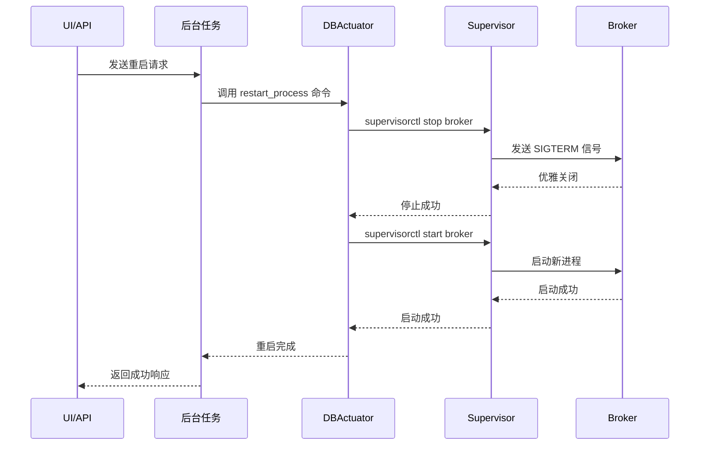
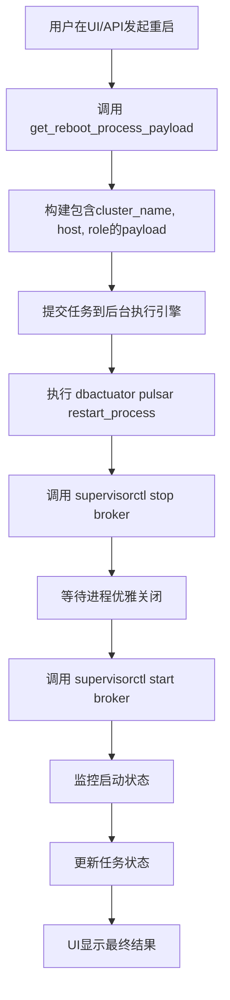

# Broker 重启

<cite>
**本文档引用的文件**   
- [restart_process.go](file://dbm-services/bigdata/db-tools/dbactuator/internal/subcmd/pulsarcmd/restart_process.go)
- [start_broker.go](file://dbm-services/bigdata/db-tools/dbactuator/internal/subcmd/pulsarcmd/start_broker.go)
- [startstop_process.go](file://dbm-services/bigdata/db-tools/dbactuator/pkg/components/pulsar/startstop_process.go)
- [install_pulsar.go](file://dbm-services/bigdata/db-tools/dbactuator/pkg/components/pulsar/install_pulsar.go)
- [pulsar_operate.go](file://dbm-services/bigdata/db-tools/dbactuator/pkg/util/pulsarutil/pulsar_operate.go)
- [pulsar_act_payload.py](file://dbm-ui/backend/flow/utils/pulsar/pulsar_act_payload.py)
</cite>

## 目录
1. [简介](#简介)
2. [重启机制实现](#重启机制实现)
3. [集群状态与元数据一致性](#集群状态与元数据一致性)
4. [UI/API 触发流程](#uiapi-触发流程)
5. [配置变更后重启操作示例](#配置变更后重启操作示例)
6. [高负载场景下的滚动重启最佳实践](#高负载场景下的滚动重启最佳实践)

## 简介
本文档详细说明了 Pulsar Broker 服务的重启操作流程。文档深入分析了 `restart_process.go` 的实现机制，阐述了如何通过发送 SIGTERM 信号安全地停止正在运行的 Broker 进程，等待其优雅关闭，然后调用 `start_broker.go` 中的逻辑重新启动服务。同时，文档解释了重启过程中对集群状态的影响以及如何确保元数据的一致性，并描述了在 UI 或 API 中触发重启操作时，后台任务的执行流程和状态监控。

**Section sources**
- [restart_process.go](file://dbm-services/bigdata/db-tools/dbactuator/internal/subcmd/pulsarcmd/restart_process.go#L1-L99)
- [start_broker.go](file://dbm-services/bigdata/db-tools/dbactuator/internal/subcmd/pulsarcmd/start_broker.go#L1-L105)

## 重启机制实现
Pulsar Broker 的重启操作由 `restart_process.go` 文件中的 `RestartProcessAct` 结构体实现。该操作通过 `cobra.Command` 定义了一个名为 `restart_process` 的命令，其核心逻辑在 `Run` 方法中执行。该方法调用 `StartStopProcessComp` 组件的 `RestartProcess` 函数来完成实际的重启工作。

`StartStopProcessComp` 组件（位于 `startstop_process.go`）是重启机制的核心。其 `RestartProcess` 函数首先通过 `supervisorctl stop` 命令停止指定角色（如 broker）的进程。`supervisorctl` 是一个进程控制系统，它会向目标进程发送 SIGTERM 信号，请求其优雅关闭。在停止命令执行成功后，函数会立即调用 `supervisorctl start` 命令来重新启动该进程。整个过程是同步的，确保了停止和启动操作的顺序执行。

值得注意的是，`start_broker.go` 文件中的 `StartPulsarBrokerAct` 结构体定义了 `start_broker` 命令，其 `Run` 方法最终会调用 `InstallPulsarComp` 组件的 `StartBroker` 函数。这表明重启操作中的“启动”阶段，实际上是调用了与初始安装时相同的启动逻辑，确保了服务配置的一致性。

**Diagram sources**
- [restart_process.go](file://dbm-services/bigdata/db-tools/dbactuator/internal/subcmd/pulsarcmd/restart_process.go#L77-L97)
- [startstop_process.go](file://dbm-services/bigdata/db-tools/dbactuator/pkg/components/pulsar/startstop_process.go#L76-L95)
- [start_broker.go](file://dbm-services/bigdata/db-tools/dbactuator/internal/subcmd/pulsarcmd/start_broker.go#L78-L104)

**Section sources**
- [restart_process.go](file://dbm-services/bigdata/db-tools/dbactuator/internal/subcmd/pulsarcmd/restart_process.go#L1-L99)
- [startstop_process.go](file://dbm-services/bigdata/db-tools/dbactuator/pkg/components/pulsar/startstop_process.go#L1-L96)
- [start_broker.go](file://dbm-services/bigdata/db-tools/dbactuator/internal/subcmd/pulsarcmd/start_broker.go#L1-L105)

## 集群状态与元数据一致性
在重启 Pulsar Broker 时，确保集群状态和元数据的一致性至关重要。系统通过多个层面来保障这一点。

首先，`supervisorctl` 的 `stop` 命令会发送 SIGTERM 信号，这允许 Broker 进程在退出前完成正在进行的请求、将未持久化的数据刷盘，并向 ZooKeeper 注册其下线状态。这种优雅关闭机制避免了数据丢失和客户端连接的突然中断。

其次，Pulsar 的元数据（如 Topic 配置、租户信息）存储在 ZooKeeper 中。Broker 重启后，会从 ZooKeeper 中重新加载这些元数据，从而保证了配置的一致性。`install_pulsar.go` 文件中的 `InitCluster` 函数负责初始化集群元数据，虽然重启操作通常不执行此函数，但它确保了集群的初始状态是正确的。

此外，`pulsar_operate.go` 文件中提供了 `SetBookieReadOnly` 和 `UnsetBookieReadOnly` 等辅助函数。在进行大规模维护（如滚动重启）时，可以先将 Bookie 节点设置为只读模式，防止新数据写入，待数据复制稳定后再进行重启，从而最大限度地减少对数据一致性的影响。

**Section sources**
- [install_pulsar.go](file://dbm-services/bigdata/db-tools/dbactuator/pkg/components/pulsar/install_pulsar.go#L244-L293)
- [pulsar_operate.go](file://dbm-services/bigdata/db-tools/dbactuator/pkg/util/pulsarutil/pulsar_operate.go#L130-L203)

## UI/API 触发流程
当用户通过 UI 或 API 触发 Pulsar Broker 重启操作时，后台会执行一系列预定义的任务流程。

流程始于 `pulsar_act_payload.py` 文件中的 `get_reboot_process_payload` 函数。该函数构建了一个包含操作类型（`RestartProcess`）、集群名称、目标主机 IP 和角色（broker）的 JSON 有效载荷（payload）。这个 payload 被封装到一个任务动作（act）中，并提交给后台的任务执行引擎。

任务引擎接收到请求后，会调用 DBActuator 工具，执行 `dbactuator pulsar restart_process` 命令。DBActuator 根据传入的参数，定位到目标主机并执行重启逻辑。整个过程的状态（如“执行中”、“成功”、“失败”）会被实时监控和记录，用户可以在 UI 上查看任务的详细执行日志和最终结果。

**Diagram sources**
- [pulsar_act_payload.py](file://dbm-ui/backend/flow/utils/pulsar/pulsar_act_payload.py#L320-L332)

**Section sources**
- [pulsar_act_payload.py](file://dbm-ui/backend/flow/utils/pulsar/pulsar_act_payload.py#L320-L332)

## 配置变更后重启操作示例
当需要应用新的 Broker 配置时，可以按照以下步骤进行操作：

1.  **更新配置**：通过配置管理界面更新 `broker.conf` 文件中的参数，例如调整 `retentionTime` 或 `ensembleSize`。
2.  **触发重启**：在集群管理页面，选择需要重启的 Broker 节点，点击“重启”按钮。
3.  **后台执行**：
    *   系统生成包含新配置的 `restart_process` 任务。
    *   DBActuator 在目标节点上执行 `supervisorctl stop broker`，Broker 开始优雅关闭。
    *   关闭完成后，执行 `supervisorctl start broker`，新的 Broker 进程启动并加载更新后的配置文件。
4.  **验证**：检查任务日志确认重启成功，并通过 Pulsar Manager 或 CLI 验证新配置是否已生效。

此过程确保了配置变更能够被正确加载，同时利用了优雅关闭机制来保证服务的平稳过渡。

## 高负载场景下的滚动重启最佳实践
在高负载生产环境中，为避免服务中断，应采用滚动重启（Rolling Restart）策略：

1.  **分批重启**：不要同时重启所有 Broker 节点。建议一次只重启一个或少数几个节点，确保集群中始终有足够多的 Broker 在线处理请求。
2.  **监控关键指标**：在重启每个节点前，密切监控集群的负载、延迟、消息积压（backlog）等关键指标。确保当前负载在可接受范围内再进行操作。
3.  **等待恢复**：在重启一个节点后，等待一段时间（例如 5-10 分钟），让该节点完全加入集群并开始正常处理流量，同时观察其他节点的负载是否恢复正常，然后再重启下一个节点。
4.  **利用只读模式（可选）**：对于 Bookie 节点的维护，可以参考 `pulsar_operate.go` 中的 `SetBookieReadOnly` 逻辑，在重启前将其设置为只读，防止新数据写入，待重启并重新加入集群后再取消只读状态。
5.  **选择低峰期**：尽可能在业务低峰期执行滚动重启，以最小化对业务的影响。

遵循这些最佳实践，可以在保证数据一致性和服务高可用的前提下，安全地完成 Pulsar 集群的维护和升级。