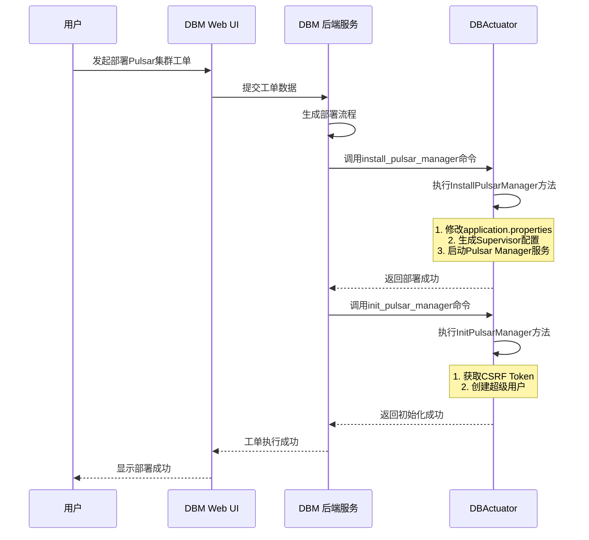

# Manager 管理

<cite>
**本文档引用的文件**   
- [install_pulsar_manager.go](file://dbm-services/bigdata/db-tools/dbactuator/internal/subcmd/pulsarcmd/install_pulsar_manager.go)
- [init_pulsar_manager.go](file://dbm-services/bigdata/db-tools/dbactuator/internal/subcmd/pulsarcmd/init_pulsar_manager.go)
- [install_pulsar.go](file://dbm-services/bigdata/db-tools/dbactuator/pkg/components/pulsar/install_pulsar.go)
- [pulsar_operate.go](file://dbm-services/bigdata/db-tools/dbactuator/pkg/util/pulsarutil/pulsar_operate.go)
- [cst.go](file://dbm-services/bigdata/db-tools/dbactuator/pkg/core/cst/cst.go)
- [pulsar_act_payload.py](file://dbm-ui/backend/flow/utils/pulsar/pulsar_act_payload.py)
- [nginxconf_tpl.py](file://dbm-ui/backend/db_proxy/nginxconf_tpl.py)
</cite>

## 目录
1. [Pulsar Manager 部署与初始化](#pulsar-manager-部署与初始化)
2. [核心功能与访问](#核心功能与访问)
3. [部署与初始化流程](#部署与初始化流程)
4. [Web 界面访问与集群管理](#web-界面访问与集群管理)

## Pulsar Manager 部署与初始化

### Pulsar Manager 部署流程

Pulsar Manager 的部署由 `install_pulsar_manager.go` 文件中的 `InstallPulsarManagerCommand` 命令触发。该命令通过 Cobra 框架定义了一个名为 `install_pulsar_manager` 的子命令，用于执行 Pulsar Manager 的安装。

部署的核心逻辑在 `install_pulsar.go` 文件的 `InstallPulsarManager` 方法中实现。该方法首先检查 Pulsar Manager 的安装目录是否存在。如果存在，则开始部署流程，主要包括以下几个步骤：

1.  **配置文件修改**：通过 `sed` 命令修改 `application.properties` 配置文件，设置 Pulsar Admin 的认证参数（`backend.broker.pulsarAdmin.authParams`）、默认环境名称（`default.environment.name`）和默认环境的服务 URL（`default.environment.service_url`）。这些参数分别来自部署时传入的 Token、集群名称和 Broker 的 Web 服务地址。
2.  **Nginx 子路径替换**：修改 Pulsar Manager UI 中用于反向代理的子路径占位符 `{{nginx_sub_path}}`，以确保 Web 界面能通过正确的路径被访问。
3.  **Supervisor 配置生成**：调用 `pulsarutil.GenPulsarManagerIni()` 生成 Supervisor 的配置文件 `pulsar-manager.ini`，该文件定义了如何启动和监控 Pulsar Manager 进程。
4.  **Supervisor 更新与启动**：执行 `supervisorctl update` 命令，让 Supervisor 重新加载配置并启动 Pulsar Manager 服务。
5.  **等待服务启动**：部署完成后，会等待 60 秒，以确保 Pulsar Manager 服务有足够的时间完全启动。

**Section sources**
- [install_pulsar_manager.go](file://dbm-services/bigdata/db-tools/dbactuator/internal/subcmd/pulsarcmd/install_pulsar_manager.go#L22-L105)
- [install_pulsar.go](file://dbm-services/bigdata/db-tools/dbactuator/pkg/components/pulsar/install_pulsar.go#L649-L711)

### Pulsar Manager 初始化流程

Pulsar Manager 的初始化由 `init_pulsar_manager.go` 文件中的 `InitPulsarManagerCommand` 命令触发。该命令同样通过 Cobra 框架定义，用于在 Pulsar Manager 服务启动后进行配置。

初始化的核心逻辑在 `install_pulsar.go` 文件的 `InitPulsarManager` 方法中。该方法通过 HTTP API 调用与 Pulsar Manager 交互，主要完成以下操作：

1.  **获取 CSRF Token**：首先向 `http://localhost:7750/pulsar-manager/csrf-token` 发送一个 `curl` 请求，获取用于后续操作的 CSRF Token。这是为了防止跨站请求伪造攻击。
2.  **创建超级用户**：使用上一步获取的 CSRF Token，通过 `curl` 命令向 `http://localhost:7750/pulsar-manager/users/superuser` 发送一个 PUT 请求，创建一个超级用户（superuser）。请求体中包含了管理员的用户名、密码、描述和邮箱等信息。

通过此初始化流程，Pulsar Manager 被配置为可以使用指定的用户名和密码进行登录，从而实现了对目标 Pulsar 集群的管理和监控能力。

**Section sources**
- [init_pulsar_manager.go](file://dbm-services/bigdata/db-tools/dbactuator/internal/subcmd/pulsarcmd/init_pulsar_manager.go#L22-L105)
- [install_pulsar.go](file://dbm-services/bigdata/db-tools/dbactuator/pkg/components/pulsar/install_pulsar.go#L718-L744)
- [pulsar_act_payload.py](file://dbm-ui/backend/flow/utils/pulsar/pulsar_act_payload.py#L201-L225)

## 核心功能与访问

### Web 界面访问

Pulsar Manager 的 Web 界面默认运行在 7750 端口（由 `PULSAR_MANAGER_WEB_PORT = 7750` 定义）。在实际部署中，通常会通过 Nginx 进行反向代理，以实现更安全和统一的访问入口。

根据 `nginxconf_tpl.py` 中的 `pulsar_conf_tpl` 模板，Nginx 会将特定路径（如 `/{{bk_biz_id}}/{{db_type}}/{{cluster_name}}/{{service_type}}`）的请求代理到 Pulsar Manager 的 UI。模板中使用了 `sub_filter` 指令，将返回的 HTML 内容中的路径（如 `/pulsar-manager`）动态替换为代理路径，确保页面资源能正确加载。

### 集群注册与管理

Pulsar Manager 的核心功能是管理和监控 Pulsar 集群。在部署和初始化完成后，管理员可以通过 Web 界面执行以下操作：

-   **集群注册**：虽然 Pulsar Manager 在部署时已通过 `application.properties` 配置了默认环境，但管理员可以在 Web 界面中手动添加或管理多个 Pulsar 集群。
-   **租户管理**：Pulsar 支持多租户。管理员可以通过 Pulsar Manager 创建、查看和管理租户。后端通过 `pulsarutil.GetAllTenant()` 方法调用 `pulsar-admin tenants list` 命令来获取所有租户列表。
-   **命名空间管理**：命名空间是租户下的逻辑分区。管理员可以为租户创建、查看和管理命名空间。后端通过 `pulsarutil.GetAllNamespace(tenant)` 方法调用 `pulsar-admin namespaces list <tenant>` 命令来获取指定租户下的所有命名空间。

**Section sources**
- [consts.py](file://dbm-ui/backend/flow/utils/pulsar/consts.py#L20-L40)
- [nginxconf_tpl.py](file://dbm-ui/backend/db_proxy/nginxconf_tpl.py#L120-L143)
- [pulsar_operate.go](file://dbm-services/bigdata/db-tools/dbactuator/pkg/util/pulsarutil/pulsar_helper.go#L40-L82)

## 部署与初始化流程

**Diagram sources**
- [install_pulsar_manager.go](file://dbm-services/bigdata/db-tools/dbactuator/internal/subcmd/pulsarcmd/install_pulsar_manager.go#L22-L105)
- [init_pulsar_manager.go](file://dbm-services/bigdata/db-tools/dbactuator/internal/subcmd/pulsarcmd/init_pulsar_manager.go#L22-L105)
- [install_pulsar.go](file://dbm-services/bigdata/db-tools/dbactuator/pkg/components/pulsar/install_pulsar.go#L649-L744)

## Web 界面访问与集群管理

### 访问示例

假设一个 Pulsar 集群的业务 ID 为 `100`, 集群类型为 `pulsar`, 集群名称为 `my-pulsar-cluster`, 服务类型为 `manager`，则可以通过以下 URL 访问其 Pulsar Manager Web 界面：
`http://<nginx-host>/100/pulsar/my-pulsar-cluster/manager`

首次访问时，使用在初始化流程中设置的用户名和密码登录。

### 集群信息查看

登录后，管理员可以在 Web 界面的仪表板中查看集群的概览信息，包括：
-   **集群状态**：各组件（Zookeeper, Bookkeeper, Broker）的健康状态。
-   **租户与命名空间**：列出所有租户及其下的命名空间。
-   **主题（Topics）**：查看和管理各个命名空间下的主题。
-   **性能指标**：监控集群的吞吐量、延迟、连接数等关键性能指标。

通过这些功能，Pulsar Manager 为管理员提供了一个强大的可视化工具，极大地简化了 Pulsar 集群的日常运维工作。

**Section sources**
- [nginxconf_tpl.py](file://dbm-ui/backend/db_proxy/nginxconf_tpl.py#L120-L143)
- [pulsar_operate.go](file://dbm-services/bigdata/db-tools/dbactuator/pkg/util/pulsarutil/pulsar_helper.go#L40-L82)