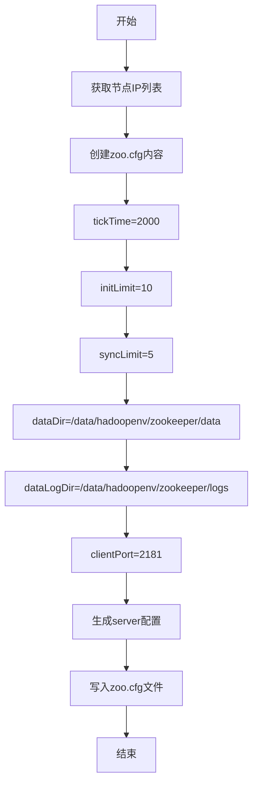
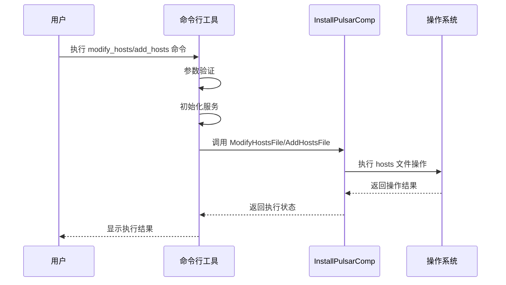
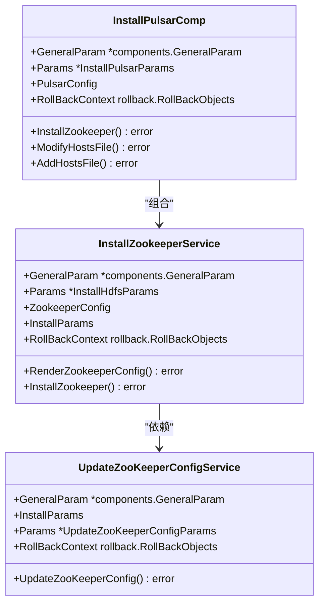
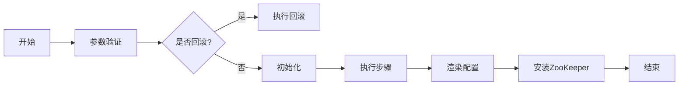

# ZooKeeper 管理

<cite>
**本文档引用的文件**  
- [install_zookeeper.go](file://dbm-services/bigdata/db-tools/dbactuator/internal/subcmd/hdfscmd/install_zookeeper.go)
- [modify_hosts.go](file://dbm-services/bigdata/db-tools/dbactuator/internal/subcmd/pulsarcmd/modify_hosts.go)
- [add_hosts.go](file://dbm-services/bigdata/db-tools/dbactuator/internal/subcmd/pulsarcmd/add_hosts.go)
- [install_zookeeper.go](file://dbm-services/bigdata/db-tools/dbactuator/pkg/components/hdfs/install_zookeeper.go)
- [install_pulsar.go](file://dbm-services/bigdata/db-tools/dbactuator/pkg/components/pulsar/install_pulsar.go)
</cite>

## 目录
1. [简介](#简介)
2. [ZooKeeper 部署流程](#zookeeper-部署流程)
3. [配置文件管理](#配置文件管理)
4. [集群拓扑变更处理](#集群拓扑变更处理)
5. [三节点集群部署实例](#三节点集群部署实例)
6. [核心组件分析](#核心组件分析)

## 简介
本文档详细阐述了在 BlueKing DBM 系统中如何通过自动化工具管理 ZooKeeper 集群的部署与维护。重点分析了 ZooKeeper 的安装、配置生成、节点间通信设置以及集群拓扑变更时的 hosts 文件更新机制。文档通过代码级分析展示了系统如何确保 ZooKeeper 集群的高可用性和一致性。

## ZooKeeper 部署流程
ZooKeeper 集群的部署通过 `install_zookeeper.go` 文件中的命令实现。部署流程主要包括以下步骤：

1. **参数初始化**：从输入参数中反序列化部署配置，包括主机信息、ZooKeeper 节点 IP 列表等。
2. **目录初始化**：创建 ZooKeeper 所需的数据目录和日志目录，并设置正确的权限。
3. **配置生成**：根据集群拓扑生成 `zoo.cfg` 配置文件，包含 tickTime、initLimit、syncLimit 等核心参数。
4. **myid 写入**：根据当前节点在集群中的位置确定并写入 myid 文件。
5. **服务注册**：通过 Supervisor 管理工具注册 ZooKeeper 服务，确保进程的稳定运行。

部署过程采用分步执行机制，每个步骤都有明确的错误处理和回滚支持，确保部署的可靠性。

**Section sources**
- [install_zookeeper.go](file://dbm-services/bigdata/db-tools/dbactuator/internal/subcmd/hdfscmd/install_zookeeper.go#L1-L105)
- [install_zookeeper.go](file://dbm-services/bigdata/db-tools/dbactuator/pkg/components/hdfs/install_zookeeper.go#L1-L90)

## 配置文件管理
ZooKeeper 的配置管理是确保集群正常运行的关键。系统通过程序化方式生成和维护核心配置文件。

### zoo.cfg 配置文件生成
`zoo.cfg` 文件包含了 ZooKeeper 集群的核心配置参数：

**Diagram sources**
- [install_zookeeper.go](file://dbm-services/bigdata/db-tools/dbactuator/pkg/components/hdfs/install_zookeeper.go#L45-L63)

### myid 文件管理
myid 文件用于标识每个 ZooKeeper 节点在集群中的唯一身份。系统通过以下逻辑确定 myid 值：

1. 获取当前节点的 IP 地址
2. 在 ZooKeeper 节点 IP 列表中查找匹配项
3. 使用匹配项的索引作为 myid 值

这种机制确保了每个节点都能正确识别自己的身份，避免了配置冲突。

**Section sources**
- [install_zookeeper.go](file://dbm-services/bigdata/db-tools/dbactuator/pkg/components/hdfs/install_zookeeper.go#L65-L77)

## 集群拓扑变更处理
当 ZooKeeper 集群需要进行扩容或缩容时，系统通过 `modify_hosts.go` 和 `add_hosts.go` 文件处理节点间的主机名解析问题。

### hosts 文件更新机制
系统提供了两种 hosts 文件操作模式：

- **修改模式** (`modify_hosts.go`)：替换现有 hosts 配置
- **添加模式** (`add_hosts.go`)：在现有配置基础上追加新条目

**Diagram sources**
- [modify_hosts.go](file://dbm-services/bigdata/db-tools/dbactuator/internal/subcmd/pulsarcmd/modify_hosts.go#L78-L104)
- [add_hosts.go](file://dbm-services/bigdata/db-tools/dbactuator/internal/subcmd/pulsarcmd/add_hosts.go#L78-L104)

### 集群配置更新
对于 HDFS 场景，系统还提供了 `update_zookeeper_config.go` 文件来处理 ZooKeeper 配置的动态更新，通过 `sed` 命令批量替换配置文件中的旧 IP 地址。

**Section sources**
- [modify_hosts.go](file://dbm-services/bigdata/db-tools/dbactuator/internal/subcmd/pulsarcmd/modify_hosts.go#L1-L105)
- [add_hosts.go](file://dbm-services/bigdata/db-tools/dbactuator/internal/subcmd/pulsarcmd/add_hosts.go#L1-L105)

## 三节点集群部署实例
以下是一个典型的三节点 ZooKeeper 集群部署过程：

1. **准备阶段**：
   - 确定三个节点的 IP 地址：192.168.1.10、192.168.1.11、192.168.1.12
   - 准备部署参数，包括安装目录、数据目录等

2. **部署执行**：
   - 在每个节点上执行 `install-zookeeper` 命令
   - 系统自动为每个节点生成相应的配置

3. **配置示例**：
   - 节点 192.168.1.10：myid = 0，server.0=192.168.1.10:2888:3888
   - 节点 192.168.1.11：myid = 1，server.1=192.168.1.11:2888:3888
   - 节点 192.168.1.12：myid = 2，server.2=192.168.1.12:2888:3888

4. **验证阶段**：
   - 检查每个节点的配置文件是否正确
   - 验证 myid 文件内容与节点位置匹配
   - 确认服务已成功注册到 Supervisor

此部署模式确保了集群的对称性和高可用性，任何单点故障都不会影响整体服务。

**Section sources**
- [install_zookeeper.go](file://dbm-services/bigdata/db-tools/dbactuator/pkg/components/hdfs/install_zookeeper.go#L45-L77)

## 核心组件分析
本节深入分析 ZooKeeper 管理的核心组件及其交互关系。

### InstallZookeeperService 结构
该结构体是 ZooKeeper 部署的核心服务组件，包含以下关键字段：

- **GeneralParam**：通用参数配置
- **Params**：具体部署参数
- **ZookeeperConfig**：ZooKeeper 配置项
- **InstallParams**：安装参数
- **RollBackContext**：回滚上下文

**Diagram sources**
- [install_zookeeper.go](file://dbm-services/bigdata/db-tools/dbactuator/pkg/components/hdfs/install_zookeeper.go#L15-L22)
- [install_pulsar.go](file://dbm-services/bigdata/db-tools/dbactuator/pkg/components/pulsar/install_pulsar.go#L22-L28)

### 部署流程控制
系统采用分步执行框架来管理部署流程，确保每个步骤都能被独立验证和回滚：

**Diagram sources**
- [install_zookeeper.go](file://dbm-services/bigdata/db-tools/dbactuator/internal/subcmd/hdfscmd/install_zookeeper.go#L78-L104)

**Section sources**
- [install_zookeeper.go](file://dbm-services/bigdata/db-tools/dbactuator/internal/subcmd/hdfscmd/install_zookeeper.go#L1-L105)
- [install_zookeeper.go](file://dbm-services/bigdata/db-tools/dbactuator/pkg/components/hdfs/install_zookeeper.go#L1-L125)