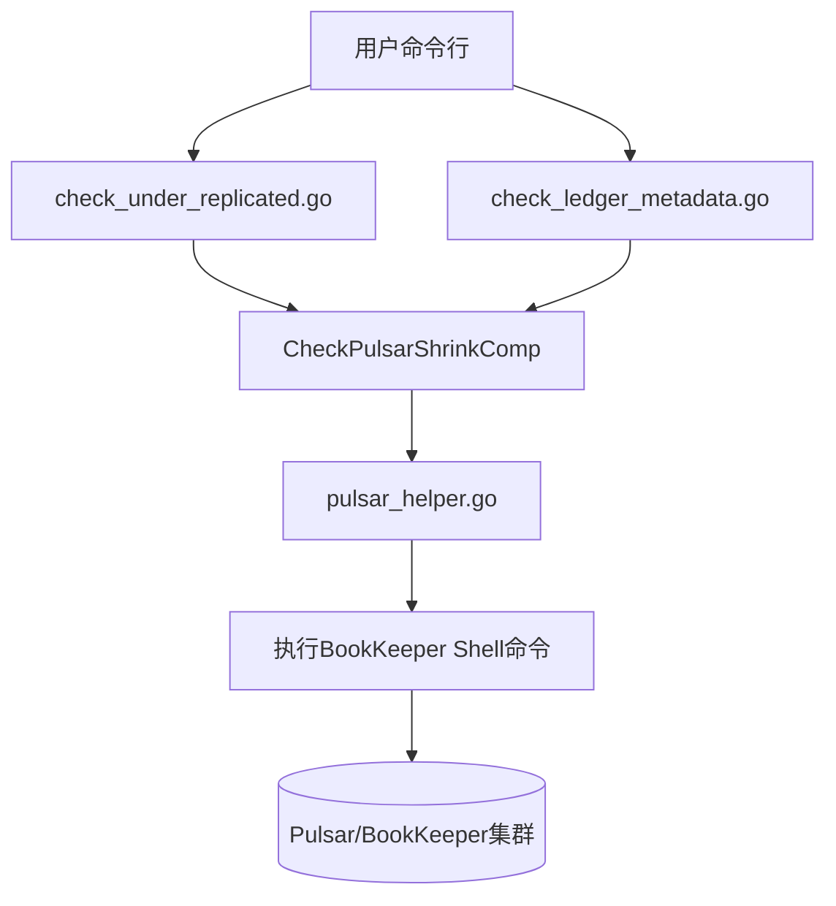
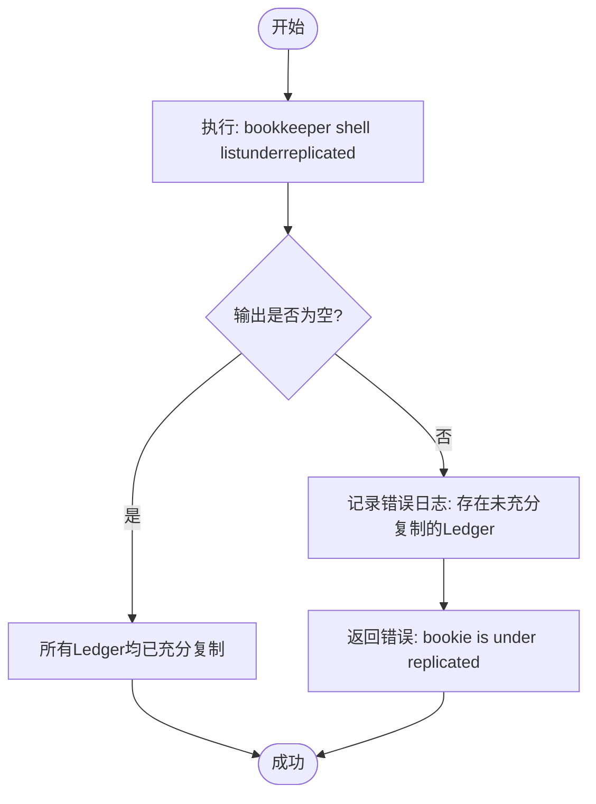
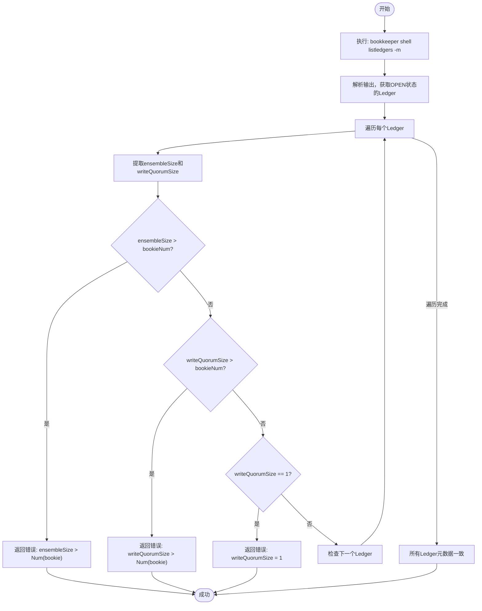

# 健康检查

<cite>
**本文档引用的文件**  
- [check_under_replicated.go](file://dbm-services/bigdata/db-tools/dbactuator/internal/subcmd/pulsarcmd/check_under_replicated.go)
- [check_ledger_metadata.go](file://dbm-services/bigdata/db-tools/dbactuator/internal/subcmd/pulsarcmd/check_ledger_metadata.go)
- [check_shrink.go](file://dbm-services/bigdata/db-tools/dbactuator/pkg/components/pulsar/check_shrink.go)
- [pulsar_helper.go](file://dbm-services/bigdata/db-tools/dbactuator/pkg/util/pulsarutil/pulsar_helper.go)
- [pulsar_operate.go](file://dbm-services/bigdata/db-tools/dbactuator/pkg/util/pulsarutil/pulsar_operate.go)
- [pulsar.go](file://dbm-services/bigdata/db-tools/dbactuator/pkg/core/cst/pulsar.go)
</cite>

## 目录
1. [简介](#简介)
2. [核心组件分析](#核心组件分析)
3. [未充分复制的 Ledger 检查机制](#未充分复制的-ledger-检查机制)
4. [Ledger 元数据一致性验证机制](#ledger-元数据一致性验证机制)
5. [健康检查命令使用示例](#健康检查命令使用示例)
6. [输出结果解析与故障诊断](#输出结果解析与故障诊断)
7. [恢复操作指南](#恢复操作指南)

## 简介
本文档详细阐述了 Pulsar 集群健康检查功能的实现，重点分析 `check_under_replicated.go` 和 `check_ledger_metadata.go` 两个模块。文档解释了如何通过执行 BookKeeper Shell 命令来检查集群的复制状态和元数据完整性，这对于预防数据丢失和确保集群稳定运行至关重要。

## 核心组件分析

Pulsar 健康检查功能由多个 Go 文件协同实现，构成了一个完整的命令行工具链。

**Section sources**
- [check_under_replicated.go](file://dbm-services/bigdata/db-tools/dbactuator/internal/subcmd/pulsarcmd/check_under_replicated.go#L1-L105)
- [check_ledger_metadata.go](file://dbm-services/bigdata/db-tools/dbactuator/internal/subcmd/pulsarcmd/check_ledger_metadata.go#L1-L103)
- [check_shrink.go](file://dbm-services/bigdata/db-tools/dbactuator/pkg/components/pulsar/check_shrink.go#L1-L80)

### 架构概览


**Diagram sources**
- [check_under_replicated.go](file://dbm-services/bigdata/db-tools/dbactuator/internal/subcmd/pulsarcmd/check_under_replicated.go#L1-L105)
- [check_ledger_metadata.go](file://dbm-services/bigdata/db-tools/dbactuator/internal/subcmd/pulsarcmd/check_ledger_metadata.go#L1-L103)
- [check_shrink.go](file://dbm-services/bigdata/db-tools/dbactuator/pkg/components/pulsar/check_shrink.go#L1-L80)
- [pulsar_helper.go](file://dbm-services/bigdata/db-tools/dbactuator/pkg/util/pulsarutil/pulsar_helper.go#L1-L209)

## 未充分复制的 Ledger 检查机制

`check_under_replicated.go` 模块负责检查集群中是否存在未达到预期副本数的 Ledger。该模块通过调用 BookKeeper 的 Shell 命令 `listunderreplicated` 来实现。

### 实现流程


**Diagram sources**
- [pulsar_helper.go](file://dbm-services/bigdata/db-tools/dbactuator/pkg/util/pulsarutil/pulsar_helper.go#L128-L143)

### 详细说明
1.  **命令执行**: 该功能通过 `osutil.ExecShellCommand` 执行 `bookkeeper shell listunderreplicated` 命令。
2.  **结果判断**: 如果命令返回非空输出，说明存在未充分复制的 Ledger，函数会记录错误日志并返回一个错误，提示 "bookie is under replicated"。
3.  **路径配置**: 命令的执行路径由常量 `cst.DefaultPulsarBkDir` 定义，通常指向 `/data/pulsarenv/bookkeeper`。

**Section sources**
- [pulsar_helper.go](file://dbm-services/bigdata/db-tools/dbactuator/pkg/util/pulsarutil/pulsar_helper.go#L128-L143)
- [pulsar.go](file://dbm-services/bigdata/db-tools/dbactuator/pkg/core/cst/pulsar.go#L22-L26)

## Ledger 元数据一致性验证机制

`check_ledger_metadata.go` 模块用于验证 Ledger 元数据的完整性和一致性，防止因元数据配置不当导致的数据不可用。

### 实现流程


**Diagram sources**
- [pulsar_helper.go](file://dbm-services/bigdata/db-tools/dbactuator/pkg/util/pulsarutil/pulsar_helper.go#L163-L207)

### 详细说明
1.  **数据获取**: 该功能通过执行 `bookkeeper shell listledgers -m` 命令，获取所有状态为 `OPEN` 的 Ledger 的元数据。
2.  **关键检查**:
    *   **Ensemble Size 检查**: 确保 Ledger 的 `ensembleSize`（副本数）不超过当前集群中 Bookie 节点的总数。如果超过，说明该 Ledger 无法正常写入。
    *   **Write Quorum Size 检查**: 确保 `writeQuorumSize`（写入确认数）不超过 Bookie 节点总数。如果超过，写入操作将永远无法完成。
    *   **Quorum 为 1 的检查**: 特别检查 `writeQuorumSize` 是否为 1。如果为 1，意味着任何一个 Bookie 节点故障都可能导致数据丢失，这是高风险配置。
3.  **参数传递**: 检查函数 `CheckLedgerMetadata` 接收一个 `bookieNum` 参数，表示当前集群中 Bookie 的数量，用于进行上述比较。

**Section sources**
- [pulsar_helper.go](file://dbm-services/bigdata/db-tools/dbactuator/pkg/util/pulsarutil/pulsar_helper.go#L163-L207)
- [check_shrink.go](file://dbm-services/bigdata/db-tools/dbactuator/pkg/components/pulsar/check_shrink.go#L54-L57)

## 健康检查命令使用示例

以下是执行健康检查的命令示例。

### 检查未充分复制的 Ledger
```bash
dbactuator pulsar check_under_replicated --payload '{"http_port": 8080, "host": "127.0.0.1"}'
```

### 检查 Ledger 元数据
```bash
dbactuator pulsar check_ledger_metadata --payload '{"http_port": 8080, "host": "127.0.0.1", "bookkeeper_num": 3}'
```

**Section sources**
- [check_under_replicated.go](file://dbm-services/bigdata/db-tools/dbactuator/internal/subcmd/pulsarcmd/check_under_replicated.go#L28-L30)
- [check_ledger_metadata.go](file://dbm-services/bigdata/db-tools/dbactuator/internal/subcmd/pulsarcmd/check_ledger_metadata.go#L29-L31)

## 输出结果解析与故障诊断

### `check_under_replicated` 输出
*   **成功**: 命令执行后无错误输出，日志显示 `check_under_replicated successfully`。
*   **失败**: 日志中会记录 `under replicated: [输出内容]`，并返回错误 `bookie is under replicated`。此时应立即检查 BookKeeper 集群的健康状况和磁盘空间。

### `check_ledger_metadata` 输出
*   **成功**: 命令执行后无错误输出，日志显示 `check_ledger_metadata successfully`。
*   **失败**: 根据不同的问题，日志会明确指出错误原因：
    *   `ensembleSize > Num(bookie)`: Ledger 的副本数超过了可用 Bookie 数量。
    *   `writeQuorumSize > Num(bookie)`: Ledger 的写入确认数超过了可用 Bookie 数量。
    *   `writeQuorumSize = 1`: 存在写入确认数为 1 的 Ledger，存在数据丢失风险。

**Section sources**
- [pulsar_helper.go](file://dbm-services/bigdata/db-tools/dbactuator/pkg/util/pulsarutil/pulsar_helper.go#L140-L142)
- [pulsar_helper.go](file://dbm-services/bigdata/db-tools/dbactuator/pkg/util/pulsarutil/pulsar_helper.go#L194-L204)

## 恢复操作指南

当健康检查失败时，应采取以下步骤进行恢复：

1.  **诊断问题**: 根据错误日志确定是复制问题还是元数据问题。
2.  **检查 Bookie 状态**: 使用 `bookkeeper shell bookiesanity` 或 `bookkeeper shell listbookies -rw` 检查所有 Bookie 节点是否在线且可读写。
3.  **修复复制问题**:
    *   如果是 Bookie 节点宕机，尝试重启该节点。
    *   如果是磁盘空间不足，清理磁盘或扩容。
    *   复制问题通常会由 BookKeeper 的 `Auditor` 服务自动修复。
4.  **修复元数据问题**:
    *   对于 `ensembleSize` 或 `writeQuorumSize` 过大的问题，需要通过 Pulsar Admin API 调整相关 Namespace 的持久化策略。
    *   对于 `writeQuorumSize = 1` 的问题，应立即修改配置，提高其值以保证数据安全。
5.  **重新执行检查**: 在采取恢复措施后，重新运行健康检查命令，确认问题已解决。

**Section sources**
- [pulsar_helper.go](file://dbm-services/bigdata/db-tools/dbactuator/pkg/util/pulsarutil/pulsar_helper.go#L128-L207)