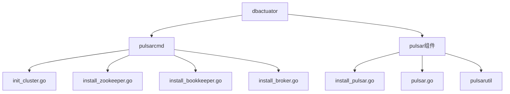
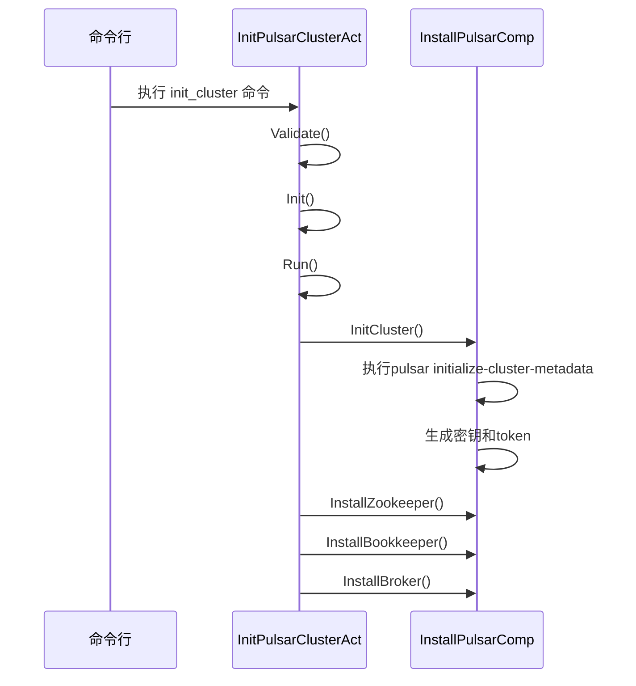
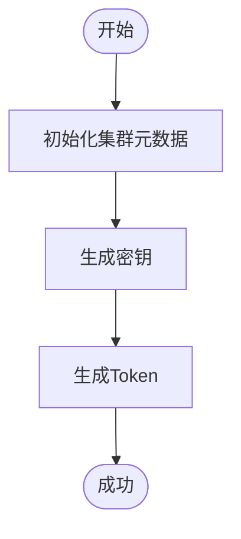
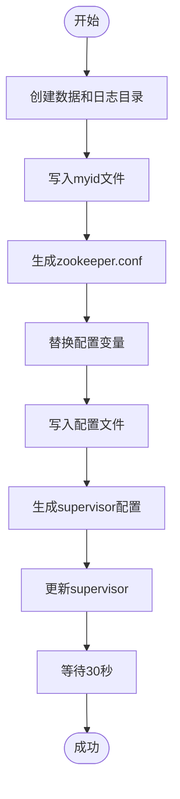
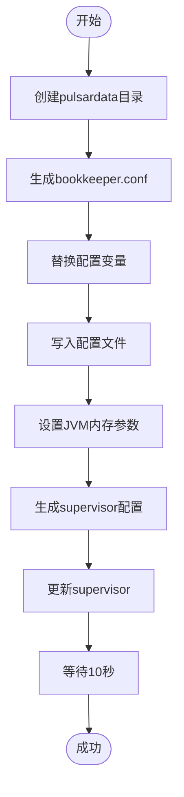
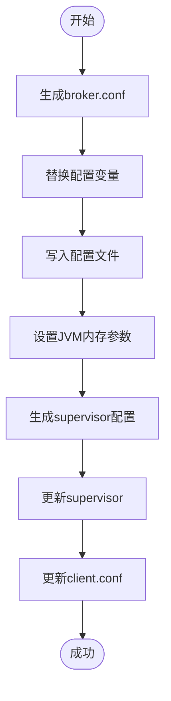
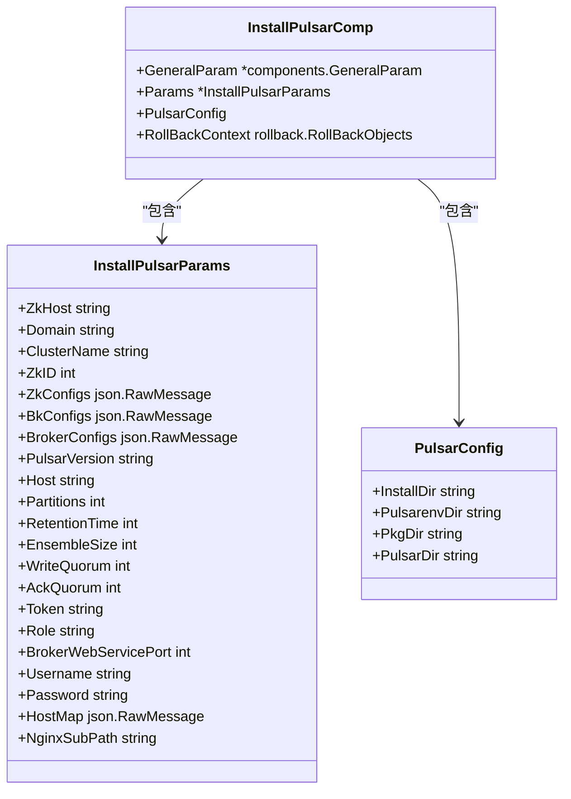

# 集群初始化

<cite>
**本文档引用的文件**  
- [init_cluster.go](file://dbm-services/bigdata/db-tools/dbactuator/internal/subcmd/pulsarcmd/init_cluster.go)
- [install_zookeeper.go](file://dbm-services/bigdata/db-tools/dbactuator/internal/subcmd/pulsarcmd/install_zookeeper.go)
- [install_bookkeeper.go](file://dbm-services/bigdata/db-tools/dbactuator/internal/subcmd/pulsarcmd/install_bookkeeper.go)
- [install_broker.go](file://dbm-services/bigdata/db-tools/dbactuator/internal/subcmd/pulsarcmd/install_broker.go)
- [install_pulsar.go](file://dbm-services/bigdata/db-tools/dbactuator/pkg/components/pulsar/install_pulsar.go)
- [pulsar.go](file://dbm-services/bigdata/db-tools/dbactuator/pkg/components/pulsar/pulsar.go)
- [pulsar_operate.go](file://dbm-services/bigdata/db-tools/dbactuator/pkg/util/pulsarutil/pulsar_operate.go)
- [pulsar_helper.go](file://dbm-services/bigdata/db-tools/dbactuator/pkg/util/pulsarutil/pulsar_helper.go)
- [cst/pulsar.go](file://dbm-services/bigdata/db-tools/dbactuator/pkg/core/cst/pulsar.go)
</cite>

## 目录
1. [引言](#引言)
2. [项目结构](#项目结构)
3. [核心组件](#核心组件)
4. [架构概述](#架构概述)
5. [详细组件分析](#详细组件分析)
6. [依赖分析](#依赖分析)
7. [性能考虑](#性能考虑)
8. [故障排除指南](#故障排除指南)
9. [结论](#结论)

## 引言
本文档详细阐述了 Pulsar 集群初始化的实现逻辑。`init_cluster.go` 作为集群搭建的入口点，协调 ZooKeeper、BookKeeper 和 Broker 三大核心组件的初始化流程。通过调用底层组件（如 `install_zookeeper.go`, `install_bookkeeper.go`, `install_broker.go`）完成分布式系统的部署，并处理各组件间的依赖关系和配置同步。

## 项目结构
Pulsar 集群初始化功能位于 `dbm-services/bigdata/db-tools/dbactuator` 模块中，主要涉及 `internal/subcmd/pulsarcmd` 和 `pkg/components/pulsar` 两个目录。

**Diagram sources**
- [init_cluster.go](file://dbm-services/bigdata/db-tools/dbactuator/internal/subcmd/pulsarcmd/init_cluster.go)
- [install_pulsar.go](file://dbm-services/bigdata/db-tools/dbactuator/pkg/components/pulsar/install_pulsar.go)

**Section sources**
- [init_cluster.go](file://dbm-services/bigdata/db-tools/dbactuator/internal/subcmd/pulsarcmd/init_cluster.go)
- [install_pulsar.go](file://dbm-services/bigdata/db-tools/dbactuator/pkg/components/pulsar/install_pulsar.go)

## 核心组件
`InitPulsarClusterAct` 结构体是集群初始化的核心，它继承自 `BaseOptions` 并包含 `InstallPulsarComp` 服务实例。该组件通过 Cobra 命令行框架暴露 `init_cluster` 命令。

**Section sources**
- [init_cluster.go](file://dbm-services/bigdata/db-tools/dbactuator/internal/subcmd/pulsarcmd/init_cluster.go#L17-L42)

## 架构概述
Pulsar 集群初始化遵循严格的顺序：首先安装 ZooKeeper，然后初始化集群元数据，接着安装 BookKeeper，最后安装 Broker。整个过程由 `InitPulsarClusterAct` 协调。

**Diagram sources**
- [init_cluster.go](file://dbm-services/bigdata/db-tools/dbactuator/internal/subcmd/pulsarcmd/init_cluster.go#L78-L104)
- [install_pulsar.go](file://dbm-services/bigdata/db-tools/dbactuator/pkg/components/pulsar/install_pulsar.go#L244-L293)

## 详细组件分析

### 初始化流程分析
`InitPulsarClusterAct.Run()` 方法定义了初始化步骤，目前仅包含 `InitCluster` 步骤，该步骤负责初始化集群元数据、生成密钥和 token。

**Diagram sources**
- [init_cluster.go](file://dbm-services/bigdata/db-tools/dbactuator/internal/subcmd/pulsarcmd/init_cluster.go#L78-L104)

**Section sources**
- [init_cluster.go](file://dbm-services/bigdata/db-tools/dbactuator/internal/subcmd/pulsarcmd/init_cluster.go#L78-L104)

### ZooKeeper 安装分析
`InstallZookeeper` 方法负责安装和配置 ZooKeeper 实例，包括创建数据目录、写入 myid 文件、生成配置文件和启动服务。

**Diagram sources**
- [install_pulsar.go](file://dbm-services/bigdata/db-tools/dbactuator/pkg/components/pulsar/install_pulsar.go#L162-L236)

**Section sources**
- [install_pulsar.go](file://dbm-services/bigdata/db-tools/dbactuator/pkg/components/pulsar/install_pulsar.go#L162-L236)

### BookKeeper 安装分析
`InstallBookkeeper` 方法负责安装 BookKeeper，包括创建数据目录、生成配置文件、设置 JVM 内存参数和启动服务。

**Diagram sources**
- [install_pulsar.go](file://dbm-services/bigdata/db-tools/dbactuator/pkg/components/pulsar/install_pulsar.go#L301-L387)

**Section sources**
- [install_pulsar.go](file://dbm-services/bigdata/db-tools/dbactuator/pkg/components/pulsar/install_pulsar.go#L301-L387)

### Broker 安装分析
`InstallBroker` 方法负责安装 Pulsar Broker，包括生成配置文件、设置 JVM 内存参数、生成 supervisor 配置和更新 client.conf。

**Diagram sources**
- [install_pulsar.go](file://dbm-services/bigdata/db-tools/dbactuator/pkg/components/pulsar/install_pulsar.go#L396-L470)

**Section sources**
- [install_pulsar.go](file://dbm-services/bigdata/db-tools/dbactuator/pkg/components/pulsar/install_pulsar.go#L396-L470)

## 依赖分析
Pulsar 集群初始化组件依赖于多个子系统和配置项。`InstallPulsarComp` 结构体通过 `Params` 字段接收所有必要的配置参数。

**Diagram sources**
- [install_pulsar.go](file://dbm-services/bigdata/db-tools/dbactuator/pkg/components/pulsar/install_pulsar.go#L23-L53)
- [cst/pulsar.go](file://dbm-services/bigdata/db-tools/dbactuator/pkg/core/cst/pulsar.go)

**Section sources**
- [install_pulsar.go](file://dbm-services/bigdata/db-tools/dbactuator/pkg/components/pulsar/install_pulsar.go#L23-L53)

## 性能考虑
在 `GetHeapAndDirectMemInMi` 函数中，根据系统内存大小动态设置 JVM 堆内存和直接内存。当系统内存超过 128GB 时，设置为 30GB；否则，堆内存占总内存的 1/6，直接内存占 1/3。

**Section sources**
- [pulsar_operate.go](file://dbm-services/bigdata/db-tools/dbactuator/pkg/util/pulsarutil/pulsar_operate.go#L25-L44)

## 故障排除指南
常见错误包括：
- **网络不通**：检查 `ZkHost` 配置的 ZooKeeper 地址是否可达
- **端口冲突**：确保 2181 (ZooKeeper), 3181 (BookKeeper), 6650/8080 (Broker) 端口未被占用
- **配置错误**：验证 `ZkConfigs`, `BkConfigs`, `BrokerConfigs` 的 JSON 格式正确性
- **权限问题**：确保 `mysql` 用户存在且对 `/data/pulsar*` 目录有读写权限

**Section sources**
- [install_pulsar.go](file://dbm-services/bigdata/db-tools/dbactuator/pkg/components/pulsar/install_pulsar.go)
- [pulsar_operate.go](file://dbm-services/bigdata/db-tools/dbactuator/pkg/util/pulsarutil/pulsar_operate.go)

## 结论
`init_cluster.go` 作为 Pulsar 集群初始化的入口点，通过协调 ZooKeeper、BookKeeper 和 Broker 的安装与配置，实现了自动化集群部署。该设计通过模块化的方式将不同组件的安装逻辑分离，提高了代码的可维护性和可扩展性。