# VictoriaMetrics 服务管理

<cite>
**本文档引用的文件**   
- [init.go](file://dbm-services/bigdata/db-tools/dbactuator/internal/subcmd/vmcmd/init.go)
- [install_vmstorage.go](file://dbm-services/bigdata/db-tools/dbactuator/internal/subcmd/vmcmd/install_vmstorage.go)
- [install_vminsert.go](file://dbm-services/bigdata/db-tools/dbactuator/internal/subcmd/vmcmd/install_vminsert.go)
- [install_vmselect.go](file://dbm-services/bigdata/db-tools/dbactuator/internal/subcmd/vmcmd/install_vmselect.go)
- [install_vmauth.go](file://dbm-services/bigdata/db-tools/dbactuator/internal/subcmd/vmcmd/install_vmauth.go)
- [reload_vminsert.go](file://dbm-services/bigdata/db-tools/dbactuator/internal/subcmd/vmcmd/reload_vminsert.go)
- [reload_vmselect.go](file://dbm-services/bigdata/db-tools/dbactuator/internal/subcmd/vmcmd/reload_vmselect.go)
- [start_process.go](file://dbm-services/bigdata/db-tools/dbactuator/internal/subcmd/vmcmd/start_process.go)
- [stop_process.go](file://dbm-services/bigdata/db-tools/dbactuator/internal/subcmd/vmcmd/stop_process.go)
- [decompress_pkg.go](file://dbm-services/bigdata/db-tools/dbactuator/internal/subcmd/vmcmd/decompress_pkg.go)
- [clean_data.go](file://dbm-services/bigdata/db-tools/dbactuator/internal/subcmd/vmcmd/clean_data.go)
- [install_vm.go](file://dbm-services/bigdata/db-tools/dbactuator/pkg/components/victoriametrics/install_vm.go)
</cite>

## 目录
1. [简介](#简介)
2. [核心组件安装](#核心组件安装)
3. [配置热重载机制](#配置热重载机制)
4. [进程管理](#进程管理)
5. [通用包处理与初始化](#通用包处理与初始化)
6. [数据清理功能](#数据清理功能)
7. [集群部署实例](#集群部署实例)
8. [总结](#总结)

## 简介
VictoriaMetrics 是一个高性能、可扩展的监控解决方案，用于收集、存储和查询时间序列数据。在本系统中，通过 `vmcmd` 模块实现对 VictoriaMetrics 集群的全生命周期管理，包括组件安装、配置更新、进程控制、数据清理等操作。该模块基于 Cobra 构建命令行接口，通过统一的执行框架（`subcmd`）协调各个操作步骤，并利用 `rollback` 机制保障操作的可逆性。

**Section sources**
- [init.go](file://dbm-services/bigdata/db-tools/dbactuator/internal/subcmd/vmcmd/init.go#L1-L98)

## 核心组件安装

### VMStorage 安装
`install_vmstorage.go` 文件定义了 `InstallVMStorageAct` 结构体及其对应的命令 `InstallVMStorageCommand`，用于部署 VictoriaMetrics 的存储节点（vmstorage）。该操作通过调用 `InstallVMComp.InstallVMStorage` 方法执行，主要完成以下任务：
- 创建数据目录并设置权限
- 生成启动脚本和 Supervisor 配置文件
- 启动 vmstorage 进程

安装过程依赖于传入的配置参数，如数据路径、保留周期、复制因子等。

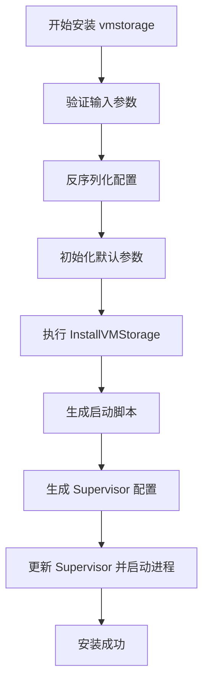

**Diagram sources**
- [install_vmstorage.go](file://dbm-services/bigdata/db-tools/dbactuator/internal/subcmd/vmcmd/install_vmstorage.go#L1-L110)
- [install_vm.go](file://dbm-services/bigdata/db-tools/dbactuator/pkg/components/victoriametrics/install_vm.go#L135-L149)

**Section sources**
- [install_vmstorage.go](file://dbm-services/bigdata/db-tools/dbactuator/internal/subcmd/vmcmd/install_vmstorage.go#L1-L110)

### VMInsert 安装
`install_vminsert.go` 实现了 `InstallVMInsertAct` 结构体，用于部署数据写入节点（vminsert）。其工作流程与 vmstorage 类似，调用 `InstallVMComp.InstallVMInsert` 方法，根据配置生成相应的启动脚本和 Supervisor 配置，实现高可用的数据写入层。

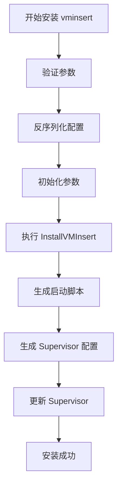

**Diagram sources**
- [install_vminsert.go](file://dbm-services/bigdata/db-tools/dbactuator/internal/subcmd/vmcmd/install_vminsert.go#L1-L106)
- [install_vm.go](file://dbm-services/bigdata/db-tools/dbactuator/pkg/components/victoriametrics/install_vm.go#L156-L169)

**Section sources**
- [install_vminsert.go](file://dbm-services/bigdata/db-tools/dbactuator/internal/subcmd/vmcmd/install_vminsert.go#L1-L106)

### VMSelect 安装
`install_vmselect.go` 提供了 `InstallVMSelectAct` 结构体，用于部署查询节点（vmselect）。它通过 `InstallVMComp.InstallVMSelect` 方法完成安装，确保查询层能够正确连接到存储节点，并支持分布式查询。

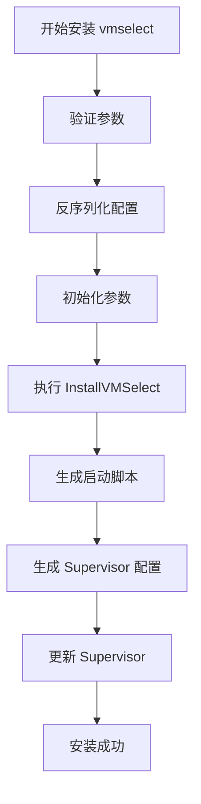

**Diagram sources**
- [install_vmselect.go](file://dbm-services/bigdata/db-tools/dbactuator/internal/subcmd/vmcmd/install_vmselect.go#L1-L96)
- [install_vm.go](file://dbm-services/bigdata/db-tools/dbactuator/pkg/components/victoriametrics/install_vm.go#L176-L189)

**Section sources**
- [install_vmselect.go](file://dbm-services/bigdata/db-tools/dbactuator/internal/subcmd/vmcmd/install_vmselect.go#L1-L96)

### VMAuth 安装
`install_vmauth.go` 中的 `InstallVMAuthAct` 负责部署认证代理（vmauth）。该组件为写入和查询操作提供统一的认证入口。安装过程包括：
- 创建软链接指向 vmauth 可执行文件
- 生成两个独立的配置文件：`vmauth_insert.yaml` 和 `vmauth_select.yaml`
- 分别为写入和查询路径配置路由规则
- 生成对应的 Supervisor 配置并启动服务

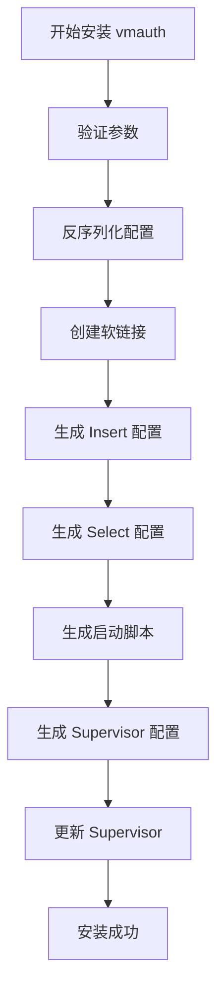

**Diagram sources**
- [install_vmauth.go](file://dbm-services/bigdata/db-tools/dbactuator/internal/subcmd/vmcmd/install_vmauth.go#L1-L106)
- [install_vm.go](file://dbm-services/bigdata/db-tools/dbactuator/pkg/components/victoriametrics/install_vm.go#L191-L259)

**Section sources**
- [install_vmauth.go](file://dbm-services/bigdata/db-tools/dbactuator/internal/subcmd/vmcmd/install_vmauth.go#L1-L106)

## 配置热重载机制

### Reload VMInsert
`reload_vminsert.go` 定义了 `ReloadVMInsertAct`，用于在 vmstorage 集群拓扑发生变化后，重新加载 vminsert 的配置。该操作通过 `InstallVMComp.ReloadVMInsert` 方法实现，主要步骤包括：
- 根据新的存储节点列表重新生成配置
- 更新启动脚本
- 重启 vminsert 进程以应用新配置

此机制避免了手动干预，实现了配置的动态更新。

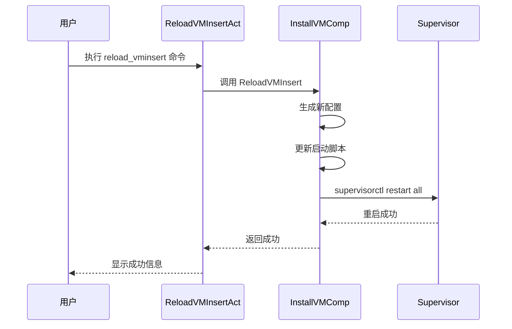

**Diagram sources**
- [reload_vminsert.go](file://dbm-services/bigdata/db-tools/dbactuator/internal/subcmd/vmcmd/reload_vminsert.go#L1-L96)
- [install_vm.go](file://dbm-services/bigdata/db-tools/dbactuator/pkg/components/victoriametrics/install_vm.go#L277-L292)

**Section sources**
- [reload_vminsert.go](file://dbm-services/bigdata/db-tools/dbactuator/internal/subcmd/vmcmd/reload_vminsert.go#L1-L96)

### Reload VMSelect
`reload_vmselect.go` 中的 `ReloadVMSelectAct` 与 `ReloadVMInsertAct` 类似，用于重新加载 vmselect 的配置。当存储层发生变更时，调用此命令可确保查询层能够正确路由请求到新的存储节点。

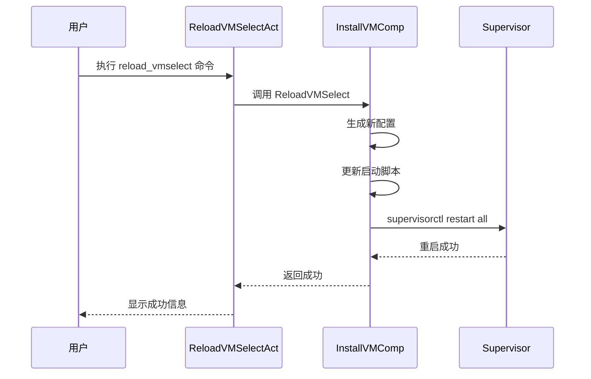

**Diagram sources**
- [reload_vmselect.go](file://dbm-services/bigdata/db-tools/dbactuator/internal/subcmd/vmcmd/reload_vmselect.go#L1-L96)
- [install_vm.go](file://dbm-services/bigdata/db-tools/dbactuator/pkg/components/victoriametrics/install_vm.go#L261-L275)

**Section sources**
- [reload_vmselect.go](file://dbm-services/bigdata/db-tools/dbactuator/internal/subcmd/vmcmd/reload_vmselect.go#L1-L96)

## 进程管理

### 启动进程
`start_process.go` 实现了 `StartProcessAct`，用于启动 VictoriaMetrics 相关进程。它通过调用 `StartStopProcessComp.StartProcess` 方法，利用 Supervisor 管理进程的生命周期。该命令通常在安装完成后或系统重启后执行。

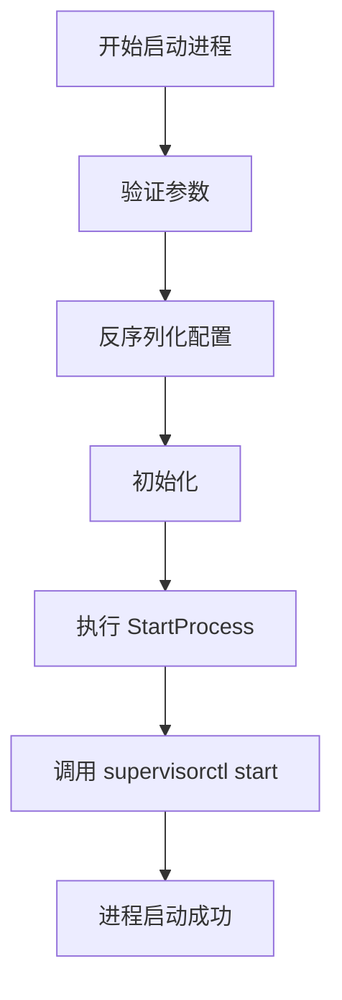

**Diagram sources**
- [start_process.go](file://dbm-services/bigdata/db-tools/dbactuator/internal/subcmd/vmcmd/start_process.go#L1-L96)

**Section sources**
- [start_process.go](file://dbm-services/bigdata/db-tools/dbactuator/internal/subcmd/vmcmd/start_process.go#L1-L96)

### 停止进程
`stop_process.go` 提供了 `StopProcessAct`，用于安全地停止 VictoriaMetrics 进程。它通过 `StartStopProcessComp.StopProcess` 方法，向 Supervisor 发送停止信号，确保数据写入完整后再关闭进程。

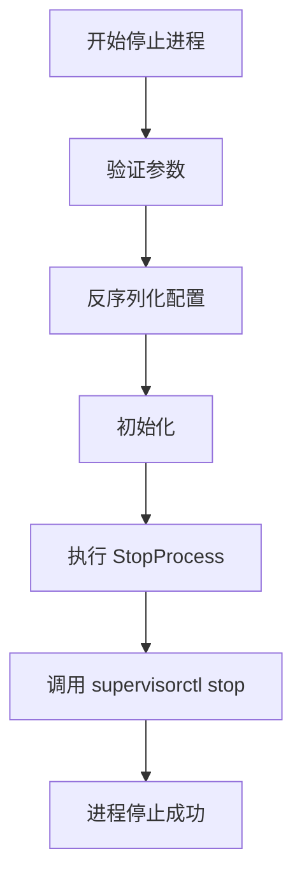

**Diagram sources**
- [stop_process.go](file://dbm-services/bigdata/db-tools/dbactuator/internal/subcmd/vmcmd/stop_process.go#L1-L96)

**Section sources**
- [stop_process.go](file://dbm-services/bigdata/db-tools/dbactuator/internal/subcmd/vmcmd/stop_process.go#L1-L96)

## 通用包处理与初始化

### 包解压
`decompress_pkg.go` 中的 `DecompressVMPkgAct` 负责解压 VictoriaMetrics 的安装包。它调用 `InstallVMComp.DecompressPkg` 方法，将指定版本的 `vmpack-<version>.tar.gz` 解压到 `/data/vmenv` 目录下，为后续安装步骤准备二进制文件。

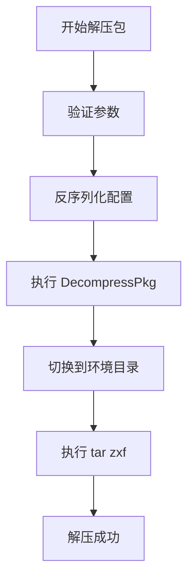

**Diagram sources**
- [decompress_pkg.go](file://dbm-services/bigdata/db-tools/dbactuator/internal/subcmd/vmcmd/decompress_pkg.go#L1-L102)
- [install_vm.go](file://dbm-services/bigdata/db-tools/dbactuator/pkg/components/victoriametrics/install_vm.go#L376-L391)

**Section sources**
- [decompress_pkg.go](file://dbm-services/bigdata/db-tools/dbactuator/internal/subcmd/vmcmd/decompress_pkg.go#L1-L102)

### 初始化流程
`init.go` 定义了 `InitAct`，用于执行 VictoriaMetrics 的初始化操作。该操作包括：
- 创建专用系统用户（mysql）
- 创建必要的目录（数据、日志、环境）
- 设置系统参数（如 `vm.max_map_count`）
- 配置环境变量（如 `VM_HOME`）

这些初始化步骤为 VictoriaMetrics 的稳定运行提供了基础环境保障。

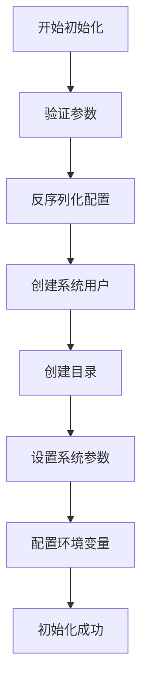

**Diagram sources**
- [init.go](file://dbm-services/bigdata/db-tools/dbactuator/internal/subcmd/vmcmd/init.go#L1-L98)
- [install_vm.go](file://dbm-services/bigdata/db-tools/dbactuator/pkg/components/victoriametrics/install_vm.go#L59-L127)

**Section sources**
- [init.go](file://dbm-services/bigdata/db-tools/dbactuator/internal/subcmd/vmcmd/init.go#L1-L98)

## 数据清理功能
`clean_data.go` 实现了 `CleanDataAct`，用于清理 VictoriaMetrics 的数据目录。该操作通过 `CleanDataComp.CleanData` 方法执行，通常在集群下线或重新部署时使用。它会安全地删除指定路径下的所有数据文件，释放磁盘空间。

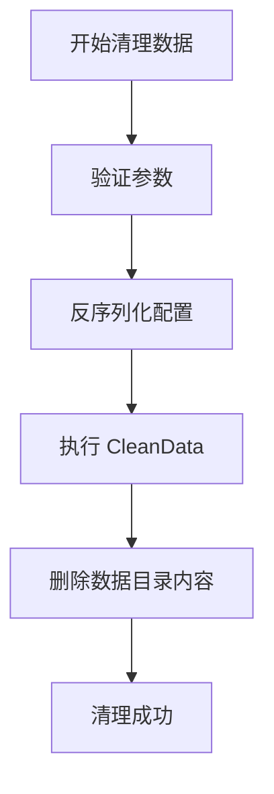

**Diagram sources**
- [clean_data.go](file://dbm-services/bigdata/db-tools/dbactuator/internal/subcmd/vmcmd/clean_data.go#L1-L99)

**Section sources**
- [clean_data.go](file://dbm-services/bigdata/db-tools/dbactuator/internal/subcmd/vmcmd/clean_data.go#L1-L99)

## 集群部署实例
要部署一个具备认证和高可用查询能力的 VictoriaMetrics 集群，可按以下步骤操作：

1.  **初始化环境**：在所有节点上执行 `dbactuator vm init`，创建用户、目录和系统配置。
2.  **解压安装包**：执行 `dbactuator vm decompress_pkg`，解压 VictoriaMetrics 二进制文件。
3.  **部署存储节点**：在存储服务器上执行 `install_vmstorage`，配置数据路径和保留策略。
4.  **部署写入节点**：在写入服务器上执行 `install_vminsert`，配置复制因子和存储节点列表。
5.  **部署查询节点**：在查询服务器上执行 `install_vmselect`，配置存储节点列表。
6.  **部署认证代理**：在网关服务器上执行 `install_vmauth`，配置写入和查询的路由规则。
7.  **启动服务**：在所有节点上执行 `start_process`，启动所有组件。
8.  **配置更新**：当存储节点变更时，执行 `reload_vminsert` 和 `reload_vmselect` 以更新配置。

此流程确保了集群的高可用性、可扩展性和安全性。

**Section sources**
- [init.go](file://dbm-services/bigdata/db-tools/dbactuator/internal/subcmd/vmcmd/init.go#L1-L98)
- [decompress_pkg.go](file://dbm-services/bigdata/db-tools/dbactuator/internal/subcmd/vmcmd/decompress_pkg.go#L1-L102)
- [install_vmstorage.go](file://dbm-services/bigdata/db-tools/dbactuator/internal/subcmd/vmcmd/install_vmstorage.go#L1-L110)
- [install_vminsert.go](file://dbm-services/bigdata/db-tools/dbactuator/internal/subcmd/vmcmd/install_vminsert.go#L1-L106)
- [install_vmselect.go](file://dbm-services/bigdata/db-tools/dbactuator/internal/subcmd/vmcmd/install_vmselect.go#L1-L96)
- [install_vmauth.go](file://dbm-services/bigdata/db-tools/dbactuator/internal/subcmd/vmcmd/install_vmauth.go#L1-L106)
- [start_process.go](file://dbm-services/bigdata/db-tools/dbactuator/internal/subcmd/vmcmd/start_process.go#L1-L96)
- [reload_vminsert.go](file://dbm-services/bigdata/db-tools/dbactuator/internal/subcmd/vmcmd/reload_vminsert.go#L1-L96)
- [reload_vmselect.go](file://dbm-services/bigdata/db-tools/dbactuator/internal/subcmd/vmcmd/reload_vmselect.go#L1-L96)

## 总结
`vmcmd` 模块提供了一套完整的 VictoriaMetrics 集群管理方案。通过模块化的命令设计，实现了从环境初始化、组件安装、进程管理到配置热重载的自动化流程。其基于 Cobra 和 Supervisor 的架构，确保了操作的可靠性和可维护性，为大规模监控系统的部署和运维提供了有力支持。