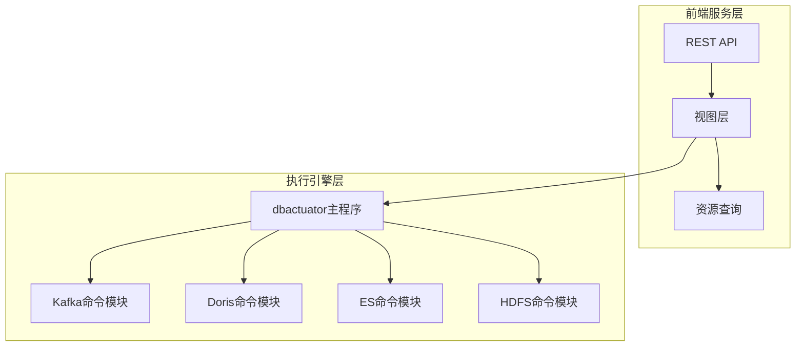
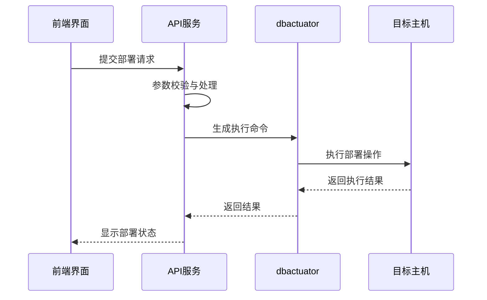
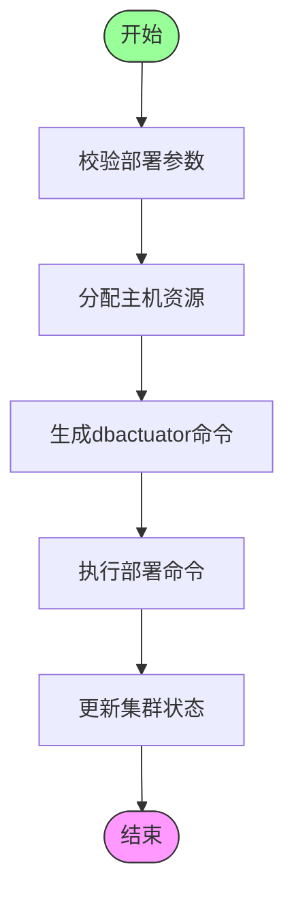
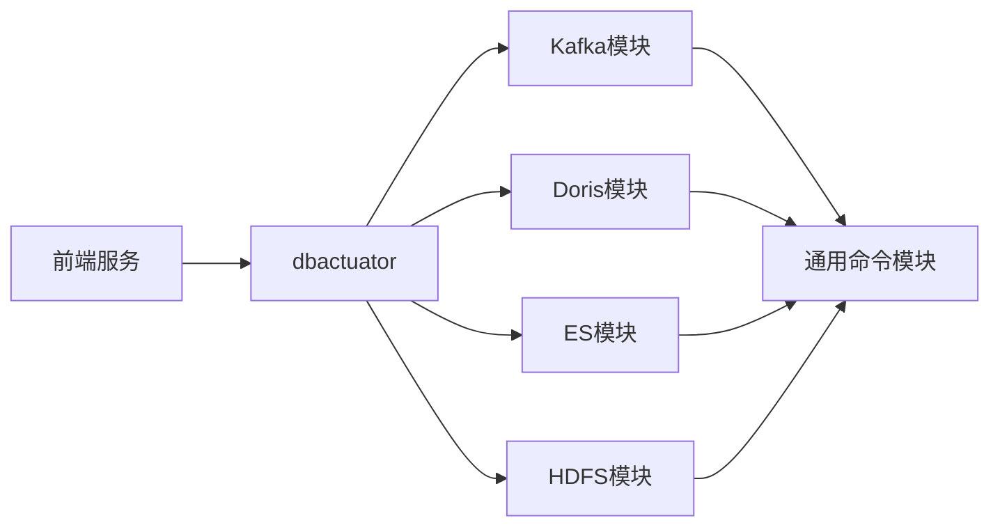

# 大数据组件服务

<cite>
**本文档引用的文件**
- [cmd.go](file://dbm-services/bigdata/db-tools/dbactuator/cmd/cmd.go)
- [subcmd.go](file://dbm-services/bigdata/db-tools/dbactuator/internal/subcmd/subcmd.go)
- [kafkacmd.go](file://dbm-services/bigdata/db-tools/dbactuator/internal/subcmd/kafkacmd/kafkacmd.go)
- [doriscmd.go](file://dbm-services/bigdata/db-tools/dbactuator/internal/subcmd/doriscmd/doriscmd.go)
- [escmd.go](file://dbm-services/bigdata/db-tools/dbactuator/internal/subcmd/escmd/escmd.go)
- [hdfscmd.go](file://dbm-services/bigdata/db-tools/dbactuator/internal/subcmd/hdfscmd/hdfscmd.go)
- [views.py](file://dbm-ui/backend/db_services/bigdata/kafka/views.py)
- [kafka](file://dbm-ui/backend/db_services/bigdata/kafka/)
</cite>

## 目录
1. [引言](#引言)
2. [项目结构](#项目结构)
3. [核心组件](#核心组件)
4. [架构概述](#架构概述)
5. [详细组件分析](#详细组件分析)
6. [依赖分析](#依赖分析)
7. [性能考虑](#性能考虑)
8. [故障排除指南](#故障排除指南)
9. [结论](#结论)

## 引言
本文档旨在深入分析蓝鲸DBM系统中大数据组件服务的架构设计与实现机制。该系统通过`dbactuator`工具统一管理Doris、Elasticsearch、HDFS、Kafka等多种大数据组件，提供部署、配置、启停等全生命周期操作能力。文档将重点解析服务层如何将前端请求转化为具体的`dbactuator`命令参数，并处理执行结果，同时通过实例展示Kafka集群部署的完整流程。

## 项目结构
大数据组件服务主要由两大部分构成：后端执行引擎`dbactuator`和前端服务接口层。`dbactuator`位于`dbm-services/bigdata/db-tools/dbactuator`目录下，采用Go语言开发，基于Cobra框架构建命令行工具。前端服务接口位于`dbm-ui/backend/db_services/bigdata`目录下，使用Python Django框架提供RESTful API。

**图示来源**
- [cmd.go](file://dbm-services/bigdata/db-tools/dbactuator/cmd/cmd.go)
- [views.py](file://dbm-ui/backend/db_services/bigdata/kafka/views.py)

**本节来源**
- [cmd.go](file://dbm-services/bigdata/db-tools/dbactuator/cmd/cmd.go)
- [views.py](file://dbm-ui/backend/db_services/bigdata/kafka/views.py)

## 核心组件
系统的核心组件包括`dbactuator`执行器和各大数据组件的适配模块。`dbactuator`作为统一入口，接收前端传递的JSON格式参数（经Base64编码），通过`DeserializeAndValidate`方法进行反序列化和参数校验。各组件模块（如Kafka、Doris等）实现具体的部署逻辑，包括软件包解压、配置文件渲染、进程启停等操作。

**本节来源**
- [subcmd.go](file://dbm-services/bigdata/db-tools/dbactuator/internal/subcmd/subcmd.go)
- [cmd.go](file://dbm-services/bigdata/db-tools/dbactuator/cmd/cmd.go)

## 架构概述
系统采用分层架构设计，前端通过API接收用户请求，经过参数校验后生成`dbactuator`执行命令。`dbactuator`作为轻量级代理，在目标机器上执行具体操作，其执行结果通过标准输出返回给调用方。整个流程实现了前后端分离，保证了系统的可扩展性和安全性。

**图示来源**
- [cmd.go](file://dbm-services/bigdata/db-tools/dbactuator/cmd/cmd.go)
- [subcmd.go](file://dbm-services/bigdata/db-tools/dbactuator/internal/subcmd/subcmd.go)

## 详细组件分析

### Kafka组件分析
Kafka组件的管理功能由`kafkacmd`模块实现，该模块提供了安装broker、管理zookeeper、启停进程等完整功能。部署流程包括参数校验、资源分配、命令执行和状态更新四个阶段。

#### Kafka部署流程

**图示来源**
- [kafkacmd.go](file://dbm-services/bigdata/db-tools/dbactuator/internal/subcmd/kafkacmd/kafkacmd.go)
- [subcmd.go](file://dbm-services/bigdata/db-tools/dbactuator/internal/subcmd/subcmd.go)

**本节来源**
- [kafkacmd.go](file://dbm-services/bigdata/db-tools/dbactuator/internal/subcmd/kafkacmd/kafkacmd.go)
- [views.py](file://dbm-ui/backend/db_services/bigdata/kafka/views.py)

### Doris组件分析
Doris组件通过`doriscmd`模块进行管理，支持FE（Frontend）和BE（Backend）节点的独立部署与协同工作。该模块实现了Doris集群的初始化、资源配置、进程管理等核心功能。

**本节来源**
- [doriscmd.go](file://dbm-services/bigdata/db-tools/dbactuator/internal/subcmd/doriscmd/doriscmd.go)

### Elasticsearch组件分析
Elasticsearch组件由`escmd`模块负责管理，支持master、hot、cold等不同类型节点的部署。该模块还集成了Kibana和Telegraf监控组件的安装功能。

**本节来源**
- [escmd.go](file://dbm-services/bigdata/db-tools/dbactuator/internal/subcmd/escmd/escmd.go)

### HDFS组件分析
HDFS组件通过`hdfscmd`模块实现，支持NameNode、DataNode、JournalNode等核心组件的部署。该模块还包含了HA（高可用）配置和ZKFC（Zookeeper Failover Controller）的安装。

**本节来源**
- [hdfscmd.go](file://dbm-services/bigdata/db-tools/dbactuator/internal/subcmd/hdfscmd/hdfscmd.go)

## 依赖分析
系统各组件之间通过清晰的接口进行交互，`dbactuator`作为核心执行引擎，被上层服务直接调用。各大数据组件模块作为独立的命令集，通过Cobra框架注册到主命令中，实现了低耦合的设计。

**图示来源**
- [cmd.go](file://dbm-services/bigdata/db-tools/dbactuator/cmd/cmd.go)
- [subcmd.go](file://dbm-services/bigdata/db-tools/dbactuator/internal/subcmd/subcmd.go)

**本节来源**
- [cmd.go](file://dbm-services/bigdata/db-tools/dbactuator/cmd/cmd.go)
- [subcmd.go](file://dbm-services/bigdata/db-tools/dbactuator/internal/subcmd/subcmd.go)

## 性能考虑
系统在设计时充分考虑了执行效率和资源利用率。`dbactuator`采用单进程执行模式，避免了多进程带来的资源开销。通过Base64编码传输参数，减少了网络传输的数据量。日志系统支持分级输出，便于问题排查的同时控制了日志文件大小。

## 故障排除指南
当部署失败时，应首先检查`dbactuator`的日志文件（位于logs/目录下），确认具体的错误信息。常见问题包括参数校验失败、主机连接异常、磁盘空间不足等。系统提供了`--helper`参数，可用于查看各命令的参数说明。

**本节来源**
- [subcmd.go](file://dbm-services/bigdata/db-tools/dbactuator/internal/subcmd/subcmd.go)
- [cmd.go](file://dbm-services/bigdata/db-tools/dbactuator/cmd/cmd.go)

## 结论
大数据组件服务通过`dbactuator`工具实现了对多种大数据组件的统一管理，采用模块化设计，具有良好的扩展性和维护性。系统通过清晰的分层架构和标准化的接口设计，确保了操作的一致性和可靠性，为大数据平台的自动化运维提供了坚实的基础。