# 授权管理

<cite>
**本文档引用的文件**   
- [authorize_rules_v2.py](file://dbm-ui/backend/flow/plugins/components/collections/mysql/authorize_rules_v2.py)
- [authorize_rules.py](file://dbm-ui/backend/flow/plugins/components/collections/mysql/authorize_rules.py)
- [handlers.py](file://dbm-ui/backend/db_services/mysql/permission/authorize/handlers.py)
- [handlers.py](file://dbm-ui/backend/db_services/dbpermission/db_authorize/handlers.py)
- [dataclass.py](file://dbm-ui/backend/db_services/dbpermission/db_authorize/dataclass.py)
- [dataclass.py](file://dbm-ui/backend/db_services/mysql/permission/authorize/dataclass.py)
- [add_priv.go](file://dbm-services/mysql/db-priv/service/v2/add_priv/add_priv.go)
- [add_on_mysql.go](file://dbm-services/mysql/db-priv/service/v2/add_priv/add_on_mysql.go)
- [fetch_target_dbmeta_info.go](file://dbm-services/mysql/db-priv/service/v2/add_priv/fetch_target_dbmeta_info.go)
- [init.go](file://dbm-services/mysql/db-priv/service/v2/add_priv/init.go)
- [main.go](file://dbm-services/mysql/db-priv/main.go)
</cite>

## 目录
1. [引言](#引言)
2. [核心组件分析](#核心组件分析)
3. [权限管理架构](#权限管理架构)
4. [授权操作流程](#授权操作流程)
5. [权限冲突检测与最小权限原则](#权限冲突检测与最小权限原则)
6. [权限审计与合规性检查](#权限审计与合规性检查)
7. [高级功能实现](#高级功能实现)
8. [结论](#结论)

## 引言
本文档详细阐述数据库权限服务中的授权管理功能，重点分析`db_authorize`模块如何处理权限的授予、回收、查询等操作。文档将深入探讨其与`db-priv`后端服务的集成方式，包括权限规则的生成、SQL语句的构建和执行。通过序列图展示从用户发起授权请求到目标数据库完成权限变更的完整数据流。同时，提供权限冲突检测、最小权限原则实施、跨实例授权等高级功能的技术细节，并讨论权限审计和合规性检查的实现机制。

## 核心组件分析

### db_authorize模块
`db_authorize`模块是数据库权限管理的核心组件，负责处理所有与授权相关的业务逻辑。该模块通过`AuthorizeHandler`类封装了授权相关的处理操作，提供了统一的接口供上层应用调用。

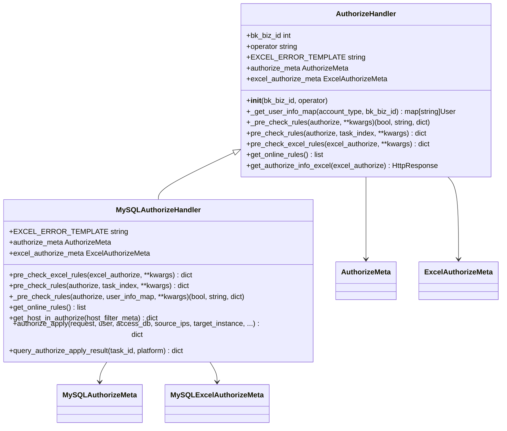

**代码片段路径**
- [dbm-ui/backend/db_services/dbpermission/db_authorize/handlers.py](file://dbm-ui/backend/db_services/dbpermission/db_authorize/handlers.py#L29-L209)
- [dbm-ui/backend/db_services/mysql/permission/authorize/handlers.py](file://dbm-ui/backend/db_services/mysql/permission/authorize/handlers.py#L42-L277)

### db-priv后端服务
`db-priv`后端服务是权限管理的执行引擎，负责与目标数据库实例进行交互，执行具体的权限变更操作。该服务通过Go语言实现，提供了高性能的权限管理能力。

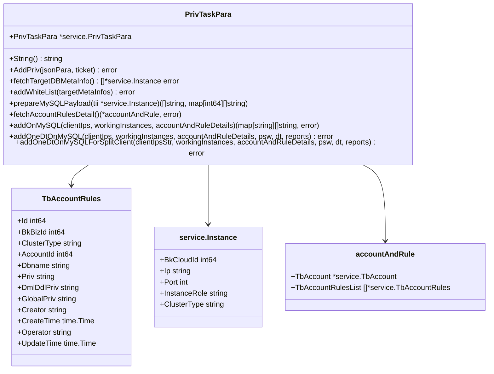

**代码片段路径**
- [dbm-services/mysql/db-priv/service/v2/add_priv/init.go](file://dbm-services/mysql/db-priv/service/v2/add_priv/init.go#L9-L32)
- [dbm-services/mysql/db-priv/service/v2/add_priv/add_priv.go](file://dbm-services/mysql/db-priv/service/v2/add_priv/add_priv.go#L14-L198)
- [dbm-services/mysql/db-priv/service/v2/add_priv/add_on_mysql.go](file://dbm-services/mysql/db-priv/service/v2/add_priv/add_on_mysql.go#L15-L238)

## 权限管理架构

### 系统架构概述
数据库权限管理服务采用分层架构设计，分为前端应用层、业务逻辑层和后端执行层。前端应用层通过API接口接收用户请求，业务逻辑层负责权限规则的校验和预处理，后端执行层负责与目标数据库实例进行交互，执行具体的权限变更操作。

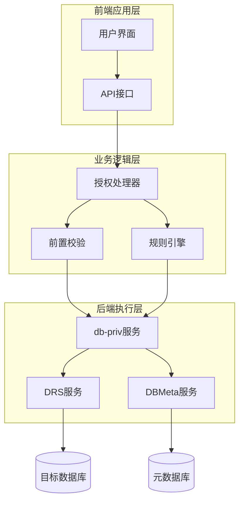

**代码片段路径**
- [dbm-ui/backend/db_services/mysql/permission/authorize/handlers.py](file://dbm-ui/backend/db_services/mysql/permission/authorize/handlers.py#L42-L277)
- [dbm-services/mysql/db-priv/main.go](file://dbm-services/mysql/db-priv/main.go#L29-L51)

### 数据流分析
从用户发起授权请求到目标数据库完成权限变更的完整数据流如下：

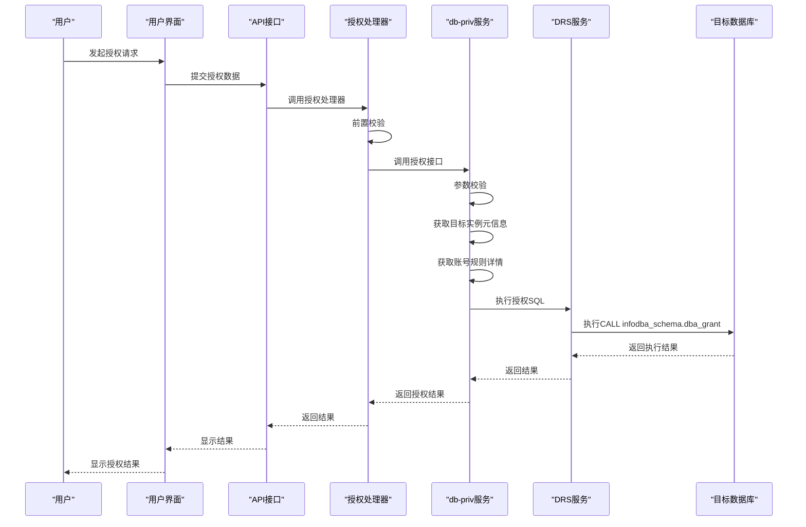

**代码片段路径**
- [dbm-ui/backend/flow/plugins/components/collections/mysql/authorize_rules_v2.py](file://dbm-ui/backend/flow/plugins/components/collections/mysql/authorize_rules_v2.py#L88-L149)
- [dbm-services/mysql/db-priv/service/v2/add_priv/add_priv.go](file://dbm-services/mysql/db-priv/service/v2/add_priv/add_priv.go#L14-L198)

## 授权操作流程

### 授权请求处理
当用户发起授权请求时，系统首先对请求参数进行校验，然后调用`db-priv`服务执行具体的授权操作。授权请求的处理流程如下：

1. 接收用户提交的授权数据，包括用户、访问数据库、源IP、目标实例等信息
2. 对授权数据进行前置校验，检查参数的完整性和合法性
3. 调用`db-priv`服务的`AddPriv`接口执行授权操作
4. 返回授权结果给用户

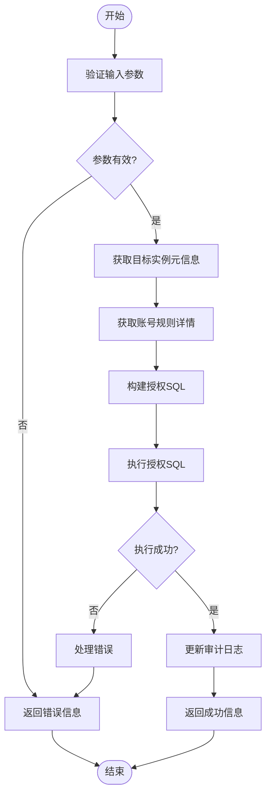

**代码片段路径**
- [dbm-services/mysql/db-priv/service/v2/add_priv/add_priv.go](file://dbm-services/mysql/db-priv/service/v2/add_priv/add_priv.go#L14-L198)
- [dbm-services/mysql/db-priv/service/v2/add_priv/add_on_mysql.go](file://dbm-services/mysql/db-priv/service/v2/add_priv/add_on_mysql.go#L15-L238)

### 权限规则生成
权限规则的生成是授权管理的核心环节，系统需要根据用户请求生成相应的权限规则，并将其存储在元数据库中。权限规则的生成流程如下：

1. 解析用户提交的授权数据，提取用户、数据库、权限类型等信息
2. 根据集群类型确定权限规则的生成策略
3. 生成具体的权限规则，包括数据库级别的权限和全局权限
4. 将生成的权限规则存储到元数据库中

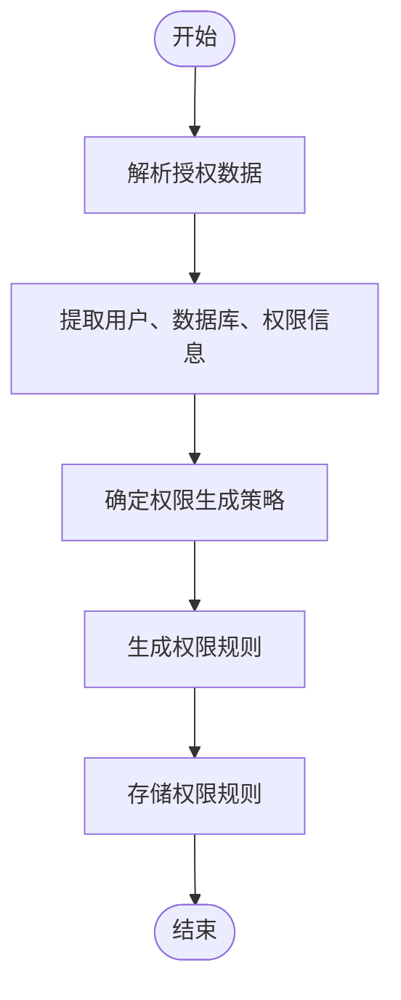

**代码片段路径**
- [dbm-services/mysql/db-priv/service/v2/add_priv/init.go](file://dbm-services/mysql/db-priv/service/v2/add_priv/init.go#L18-L32)
- [dbm-services/mysql/db-priv/service/v2/add_priv/add_priv.go](file://dbm-services/mysql/db-priv/service/v2/add_priv/add_priv.go#L130-L139)

## 权限冲突检测与最小权限原则

### 权限冲突检测
系统在执行授权操作前会进行权限冲突检测，确保不会产生权限冲突。权限冲突检测主要通过以下方式实现：

1. 在执行授权SQL时，目标数据库会返回冲突信息
2. 系统解析数据库返回的冲突信息，提取冲突详情
3. 将冲突信息返回给用户，提示用户解决冲突

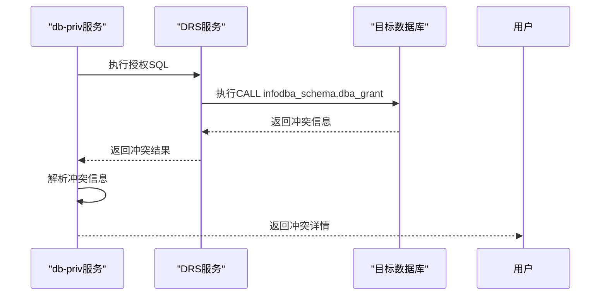

**代码片段路径**
- [dbm-services/mysql/db-priv/service/v2/add_priv/add_on_mysql.go](file://dbm-services/mysql/db-priv/service/v2/add_priv/add_on_mysql.go#L172-L186)
- [dbm-services/mysql/db-priv/service/v2/add_priv/add_on_mysql.go](file://dbm-services/mysql/db-priv/service/v2/add_priv/add_on_mysql.go#L190-L237)

### 最小权限原则实施
系统通过以下方式实施最小权限原则：

1. 限制授权范围，只允许用户访问必要的数据库和表
2. 限制权限类型，只授予用户完成工作所需的最小权限
3. 限制访问源IP，只允许指定的IP地址访问数据库
4. 定期审查权限，及时回收不再需要的权限

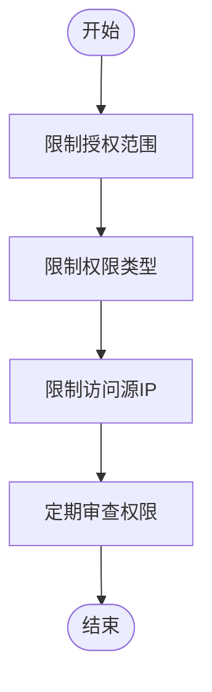

**代码片段路径**
- [dbm-services/mysql/db-priv/service/v2/add_priv/add_priv.go](file://dbm-services/mysql/db-priv/service/v2/add_priv/add_priv.go#L33-L55)
- [dbm-ui/backend/db_services/mysql/permission/authorize/handlers.py](file://dbm-ui/backend/db_services/mysql/permission/authorize/handlers.py#L82-L95)

## 权限审计与合规性检查

### 权限审计
系统通过以下方式实现权限审计：

1. 记录所有授权操作的详细信息，包括操作者、操作时间、操作内容等
2. 将审计日志存储在独立的审计数据库中，确保日志的完整性和安全性
3. 提供审计日志查询接口，方便管理员查询和分析审计日志

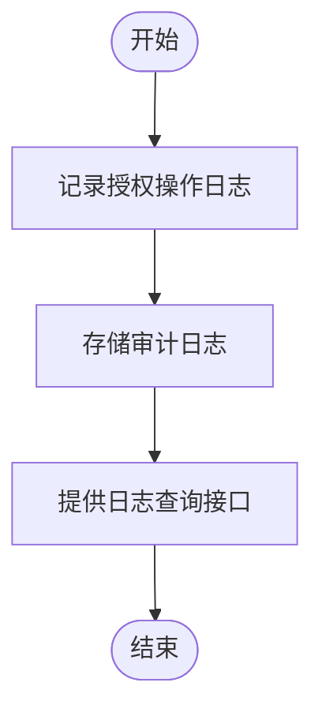

**代码片段路径**
- [dbm-services/mysql/db-priv/service/v2/add_priv/add_priv.go](file://dbm-services/mysql/db-priv/service/v2/add_priv/add_priv.go#L64-L72)
- [dbm-ui/backend/iam_app/handlers/drf_perm/base.py](file://dbm-ui/backend/iam_app/handlers/drf_perm/base.py#L109-L141)

### 合规性检查
系统通过以下方式实现合规性检查：

1. 定期扫描数据库权限配置，检查是否符合安全策略
2. 识别并报告不符合安全策略的权限配置
3. 提供修复建议，帮助管理员修复不符合安全策略的权限配置

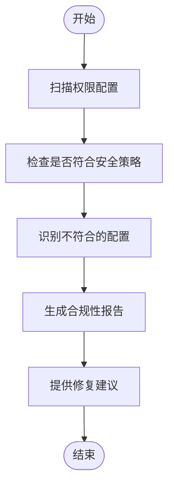

**代码片段路径**
- [dbm-ui/backend/flow/plugins/components/collections/spider/upgrade_key_word_check.py](file://dbm-ui/backend/flow/plugins/components/collections/spider/upgrade_key_word_check.py#L243-L567)

## 高级功能实现

### 跨实例授权
系统支持跨实例授权功能，允许用户一次性对多个数据库实例进行授权。跨实例授权的实现方式如下：

1. 接收用户提交的多个目标实例
2. 对每个目标实例并行执行授权操作
3. 汇总所有实例的授权结果，返回给用户

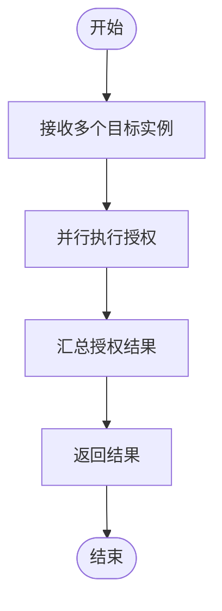

**代码片段路径**
- [dbm-services/mysql/db-priv/service/v2/add_priv/add_priv.go](file://dbm-services/mysql/db-priv/service/v2/add_priv/add_priv.go#L98-L156)

### 批量授权
系统支持批量授权功能，允许用户通过Excel文件批量导入授权规则。批量授权的实现方式如下：

1. 接收用户上传的Excel文件
2. 解析Excel文件中的授权规则
3. 对每条授权规则进行前置校验
4. 执行批量授权操作

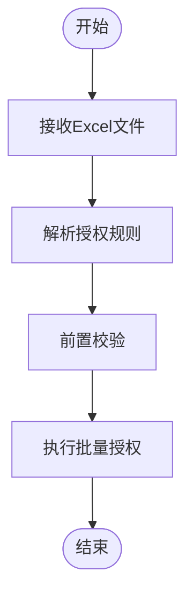

**代码片段路径**
- [dbm-ui/backend/db_services/dbpermission/db_authorize/handlers.py](file://dbm-ui/backend/db_services/dbpermission/db_authorize/handlers.py#L90-L144)
- [dbm-ui/backend/db_services/mysql/permission/authorize/handlers.py](file://dbm-ui/backend/db_services/mysql/permission/authorize/handlers.py#L51-L58)

## 结论
本文档详细阐述了数据库权限服务中的授权管理功能，分析了`db_authorize`模块如何处理权限的授予、回收、查询等操作，以及其与`db-priv`后端服务的集成方式。通过序列图展示了从用户发起授权请求到目标数据库完成权限变更的完整数据流，并提供了权限冲突检测、最小权限原则实施、跨实例授权等高级功能的技术细节。同时，讨论了权限审计和合规性检查的实现机制。这些功能共同构成了一个完整的数据库权限管理体系，为数据库的安全管理提供了有力支持。