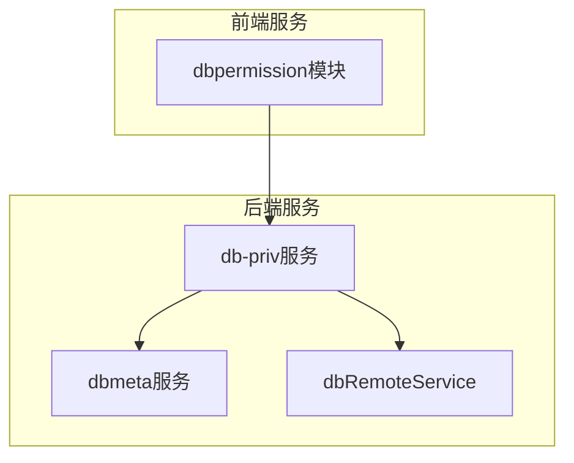
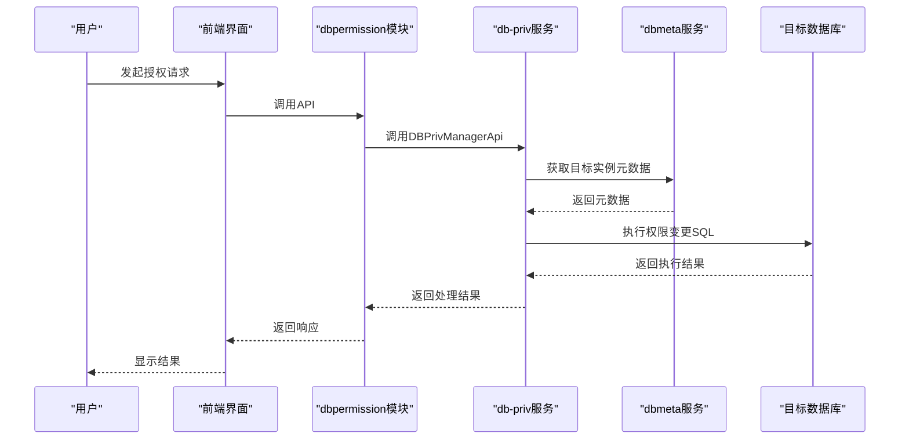
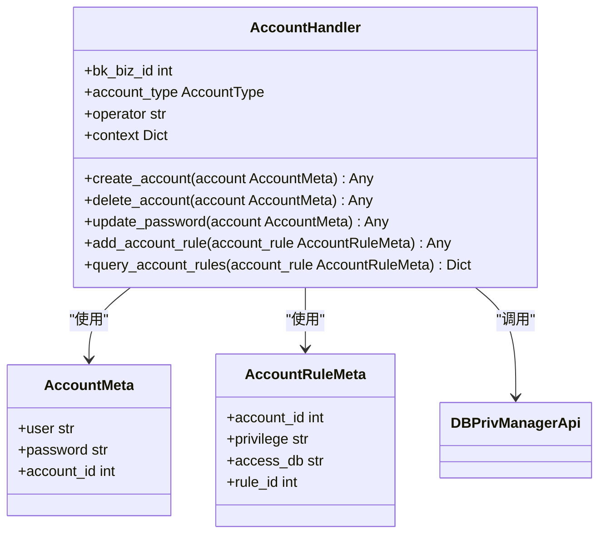
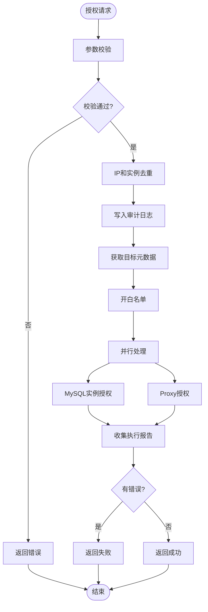
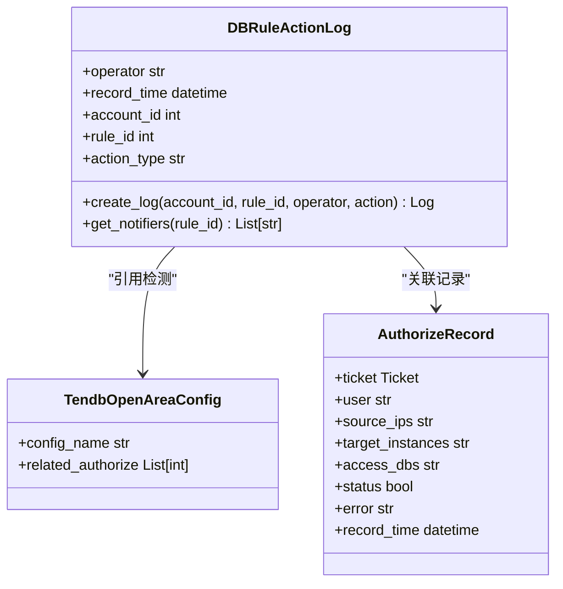
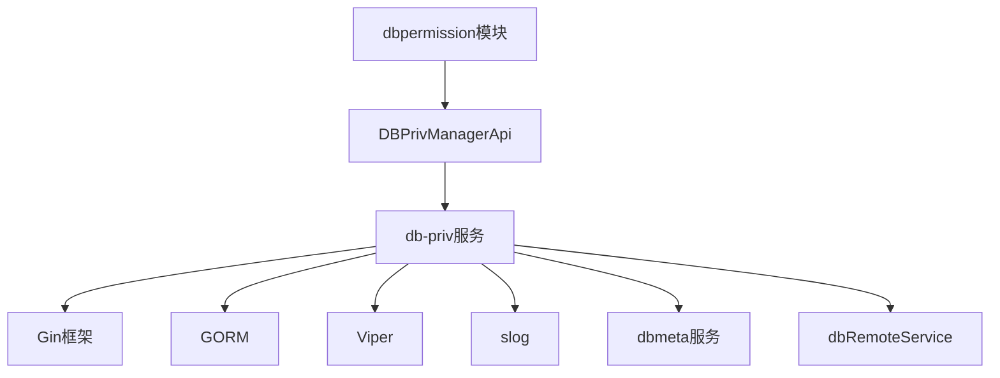

# 数据库权限服务

<cite>
**本文档引用的文件**
- [main.go](file://dbm-services/mysql/db-priv/main.go)
- [add_priv.go](file://dbm-services/mysql/db-priv/service/v2/add_priv/add_priv.go)
- [add_priv.go](file://dbm-services/mysql/db-priv/handler/v2/add_priv.go)
- [init.go](file://dbm-services/mysql/db-priv/service/v2/add_priv/init.go)
- [handlers.py](file://dbm-ui/backend/db_services/dbpermission/db_account/handlers.py)
- [models.py](file://dbm-ui/backend/db_services/dbpermission/db_authorize/models.py)
- [client.py](file://dbm-ui/backend/components/mysql_priv_manager/client.py)
</cite>

## 目录
1. [引言](#引言)
2. [项目结构](#项目结构)
3. [核心组件](#核心组件)
4. [架构概述](#架构概述)
5. [详细组件分析](#详细组件分析)
6. [依赖分析](#依赖分析)
7. [性能考虑](#性能考虑)
8. [故障排除指南](#故障排除指南)
9. [结论](#结论)

## 引言
本文档详细阐述了数据库权限服务的架构与实现。重点分析`dbpermission`模块如何处理账号管理、权限授权、权限回收等操作，解释其与`db-priv`后端服务的集成方式，包括权限规则的生成、SQL语句的构建和执行。通过序列图展示从用户发起授权请求到目标数据库完成权限变更的完整数据流。提供权限冲突检测、最小权限原则实施等高级功能的技术细节，并讨论权限审计和合规性检查的实现。

## 项目结构
数据库权限服务主要由两个核心模块组成：`db-priv`后端服务和`dbpermission`前端服务。`db-priv`服务位于`dbm-services/mysql/db-priv/`目录下，是权限管理的核心后端服务，负责处理所有权限相关的业务逻辑。`dbpermission`模块位于`dbm-ui/backend/db_services/dbpermission/`目录下，作为前端服务层，提供账号管理和权限授权的API接口。

**图源**
- [main.go](file://dbm-services/mysql/db-priv/main.go#L45-L46)
- [handlers.py](file://dbm-ui/backend/db_services/dbpermission/db_account/handlers.py#L19)

**本节来源**
- [main.go](file://dbm-services/mysql/db-priv/main.go#L1-L143)
- [handlers.py](file://dbm-ui/backend/db_services/dbpermission/db_account/handlers.py#L1-L441)

## 核心组件
数据库权限服务的核心组件包括账号管理、权限授权、权限回收等功能。`db-priv`服务通过Gin框架提供RESTful API接口，处理来自前端的权限管理请求。服务启动时会初始化数据库连接，并根据配置文件中的设置进行元数据库migration操作。权限服务通过`DBPrivManagerApi`与前端进行交互，实现账号创建、删除、密码修改以及权限规则的增删改查等操作。

**本节来源**
- [main.go](file://dbm-services/mysql/db-priv/main.go#L29-L78)
- [handlers.py](file://dbm-ui/backend/db_services/dbpermission/db_account/handlers.py#L40-L441)

## 架构概述
数据库权限服务采用分层架构设计，前端`dbpermission`模块通过API调用后端`db-priv`服务。`db-priv`服务作为核心权限管理服务，负责处理所有权限相关的业务逻辑，包括权限规则的生成、SQL语句的构建和执行。服务通过`util.DbmetaClient`和`util.DrsClient`与`dbmeta`和`dbRemoteService`等外部服务进行通信，获取目标数据库的元数据信息和执行远程操作。

**图源**
- [main.go](file://dbm-services/mysql/db-priv/main.go#L45-L46)
- [handlers.py](file://dbm-ui/backend/db_services/dbpermission/db_account/handlers.py#L100-L108)

## 详细组件分析

### 账号管理分析
`dbpermission`模块提供了完整的账号管理功能，包括账号创建、删除、密码修改等操作。`AccountHandler`类封装了所有账号相关的处理逻辑，通过`DBPrivManagerApi`与后端服务进行通信。账号创建时，系统会生成随机密码并通过加密通道传输，确保密码安全。账号删除前会检查是否存在关联的权限规则，防止误删导致权限混乱。

**图源**
- [handlers.py](file://dbm-ui/backend/db_services/dbpermission/db_account/handlers.py#L40-L267)
- [client.py](file://dbm-ui/backend/components/mysql_priv_manager/client.py#L203-L225)

**本节来源**
- [handlers.py](file://dbm-ui/backend/db_services/dbpermission/db_account/handlers.py#L40-L267)
- [client.py](file://dbm-ui/backend/components/mysql_priv_manager/client.py#L203-L225)

### 权限授权分析
权限授权是数据库权限服务的核心功能，通过`add_priv`模块实现。当用户发起授权请求时，`db-priv`服务会进行严格的参数校验，包括业务ID、集群类型、源IP列表、目标实例和权限规则等。服务会去重处理源IP和目标实例，确保授权操作的准确性。授权过程中，系统会记录详细的审计日志，包括操作人、工单号、请求参数和执行时间等信息。

**图源**
- [add_priv.go](file://dbm-services/mysql/db-priv/service/v2/add_priv/add_priv.go#L14-L198)
- [add_priv.go](file://dbm-services/mysql/db-priv/handler/v2/add_priv.go#L16-L38)

**本节来源**
- [add_priv.go](file://dbm-services/mysql/db-priv/service/v2/add_priv/add_priv.go#L14-L198)
- [add_priv.go](file://dbm-services/mysql/db-priv/handler/v2/add_priv.go#L16-L38)

### 高级功能分析
数据库权限服务提供了权限冲突检测、最小权限原则实施等高级功能。`DBRuleActionLog`模型记录了所有权限变更操作，包括创建、修改、删除和授权等，为权限审计和合规性检查提供了数据基础。系统通过`TendbOpenAreaConfig`模型检测权限规则是否被开区模板引用，防止删除正在使用的权限规则。权限变更记录中还包含了通知人列表功能，可以获取曾经授权过的人员名单，便于后续沟通和协调。

**图源**
- [models.py](file://dbm-ui/backend/db_services/dbpermission/db_authorize/models.py#L49-L89)
- [handlers.py](file://dbm-ui/backend/db_services/dbpermission/db_account/handlers.py#L252-L254)

**本节来源**
- [models.py](file://dbm-ui/backend/db_services/dbpermission/db_authorize/models.py#L49-L89)
- [handlers.py](file://dbm-ui/backend/db_services/dbpermission/db_account/handlers.py#L252-L254)

## 依赖分析
数据库权限服务依赖多个外部服务和组件。`db-priv`服务依赖`dbmeta`服务获取目标数据库的元数据信息，依赖`dbRemoteService`执行远程数据库操作。前端`dbpermission`模块依赖`DBPrivManagerApi`与后端服务通信。服务使用Gin框架处理HTTP请求，使用GORM进行数据库操作，使用Viper管理配置文件。日志系统采用`slog`包，支持不同级别的日志输出和文件轮转。

**图源**
- [main.go](file://dbm-services/mysql/db-priv/main.go#L22-L27)
- [go.mod](file://dbm-services/mysql/db-priv/go.mod#L7-L22)

**本节来源**
- [main.go](file://dbm-services/mysql/db-priv/main.go#L22-L27)
- [go.mod](file://dbm-services/mysql/db-priv/go.mod#L7-L22)

## 性能考虑
数据库权限服务在设计时充分考虑了性能因素。授权操作采用并行处理机制，通过goroutine并发处理多个目标实例的授权请求，显著提高了处理效率。服务使用连接池管理数据库连接，避免频繁创建和销毁连接带来的性能开销。日志系统支持文件轮转，防止日志文件过大影响系统性能。配置文件采用Viper库管理，支持热加载，无需重启服务即可更新配置。

## 故障排除指南
当权限服务出现问题时，首先检查服务日志，日志文件路径由配置文件中的`log.path`参数指定。检查`dbmeta`和`dbRemoteService`服务是否正常运行，确保网络连接畅通。对于授权失败的情况，查看返回的错误信息和执行报告，定位具体失败的实例和原因。如果遇到数据库连接问题，检查数据库配置和连接字符串是否正确。对于性能问题，可以启用debug日志级别，分析各环节的执行时间。

**本节来源**
- [main.go](file://dbm-services/mysql/db-priv/main.go#L119-L141)
- [add_priv.go](file://dbm-services/mysql/db-priv/service/v2/add_priv/add_priv.go#L64-L72)

## 结论
数据库权限服务通过`db-priv`和`dbpermission`两个核心模块，实现了完整的数据库权限管理功能。服务采用分层架构设计，前后端分离，职责清晰。通过严格的参数校验、并行处理机制和详细的审计日志，确保了权限管理的安全性和高效性。服务与`dbmeta`和`dbRemoteService`等外部服务紧密集成，实现了从权限申请到目标数据库执行的完整闭环。未来可以进一步优化权限冲突检测算法，增强最小权限原则的实施力度，提高系统的安全性和合规性。