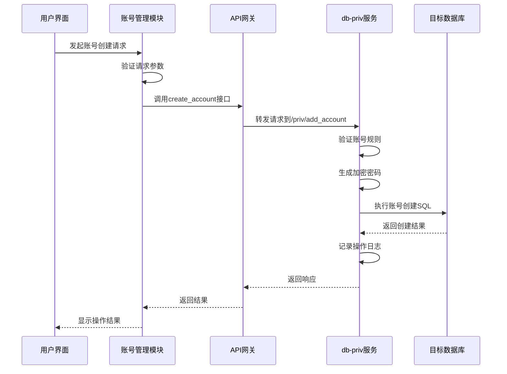

# 账号管理

<cite>
**本文档引用的文件**
- [client.py](file://dbm-ui/backend/components/mysql_priv_manager/client.py)
- [__init__.py](file://dbm-ui/backend/components/mysql_priv_manager/__init__.py)
</cite>

## 目录
1. [简介](#简介)
2. [账号管理功能概述](#账号管理功能概述)
3. [核心操作接口](#核心操作接口)
4. [与db-priv后端服务的集成](#与db-priv后端服务的集成)
5. [账号操作的数据流](#账号操作的数据流)
6. [高级功能实现](#高级功能实现)
7. [审计与合规性检查](#审计与合规性检查)
8. [总结](#总结)

## 简介
本文档详细阐述了数据库权限服务中的账号管理功能，重点分析`db_account`模块如何处理账号的创建、查询、修改和删除操作。文档解释了该模块与`db-priv`后端服务的集成方式，包括账号信息的存储、验证和同步机制。通过序列图展示了从用户发起账号操作请求到目标数据库完成账号变更的完整数据流，并提供了账号命名规范、密码策略、状态管理等高级功能的技术细节。

**Section sources**
- [client.py](file://dbm-ui/backend/components/mysql_priv_manager/client.py#L1-L227)

## 账号管理功能概述
账号管理模块是数据库权限服务的核心组件，负责对数据库账号进行全生命周期管理。该模块通过封装对`db-priv`后端服务的API调用，为上层应用提供统一的账号管理接口。主要功能包括账号的创建、删除、密码更新、查询以及相关的权限规则管理。

模块采用面向对象的设计模式，通过`_DBPrivManagerApi`类封装所有API接口，每个接口方法对应一个具体的账号管理操作。这种设计模式提高了代码的可维护性和可扩展性，使得新增或修改接口变得简单高效。

**Section sources**
- [client.py](file://dbm-ui/backend/components/mysql_priv_manager/client.py#L18-L227)

## 核心操作接口
账号管理模块提供了完整的CRUD（创建、读取、更新、删除）操作接口：

### 账号创建
通过`create_account`接口实现账号创建功能，该接口向`/priv/add_account`端点发送POST请求。在创建账号前，系统会进行必要的前置检查，确保账号符合命名规范和安全策略。

### 账号查询
提供`get_account`和`get_account_include_password`两个接口用于查询账号信息。前者返回账号基本信息，后者包含密码信息，权限更高，使用时需谨慎。

### 账号修改
`update_password`接口用于修改账号密码，对应`/priv/modify_account`端点。系统支持对管理账号密码的特殊处理，通过`modify_admin_password`接口实现。

### 账号删除
`delete_account`接口负责账号删除操作，向`/priv/delete_account`端点发送请求。删除操作会进行完整性检查，确保不会影响依赖该账号的业务。

**Section sources**
- [client.py](file://dbm-ui/backend/components/mysql_priv_manager/client.py#L63-L72)

## 与db-priv后端服务的集成
账号管理模块通过API网关与`db-priv`后端服务进行集成，实现了前后端的解耦。集成方式如下：

### API网关配置
模块通过`MYSQL_PRIV_MANAGER_APIGW_DOMAIN`常量定义API网关域名，所有请求都通过这个统一入口转发到后端服务。这种设计提高了系统的安全性和可维护性。

### 请求封装机制
使用`generate_data_api`方法统一生成API接口，该方法封装了HTTP方法、URL、描述等信息，确保了接口调用的一致性和规范性。每个API接口都配有详细的描述信息，便于开发和维护。

### 超时控制
考虑到权限操作可能涉及复杂的验证和同步过程，模块设置了默认的超时时间（3小时），通过`TIMEOUT`常量定义。对于不同的操作，可以根据需要调整超时设置。

### 错误处理
基于`BaseApi`基类，继承了统一的错误处理机制，能够捕获和处理网络异常、认证失败等各种错误情况，确保系统的稳定性。

**Section sources**
- [client.py](file://dbm-ui/backend/components/mysql_priv_manager/client.py#L18-L23)

## 账号操作的数据流

**Diagram sources**
- [client.py](file://dbm-ui/backend/components/mysql_priv_manager/client.py#L63-L67)

## 高级功能实现
### 账号命名规范
系统通过`account_rule_detail`和`list_account_rules`接口管理账号命名规则。规则包括：
- 账号长度限制
- 字符集要求
- 前缀/后缀规范
- 业务标识要求

### 密码策略
实现了严格的密码策略管理：
- 通过`check_password`接口校验密码强度
- 支持密码复杂度规则配置
- 提供`get_random_string`接口生成符合策略的随机密码
- 使用公钥加密传输敏感信息

### 状态管理
账号状态通过以下机制管理：
- 操作前置检查（dry run）机制
- 状态变更日志记录
- 多实例间权限克隆功能
- 安全规则的动态调整

### 权限克隆
提供实例间和客户端权限克隆功能：
- `clone_instance`：实现实例间权限复制
- `clone_client`：实现客户端权限复制
- 配套的前置检查接口确保克隆操作的安全性

**Section sources**
- [client.py](file://dbm-ui/backend/components/mysql_priv_manager/client.py#L27-L56)

## 审计与合规性检查
### 操作审计
系统记录所有账号管理操作：
- 通过`get_online_rules`接口查询现网授权记录
- 记录操作时间、操作人、操作内容
- 保留操作前后的状态对比

### 合规性检查
实现多层次的合规性保障：
- 前置检查机制：在执行操作前验证是否符合安全规则
- 安全规则管理：通过`get_security_rule`、`add_security_rule`等接口动态管理安全策略
- 业务白名单：通过`get_randomize_exclude`和`modify_randomize_exclude`接口管理不参与随机化的业务

### 密码安全管理
- 密码加密存储
- 密码变更历史记录
- 定期密码轮换提醒
- 异常登录检测

**Section sources**
- [client.py](file://dbm-ui/backend/components/mysql_priv_manager/client.py#L158-L187)

## 总结
账号管理模块通过与`db-priv`后端服务的紧密集成，实现了对数据库账号的全面管理。模块设计遵循高内聚、低耦合的原则，通过统一的API封装提供了稳定可靠的服务。系统不仅支持基本的CRUD操作，还提供了丰富的高级功能，如权限克隆、安全规则管理、合规性检查等，满足了企业级数据库管理的复杂需求。通过完善的审计机制和安全策略，确保了账号管理操作的可追溯性和安全性。