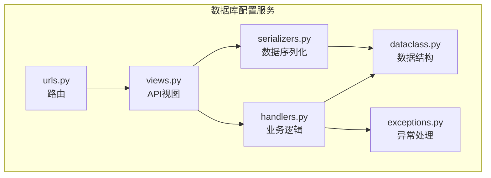
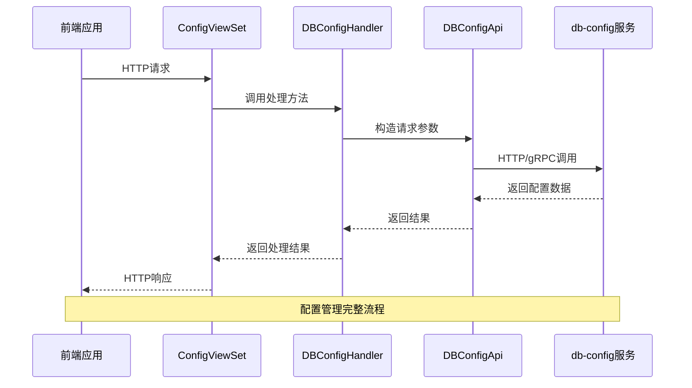
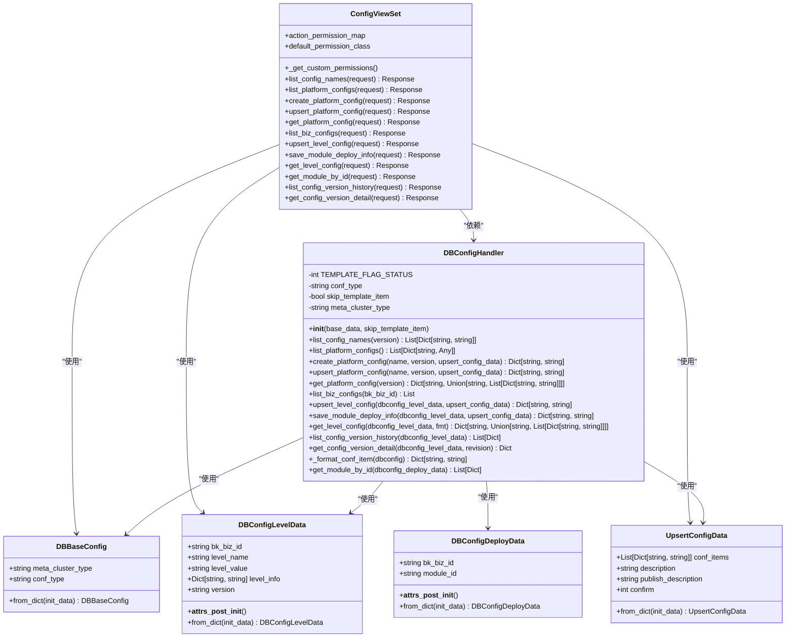
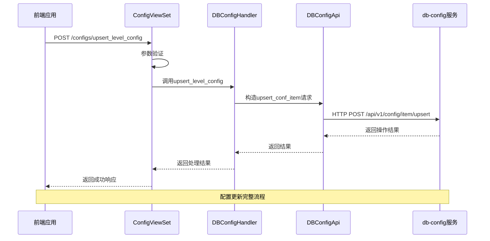
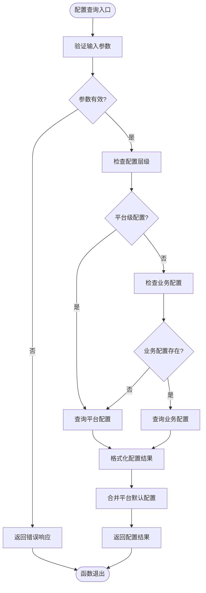

# 数据库配置服务

<cite>
**本文档引用的文件**
- [views.py](file://dbm-ui/backend/db_services/dbconfig/views.py)
- [handlers.py](file://dbm-ui/backend/db_services/dbconfig/handlers.py)
- [serializers.py](file://dbm-ui/backend/db_services/dbconfig/serializers.py)
- [dataclass.py](file://dbm-ui/backend/db_services/dbconfig/dataclass.py)
- [mock_data.py](file://dbm-ui/backend/db_services/dbconfig/mock_data.py)
- [config_item.py](file://dbm-ui/backend/db_services/dbconfig/config_item.py)
- [exceptions.py](file://dbm-ui/backend/db_services/dbconfig/exceptions.py)
- [urls.py](file://dbm-ui/backend/db_services/dbconfig/urls.py)
- [db-config/cmd/bkconfigsvr/main.go](file://dbm-services/common/db-config/cmd/bkconfigsvr/main.go)
- [db-config/internal/api/config_item.go](file://dbm-services/common/db-config/internal/api/config_item.go)
- [db-config/internal/api/config_file.go](file://dbm-services/common/db-config/internal/api/config_file.go)
- [db-config/internal/api/config_version.go](file://dbm-services/common/db-config/internal/api/config_version.go)
- [db-config/internal/api/apply_config.go](file://dbm-services/common/db-config/internal/api/apply_config.go)
- [db-config/internal/api/baseResponse.go](file://dbm-services/common/db-config/internal/api/baseResponse.go)
</cite>

## 目录
1. [简介](#简介)
2. [项目结构](#项目结构)
3. [核心组件](#核心组件)
4. [架构概述](#架构概述)
5. [详细组件分析](#详细组件分析)
6. [依赖分析](#依赖分析)
7. [性能考虑](#性能考虑)
8. [故障排除指南](#故障排除指南)
9. [结论](#结论)

## 简介
数据库配置服务是蓝鲸智云-DB管理系统（BlueKing-BK-DBM）中的关键组件，负责管理数据库配置项的增删改查、版本控制和分发。该服务通过REST API与前端交互，并通过内部API与`db-config`后端服务通信，实现配置的持久化存储和分发。服务支持多层级配置管理，包括平台级、业务级、模块级和集群级配置，满足不同环境和场景的差异化需求。

## 项目结构
数据库配置服务的代码主要位于`dbm-ui/backend/db_services/dbconfig`目录下，采用Django REST framework构建REST API。该模块通过分层设计实现了配置管理的完整功能，包括视图层、处理器层、序列化层和数据类层。



**图表来源**
- [views.py](file://dbm-ui/backend/db_services/dbconfig/views.py)
- [handlers.py](file://dbm-ui/backend/db_services/dbconfig/handlers.py)
- [serializers.py](file://dbm-ui/backend/db_services/dbconfig/serializers.py)
- [dataclass.py](file://dbm-ui/backend/db_services/dbconfig/dataclass.py)

**章节来源**
- [views.py](file://dbm-ui/backend/db_services/dbconfig/views.py)
- [handlers.py](file://dbm-ui/backend/db_services/dbconfig/handlers.py)
- [serializers.py](file://dbm-ui/backend/db_services/dbconfig/serializers.py)
- [dataclass.py](file://dbm-ui/backend/db_services/dbconfig/dataclass.py)

## 核心组件
数据库配置服务的核心组件包括视图层、处理器层、数据类和序列化器。视图层定义了所有API端点，处理器层封装了业务逻辑，数据类定义了配置数据的结构，序列化器负责请求和响应数据的验证与转换。这些组件协同工作，实现了配置项的增删改查、版本控制和分发功能。

**章节来源**
- [views.py](file://dbm-ui/backend/db_services/dbconfig/views.py)
- [handlers.py](file://dbm-ui/backend/db_services/dbconfig/handlers.py)
- [dataclass.py](file://dbm-ui/backend/db_services/dbconfig/dataclass.py)
- [serializers.py](file://dbm-ui/backend/db_services/dbconfig/serializers.py)

## 架构概述
数据库配置服务采用分层架构，前端通过REST API与视图层交互，视图层调用处理器层执行业务逻辑，处理器层通过数据类和序列化器处理数据，并与后端`db-config`服务通信。服务支持多层级配置继承，从平台级到业务级再到集群级，实现了配置的精细化管理。



**图表来源**
- [views.py](file://dbm-ui/backend/db_services/dbconfig/views.py)
- [handlers.py](file://dbm-ui/backend/db_services/dbconfig/handlers.py)
- [db-config/cmd/bkconfigsvr/main.go](file://dbm-services/common/db-config/cmd/bkconfigsvr/main.go)

## 详细组件分析

### 配置管理组件分析
配置管理组件实现了配置项的增删改查、版本控制和分发功能。通过多层级配置体系，支持平台、业务、模块和集群级别的配置管理，满足不同场景的需求。

#### 对象导向组件


**图表来源**
- [dataclass.py](file://dbm-ui/backend/db_services/dbconfig/dataclass.py)
- [handlers.py](file://dbm-ui/backend/db_services/dbconfig/handlers.py)
- [views.py](file://dbm-ui/backend/db_services/dbconfig/views.py)

#### API/服务组件


**图表来源**
- [views.py](file://dbm-ui/backend/db_services/dbconfig/views.py)
- [handlers.py](file://dbm-ui/backend/db_services/dbconfig/handlers.py)
- [db-config/internal/api/config_item.go](file://dbm-services/common/db-config/internal/api/config_item.go)

#### 复杂逻辑组件


**图表来源**
- [handlers.py](file://dbm-ui/backend/db_services/dbconfig/handlers.py)
- [db-config/internal/api/config_file.go](file://dbm-services/common/db-config/internal/api/config_file.go)

**章节来源**
- [views.py](file://dbm-ui/backend/db_services/dbconfig/views.py)
- [handlers.py](file://dbm-ui/backend/db_services/dbconfig/handlers.py)
- [serializers.py](file://dbm-ui/backend/db_services/dbconfig/serializers.py)
- [dataclass.py](file://dbm-ui/backend/db_services/dbconfig/dataclass.py)

## 依赖分析
数据库配置服务依赖于多个内部和外部组件。在内部，它依赖于`DBConfigApi`组件与`db-config`后端服务通信，依赖于`Cluster`模型获取集群信息。在外部，它通过HTTP/gRPC与`db-config`后端服务交互，实现配置的持久化存储和分发。

```mermaid
graph TD
subgraph "数据库配置服务"
views[views.py]
handlers[handlers.py]
serializers[serializers.py]
dataclass[dataclass.py]
end
subgraph "依赖组件"
dbconfig[db-config服务]
cluster[Cluster模型]
permission[权限系统]
end
views --> handlers
handlers --> dataclass
handlers --> dbconfig
handlers --> cluster
views --> serializers
views --> permission
serializers --> dataclass
Note over dbconfig: 后端配置存储服务
Note over cluster: 集群元数据模型
Note over permission: IAM权限控制系统
```

**图表来源**
- [handlers.py](file://dbm-ui/backend/db_services/dbconfig/handlers.py)
- [db-config/cmd/bkconfigsvr/main.go](file://dbm-services/common/db-config/cmd/bkconfigsvr/main.go)
- [db_meta/models.py](file://dbm-ui/backend/db_meta/models.py)

**章节来源**
- [handlers.py](file://dbm-ui/backend/db_services/dbconfig/handlers.py)
- [views.py](file://dbm-ui/backend/db_services/dbconfig/views.py)

## 性能考虑
数据库配置服务通过多种机制优化性能。首先，服务实现了缓存机制，在`db-config`后端服务中初始化缓存，减少对数据库的直接访问。其次，服务采用分页和批量查询，避免一次性加载大量配置数据。此外，服务通过合理的索引设计和查询优化，确保配置查询的高效性。对于频繁访问的配置数据，建议在客户端实现本地缓存，进一步减少网络开销。

## 故障排除指南
当数据库配置服务出现问题时，可以按照以下步骤进行排查：

1. 检查API请求参数是否正确，确保所有必填字段都已提供
2. 验证用户权限，确保用户具有执行相应操作的权限
3. 检查`db-config`后端服务是否正常运行
4. 查看服务日志，定位具体的错误信息
5. 验证配置项的层级关系和继承规则是否正确

常见的错误包括配置冲突、权限不足和参数验证失败。对于配置冲突，需要检查下层级配置是否存在冲突；对于权限不足，需要检查用户角色和权限设置；对于参数验证失败，需要检查请求数据的格式和内容。

**章节来源**
- [exceptions.py](file://dbm-ui/backend/db_services/dbconfig/exceptions.py)
- [handlers.py](file://dbm-ui/backend/db_services/dbconfig/handlers.py)
- [views.py](file://dbm-ui/backend/db_services/dbconfig/views.py)

## 结论
数据库配置服务通过分层架构和模块化设计，实现了配置管理的完整功能。服务支持多层级配置继承，满足不同场景的差异化需求。通过与`db-config`后端服务的集成，实现了配置的持久化存储和分发。服务具有良好的扩展性和可维护性，为数据库管理提供了可靠的配置管理能力。未来可以进一步优化缓存策略，提高配置查询的性能，并增强配置变更的审计功能。