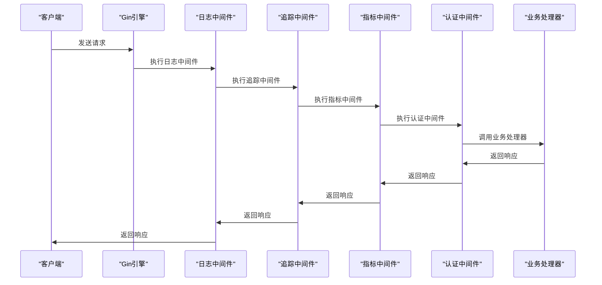
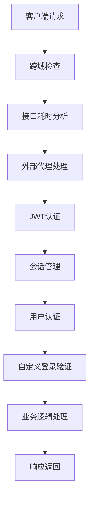

# 中间件与拦截器

<cite>
**本文档引用的文件**  
- [middleware.py](file://dbm-ui/backend/bk_web/middleware.py)
- [api_auth_middleware.go](file://dbm-services/k8s-dbs/middleware/api_auth_middleware.go)
- [api_log_middleware.go](file://dbm-services/k8s-dbs/middleware/api_log_middleware.go)
- [api_metric_middleware.go](file://dbm-services/k8s-dbs/middleware/api_metric_middleware.go)
- [middleware_helper.go](file://dbm-services/k8s-dbs/middleware/middleware_helper.go)
- [default.py](file://dbm-ui/config/default.py)
- [validate.go](file://dbm-services/sqlserver/db-tools/dbactuator/pkg/util/validate/validate.go)
- [base.go](file://dbm-services/k8s-dbs/common/validator/base.go)
- [common.py](file://dbm-ui/backend/db_meta/request_validator/common.py)
- [atom.py](file://dbm-ui/backend/db_meta/request_validator/atom.py)
- [check_value.go](file://dbm-services/common/db-config/pkg/validatestruct/check_value.go)
</cite>

## 目录
1. [引言](#引言)
2. [Django中间件](#django中间件)
3. [Go服务中间件](#go服务中间件)
4. [请求验证逻辑](#请求验证逻辑)
5. [中间件执行顺序](#中间件执行顺序)
6. [总结](#总结)

## 引言
本文档详细介绍了蓝鲸DB管理系统（BlueKing-BK-DBM）中的中间件和拦截器实现。系统包含两个主要部分：基于Django的前端服务和基于Go的后端服务。每个部分都实现了特定的中间件来处理认证、日志记录、指标收集和请求验证等功能。本文档将深入分析这些中间件的功能、实现方式以及它们在请求处理流程中的作用。

## Django中间件

Django中间件在`dbm-ui/backend/bk_web/middleware.py`文件中定义，主要包括以下几个关键组件：

- **DisableCSRFCheckMiddleware**: 在本地开发环境中禁用Django REST Framework的CSRF检查。
- **RequestProviderMiddleware**: 提供请求ID，用于调用链追踪。
- **DBMLoginRequiredMiddleware**: 自定义登录中间件，支持多种认证方式，包括JWT认证和应用代码认证。
- **ExternalProxyMiddleware**: 处理外部代理请求，进行路由映射和用户映射。
- **JWTUserModelBackend**: JWT用户认证后端，自动创建用户。

这些中间件通过Django的`MIDDLEWARE`配置在`dbm-ui/config/default.py`中注册，按照特定顺序执行，确保请求在到达视图之前经过必要的处理和验证。

**Section sources**
- [middleware.py](file://dbm-ui/backend/bk_web/middleware.py)
- [default.py](file://dbm-ui/config/default.py)

## Go服务中间件

Go服务中间件位于`dbm-services/k8s-dbs/middleware`目录下，使用Gin框架实现。主要包括以下三个核心中间件：

### API认证中间件 (api_auth_middleware.go)
`APIAuthMiddleware`负责API权限校验。它检查请求体中是否包含`bk_username`字段，并验证用户是否有执行特定操作的权限。对于GET请求或没有API名称的路径，中间件会直接放行。

### API日志中间件 (api_log_middleware.go)
`LogMiddleware`用于记录API请求日志。它捕获请求和响应的详细信息，包括请求方法、路径、查询参数、请求体、响应状态码、响应体等，并使用Zap日志库输出结构化日志。某些路径如`/metrics`和`/common/health`会被忽略，不进行日志记录。

### API指标中间件 (api_metric_middleware.go)
`APIMetricsMiddleware`收集API请求的指标数据并上报。它记录请求的计数和时延，支持Prometheus监控。指标数据包括API名称、HTTP方法、状态码、用户名、应用代码等维度。与日志中间件类似，健康检查接口不会被统计。

这些中间件通过`RegisterMiddleWare`函数在`middleware_helper.go`中注册，按照日志、追踪、指标、认证的顺序应用到Gin引擎上。

**Diagram sources**
- [api_auth_middleware.go](file://dbm-services/k8s-dbs/middleware/api_auth_middleware.go)
- [api_log_middleware.go](file://dbm-services/k8s-dbs/middleware/api_log_middleware.go)
- [api_metric_middleware.go](file://dbm-services/k8s-dbs/middleware/api_metric_middleware.go)
- [middleware_helper.go](file://dbm-services/k8s-dbs/middleware/middleware_helper.go)

**Section sources**
- [api_auth_middleware.go](file://dbm-services/k8s-dbs/middleware/api_auth_middleware.go)
- [api_log_middleware.go](file://dbm-services/k8s-dbs/middleware/api_log_middleware.go)
- [api_metric_middleware.go](file://dbm-services/k8s-dbs/middleware/api_metric_middleware.go)
- [middleware_helper.go](file://dbm-services/k8s-dbs/middleware/middleware_helper.go)

## 请求验证逻辑

系统实现了多层次的请求验证逻辑，确保输入数据的正确性和安全性。

### Django层验证
在Django后端，请求验证主要通过序列化器（Serializer）实现。`db_meta/request_validator`模块提供了多种验证函数，如`validated_str`、`validated_ip`、`validated_domain`等，用于验证字符串、IP地址和域名等数据类型。这些验证函数利用Django REST Framework的序列化器机制，确保数据符合预定义的规则。

### Go层验证
在Go服务中，请求验证通过`validator`库实现。`dbm-services/k8s-dbs/common/validator/base.go`文件中的`ValidateError`函数检查字段校验失败，并返回相应的错误信息。此外，`dbm-services/common/db-config/pkg/validatestruct/check_value.go`文件提供了更复杂的验证逻辑，如范围检查、枚举检查和正则表达式匹配。

### 自定义验证
系统还实现了自定义验证逻辑，如`validateTimeStr`函数用于验证时间字符串格式，`CheckInRegex`函数用于验证字符串是否符合指定的正则表达式模式。这些自定义验证函数增强了系统的灵活性和安全性。

**Section sources**
- [validate.go](file://dbm-services/sqlserver/db-tools/dbactuator/pkg/util/validate/validate.go)
- [base.go](file://dbm-services/k8s-dbs/common/validator/base.go)
- [common.py](file://dbm-ui/backend/db_meta/request_validator/common.py)
- [atom.py](file://dbm-ui/backend/db_meta/request_validator/atom.py)
- [check_value.go](file://dbm-services/common/db-config/pkg/validatestruct/check_value.go)

## 中间件执行顺序

中间件的执行顺序对系统的安全性和功能性至关重要。在Django和Go服务中，中间件都按照特定的顺序执行，确保请求在到达业务逻辑之前经过必要的处理。

### Django中间件顺序
Django中间件的执行顺序在`dbm-ui/config/default.py`的`MIDDLEWARE`元组中定义。从上到下的执行顺序如下：
1. 跨域中间件（CorsMiddleware）
2. 接口耗时调试工具（ProfilerMiddleware）
3. 外部代理中间件（ExternalProxyMiddleware）
4. JWT认证中间件（ApiGatewayJWT*Middleware）
5. request实例提供者（RequestProvider）
6. 会话中间件（SessionMiddleware）
7. 认证中间件（AuthenticationMiddleware）
8. 自定义登录中间件（DBMLoginRequiredMiddleware）

这个顺序确保了请求首先被正确路由和认证，然后才进行业务处理。

### Go中间件顺序
Go服务的中间件顺序在`middleware_helper.go`的`RegisterMiddleWare`函数中定义。中间件按照以下顺序注册：
1. 日志中间件（LogMiddleware）
2. 追踪中间件（otelgin.Middleware）
3. 指标中间件（APIMetricsMiddleware）
4. 认证中间件（APIAuthMiddleware）

这种顺序确保了即使在认证失败的情况下，请求的日志和追踪信息仍然能够被记录，便于问题排查。

**Diagram sources**
- [default.py](file://dbm-ui/config/default.py)
- [middleware_helper.go](file://dbm-services/k8s-dbs/middleware/middleware_helper.go)

**Section sources**
- [default.py](file://dbm-ui/config/default.py)
- [middleware_helper.go](file://dbm-services/k8s-dbs/middleware/middleware_helper.go)

## 总结
本文档全面介绍了蓝鲸DB管理系统中的中间件和拦截器架构。Django和Go服务分别实现了各自的中间件体系，共同保障了系统的安全性、可观测性和功能性。通过合理的中间件设计和执行顺序，系统能够有效地处理认证、日志记录、指标收集和请求验证等关键任务。理解这些中间件的工作原理对于维护和扩展系统具有重要意义。