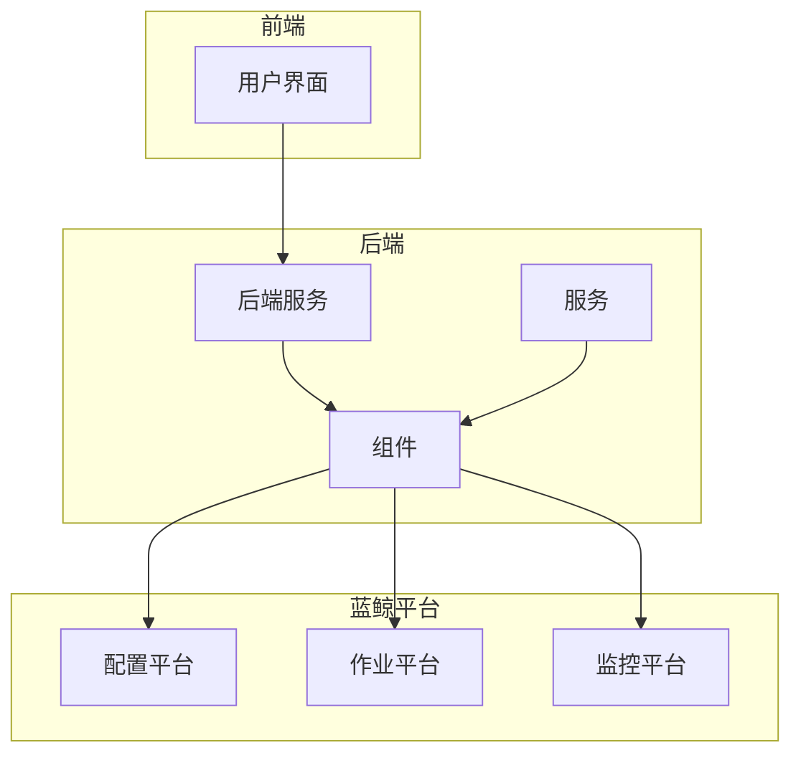
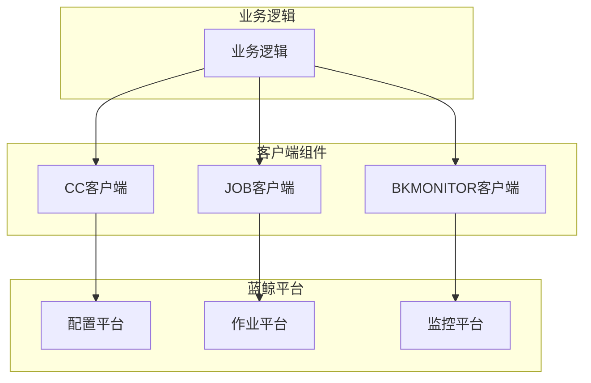
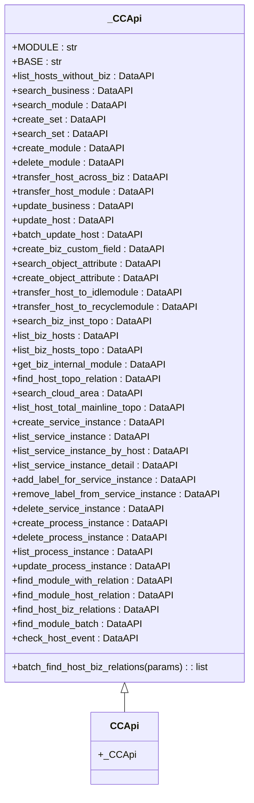
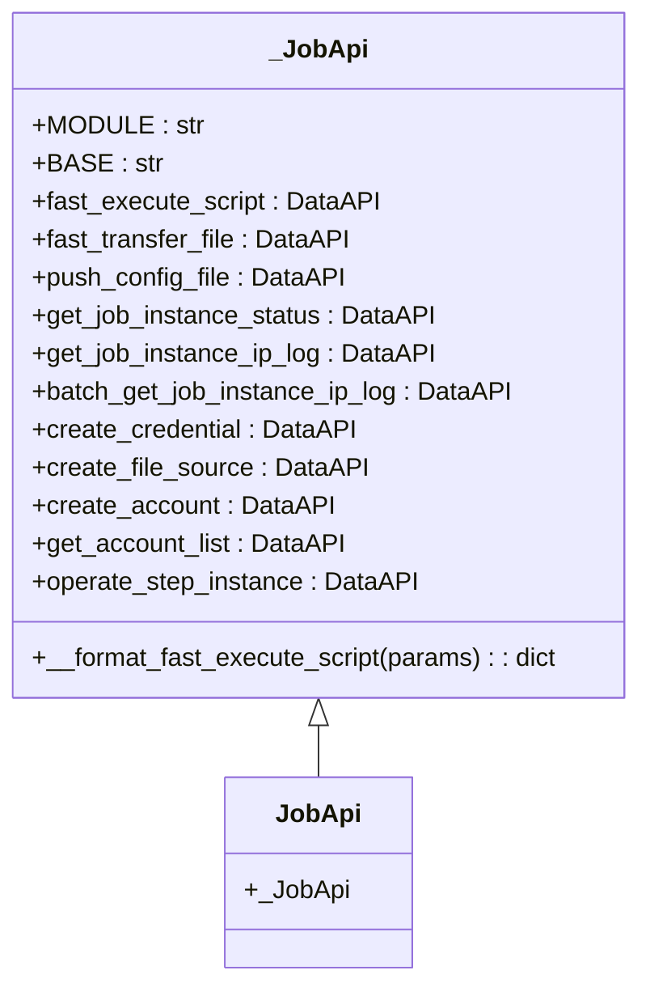
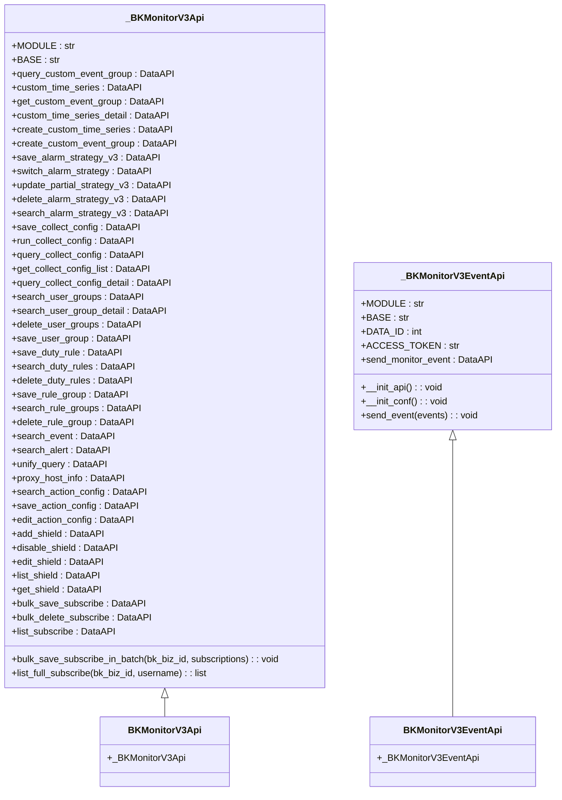
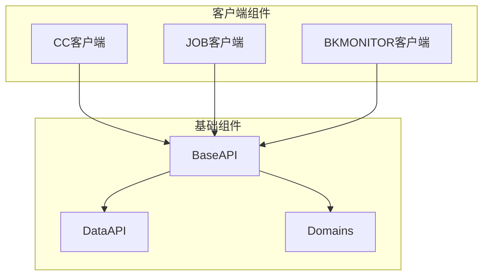
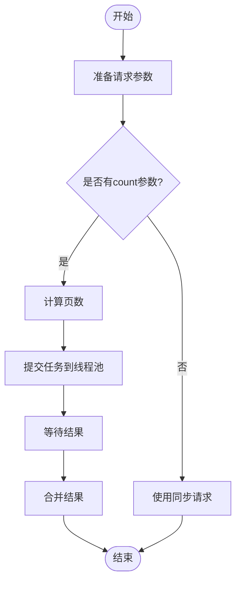
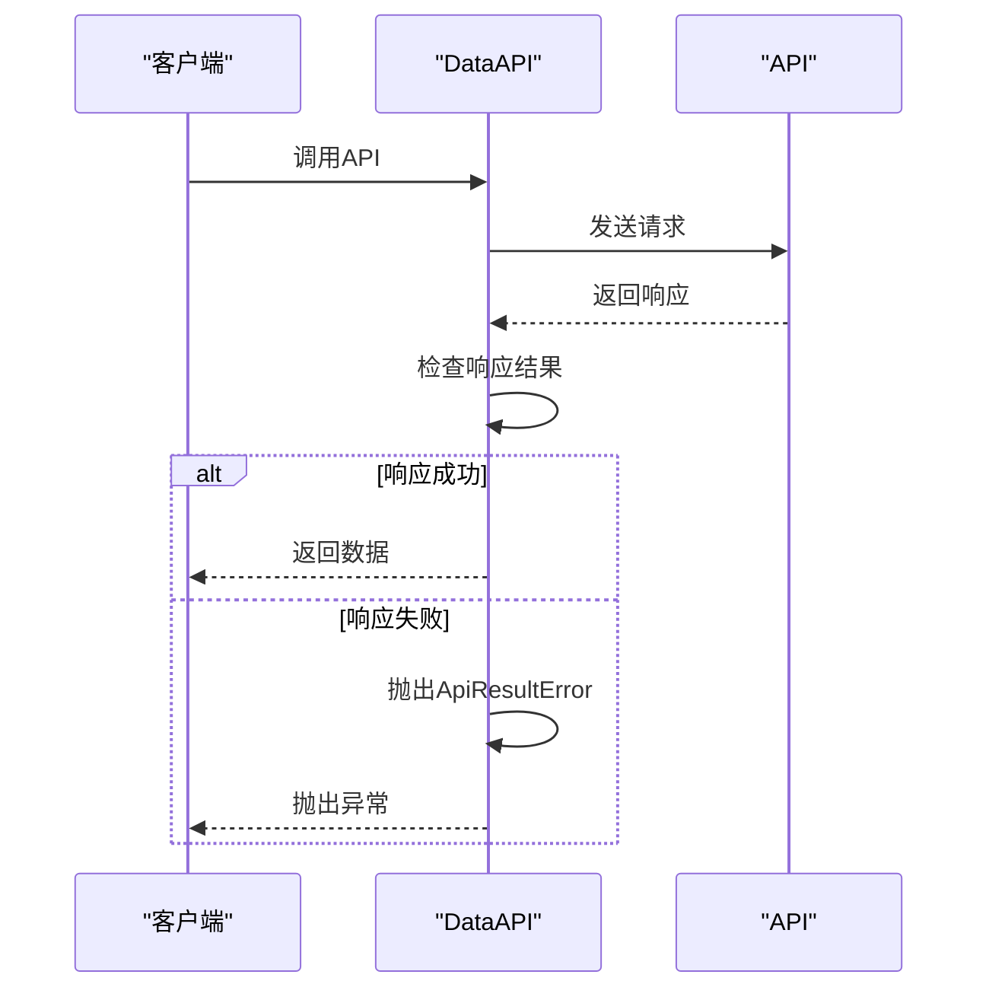

# API集成

<cite>
**本文档引用的文件**
- [cc/client.py](file://dbm-ui/backend/components/cc/client.py)
- [job/client.py](file://dbm-ui/backend/components/job/client.py)
- [bkmonitorv3/client.py](file://dbm-ui/backend/components/bkmonitorv3/client.py)
- [base.py](file://dbm-ui/backend/components/base.py)
- [domains.py](file://dbm-ui/backend/components/domains.py)
- [batch_request.py](file://dbm-ui/backend/utils/batch_request.py)
- [bkmonitorbeat.go](file://dbm-services/redis/db-tools/dbmon/pkg/sendwarning/bkmonitorbeat.go)
- [bkmonitorbeat.go](file://dbm-services/mongodb/db-tools/dbmon/pkg/sendwarning/bkmonitorbeat.go)
- [dataclass.py](file://dbm-ui/backend/db_monitor/dataclass.py)
- [db_proxy/views/jobapi/views.py](file://dbm-ui/backend/db_proxy/views/jobapi/views.py)
- [db_monitor/utils.py](file://dbm-ui/backend/db_monitor/utils.py)
</cite>

## 目录
1. [简介](#简介)
2. [项目结构](#项目结构)
3. [核心组件](#核心组件)
4. [架构概述](#架构概述)
5. [详细组件分析](#详细组件分析)
6. [依赖分析](#依赖分析)
7. [性能考虑](#性能考虑)
8. [故障排除指南](#故障排除指南)
9. [结论](#结论)

## 简介
本文档详细说明了平台如何通过HTTP/HTTPS协议与蓝鲸配置平台（CC）、作业平台（JOB）和监控平台（BKMONITOR）进行集成。文档分析了components目录下各组件的客户端代码，解释了RESTful API的调用方式、认证机制（如API Key）、请求/响应格式以及错误处理策略。提供了实际代码示例，展示如何在业务逻辑中调用这些API。文档化了常见的集成场景，如从CC同步主机信息、通过JOB执行远程脚本、向BKMONITOR上报监控数据等。包含性能优化建议和故障排查指南。

## 项目结构
项目结构清晰地组织了各个服务和组件。`dbm-ui/backend/components`目录包含了与各个蓝鲸平台（如CC、JOB、BKMONITOR）集成的客户端组件。`dbm-services`目录包含了具体的服务实现，如`db-resource`、`dbha`等。

**图源**
- [cc/client.py](file://dbm-ui/backend/components/cc/client.py)
- [job/client.py](file://dbm-ui/backend/components/job/client.py)
- [bkmonitorv3/client.py](file://dbm-ui/backend/components/bkmonitorv3/client.py)

**节源**
- [cc/client.py](file://dbm-ui/backend/components/cc/client.py)
- [job/client.py](file://dbm-ui/backend/components/job/client.py)
- [bkmonitorv3/client.py](file://dbm-ui/backend/components/bkmonitorv3/client.py)

## 核心组件
核心组件包括与蓝鲸配置平台（CC）、作业平台（JOB）和监控平台（BKMONITOR）集成的客户端。这些客户端封装了RESTful API的调用，提供了简洁的接口供业务逻辑使用。

**节源**
- [cc/client.py](file://dbm-ui/backend/components/cc/client.py)
- [job/client.py](file://dbm-ui/backend/components/job/client.py)
- [bkmonitorv3/client.py](file://dbm-ui/backend/components/bkmonitorv3/client.py)

## 架构概述
系统架构基于微服务设计，通过HTTP/HTTPS协议与蓝鲸平台进行通信。客户端组件负责封装API调用，提供统一的接口。业务逻辑通过调用这些客户端组件来实现与蓝鲸平台的集成。

**图源**
- [cc/client.py](file://dbm-ui/backend/components/cc/client.py)
- [job/client.py](file://dbm-ui/backend/components/job/client.py)
- [bkmonitorv3/client.py](file://dbm-ui/backend/components/bkmonitorv3/client.py)

## 详细组件分析

### CC客户端分析
CC客户端提供了与蓝鲸配置平台的集成，支持查询业务、主机、模块等信息。

#### 类图

**图源**
- [cc/client.py](file://dbm-ui/backend/components/cc/client.py)

### JOB客户端分析
JOB客户端提供了与蓝鲸作业平台的集成，支持快速执行脚本、分发文件、查询作业状态等。

#### 类图

**图源**
- [job/client.py](file://dbm-ui/backend/components/job/client.py)

### BKMONITOR客户端分析
BKMONITOR客户端提供了与蓝鲸监控平台的集成，支持创建和查询告警策略、上报监控数据等。

#### 类图

**图源**
- [bkmonitorv3/client.py](file://dbm-ui/backend/components/bkmonitorv3/client.py)

## 依赖分析
系统依赖于蓝鲸平台提供的API，通过HTTP/HTTPS协议进行通信。客户端组件依赖于`base.py`中的`DataAPI`类来封装API调用，`domains.py`中定义了各个平台的API网关域名。

**图源**
- [base.py](file://dbm-ui/backend/components/base.py)
- [domains.py](file://dbm-ui/backend/components/domains.py)

**节源**
- [base.py](file://dbm-ui/backend/components/base.py)
- [domains.py](file://dbm-ui/backend/components/domains.py)

## 性能考虑
为了提高性能，系统采用了多线程并发请求。`batch_request`函数用于批量请求API，`request_multi_thread`函数用于多线程并发请求。这些函数可以显著减少请求的总时间。

**图源**
- [batch_request.py](file://dbm-ui/backend/utils/batch_request.py)

## 故障排除指南
### 常见问题
1. **认证失败**：检查`bk_app_code`和`bk_app_secret`是否正确。
2. **请求超时**：增加超时时间或检查网络连接。
3. **API返回错误**：查看返回的错误信息，根据错误码进行处理。

### 错误处理
客户端组件通过`DataAPI`类封装了错误处理逻辑。当API调用失败时，会抛出`ApiResultError`异常，业务逻辑需要捕获并处理这些异常。

**图源**
- [base.py](file://dbm-ui/backend/components/base.py)

**节源**
- [base.py](file://dbm-ui/backend/components/base.py)
- [cc/client.py](file://dbm-ui/backend/components/cc/client.py)
- [job/client.py](file://dbm-ui/backend/components/job/client.py)
- [bkmonitorv3/client.py](file://dbm-ui/backend/components/bkmonitorv3/client.py)

## 结论
本文档详细介绍了平台如何通过HTTP/HTTPS协议与蓝鲸配置平台（CC）、作业平台（JOB）和监控平台（BKMONITOR）进行集成。通过分析客户端组件的代码，我们了解了RESTful API的调用方式、认证机制、请求/响应格式以及错误处理策略。文档还提供了性能优化建议和故障排查指南，帮助开发者更好地使用这些API。