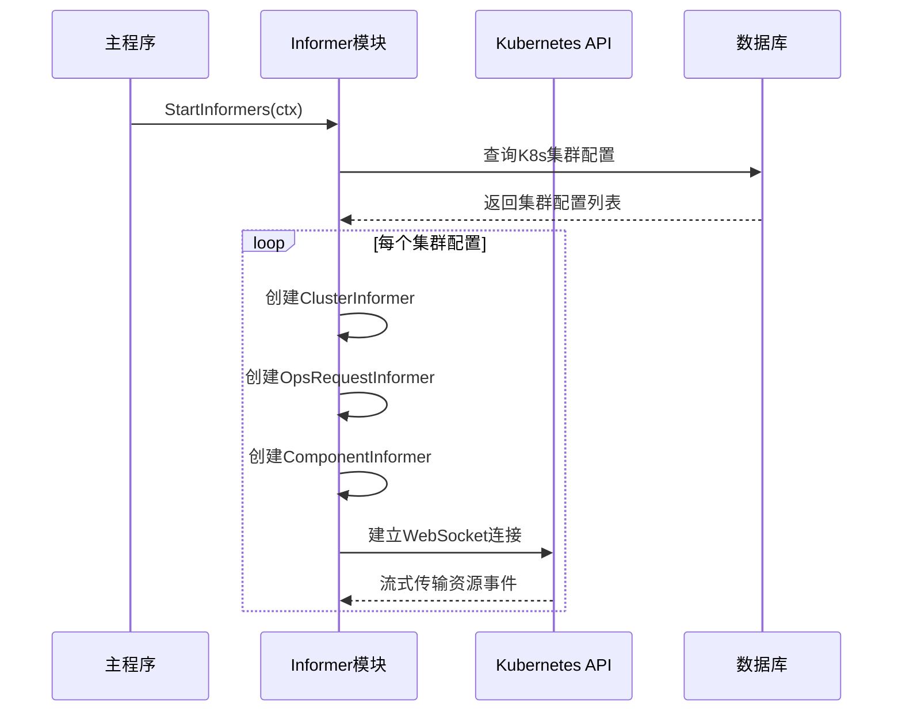
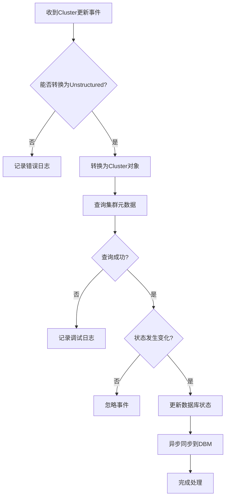
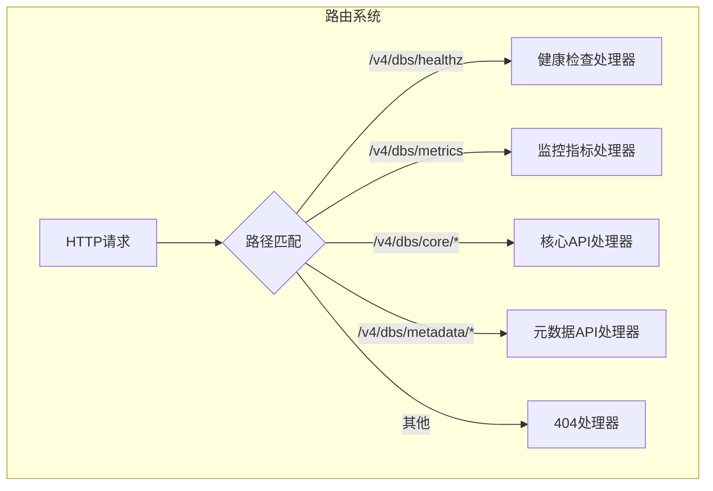
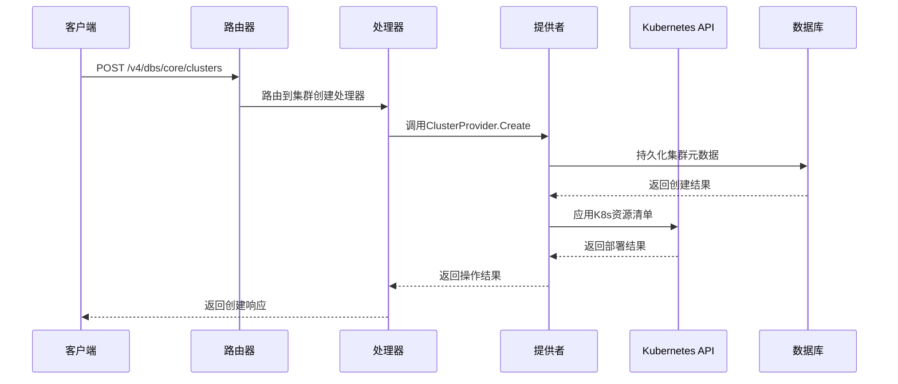

# Kubernetes运行时管理

<cite>
**本文档引用的文件**   
- [server.go](file://dbm-services/k8s-dbs/cmd/server.go)
- [router.go](file://dbm-services/k8s-dbs/router/router.go)
- [router_util.go](file://dbm-services/k8s-dbs/router/util/router_util.go)
- [informer.go](file://dbm-services/k8s-dbs/informers/informer.go)
- [cluster_informer.go](file://dbm-services/k8s-dbs/informers/cluster_informer.go)
- [component_informer.go](file://dbm-services/k8s-dbs/informers/component_informer.go)
- [opsrequest_informer.go](file://dbm-services/k8s-dbs/informers/opsrequest_informer.go)
- [init.go](file://dbm-services/k8s-dbs/core/init.go)
</cite>

## 目录
1. [服务启动与API路由注册](#服务启动与api路由注册)
2. [Kubernetes资源管理机制](#kubernetes资源管理机制)
3. [Informer监听机制](#informer监听机制)
4. [外部请求路由处理](#外部请求路由处理)
5. [数据库实例创建流程](#数据库实例创建流程)

## 服务启动与API路由注册

k8s-dbs服务的启动流程从`server.go`文件中的`main`函数开始，执行以下关键步骤：

1. **核心初始化**：调用`core.Init()`函数初始化系统核心配置，包括数据库连接的建立
2. **路由引擎创建**：使用Gin框架创建默认的路由引擎实例
3. **中间件注册**：通过`middleware.RegisterMiddleWare`注册API认证、日志记录和指标收集等中间件
4. **路由构建**：调用`router.BuildRouter`函数构建完整的API路由体系
5. **Informer启动**：启动用于监听Kubernetes集群状态变化的Informer机制
6. **HTTP服务启动**：在8000端口启动HTTP服务，并监听系统终止信号以实现优雅关闭

API路由的基础路径为`/v4/dbs`，通过`router.go`文件中的`BuildRouter`函数构建路由体系，包括健康检查接口、API路由和Prometheus监控指标接口。

**Section sources**
- [server.go](file://dbm-services/k8s-dbs/cmd/server.go#L48-L109)
- [router.go](file://dbm-services/k8s-dbs/router/router.go#L47-L54)
- [init.go](file://dbm-services/k8s-dbs/core/init.go#L27-L44)

## Kubernetes资源管理机制

k8s-dbs服务通过Kubernetes API实现对数据库实例的动态管控，主要涉及Deployment、StatefulSet、Service等资源的管理。系统使用`k8s.io/client-go`库与Kubernetes集群进行交互，通过动态客户端（dynamic client）操作自定义资源（CRD）。

核心管理功能包括：
- **集群管理**：通过`K8sCrdClusterProvider`接口管理Kubernetes集群元数据
- **组件管理**：通过`K8sCrdComponentProvider`接口管理数据库组件
- **配置管理**：通过`K8sClusterConfigProvider`接口管理集群配置
- **操作请求管理**：通过`K8sCrdOpsRequestProvider`接口管理运维操作请求

这些管理功能通过`router_util.go`中的`BuildClusterProvider`、`BuildComponentProvider`等函数构建相应的提供者实例，并注入到各个服务组件中。

**Section sources**
- [router_util.go](file://dbm-services/k8s-dbs/router/util/router_util.go#L35-L107)
- [cluster_informer.go](file://dbm-services/k8s-dbs/informers/cluster_informer.go#L45-L59)
- [component_informer.go](file://dbm-services/k8s-dbs/informers/component_informer.go#L46-L57)

## Informer监听机制

Informer机制是k8s-dbs服务实现Kubernetes集群状态同步的核心，通过监听Kubernetes API服务器的资源变更事件来保持本地状态与集群状态的一致性。

### Informer启动流程

`StartInformers`函数是Informer机制的入口点，执行以下步骤：
1. 从数据库获取所有Kubernetes集群配置
2. 为每个集群配置创建三种类型的Informer：
   - ClusterInformer：监听Cluster资源的状态变化
   - OpsRequestInformer：监听OpsRequest资源的状态变化
   - ComponentInformer：监听Component资源的状态变化
3. 为每个Informer创建独立的动态共享Informer工厂（DynamicSharedInformerFactory）

**Diagram sources**
- [informer.go](file://dbm-services/k8s-dbs/informers/informer.go#L42-L67)

### 资源事件处理

#### Cluster资源监听

`ClusterInformer`监听Cluster资源的更新事件，当检测到状态变化时：
1. 将Unstructured对象转换为Cluster类型
2. 查询对应的集群元数据实体
3. 比较新旧状态，若发生变化则更新数据库中的状态记录
4. 根据环境变量配置，异步同步状态到DBM系统

**Diagram sources**
- [cluster_informer.go](file://dbm-services/k8s-dbs/informers/cluster_informer.go#L62-L144)

#### Component资源监听

`ComponentInformer`监听Component资源的更新事件，处理流程包括：
1. 获取组件的新状态
2. 通过标签查找关联的集群
3. 查询组件元数据实体
4. 更新组件状态并持久化到数据库

#### OpsRequest资源监听

`OpsRequestInformer`监听运维操作请求的状态变化，当操作完成时更新完成时间戳，并同步状态到外部系统。

**Section sources**
- [informer.go](file://dbm-services/k8s-dbs/informers/informer.go#L42-L112)
- [cluster_informer.go](file://dbm-services/k8s-dbs/informers/cluster_informer.go#L62-L144)
- [component_informer.go](file://dbm-services/k8s-dbs/informers/component_informer.go#L60-L142)
- [opsrequest_informer.go](file://dbm-services/k8s-dbs/informers/opsrequest_informer.go#L61-L139)

## 外部请求路由处理

k8s-dbs服务的路由系统采用模块化设计，通过`router`目录下的多个子包实现不同功能模块的路由注册。

### 路由架构

路由系统的核心是`router.go`文件中的`BuildRouter`函数，它执行以下操作：
1. 在基础路径`/v4/dbs`下创建路由组
2. 注册健康检查路由
3. 调用注册的自定义路由构建器构建API路由
4. 注册Prometheus监控指标路由

**Diagram sources**
- [router.go](file://dbm-services/k8s-dbs/router/router.go#L47-L54)
- [router_util.go](file://dbm-services/k8s-dbs/router/util/router_util.go#L174-L184)

### 路由注册机制

系统采用注册器模式实现路由的动态注册：
1. 各功能模块通过`RegisterAPIRouterBuilder`函数注册自己的路由构建器
2. `BuildAPIRouters`函数遍历所有注册的构建器并执行
3. 每个构建器负责注册自己模块的API路由

这种设计实现了路由注册的解耦，使得新功能模块可以独立注册自己的路由而无需修改核心路由代码。

**Section sources**
- [router.go](file://dbm-services/k8s-dbs/router/router.go#L47-L54)
- [router_util.go](file://dbm-services/k8s-dbs/router/util/router_util.go#L164-L184)

## 数据库实例创建流程

通过API创建MySQL实例的完整流程如下：

### 请求处理流程

**Diagram sources**
- [core.go](file://dbm-services/k8s-dbs/core/provider/core.go#L15-L80)
- [cluster.go](file://dbm-services/k8s-dbs/router/core/cluster.go#L20-L60)

### K8s资源生成

创建数据库实例时，系统会生成相应的Kubernetes资源清单：
1. **StatefulSet**：用于管理有状态的数据库实例
2. **Service**：提供稳定的网络访问入口
3. **PersistentVolumeClaim**：申请持久化存储
4. **ConfigMap**：存储配置文件
5. **Secret**：存储敏感信息如密码

这些资源通过Helm Chart模板生成，确保配置的一致性和可维护性。

### 状态监控

实例创建后，Informer机制会持续监控其状态：
1. ClusterInformer监听集群整体状态
2. ComponentInformer监听各个组件状态
3. OpsRequestInformer监听运维操作状态

当状态发生变化时，系统会更新数据库中的记录，并根据配置同步到外部监控系统。

**Section sources**
- [cluster.go](file://dbm-services/k8s-dbs/router/core/cluster.go#L1-L100)
- [core.go](file://dbm-services/k8s-dbs/core/provider/core.go#L1-L100)
- [informer.go](file://dbm-services/k8s-dbs/informers/informer.go#L1-L112)