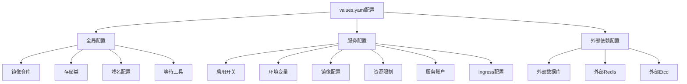
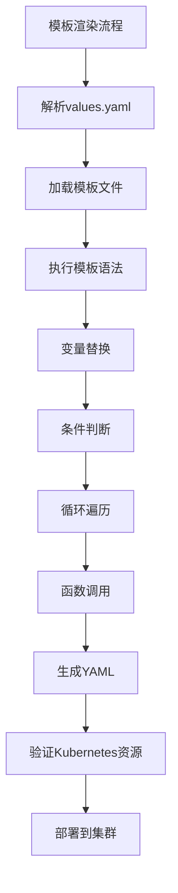

# Kubernetes部署

<cite>
**本文档引用的文件**
- [Chart.yaml](file://helm-charts/bk-dbm/Chart.yaml)
- [values.yaml](file://helm-charts/bk-dbm/values.yaml)
- [_helpers.tpl](file://helm-charts/bk-dbm/templates/_helpers.tpl)
- [dbconfig/templates/deployment.yaml](file://helm-charts/bk-dbm/charts/dbconfig/templates/deployment.yaml)
- [dbconfig/templates/service.yaml](file://helm-charts/bk-dbm/charts/dbconfig/templates/service.yaml)
</cite>

## 目录
1. [简介](#简介)
2. [Helm Chart元数据与依赖关系](#helm-chart元数据与依赖关系)
3. [配置参数详解](#配置参数详解)
4. [模板文件结构与渲染逻辑](#模板文件结构与渲染逻辑)
5. [Helm部署操作指南](#helm部署操作指南)
6. [生产环境配置示例](#生产环境配置示例)
7. [最佳实践与注意事项](#最佳实践与注意事项)

## 简介
本文档详细介绍了如何使用Helm Charts部署蓝鲸DB平台（bk-dbm）。文档重点分析了helm-charts/bk-dbm目录下的Chart.yaml文件、values.yaml文件以及templates目录中的Kubernetes资源模板。通过本指南，用户可以了解如何配置、部署、升级和管理蓝鲸DB平台的Kubernetes部署。

## Helm Chart元数据与依赖关系

`Chart.yaml`文件定义了蓝鲸DB平台Helm Chart的基本元数据和依赖关系。该Chart采用子Chart（subchart）模式进行管理，将不同的服务组件作为独立的子Chart进行组织。

Chart的基本元数据包括：
- **apiVersion**: v2，表示使用Helm 3的Chart格式
- **name**: bk-dbm，Chart的名称
- **version**: 1.5.0-alpha.78，Chart的版本
- **appVersion**: 1.5.0-alpha.78，应用的版本
- **description**: 蓝鲸DB平台的Helm Chart

该Chart定义了丰富的依赖关系，包括：
- **公共依赖**：bitnami提供的common、mysql、redis、etcd等基础组件
- **监控依赖**：stakater提供的reloader和bitnami提供的grafana
- **核心服务依赖**：通过file://协议引用的本地子Chart，包括dbm、dbconfig、dbpriv等蓝鲸DB平台的核心服务组件

依赖关系通过条件（condition）字段进行控制，允许用户根据需要启用或禁用特定的服务组件。例如，mysql、redis等基础组件的部署可以通过`mysql.enabled`、`redis.enabled`等布尔值进行控制。

```mermaid
graph TD
A[bk-dbm主Chart] --> B[公共依赖]
A --> C[监控依赖]
A --> D[核心服务依赖]
B --> B1[common]
B --> B2[mysql]
B --> B3[redis]
B --> B4[etcd]
C --> C1[reloader]
C --> C2[grafana]
D --> D1[dbm]
D --> D2[dbconfig]
D --> D3[dbpriv]
D --> D4[dbpartition]
D --> D5[db-simulation]
D --> D6[db-dns-api]
D --> D7[hadb-api]
D --> D8[db-resource]
D --> D9[db-celery-service]
D --> D10[slow-query-parser-service]
D --> D11[backup-server]
D --> D12[backup-consumer]
D --> D13[bkdata-kafka-consumer]
D --> D14[db-event-consumer]
D --> D15[db-remote-service]
D --> D16[db-dns]
D --> D17[db-nginx]
D --> D18[db-dbha]
D --> D19[k8s-dbs]
```



**图表来源**
- [Chart.yaml](file://helm-charts/bk-dbm/Chart.yaml#L1-L108)

**本节来源**
- [Chart.yaml](file://helm-charts/bk-dbm/Chart.yaml#L1-L108)

## 配置参数详解

`values.yaml`文件包含了蓝鲸DB平台部署的所有可配置参数，分为全局配置、服务配置和外部依赖配置三大类。

### 全局配置
全局配置（global）定义了适用于所有服务的公共设置：
- **镜像仓库**：`imageRegistry`指定容器镜像的仓库地址
- **存储类**：`storageClass`指定持久化存储的存储类
- **域名配置**：`bkDomain`和`bkDomainScheme`定义了蓝鲸平台的访问域名和协议
- **等待工具**：`k8sWaitFor`配置了用于Pod启动顺序编排的等待工具

### 服务配置
每个核心服务都有独立的配置块，包含以下通用配置项：
- **启用开关**：`enabled`布尔值控制服务是否部署
- **环境变量**：`envs`定义了服务运行时的环境变量
- **镜像配置**：`image`指定了容器镜像的仓库、名称和标签
- **资源限制**：`resources`定义了CPU和内存的请求与限制
- **服务账户**：`serviceAccount`配置了Kubernetes服务账户
- **Ingress配置**：`ingress`定义了服务的外部访问入口

以dbm服务为例，其配置包含：
- **Ingress配置**：定义了三个Ingress规则，分别用于前端访问、后端API访问和公网访问
- **Celery工作进程**：配置了celery-beat、celery-worker和pipeline-worker的副本数
- **环境变量**：设置了Django配置模块、应用代码、令牌等关键参数

### 外部依赖配置
对于数据库、缓存等外部依赖，提供了详细的连接配置：
- **外部数据库**：`externalDatabase`配置块定义了MySQL数据库的连接信息，包括用户名、密码、主机、端口和数据库名称
- **外部Redis**：`externalRedis`配置了Redis的连接信息
- **外部Etcd**：`externalEtcd`配置了Etcd集群的连接信息

这些配置允许用户将蓝鲸DB平台连接到现有的基础设施，而不是部署新的依赖服务。



**图表来源**
- [values.yaml](file://helm-charts/bk-dbm/values.yaml#L1-L792)

**本节来源**
- [values.yaml](file://helm-charts/bk-dbm/values.yaml#L1-L792)

## 模板文件结构与渲染逻辑

`templates`目录包含了Helm Chart的所有Kubernetes资源模板，采用Go模板语法进行动态渲染。

### 模板结构
主Chart的templates目录包含：
- **配置映射**：configmaps子目录下的各种ConfigMap模板
- **辅助模板**：_helpers.tpl文件，定义了可重用的模板函数
- **说明文件**：NOTES.txt，部署后的提示信息
- **日志配置**：bklogconfig.yaml，蓝鲸日志采集配置

每个子Chart都有独立的templates目录，包含标准的Kubernetes资源模板：
- **Deployment**：定义Pod的部署策略和副本数
- **Service**：定义服务的访问方式和端口
- **Ingress**：定义外部访问的路由规则
- **ServiceAccount**：定义服务账户和权限
- **HPA**：定义水平Pod自动伸缩策略
- **Job**：定义一次性任务

### 渲染逻辑
模板使用Go模板语法进行动态渲染，主要特点包括：
- **变量引用**：使用`.Values`访问values.yaml中的配置
- **条件判断**：使用`if`语句根据配置条件渲染不同的资源
- **循环遍历**：使用`range`遍历列表或映射
- **函数调用**：使用内置函数或自定义函数处理数据

`_helpers.tpl`文件定义了多个可重用的模板函数：
- **名称生成**：`bk-dbm.name`和`bk-dbm.fullname`生成资源名称
- **标签定义**：`bk-dbm.labels`和`bk-dbm.selectorLabels`生成标准标签
- **数据库配置**：`bk-dbm.database`根据配置生成数据库连接信息
- **ETCD配置**：`bk-dbm.etcd`生成ETCD连接配置
- **初始化容器**：`initContainersWaitFor`生成等待其他Pod启动的初始化容器

以dbconfig服务的Deployment模板为例，其渲染逻辑包括：
- 使用`include "dbconfig.fullname" .`生成Deployment名称
- 使用`.Values.replicaCount`设置副本数
- 使用`.Values.image`配置容器镜像
- 使用`.Values.resources`设置资源限制
- 使用`reloader.stakater.com/auto: "true"`启用配置热更新



**图表来源**
- [_helpers.tpl](file://helm-charts/bk-dbm/templates/_helpers.tpl#L1-L139)
- [dbconfig/templates/deployment.yaml](file://helm-charts/bk-dbm/charts/dbconfig/templates/deployment.yaml#L1-L99)

**本节来源**
- [_helpers.tpl](file://helm-charts/bk-dbm/templates/_helpers.tpl#L1-L139)
- [dbconfig/templates/deployment.yaml](file://helm-charts/bk-dbm/charts/dbconfig/templates/deployment.yaml#L1-L99)

## Helm部署操作指南

### 环境准备
在部署蓝鲸DB平台之前，需要完成以下准备工作：
1. 安装Helm 3客户端
2. 添加依赖的Chart仓库：
   ```bash
   helm repo add bitnami https://charts.bitnami.com/bitnami
   helm repo add stakater-charts https://stakater.github.io/stakater-charts
   ```
3. 更新本地Chart依赖：
   ```bash
   helm dependency update helm-charts/bk-dbm
   ```

### 部署操作
使用以下命令部署蓝鲸DB平台：
```bash
helm install bk-dbm helm-charts/bk-dbm -f helm-charts/bk-dbm/values.yaml -n dbm-namespace
```

### 升级操作
使用以下命令升级已部署的蓝鲸DB平台：
```bash
helm upgrade bk-dbm helm-charts/bk-dbm -f helm-charts/bk-dbm/values.yaml -n dbm-namespace
```

### 回滚操作
如果升级出现问题，可以使用以下命令回滚到之前的版本：
```bash
helm rollback bk-dbm <revision> -n dbm-namespace
```

### 卸载操作
使用以下命令卸载蓝鲸DB平台：
```bash
helm uninstall bk-dbm -n dbm-namespace
```

### 状态检查
部署后可以使用以下命令检查部署状态：
```bash
helm status bk-dbm -n dbm-namespace
helm list -n dbm-namespace
kubectl get pods -n dbm-namespace
```

**本节来源**
- [README.md](file://helm-charts/README.md#L1-L30)

## 生产环境配置示例

以下是一个生产环境的values.yaml配置示例：

```yaml
# 全局配置
global:
  imageRegistry: "registry.example.com"
  storageClass: "ssd-storage"
  bkDomain: "dbm.prod.example.com"
  bkDomainScheme: https

# dbm服务配置
dbm:
  enabled: true
  image:
    registry: "registry.example.com"
    repository: "prod/bk-dbm"
    tag: "1.5.0-prod"
  replicaCount: 3
  resources:
    requests:
      cpu: 500m
      memory: 1Gi
    limits:
      cpu: 1000m
      memory: 2Gi
  ingress:
    enabled: true
    hostname: "dbm.prod.example.com"
    tls:
      - hosts:
          - dbm.prod.example.com
        secretName: dbm-tls-secret

# 外部数据库配置
externalDatabase:
  dbm:
    host: "mysql.prod.example.com"
    port: 3306
    username: "bkdbm_prod"
    password: "secure_password"
    name: "bk_dbm_prod"
```

此配置示例展示了生产环境的关键设置：
- 使用私有镜像仓库
- 配置高性能存储类
- 启用HTTPS访问
- 设置合理的资源请求和限制
- 配置TLS证书
- 连接生产环境的外部数据库

**本节来源**
- [values.yaml](file://helm-charts/bk-dbm/values.yaml#L1-L792)

## 最佳实践与注意事项

### 最佳实践
1. **配置管理**：将values.yaml文件纳入版本控制，便于追踪配置变更
2. **环境隔离**：为不同环境（开发、测试、生产）使用不同的values文件
3. **资源规划**：根据服务负载合理设置资源请求和限制
4. **安全配置**：避免在values.yaml中硬编码敏感信息，使用Secret管理
5. **监控集成**：启用Prometheus ServiceMonitor和Grafana监控

### 注意事项
1. **依赖更新**：修改子Chart后，需要运行`helm dependency update`更新依赖
2. **配置验证**：部署前使用`helm template`命令验证模板渲染结果
3. **命名规范**：遵循Kubernetes命名规范，避免使用特殊字符
4. **版本兼容**：确保Helm版本与Chart版本兼容
5. **备份策略**：定期备份重要的配置和数据

通过遵循这些最佳实践和注意事项，可以确保蓝鲸DB平台的稳定、安全和可维护的Kubernetes部署。

**本节来源**
- [Chart.yaml](file://helm-charts/bk-dbm/Chart.yaml#L1-L108)
- [values.yaml](file://helm-charts/bk-dbm/values.yaml#L1-L792)
- [README.md](file://helm-charts/README.md#L1-L30)