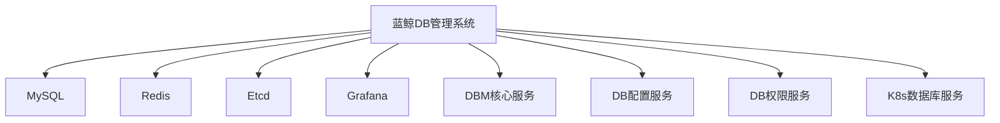
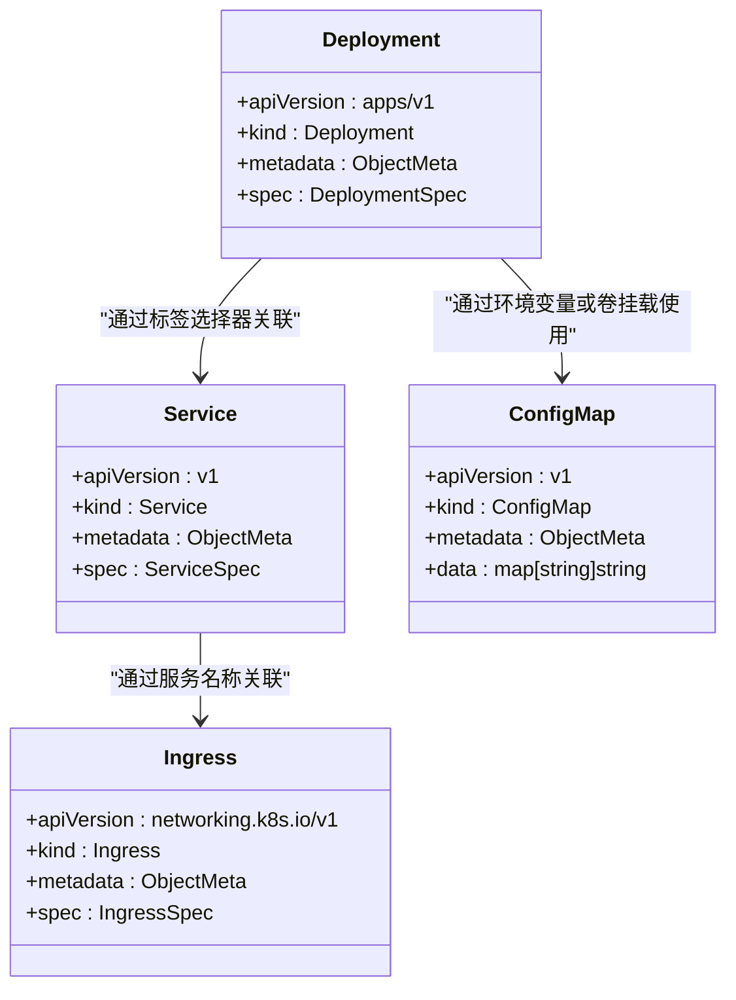
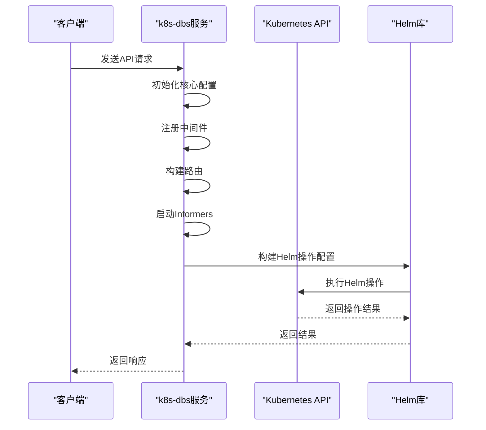
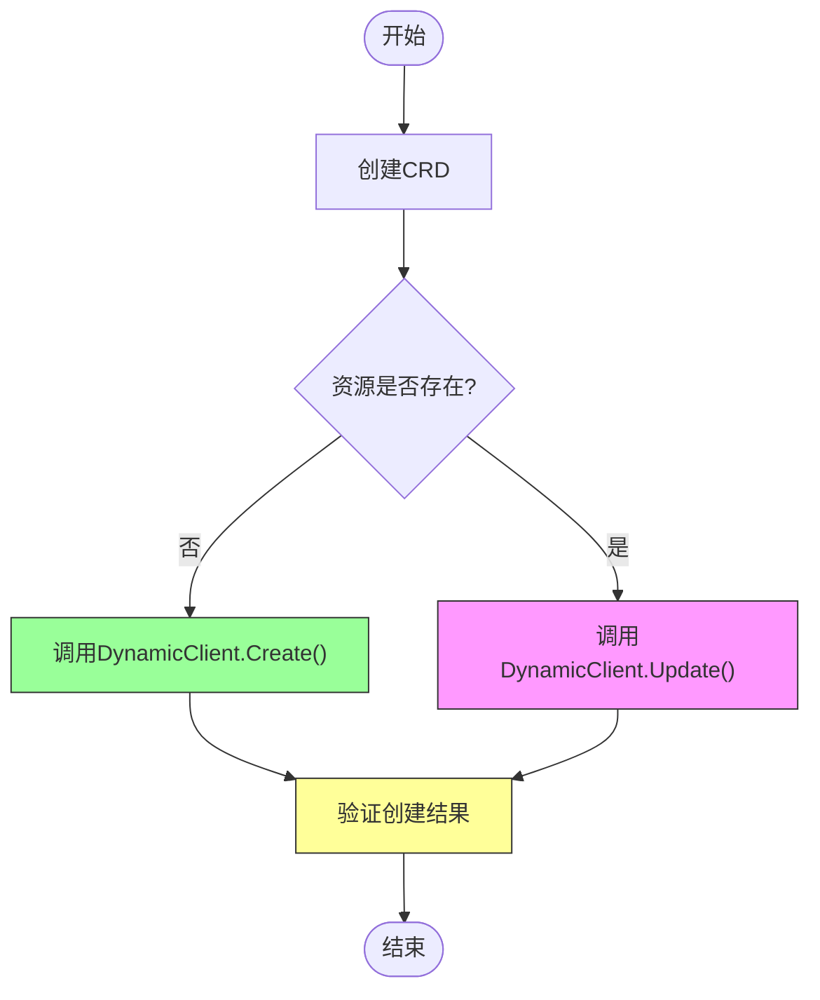

# Kubernetes集成

<cite>
**本文档引用的文件**   
- [Chart.yaml](file://helm-charts/bk-dbm/Chart.yaml)
- [values.yaml](file://helm-charts/bk-dbm/values.yaml)
- [deployment.yaml](file://helm-charts/bk-dbm/charts/k8s-dbs/templates/deployment.yaml)
- [service.yaml](file://helm-charts/bk-dbm/charts/k8s-dbs/templates/service.yaml)
- [ingress.yaml](file://helm-charts/bk-dbm/charts/k8s-dbs/templates/ingress.yaml)
- [server.go](file://dbm-services/k8s-dbs/cmd/server.go)
- [k8s_util.go](file://dbm-services/k8s-dbs/common/util/k8s_util.go)
- [kb_util.go](file://dbm-services/k8s-dbs/core/util/kb_util.go)
- [cluster_provider.go](file://dbm-services/k8s-dbs/core/provider/cluster_provider.go)
- [addon_provider.go](file://dbm-services/k8s-dbs/core/provider/addon_provider.go)
- [k8s_cluster_config_entity.go](file://dbm-services/k8s-dbs/metadata/entity/k8s_cluster_config_entity.go)
</cite>

## 目录
1. [简介](#简介)
2. [Helm Chart结构分析](#helm-chart结构分析)
3. [核心组件分析](#核心组件分析)
4. [Kubernetes API集成机制](#kubernetes-api集成机制)
5. [Helm Chart使用示例](#helm-chart使用示例)
6. [与K8s原生功能集成](#与k8s原生功能集成)
7. [结论](#结论)

## 简介
本文档详细说明蓝鲸DB管理系统如何利用Helm Charts在Kubernetes环境中部署和管理数据库服务。平台通过k8s-dbs服务作为核心组件，利用Helm Charts实现数据库实例的动态创建、更新和删除操作。文档分析了helm-charts/bk-dbm目录下的Chart.yaml、values.yaml和templates中的K8s资源定义，解释其参数配置和模板渲染机制，并结合k8s-dbs服务的代码说明平台如何通过Kubernetes API进行数据库实例管理。

## Helm Chart结构分析

### Chart.yaml分析
`Chart.yaml`文件定义了bk-dbm Helm Chart的基本信息和依赖关系。该Chart是一个复合Chart，包含了多个子Chart作为依赖项，用于部署不同的数据库服务组件。



**图表来源**
- [Chart.yaml](file://helm-charts/bk-dbm/Chart.yaml)

**本节来源**
- [Chart.yaml](file://helm-charts/bk-dbm/Chart.yaml)

### values.yaml配置分析
`values.yaml`文件包含了Helm Chart的默认配置值，分为多个逻辑部分：

1. **全局配置** (`global`)：包含镜像仓库、存储类、域名等全局设置
2. **服务特定配置**：如`dbm`、`dbconfig`、`dbpriv`、`k8s-dbs`等服务的独立配置
3. **第三方组件配置**：如`mysql`、`redis`、`etcd`等外部数据库配置
4. **监控和日志配置**：如`grafana`、`bkLogConfig`等

配置文件通过条件表达式控制子Chart的启用状态，例如：
```yaml
dependencies:
  - condition: mysql.enabled
    name: mysql
    version: 9.x.x
    repository: https://charts.bitnami.com/bitnami
```

**本节来源**
- [values.yaml](file://helm-charts/bk-dbm/values.yaml)

### 模板资源定义
Helm Chart的templates目录包含了Kubernetes资源的模板定义，主要包括：

- **Deployment**: 定义应用的部署配置
- **Service**: 定义服务的网络访问
- **Ingress**: 定义外部访问入口
- **ConfigMap**: 定义配置信息
- **ServiceMonitor**: 定义监控配置



**图表来源**
- [deployment.yaml](file://helm-charts/bk-dbm/charts/k8s-dbs/templates/deployment.yaml)
- [service.yaml](file://helm-charts/bk-dbm/charts/k8s-dbs/templates/service.yaml)
- [ingress.yaml](file://helm-charts/bk-dbm/charts/k8s-dbs/templates/ingress.yaml)

**本节来源**
- [helm-charts/bk-dbm/templates](file://helm-charts/bk-dbm/templates)

## 核心组件分析

### k8s-dbs服务架构
k8s-dbs服务是平台与Kubernetes集群交互的核心组件，负责管理数据库实例的生命周期。服务采用Gin框架构建HTTP API，通过Kubernetes客户端与集群进行通信。



**图表来源**
- [server.go](file://dbm-services/k8s-dbs/cmd/server.go)
- [k8s_util.go](file://dbm-services/k8s-dbs/common/util/k8s_util.go)

**本节来源**
- [server.go](file://dbm-services/k8s-dbs/cmd/server.go)

### Kubernetes客户端实现
k8s-dbs服务通过`NewK8sClient`函数创建Kubernetes客户端实例，该函数使用集群配置信息建立与Kubernetes API的连接。

```go
func NewK8sClient(k8sConfig *entitys.K8sClusterConfigEntity) (*K8sClient, error) {
	config := &rest.Config{
		Host:        k8sConfig.APIServerURL,
		BearerToken: k8sConfig.Token,
		TLSClientConfig: rest.TLSClientConfig{
			Insecure: true,
		},
	}
	// 创建客户端集
	clientSet, err := kubernetes.NewForConfig(config)
	if err != nil {
		return nil, err
	}
	// 创建动态客户端
	dynamicClient, err := dynamic.NewForConfig(config)
	if err != nil {
		return nil, err
	}
	// 创建指标客户端
	metricsClientSet, err := metricsclientset.NewForConfig(config)
	if err != nil {
		return nil, err
	}
	
	k8sClient := K8sClient{
		RestConfig:    config,
		ClientSet:     clientSet,
		DynamicClient: dynamicClient,
		MetricsClient: metricsClientSet,
	}
	
	err = k8sClient.VerifyConnection()
	if err != nil {
		return nil, err
	}
	return &k8sClient, nil
}
```

**本节来源**
- [k8s_util.go](file://dbm-services/k8s-dbs/common/util/k8s_util.go)
- [k8s_cluster_config_entity.go](file://dbm-services/k8s-dbs/metadata/entity/k8s_cluster_config_entity.go)

## Kubernetes API集成机制

### Helm操作封装
平台通过封装Helm库的操作，实现了对Kubernetes资源的高级管理。`BuildHelmConfig`函数构建Helm操作配置，为后续的安装、升级和删除操作提供基础。

```go
func (k *K8sClient) BuildHelmConfig(namespace string) (*action.Configuration, error) {
	configFlags := genericclioptions.NewConfigFlags(true)
	configFlags.WrapConfigFn = func(_ *rest.Config) *rest.Config {
		return k.RestConfig
	}
	
	helmActionConfig := new(action.Configuration)
	if err := helmActionConfig.Init(
		configFlags,
		namespace,
		constant.HelmDriver,
		func(format string, v ...interface{}) {
			log.Printf(format, v...)
		},
	); err != nil {
		return nil, fmt.Errorf("failed to initialize Helm Client: %v", err)
	}
	return helmActionConfig, nil
}
```

**本节来源**
- [k8s_util.go](file://dbm-services/k8s-dbs/common/util/k8s_util.go)

### 资源操作实现
平台实现了对Kubernetes自定义资源(CRD)的创建、更新和删除操作，通过动态客户端与API Server交互。



**图表来源**
- [kb_util.go](file://dbm-services/k8s-dbs/core/util/kb_util.go)

**本节来源**
- [kb_util.go](file://dbm-services/k8s-dbs/core/util/kb_util.go)

### 集群更新流程
当需要更新集群时，平台通过`updateClusterRelease`函数执行Helm升级操作，确保集群配置的变更能够正确应用。

```go
func (c *ClusterProvider) updateClusterRelease(
	ctx *commentity.DbsContext,
	request *coreentity.Request,
	k8sClient *commutil.K8sClient,
	isPartial bool,
) (map[string]interface{}, error) {
	actionConfig, err := coreutil.BuildHelmActionConfig(request.Namespace, k8sClient)
	if err != nil {
		slog.Error("failed to build helm action config", "error", err)
		return nil, err
	}
	
	upgrade := action.NewUpgrade(actionConfig)
	upgrade.Namespace = request.Namespace
	upgrade.RepoURL = helmRepo.RepoRepository
	upgrade.Version = request.AddonClusterVersion
	upgrade.Timeout = coreconst.HelmOperationTimeout
	upgrade.Wait = true
	
	chartRequested, err := upgrade.ChartPathOptions.LocateChart(request.StorageAddonType+"-cluster", helmcli.New())
	if err != nil {
		slog.Error("failed to locate helm chart requested", "error", err)
		return nil, err
	}
	
	chart, err := loader.Load(chartRequested)
	if err != nil {
		slog.Error("failed to load helm chart requested", "error", err)
		return nil, err
	}
	
	_, err = upgrade.Run(releaseName, chart, values)
	if err != nil {
		slog.Error("cluster update failed", "clusterName", request.ClusterName, "error", err)
		return nil, err
	}
	
	return values, nil
}
```

**本节来源**
- [cluster_provider.go](file://dbm-services/k8s-dbs/core/provider/cluster_provider.go)

### 插件升级流程
对于插件的升级操作，平台通过`UpgradeAddonHelmRelease`函数实现，确保插件版本的平滑升级。

```go
func (a *AddonProvider) UpgradeAddonHelmRelease(
	entity *pventity.AddonEntity,
	k8sClient *commutil.K8sClient,
) error {
	actionConfig, err := coreutil.BuildHelmActionConfig(coreconst.AddonDefaultNamespace, k8sClient)
	if err != nil {
		slog.Error("failed to build helm action config", "error", err)
		return err
	}
	
	upgrade := action.NewUpgrade(actionConfig)
	upgrade.Namespace = coreconst.AddonDefaultNamespace
	upgrade.RepoURL = helmRepo.RepoRepository
	upgrade.Version = entity.AddonVersion
	upgrade.Timeout = coreconst.HelmOperationTimeout
	upgrade.Wait = true
	
	chartRequested, err := upgrade.ChartPathOptions.LocateChart(entity.AddonType, helmcli.New())
	if err != nil {
		slog.Error("failed to locate helm chart requested", "error", err)
		return fmt.Errorf("failed to locate helm chart requested\n%s", err)
	}
	
	chart, err := loader.Load(chartRequested)
	if err != nil {
		slog.Error("failed to load helm chart requested", "error", err)
		return fmt.Errorf("failed to load helm chart requested\n%s", err)
	}
	
	_, err = upgrade.Run(releaseName, chart, nil)
	if err != nil {
		slog.Error("Addon upgrade failed", "addonName", entity.AddonType, "error", err)
		return fmt.Errorf("addon upgrade failed for addonName %q in namespace %q: %w",
			entity.AddonType, coreconst.AddonDefaultNamespace, err)
	}
	
	return nil
}
```

**本节来源**
- [addon_provider.go](file://dbm-services/k8s-dbs/core/provider/addon_provider.go)

## Helm Chart使用示例

### 自定义values文件
创建自定义values文件`custom-values.yaml`来覆盖默认配置：

```yaml
# custom-values.yaml
global:
  imageRegistry: "my-registry.example.com"
  storageClass: "ssd-storage"
  bkDomain: "mycompany.com"
  bkDomainScheme: https

k8s-dbs:
  enabled: true
  replicaCount: 3
  resources:
    limits:
      cpu: 2000m
      memory: 4Gi
    requests:
      cpu: 1000m
      memory: 2Gi
  server:
    port: 8080
    log:
      max_size_mb: 100
      max_backups: 10
      max_age: 30
      compress: true
```

### 部署操作
使用Helm命令部署Chart：

```bash
# 添加Helm仓库
helm repo add bk-dbm ./helm-charts/bk-dbm

# 部署Chart
helm install my-dbm-release bk-dbm/bk-dbm \
  -f custom-values.yaml \
  --namespace dbm-system \
  --create-namespace

# 查看部署状态
helm status my-dbm-release -n dbm-system
```

### 升级操作
升级已部署的Chart：

```bash
# 升级到新版本
helm upgrade my-dbm-release bk-dbm/bk-dbm \
  -f custom-values.yaml \
  --namespace dbm-system \
  --version 1.6.0

# 查看升级历史
helm history my-dbm-release -n dbm-system
```

### 回滚操作
回滚到之前的版本：

```bash
# 回滚到上一个版本
helm rollback my-dbm-release 1 -n dbm-system

# 回滚到指定版本
helm rollback my-dbm-release 2 -n dbm-system

# 验证回滚结果
helm status my-dbm-release -n dbm-system
```

**本节来源**
- [values.yaml](file://helm-charts/bk-dbm/values.yaml)
- [Chart.yaml](file://helm-charts/bk-dbm/Chart.yaml)

## 与K8s原生功能集成

### Ingress集成
平台通过Ingress资源实现外部访问，配置了详细的Ingress规则和注解：

```yaml
# ingress.yaml
{{- if .Values.ingress.enabled }}
apiVersion: {{ include "common.capabilities.ingress.apiVersion" . }}
kind: Ingress
metadata:
  name: k8s-dbs-ingress
  annotations:
    {{- range $key, $value := .Values.ingress.annotations }}
    {{ $key }}: {{ $value | quote }}
    {{- end }}
spec:
  ingressClassName: nginx
  rules:
    - http:
        paths:
          - path: /v4/dbs/
            pathType: Prefix
            backend:
              service:
                name: k8s-dbs-api
                port:
                  number: {{ .Values.server.port }}
{{- end }}
```

**本节来源**
- [ingress.yaml](file://helm-charts/bk-dbm/charts/k8s-dbs/templates/ingress.yaml)

### PersistentVolume集成
平台支持通过PersistentVolume实现数据持久化，配置了存储类和容量：

```yaml
# values.yaml中的存储配置
mysql:
  primary:
    persistence:
      enabled: true
      storageClass: ""
      size: "8Gi"

redis:
  master:
    persistence:
      size: 10Gi
```

**本节来源**
- [values.yaml](file://helm-charts/bk-dbm/values.yaml)

### 服务发现与负载均衡
通过Service资源实现服务发现和负载均衡：

```yaml
# service.yaml
kind: Service
apiVersion: v1
metadata:
  labels:
    app: {{ .Release.Name }}
  name: k8s-dbs-api
  namespace: {{ .Release.Namespace }}
spec:
  ports:
    - port: {{ .Values.server.port }}
      targetPort: {{ .Values.server.port }}
      protocol: TCP
      name: api
  selector:
    app: k8s-dbs
  type: {{ .Values.server.serviceType }}
```

**本节来源**
- [service.yaml](file://helm-charts/bk-dbm/charts/k8s-dbs/templates/service.yaml)

## 结论
蓝鲸DB管理系统通过Helm Charts实现了在Kubernetes环境中高效管理数据库服务的能力。平台利用k8s-dbs服务作为核心组件，通过封装Helm库的操作，实现了对数据库实例的动态创建、更新和删除。Helm Chart的设计采用了模块化结构，通过主Chart管理多个子Chart的依赖关系，实现了复杂系统的统一部署。平台与Kubernetes原生功能（如Ingress、PersistentVolume）的深度集成，确保了服务的高可用性和数据持久性。通过标准化的Helm操作流程，平台提供了可靠的部署、升级和回滚机制，为数据库服务的生命周期管理提供了完整的解决方案。