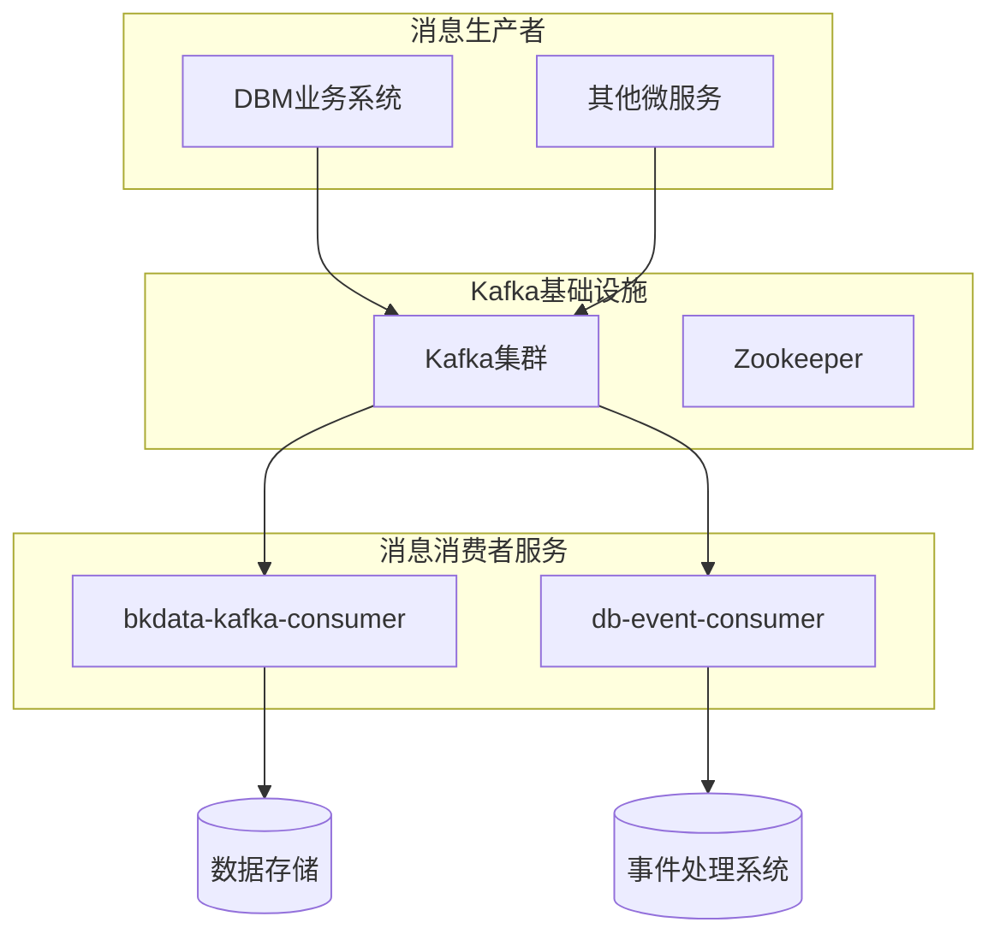
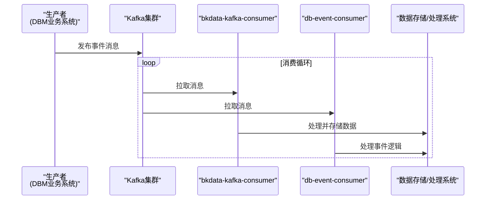
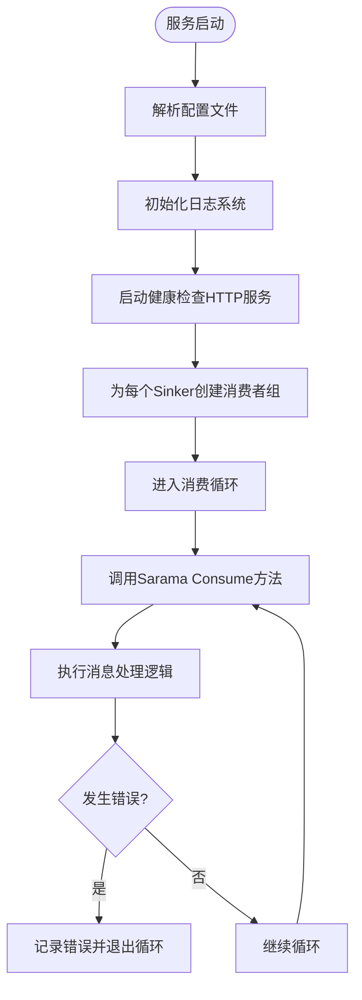
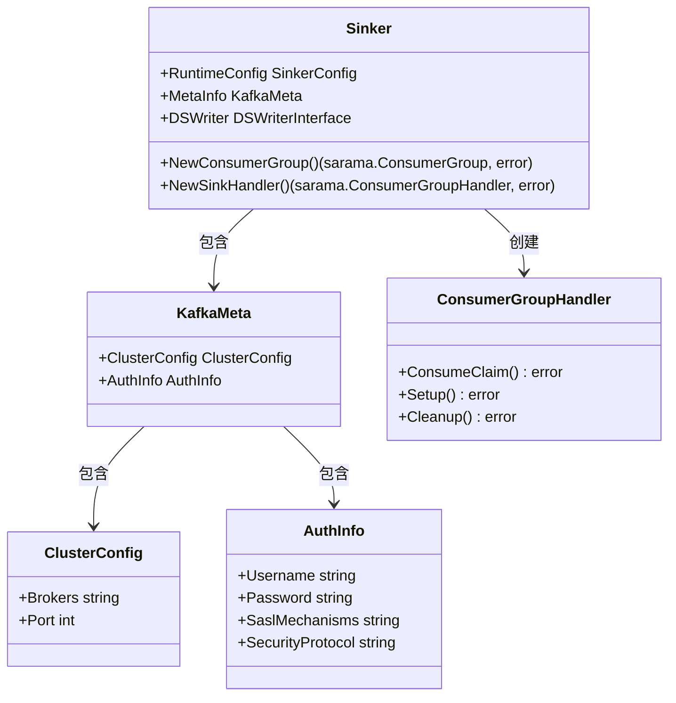
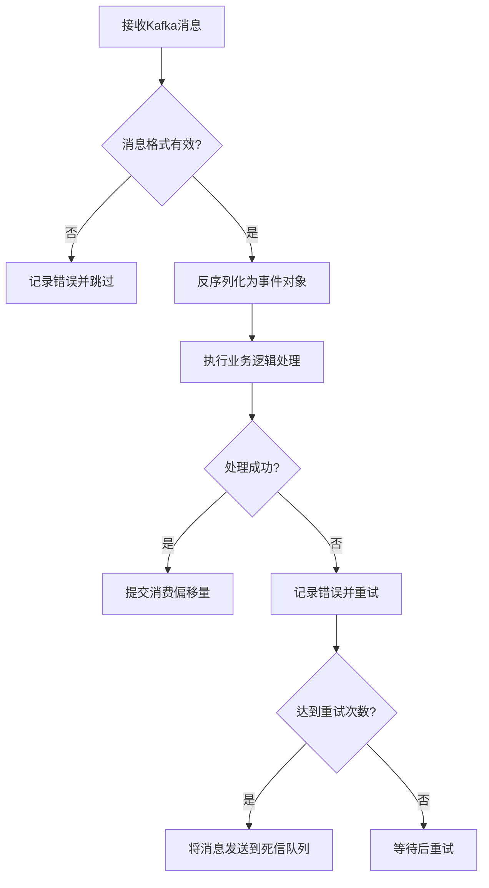
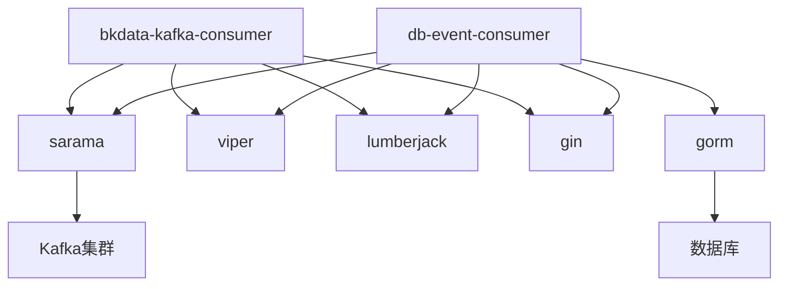

# 消息队列集成

<cite>
**本文档引用的文件**  
- [main.go](file://dbm-services/common/bkdata-kafka-consumer/main.go)
- [main.go](file://dbm-services/common/db-event-consumer/main.go)
- [root.go](file://dbm-services/common/bkdata-kafka-consumer/cmd/root.go)
- [init.go](file://dbm-services/common/bkdata-kafka-consumer/cmd/init.go)
- [root.go](file://dbm-services/common/db-event-consumer/cmd/root.go)
- [init.go](file://dbm-services/common/db-event-consumer/cmd/init.go)
- [new_consumer_group.go](file://dbm-services/common/bkdata-kafka-consumer/pkg/consumer/new_consumer_group.go)
- [new_consumer_group.go](file://dbm-services/common/db-event-consumer/pkg/consumer/new_consumer_group.go)
- [sinker_config.go](file://dbm-services/common/db-event-consumer/pkg/config/sinker_config.go)
- [model_base.go](file://dbm-services/common/db-event-consumer/pkg/base/model_base.go)
- [consumer.go](file://dbm-services/common/dbha-v2/internal/receiver/source/kafka/consumer.go)
- [dbevent-report/main.go](file://dbm-services/common/reverseapi/cmd/dbevent-report/main.go)
</cite>

## 目录
1. [简介](#简介)
2. [项目结构](#项目结构)
3. [核心组件](#核心组件)
4. [架构概述](#架构概述)
5. [详细组件分析](#详细组件分析)
6. [依赖分析](#依赖分析)
7. [性能考虑](#性能考虑)
8. [故障排除指南](#故障排除指南)
9. [结论](#结论)

## 简介
本文档详细说明了蓝鲸DB管理系统（BlueKing-BK-DBM）如何使用Kafka作为消息中间件实现异步通信和事件驱动架构。文档重点分析了`bkdata-kafka-consumer`和`db-event-consumer`两个核心服务的实现机制，涵盖消息的生产、消费、序列化/反序列化过程以及消费者组的管理。同时，文档化了关键事件类型（如数据库实例创建、状态变更）的消息格式和处理流程，并提供了Kafka集群连接、Topic管理、消费偏移量控制等配置指南。最后，包含高可用性设计、消息积压处理和故障恢复的最佳实践。

## 项目结构
系统中的消息队列集成主要由两个核心消费者服务构成：`bkdata-kafka-consumer`和`db-event-consumer`。这两个服务均位于`dbm-services/common/`目录下，采用Go语言开发，基于Sarama库与Kafka集群进行交互。

**图示来源**
- [main.go](file://dbm-services/common/bkdata-kafka-consumer/main.go)
- [main.go](file://dbm-services/common/db-event-consumer/main.go)

**本节来源**
- [main.go](file://dbm-services/common/bkdata-kafka-consumer/main.go#L1-L16)
- [main.go](file://dbm-services/common/db-event-consumer/main.go#L1-L18)

## 核心组件
平台的核心消息队列组件包括两个独立的消费者服务：`bkdata-kafka-consumer`负责通用数据的消费与落盘，而`db-event-consumer`则专注于处理数据库相关的事件流。两个服务均通过`main.go`文件中的`main`函数启动，并调用`cmd.Execute()`来初始化命令行接口和配置加载。服务的入口点设计简洁，将复杂的初始化逻辑封装在`cmd`包中，实现了关注点分离。

**本节来源**
- [main.go](file://dbm-services/common/bkdata-kafka-consumer/main.go#L1-L16)
- [main.go](file://dbm-services/common/db-event-consumer/main.go#L1-L18)

## 架构概述
整个消息队列集成架构遵循典型的生产者-消费者模式。业务系统作为生产者，将数据库操作、状态变更等事件以JSON格式发布到Kafka的特定Topic中。`bkdata-kafka-consumer`和`db-event-consumer`作为消费者，订阅这些Topic，处理接收到的消息，并将结果写入下游系统（如数据库或监控系统）。

**图示来源**
- [root.go](file://dbm-services/common/bkdata-kafka-consumer/cmd/root.go#L29-L88)
- [root.go](file://dbm-services/common/db-event-consumer/cmd/root.go#L32-L115)

## 详细组件分析

### bkdata-kafka-consumer 分析
`bkdata-kafka-consumer`服务是一个通用的数据消费服务，其主要职责是将Kafka中的消息消费后写入到指定的数据存储中。该服务通过配置文件定义了多个`sinker`（接收器），每个`sinker`对应一个Kafka Topic和一个目标数据源。

#### 启动与配置初始化
服务启动时，首先解析命令行参数中的配置文件路径，然后加载配置。配置初始化完成后，会设置日志系统，支持控制台输出和文件输出，并可根据配置选择JSON或文本格式的日志。

**图示来源**
- [root.go](file://dbm-services/common/bkdata-kafka-consumer/cmd/root.go#L29-L88)
- [init.go](file://dbm-services/common/bkdata-kafka-consumer/cmd/init.go#L38-L89)

**本节来源**
- [root.go](file://dbm-services/common/bkdata-kafka-consumer/cmd/root.go#L29-L88)
- [init.go](file://dbm-services/common/bkdata-kafka-consumer/cmd/init.go#L1-L90)

### db-event-consumer 分析
`db-event-consumer`服务专门用于处理数据库相关的事件，如实例创建、删除、状态变更等。它在架构上与`bkdata-kafka-consumer`类似，但增加了对指标收集和上报的支持。

#### 消费者组创建与SASL认证
该服务在创建Kafka消费者组时，会根据配置进行SASL认证。支持`SCRAM-SHA-512`和明文两种认证机制。当使用`SCRAM-SHA-512`时，会设置相应的SASL版本和客户端生成函数。

**图示来源**
- [new_consumer_group.go](file://dbm-services/common/db-event-consumer/pkg/consumer/new_consumer_group.go#L108-L146)
- [sinker_config.go](file://dbm-services/common/db-event-consumer/pkg/config/sinker_config.go#L38-L55)

**本节来源**
- [root.go](file://dbm-services/common/db-event-consumer/cmd/root.go#L32-L115)
- [new_consumer_group.go](file://dbm-services/common/db-event-consumer/pkg/consumer/new_consumer_group.go#L108-L146)

### 消息格式与处理流程
平台定义了标准化的事件消息格式，确保了不同服务间的互操作性。关键的事件消息包含时间戳、来源IP、业务ID、集群类型和事件类型等元数据。

#### 关键事件类型
- **数据库实例创建**: 触发资源分配和初始化流程
- **数据库实例状态变更**: 如从"运行中"变为"已停止"，用于更新监控状态
- **配置变更**: 数据库参数调整，用于审计和回滚
- **备份完成**: 触发备份验证和归档流程

#### 消息处理流程
消息的处理流程包括反序列化、验证、业务逻辑处理和结果确认。`db-event-consumer`中的`oneEvent`结构体实现了事件接口，用于处理从Kafka接收到的JSON消息。

**图示来源**
- [model_base.go](file://dbm-services/common/db-event-consumer/pkg/base/model_base.go#L30-L52)
- [dbevent-report/main.go](file://dbm-services/common/reverseapi/cmd/dbevent-report/main.go#L83-L108)

**本节来源**
- [model_base.go](file://dbm-services/common/db-event-consumer/pkg/base/model_base.go#L30-L52)
- [dbevent-report/main.go](file://dbm-services/common/reverseapi/cmd/dbevent-report/main.go#L83-L108)

## 依赖分析
两个消费者服务都依赖于Sarama库与Kafka交互，并使用Viper库进行配置管理。`db-event-consumer`还依赖于Gin框架提供HTTP健康检查接口，并使用`lumberjack`进行日志轮转。

**图示来源**
- [go.mod](file://dbm-services/common/bkdata-kafka-consumer/go.mod)
- [go.mod](file://dbm-services/common/db-event-consumer/go.mod)

**本节来源**
- [go.mod](file://dbm-services/common/bkdata-kafka-consumer/go.mod)
- [go.mod](file://dbm-services/common/db-event-consumer/go.mod)

## 性能考虑
为了确保高吞吐量和低延迟，消费者服务进行了多项性能优化：
- **批量消费**: 配置了合理的`MaxProcessingTime`（200毫秒），允许在单次处理周期内消费多条消息。
- **自动提交**: 启用了消费偏移量的自动提交，间隔为1秒，平衡了性能和可靠性。
- **并发处理**: 使用`sync.WaitGroup`为每个`sinker`启动独立的goroutine进行消费，实现了并行处理。
- **连接复用**: `sarama.NewConsumerGroup`创建的消费者组会复用底层的网络连接，减少了连接开销。

## 故障排除指南
### 常见问题
1. **无法连接Kafka集群**: 检查`brokers`配置项中的IP和端口是否正确，以及网络连通性。
2. **SASL认证失败**: 确认`username`、`password`和`sasl_mechanisms`配置与Kafka服务器设置一致。
3. **消息积压**: 检查消费者服务的CPU和内存使用率，考虑增加消费者实例或优化处理逻辑。
4. **消费偏移量不提交**: 检查`AutoCommit`配置是否启用，并确认处理逻辑中没有未捕获的panic。

### 监控指标
`db-event-consumer`服务支持将消费延迟、消息处理速率等指标上报到蓝鲸监控系统（BKM），便于实时监控和告警。

**本节来源**
- [root.go](file://dbm-services/common/db-event-consumer/cmd/root.go#L43-L52)
- [consumer.go](file://dbm-services/common/dbha-v2/internal/receiver/source/kafka/consumer.go#L98-L138)

## 结论
蓝鲸DB管理系统通过`bkdata-kafka-consumer`和`db-event-consumer`两个服务，构建了一个健壮、可扩展的消息队列集成方案。该方案利用Kafka实现了系统间的异步解耦和事件驱动，支持高可用、高性能的消息处理。通过标准化的消息格式和完善的配置管理，确保了系统的稳定性和可维护性。未来可进一步优化消息压缩、引入Schema Registry以增强数据契约，并实现更智能的消费者水平扩展策略。