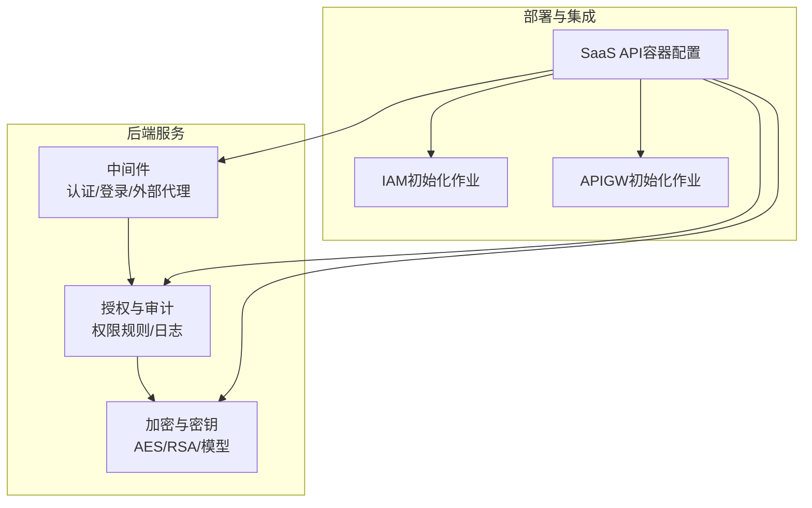
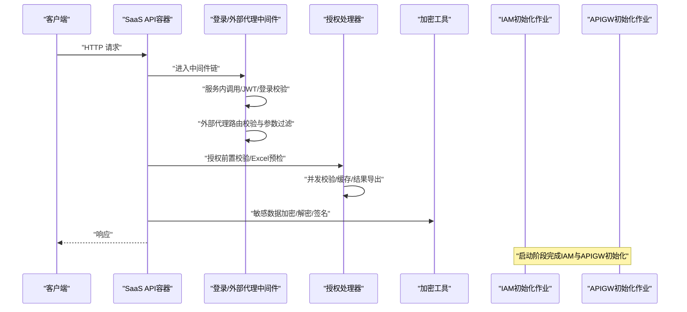
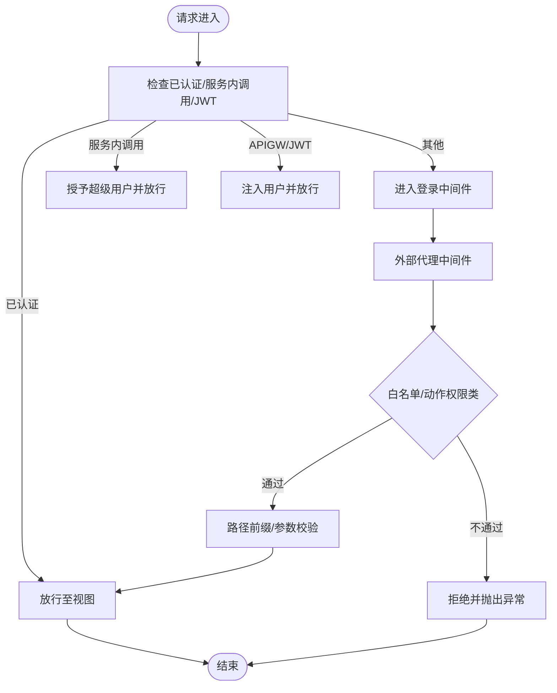
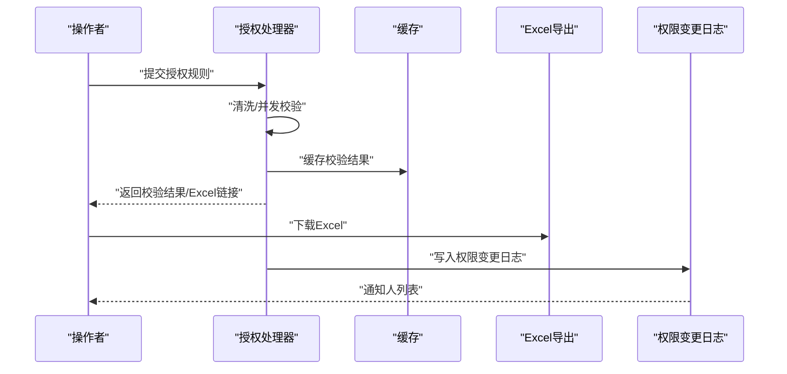
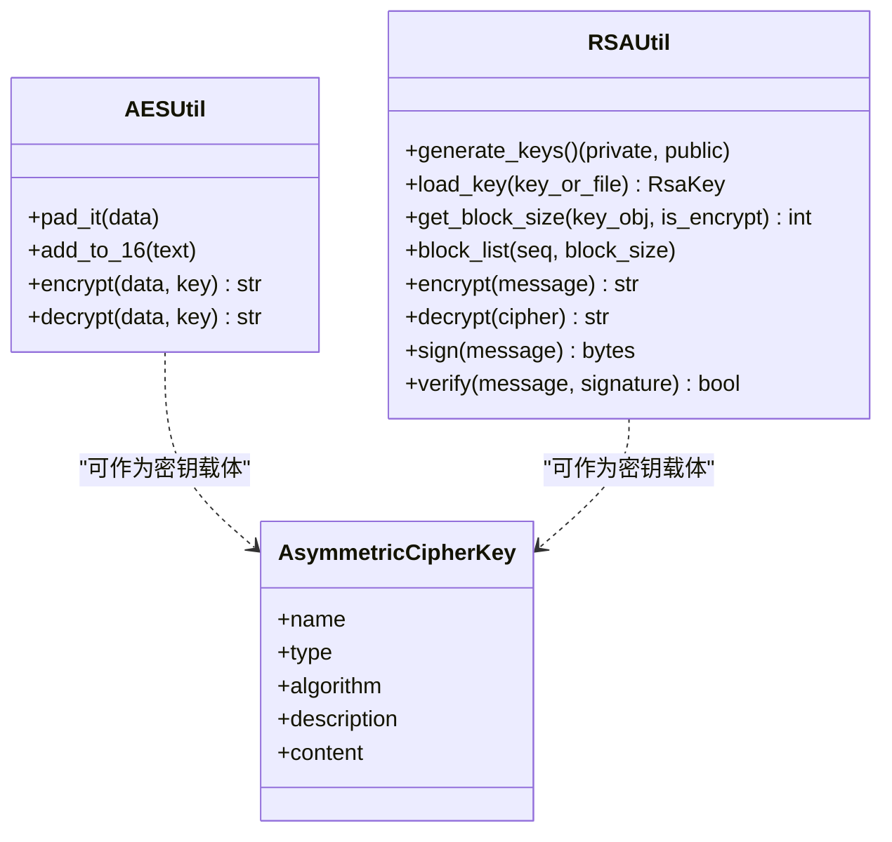
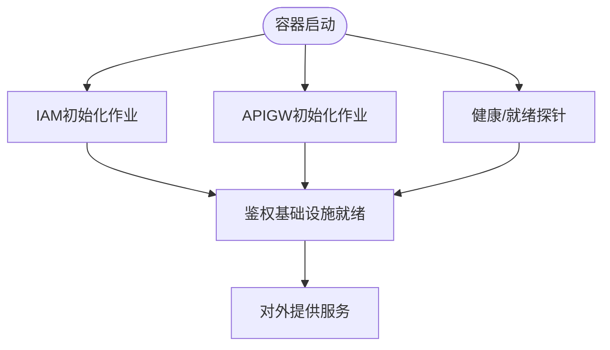
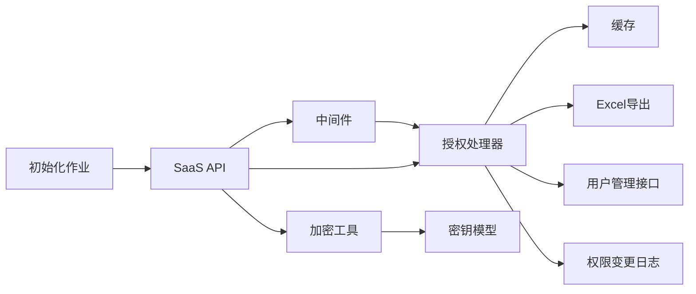

# 安全考虑

<cite>
**本文引用的文件**
- [dbm-ui/backend/bk_web/middleware.py](file://dbm-ui/backend/bk_web/middleware.py)
- [dbm-ui/backend/db_services/dbpermission/db_authorize/handlers.py](file://dbm-ui/backend/db_services/dbpermission/db_authorize/handlers.py)
- [dbm-ui/backend/db_services/dbpermission/db_authorize/models.py](file://dbm-ui/backend/db_services/dbpermission/db_authorize/models.py)
- [dbm-ui/backend/core/encrypt/aes.py](file://dbm-ui/backend/core/encrypt/aes.py)
- [dbm-ui/backend/core/encrypt/rsa.py](file://dbm-ui/backend/core/encrypt/rsa.py)
- [dbm-ui/backend/core/encrypt/models.py](file://dbm-ui/backend/core/encrypt/models.py)
- [dbm-ui/backend/bk_web/exceptions.py](file://dbm-ui/backend/bk_web/exceptions.py)
- [helm-charts/bk-dbm/charts/dbm/templates/deployments/saas-api/saas-api.yaml](file://helm-charts/bk-dbm/charts/dbm/templates/deployments/saas-api/saas-api.yaml)
- [helm-charts/bk-dbm/charts/dbm/templates/jobs/iam-init-job.yaml](file://helm-charts/bk-dbm/charts/dbm/templates/jobs/iam-init-job.yaml)
- [helm-charts/bk-dbm/charts/dbm/templates/jobs/apigw-init-job.yaml](file://helm-charts/bk-dbm/charts/dbm/templates/jobs/apigw-init-job.yaml)
</cite>

## 目录
1. [引言](#引言)
2. [项目结构](#项目结构)
3. [核心组件](#核心组件)
4. [架构总览](#架构总览)
5. [详细组件分析](#详细组件分析)
6. [依赖关系分析](#依赖关系分析)
7. [性能与安全特性](#性能与安全特性)
8. [故障排查指南](#故障排查指南)
9. [结论](#结论)
10. [附录](#附录)

## 引言
本文件面向DBM项目的“安全考虑”，系统梳理认证授权、数据加密、访问控制、审计日志与运行时安全配置等方面的技术实现与最佳实践。重点覆盖：
- 认证授权机制：基于蓝鲸体系的JWT与APIGW认证、登录中间件扩展、服务内调用信任与外部代理路由控制。
- 数据加密方法：对称/AES与非对称/RSA工具封装、密钥模型与密钥管理建议。
- 访问控制策略：权限规则、白名单路由、外部代理转发限制与参数校验。
- 审计日志实现：权限变更记录、操作日志索引与通知机制。
- 运行时安全配置：容器探针、初始化作业、API网关与IAM集成。

## 项目结构
围绕安全主题，DBM在后端Python服务（dbm-ui）与Kubernetes部署（helm-charts）两处落地：
- Python后端安全相关模块
  - 认证授权与中间件：bk_web/middleware.py
  - 权限授权与审计：db_services/dbpermission/db_authorize/*
  - 数据加密与密钥：core/encrypt/*
- K8s部署与初始化
  - SaaS API容器配置与健康探针：helm-charts/.../saas-api.yaml
  - IAM/APIGW初始化作业：helm-charts/.../iam-init-job.yaml、helm-charts/.../apigw-init-job.yaml

图表来源
- [dbm-ui/backend/bk_web/middleware.py:74-115](file://dbm-ui/backend/bk_web/middleware.py#L74-L115)
- [dbm-ui/backend/db_services/dbpermission/db_authorize/handlers.py:29-88](file://dbm-ui/backend/db_services/dbpermission/db_authorize/handlers.py#L29-L88)
- [dbm-ui/backend/core/encrypt/aes.py:33-57](file://dbm-ui/backend/core/encrypt/aes.py#L33-L57)
- [dbm-ui/backend/core/encrypt/rsa.py:45-195](file://dbm-ui/backend/core/encrypt/rsa.py#L45-L195)
- [helm-charts/bk-dbm/charts/dbm/templates/deployments/saas-api/saas-api.yaml:39-62](file://helm-charts/bk-dbm/charts/dbm/templates/deployments/saas-api/saas-api.yaml#L39-L62)
- [helm-charts/bk-dbm/charts/dbm/templates/jobs/iam-init-job.yaml:1-33](file://helm-charts/bk-dbm/charts/dbm/templates/jobs/iam-init-job.yaml#L1-L33)
- [helm-charts/bk-dbm/charts/dbm/templates/jobs/apigw-init-job.yaml:1-33](file://helm-charts/bk-dbm/charts/dbm/templates/jobs/apigw-init-job.yaml#L1-L33)

章节来源
- [dbm-ui/backend/bk_web/middleware.py:1-269](file://dbm-ui/backend/bk_web/middleware.py#L1-L269)
- [dbm-ui/backend/db_services/dbpermission/db_authorize/handlers.py:1-209](file://dbm-ui/backend/db_services/dbpermission/db_authorize/handlers.py#L1-L209)
- [dbm-ui/backend/db_services/dbpermission/db_authorize/models.py:1-89](file://dbm-ui/backend/db_services/dbpermission/db_authorize/models.py#L1-L89)
- [dbm-ui/backend/core/encrypt/aes.py:1-57](file://dbm-ui/backend/core/encrypt/aes.py#L1-L57)
- [dbm-ui/backend/core/encrypt/rsa.py:1-195](file://dbm-ui/backend/core/encrypt/rsa.py#L1-L195)
- [dbm-ui/backend/core/encrypt/models.py:1-33](file://dbm-ui/backend/core/encrypt/models.py#L1-L33)
- [helm-charts/bk-dbm/charts/dbm/templates/deployments/saas-api/saas-api.yaml:39-62](file://helm-charts/bk-dbm/charts/dbm/templates/deployments/saas-api/saas-api.yaml#L39-L62)
- [helm-charts/bk-dbm/charts/dbm/templates/jobs/iam-init-job.yaml:1-33](file://helm-charts/bk-dbm/charts/dbm/templates/jobs/iam-init-job.yaml#L1-L33)
- [helm-charts/bk-dbm/charts/dbm/templates/jobs/apigw-init-job.yaml:1-33](file://helm-charts/bk-dbm/charts/dbm/templates/jobs/apigw-init-job.yaml#L1-L33)

## 核心组件
- 认证授权中间件
  - 登录必经中间件扩展：支持服务内调用（应用令牌直通）、APIGW JWT用户注入、匿名/超级用户场景。
  - 外部代理中间件：统一路由前缀、白名单校验、参数强制过滤、异常统一处理。
- 权限授权与审计
  - 授权处理器：前置校验、Excel预检、并发校验、结果导出。
  - 权限变更日志：记录操作人、账号ID、规则ID与动作类型，支持通知人筛选。
- 数据加密与密钥
  - AES工具：填充、CBC模式、Base64编码。
  - RSA工具：密钥生成、导入、分块加解密、签名与验签。
  - 密钥模型：非对称密钥命名、类型、算法与内容持久化。
- 运行时安全配置
  - SaaS API容器：健康探针、超时与进程参数；日志格式含请求ID。
  - 初始化作业：启动阶段完成IAM与APIGW初始化，确保后续鉴权可用。

章节来源
- [dbm-ui/backend/bk_web/middleware.py:74-115](file://dbm-ui/backend/bk_web/middleware.py#L74-L115)
- [dbm-ui/backend/bk_web/middleware.py:117-242](file://dbm-ui/backend/bk_web/middleware.py#L117-L242)
- [dbm-ui/backend/db_services/dbpermission/db_authorize/handlers.py:29-88](file://dbm-ui/backend/db_services/dbpermission/db_authorize/handlers.py#L29-L88)
- [dbm-ui/backend/db_services/dbpermission/db_authorize/models.py:49-89](file://dbm-ui/backend/db_services/dbpermission/db_authorize/models.py#L49-L89)
- [dbm-ui/backend/core/encrypt/aes.py:33-57](file://dbm-ui/backend/core/encrypt/aes.py#L33-L57)
- [dbm-ui/backend/core/encrypt/rsa.py:45-195](file://dbm-ui/backend/core/encrypt/rsa.py#L45-L195)
- [dbm-ui/backend/core/encrypt/models.py:19-33](file://dbm-ui/backend/core/encrypt/models.py#L19-L33)
- [helm-charts/bk-dbm/charts/dbm/templates/deployments/saas-api/saas-api.yaml:39-62](file://helm-charts/bk-dbm/charts/dbm/templates/deployments/saas-api/saas-api.yaml#L39-L62)
- [helm-charts/bk-dbm/charts/dbm/templates/jobs/iam-init-job.yaml:1-33](file://helm-charts/bk-dbm/charts/dbm/templates/jobs/iam-init-job.yaml#L1-L33)
- [helm-charts/bk-dbm/charts/dbm/templates/jobs/apigw-init-job.yaml:1-33](file://helm-charts/bk-dbm/charts/dbm/templates/jobs/apigw-init-job.yaml#L1-L33)

## 架构总览
下图展示从请求进入SaaS API到中间件认证、授权校验与加密处理的整体流程，以及初始化作业对鉴权基础设施的支撑。

图表来源
- [dbm-ui/backend/bk_web/middleware.py:74-115](file://dbm-ui/backend/bk_web/middleware.py#L74-L115)
- [dbm-ui/backend/bk_web/middleware.py:117-242](file://dbm-ui/backend/bk_web/middleware.py#L117-L242)
- [dbm-ui/backend/db_services/dbpermission/db_authorize/handlers.py:90-144](file://dbm-ui/backend/db_services/dbpermission/db_authorize/handlers.py#L90-L144)
- [dbm-ui/backend/core/encrypt/aes.py:33-57](file://dbm-ui/backend/core/encrypt/aes.py#L33-L57)
- [dbm-ui/backend/core/encrypt/rsa.py:131-165](file://dbm-ui/backend/core/encrypt/rsa.py#L131-L165)
- [helm-charts/bk-dbm/charts/dbm/templates/jobs/iam-init-job.yaml:1-33](file://helm-charts/bk-dbm/charts/dbm/templates/jobs/iam-init-job.yaml#L1-L33)
- [helm-charts/bk-dbm/charts/dbm/templates/jobs/apigw-init-job.yaml:1-33](file://helm-charts/bk-dbm/charts/dbm/templates/jobs/apigw-init-job.yaml#L1-L33)

## 详细组件分析

### 认证授权机制
- 服务内调用信任
  - 通过应用标识与密钥比对，授予超级用户权限，绕过部分CSRF校验。
- APIGW/JWT用户注入
  - 从JWT或请求头提取用户名，动态创建或获取用户对象，注入到请求上下文。
- 外部代理路由控制
  - 统一前缀“/external”映射，白名单路由与动作权限类判定，特殊接口参数强制过滤与校验。
- 异常处理
  - 外部代理异常统一包装，便于前端与日志定位。

图表来源
- [dbm-ui/backend/bk_web/middleware.py:74-115](file://dbm-ui/backend/bk_web/middleware.py#L74-L115)
- [dbm-ui/backend/bk_web/middleware.py:117-242](file://dbm-ui/backend/bk_web/middleware.py#L117-L242)
- [dbm-ui/backend/bk_web/exceptions.py:17-36](file://dbm-ui/backend/bk_web/exceptions.py#L17-L36)

章节来源
- [dbm-ui/backend/bk_web/middleware.py:74-115](file://dbm-ui/backend/bk_web/middleware.py#L74-L115)
- [dbm-ui/backend/bk_web/middleware.py:117-242](file://dbm-ui/backend/bk_web/middleware.py#L117-L242)
- [dbm-ui/backend/bk_web/exceptions.py:17-36](file://dbm-ui/backend/bk_web/exceptions.py#L17-L36)

### 权限管理与审计日志
- 授权前置校验
  - 支持单账号与多账号规则清洗，异步并发校验，结果缓存与Excel导出。
- 权限变更审计
  - 记录操作人、账号ID、规则ID与动作类型，建立索引便于查询。
  - 通知人筛选：结合系统设置与用户管理接口过滤虚拟/离职用户。

图表来源
- [dbm-ui/backend/db_services/dbpermission/db_authorize/handlers.py:90-144](file://dbm-ui/backend/db_services/dbpermission/db_authorize/handlers.py#L90-L144)
- [dbm-ui/backend/db_services/dbpermission/db_authorize/handlers.py:184-209](file://dbm-ui/backend/db_services/dbpermission/db_authorize/handlers.py#L184-L209)
- [dbm-ui/backend/db_services/dbpermission/db_authorize/models.py:49-89](file://dbm-ui/backend/db_services/dbpermission/db_authorize/models.py#L49-L89)

章节来源
- [dbm-ui/backend/db_services/dbpermission/db_authorize/handlers.py:29-88](file://dbm-ui/backend/db_services/dbpermission/db_authorize/handlers.py#L29-L88)
- [dbm-ui/backend/db_services/dbpermission/db_authorize/handlers.py:90-144](file://dbm-ui/backend/db_services/dbpermission/db_authorize/handlers.py#L90-L144)
- [dbm-ui/backend/db_services/dbpermission/db_authorize/handlers.py:184-209](file://dbm-ui/backend/db_services/dbpermission/db_authorize/handlers.py#L184-L209)
- [dbm-ui/backend/db_services/dbpermission/db_authorize/models.py:49-89](file://dbm-ui/backend/db_services/dbpermission/db_authorize/models.py#L49-L89)

### 数据加密与密钥管理
- AES对称加密
  - CBC模式、固定块大小填充、Base64编码输出。
- RSA非对称加密
  - 支持PKCS#1 v1.5与OAEP填充，密钥对象加载与分块加解密，签名与验签。
- 密钥模型
  - 非对称密钥命名、类型、算法与内容持久化，唯一性约束避免重复。

图表来源
- [dbm-ui/backend/core/encrypt/aes.py:19-57](file://dbm-ui/backend/core/encrypt/aes.py#L19-L57)
- [dbm-ui/backend/core/encrypt/rsa.py:45-195](file://dbm-ui/backend/core/encrypt/rsa.py#L45-L195)
- [dbm-ui/backend/core/encrypt/models.py:19-33](file://dbm-ui/backend/core/encrypt/models.py#L19-L33)

章节来源
- [dbm-ui/backend/core/encrypt/aes.py:19-57](file://dbm-ui/backend/core/encrypt/aes.py#L19-L57)
- [dbm-ui/backend/core/encrypt/rsa.py:45-195](file://dbm-ui/backend/core/encrypt/rsa.py#L45-L195)
- [dbm-ui/backend/core/encrypt/models.py:19-33](file://dbm-ui/backend/core/encrypt/models.py#L19-L33)

### 运行时安全配置与初始化
- SaaS API容器
  - 健康探针与就绪探针路径、超时与进程参数，访问日志包含请求ID，便于追踪。
- 初始化作业
  - IAM初始化：服务启动阶段完成IAM初始化与迁移。
  - APIGW初始化：同步SaaS API网关配置，保障后续鉴权链路可用。

图表来源
- [helm-charts/bk-dbm/charts/dbm/templates/deployments/saas-api/saas-api.yaml:39-62](file://helm-charts/bk-dbm/charts/dbm/templates/deployments/saas-api/saas-api.yaml#L39-L62)
- [helm-charts/bk-dbm/charts/dbm/templates/jobs/iam-init-job.yaml:1-33](file://helm-charts/bk-dbm/charts/dbm/templates/jobs/iam-init-job.yaml#L1-L33)
- [helm-charts/bk-dbm/charts/dbm/templates/jobs/apigw-init-job.yaml:1-33](file://helm-charts/bk-dbm/charts/dbm/templates/jobs/apigw-init-job.yaml#L1-L33)

章节来源
- [helm-charts/bk-dbm/charts/dbm/templates/deployments/saas-api/saas-api.yaml:39-62](file://helm-charts/bk-dbm/charts/dbm/templates/deployments/saas-api/saas-api.yaml#L39-L62)
- [helm-charts/bk-dbm/charts/dbm/templates/jobs/iam-init-job.yaml:1-33](file://helm-charts/bk-dbm/charts/dbm/templates/jobs/iam-init-job.yaml#L1-L33)
- [helm-charts/bk-dbm/charts/dbm/templates/jobs/apigw-init-job.yaml:1-33](file://helm-charts/bk-dbm/charts/dbm/templates/jobs/apigw-init-job.yaml#L1-L33)

## 依赖关系分析
- 中间件依赖
  - 登录中间件与APIGW认证后端协作，确保用户身份注入与权限判定。
  - 外部代理中间件依赖白名单配置与动作权限类判定。
- 授权处理器依赖
  - 缓存与并发执行框架，Excel导出工具，系统设置与用户管理接口。
- 加密模块依赖
  - PyCryptodome库，密钥模型作为持久化载体。
- 部署依赖
  - 初始化作业先决条件，确保鉴权基础设施可用后再对外提供服务。

图表来源
- [dbm-ui/backend/bk_web/middleware.py:74-115](file://dbm-ui/backend/bk_web/middleware.py#L74-L115)
- [dbm-ui/backend/db_services/dbpermission/db_authorize/handlers.py:90-144](file://dbm-ui/backend/db_services/dbpermission/db_authorize/handlers.py#L90-L144)
- [dbm-ui/backend/core/encrypt/rsa.py:45-195](file://dbm-ui/backend/core/encrypt/rsa.py#L45-L195)
- [dbm-ui/backend/core/encrypt/models.py:19-33](file://dbm-ui/backend/core/encrypt/models.py#L19-L33)
- [helm-charts/bk-dbm/charts/dbm/templates/jobs/iam-init-job.yaml:1-33](file://helm-charts/bk-dbm/charts/dbm/templates/jobs/iam-init-job.yaml#L1-L33)

章节来源
- [dbm-ui/backend/bk_web/middleware.py:74-115](file://dbm-ui/backend/bk_web/middleware.py#L74-L115)
- [dbm-ui/backend/db_services/dbpermission/db_authorize/handlers.py:90-144](file://dbm-ui/backend/db_services/dbpermission/db_authorize/handlers.py#L90-L144)
- [dbm-ui/backend/core/encrypt/rsa.py:45-195](file://dbm-ui/backend/core/encrypt/rsa.py#L45-L195)
- [dbm-ui/backend/core/encrypt/models.py:19-33](file://dbm-ui/backend/core/encrypt/models.py#L19-L33)
- [helm-charts/bk-dbm/charts/dbm/templates/jobs/iam-init-job.yaml:1-33](file://helm-charts/bk-dbm/charts/dbm/templates/jobs/iam-init-job.yaml#L1-L33)

## 性能与安全特性
- 性能
  - 授权前置校验采用线程池并发，降低IO密集型校验的总耗时。
  - 缓存短期预检结果，减少重复计算与网络请求。
- 安全
  - 外部代理中间件对路由与参数进行白名单与强制过滤，降低越权与注入风险。
  - 日志包含请求ID，便于跨服务追踪与审计。
  - 初始化作业在容器启动阶段完成鉴权基础设施准备，避免运行期鉴权失败。

章节来源
- [dbm-ui/backend/db_services/dbpermission/db_authorize/handlers.py:90-144](file://dbm-ui/backend/db_services/dbpermission/db_authorize/handlers.py#L90-L144)
- [dbm-ui/backend/bk_web/middleware.py:63-71](file://dbm-ui/backend/bk_web/middleware.py#L63-L71)
- [helm-charts/bk-dbm/charts/dbm/templates/deployments/saas-api/saas-api.yaml:39-62](file://helm-charts/bk-dbm/charts/dbm/templates/deployments/saas-api/saas-api.yaml#L39-L62)
- [helm-charts/bk-dbm/charts/dbm/templates/jobs/iam-init-job.yaml:1-33](file://helm-charts/bk-dbm/charts/dbm/templates/jobs/iam-init-job.yaml#L1-L33)
- [helm-charts/bk-dbm/charts/dbm/templates/jobs/apigw-init-job.yaml:1-33](file://helm-charts/bk-dbm/charts/dbm/templates/jobs/apigw-init-job.yaml#L1-L33)

## 故障排查指南
- 外部代理异常
  - 路由非法、单据类型未白名单、集群请求非法等均会触发统一异常，需检查白名单配置与参数。
- 认证失败
  - 服务内调用密钥不匹配、APIGW/JWT缺失或无效、用户不存在等情况，需核对环境变量与APIGW配置。
- 加密问题
  - AES/RSA密钥长度或格式不正确、分块加解密边界错误、签名验签失败，需检查密钥与填充方式。
- 初始化失败
  - IAM或APIGW初始化作业未完成导致鉴权不可用，需查看作业日志并重试。

章节来源
- [dbm-ui/backend/bk_web/exceptions.py:17-36](file://dbm-ui/backend/bk_web/exceptions.py#L17-L36)
- [dbm-ui/backend/bk_web/middleware.py:74-115](file://dbm-ui/backend/bk_web/middleware.py#L74-L115)
- [dbm-ui/backend/core/encrypt/aes.py:33-57](file://dbm-ui/backend/core/encrypt/aes.py#L33-L57)
- [dbm-ui/backend/core/encrypt/rsa.py:131-165](file://dbm-ui/backend/core/encrypt/rsa.py#L131-L165)
- [helm-charts/bk-dbm/charts/dbm/templates/jobs/iam-init-job.yaml:1-33](file://helm-charts/bk-dbm/charts/dbm/templates/jobs/iam-init-job.yaml#L1-L33)
- [helm-charts/bk-dbm/charts/dbm/templates/jobs/apigw-init-job.yaml:1-33](file://helm-charts/bk-dbm/charts/dbm/templates/jobs/apigw-init-job.yaml#L1-L33)

## 结论
DBM在认证授权、权限审计与数据加密方面形成了较为完整的实现闭环：以蓝鲸APIGW/JWT为基础的认证、以中间件为核心的访问控制、以授权处理器与日志模型为支撑的审计，以及以AES/RSA工具与密钥模型为载体的加密能力。配合SaaS API容器的健康探针与初始化作业，整体具备良好的运行时安全性与可观测性。建议在生产环境中进一步完善密钥轮换、最小权限原则与合规审计流程。

## 附录
- 最佳实践清单
  - 密钥管理：密钥分离、轮换策略、最小暴露面；密钥内容仅在内存与受控介质中短暂驻留。
  - 输入验证：严格白名单与参数校验，拒绝未知路由与非法参数。
  - 输出编码：对外输出统一编码，避免二次解释引发的注入风险。
  - 审计与告警：完善权限变更日志索引与告警联动，定期回溯高危操作。
  - 合规与事件响应：建立合规基线与事件响应预案，明确责任与处置流程。