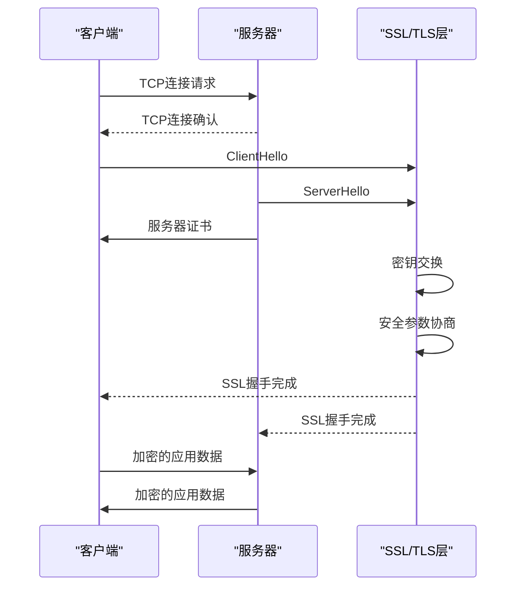
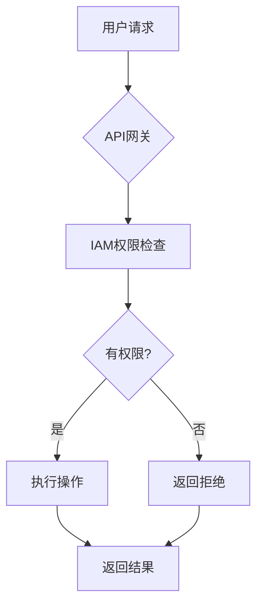
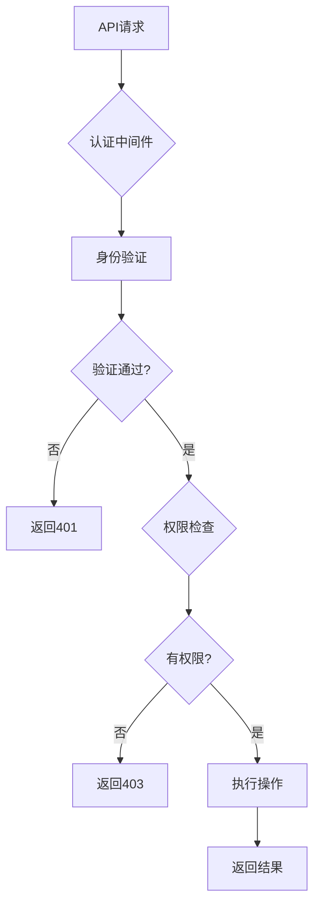

# 安全考虑

<cite>
**本文档引用的文件**
- [rsa_util.go](file://dbm-services/common/go-pubpkg/iocrypt/rsa_util.go)
- [openssl.go](file://dbm-services/common/go-pubpkg/iocrypt/openssl.go)
- [permission.py](file://dbm-ui/backend/iam_app/handlers/permission.py)
- [definition.yaml](file://dbm-ui/backend/dbm_init/apigw/definition.yaml)
- [sync_saas_apigw.py](file://dbm-ui/backend/dbm_init/management/commands/sync_saas_apigw.py)
- [const.go](file://dbm-services/common/db-config/pkg/validatestruct/const.go)
- [check_value.go](file://dbm-services/common/db-config/pkg/validatestruct/check_value.go)
- [validate.go](file://dbm-services/sqlserver/db-tools/dbactuator/pkg/util/validate/validate.go)
- [security_rule.go](file://dbm-services/mysql/db-priv/handler/security_rule.go)
- [security_rule.go](file://dbm-services/mysql/db-priv/service/security_rule.go)
- [password_policy.py](file://dbm-ui/backend/configuration/views/password_policy.py)
- [gin_server.go](file://dbm-services/common/dbha-v2/pkg/hanet/gin_server.go)
- [log4j.properties](file://dbm-services/bigdata/db-tools/dbactuator/pkg/components/hdfs/config_tpl/log4j.properties)
</cite>

## 目录
1. [引言](#引言)
2. [数据安全](#数据安全)
3. [传输安全](#传输安全)
4. [认证与授权](#认证与授权)
5. [输入验证](#输入验证)
6. [安全配置](#安全配置)
7. [敏感数据存储与访问控制](#敏感数据存储与访问控制)
8. [安全审计日志](#安全审计日志)
9. [漏洞管理流程](#漏洞管理流程)
10. [安全最佳实践与风险缓解](#安全最佳实践与风险缓解)

## 引言
本安全文档全面阐述了蓝鲸DBM系统的安全架构与机制，涵盖数据安全、传输安全、认证授权、输入验证、安全配置等多个维度。文档详细说明了系统如何保护敏感数据、确保通信安全、实施访问控制以及进行安全审计，为系统管理员和开发人员提供全面的安全指导。

## 数据安全
系统实现了多层次的数据安全保护机制，主要通过AES和RSA加密算法来保障数据的机密性。

### AES加密
系统使用OpenSSL工具实现AES加密，支持AES-256-CBC等加密算法。在文件加密场景中，系统通过OpenSSL命令行工具对文件进行加密处理，确保静态数据的安全性。加密过程使用指定的密钥和加密算法，生成加密后的文件。

### RSA加密
系统实现了完整的RSA非对称加密机制，用于加密敏感信息和密钥交换。核心功能包括：

- **密钥对生成**：使用`GenerateKeyPair`函数生成指定长度的RSA密钥对（私钥和公钥）
- **公钥加密**：使用`EncryptWithPublicKey`函数通过公钥加密数据，采用PKCS1v15填充方案
- **私钥解密**：使用`DecryptWithPrivateKey`函数通过私钥解密数据
- **字符串加密**：提供`EncryptStringWithPubicKey`函数，使用RSA公钥加密对称密钥，并返回Base64编码的密文

这些加密功能主要用于保护敏感配置信息和在不同系统组件间安全传输密钥。

**Section sources**
- [rsa_util.go](file://dbm-services/common/go-pubpkg/iocrypt/rsa_util.go)
- [openssl.go](file://dbm-services/common/go-pubpkg/iocrypt/openssl.go)

## 传输安全
系统通过HTTPS协议确保网络传输过程中的数据安全，防止数据被窃听或篡改。

### HTTPS实现
在多个数据库工具组件中，系统实现了HTTPS连接支持。当连接方案（scheme）为'https'时，系统会启动SSL/TLS加密连接：

1. 使用`IO::Socket::SSL->start_SSL`方法启动SSL连接
2. 验证服务器证书的有效性，确保连接到正确的主机
3. 通过`verify_hostname`方法验证SSL证书是否与主机名匹配

这种机制确保了客户端与服务器之间的通信是加密的，有效防止中间人攻击。

### 安全通信流程

**Diagram sources**
- [pt-table-checksum](file://dbm-services/mysql/db-tools/mysql-table-checksum/pt-table-checksum#L360-L398)
- [pt-table-sync](file://dbm-services/mysql/db-tools/mysql-table-checksum/pt-table-sync#L8784-L8830)
- [pt-config-diff](file://dbm-services/mysql/db-tools/mysql-monitor/pt-config-diff#L4335-L4373)

**Section sources**
- [pt-table-checksum](file://dbm-services/mysql/db-tools/mysql-table-checksum/pt-table-checksum#L360-L398)
- [pt-table-sync](file://dbm-services/mysql/db-tools/mysql-table-checksum/pt-table-sync#L8784-L8830)

## 认证与授权
系统实现了基于IAM（身份与访问管理）的认证与授权机制，通过API网关进行访问控制。

### IAM认证
系统使用IAM服务进行用户身份验证和权限检查。核心组件包括：

- **权限检查**：通过`is_allowed`方法检查用户是否有执行特定操作的权限
- **超级管理员**：超级管理员用户自动获得所有权限
- **异常处理**：在IAM API错误时记录异常并返回默认权限结果

### API网关授权
系统通过API网关实现集中式访问控制，主要配置包括：

- **网关定义**：在`definition.yaml`中定义API网关的基本信息、维护人员和阶段配置
- **主动授权**：通过`grant_permissions`配置，网关主动为指定应用授予访问所有资源的权限
- **资源同步**：通过管理命令同步网关资源、资源文档和MCP服务器配置

授权流程包括：用户请求 → API网关 → IAM权限检查 → 执行操作或返回拒绝

**Diagram sources**
- [definition.yaml](file://dbm-ui/backend/dbm_init/apigw/definition.yaml#L31-L35)
- [sync_saas_apigw.py](file://dbm-ui/backend/dbm_init/management/commands/sync_saas_apigw.py#L91-L117)

**Section sources**
- [permission.py](file://dbm-ui/backend/iam_app/handlers/permission.py#L196-L378)
- [definition.yaml](file://dbm-ui/backend/dbm_init/apigw/definition.yaml#L1-L39)
- [sync_saas_apigw.py](file://dbm-ui/backend/dbm_init/management/commands/sync_saas_apigw.py#L91-L117)

## 输入验证
系统实现了多层次的输入验证机制，确保输入数据的完整性和安全性。

### 结构化验证
系统使用`validatestruct`包对输入数据进行结构化验证，支持多种数据类型和验证规则：

- **基本类型**：支持字符串、整数、浮点数、布尔值等基本类型验证
- **枚举类型**：支持单值枚举（ENUM）和多值枚举（ENUMS）验证
- **范围验证**：支持开闭区间的数值范围验证
- **正则验证**：支持正则表达式模式匹配
- **特殊类型**：支持JSON、MAP、LIST、DURATION等复杂类型验证

### 自定义验证规则
系统实现了自定义验证逻辑，包括：

- **枚举验证**：通过`ValidateEnums`函数实现，将结构体标签中的枚举值与实际值进行比对
- **简单结构验证**：通过`GoValidateStructSimple`函数对结构体进行简单验证，支持启用枚举验证
- **数据类型检查**：通过`CheckDataTypeSub`函数验证数据类型和子类型的组合是否有效

这些验证机制有效防止了无效或恶意输入导致的安全问题。

**Section sources**
- [const.go](file://dbm-services/common/db-config/pkg/validatestruct/const.go#L1-L48)
- [check_value.go](file://dbm-services/common/db-config/pkg/validatestruct/check_value.go#L1-L41)
- [validate.go](file://dbm-services/sqlserver/db-tools/dbactuator/pkg/util/validate/validate.go#L29-L63)

## 安全配置
系统实现了全面的安全配置管理，包括密码策略、访问控制和安全规则。

### 密码策略
系统提供了可配置的密码安全策略，包括：

- **长度要求**：设置密码的最小和最大长度
- **复杂度要求**：要求密码包含字母、数字、特殊字符等
- **连续性规则**：限制连续字母、数字、重复字符、特殊字符和键盘序列
- **包含规则**：要求密码必须包含指定类型的字符

这些策略通过`PasswordPolicySerializer`进行定义和验证，确保系统密码符合安全要求。

### 安全规则管理
系统通过安全规则服务管理密码复杂度规则，主要功能包括：

- **获取安全规则**：通过`GetSecurityRule`接口根据名称查询安全规则
- **添加安全规则**：通过`AddSecurityRule`接口添加新的安全规则
- **密码复杂度检查**：验证密码是否符合指定的安全规则

**Section sources**
- [password_policy.py](file://dbm-ui/backend/configuration/views/password_policy.py#L19-L44)
- [security_rule.go](file://dbm-services/mysql/db-priv/handler/security_rule.go#L1-L60)
- [security_rule.go](file://dbm-services/mysql/db-priv/service/security_rule.go)

## 敏感数据存储与访问控制
系统实施了严格的敏感数据存储和访问控制机制，确保敏感信息的安全。

### 加密存储
系统对敏感配置数据进行加密存储，特别是虚拟机（VM）相关的配置数据。通过在数据库表中设置加密标志，确保敏感配置值以加密形式存储。

### 访问控制
系统通过多层次的访问控制机制保护敏感数据：

- **API认证中间件**：在HTTP服务器中集成认证中间件，对所有API请求进行身份验证
- **权限检查**：在处理请求前检查用户是否有访问特定资源的权限
- **超级用户特权**：超级管理员用户自动获得所有权限

访问控制流程确保只有经过身份验证和授权的用户才能访问敏感数据和执行关键操作。

**Diagram sources**
- [gin_server.go](file://dbm-services/common/dbha-v2/pkg/hanet/gin_server.go#L190-L193)
- [gin_server_test.go](file://dbm-services/common/dbha-v2/pkg/hanet/gin_server_test.go#L96-L140)

**Section sources**
- [gin_server.go](file://dbm-services/common/dbha-v2/pkg/hanet/gin_server.go)
- [vm_data.down.sql](file://dbm-services/common/db-config/assets/migrations/000042_vm_data.down.sql)

## 安全审计日志
系统实现了全面的安全审计日志机制，用于监控和追踪系统活动。

### 日志配置
系统使用Log4j进行日志记录，配置了专门的安全日志和审计日志：

- **安全日志**：记录安全相关事件，如认证、授权等
- **审计日志**：记录关键操作和系统变更
- **日志轮转**：配置日志文件大小限制和备份索引，防止日志文件过大

### 审计日志内容
审计日志包含以下关键信息：

- **时间戳**：事件发生的时间
- **日志级别**：事件的严重程度
- **组件**：生成日志的系统组件
- **消息**：事件的详细描述
- **用户信息**：执行操作的用户

这些日志可用于安全分析、故障排查和合规性审计。

**Section sources**
- [log4j.properties](file://dbm-services/bigdata/db-tools/dbactuator/pkg/components/hdfs/config_tpl/log4j.properties#L29-L59)

## 漏洞管理流程
系统遵循标准的漏洞管理流程，确保及时发现和修复安全漏洞。

### 漏洞管理阶段
漏洞管理流程包括以下阶段：

1. **漏洞发现**：通过代码审计、安全扫描和渗透测试发现潜在漏洞
2. **漏洞评估**：评估漏洞的严重程度和影响范围
3. **漏洞修复**：开发和测试漏洞修复补丁
4. **补丁部署**：在测试环境验证后，将补丁部署到生产环境
5. **验证确认**：验证漏洞是否已成功修复

### 持续改进
系统通过定期的安全评估和代码审查，持续改进安全状况。开发团队遵循安全编码规范，避免常见的安全漏洞，如SQL注入、跨站脚本（XSS）等。

## 安全最佳实践与风险缓解
本节提供系统安全的最佳实践和常见安全风险的缓解措施。

### 安全最佳实践
1. **最小权限原则**：为用户和系统组件分配完成任务所需的最小权限
2. **定期轮换密钥**：定期更换加密密钥和认证令牌
3. **安全配置**：禁用不必要的服务和功能，使用安全的默认配置
4. **日志监控**：持续监控安全日志，及时发现异常活动
5. **定期审计**：定期进行安全审计和渗透测试

### 常见风险缓解
- **数据泄露**：通过加密存储和传输、访问控制来缓解
- **未授权访问**：通过强身份验证、多因素认证和细粒度授权来缓解
- **注入攻击**：通过输入验证、参数化查询和安全编码实践来缓解
- **拒绝服务**：通过速率限制、资源配额和弹性架构来缓解
- **配置错误**：通过配置管理、自动化部署和变更控制来缓解

通过实施这些安全最佳实践和风险缓解措施，系统能够有效应对各种安全威胁，确保数据库管理系统的安全稳定运行。