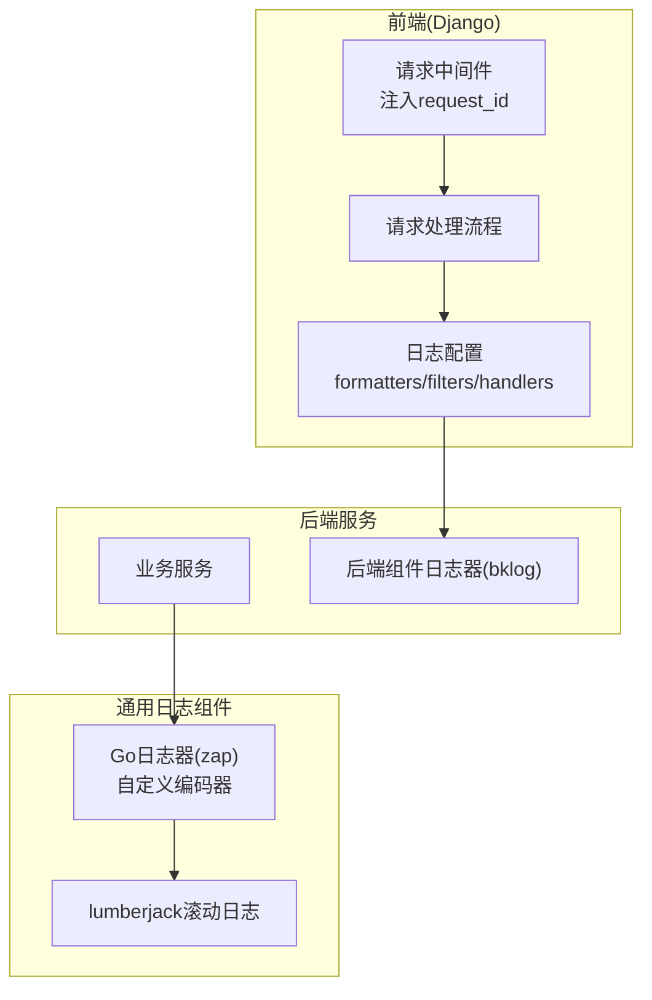
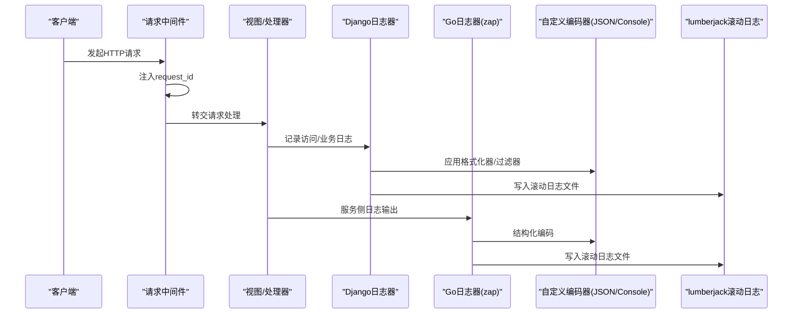
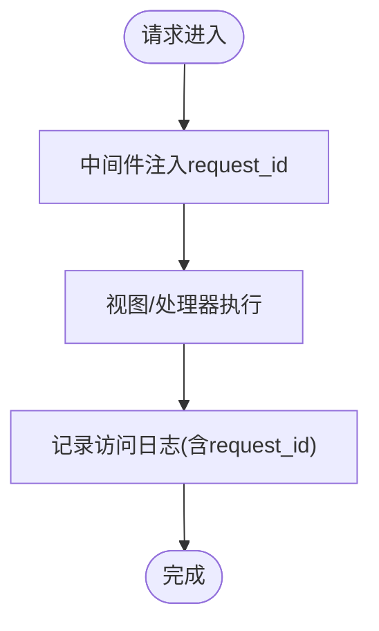
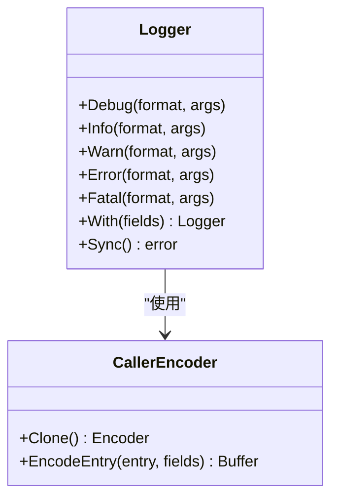
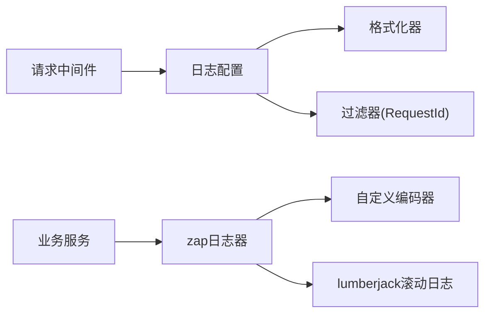

# 审计日志

<cite>
**本文引用的文件**
- [logger.go](file://dbm-services/common/go-pubpkg/logger/logger.go)
- [encoder.go](file://dbm-services/common/go-pubpkg/logger/encoder.go)
- [logger.go](file://dbm-services/k8s-dbs/logger/logger.go)
- [default.py](file://dbm-ui/config/default.py)
- [log.py](file://dbm-ui/backend/utils/log.py)
- [middleware.py](file://dbm-ui/backend/bk_web/middleware.py)
- [logger.go](file://dbm-ui/backend/components/bklog/logger.go)
</cite>

## 目录
1. [简介](#简介)
2. [项目结构](#项目结构)
3. [核心组件](#核心组件)
4. [架构总览](#架构总览)
5. [详细组件分析](#详细组件分析)
6. [依赖分析](#依赖分析)
7. [性能考虑](#性能考虑)
8. [故障排查指南](#故障排查指南)
9. [结论](#结论)
10. [附录](#附录)

## 简介
本文件面向DBM项目的审计日志体系，围绕操作审计、安全审计与合规审计三类目标，系统梳理日志采集、格式化、传输与落库策略，明确用户行为追踪、数据库操作记录、系统访问日志与异常事件监控的实现机制；同时给出日志格式标准化、日志级别分类、敏感信息脱敏与日志聚合分析的实践建议，并提供审计规则配置、告警阈值设置与违规检测算法的实施指南，覆盖日志保留期限、归档策略、查询检索与合规报告生成的技术方案。

## 项目结构
DBM的审计日志能力横跨前端Django后端与多语言微服务侧，形成“请求链路中间件 + 统一日志器 + 服务侧编码器 + 日志落盘/滚动”的整体闭环。前端通过中间件注入请求上下文，后端统一使用Python logging配置与过滤器，服务侧采用Go zap+自定义编码器，部分服务集成lumberjack实现滚动日志。

图表来源
- [middleware.py:54-71](file://dbm-ui/backend/bk_web/middleware.py#L54-L71)
- [default.py:490-540](file://dbm-ui/config/default.py#L490-L540)
- [logger.go:107-154](file://dbm-services/common/go-pubpkg/logger/logger.go#L107-L154)
- [encoder.go:16-46](file://dbm-services/common/go-pubpkg/logger/encoder.go#L16-L46)
- [logger.go:44-101](file://dbm-services/k8s-dbs/logger/logger.go#L44-L101)
- [logger.go](file://dbm-ui/backend/components/bklog/logger.go)

章节来源
- [middleware.py:54-71](file://dbm-ui/backend/bk_web/middleware.py#L54-L71)
- [default.py:490-540](file://dbm-ui/config/default.py#L490-L540)

## 核心组件
- 请求链路中间件：负责注入request_id，贯穿请求生命周期，便于跨服务串联与审计关联。
- Django日志配置：定义多种格式化器、过滤器与处理器，支持控制台、JSON流式输出与请求ID注入。
- Go日志器与编码器：封装zap，提供结构化日志输出与调用者信息增强；支持JSON与控制台编码。
- 滚动日志：基于lumberjack实现按大小/时间/备份数的滚动与压缩，保障长期留存与磁盘管理。
- 后端组件日志器：统一后端组件日志入口，便于集中化采集与治理。

章节来源
- [middleware.py:54-71](file://dbm-ui/backend/bk_web/middleware.py#L54-L71)
- [default.py:490-540](file://dbm-ui/config/default.py#L490-L540)
- [logger.go:107-154](file://dbm-services/common/go-pubpkg/logger/logger.go#L107-L154)
- [encoder.go:16-46](file://dbm-services/common/go-pubpkg/logger/encoder.go#L16-L46)
- [logger.go:44-101](file://dbm-services/k8s-dbs/logger/logger.go#L44-L101)
- [logger.go](file://dbm-ui/backend/components/bklog/logger.go)

## 架构总览
下图展示从请求进入系统到日志落盘的关键路径，包括请求ID注入、日志格式化、结构化字段扩展与滚动落盘。

图表来源
- [middleware.py:54-71](file://dbm-ui/backend/bk_web/middleware.py#L54-L71)
- [default.py:490-540](file://dbm-ui/config/default.py#L490-L540)
- [logger.go:107-154](file://dbm-services/common/go-pubpkg/logger/logger.go#L107-L154)
- [encoder.go:16-46](file://dbm-services/common/go-pubpkg/logger/encoder.go#L16-L46)
- [logger.go:44-101](file://dbm-services/k8s-dbs/logger/logger.go#L44-L101)

## 详细组件分析

### 请求链路与访问审计
- 请求ID注入：中间件在请求进入时生成并注入request_id，响应头回传X-Request-Id，确保跨服务调用可追踪。
- 访问日志：Django日志配置提供verbose/simple/json三种格式，结合RequestIdFilter将request_id写入每条日志。
- 用户身份：中间件支持多种认证方式（含JWT），便于在日志中识别主体，支撑操作审计与安全审计。

图表来源
- [middleware.py:54-71](file://dbm-ui/backend/bk_web/middleware.py#L54-L71)
- [default.py:490-540](file://dbm-ui/config/default.py#L490-L540)

章节来源
- [middleware.py:54-71](file://dbm-ui/backend/bk_web/middleware.py#L54-L71)
- [default.py:490-540](file://dbm-ui/config/default.py#L490-L540)

### 日志格式标准化与级别分类
- Python侧：提供verbose、simple、json三种格式；通过RequestIdFilter统一注入request_id；handlers支持控制台与JSON流式输出。
- Go侧：zap配置统一的EncoderConfig，支持JSON编码；自定义CallerEncoder增强调用者信息；lumberjack配置滚动参数（大小、备份数、保留天数、压缩）。
- 级别分类：Debug/Info/Warn/Error/Fatal，结合环境变量与服务需求进行分级输出与落盘。

图表来源
- [logger.go:33-94](file://dbm-services/common/go-pubpkg/logger/logger.go#L33-L94)
- [encoder.go:16-46](file://dbm-services/common/go-pubpkg/logger/encoder.go#L16-L46)

章节来源
- [logger.go:107-154](file://dbm-services/common/go-pubpkg/logger/logger.go#L107-L154)
- [encoder.go:16-46](file://dbm-services/common/go-pubpkg/logger/encoder.go#L16-L46)
- [logger.go:44-101](file://dbm-services/k8s-dbs/logger/logger.go#L44-L101)
- [default.py:490-540](file://dbm-ui/config/default.py#L490-L540)

### 敏感信息脱敏与日志聚合
- 敏感字段脱敏：建议在业务层对口令、Token、私钥等敏感字段进行脱敏处理后再写入日志；对于结构化日志，可通过统一的字段映射与过滤器实现。
- 日志聚合：前端Django日志配置支持JSON输出，便于对接日志收集系统；服务侧JSON编码与lumberjack滚动日志亦利于集中采集与检索。

章节来源
- [default.py:490-540](file://dbm-ui/config/default.py#L490-L540)
- [encoder.go:16-46](file://dbm-services/common/go-pubpkg/logger/encoder.go#L16-L46)
- [logger.go:44-101](file://dbm-services/k8s-dbs/logger/logger.go#L44-L101)

### 数据库操作记录与异常事件监控
- 数据库操作记录：建议在ORM层或数据库工具层增加统一的审计钩子，在事务提交前后记录DDL/DML变更、对象授权、备份恢复等关键事件。
- 异常事件监控：Go日志器提供Error/Fatal级别输出，结合lumberjack滚动与外部监控系统，实现异常事件的快速发现与定位。

章节来源
- [logger.go:59-77](file://dbm-services/common/go-pubpkg/logger/logger.go#L59-L77)
- [logger.go:44-101](file://dbm-services/k8s-dbs/logger/logger.go#L44-L101)

### 审计规则配置、告警阈值与违规检测
- 规则配置：建议在后端组件日志器中引入规则引擎，对特定关键词、异常模式、高频操作等进行规则化匹配。
- 告警阈值：结合业务指标（如失败率、耗时、异常数量）设定阈值，触发告警并联动日志聚合系统进行深度分析。
- 违规检测算法：可采用统计学方法（均值±N倍标准差）、机器学习异常检测或基于规则的启发式算法，对异常行为进行识别与预警。

章节来源
- [logger.go](file://dbm-ui/backend/components/bklog/logger.go)

### 日志保留、归档与查询检索
- 保留期限：依据法规与业务需求设定保留周期（如1年、3年、5年），到期自动归档或删除。
- 归档策略：采用分层存储（热/温/冷），结合压缩与去重，降低长期存储成本。
- 查询检索：基于索引与全文检索技术，支持按时间、用户、操作类型、资源标识等维度进行高效检索。

章节来源
- [logger.go:44-101](file://dbm-services/k8s-dbs/logger/logger.go#L44-L101)

### 合规报告生成
- 报告模板：按监管要求设计固定模板，涵盖时间段、操作清单、异常事件、处置结果等。
- 自动化生成：通过定时任务与日志聚合系统，自动生成合规报告并归档，确保可追溯性与可审计性。

章节来源
- [default.py:490-540](file://dbm-ui/config/default.py#L490-L540)

## 依赖分析
- 前端依赖：Django中间件依赖后端日志配置；日志配置依赖RequestIdFilter以注入请求ID。
- 服务侧依赖：Go日志器依赖zap与自定义编码器；编码器依赖运行时调用栈信息；滚动日志依赖lumberjack与环境变量配置。

图表来源
- [middleware.py:54-71](file://dbm-ui/backend/bk_web/middleware.py#L54-L71)
- [default.py:490-540](file://dbm-ui/config/default.py#L490-L540)
- [logger.go:107-154](file://dbm-services/common/go-pubpkg/logger/logger.go#L107-L154)
- [encoder.go:16-46](file://dbm-services/common/go-pubpkg/logger/encoder.go#L16-L46)
- [logger.go:44-101](file://dbm-services/k8s-dbs/logger/logger.go#L44-L101)

章节来源
- [middleware.py:54-71](file://dbm-ui/backend/bk_web/middleware.py#L54-L71)
- [default.py:490-540](file://dbm-ui/config/default.py#L490-L540)
- [logger.go:107-154](file://dbm-services/common/go-pubpkg/logger/logger.go#L107-L154)
- [encoder.go:16-46](file://dbm-services/common/go-pubpkg/logger/encoder.go#L16-L46)
- [logger.go:44-101](file://dbm-services/k8s-dbs/logger/logger.go#L44-L101)

## 性能考虑
- 日志级别与采样：生产环境建议以Info为主，Debug按需开启；对高频事件进行采样或降噪。
- 编码与序列化：优先使用JSON编码以便于结构化检索；控制字段数量，避免超大日志体。
- I/O优化：合理配置lumberjack滚动参数，避免频繁I/O；必要时启用异步写入或批量刷盘。
- 过滤与分流：通过过滤器与多处理器分流，减少无关日志对系统的影响。

## 故障排查指南
- 请求ID缺失：检查中间件是否正确注入request_id，确认响应头X-Request-Id是否存在。
- 日志格式异常：核对Django日志配置中的formatters与filters，确保RequestIdFilter生效。
- 滚动日志未生成：检查lumberjack配置与环境变量，确认日志目录存在且具备写权限。
- Go日志编码问题：确认zap编码器配置与自定义CallerEncoder是否正确应用。

章节来源
- [middleware.py:54-71](file://dbm-ui/backend/bk_web/middleware.py#L54-L71)
- [default.py:490-540](file://dbm-ui/config/default.py#L490-L540)
- [logger.go:44-101](file://dbm-services/k8s-dbs/logger/logger.go#L44-L101)
- [encoder.go:16-46](file://dbm-services/common/go-pubpkg/logger/encoder.go#L16-L46)

## 结论
DBM的审计日志体系以“请求链路中间件 + 统一日志配置 + 结构化编码 + 滚动落盘”为核心，实现了跨服务的请求追踪与日志标准化。结合业务层的审计钩子与规则引擎，可进一步完善操作审计、安全审计与合规审计的全链路覆盖。建议在现有基础上补充敏感信息脱敏、异常检测算法与合规报告自动化能力，以满足更严格的监管与运营要求。

## 附录
- 关键审计点建议
  - 用户登录/登出、权限变更、角色分配
  - 数据库对象创建/删除/修改、备份/恢复、迁移
  - 配置变更、高危SQL执行、连接池调整
  - 系统异常、超时、重试与熔断事件
- 数据完整性保证
  - 使用不可变日志文件与校验和
  - 采用原子写入与落盘同步
  - 建立日志副本与异地容灾
- 日志存储策略
  - 热数据：短期保留，支持实时检索
  - 温数据：定期归档，保留期适中
  - 冷数据：长期归档，压缩存储，按需检索