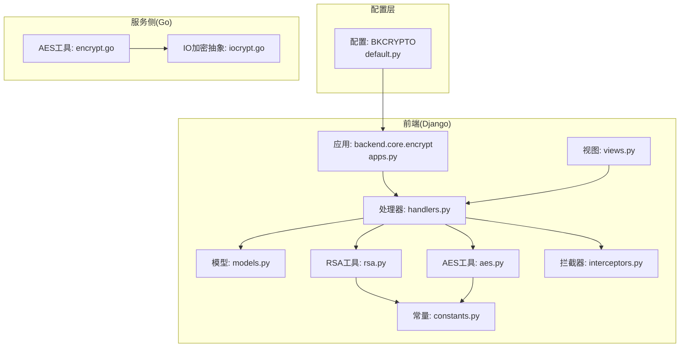
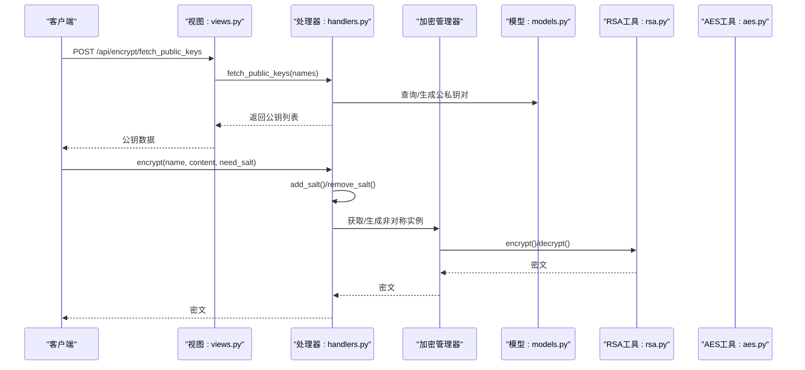
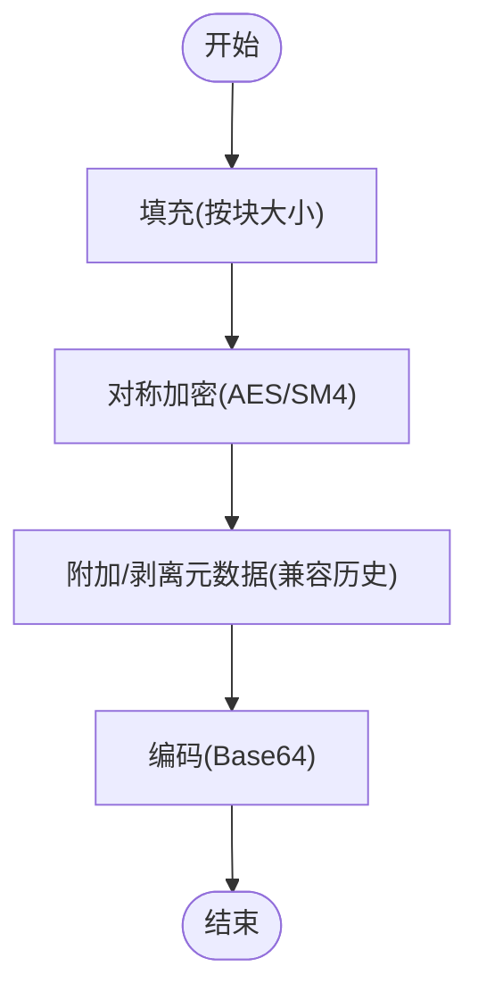
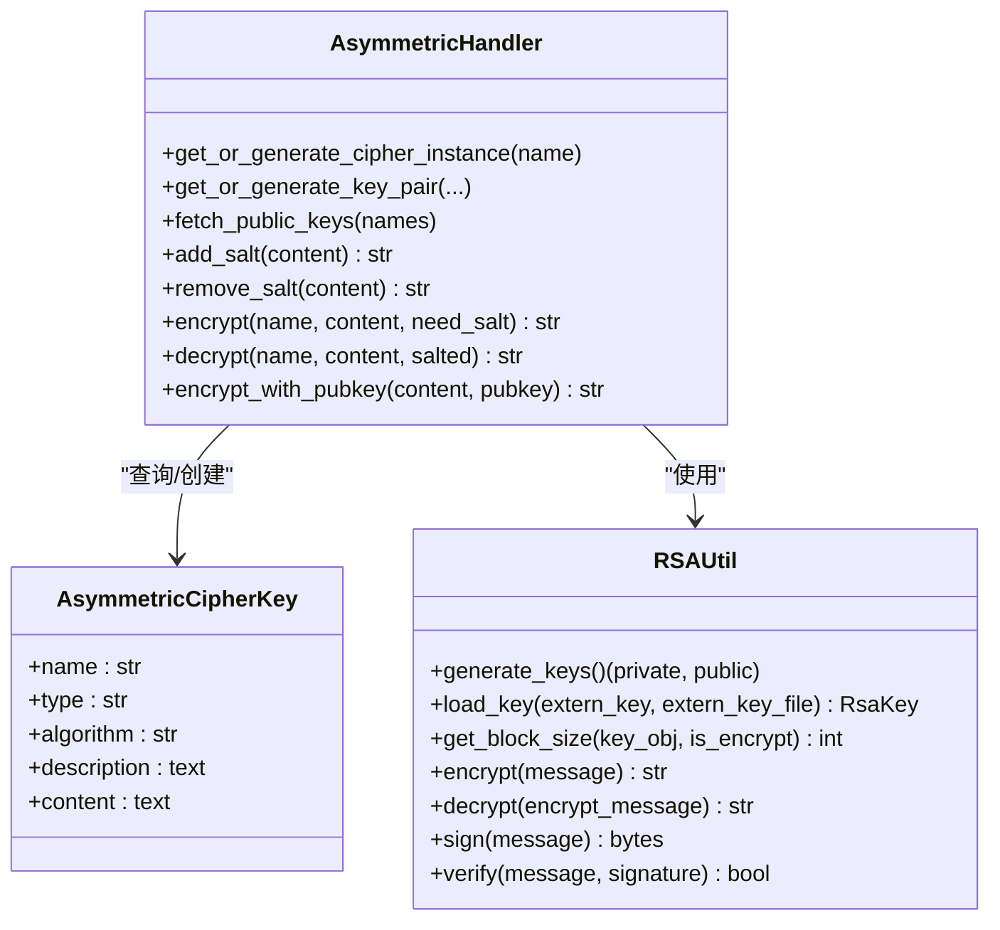
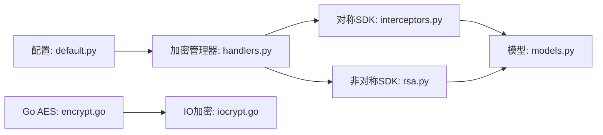

# 数据加密

<cite>
**本文引用的文件**
- [default.py](file://dbm-ui/config/default.py)
- [constants.py](file://dbm-ui/backend/core/encrypt/constants.py)
- [models.py](file://dbm-ui/backend/core/encrypt/models.py)
- [aes.py](file://dbm-ui/backend/core/encrypt/aes.py)
- [rsa.py](file://dbm-ui/backend/core/encrypt/rsa.py)
- [interceptors.py](file://dbm-ui/backend/core/encrypt/interceptors.py)
- [handlers.py](file://dbm-ui/backend/core/encrypt/handlers.py)
- [views.py](file://dbm-ui/backend/core/encrypt/views.py)
- [serializers.py](file://dbm-ui/backend/core/encrypt/serializers.py)
- [apps.py](file://dbm-ui/backend/core/encrypt/apps.py)
- [exceptions.py](file://dbm-ui/backend/core/encrypt/exceptions.py)
- [encrypt.go](file://dbm-services/common/db-config/pkg/util/crypt/encrypt.go)
- [encrypt.md](file://dbm-services/common/db-config/docs/design/encrypt.md)
- [iocrypt.go](file://dbm-services/common/go-pubpkg/iocrypt/iocrypt.go)
</cite>

## 目录
1. [简介](#简介)
2. [项目结构](#项目结构)
3. [核心组件](#核心组件)
4. [架构总览](#架构总览)
5. [详细组件分析](#详细组件分析)
6. [依赖分析](#依赖分析)
7. [性能考量](#性能考量)
8. [故障排查指南](#故障排查指南)
9. [结论](#结论)
10. [附录](#附录)

## 简介
本文件面向DBM项目的“数据加密模块”，系统性梳理对称加密（AES/SM4）、非对称加密（RSA/SM2）的实现与使用方式，覆盖密钥管理、密钥轮换、数据库连接信息加密、配置文件加密、日志脱敏与API响应加密等场景，并给出密钥生成、存储、分发与销毁的最佳实践，以及算法选择、密钥长度与安全参数配置建议。

## 项目结构
围绕加密能力，DBM在前后端分别提供了统一的加密SDK与Django应用，同时在服务侧提供了Go语言的AES工具库与IO流加密抽象，形成“配置层-应用层-服务层”的多层加密体系。

图表来源
- [default.py:569-614](file://dbm-ui/config/default.py#L569-L614)
- [apps.py:15-18](file://dbm-ui/backend/core/encrypt/apps.py#L15-L18)
- [handlers.py:29-216](file://dbm-ui/backend/core/encrypt/handlers.py#L29-L216)
- [views.py:25-36](file://dbm-ui/backend/core/encrypt/views.py#L25-L36)
- [models.py:19-33](file://dbm-ui/backend/core/encrypt/models.py#L19-L33)
- [rsa.py:45-195](file://dbm-ui/backend/core/encrypt/rsa.py#L45-L195)
- [aes.py:33-57](file://dbm-ui/backend/core/encrypt/aes.py#L33-L57)
- [interceptors.py:5-42](file://dbm-ui/backend/core/encrypt/interceptors.py#L5-L42)
- [constants.py:16-72](file://dbm-ui/backend/core/encrypt/constants.py#L16-L72)
- [encrypt.go:1-165](file://dbm-services/common/db-config/pkg/util/crypt/encrypt.go#L1-L165)
- [iocrypt.go:1-32](file://dbm-services/common/go-pubpkg/iocrypt/iocrypt.go#L1-L32)

章节来源
- [default.py:569-614](file://dbm-ui/config/default.py#L569-L614)
- [apps.py:15-18](file://dbm-ui/backend/core/encrypt/apps.py#L15-L18)

## 核心组件
- 配置层（BKCRYPTO）
  - 在配置中声明对称/非对称算法类型、公共参数与实例选项，支持多实例与前缀映射，兼容历史AES模式。
- 对称加密（AES/SM4）
  - 提供SDK封装与拦截器，确保填充、去元数据等兼容性处理；同时保留传统AES工具函数与Go实现。
- 非对称加密（RSA/SM2）
  - 封装密钥生成、导入、加解密、签名/验签、分块处理与加盐流程。
- 密钥管理
  - 数据库存储非对称密钥对，按名称与类型唯一；支持按需生成与批量创建；提供公钥查询接口。
- 服务侧工具
  - Go侧AES工具与IO流加密抽象，支持压缩、Base64、前缀标记等。

章节来源
- [default.py:569-614](file://dbm-ui/config/default.py#L569-L614)
- [constants.py:16-72](file://dbm-ui/backend/core/encrypt/constants.py#L16-L72)
- [models.py:19-33](file://dbm-ui/backend/core/encrypt/models.py#L19-L33)
- [handlers.py:29-216](file://dbm-ui/backend/core/encrypt/handlers.py#L29-L216)
- [aes.py:33-57](file://dbm-ui/backend/core/encrypt/aes.py#L33-L57)
- [rsa.py:45-195](file://dbm-ui/backend/core/encrypt/rsa.py#L45-L195)
- [interceptors.py:5-42](file://dbm-ui/backend/core/encrypt/interceptors.py#L5-L42)
- [encrypt.go:1-165](file://dbm-services/common/db-config/pkg/util/crypt/encrypt.go#L1-L165)
- [iocrypt.go:1-32](file://dbm-services/common/go-pubpkg/iocrypt/iocrypt.go#L1-L32)

## 架构总览
下图展示从配置到应用、再到服务侧的加密调用链路与职责边界。

图表来源
- [views.py:25-36](file://dbm-ui/backend/core/encrypt/views.py#L25-L36)
- [handlers.py:51-216](file://dbm-ui/backend/core/encrypt/handlers.py#L51-L216)
- [models.py:19-33](file://dbm-ui/backend/core/encrypt/models.py#L19-L33)
- [rsa.py:45-195](file://dbm-ui/backend/core/encrypt/rsa.py#L45-L195)
- [aes.py:33-57](file://dbm-ui/backend/core/encrypt/aes.py#L33-L57)

## 详细组件分析

### 配置与算法选择（BKCRYPTO）
- 支持的对称算法：AES、SM4；非对称算法：RSA、SM2。
- 对称加密默认实例“default”包含公共参数与各算法的cipher_options，兼容历史AES模式（CBC+固定IV），并提供蓝鲸推荐配置（SM4 CTR）。
- 可通过前缀映射区分不同算法的存储格式，便于升级与混用。
- 配置示例路径：[default.py:569-614](file://dbm-ui/config/default.py#L569-L614)

章节来源
- [default.py:569-614](file://dbm-ui/config/default.py#L569-L614)

### 对称加密（AES/SM4）
- 填充与解密兼容
  - 自定义拦截器在加密前后执行填充/去填充与元数据处理，确保与历史AES模式兼容。
  - 参考：[interceptors.py:5-42](file://dbm-ui/backend/core/encrypt/interceptors.py#L5-L42)
- 传统AES工具
  - 提供pad/add_to_16、encrypt/decrypt等函数，使用CBC模式与固定IV。
  - 参考：[aes.py:19-57](file://dbm-ui/backend/core/encrypt/aes.py#L19-L57)
- Go侧AES工具
  - PKCS7填充、CBC模式、Base64输出、前缀标记、可选压缩/解压。
  - 参考：[encrypt.go:50-165](file://dbm-services/common/db-config/pkg/util/crypt/encrypt.go#L50-L165)

图表来源
- [interceptors.py:5-42](file://dbm-ui/backend/core/encrypt/interceptors.py#L5-L42)
- [aes.py:33-57](file://dbm-ui/backend/core/encrypt/aes.py#L33-L57)
- [encrypt.go:104-133](file://dbm-services/common/db-config/pkg/util/crypt/encrypt.go#L104-L133)

章节来源
- [interceptors.py:5-42](file://dbm-ui/backend/core/encrypt/interceptors.py#L5-L42)
- [aes.py:19-57](file://dbm-ui/backend/core/encrypt/aes.py#L19-L57)
- [encrypt.go:50-165](file://dbm-services/common/db-config/pkg/util/crypt/encrypt.go#L50-L165)

### 非对称加密（RSA/SM2）
- RSA工具类
  - 支持密钥生成、导入、分块加解密、签名/验签；支持PKCS1 v1.5与OAEP填充。
  - 参考：[rsa.py:45-195](file://dbm-ui/backend/core/encrypt/rsa.py#L45-L195)
- 常量与枚举
  - 定义填充方式、密钥对象类型、算法类型等。
  - 参考：[constants.py:24-72](file://dbm-ui/backend/core/encrypt/constants.py#L24-L72)
- 密钥管理
  - 数据库模型存储公私钥，唯一约束为(name, type, algorithm)，支持按名称批量生成与查询。
  - 参考：[models.py:19-33](file://dbm-ui/backend/core/encrypt/models.py#L19-L33)
- 处理器
  - 提供按名称获取/生成密钥对、加盐/去盐、统一加解密入口。
  - 参考：[handlers.py:51-216](file://dbm-ui/backend/core/encrypt/handlers.py#L51-L216)

图表来源
- [rsa.py:45-195](file://dbm-ui/backend/core/encrypt/rsa.py#L45-L195)
- [models.py:19-33](file://dbm-ui/backend/core/encrypt/models.py#L19-L33)
- [handlers.py:51-216](file://dbm-ui/backend/core/encrypt/handlers.py#L51-L216)

章节来源
- [rsa.py:45-195](file://dbm-ui/backend/core/encrypt/rsa.py#L45-L195)
- [constants.py:24-72](file://dbm-ui/backend/core/encrypt/constants.py#L24-L72)
- [models.py:19-33](file://dbm-ui/backend/core/encrypt/models.py#L19-L33)
- [handlers.py:51-216](file://dbm-ui/backend/core/encrypt/handlers.py#L51-L216)

### 密钥管理与API
- 视图与序列化
  - 提供查询公钥列表的接口，支持指定密钥名称集合。
  - 参考：[views.py:25-36](file://dbm-ui/backend/core/encrypt/views.py#L25-L36)，[serializers.py:18-25](file://dbm-ui/backend/core/encrypt/serializers.py#L18-L25)
- 处理器
  - 按名称获取或生成密钥对，支持内部密钥池复用与事务性创建。
  - 参考：[handlers.py:57-117](file://dbm-ui/backend/core/encrypt/handlers.py#L57-L117)
- 异常
  - 统一RSA加解密异常类型。
  - 参考：[exceptions.py:18-24](file://dbm-ui/backend/core/encrypt/exceptions.py#L18-L24)

章节来源
- [views.py:25-36](file://dbm-ui/backend/core/encrypt/views.py#L25-L36)
- [serializers.py:18-25](file://dbm-ui/backend/core/encrypt/serializers.py#L18-L25)
- [handlers.py:57-117](file://dbm-ui/backend/core/encrypt/handlers.py#L57-L117)
- [exceptions.py:18-24](file://dbm-ui/backend/core/encrypt/exceptions.py#L18-L24)

### 敏感数据保护与密钥轮换
- 数据库连接信息加密
  - 使用对称加密（AES/SM4）对连接串中的敏感字段进行加密存储；结合拦截器确保历史兼容。
  - 参考：[interceptors.py:5-42](file://dbm-ui/backend/core/encrypt/interceptors.py#L5-L42)，[aes.py:33-57](file://dbm-ui/backend/core/encrypt/aes.py#L33-L57)
- 配置文件加密
  - Go侧AES工具支持对字符串进行加密并添加前缀标记，可选压缩；服务侧CLI文档提供密钥轮换流程。
  - 参考：[encrypt.go:104-165](file://dbm-services/common/db-config/pkg/util/crypt/encrypt.go#L104-L165)，[encrypt.md:40-64](file://dbm-services/common/db-config/docs/design/encrypt.md#L40-L64)
- 日志脱敏
  - 建议对日志中的敏感字段（如口令、密钥）在输出前进行脱敏处理，避免明文泄露。
  - 参考：[handlers.py:154-178](file://dbm-ui/backend/core/encrypt/handlers.py#L154-L178)
- API响应加密
  - 对外敏感响应可通过非对称加密（RSA/SM2）返回，客户端使用对应私钥解密。
  - 参考：[handlers.py:181-204](file://dbm-ui/backend/core/encrypt/handlers.py#L181-L204)，[rsa.py:131-165](file://dbm-ui/backend/core/encrypt/rsa.py#L131-L165)
- 密钥轮换
  - 服务侧提供基于旧密钥解密、新密钥重加密的流程，强调备份旧密钥与已加密串的重要性。
  - 参考：[encrypt.md:40-64](file://dbm-services/common/db-config/docs/design/encrypt.md#L40-L64)

章节来源
- [interceptors.py:5-42](file://dbm-ui/backend/core/encrypt/interceptors.py#L5-L42)
- [aes.py:33-57](file://dbm-ui/backend/core/encrypt/aes.py#L33-L57)
- [encrypt.go:104-165](file://dbm-services/common/db-config/pkg/util/crypt/encrypt.go#L104-L165)
- [encrypt.md:40-64](file://dbm-services/common/db-config/docs/design/encrypt.md#L40-L64)
- [handlers.py:154-178](file://dbm-ui/backend/core/encrypt/handlers.py#L154-L178)
- [handlers.py:181-204](file://dbm-ui/backend/core/encrypt/handlers.py#L181-L204)
- [rsa.py:131-165](file://dbm-ui/backend/core/encrypt/rsa.py#L131-L165)

### 对称加密与非对称加密的应用场景与选择原则
- 对称加密（AES/SM4）
  - 场景：大量数据的高效加密、配置项与连接信息的存储。
  - 原则：优先使用CTR/GCM等无填充模式；密钥长度至少128位，推荐256位；IV随机且不可预测。
- 非对称加密（RSA/SM2）
  - 场景：密钥分发、握手加密、签名与验签、对外敏感数据的加密传输。
  - 原则：RSA建议使用OAEP填充；SM2适合国产化合规；密钥长度≥2048位（RSA）或等效曲线（SM2）。
- 选择依据
  - 性能：对称加密更快；非对称加密更安全但较慢。
  - 合规：根据国家密码管理局要求选择SMx算法。
  - 兼容：历史系统需考虑填充与模式兼容。

章节来源
- [constants.py:24-72](file://dbm-ui/backend/core/encrypt/constants.py#L24-L72)
- [rsa.py:125-128](file://dbm-ui/backend/core/encrypt/rsa.py#L125-L128)
- [encrypt.go:104-133](file://dbm-services/common/db-config/pkg/util/crypt/encrypt.go#L104-L133)

### 密钥生成、存储、分发与销毁最佳实践
- 生成
  - 使用安全随机源生成密钥；RSA建议≥2048位；SM2使用标准曲线。
- 存储
  - 私钥仅以密文形式保存于受控环境；数据库中按(name, type, algorithm)唯一约束存储。
- 分发
  - 公钥通过受控渠道下发；非对称加密仅用于分发对称密钥或签名验证。
- 销毁
  - 删除数据库中的密钥记录；撤销相关权限；对历史加密数据进行迁移与清理。

章节来源
- [models.py:19-33](file://dbm-ui/backend/core/encrypt/models.py#L19-L33)
- [handlers.py:77-117](file://dbm-ui/backend/core/encrypt/handlers.py#L77-L117)

### 加密性能优化、兼容性与安全加固
- 性能
  - 对称加密优先使用CTR/GCM；大文件加密建议分块处理；必要时启用压缩减少I/O。
- 兼容性
  - 通过拦截器与前缀标记兼容历史AES模式；非对称分块处理避免长度限制。
- 安全
  - 填充使用PKCS#7/ISO 10126；IV随机且每次加密变更；签名使用SHA-256；最小化日志明文暴露。

章节来源
- [interceptors.py:5-42](file://dbm-ui/backend/core/encrypt/interceptors.py#L5-L42)
- [aes.py:33-57](file://dbm-ui/backend/core/encrypt/aes.py#L33-L57)
- [encrypt.go:104-133](file://dbm-services/common/db-config/pkg/util/crypt/encrypt.go#L104-L133)
- [rsa.py:87-102](file://dbm-ui/backend/core/encrypt/rsa.py#L87-L102)

## 依赖分析
- Django应用与SDK
  - backend.core.encrypt作为Django应用，依赖bkcrypto提供的对称/非对称加密管理器与拦截器。
- Go服务工具
  - db-config服务提供AES工具与IO加密抽象，支持压缩与命令行工具集成。
- 配置耦合
  - 配置层决定算法类型、模式与密钥来源，直接影响运行时行为。

图表来源
- [default.py:569-614](file://dbm-ui/config/default.py#L569-L614)
- [handlers.py:29-216](file://dbm-ui/backend/core/encrypt/handlers.py#L29-L216)
- [interceptors.py:5-42](file://dbm-ui/backend/core/encrypt/interceptors.py#L5-L42)
- [rsa.py:45-195](file://dbm-ui/backend/core/encrypt/rsa.py#L45-L195)
- [models.py:19-33](file://dbm-ui/backend/core/encrypt/models.py#L19-L33)
- [encrypt.go:1-165](file://dbm-services/common/db-config/pkg/util/crypt/encrypt.go#L1-L165)
- [iocrypt.go:1-32](file://dbm-services/common/go-pubpkg/iocrypt/iocrypt.go#L1-L32)

章节来源
- [default.py:569-614](file://dbm-ui/config/default.py#L569-L614)
- [handlers.py:29-216](file://dbm-ui/backend/core/encrypt/handlers.py#L29-L216)
- [interceptors.py:5-42](file://dbm-ui/backend/core/encrypt/interceptors.py#L5-L42)
- [rsa.py:45-195](file://dbm-ui/backend/core/encrypt/rsa.py#L45-L195)
- [models.py:19-33](file://dbm-ui/backend/core/encrypt/models.py#L19-L33)
- [encrypt.go:1-165](file://dbm-services/common/db-config/pkg/util/crypt/encrypt.go#L1-L165)
- [iocrypt.go:1-32](file://dbm-services/common/go-pubpkg/iocrypt/iocrypt.go#L1-L32)

## 性能考量
- 对称加密
  - CTR/GCM模式吞吐更高；合理设置块大小与批处理；避免重复初始化。
- 非对称加密
  - 分块处理与缓存密钥实例；签名/验签使用硬件加速或专用模块。
- I/O与压缩
  - 大数据量建议启用压缩；注意CPU与带宽权衡。

## 故障排查指南
- 常见问题
  - 填充错误/解密失败：检查填充模式与历史兼容配置；确认密钥长度与IV一致性。
  - 密钥缺失：核对数据库中是否存在对应名称与类型的密钥；确认算法一致。
  - 公钥查询为空：确认请求名称是否为内置密钥类型或已生成。
- 排查步骤
  - 核对配置项（算法、模式、密钥来源）。
  - 检查拦截器与前缀标记逻辑。
  - 验证密钥对生成与存储流程。
  - 查看异常类型与日志上下文。

章节来源
- [exceptions.py:18-24](file://dbm-ui/backend/core/encrypt/exceptions.py#L18-L24)
- [interceptors.py:5-42](file://dbm-ui/backend/core/encrypt/interceptors.py#L5-L42)
- [handlers.py:119-151](file://dbm-ui/backend/core/encrypt/handlers.py#L119-L151)

## 结论
DBM的加密模块通过配置层统一算法与参数、应用层提供对称/非对称工具与密钥管理、服务侧提供Go工具与IO抽象，形成了完整的数据保护闭环。建议在生产环境中优先采用SM4/SM2与CTR/GCM模式，严格遵循密钥生命周期管理，并结合密钥轮换与日志脱敏策略，持续提升安全性与合规性。

## 附录
- 算法选择指南
  - 对称：SM4（CTR/GCM）优先；AES（GCM）作为备选。
  - 非对称：SM2（国产化）或RSA（OAEP）。
- 密钥长度建议
  - SM4/SM2：256位密钥长度；RSA：≥2048位。
- 安全参数配置
  - 填充：PKCS#7；模式：CTR/GCM；IV：随机且唯一；签名：SHA-256。