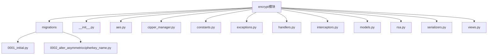
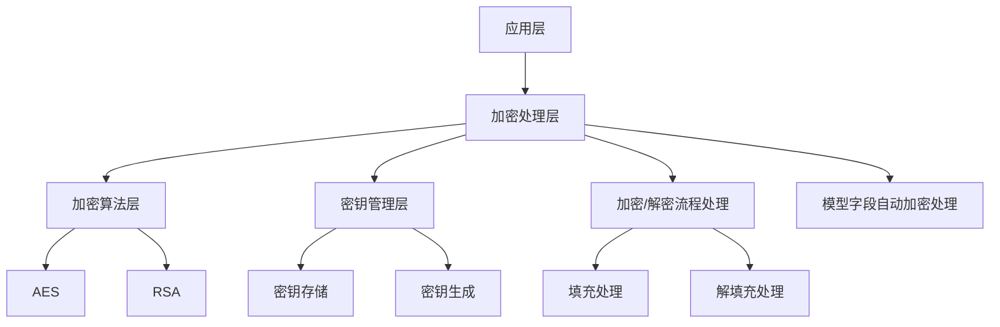
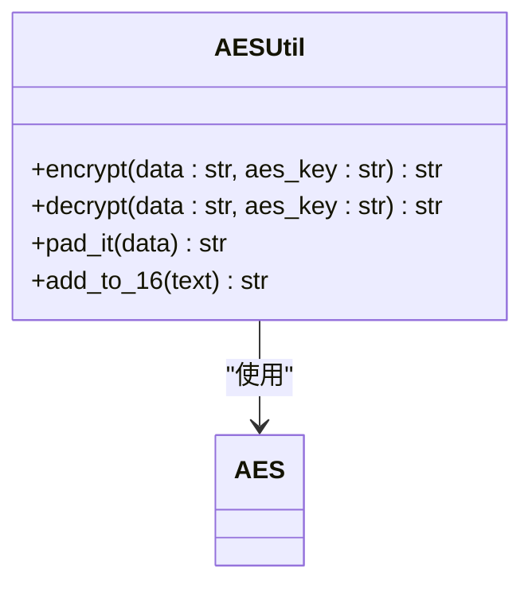
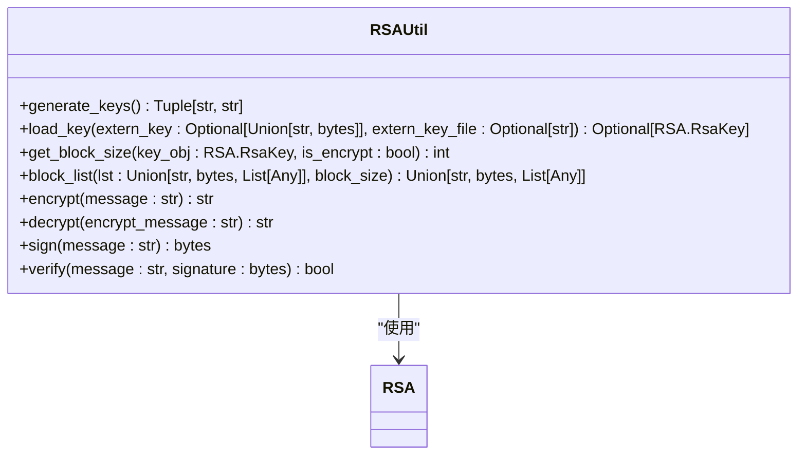
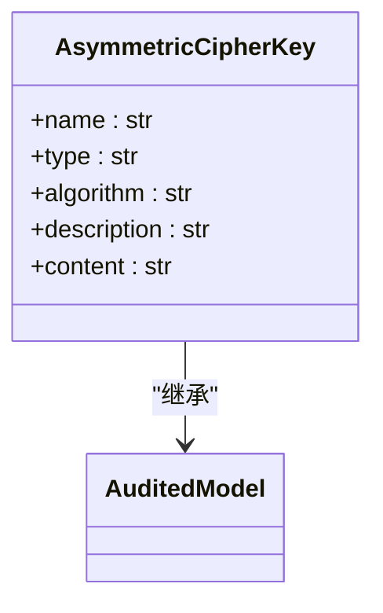
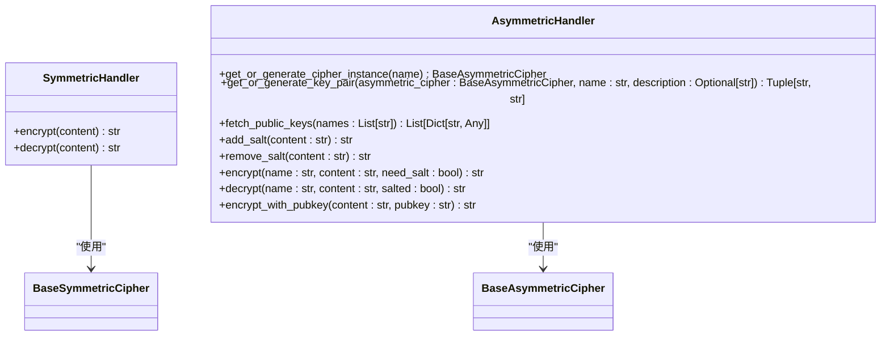
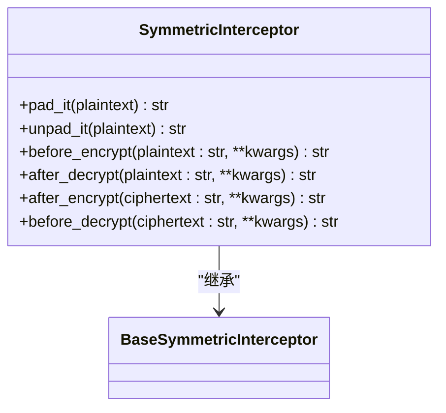
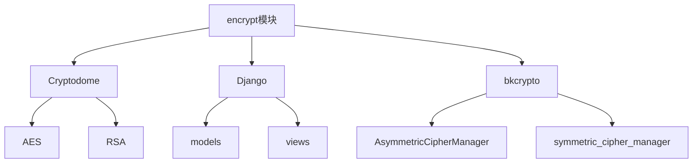

# 数据安全

<cite>
**本文档引用的文件**   
- [models.py](file://dbm-ui/backend/core/encrypt/models.py)
- [aes.py](file://dbm-ui/backend/core/encrypt/aes.py)
- [rsa.py](file://dbm-ui/backend/core/encrypt/rsa.py)
- [cipper_manager.py](file://dbm-ui/backend/core/encrypt/cipper_manager.py)
- [constants.py](file://dbm-ui/backend/core/encrypt/constants.py)
- [interceptors.py](file://dbm-ui/backend/core/encrypt/interceptors.py)
- [handlers.py](file://dbm-ui/backend/core/encrypt/handlers.py)
- [exceptions.py](file://dbm-ui/backend/core/encrypt/exceptions.py)
- [views.py](file://dbm-ui/backend/core/encrypt/views.py)
- [serializers.py](file://dbm-ui/backend/core/encrypt/serializers.py)
- [0001_initial.py](file://dbm-ui/backend/core/encrypt/migrations/0001_initial.py)
- [apps.py](file://dbm-ui/backend/core/encrypt/apps.py)
- [default.py](file://dbm-ui/config/default.py)
</cite>

## 目录
1. [引言](#引言)
2. [项目结构](#项目结构)
3. [核心组件](#核心组件)
4. [架构概述](#架构概述)
5. [详细组件分析](#详细组件分析)
6. [依赖分析](#依赖分析)
7. [性能考虑](#性能考虑)
8. [故障排除指南](#故障排除指南)
9. [结论](#结论)

## 引言
本文档详细介绍了dbm-ui/backend/core/encrypt模块的实现，重点阐述了AES和RSA加密算法在敏感数据（如数据库密码、配置信息）存储中的应用。文档解释了加密密钥的管理机制、加密/解密流程以及如何通过模型字段自动处理加密。同时提供了实际代码示例展示加密字段的定义和使用，以及数据加密的性能影响和最佳实践，包括如何应对密钥泄露等安全事件。

## 项目结构
dbm-ui/backend/core/encrypt模块是DB管理系统中负责数据加密的核心组件，其结构设计遵循了模块化和可扩展的原则。该模块包含多个子目录和文件，每个都有特定的职责。

**图源**
- [models.py](file://dbm-ui/backend/core/encrypt/models.py)
- [aes.py](file://dbm-ui/backend/core/encrypt/aes.py)
- [rsa.py](file://dbm-ui/backend/core/encrypt/rsa.py)
- [cipper_manager.py](file://dbm-ui/backend/core/encrypt/cipper_manager.py)
- [constants.py](file://dbm-ui/backend/core/encrypt/constants.py)
- [interceptors.py](file://dbm-ui/backend/core/encrypt/interceptors.py)
- [handlers.py](file://dbm-ui/backend/core/encrypt/handlers.py)
- [exceptions.py](file://dbm-ui/backend/core/encrypt/exceptions.py)
- [views.py](file://dbm-ui/backend/core/encrypt/views.py)
- [serializers.py](file://dbm-ui/backend/core/encrypt/serializers.py)
- [0001_initial.py](file://dbm-ui/backend/core/encrypt/migrations/0001_initial.py)
- [apps.py](file://dbm-ui/backend/core/encrypt/apps.py)

**节源**
- [models.py](file://dbm-ui/backend/core/encrypt/models.py)
- [aes.py](file://dbm-ui/backend/core/encrypt/aes.py)
- [rsa.py](file://dbm-ui/backend/core/encrypt/rsa.py)
- [cipper_manager.py](file://dbm-ui/backend/core/encrypt/cipper_manager.py)
- [constants.py](file://dbm-ui/backend/core/encrypt/constants.py)
- [interceptors.py](file://dbm-ui/backend/core/encrypt/interceptors.py)
- [handlers.py](file://dbm-ui/backend/core/encrypt/handlers.py)
- [exceptions.py](file://dbm-ui/backend/core/encrypt/exceptions.py)
- [views.py](file://dbm-ui/backend/core/encrypt/views.py)
- [serializers.py](file://dbm-ui/backend/core/encrypt/serializers.py)
- [0001_initial.py](file://dbm-ui/backend/core/encrypt/migrations/0001_initial.py)
- [apps.py](file://dbm-ui/backend/core/encrypt/apps.py)

## 核心组件
dbm-ui/backend/core/encrypt模块的核心组件包括AES和RSA加密算法的实现、加密密钥的管理、加密/解密流程的处理以及模型字段的自动加密处理。这些组件共同确保了敏感数据的安全存储和传输。

**节源**
- [aes.py](file://dbm-ui/backend/core/encrypt/aes.py)
- [rsa.py](file://dbm-ui/backend/core/encrypt/rsa.py)
- [cipper_manager.py](file://dbm-ui/backend/core/encrypt/cipper_manager.py)
- [constants.py](file://dbm-ui/backend/core/encrypt/constants.py)
- [interceptors.py](file://dbm-ui/backend/core/encrypt/interceptors.py)
- [handlers.py](file://dbm-ui/backend/core/encrypt/handlers.py)
- [exceptions.py](file://dbm-ui/backend/core/encrypt/exceptions.py)

## 架构概述
dbm-ui/backend/core/encrypt模块的架构设计旨在提供一个灵活、安全且易于维护的加密解决方案。该模块通过分层设计，将加密算法的实现、密钥管理、加密/解密流程处理和模型字段自动加密处理分离，确保了各组件的独立性和可测试性。

**图源**
- [aes.py](file://dbm-ui/backend/core/encrypt/aes.py)
- [rsa.py](file://dbm-ui/backend/core/encrypt/rsa.py)
- [cipper_manager.py](file://dbm-ui/backend/core/encrypt/cipper_manager.py)
- [constants.py](file://dbm-ui/backend/core/encrypt/constants.py)
- [interceptors.py](file://dbm-ui/backend/core/encrypt/interceptors.py)
- [handlers.py](file://dbm-ui/backend/core/encrypt/handlers.py)
- [exceptions.py](file://dbm-ui/backend/core/encrypt/exceptions.py)
- [views.py](file://dbm-ui/backend/core/encrypt/views.py)
- [serializers.py](file://dbm-ui/backend/core/encrypt/serializers.py)
- [0001_initial.py](file://dbm-ui/backend/core/encrypt/migrations/0001_initial.py)
- [apps.py](file://dbm-ui/backend/core/encrypt/apps.py)

## 详细组件分析
### AES加密算法分析
AES加密算法在dbm-ui/backend/core/encrypt模块中用于对称加密，确保数据在存储和传输过程中的安全性。该算法通过使用128位、192位或256位的密钥长度，提供了强大的加密能力。

**图源**
- [aes.py](file://dbm-ui/backend/core/encrypt/aes.py)

**节源**
- [aes.py](file://dbm-ui/backend/core/encrypt/aes.py)

### RSA加密算法分析
RSA加密算法在dbm-ui/backend/core/encrypt模块中用于非对称加密，确保数据在传输过程中的安全性。该算法通过使用公钥和私钥对，提供了强大的加密和解密能力。

**图源**
- [rsa.py](file://dbm-ui/backend/core/encrypt/rsa.py)

**节源**
- [rsa.py](file://dbm-ui/backend/core/encrypt/rsa.py)

### 加密密钥管理分析
加密密钥管理在dbm-ui/backend/core/encrypt模块中通过AsymmetricCipherKey模型实现，确保了密钥的安全存储和管理。该模型定义了密钥的名称、类型、算法、描述和内容等属性。

**图源**
- [models.py](file://dbm-ui/backend/core/encrypt/models.py)

**节源**
- [models.py](file://dbm-ui/backend/core/encrypt/models.py)

### 加密/解密流程处理分析
加密/解密流程处理在dbm-ui/backend/core/encrypt模块中通过SymmetricHandler和AsymmetricHandler类实现，确保了加密和解密操作的正确性和安全性。这些类提供了加密和解密的方法，并处理了填充和解填充等细节。

**图源**
- [handlers.py](file://dbm-ui/backend/core/encrypt/handlers.py)

**节源**
- [handlers.py](file://dbm-ui/backend/core/encrypt/handlers.py)

### 模型字段自动加密处理分析
模型字段自动加密处理在dbm-ui/backend/core/encrypt模块中通过interceptors.py文件中的SymmetricInterceptor类实现，确保了模型字段在存储和检索时的自动加密和解密。该类提供了填充和解填充的方法，并处理了加密和解密的元数据。

**图源**
- [interceptors.py](file://dbm-ui/backend/core/encrypt/interceptors.py)

**节源**
- [interceptors.py](file://dbm-ui/backend/core/encrypt/interceptors.py)

## 依赖分析
dbm-ui/backend/core/encrypt模块依赖于多个外部库和内部组件，确保了加密功能的完整性和安全性。这些依赖包括加密库（如Cryptodome）、Django框架、bkcrypto库等。

**图源**
- [aes.py](file://dbm-ui/backend/core/encrypt/aes.py)
- [rsa.py](file://dbm-ui/backend/core/encrypt/rsa.py)
- [cipper_manager.py](file://dbm-ui/backend/core/encrypt/cipper_manager.py)
- [constants.py](file://dbm-ui/backend/core/encrypt/constants.py)
- [interceptors.py](file://dbm-ui/backend/core/encrypt/interceptors.py)
- [handlers.py](file://dbm-ui/backend/core/encrypt/handlers.py)
- [exceptions.py](file://dbm-ui/backend/core/encrypt/exceptions.py)
- [views.py](file://dbm-ui/backend/core/encrypt/views.py)
- [serializers.py](file://dbm-ui/backend/core/encrypt/serializers.py)
- [0001_initial.py](file://dbm-ui/backend/core/encrypt/migrations/0001_initial.py)
- [apps.py](file://dbm-ui/backend/core/encrypt/apps.py)

**节源**
- [aes.py](file://dbm-ui/backend/core/encrypt/aes.py)
- [rsa.py](file://dbm-ui/backend/core/encrypt/rsa.py)
- [cipper_manager.py](file://dbm-ui/backend/core/encrypt/cipper_manager.py)
- [constants.py](file://dbm-ui/backend/core/encrypt/constants.py)
- [interceptors.py](file://dbm-ui/backend/core/encrypt/interceptors.py)
- [handlers.py](file://dbm-ui/backend/core/encrypt/handlers.py)
- [exceptions.py](file://dbm-ui/backend/core/encrypt/exceptions.py)
- [views.py](file://dbm-ui/backend/core/encrypt/views.py)
- [serializers.py](file://dbm-ui/backend/core/encrypt/serializers.py)
- [0001_initial.py](file://dbm-ui/backend/core/encrypt/migrations/0001_initial.py)
- [apps.py](file://dbm-ui/backend/core/encrypt/apps.py)

## 性能考虑
在使用dbm-ui/backend/core/encrypt模块时，需要考虑加密和解密操作的性能影响。AES和RSA加密算法的性能差异较大，RSA加密算法由于其非对称特性，通常比AES加密算法慢得多。因此，在选择加密算法时，应根据具体的应用场景和性能要求进行权衡。

## 故障排除指南
在使用dbm-ui/backend/core/encrypt模块时，可能会遇到一些常见的问题，如密钥生成失败、加密/解密失败等。以下是一些常见的故障排除方法：

- **密钥生成失败**：检查密钥生成的配置是否正确，确保密钥长度符合要求。
- **加密/解密失败**：检查加密和解密的密钥是否匹配，确保填充和解填充处理正确。
- **性能问题**：如果加密/解密操作导致性能下降，考虑使用更高效的加密算法或优化加密/解密流程。

**节源**
- [exceptions.py](file://dbm-ui/backend/core/encrypt/exceptions.py)

## 结论
dbm-ui/backend/core/encrypt模块通过AES和RSA加密算法的实现，提供了强大的数据加密能力，确保了敏感数据的安全存储和传输。该模块的架构设计合理，组件职责明确，依赖管理清晰，为DB管理系统的数据安全提供了坚实的基础。通过合理的配置和使用，可以有效应对各种安全威胁，确保系统的稳定和可靠。