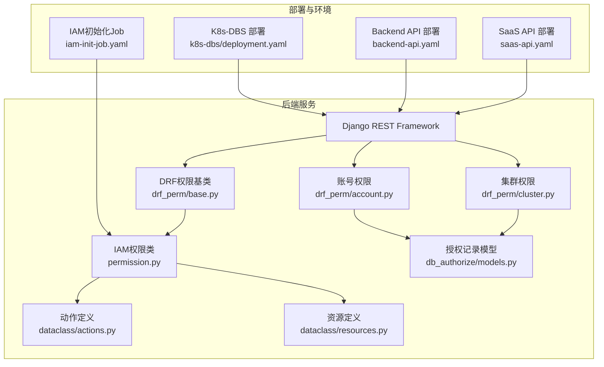
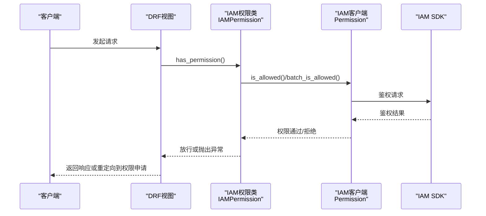
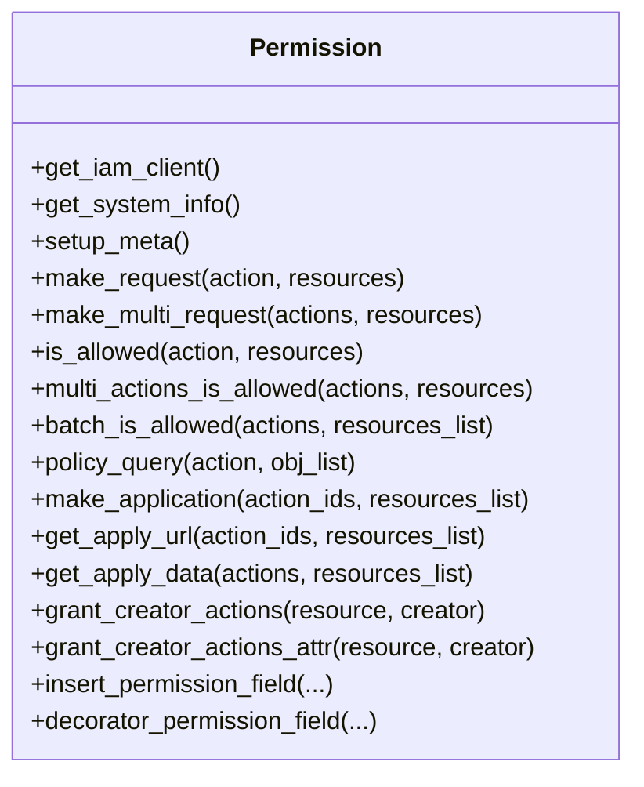
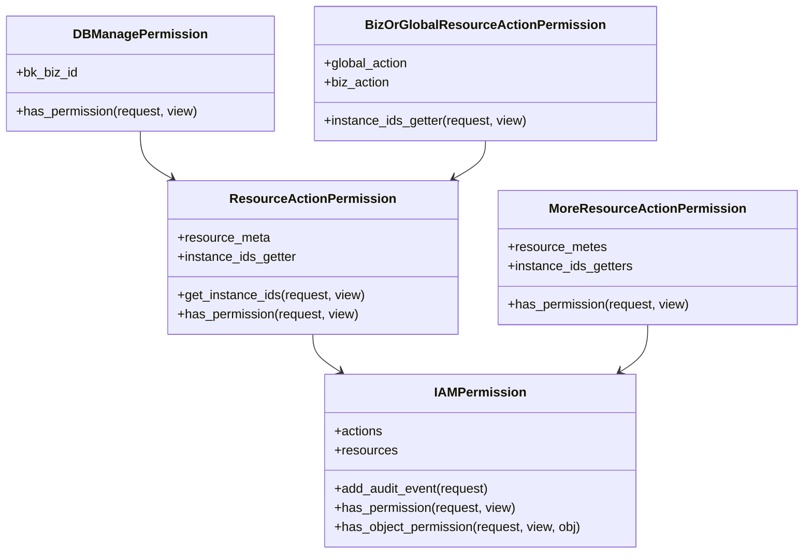
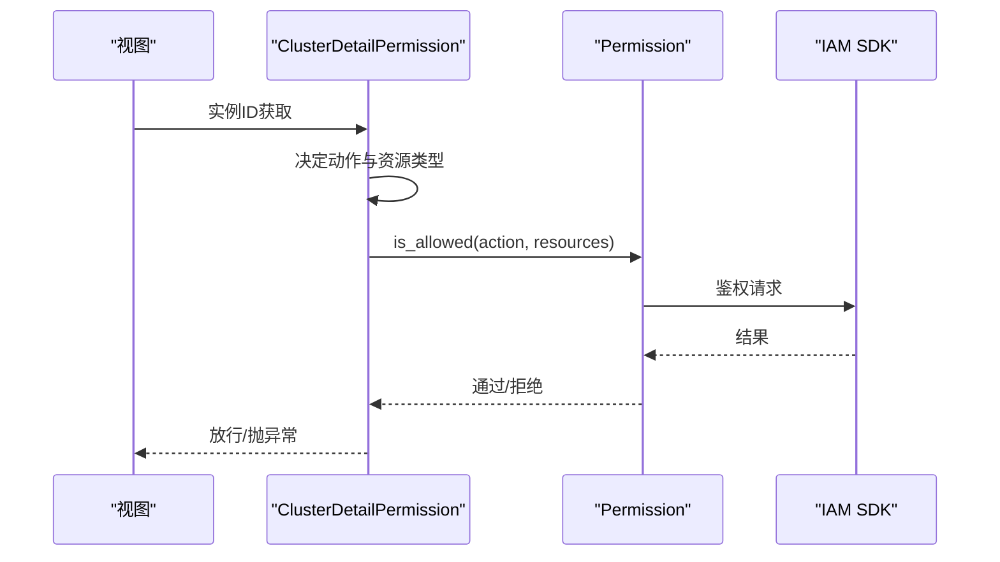
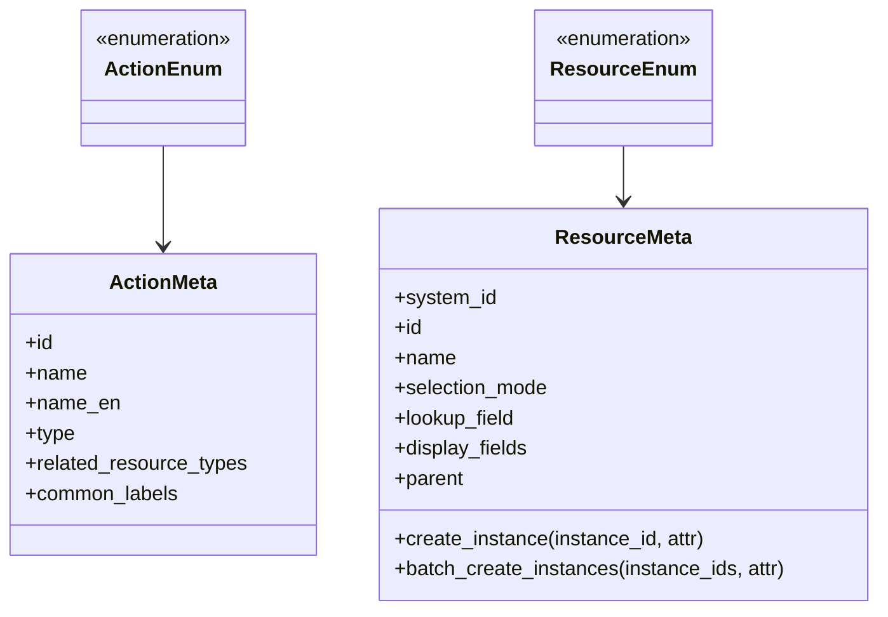
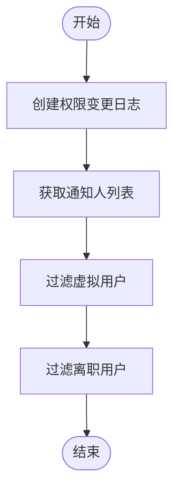
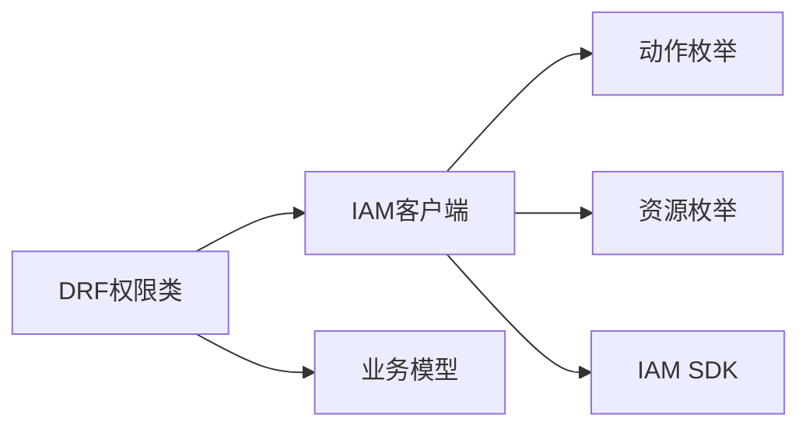

# 认证与授权

<cite>
**本文引用的文件**
- [iam_app/handlers/permission.py](file://dbm-ui/backend/iam_app/handlers/permission.py)
- [iam_app/handlers/drf_perm/base.py](file://dbm-ui/backend/iam_app/handlers/drf_perm/base.py)
- [iam_app/handlers/drf_perm/cluster.py](file://dbm-ui/backend/iam_app/handlers/drf_perm/cluster.py)
- [iam_app/handlers/drf_perm/account.py](file://dbm-ui/backend/iam_app/handlers/drf_perm/account.py)
- [iam_app/dataclass/actions.py](file://dbm-ui/backend/iam_app/dataclass/actions.py)
- [iam_app/dataclass/resources.py](file://dbm-ui/backend/iam_app/dataclass/resources.py)
- [db_services/dbpermission/db_authorize/models.py](file://dbm-ui/backend/db_services/dbpermission/db_authorize/models.py)
- [iam-init-job.yaml](file://helm-charts/bk-dbm/charts/dbm/templates/jobs/iam-init-job.yaml)
- [backend-api.yaml](file://helm-charts/bk-dbm/charts/dbm/templates/deployments/backend-api/backend-api.yaml)
- [saas-api.yaml](file://helm-charts/bk-dbm/charts/dbm/templates/deployments/saas-api/saas-api.yaml)
- [deployment.yaml](file://helm-charts/bk-dbm/charts/k8s-dbs/templates/deployment.yaml)
</cite>

## 目录
1. [简介](#简介)
2. [项目结构](#项目结构)
3. [核心组件](#核心组件)
4. [架构总览](#架构总览)
5. [详细组件分析](#详细组件分析)
6. [依赖关系分析](#依赖关系分析)
7. [性能考量](#性能考量)
8. [故障排查指南](#故障排查指南)
9. [结论](#结论)
10. [附录](#附录)

## 简介
本文件面向DBM项目的认证与授权模块，系统性阐述用户身份验证机制、权限管理体系、会话管理策略以及与蓝鲸IAM的深度集成。内容覆盖：
- 蓝鲸IAM集成：动作与资源建模、鉴权与批量鉴权、权限申请与跳转
- 权限控制粒度：按业务、按集群类型、按实例、按账号等多维资源控制
- 访问策略实现：基于DRF权限类的资源动作权限、多资源组合权限、平台/业务双轨制
- 会话与安全：Cookie中bk_token解析、超级管理员豁免、审计埋点
- 多租户隔离：业务维度资源拓扑、全局与业务权限分离
- 动态权限检查：视图层装饰器注入权限字段、运行时权限查询
- API访问控制、前端路由守卫与后端接口保护最佳实践

## 项目结构
认证与授权相关代码主要集中在以下位置：
- 后端IAM适配与权限校验：iam_app/handlers/permission.py、iam_app/handlers/drf_perm/*.py
- 权限动作与资源定义：iam_app/dataclass/actions.py、iam_app/dataclass/resources.py
- 数据库授权记录与审计：db_services/dbpermission/db_authorize/models.py
- Helm部署与环境变量：helm-charts/bk-dbm/charts/*/templates/*.yaml

**图表来源**
- [iam_app/handlers/permission.py:47-670](file://dbm-ui/backend/iam_app/handlers/permission.py#L47-L670)
- [iam_app/handlers/drf_perm/base.py:93-330](file://dbm-ui/backend/iam_app/handlers/drf_perm/base.py#L93-L330)
- [iam_app/handlers/drf_perm/cluster.py:32-296](file://dbm-ui/backend/iam_app/handlers/drf_perm/cluster.py#L32-L296)
- [iam_app/handlers/drf_perm/account.py:25-49](file://dbm-ui/backend/iam_app/handlers/drf_perm/account.py#L25-L49)
- [iam_app/dataclass/actions.py:114-800](file://dbm-ui/backend/iam_app/dataclass/actions.py#L114-L800)
- [iam_app/dataclass/resources.py:27-800](file://dbm-ui/backend/iam_app/dataclass/resources.py#L27-L800)
- [db_services/dbpermission/db_authorize/models.py:23-89](file://dbm-ui/backend/db_services/dbpermission/db_authorize/models.py#L23-L89)
- [saas-api.yaml:39-62](file://helm-charts/bk-dbm/charts/dbm/templates/deployments/saas-api/saas-api.yaml#L39-L62)
- [backend-api.yaml:34-55](file://helm-charts/bk-dbm/charts/dbm/templates/deployments/backend-api/backend-api.yaml#L34-L55)
- [deployment.yaml:38-65](file://helm-charts/bk-dbm/charts/k8s-dbs/templates/deployment.yaml#L38-L65)
- [iam-init-job.yaml:1-33](file://helm-charts/bk-dbm/charts/dbm/templates/jobs/iam-init-job.yaml#L1-L33)

**章节来源**
- [iam_app/handlers/permission.py:47-670](file://dbm-ui/backend/iam_app/handlers/permission.py#L47-L670)
- [iam_app/handlers/drf_perm/base.py:93-330](file://dbm-ui/backend/iam_app/handlers/drf_perm/base.py#L93-L330)
- [iam_app/handlers/drf_perm/cluster.py:32-296](file://dbm-ui/backend/iam_app/handlers/drf_perm/cluster.py#L32-L296)
- [iam_app/handlers/drf_perm/account.py:25-49](file://dbm-ui/backend/iam_app/handlers/drf_perm/account.py#L25-L49)
- [iam_app/dataclass/actions.py:114-800](file://dbm-ui/backend/iam_app/dataclass/actions.py#L114-L800)
- [iam_app/dataclass/resources.py:27-800](file://dbm-ui/backend/iam_app/dataclass/resources.py#L27-L800)
- [db_services/dbpermission/db_authorize/models.py:23-89](file://dbm-ui/backend/db_services/dbpermission/db_authorize/models.py#L23-L89)
- [saas-api.yaml:39-62](file://helm-charts/bk-dbm/charts/dbm/templates/deployments/saas-api/saas-api.yaml#L39-L62)
- [backend-api.yaml:34-55](file://helm-charts/bk-dbm/charts/dbm/templates/deployments/backend-api/backend-api.yaml#L34-L55)
- [deployment.yaml:38-65](file://helm-charts/bk-dbm/charts/k8s-dbs/templates/deployment.yaml#L38-L65)
- [iam-init-job.yaml:1-33](file://helm-charts/bk-dbm/charts/dbm/templates/jobs/iam-init-job.yaml#L1-L33)

## 核心组件
- IAM权限客户端：封装鉴权请求、批量鉴权、权限申请URL生成、资源拓扑解析与表达式评估
- DRF权限基类：统一处理超级管理员豁免、审计埋点、单资源/多资源动作权限
- 资源动作权限：针对单一资源类型或多个资源类型的权限检查
- 平台/业务双轨制：业务管理与全局管理动作分离，自动选择资源维度
- 动作与资源枚举：集中定义动作、资源类型、资源拓扑链路与选择模式
- 授权记录模型：记录权限变更与通知人筛选

**章节来源**
- [iam_app/handlers/permission.py:47-670](file://dbm-ui/backend/iam_app/handlers/permission.py#L47-L670)
- [iam_app/handlers/drf_perm/base.py:93-330](file://dbm-ui/backend/iam_app/handlers/drf_perm/base.py#L93-L330)
- [iam_app/dataclass/actions.py:114-800](file://dbm-ui/backend/iam_app/dataclass/actions.py#L114-L800)
- [iam_app/dataclass/resources.py:27-800](file://dbm-ui/backend/iam_app/dataclass/resources.py#L27-L800)
- [db_services/dbpermission/db_authorize/models.py:23-89](file://dbm-ui/backend/db_services/dbpermission/db_authorize/models.py#L23-L89)

## 架构总览
DBM的认证与授权采用“DRF权限类 + IAM客户端”的分层设计：
- 视图层通过DRF权限类声明式地绑定动作与资源
- 权限类委托IAM客户端进行鉴权与批量鉴权
- 资源与动作通过枚举定义，确保一致性与可扩展性
- 部署侧通过环境变量与初始化Job完成IAM系统注册与迁移

**图表来源**
- [iam_app/handlers/drf_perm/base.py:135-163](file://dbm-ui/backend/iam_app/handlers/drf_perm/base.py#L135-L163)
- [iam_app/handlers/permission.py:177-290](file://dbm-ui/backend/iam_app/handlers/permission.py#L177-L290)

**章节来源**
- [iam_app/handlers/drf_perm/base.py:135-163](file://dbm-ui/backend/iam_app/handlers/drf_perm/base.py#L135-L163)
- [iam_app/handlers/permission.py:177-290](file://dbm-ui/backend/iam_app/handlers/permission.py#L177-L290)

## 详细组件分析

### IAM权限客户端（Permission）
- 职责：封装鉴权请求、批量鉴权、权限申请URL生成、资源拓扑解析、表达式评估、批量策略查询
- 关键能力：
  - is_allowed/multi_actions_is_allowed/batch_is_allowed
  - make_application/get_apply_url/get_apply_data
  - policy_query表达式评估
  - 装饰器注入权限字段（insert_permission_field/decorator_permission_field）

**图表来源**
- [iam_app/handlers/permission.py:47-670](file://dbm-ui/backend/iam_app/handlers/permission.py#L47-L670)

**章节来源**
- [iam_app/handlers/permission.py:47-670](file://dbm-ui/backend/iam_app/handlers/permission.py#L47-L670)

### DRF权限基类（IAMPermission/ResourceActionPermission/MoreResourceActionPermission）
- IAMPermission：统一处理超级管理员豁免、审计埋点、单资源/多资源批量鉴权
- ResourceActionPermission：针对单一资源类型或无资源的动作鉴权
- MoreResourceActionPermission：针对多个资源类型的组合动作鉴权
- DBManagePermission/BizOrGlobalResourceActionPermission：平台/业务双轨制权限

**图表来源**
- [iam_app/handlers/drf_perm/base.py:93-330](file://dbm-ui/backend/iam_app/handlers/drf_perm/base.py#L93-L330)

**章节来源**
- [iam_app/handlers/drf_perm/base.py:93-330](file://dbm-ui/backend/iam_app/handlers/drf_perm/base.py#L93-L330)

### 集群与实例权限（Cluster/Instance/Account）
- ClusterDashboardPermission/ClusterDetailPermission/ClusterEditPermission：按集群域/ID/类型进行动作与资源映射
- InstanceDetailPermission：按实例IP:PORT或ID映射实例角色到动作
- AccountPermission：账号动作按业务或账号实例维度鉴权
- 多资源组合：如业务+DB类型、业务+账号等

**图表来源**
- [iam_app/handlers/drf_perm/cluster.py:56-74](file://dbm-ui/backend/iam_app/handlers/drf_perm/cluster.py#L56-L74)
- [iam_app/handlers/drf_perm/account.py:25-49](file://dbm-ui/backend/iam_app/handlers/drf_perm/account.py#L25-L49)
- [iam_app/handlers/permission.py:177-208](file://dbm-ui/backend/iam_app/handlers/permission.py#L177-L208)

**章节来源**
- [iam_app/handlers/drf_perm/cluster.py:56-74](file://dbm-ui/backend/iam_app/handlers/drf_perm/cluster.py#L56-L74)
- [iam_app/handlers/drf_perm/account.py:25-49](file://dbm-ui/backend/iam_app/handlers/drf_perm/account.py#L25-L49)
- [iam_app/handlers/permission.py:177-208](file://dbm-ui/backend/iam_app/handlers/permission.py#L177-L208)

### 动作与资源定义
- 动作（ActionEnum）：集中定义动作ID、名称、类型、关联资源类型、分组标签等
- 资源（ResourceEnum）：定义业务、集群类型、实例、账号等资源类型及拓扑链路
- 映射关系：集群类型/实例角色到动作与资源的自动映射

**图表来源**
- [iam_app/dataclass/actions.py:26-111](file://dbm-ui/backend/iam_app/dataclass/actions.py#L26-L111)
- [iam_app/dataclass/resources.py:27-154](file://dbm-ui/backend/iam_app/dataclass/resources.py#L27-L154)

**章节来源**
- [iam_app/dataclass/actions.py:114-800](file://dbm-ui/backend/iam_app/dataclass/actions.py#L114-L800)
- [iam_app/dataclass/resources.py:27-800](file://dbm-ui/backend/iam_app/dataclass/resources.py#L27-L800)

### 授权记录与审计
- 授权记录模型：记录权限变更、操作人、账号ID、规则ID、动作类型
- 通知人筛选：基于授权记录与系统设置过滤虚拟用户与离职人员

**图表来源**
- [db_services/dbpermission/db_authorize/models.py:49-89](file://dbm-ui/backend/db_services/dbpermission/db_authorize/models.py#L49-L89)

**章节来源**
- [db_services/dbpermission/db_authorize/models.py:49-89](file://dbm-ui/backend/db_services/dbpermission/db_authorize/models.py#L49-L89)

## 依赖关系分析
- 组件耦合：
  - DRF权限类依赖IAM权限客户端
  - IAM权限客户端依赖动作与资源枚举
  - 集群/账号权限类依赖具体业务模型（Cluster、Machine、StorageInstance、Account）
- 外部依赖：
  - IAM SDK：鉴权、批量鉴权、权限申请
  - Django REST Framework：权限钩子与视图层
  - 蓝鲸账户Cookie（bk_token）：用户身份识别

**图表来源**
- [iam_app/handlers/drf_perm/base.py:93-330](file://dbm-ui/backend/iam_app/handlers/drf_perm/base.py#L93-L330)
- [iam_app/handlers/permission.py:47-670](file://dbm-ui/backend/iam_app/handlers/permission.py#L47-L670)
- [iam_app/dataclass/actions.py:114-800](file://dbm-ui/backend/iam_app/dataclass/actions.py#L114-L800)
- [iam_app/dataclass/resources.py:27-800](file://dbm-ui/backend/iam_app/dataclass/resources.py#L27-L800)

**章节来源**
- [iam_app/handlers/drf_perm/base.py:93-330](file://dbm-ui/backend/iam_app/handlers/drf_perm/base.py#L93-L330)
- [iam_app/handlers/permission.py:47-670](file://dbm-ui/backend/iam_app/handlers/permission.py#L47-L670)
- [iam_app/dataclass/actions.py:114-800](file://dbm-ui/backend/iam_app/dataclass/actions.py#L114-L800)
- [iam_app/dataclass/resources.py:27-800](file://dbm-ui/backend/iam_app/dataclass/resources.py#L27-L800)

## 性能考量
- 批量鉴权：优先使用batch_is_allowed与multi_actions_is_allowed减少IAM调用次数
- 资源本地化：仅在资源属于本系统时使用批量资源鉴权，避免跨系统调用
- 表达式评估：policy_query结合表达式快速筛选允许对象集合
- 审计成本：审计仅对非GET请求记录，降低写入压力
- 缓存与降级：可通过BK_IAM_SKIP在开发环境跳过鉴权，生产环境谨慎开启

[本节为通用指导，无需列出具体文件来源]

## 故障排查指南
- 鉴权失败：
  - 检查bk_token是否正确传递与解析
  - 查看权限申请URL生成与跳转逻辑
  - 确认动作与资源是否已注册到IAM系统
- 批量鉴权异常：
  - 核对资源类型与资源ID映射
  - 检查资源拓扑路径（_bk_iam_path_）是否完整
- 审计缺失：
  - 确认非GET请求是否触发审计
  - 检查审计导出器配置
- 初始化问题：
  - 确认IAM初始化Job已执行并完成迁移

**章节来源**
- [iam_app/handlers/permission.py:380-443](file://dbm-ui/backend/iam_app/handlers/permission.py#L380-L443)
- [iam_app/handlers/drf_perm/base.py:104-134](file://dbm-ui/backend/iam_app/handlers/drf_perm/base.py#L104-L134)
- [iam-init-job.yaml:1-33](file://helm-charts/bk-dbm/charts/dbm/templates/jobs/iam-init-job.yaml#L1-L33)

## 结论
DBM的认证与授权体系以DRF权限类为核心，结合IAM客户端与动作/资源枚举，实现了细粒度、可扩展、可审计的权限控制。通过平台/业务双轨制与多资源组合权限，满足多租户场景下的权限隔离与动态校验需求。部署侧通过初始化Job与环境变量确保IAM系统正确注册与运行。

[本节为总结性内容，无需列出具体文件来源]

## 附录

### API访问控制与前端路由守卫最佳实践
- 后端接口保护：
  - 在视图类中声明相应权限类（如ClusterDetailPermission、AccountPermission）
  - 使用装饰器注入权限字段，便于前端渲染
- 前端路由守卫：
  - 基于后端返回的permission字段进行UI显隐控制
  - 对需要权限的路由在进入前发起权限查询或在页面加载时注入权限字段

[本节为通用指导，无需列出具体文件来源]

### 会话与安全机制
- Cookie解析：从COOKIES中提取bk_token，解析用户名
- 超级管理员豁免：is_superuser直接放行
- 审计埋点：对非GET请求记录操作事件，支持导出器输出

**章节来源**
- [iam_app/handlers/permission.py:52-67](file://dbm-ui/backend/iam_app/handlers/permission.py#L52-L67)
- [iam_app/handlers/drf_perm/base.py:104-134](file://dbm-ui/backend/iam_app/handlers/drf_perm/base.py#L104-L134)

### 多租户权限隔离与动态权限检查
- 业务维度：业务资源与拓扑路径，支持业务内权限隔离
- 全局维度：平台管理动作，无业务维度
- 动态检查：通过装饰器在视图层注入权限字段，支持列表与详情页的动态权限显示

**章节来源**
- [iam_app/dataclass/resources.py:156-176](file://dbm-ui/backend/iam_app/dataclass/resources.py#L156-L176)
- [iam_app/handlers/permission.py:542-588](file://dbm-ui/backend/iam_app/handlers/permission.py#L542-L588)

### 部署与环境配置要点
- SaaS与Backend API容器：通过gunicorn启动，暴露HTTP端口
- K8s-DBS部署：配置AUTH_MYSQL_*环境变量，连接认证数据库
- IAM初始化Job：执行服务初始化与IAM迁移

**章节来源**
- [saas-api.yaml:39-62](file://helm-charts/bk-dbm/charts/dbm/templates/deployments/saas-api/saas-api.yaml#L39-L62)
- [backend-api.yaml:34-55](file://helm-charts/bk-dbm/charts/dbm/templates/deployments/backend-api/backend-api.yaml#L34-L55)
- [deployment.yaml:38-65](file://helm-charts/bk-dbm/charts/k8s-dbs/templates/deployment.yaml#L38-L65)
- [iam-init-job.yaml:1-33](file://helm-charts/bk-dbm/charts/dbm/templates/jobs/iam-init-job.yaml#L1-L33)