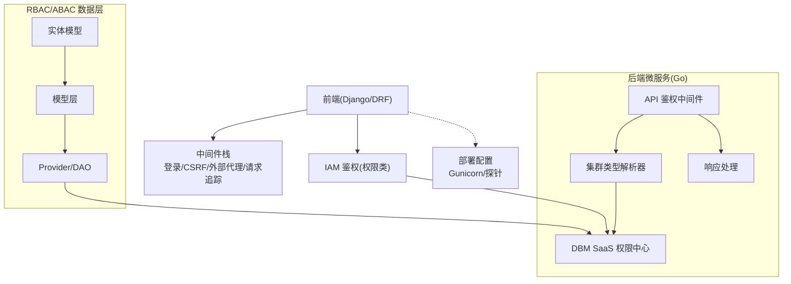
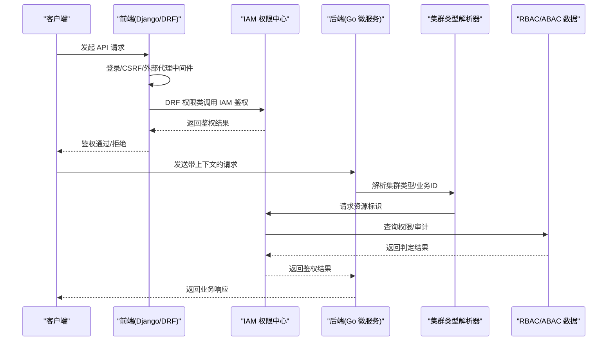
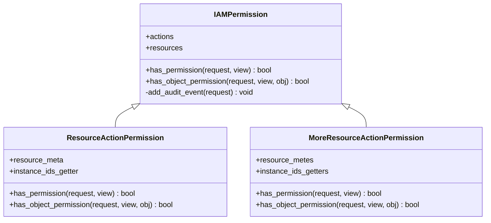
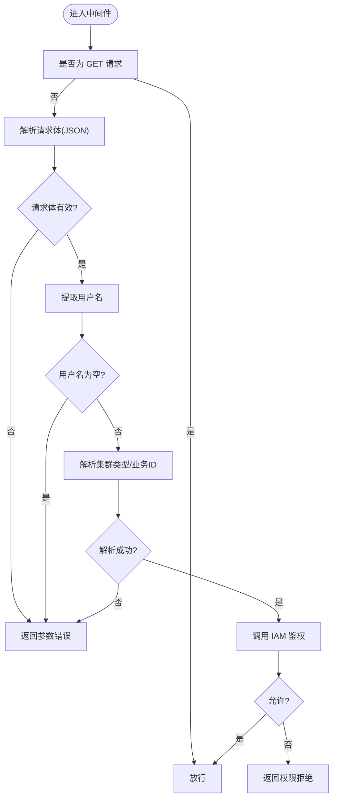
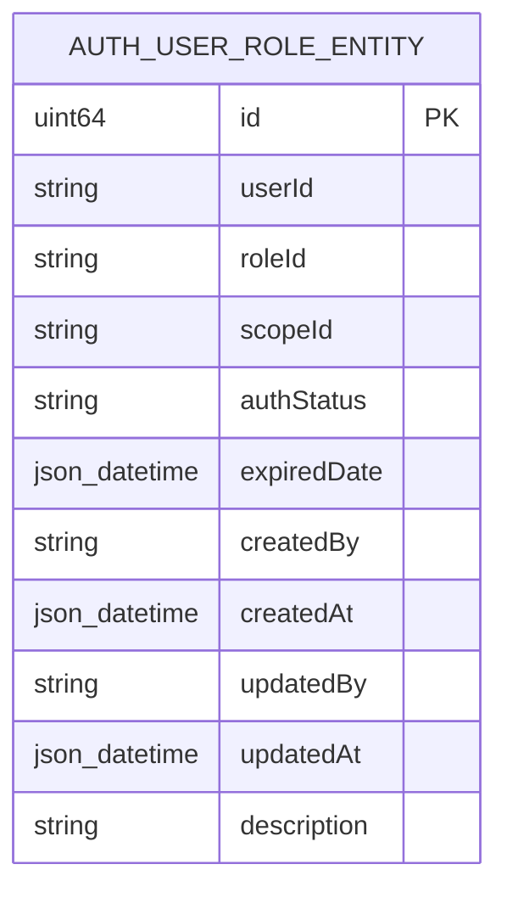
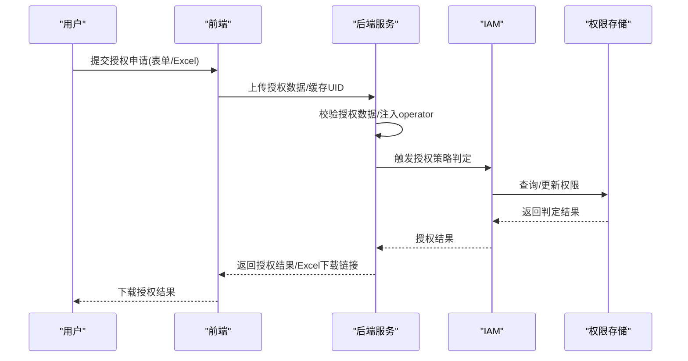
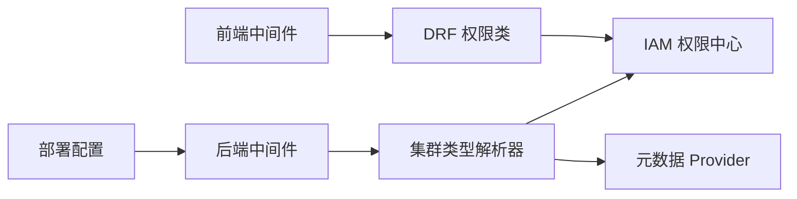

# 访问控制

<cite>
**本文引用的文件**
- [default.py](file://dbm-ui/config/default.py)
- [bk_web/middleware.py](file://dbm-ui/backend/bk_web/middleware.py)
- [iam_app/handlers/drf_perm/base.py](file://dbm-ui/backend/iam_app/handlers/drf_perm/base.py)
- [k8s-dbs/middleware/api_auth_middleware.go](file://dbm-services/k8s-dbs/middleware/api_auth_middleware.go)
- [k8s-dbs/middleware/cluster_type_resolver.go](file://dbm-services/k8s-dbs/middleware/cluster_type_resolver.go)
- [k8s-dbs/metadata/entity/auth_user_role_entity.go](file://dbm-services/k8s-dbs/metadata/entity/auth_user_role_entity.go)
- [k8s-dbs/metadata/dbaccess/auth_user_role_dbacess.go](file://dbm-services/k8s-dbs/metadata/dbaccess/auth_user_role_dbacess.go)
- [k8s-dbs/metadata/model/auth_user_role_model.go](file://dbm-services/k8s-dbs/metadata/model/auth_user_role_model.go)
- [k8s-dbs/metadata/provider/auth_user_role_provider.go](file://dbm-services/k8s-dbs/metadata/provider/auth_user_role_provider.go)
- [mysql_authorize_rules.py](file://dbm-ui/backend/ticket/builders/mysql/mysql_authorize_rules.py)
- [mongo_authorize.py](file://dbm-ui/backend/ticket/builders/mongodb/mongo_authorize.py)
- [sqlserver_authorize.py](file://dbm-ui/backend/ticket/builders/sqlserver/sqlserver_authorize.py)
- [local.py](file://dbm-ui/backend/utils/local.py)
- [saas-api.yaml](file://helm-charts/bk-dbm/charts/dbm/templates/deployments/saas-api/saas-api.yaml)
</cite>

## 目录
1. [简介](#简介)
2. [项目结构](#项目结构)
3. [核心组件](#核心组件)
4. [架构总览](#架构总览)
5. [详细组件分析](#详细组件分析)
6. [依赖关系分析](#依赖关系分析)
7. [性能考量](#性能考量)
8. [故障排查指南](#故障排查指南)
9. [结论](#结论)
10. [附录](#附录)

## 简介
本文件系统性梳理 DBM 项目的访问控制机制，覆盖基于角色的访问控制（RBAC）、基于属性的访问控制（ABAC）与最小权限原则的落地实践，详述 API 接口访问控制、数据库资源访问限制与操作权限验证流程，同时包含 IP 白名单、时间窗口限制、并发连接数控制与资源配额管理的实现要点与配置建议。文档还总结了输入验证、SQL 注入防护、XSS 与 CSRF 防护、跨域访问控制（CORS）、HTTP 安全头设置及敏感操作二次确认机制的工程化实现路径。

## 项目结构
DBM 的访问控制横跨前端 Django/DRF 层、后端 Go 微服务层与 Helm 部署层，形成“认证 + 鉴权 + 审计 + 限流/配额”的整体闭环：
- 前端层：Django 中间件负责登录、CSRF、外部代理路由与请求追踪；DRF 权限类对接 IAM 进行细粒度鉴权。
- 后端层：Go 微服务中间件对 API 请求进行 IAM 鉴权与资源解析；Kubernetes 集群类型解析器将请求映射到具体资源类型；RBAC/ABAC 数据模型与 Provider 支撑权限判定。
- 部署层：Gunicorn 参数与探针配置支撑并发与健康检查，便于实施连接数与超时控制。

**图表来源**
- [default.py:159-182](file://dbm-ui/config/default.py#L159-L182)
- [bk_web/middleware.py:117-241](file://dbm-ui/backend/bk_web/middleware.py#L117-L241)
- [iam_app/handlers/drf_perm/base.py:93-164](file://dbm-ui/backend/iam_app/handlers/drf_perm/base.py#L93-L164)
- [k8s-dbs/middleware/api_auth_middleware.go:29-95](file://dbm-services/k8s-dbs/middleware/api_auth_middleware.go#L29-L95)
- [k8s-dbs/middleware/cluster_type_resolver.go:61-105](file://dbm-services/k8s-dbs/middleware/cluster_type_resolver.go#L61-L105)
- [k8s-dbs/metadata/entity/auth_user_role_entity.go:24-37](file://dbm-services/k8s-dbs/metadata/entity/auth_user_role_entity.go#L24-L37)

**章节来源**
- [default.py:159-182](file://dbm-ui/config/default.py#L159-L182)
- [bk_web/middleware.py:117-241](file://dbm-ui/backend/bk_web/middleware.py#L117-L241)
- [iam_app/handlers/drf_perm/base.py:93-164](file://dbm-ui/backend/iam_app/handlers/drf_perm/base.py#L93-L164)
- [k8s-dbs/middleware/api_auth_middleware.go:29-95](file://dbm-services/k8s-dbs/middleware/api_auth_middleware.go#L29-L95)
- [k8s-dbs/middleware/cluster_type_resolver.go:61-105](file://dbm-services/k8s-dbs/middleware/cluster_type_resolver.go#L61-L105)

## 核心组件
- 前端中间件与权限类
  - 登录与外部代理：统一登录、APIGW JWT、请求追踪与外部路由白名单。
  - DRF 权限类：IAMPermission、ResourceActionPermission、MoreResourceActionPermission 等，对接 IAM 执行细粒度鉴权与审计。
- 后端 API 鉴权中间件
  - APIAuthMiddleware：对非 GET 请求校验请求体、提取用户名、调用 IAM 接口进行权限判定；对创建类 API 与实例级 API 分别处理。
  - 集群类型解析器：根据请求上下文解析集群类型与业务 ID，作为 IAM 资源标识。
- RBAC/ABAC 数据模型
  - 用户-角色-作用域-有效期等实体模型，结合 Provider/DAO 实现权限判定与审计。
- 部署与运行时
  - Gunicorn 参数与探针配置，支撑并发连接数与健康检查。

**章节来源**
- [bk_web/middleware.py:74-114](file://dbm-ui/backend/bk_web/middleware.py#L74-L114)
- [bk_web/middleware.py:117-241](file://dbm-ui/backend/bk_web/middleware.py#L117-L241)
- [iam_app/handlers/drf_perm/base.py:93-164](file://dbm-ui/backend/iam_app/handlers/drf_perm/base.py#L93-L164)
- [k8s-dbs/middleware/api_auth_middleware.go:29-95](file://dbm-services/k8s-dbs/middleware/api_auth_middleware.go#L29-L95)
- [k8s-dbs/middleware/cluster_type_resolver.go:61-105](file://dbm-services/k8s-dbs/middleware/cluster_type_resolver.go#L61-L105)
- [k8s-dbs/metadata/entity/auth_user_role_entity.go:24-37](file://dbm-services/k8s-dbs/metadata/entity/auth_user_role_entity.go#L24-L37)
- [saas-api.yaml:39-62](file://helm-charts/bk-dbm/charts/dbm/templates/deployments/saas-api/saas-api.yaml#L39-L62)

## 架构总览
DBM 的访问控制采用“前端统一认证 + 后端细粒度鉴权 + IAM 审计”的分层架构。前端通过中间件与 DRF 权限类完成用户身份识别与权限判定；后端 Go 微服务中间件负责请求上下文解析与 IAM 调用；RBAC/ABAC 数据模型支撑权限判定与审计日志输出。

**图表来源**
- [bk_web/middleware.py:74-114](file://dbm-ui/backend/bk_web/middleware.py#L74-L114)
- [iam_app/handlers/drf_perm/base.py:135-156](file://dbm-ui/backend/iam_app/handlers/drf_perm/base.py#L135-L156)
- [k8s-dbs/middleware/api_auth_middleware.go:97-154](file://dbm-services/k8s-dbs/middleware/api_auth_middleware.go#L97-L154)
- [k8s-dbs/middleware/cluster_type_resolver.go:96-105](file://dbm-services/k8s-dbs/middleware/cluster_type_resolver.go#L96-L105)

## 详细组件分析

### 前端访问控制（Django/DRF）
- 登录与外部代理中间件
  - 统一登录、APIGW JWT 用户注入、内部调用豁免 CSRF 校验；对外部路由进行白名单校验与参数强制过滤。
- CSRF 与安全头
  - 开启 CSRF 中间件；Cookie 名称可配置；安全头相关设置在配置中集中管理。
- DRF 权限类
  - IAMPermission/ResourceActionPermission 等基于动作与资源进行鉴权；支持审计事件输出；支持超级用户与跳过鉴权场景。

**图表来源**
- [iam_app/handlers/drf_perm/base.py:93-164](file://dbm-ui/backend/iam_app/handlers/drf_perm/base.py#L93-L164)
- [iam_app/handlers/drf_perm/base.py:225-263](file://dbm-ui/backend/iam_app/handlers/drf_perm/base.py#L225-L263)

**章节来源**
- [bk_web/middleware.py:74-114](file://dbm-ui/backend/bk_web/middleware.py#L74-L114)
- [bk_web/middleware.py:117-241](file://dbm-ui/backend/bk_web/middleware.py#L117-L241)
- [default.py:159-182](file://dbm-ui/config/default.py#L159-L182)
- [iam_app/handlers/drf_perm/base.py:135-156](file://dbm-ui/backend/iam_app/handlers/drf_perm/base.py#L135-L156)

### 后端 API 鉴权中间件（Go）
- 请求预处理
  - 非 GET 请求必须携带有效 JSON 请求体与用户名；对 JSON 格式进行快速校验。
- 动作映射与资源解析
  - 将 API 名称映射到 IAM 动作 ID；区分 addon 操作与实例级操作；通过解析器推断集群类型与业务 ID。
- IAM 调用与错误处理
  - 调用 DBM SaaS 的 simple_check_allowed 接口；对解析器错误与远程调用错误进行区分处理。
- 响应与放行
  - 通过后放行请求，未通过则返回权限拒绝响应。

**图表来源**
- [k8s-dbs/middleware/api_auth_middleware.go:35-95](file://dbm-services/k8s-dbs/middleware/api_auth_middleware.go#L35-L95)
- [k8s-dbs/middleware/api_auth_middleware.go:97-154](file://dbm-services/k8s-dbs/middleware/api_auth_middleware.go#L97-L154)
- [k8s-dbs/middleware/cluster_type_resolver.go:96-105](file://dbm-services/k8s-dbs/middleware/cluster_type_resolver.go#L96-L105)

**章节来源**
- [k8s-dbs/middleware/api_auth_middleware.go:29-95](file://dbm-services/k8s-dbs/middleware/api_auth_middleware.go#L29-L95)
- [k8s-dbs/middleware/api_auth_middleware.go:97-154](file://dbm-services/k8s-dbs/middleware/api_auth_middleware.go#L97-L154)
- [k8s-dbs/middleware/cluster_type_resolver.go:61-105](file://dbm-services/k8s-dbs/middleware/cluster_type_resolver.go#L61-L105)

### RBAC/ABAC 数据模型与判定
- 实体模型
  - 用户-角色-作用域-有效期等字段构成权限实体，支持有效期控制与描述信息。
- Provider/DAO
  - 提供权限查询与判定能力，作为后端中间件与前端权限类的底层数据支撑。
- 审计与日志
  - 鉴权通过后输出审计事件，便于追踪权限使用。

**图表来源**
- [k8s-dbs/metadata/entity/auth_user_role_entity.go:24-37](file://dbm-services/k8s-dbs/metadata/entity/auth_user_role_entity.go#L24-L37)

**章节来源**
- [k8s-dbs/metadata/entity/auth_user_role_entity.go:24-37](file://dbm-services/k8s-dbs/metadata/entity/auth_user_role_entity.go#L24-L37)
- [k8s-dbs/metadata/dbaccess/auth_user_role_dbacess.go](file://dbm-services/k8s-dbs/metadata/dbaccess/auth_user_role_dbacess.go)
- [k8s-dbs/metadata/model/auth_user_role_model.go](file://dbm-services/k8s-dbs/metadata/model/auth_user_role_model.go)
- [k8s-dbs/metadata/provider/auth_user_role_provider.go](file://dbm-services/k8s-dbs/metadata/provider/auth_user_role_provider.go)

### 授权流程与策略配置
- MySQL/MongoDB/SQLServer 授权工单
  - 授权数据缓存 UID 校验、Excel 导入授权数据、第三方插件授权信息注入、审批与人工确认开关。
- 授权策略与最小权限
  - 通过授权规则集合与源 IP 限制实现最小权限；对不同数据库类型分别校验集群可访问性与规则合法性。

**图表来源**
- [mysql_authorize_rules.py:39-57](file://dbm-ui/backend/ticket/builders/mysql/mysql_authorize_rules.py#L39-L57)
- [mysql_authorize_rules.py:111-117](file://dbm-ui/backend/ticket/builders/mysql/mysql_authorize_rules.py#L111-L117)
- [mongo_authorize.py:68-74](file://dbm-ui/backend/ticket/builders/mongodb/mongo_authorize.py#L68-L74)
- [sqlserver_authorize.py:32-35](file://dbm-ui/backend/ticket/builders/sqlserver/sqlserver_authorize.py#L32-L35)

**章节来源**
- [mysql_authorize_rules.py:39-57](file://dbm-ui/backend/ticket/builders/mysql/mysql_authorize_rules.py#L39-L57)
- [mysql_authorize_rules.py:111-117](file://dbm-ui/backend/ticket/builders/mysql/mysql_authorize_rules.py#L111-L117)
- [mongo_authorize.py:68-74](file://dbm-ui/backend/ticket/builders/mongodb/mongo_authorize.py#L68-L74)
- [sqlserver_authorize.py:32-35](file://dbm-ui/backend/ticket/builders/sqlserver/sqlserver_authorize.py#L32-L35)

## 依赖关系分析
- 前端依赖
  - 中间件链路：CORS、APIGW JWT、外部代理、登录、CSRF、安全中间件、会话与渲染器。
  - DRF 权限类依赖 IAM 权限中心与审计导出器。
- 后端依赖
  - API 鉴权中间件依赖集群类型解析器与 IAM 接口；解析器依赖元数据 Provider。
- 部署依赖
  - Gunicorn worker 数量、超时与最大请求数影响并发与资源占用。

**图表来源**
- [default.py:159-182](file://dbm-ui/config/default.py#L159-L182)
- [iam_app/handlers/drf_perm/base.py:135-156](file://dbm-ui/backend/iam_app/handlers/drf_perm/base.py#L135-L156)
- [k8s-dbs/middleware/api_auth_middleware.go:29-33](file://dbm-services/k8s-dbs/middleware/api_auth_middleware.go#L29-L33)
- [k8s-dbs/middleware/cluster_type_resolver.go:82-94](file://dbm-services/k8s-dbs/middleware/cluster_type_resolver.go#L82-L94)
- [saas-api.yaml:39-62](file://helm-charts/bk-dbm/charts/dbm/templates/deployments/saas-api/saas-api.yaml#L39-L62)

**章节来源**
- [default.py:159-182](file://dbm-ui/config/default.py#L159-L182)
- [iam_app/handlers/drf_perm/base.py:135-156](file://dbm-ui/backend/iam_app/handlers/drf_perm/base.py#L135-L156)
- [k8s-dbs/middleware/api_auth_middleware.go:29-33](file://dbm-services/k8s-dbs/middleware/api_auth_middleware.go#L29-L33)
- [k8s-dbs/middleware/cluster_type_resolver.go:82-94](file://dbm-services/k8s-dbs/middleware/cluster_type_resolver.go#L82-L94)
- [saas-api.yaml:39-62](file://helm-charts/bk-dbm/charts/dbm/templates/deployments/saas-api/saas-api.yaml#L39-L62)

## 性能考量
- 请求体解析优化
  - 后端中间件使用轻量 JSON 解析库进行格式校验与字段提取，避免全量反序列化开销。
- 鉴权路径分流
  - GET 请求与 addon 操作走快速路径，减少解析与远程调用。
- 并发与超时
  - 通过 Gunicorn worker 数量、超时与最大请求数控制并发连接与资源占用；探针配置保障健康检查。
- 审计与日志
  - 审计事件导出器异步化，避免阻塞主请求路径。

**章节来源**
- [k8s-dbs/middleware/api_auth_middleware.go:55-62](file://dbm-services/k8s-dbs/middleware/api_auth_middleware.go#L55-L62)
- [k8s-dbs/middleware/api_auth_middleware.go:156-164](file://dbm-services/k8s-dbs/middleware/api_auth_middleware.go#L156-L164)
- [saas-api.yaml:39-62](file://helm-charts/bk-dbm/charts/dbm/templates/deployments/saas-api/saas-api.yaml#L39-L62)

## 故障排查指南
- 前端常见问题
  - CSRF 校验失败：确认 Cookie 名称与前端设置一致；开发环境可通过中间件豁免。
  - 外部代理路由异常：检查路由白名单与单据类型白名单配置。
- 后端常见问题
  - 请求体为空或格式错误：确保发送 JSON 且包含必需字段；检查解析器对字段路径的支持。
  - 集群类型解析失败：核对请求体字段（如集群名、命名空间、K8s 集群名）是否完整；检查元数据 Provider 是否初始化成功。
  - IAM 鉴权失败：确认用户名、动作 ID、资源 ID 与业务 ID 映射正确；检查环境变量与远程调用可用性。
- 审计与日志
  - 审计事件缺失：确认非 GET 请求且权限类已执行；检查导出器配置。

**章节来源**
- [bk_web/middleware.py:117-241](file://dbm-ui/backend/bk_web/middleware.py#L117-L241)
- [k8s-dbs/middleware/api_auth_middleware.go:47-62](file://dbm-services/k8s-dbs/middleware/api_auth_middleware.go#L47-L62)
- [k8s-dbs/middleware/api_auth_middleware.go:117-120](file://dbm-services/k8s-dbs/middleware/api_auth_middleware.go#L117-L120)
- [k8s-dbs/middleware/cluster_type_resolver.go:126-139](file://dbm-services/k8s-dbs/middleware/cluster_type_resolver.go#L126-L139)
- [k8s-dbs/middleware/cluster_type_resolver.go:177-187](file://dbm-services/k8s-dbs/middleware/cluster_type_resolver.go#L177-L187)

## 结论
DBM 的访问控制体系以 IAM 为核心，结合前端中间件与后端中间件形成“认证 + 鉴权 + 审计”的闭环。RBAC/ABAC 数据模型支撑最小权限与动态授权决策；授权工单流程确保策略可追溯与可审计。通过部署层的并发与超时参数，可在保障安全性的同时兼顾性能与稳定性。

## 附录

### 访问控制策略配置与最佳实践
- CORS 与安全头
  - 在配置中启用 CORS 中间件与安全中间件；根据部署环境调整 Cookie 域与安全头策略。
- CSRF 与会话
  - 启用 CSRF 中间件；会话与 CSRF Cookie 名称可配置；开发环境可临时豁免 CSRF 校验。
- 外部代理路由
  - 通过白名单与参数强制过滤，限定外部请求的路由与单据类型。
- 授权策略与最小权限
  - 使用授权规则集合与源 IP 限制；对不同数据库类型分别校验集群可访问性；避免过度授权。
- 审计与日志
  - 非查询类请求均纳入审计；导出器异步化，避免影响主请求路径。

**章节来源**
- [default.py:159-182](file://dbm-ui/config/default.py#L159-L182)
- [bk_web/middleware.py:117-241](file://dbm-ui/backend/bk_web/middleware.py#L117-L241)
- [iam_app/handlers/drf_perm/base.py:104-134](file://dbm-ui/backend/iam_app/handlers/drf_perm/base.py#L104-L134)