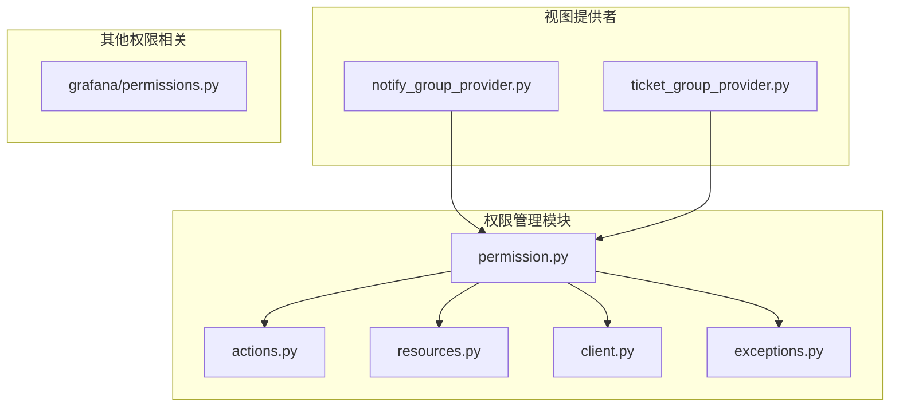
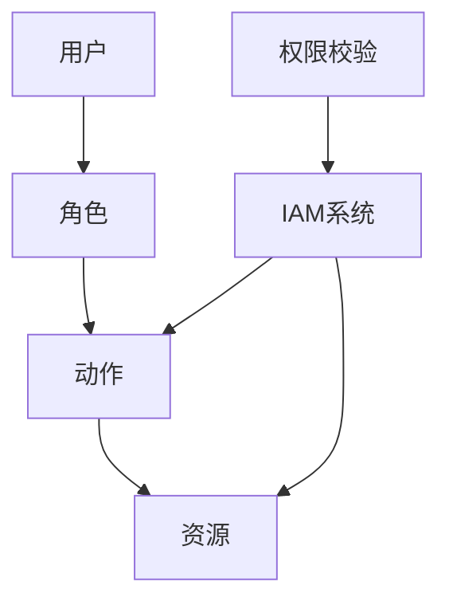
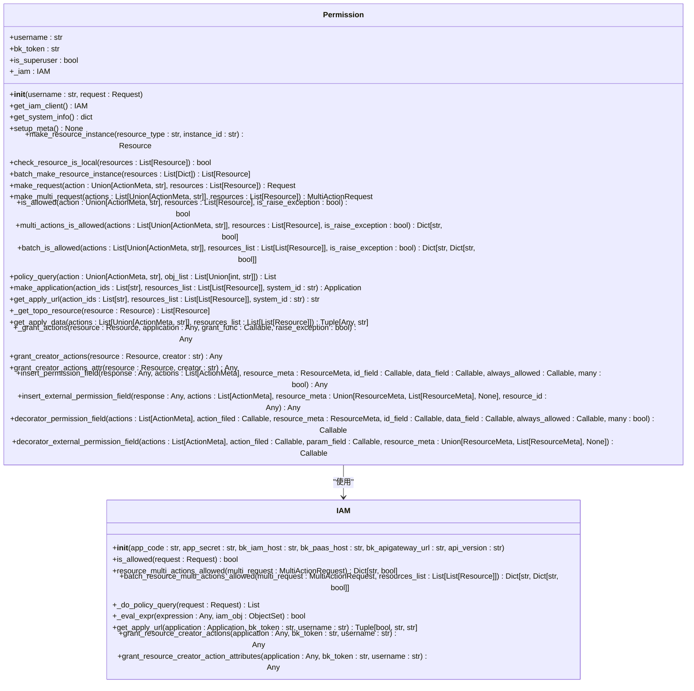
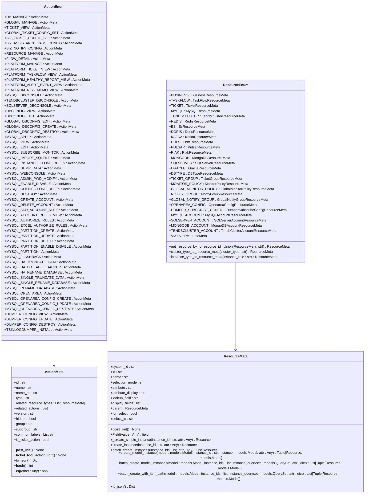
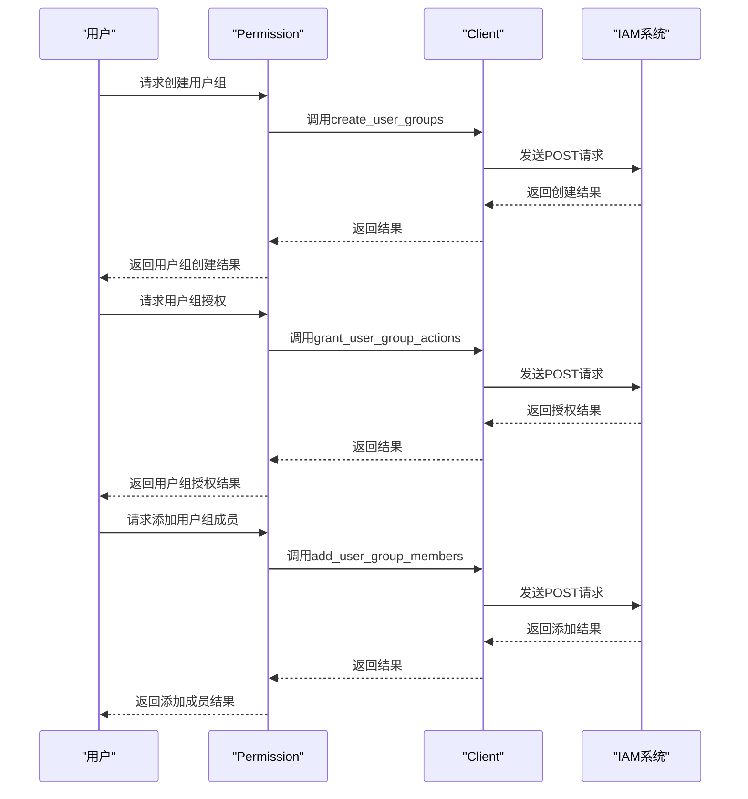
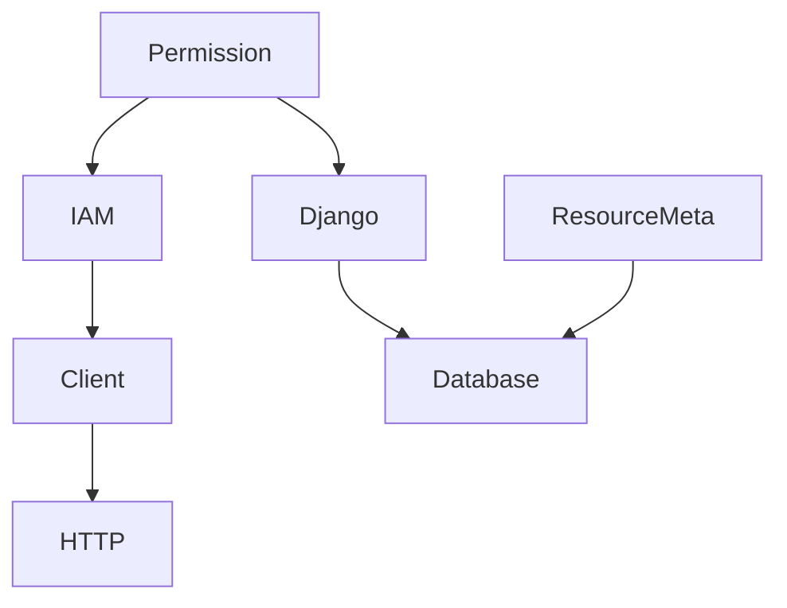

# RBAC模型

<cite>
**本文档引用的文件**   
- [permission.py](file://dbm-ui/backend/iam_app/handlers/permission.py)
- [actions.py](file://dbm-ui/backend/iam_app/dataclass/actions.py)
- [resources.py](file://dbm-ui/backend/iam_app/dataclass/resources.py)
- [client.py](file://dbm-ui/backend/iam_app/handlers/client.py)
- [exceptions.py](file://dbm-ui/backend/iam_app/exceptions.py)
- [notify_group_provider.py](file://dbm-ui/backend/iam_app/views/notify_group_provider.py)
- [ticket_group_provider.py](file://dbm-ui/backend/iam_app/views/ticket_group_provider.py)
- [grafana/permissions.py](file://dbm-ui/backend/bk_dataview/grafana/permissions.py)
</cite>

## 目录
1. [引言](#引言)
2. [项目结构](#项目结构)
3. [核心组件](#核心组件)
4. [架构概述](#架构概述)
5. [详细组件分析](#详细组件分析)
6. [依赖分析](#依赖分析)
7. [性能考虑](#性能考虑)
8. [故障排除指南](#故障排除指南)
9. [结论](#结论)

## 引言
本文档详细阐述了蓝鲸智云-DB管理系统（BlueKing-BK-DBM）中的基于IAM（身份与访问管理）的RBAC（基于角色的访问控制）模型。该模型通过定义角色、权限和用户组，实现了对数据库管理系统的精细化权限控制。文档深入解析了角色与权限的绑定关系、权限继承规则以及用户组的层级结构，并详细说明了权限策略的存储结构、查询机制和缓存策略。此外，文档还涵盖了权限校验的性能优化方法、创建自定义角色和权限集的配置示例、细粒度权限控制在不同数据库类型中的实现差异、权限冲突解决策略以及权限变更审计日志的实现方式。

## 项目结构
蓝鲸DBM系统的RBAC模型主要实现在`dbm-ui/backend/iam_app`目录下，其核心模块包括权限处理、动作定义、资源定义和客户端接口。权限处理模块负责权限的校验和申请，动作定义模块定义了系统中的各种操作权限，资源定义模块定义了系统中的各种资源类型，客户端接口模块提供了与IAM系统交互的API。

**图源**
- [permission.py](file://dbm-ui/backend/iam_app/handlers/permission.py)
- [actions.py](file://dbm-ui/backend/iam_app/dataclass/actions.py)
- [resources.py](file://dbm-ui/backend/iam_app/dataclass/resources.py)
- [client.py](file://dbm-ui/backend/iam_app/handlers/client.py)
- [exceptions.py](file://dbm-ui/backend/iam_app/exceptions.py)
- [notify_group_provider.py](file://dbm-ui/backend/iam_app/views/notify_group_provider.py)
- [ticket_group_provider.py](file://dbm-ui/backend/iam_app/views/ticket_group_provider.py)
- [grafana/permissions.py](file://dbm-ui/backend/bk_dataview/grafana/permissions.py)

**节源**
- [permission.py](file://dbm-ui/backend/iam_app/handlers/permission.py)
- [actions.py](file://dbm-ui/backend/iam_app/dataclass/actions.py)
- [resources.py](file://dbm-ui/backend/iam_app/dataclass/resources.py)
- [client.py](file://dbm-ui/backend/iam_app/handlers/client.py)
- [exceptions.py](file://dbm-ui/backend/iam_app/exceptions.py)
- [notify_group_provider.py](file://dbm-ui/backend/iam_app/views/notify_group_provider.py)
- [ticket_group_provider.py](file://dbm-ui/backend/iam_app/views/ticket_group_provider.py)
- [grafana/permissions.py](file://dbm-ui/backend/bk_dataview/grafana/permissions.py)

## 核心组件
RBAC模型的核心组件包括权限处理类`Permission`、动作枚举类`ActionEnum`、资源枚举类`ResourceEnum`和IAM客户端类`IAM`。`Permission`类封装了权限校验和无权限申请的通用逻辑，`ActionEnum`类定义了系统中的所有操作权限，`ResourceEnum`类定义了系统中的所有资源类型，`IAM`类提供了与IAM系统交互的API。

**节源**
- [permission.py](file://dbm-ui/backend/iam_app/handlers/permission.py#L47-L670)
- [actions.py](file://dbm-ui/backend/iam_app/dataclass/actions.py#L1-L2777)
- [resources.py](file://dbm-ui/backend/iam_app/dataclass/resources.py#L1-L758)
- [client.py](file://dbm-ui/backend/iam_app/handlers/client.py#L1-L67)

## 架构概述
RBAC模型的架构基于IAM系统，通过定义动作和资源来实现权限控制。系统中的每个操作都被定义为一个动作，每个可操作的对象都被定义为一个资源。用户通过角色获得对特定资源的特定动作的权限。权限校验时，系统会检查用户是否具有执行该动作的权限。

**图源**
- [permission.py](file://dbm-ui/backend/iam_app/handlers/permission.py)
- [actions.py](file://dbm-ui/backend/iam_app/dataclass/actions.py)
- [resources.py](file://dbm-ui/backend/iam_app/dataclass/resources.py)

## 详细组件分析

### 权限处理类分析
`Permission`类是权限处理的核心，它提供了权限校验、权限申请、权限字段插入等功能。该类通过`is_allowed`方法进行权限校验，通过`get_apply_url`方法生成权限申请链接，通过`insert_permission_field`方法在数据返回时插入权限字段。

**图源**
- [permission.py](file://dbm-ui/backend/iam_app/handlers/permission.py#L47-L670)
- [client.py](file://dbm-ui/backend/iam_app/handlers/client.py#L61-L67)

### 动作与资源定义分析
`ActionEnum`和`ResourceEnum`类分别定义了系统中的所有动作和资源。每个动作和资源都有一个唯一的ID和名称，并且可以关联其他资源类型和动作。通过这些定义，系统可以精确地控制用户对特定资源的特定操作权限。

**图源**
- [actions.py](file://dbm-ui/backend/iam_app/dataclass/actions.py#L26-L800)
- [resources.py](file://dbm-ui/backend/iam_app/dataclass/resources.py#L27-L758)

### 用户组管理分析
用户组管理通过`Client`类提供的API实现，包括创建用户组、用户组授权、添加用户组成员、查询用户组和更新用户组名字和描述。这些API通过HTTP请求与IAM系统交互，实现了对用户组的全生命周期管理。

**图源**
- [client.py](file://dbm-ui/backend/iam_app/handlers/client.py#L17-L60)
- [permission.py](file://dbm-ui/backend/iam_app/handlers/permission.py)

**节源**
- [client.py](file://dbm-ui/backend/iam_app/handlers/client.py#L17-L60)
- [permission.py](file://dbm-ui/backend/iam_app/handlers/permission.py)

## 依赖分析
RBAC模型的实现依赖于IAM系统提供的API，通过`IAM`类和`Client`类与IAM系统进行交互。此外，权限处理还依赖于Django框架的用户模型和数据库模型，通过`ResourceMeta`类中的`create_model_instance`方法与数据库进行交互。

**图源**
- [permission.py](file://dbm-ui/backend/iam_app/handlers/permission.py)
- [client.py](file://dbm-ui/backend/iam_app/handlers/client.py)
- [resources.py](file://dbm-ui/backend/iam_app/dataclass/resources.py)

**节源**
- [permission.py](file://dbm-ui/backend/iam_app/handlers/permission.py)
- [client.py](file://dbm-ui/backend/iam_app/handlers/client.py)
- [resources.py](file://dbm-ui/backend/iam_app/dataclass/resources.py)

## 性能考虑
为了提高权限校验的性能，系统采用了多种优化策略。首先，通过`batch_is_allowed`方法批量校验多个动作和资源的权限，减少了与IAM系统的交互次数。其次，通过`policy_query`方法批量判断业务资源关联动作是否有权限，利用IAM系统的策略查询功能提高查询效率。此外，系统还通过缓存机制减少重复的权限校验请求。

**节源**
- [permission.py](file://dbm-ui/backend/iam_app/handlers/permission.py#L242-L290)
- [permission.py](file://dbm-ui/backend/iam_app/handlers/permission.py#L292-L325)

## 故障排除指南
在使用RBAC模型时，可能会遇到权限校验失败、权限申请链接生成失败等问题。对于权限校验失败，可以通过检查用户角色和权限配置来解决；对于权限申请链接生成失败，可以通过检查IAM系统的配置和网络连接来解决。此外，系统还提供了详细的日志记录，可以帮助定位和解决问题。

**节源**
- [permission.py](file://dbm-ui/backend/iam_app/handlers/permission.py#L197-L207)
- [permission.py](file://dbm-ui/backend/iam_app/handlers/permission.py#L380-L395)
- [exceptions.py](file://dbm-ui/backend/iam_app/exceptions.py)

## 结论
蓝鲸DBM系统的RBAC模型通过基于IAM的权限管理机制，实现了对数据库管理系统的精细化权限控制。该模型具有良好的可扩展性和灵活性，能够满足不同场景下的权限管理需求。通过本文档的详细说明，用户可以更好地理解和使用RBAC模型，提高系统的安全性和管理效率。