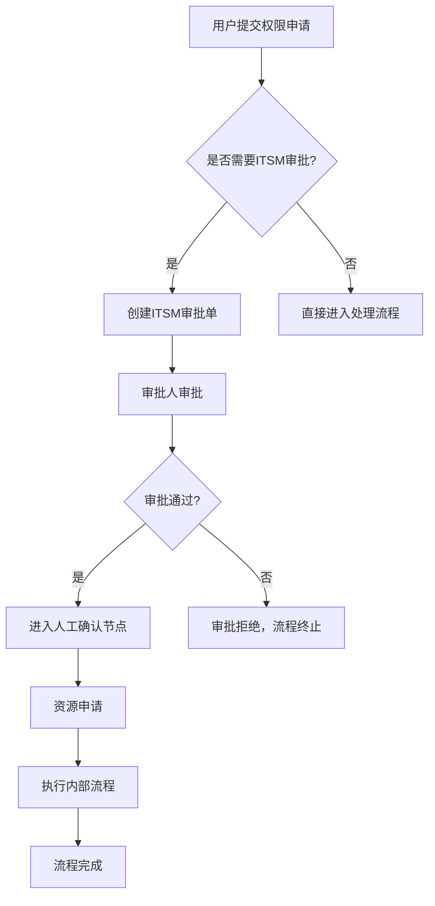
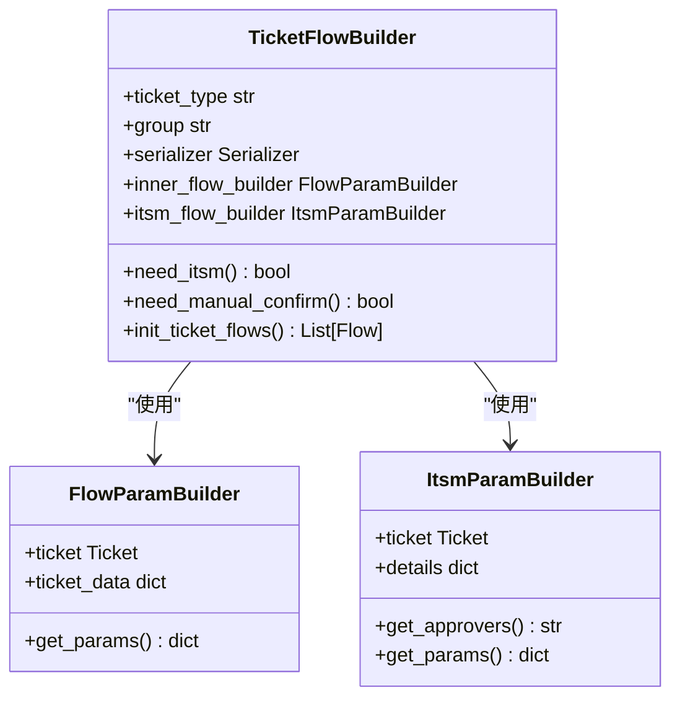
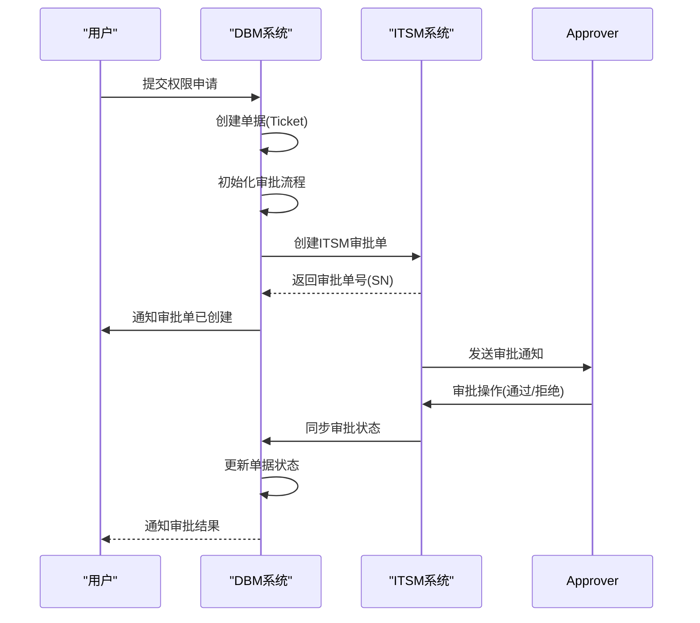
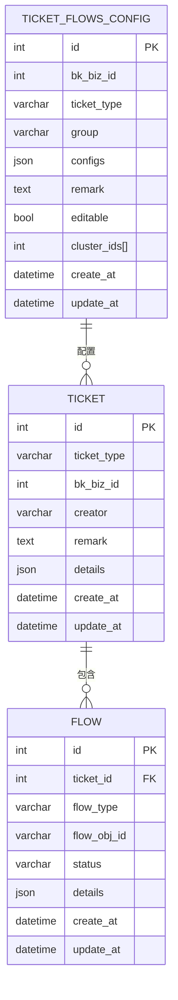
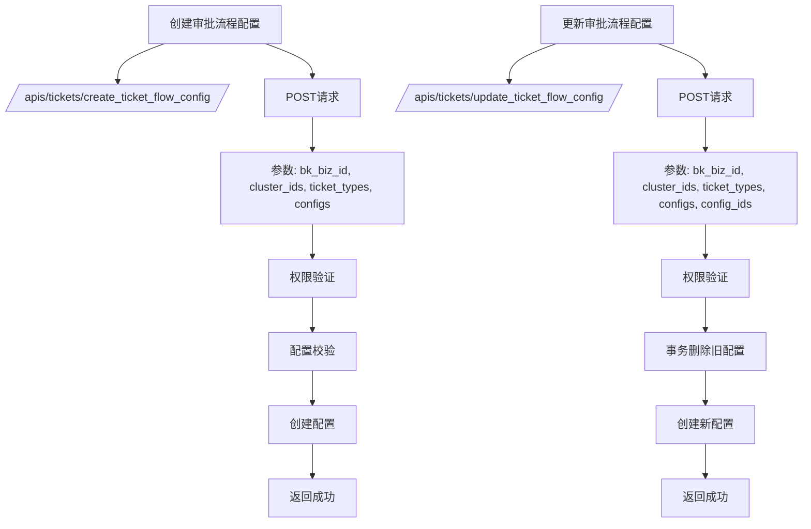

# 审批流程

<cite>
**本文档引用的文件**   
- [ticket/builders/__init__.py](file://dbm-ui/backend/ticket/builders/__init__.py)
- [ticket/handler.py](file://dbm-ui/backend/ticket/handler.py)
- [ticket/flow_manager/itsm.py](file://dbm-ui/backend/ticket/flow_manager/itsm.py)
- [ticket/builders/mysql/mysql_priv_change.py](file://dbm-ui/backend/ticket/builders/mysql/mysql_priv_change.py)
- [ticket/builders/common/resource.py](file://dbm-ui/backend/ticket/builders/common/resource.py)
- [ticket/views.py](file://dbm-ui/backend/ticket/views.py)
- [dbm_aiagent/mcp_tools/mysql/impl/bill_apply_priv.py](file://dbm-ui/backend/dbm_aiagent/mcp_tools/mysql/impl/bill_apply_priv.py)
</cite>

## 目录
1. [引言](#引言)
2. [审批流程架构](#审批流程架构)
3. [核心组件分析](#核心组件分析)
4. [权限申请与ITSM集成流程](#权限申请与itsm集成流程)
5. [审批流程配置与管理](#审批流程配置与管理)
6. [超时处理与异常恢复](#超时处理与异常恢复)
7. [不同类型权限申请的审批模板](#不同类型权限申请的审批模板)
8. [审批历史查询与状态通知](#审批历史查询与状态通知)
9. [与RBAC模型的集成](#与rbac模型的集成)
10. [结论](#结论)

## 引言

本文档详细描述了蓝鲸智云-DB管理系统（BlueKing-BK-DBM）中的审批流程机制，重点阐述权限申请与ITSM系统集成的完整生命周期。文档涵盖了用户提交权限申请、自动路由到相应审批人、多级审批链处理和审批结果同步的全过程。同时，文档化了审批流程配置、超时处理机制和异常情况恢复策略，提供了不同类型权限申请（如MySQL、Redis）的审批模板配置示例，并说明了如何自定义审批流程。此外，还包括审批历史查询、审批状态通知和与RBAC模型的集成方式。

**本文档引用的文件**  
- [ticket/builders/__init__.py](file://dbm-ui/backend/ticket/builders/__init__.py)
- [ticket/handler.py](file://dbm-ui/backend/ticket/handler.py)

## 审批流程架构

DBM系统的审批流程采用模块化设计，核心组件包括单据（Ticket）、流程（Flow）和待办（Todo）。整个审批流程的生命周期由`TicketFlowBuilder`类负责管理，它定义了单据的审批流程，并结合`FlowParamBuilder`和`ItsmParamBuilder`生成所需参数。



**图源**  
- [ticket/builders/__init__.py](file://dbm-ui/backend/ticket/builders/__init__.py)
- [ticket/handler.py](file://dbm-ui/backend/ticket/handler.py)

**本文档引用的文件**  
- [ticket/builders/__init__.py](file://dbm-ui/backend/ticket/builders/__init__.py)
- [ticket/handler.py](file://dbm-ui/backend/ticket/handler.py)

## 核心组件分析

### 单据构建器（TicketFlowBuilder）

`TicketFlowBuilder`是审批流程的核心类，负责定义单据流程并实例化流程对象。它通过`BuilderFactory`注册到系统中，支持不同类型的单据流程。



**图源**  
- [ticket/builders/__init__.py](file://dbm-ui/backend/ticket/builders/__init__.py)

**本文档引用的文件**  
- [ticket/builders/__init__.py](file://dbm-ui/backend/ticket/builders/__init__.py)

### ITSM流程管理器

`ItsmFlow`类负责管理与ITSM系统的集成，处理审批单的创建、状态同步和终止操作。



**图源**  
- [ticket/flow_manager/itsm.py](file://dbm-ui/backend/ticket/flow_manager/itsm.py)
- [ticket/handler.py](file://dbm-ui/backend/ticket/handler.py)

**本文档引用的文件**  
- [ticket/flow_manager/itsm.py](file://dbm-ui/backend/ticket/flow_manager/itsm.py)
- [ticket/handler.py](file://dbm-ui/backend/ticket/handler.py)

## 权限申请与ITSM集成流程

### 申请流程

当用户提交权限申请时，系统会根据申请类型创建相应的单据，并启动审批流程。以MySQL权限变更为例，流程如下：

1. 用户提交MySQL账号规则变更申请
2. 系统创建`MYSQL_ACCOUNT_RULE_CHANGE`类型的单据
3. 根据配置决定是否需要ITSM审批
4. 如果需要审批，创建ITSM审批单并通知审批人
5. 审批人审批通过后，进入后续处理流程

### 审批人路由

审批人的路由规则由`ItsmParamBuilder`的`get_approvers`方法决定。对于MySQL账号规则变更，审批人由`DBRuleActionLog.get_notifiers`方法获取：

```python
def get_approvers(self):
    approver_list = DBRuleActionLog.get_notifiers(self.ticket.details["rule_id"])
    return ",".join(approver_list)
```

### 审批模式

系统支持多种审批模式，包括会签模式。在MySQL账号规则变更中，审批模式被设置为会签：

```python
def get_params(self):
    params = super().get_params()
    field_map = {field["key"]: field["value"] for field in params["fields"]}
    # 审批模式改成会签
    field_map["approve_mode"] = ItsmApproveMode.CounterSign
    params["fields"] = [{"key": key, "value": value} for key, value in field_map.items()]
    return params
```

**本文档引用的文件**  
- [ticket/builders/mysql/mysql_priv_change.py](file://dbm-ui/backend/ticket/builders/mysql/mysql_priv_change.py)
- [ticket/flow_manager/itsm.py](file://dbm-ui/backend/ticket/flow_manager/itsm.py)

## 审批流程配置与管理

### 流程配置模型

审批流程配置由`TicketFlowsConfig`模型管理，支持按业务和集群维度进行配置：



### 配置管理API

系统提供了REST API用于管理审批流程配置：



**本文档引用的文件**  
- [ticket/handler.py](file://dbm-ui/backend/ticket/handler.py)
- [ticket/views.py](file://dbm-ui/backend/ticket/views.py)

## 超时处理与异常恢复

### 超时配置

系统支持配置审批流程的超时时间，通过`default_expire_config`字段定义：

```python
# 默认过期时间配置
default_expire_config: dict = TICKET_EXPIRE_DEFAULT_CONFIG
```

### 异常恢复策略

当审批流程出现异常时，系统提供以下恢复策略：

1. **手动重试**：对于可重试的流程，支持手动重试
2. **流程终止**：支持终止正在进行的流程
3. **批量处理**：支持批量操作待办事项

```python
@classmethod
def revoke_ticket(cls, ticket_ids, operator, remark):
    """
    终止单据
    - 单据状态本身设置为 终止
    - 找到第一个非成功的flow 设置为终止
    - 如果有关联正在运行的todos，也设置为终止
    """
    # 查询ticket，关联正在运行的flows
    finished_status = [*FLOW_FINISHED_STATUS, TicketFlowStatus.TERMINATED, TicketFlowStatus.REVOKED]
    running_flows = Flow.objects.filter(ticket__in=ticket_ids).exclude(status__in=finished_status)
    tickets = Ticket.objects.prefetch_related(
        Prefetch("flows", queryset=running_flows, to_attr="running_flows")
    ).filter(id__in=ticket_ids)
    
    # 对每个单据进行终止
    for ticket in tickets:
        if not ticket.running_flows:
            continue
            
        first_running_flow = ticket.running_flows[0]
        cls.operate_flow(ticket.id, first_running_flow.id, func="revoke", operator=operator, remark=remark)
```

**本文档引用的文件**  
- [ticket/handler.py](file://dbm-ui/backend/ticket/handler.py)
- [ticket/builders/__init__.py](file://dbm-ui/backend/ticket/builders/__init__.py)

## 不同类型权限申请的审批模板

### MySQL权限申请模板

MySQL权限申请的审批模板由`MySQLAccountRuleChangeFlowBuilder`类定义：

```python
@builders.BuilderFactory.register(TicketType.MYSQL_ACCOUNT_RULE_CHANGE, iam=ActionEnum.MYSQL_ADD_ACCOUNT_RULE)
class MySQLAccountRuleChangeFlowBuilder(BaseMySQLTicketFlowBuilder):
    serializer = MySQLAccountRuleChangeSerializer
    inner_flow_builder = MySQLAccountRuleChangeFlowParamBuilder
    itsm_flow_builder = MySQLAccountRuleChangeItsmFlowParamBuilder
    retry_type = FlowRetryType.MANUAL_RETRY
    
    @property
    def need_itsm(self):
        approver_list = DBRuleActionLog.get_notifiers(self.ticket.details["rule_id"])
        return bool(approver_list)
```

### Redis权限申请模板

Redis权限申请的审批流程配置在资源申请构建器中：

```python
@builders.BuilderFactory.register(TicketType.RESOURCE_HCM_REPLENISH)
class ResourceHcmReplenishFlowBuilder(TicketFlowBuilder):
    serializer = ResourceHcmReplenishSerializer
    inner_flow_builder = ResourceHcmReplenishFlowParamBuilder
    group = "common"
    # 资源导入无需审批和确认
    default_need_itsm = False
    default_need_manual_confirm = False
```

### 自定义审批流程

系统支持自定义审批流程，通过继承`TicketFlowBuilder`并覆写相关方法实现：

```python
class CustomFlowBuilder(TicketFlowBuilder):
    # 自定义序列化器
    serializer = CustomSerializer
    # 自定义内部流程构建器
    inner_flow_builder = CustomFlowParamBuilder
    # 自定义ITSM流程构建器
    itsm_flow_builder = CustomItsmParamBuilder
    
    # 自定义是否需要ITSM审批
    @property
    def need_itsm(self):
        # 根据业务逻辑决定是否需要审批
        return self.ticket.details.get("need_approval", True)
        
    # 自定义流程初始化
    def init_ticket_flows(self):
        flows = []
        # 添加自定义流程节点
        if self.need_itsm:
            flows.append(
                Flow(
                    ticket=self.ticket,
                    flow_type=FlowType.BK_ITSM.value,
                    details=self.itsm_flow_builder(self.ticket).get_params(),
                    flow_alias=_("自定义审批")
                )
            )
        # ... 其他自定义流程
        Flow.objects.bulk_create(flows)
        return list(Flow.objects.filter(ticket=self.ticket))
```

**本文档引用的文件**  
- [ticket/builders/mysql/mysql_priv_change.py](file://dbm-ui/backend/ticket/builders/mysql/mysql_priv_change.py)
- [ticket/builders/common/resource.py](file://dbm-ui/backend/ticket/builders/common/resource.py)

## 审批历史查询与状态通知

### 审批历史查询

系统提供了审批历史查询接口，可以查询指定业务和数据库类型的审批流程配置：

```python
@classmethod
def query_ticket_flows_describe(cls, bk_biz_id, db_type, ticket_types=None):
    # 根据条件过滤单据配置
    config_filter = Q(bk_biz_id__in=[bk_biz_id, PLAT_BIZ_ID], group=db_type, editable=True)
    if ticket_types:
        config_filter &= Q(ticket_type__in=ticket_types)
    ticket_flow_configs = TicketFlowsConfig.objects.filter(config_filter)
    
    # 构建返回结果
    flow_desc_list = []
    for flow_config in ticket_flow_configs:
        # 获取集群的描述
        cluster_info = [
            {"cluster_id": clusters_map[cluster_id].id, "immute_domain": clusters_map[cluster_id].immute_domain}
            for cluster_id in flow_config.cluster_ids
            if cluster_id in clusters_map
        ]
        # 获取当前单据的执行流程描述
        config_map = cluster_config_map if cluster_info else biz_config_map
        flow_desc = BuilderFactory.registry[flow_config.ticket_type].describe_ticket_flows(config_map)
        # 构建返回数据
        flow_config_info = model_to_dict(flow_config)
        flow_config_info.update(
            ticket_type_display=flow_config.get_ticket_type_display(),
            flow_desc=flow_desc,
            clusters=cluster_info,
            update_at=flow_config.update_at,
        )
        flow_desc_list.append(flow_config_info)
        
    return flow_desc_list
```

### 状态通知

当审批状态发生变化时，系统会自动发送通知：

```python
def run(self):
    super().run()
    # 创建ITSM单后，发送通知
    notify.send_msg.apply_async(args=(self.ticket.id,))
```

**本文档引用的文件**  
- [ticket/handler.py](file://dbm-ui/backend/ticket/handler.py)
- [ticket/flow_manager/itsm.py](file://dbm-ui/backend/ticket/flow_manager/itsm.py)

## 与RBAC模型的集成

### 权限动作映射

系统通过`BuilderFactory`将单据类型与权限动作进行映射：

```python
@classmethod
def register(cls, ticket_type: str, **kwargs) -> Callable:
    """
    将单据构造类注册到注册器中
    @param ticket_type: 单据类型
    @param kwargs: 单据注册的额外信息
    """
    def inner_wrapper(wrapped_class: TicketFlowBuilder) -> TicketFlowBuilder:
        # ... 其他注册逻辑
        
        if hasattr(ActionEnum, ticket_type) or kwargs.get("iam"):
            # 单据类型和权限动作默认一一对应
            cls.ticket_type__iam_action[ticket_type] = getattr(ActionEnum, ticket_type, None) or kwargs.get("iam")
            
        return wrapped_class
        
    return inner_wrapper
```

### 敏感操作保护

对于敏感操作，系统提供了额外的鉴权保护：

```python
# 敏感类单据集合
sensitive_ticket_type = []

@classmethod
def register(cls, ticket_type: str, **kwargs) -> Callable:
    # ... 其他注册逻辑
    
    if kwargs.get("is_sensitive") and kwargs.get("is_sensitive") not in cls.sensitive_ticket_type:
        cls.sensitive_ticket_type.append(ticket_type)
```

### AI代理集成

系统还支持通过AI代理进行权限申请，自动创建审批单：

```python
def bill_apply_priv(request, bk_biz_id, apply_username, apply_access_dbs, account_type):
    # ... 权限验证逻辑
    
    slz = MySQLAuthorizeRulesSerializer(
        data={"authorize_plugin_infos": [{**auth_data, "bk_biz_id": bk_biz_id}], "need_itsm": True}
    )
    slz.context["request"] = request
    slz.is_valid(raise_exception=True)
    
    ticket_param = {
        "ticket_type": ticket_type,
        "remark": ticket_type,
        "creator": username,
        "helpers": [],
        "bk_biz_id": bk_biz_id,
        "details": slz.validated_data,
    }
    
    return Ticket.create_ticket(**ticket_param)
```

**本文档引用的文件**  
- [ticket/builders/__init__.py](file://dbm-ui/backend/ticket/builders/__init__.py)
- [dbm_aiagent/mcp_tools/mysql/impl/bill_apply_priv.py](file://dbm-ui/backend/dbm_aiagent/mcp_tools/mysql/impl/bill_apply_priv.py)

## 结论

本文档全面描述了蓝鲸智云-DB管理系统中的审批流程机制。系统通过模块化的设计，实现了灵活的审批流程配置和管理。核心的`TicketFlowBuilder`架构支持不同类型的权限申请，与ITSM系统的深度集成确保了审批流程的可靠性和可追溯性。系统提供了完善的超时处理和异常恢复机制，支持按业务和集群维度的精细化配置。通过与RBAC模型的集成，实现了基于角色的访问控制，确保了系统的安全性。未来可以进一步优化审批流程的可视化和自动化程度，提升用户体验和管理效率。