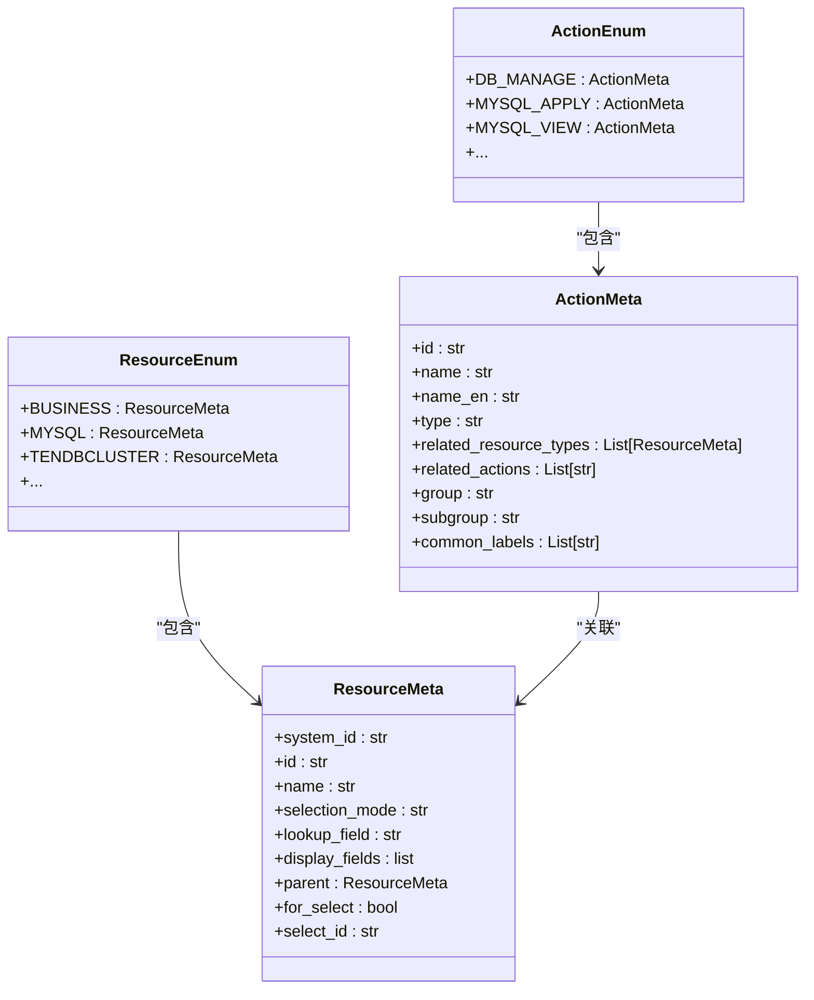
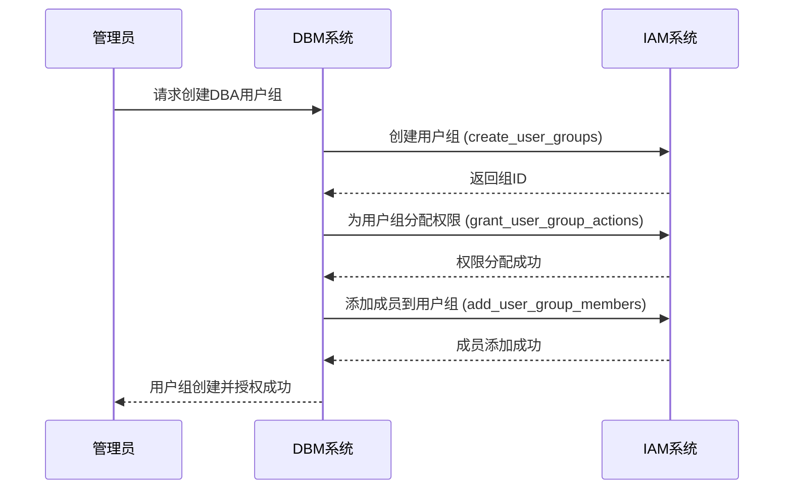
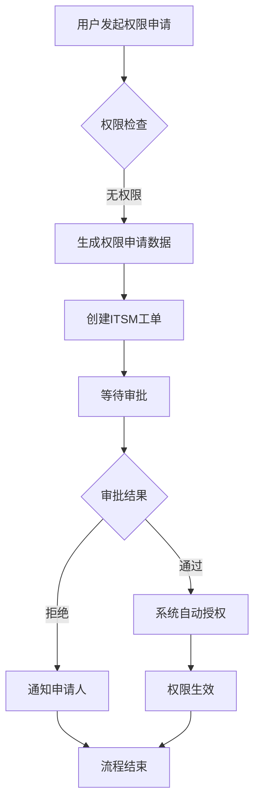
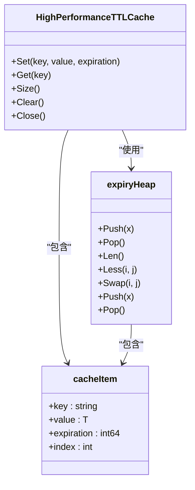

# 授权策略

<cite>
**本文档引用的文件**   
- [actions.py](file://dbm-ui/backend/iam_app/dataclass/actions.py)
- [resources.py](file://dbm-ui/backend/iam_app/dataclass/resources.py)
- [permission.py](file://dbm-ui/backend/iam_app/handlers/permission.py)
- [__init__.py](file://dbm-ui/backend/iam_app/dataclass/__init__.py)
- [constans.py](file://dbm-ui/backend/iam_app/constans.py)
- [dba.py](file://dbm-ui/backend/iam_app/handlers/drf_perm/dba.py)
- [itsm.py](file://dbm-ui/backend/ticket/flow_manager/itsm.py)
- [itsm_todo.py](file://dbm-ui/backend/ticket/todos/itsm_todo.py)
- [authorize_rules.py](file://dbm-ui/backend/flow/plugins/components/collections/mysql/authorize_rules.py)
- [authorize_rules_v2.py](file://dbm-ui/backend/flow/plugins/components/collections/mysql/authorize_rules_v2.py)
- [cache.go](file://dbm-services/common/dbha-v2/pkg/cache/cache.go)
- [cache_test.go](file://dbm-services/common/dbha-v2/pkg/cache/cache_test.go)
- [cache.go](file://dbm-services/common/db-config/internal/repository/model/cache.go)
</cite>

## 目录
1. [引言](#引言)
2. [基于IAM的RBAC模型实现](#基于iam的rbac模型实现)
3. [角色、权限和用户组管理](#角色权限和用户组管理)
4. [权限申请与ITSM流程审批](#权限申请与itsm流程审批)
5. [权限策略的存储结构与查询机制](#权限策略的存储结构与查询机制)
6. [缓存策略](#缓存策略)
7. [自定义角色与权限集配置](#自定义角色与权限集配置)
8. [细粒度权限控制实现](#细粒度权限控制实现)
9. [权限继承与冲突解决](#权限继承与冲突解决)
10. [审计日志](#审计日志)
11. [结论](#结论)

## 引言

本文档旨在深入阐述蓝鲸智云-DB管理系统（BlueKing-BK-DBM）中基于IAM（身份与访问管理）的RBAC（基于角色的访问控制）模型的实现细节。文档详细描述了系统中角色、权限和用户组的定义与管理方式，涵盖了从权限申请、ITSM流程审批到权限生效的完整生命周期。同时，文档化了权限策略的存储结构、查询机制和缓存策略，并提供了创建自定义角色和权限集的配置示例，说明了细粒度权限控制的实现方法。此外，还包含了权限继承、冲突解决和审计日志的相关内容，为系统管理员和开发者提供全面的授权策略参考。

## 基于IAM的RBAC模型实现

DBM系统采用基于IAM的RBAC模型来实现精细化的权限控制。该模型的核心是将权限（Actions）与资源（Resources）进行绑定，并通过角色（Role）作为中介，将权限分配给用户或用户组。系统通过`ActionEnum`和`ResourceEnum`两个枚举类来定义所有可用的动作和资源类型。

**图源**
- [actions.py](file://dbm-ui/backend/iam_app/dataclass/actions.py#L26-L80)
- [resources.py](file://dbm-ui/backend/iam_app/dataclass/resources.py#L27-L153)

**本节源**
- [actions.py](file://dbm-ui/backend/iam_app/dataclass/actions.py#L26-L80)
- [resources.py](file://dbm-ui/backend/iam_app/dataclass/resources.py#L27-L153)

## 角色、权限和用户组管理

在DBM系统中，角色是权限的集合，而用户组是用户的集合。通过将角色分配给用户组，可以实现对一组用户的批量授权。系统提供了多种预定义的常用操作标签（CommonActionLabel），如“业务运维”、“开发常用”等，这些标签将一组相关的动作归类，便于快速分配权限。

用户组的创建、权限分配和成员管理由`assign_auth_to_dba`等函数实现。当为某个业务创建DBA用户组时，系统会自动执行以下步骤：创建用户组、为该用户组分配预设的权限（不包含资源管理和全局设置）、将指定成员添加到该用户组。

**图源**
- [__init__.py](file://dbm-ui/backend/iam_app/dataclass/__init__.py#L246-L273)
- [views.py](file://dbm-ui/backend/iam_app/views/views.py#L108-L111)

**本节源**
- [__init__.py](file://dbm-ui/backend/iam_app/dataclass/__init__.py#L246-L273)
- [constans.py](file://dbm-ui/backend/iam_app/constans.py#L19-L32)

## 权限申请与ITSM流程审批

当用户请求执行其当前权限范围之外的操作时，系统会引导用户发起权限申请。权限申请流程与ITSM（IT服务管理）系统紧密集成。用户通过系统界面发起申请，该申请会被转换为一个ITSM工单。

ITSM工单的审批流程由`ItsmFlow`类管理。该类负责创建ITSM工单、查询工单状态和审批日志，并根据ITSM系统的反馈来更新DBM系统内工单的状态。待办事项（Todo）机制用于跟踪审批进度，当工单状态发生变化时，相应的待办事项状态也会被更新。

**图源**
- [permission.py](file://dbm-ui/backend/iam_app/handlers/permission.py#L327-L395)
- [itsm.py](file://dbm-ui/backend/ticket/flow_manager/itsm.py#L27-L145)
- [itsm_todo.py](file://dbm-ui/backend/ticket/todos/itsm_todo.py#L27-L86)

**本节源**
- [permission.py](file://dbm-ui/backend/iam_app/handlers/permission.py#L327-L395)
- [itsm.py](file://dbm-ui/backend/ticket/flow_manager/itsm.py#L27-L145)

## 权限策略的存储结构与查询机制

权限策略在系统中以结构化的JSON格式进行存储和注册。`generate_iam_migration_json`函数负责根据`ActionEnum`和`ResourceEnum`的定义，自动生成包含系统、资源、动作、实例视图、操作组、常用操作和资源创建联动动作等完整信息的JSON文件。这些JSON文件用于在IAM系统中注册DBM应用的权限模型。

权限查询主要通过`Permission`类的`policy_query`方法实现。该方法首先调用IAM的策略查询接口获取用户的策略数据，然后将策略数据转换为表达式，最后通过评估表达式来判断用户对特定资源是否有权限。

**图源**
- [__init__.py](file://dbm-ui/backend/iam_app/dataclass/__init__.py#L48-L160)
- [permission.py](file://dbm-ui/backend/iam_app/handlers/permission.py#L292-L325)

**本节源**
- [__init__.py](file://dbm-ui/backend/iam_app/dataclass/__init__.py#L48-L160)
- [permission.py](file://dbm-ui/backend/iam_app/handlers/permission.py#L292-L325)

## 缓存策略

为了提高权限查询的性能，系统在多个层面实现了缓存策略。在`db-config`服务中，使用了`freecache`库来实现本地缓存，通过`InitCache`函数初始化一个10MB的缓存实例，用于缓存配置数据。

在`dbha-v2`服务中，实现了一个高性能的TTL（Time-To-Live）缓存，该缓存使用最小堆来管理过期时间，确保缓存项能够及时清理。这种设计在高并发场景下能有效减少内存占用并保证缓存的时效性。

**图源**
- [cache.go](file://dbm-services/common/db-config/internal/repository/model/cache.go#L9-L24)
- [cache.go](file://dbm-services/common/dbha-v2/pkg/cache/cache.go#L38-L46)

**本节源**
- [cache.go](file://dbm-services/common/db-config/internal/repository/model/cache.go#L9-L24)
- [cache.go](file://dbm-services/common/dbha-v2/pkg/cache/cache.go#L1-L46)
- [cache_test.go](file://dbm-services/common/dbha-v2/pkg/cache/cache_test.go#L144-L201)

## 自定义角色与权限集配置

系统支持创建自定义角色和权限集。通过`generate_iam_biz_maintain_json`等函数，可以根据预定义的常用操作标签（如`CommonActionLabel.BIZ_MAINTAIN`）自动生成用户组迁移JSON文件，从而快速为特定业务场景配置权限集。

开发者也可以直接在`ActionEnum`中定义新的`ActionMeta`，通过指定`id`、`name`、`related_resource_types`等属性来创建自定义权限。这些自定义权限同样可以被纳入常用操作标签或操作组中，以便于管理和分配。

**本节源**
- [__init__.py](file://dbm-ui/backend/iam_app/dataclass/__init__.py#L206-L223)
- [actions.py](file://dbm-ui/backend/iam_app/dataclass/actions.py#L26-L80)

## 细粒度权限控制实现

DBM系统实现了非常细粒度的权限控制。权限可以精确到具体的数据库集群类型（如MySQL、TendbCluster、Redis等）和具体的操作（如部署、查看、编辑、删除等）。例如，`MYSQL_VIEW`权限允许用户查看MySQL集群的详情，而`MYSQL_EDIT`权限则允许用户编辑集群配置。

此外，权限还可以与具体的资源实例关联。例如，`MYSQL_AUTHORIZE_RULES`权限关联了`MYSQL_ACCOUNT`和`MYSQL`两种资源，这意味着执行授权操作时，需要同时对账号和集群拥有权限。这种多资源关联的权限设计，确保了操作的安全性和精确性。

**本节源**
- [actions.py](file://dbm-ui/backend/iam_app/dataclass/actions.py#L405-L421)
- [resources.py](file://dbm-ui/backend/iam_app/dataclass/resources.py#L322-L335)

## 权限继承与冲突解决

权限继承主要体现在资源的层级结构上。例如，`TaskFlowResourceMeta`和`TicketResourceMeta`都以`BusinessResourceMeta`为父类，这意味着对业务（biz）的权限可以向下继承到任务流程和单据。在权限查询时，系统会根据资源的`_bk_iam_path_`属性来构建完整的拓扑路径，从而实现基于路径的权限继承。

系统通过明确的权限定义和优先级规则来避免和解决权限冲突。例如，用户对某个具体集群的权限优先级高于对整个业务的权限。当发生权限冲突时，系统通常遵循“最小权限原则”和“显式拒绝优先”原则，确保系统的安全性。

**本节源**
- [resources.py](file://dbm-ui/backend/iam_app/dataclass/resources.py#L222-L248)
- [resources.py](file://dbm-ui/backend/iam_app/dataclass/resources.py#L264-L290)

## 审计日志

系统对关键的权限操作进行了详细的审计日志记录。例如，在执行MySQL授权操作时，`_generate_rule_logs`方法会创建`DBRuleActionLog`对象，并将其批量写入数据库。这些日志记录了操作的账号ID、规则ID、操作者和操作类型（如授权），为后续的审计和问题排查提供了依据。

此外，系统还集成了ITSM的审批日志，可以通过`ticket_logs`属性获取完整的审批流程记录，包括每个审批节点的操作人、时间和审批意见。

**本节源**
- [authorize_rules.py](file://dbm-ui/backend/flow/plugins/components/collections/mysql/authorize_rules.py#L62-L80)
- [authorize_rules_v2.py](file://dbm-ui/backend/flow/plugins/components/collections/mysql/authorize_rules_v2.py#L62-L86)
- [itsm.py](file://dbm-ui/backend/ticket/flow_manager/itsm.py#L48-L60)

## 结论

本文档详细阐述了DBM系统基于IAM的RBAC授权策略。该策略通过清晰的角色、权限和用户组管理，结合ITSM流程审批，实现了安全、灵活的权限控制。系统通过高效的存储结构、查询机制和缓存策略，保证了权限验证的性能。同时，支持自定义角色和细粒度权限控制，满足了复杂业务场景的需求。完善的审计日志功能则为系统的安全性和可追溯性提供了保障。这套授权策略是DBM系统安全运行的重要基石。