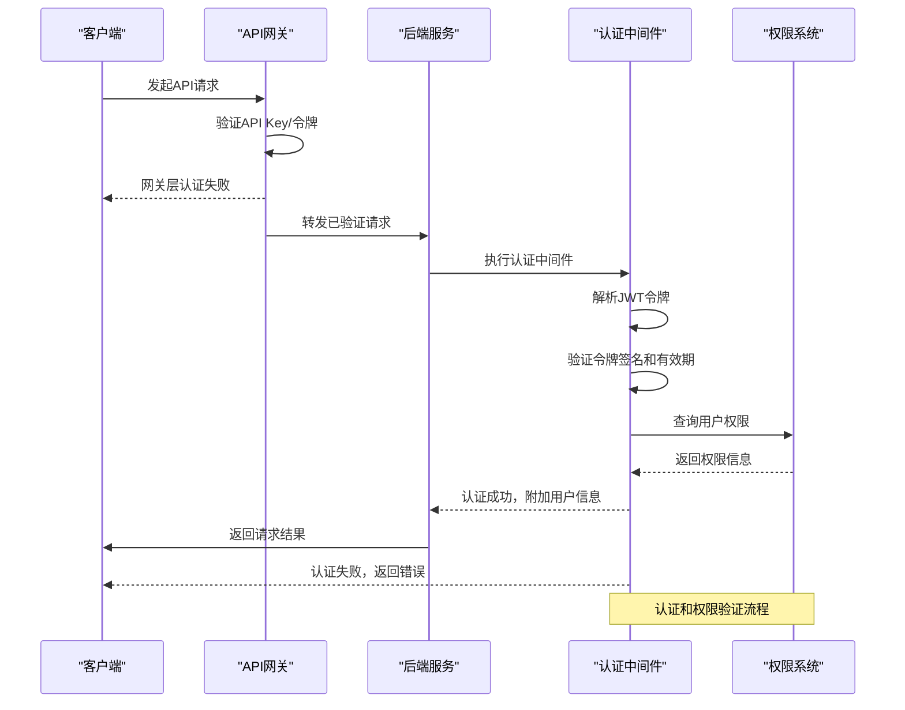
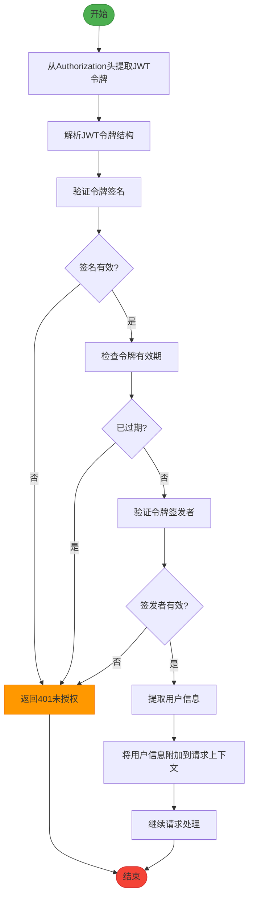
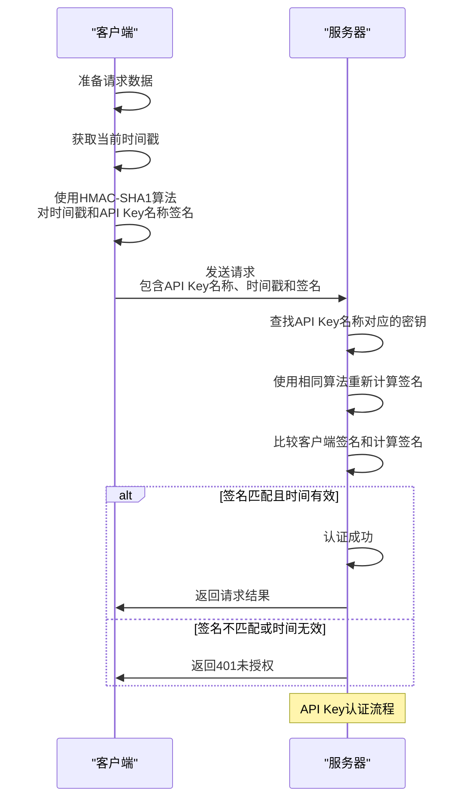
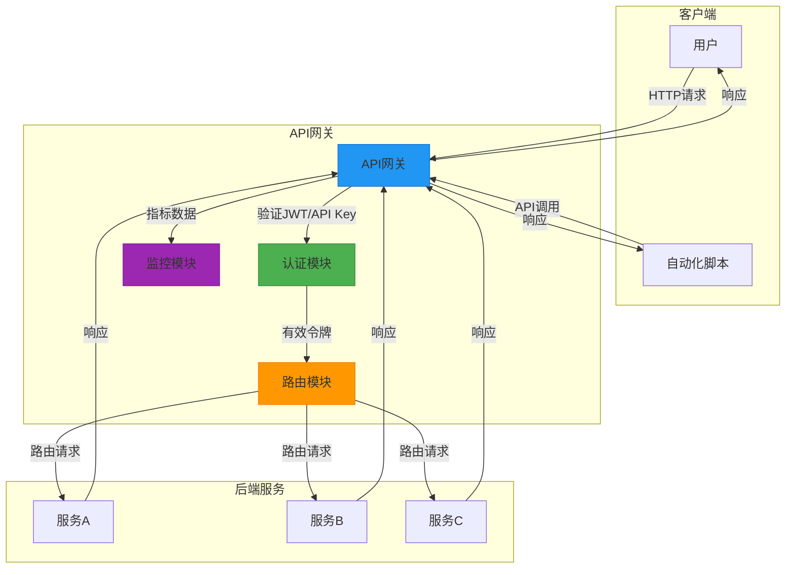
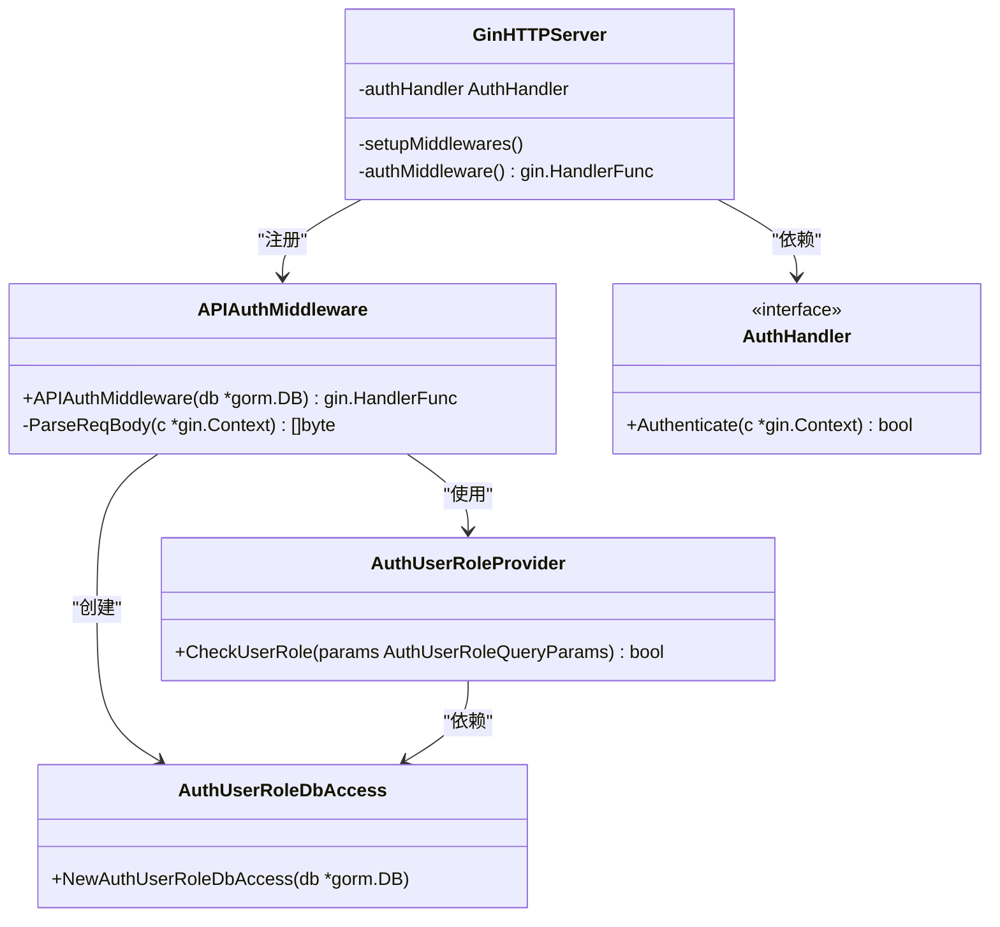
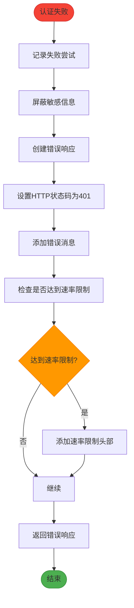
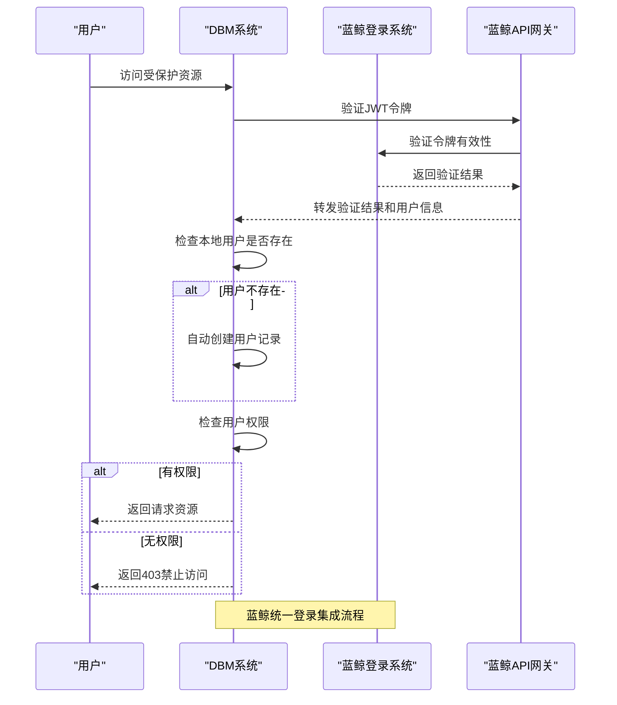

# 认证机制

<cite>
**本文档引用的文件**   
- [api_auth_middleware.go](file://dbm-services/k8s-dbs/middleware/api_auth_middleware.go)
- [middleware_helper.go](file://dbm-services/k8s-dbs/middleware/middleware_helper.go)
- [gin_server.go](file://dbm-services/common/dbha-v2/pkg/hanet/gin_server.go)
- [gin_server_test.go](file://dbm-services/common/dbha-v2/pkg/hanet/gin_server_test.go)
- [jwt_token.go](file://dbm-services/mysql/db-tools/dbactuator/pkg/util/auth/jwt_token.go)
- [sign.go](file://dbm-services/common/db-config/pkg/httpclient/sign.go)
- [bk_login.py](file://dbm-ui/blueking/component/apis/bk_login.py)
- [middleware.py](file://dbm-ui/backend/bk_web/middleware.py)
- [yunti_test.go](file://dbm-services/common/db-resource/internal/svr/yunti/yunti_test.go)
- [bkapigw_user.go](file://dbm-services/common/db-config/internal/api/bkapigw_user.go)
- [errors.go](file://dbm-services/k8s-dbs/errors/error.go)
</cite>

## 目录
1. [介绍](#介绍)
2. [认证流程概述](#认证流程概述)
3. [JWT认证机制](#jwt认证机制)
4. [API Key认证机制](#api-key认证机制)
5. [API网关集成](#api网关集成)
6. [认证中间件实现](#认证中间件实现)
7. [认证失败处理](#认证失败处理)
8. [与蓝鲸统一登录系统集成](#与蓝鲸统一登录系统集成)
9. [调试与故障排除](#调试与故障排除)

## 介绍

蓝鲸数据库管理系统（BlueKing-BK-DBM）实现了多层次的认证机制，确保系统安全性和访问控制。本系统主要采用JWT（JSON Web Token）和API Key两种认证方式，并通过API网关进行统一集成。认证机制贯穿于系统的各个服务组件，从前端用户界面到后端微服务，都通过中间件进行统一的身份验证。

系统通过蓝鲸统一登录系统进行用户身份管理，所有认证流程都与蓝鲸平台深度集成。当请求进入系统时，首先通过API网关进行初步验证，然后由各服务的认证中间件进行详细的身份验证和权限检查。这种分层的认证架构既保证了安全性，又提供了灵活的扩展能力。

**Section sources**
- [middleware.py](file://dbm-ui/backend/bk_web/middleware.py#L1-L50)
- [gin_server.go](file://dbm-services/common/dbha-v2/pkg/hanet/gin_server.go#L1-L50)

## 认证流程概述

蓝鲸DBM系统的认证流程采用分层架构，从API网关到具体服务组件，形成完整的安全防护体系。当客户端发起请求时，请求首先到达API网关，网关根据配置的认证策略进行初步验证。对于通过网关验证的请求，将被转发到相应的后端服务。

后端服务通过Gin框架的中间件机制实现认证功能。在`gin_server.go`中定义了`AuthHandler`接口和`authMiddleware`中间件，所有需要认证的API端点都会应用此中间件。中间件会检查请求头中的认证信息，验证令牌的有效性，并根据用户权限决定是否允许访问。

认证流程主要包括以下几个步骤：首先解析请求中的认证信息（JWT令牌或API Key），然后验证令牌的签名和有效期，接着检查用户权限，最后将认证结果附加到请求上下文中供后续处理使用。对于认证失败的请求，系统会返回相应的错误响应，包含详细的错误信息和状态码。

**Diagram sources **
- [gin_server.go](file://dbm-services/common/dbha-v2/pkg/hanet/gin_server.go#L50-L293)
- [api_auth_middleware.go](file://dbm-services/k8s-dbs/middleware/api_auth_middleware.go#L1-L74)

**Section sources**
- [gin_server.go](file://dbm-services/common/dbha-v2/pkg/hanet/gin_server.go#L1-L311)
- [middleware_helper.go](file://dbm-services/k8s-dbs/middleware/middleware_helper.go#L1-L84)

## JWT认证机制

蓝鲸DBM系统采用JWT（JSON Web Token）作为主要的认证机制之一。JWT是一种开放标准（RFC 7519），用于在各方之间安全地传输信息作为JSON对象。系统中的JWT实现基于`github.com/golang-jwt/jwt/v4`库，提供了安全的令牌生成和验证功能。

在`jwt_token.go`文件中，`Sign`函数负责生成JWT令牌。该函数接受用户名、secretId和secretKey作为参数，创建包含这些信息的令牌。令牌的声明（claims）包括`sub`（主题）、`user`（用户名）和`iat`（签发时间）。系统使用HS256算法对令牌进行签名，确保令牌的完整性和防篡改性。

JWT令牌通常通过HTTP请求头的`Authorization`字段传递，格式为`Bearer <token>`。认证中间件会解析此头部，提取令牌并进行验证。验证过程包括检查令牌的签名是否有效、确认令牌是否在有效期内，以及验证令牌的签发者。对于无效或过期的令牌，系统会拒绝请求并返回401未授权状态码。

**Diagram sources **
- [jwt_token.go](file://dbm-services/mysql/db-tools/dbactuator/pkg/util/auth/jwt_token.go#L1-L21)
- [gin_server.go](file://dbm-services/common/dbha-v2/pkg/hanet/gin_server.go#L280-L293)

**Section sources**
- [jwt_token.go](file://dbm-services/mysql/db-tools/dbactuator/pkg/util/auth/jwt_token.go#L1-L21)
- [sign.go](file://dbm-services/common/db-config/pkg/httpclient/sign.go#L1-L25)

## API Key认证机制

除了JWT认证外，系统还支持API Key认证机制，主要用于服务间调用和自动化脚本访问。API Key认证采用HMAC-SHA1签名算法，确保认证信息的安全传输。在`yunti_test.go`文件中，可以找到相关的测试代码，验证了HMAC-SHA1签名的正确性和API Key认证流程。

API Key认证流程要求客户端在请求时提供API Key名称、密钥和时间戳。客户端使用HMAC-SHA1算法对时间戳和API Key名称进行签名，生成签名值。这个签名值与API Key名称、时间戳一起作为认证信息发送到服务器。服务器收到请求后，使用存储的API Key密钥重新计算签名，并与客户端提供的签名进行比对。

系统通过`getSign`函数生成签名，该函数接受时间戳、API Key名称和密钥作为参数。生成的签名是一个40字符的十六进制字符串，确保了足够的安全强度。服务器端验证时，会查找请求中API Key名称对应的密钥，重新计算签名并进行比较。如果签名匹配且时间戳在允许的时间窗口内（通常为5分钟），则认证通过。

API Key认证特别适用于不需要用户交互的自动化场景，如定时任务、监控系统和CI/CD流水线。它提供了比基本认证更安全的替代方案，避免了在请求中直接传输明文密码。

**Diagram sources **
- [yunti_test.go](file://dbm-services/common/db-resource/internal/svr/yunti/yunti_test.go#L134-L217)
- [bkapigw_user.go](file://dbm-services/common/db-config/internal/api/bkapigw_user.go#L1-L31)

**Section sources**
- [yunti_test.go](file://dbm-services/common/db-resource/internal/svr/yunti/yunti_test.go#L134-L217)
- [bkapigw_user.go](file://dbm-services/common/db-config/internal/api/bkapigw_user.go#L1-L31)

## API网关集成

蓝鲸DBM系统通过API网关实现统一的入口管理和认证集成。API网关作为系统的前端代理，负责路由请求、执行认证和授权策略，以及提供流量控制和监控功能。在`middleware.py`文件中，可以看到与API网关集成的相关代码，特别是`DBMLoginRequiredMiddleware`类，它处理来自API网关的JWT令牌和用户信息。

API网关集成的关键在于`X-Bkapi-JWT`和`X-Bkapi-Authorization`头部的处理。当请求通过API网关时，网关会验证原始认证信息，并在转发请求时添加这些头部。`DBMLoginRequiredMiddleware`中间件会检查这些头部，提取用户身份信息，并将其附加到Django请求对象中。这种设计实现了认证逻辑的解耦，使得后端服务无需关心具体的认证实现细节。

系统还支持通过`bk_app_code`和`bk_app_secret`进行服务间调用的认证。当请求头中包含有效的应用代码和密钥时，系统会授予超级用户权限，允许执行管理操作。这种机制主要用于内部服务间的可信调用，简化了微服务架构下的认证复杂性。

API网关的配置通过YAML文件定义，如`mcp_definition.yaml`所示。这些配置文件定义了API的路径、认证要求、权限控制等元数据，实现了API管理的声明式配置。通过`sync_saas_apigw.py`脚本，系统可以自动同步API网关的配置，确保开发、测试和生产环境的一致性。

**Diagram sources **
- [middleware.py](file://dbm-ui/backend/bk_web/middleware.py#L74-L114)
- [mcp_definition.yaml](file://dbm-ui/backend/dbm_init/apigw/mcp_definition.yaml#L1-L14)

**Section sources**
- [middleware.py](file://dbm-ui/backend/bk_web/middleware.py#L74-L114)
- [sync_saas_apigw.py](file://dbm-ui/backend/dbm_init/management/commands/sync_saas_apigw.py#L91-L117)

## 认证中间件实现

蓝鲸DBM系统的认证中间件实现基于Gin框架的中间件机制，提供了灵活且可扩展的认证功能。在`api_auth_middleware.go`文件中，`APIAuthMiddleware`函数创建了一个Gin中间件，用于处理API请求的认证和权限检查。该中间件通过数据库访问层查询用户角色和权限，确保只有授权用户才能访问特定的API端点。

中间件的实现遵循了单一职责原则，每个中间件只负责一个特定的功能。`RegisterMiddleWare`函数在`middleware_helper.go`中注册了多个中间件，包括日志记录、跟踪、指标收集和认证中间件。这种分层的中间件架构使得系统可以独立地开发和测试每个功能模块。

认证中间件的工作流程如下：首先解析请求体，提取`bk_username`字段；然后查询数据库，检查该用户是否具有执行当前操作所需的权限；最后根据检查结果决定是否继续处理请求。如果用户没有相应权限，中间件会立即返回403禁止访问的错误响应，阻止请求继续执行。

中间件还实现了请求体的复制功能，通过`ParseReqBody`函数读取并保存请求体内容，然后将其恢复到请求对象中。这解决了HTTP请求体只能读取一次的问题，使得后续的处理函数仍然可以正常读取请求数据。这种设计在需要同时进行认证和业务逻辑处理的场景中尤为重要。

**Diagram sources **
- [api_auth_middleware.go](file://dbm-services/k8s-dbs/middleware/api_auth_middleware.go#L1-L74)
- [middleware_helper.go](file://dbm-services/k8s-dbs/middleware/middleware_helper.go#L1-L84)

**Section sources**
- [api_auth_middleware.go](file://dbm-services/k8s-dbs/middleware/api_auth_middleware.go#L1-L74)
- [middleware_helper.go](file://dbm-services/k8s-dbs/middleware/middleware_helper.go#L1-L84)

## 认证失败处理

系统对认证失败的情况提供了完善的处理机制，确保安全的同时提供有用的调试信息。在`gin_server.go`文件中，`authMiddleware`函数对认证失败的请求返回401未授权状态码，并附带简单的错误信息。这种设计遵循了HTTP标准，使得客户端能够正确识别和处理认证错误。

对于更复杂的错误情况，系统使用统一的错误处理机制。在`errors.go`文件中定义了各种错误类型，包括认证错误、权限错误和系统错误。这些错误类型包含了错误代码、英文消息和中文消息，支持多语言环境下的错误展示。当发生认证失败时，系统会创建相应的错误对象，并通过API响应返回给客户端。

系统还实现了敏感信息的保护机制。在`rs_resource_param.go`文件中，`maskSensitiveData`函数会检测日志中的敏感字段（如密码、令牌、密钥等），并将其替换为"[CONTAINS_SENSITIVE_DATA]"。这种保护措施防止了敏感信息意外泄露，即使在调试模式下也能保证系统安全。

认证失败的处理流程还包括详细的日志记录。系统会记录失败的请求时间、客户端IP地址、请求路径和失败原因，但不会记录完整的请求体或认证信息。这些日志信息对于安全审计和异常检测非常重要，可以帮助管理员识别潜在的安全威胁和滥用行为。

**Diagram sources **
- [gin_server.go](file://dbm-services/common/dbha-v2/pkg/hanet/gin_server.go#L280-L293)
- [rs_resource_param.go](file://dbm-services/common/db-resource/internal/controller/manage/rs_resource_param.go#L88-L126)

**Section sources**
- [gin_server.go](file://dbm-services/common/dbha-v2/pkg/hanet/gin_server.go#L280-L293)
- [errors.go](file://dbm-services/k8s-dbs/errors/error.go#L1-L50)

## 与蓝鲸统一登录系统集成

蓝鲸DBM系统深度集成了蓝鲸统一登录系统，实现了统一的用户身份管理和单点登录功能。在`bk_login.py`文件中，定义了与蓝鲸登录服务交互的API接口，包括获取用户信息、验证登录状态等功能。这些接口通过蓝鲸的组件API机制调用，确保了与蓝鲸平台的兼容性和安全性。

系统通过`UserModelBackend`类与蓝鲸登录系统集成，该类实现了Django认证后端接口。当用户尝试访问受保护的资源时，认证中间件会调用此后端验证用户身份。后端首先检查请求中的JWT令牌，然后通过蓝鲸API验证令牌的有效性，并获取用户的基本信息。

对于服务间调用，系统支持通过应用代码和密钥进行认证。当请求头中包含有效的`bk_app_code`和`bk_app_secret`时，系统会验证这些凭据，并授予相应的权限。这种机制允许可信的服务在无需用户交互的情况下访问API，简化了微服务架构下的认证流程。

集成还支持用户自动注册功能。当系统接收到一个有效的蓝鲸用户令牌，但该用户在本地数据库中不存在时，系统会自动创建用户记录。这种设计简化了用户管理，确保所有通过蓝鲸认证的用户都能立即访问系统资源，而无需额外的注册步骤。

**Diagram sources **
- [bk_login.py](file://dbm-ui/blueking/component/apis/bk_login.py#L17-L55)
- [middleware.py](file://dbm-ui/backend/bk_web/middleware.py#L17-L268)

**Section sources**
- [bk_login.py](file://dbm-ui/blueking/component/apis/bk_login.py#L17-L55)
- [middleware.py](file://dbm-ui/backend/bk_web/middleware.py#L17-L268)

## 调试与故障排除

对于认证问题的调试，系统提供了多种工具和方法。首先，详细的日志记录是诊断问题的关键。系统在`middleware.py`和`gin_server.go`中实现了全面的日志记录，包括请求路径、客户端IP、认证状态和错误信息。这些日志可以帮助快速定位认证失败的原因。

其次，系统提供了健康检查端点`/health`，可以用于验证服务的基本可用性。通过`gin_server_test.go`中的测试用例，可以看到如何测试认证功能：包括无认证头、无效令牌和有效令牌三种情况。这些测试用例不仅验证了功能正确性，也为调试提供了参考。

对于JWT令牌问题，可以使用在线JWT解码工具分析令牌内容，检查签发者、有效期和用户信息是否正确。对于API Key认证问题，需要验证时间戳是否在有效窗口内，以及HMAC签名是否正确计算。系统日志通常会提供足够的信息来判断是签名错误还是时间同步问题。

在生产环境中，建议使用蓝鲸提供的API网关监控工具，可以实时查看API调用情况、认证成功率和错误分布。这些监控数据对于发现和解决认证问题非常有帮助。同时，定期检查和更新API密钥，确保密钥的安全性，也是预防认证问题的重要措施。

**Section sources**
- [gin_server_test.go](file://dbm-services/common/dbha-v2/pkg/hanet/gin_server_test.go#L96-L140)
- [middleware.py](file://dbm-ui/backend/bk_web/middleware.py#L1-L268)