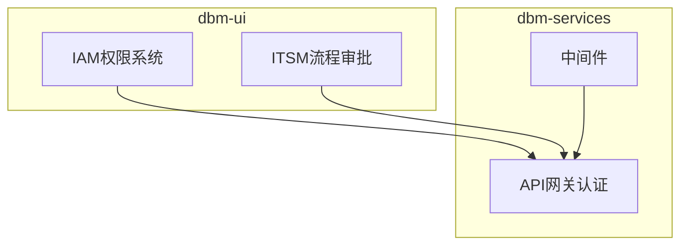
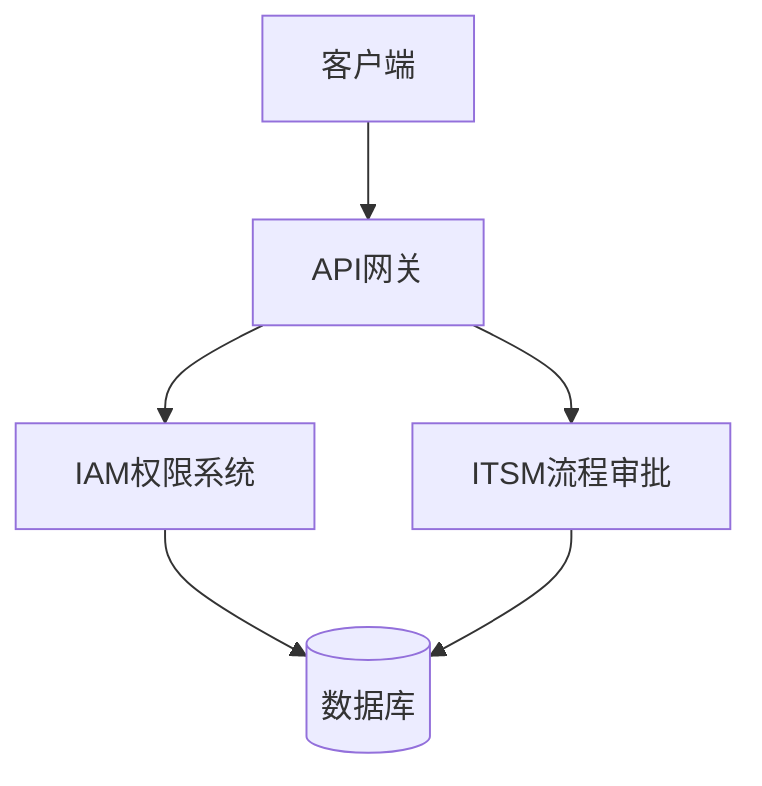
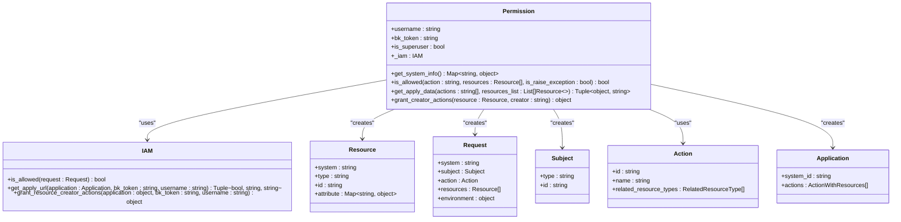
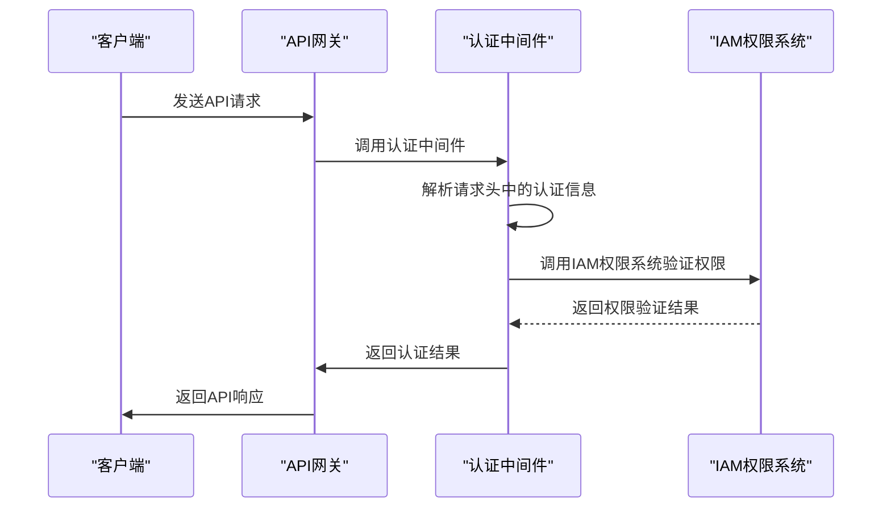
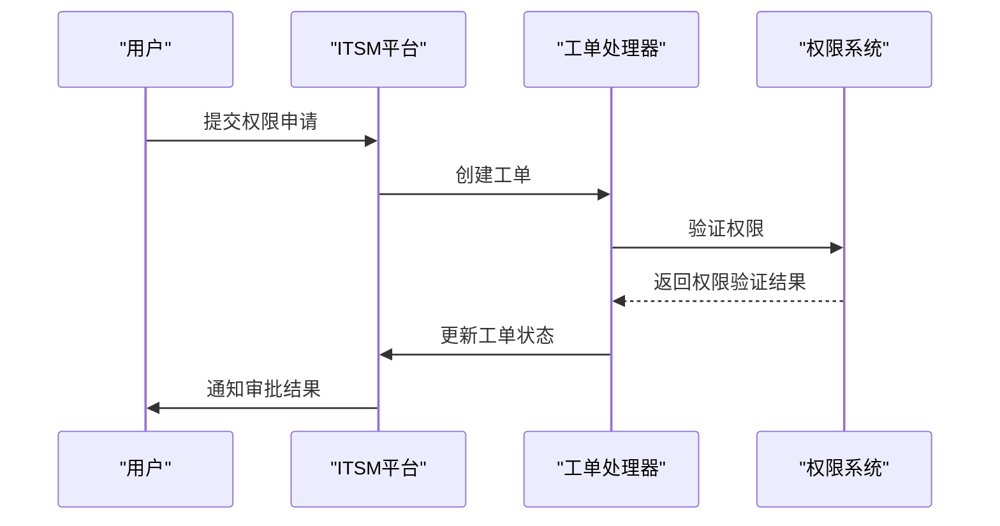
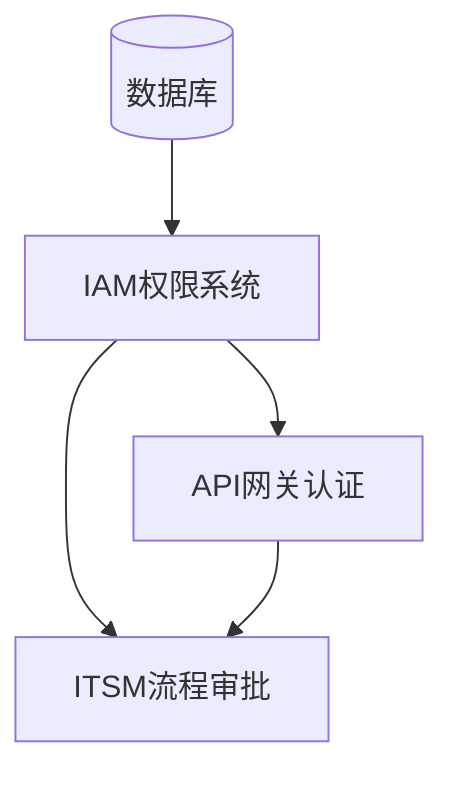

# 访问控制

<cite>
**本文档引用的文件**   
- [permission.py](file://dbm-ui/backend/iam_app/handlers/permission.py)
- [views.py](file://dbm-ui/backend/iam_app/views/views.py)
- [api_auth_middleware.go](file://dbm-services/k8s-dbs/middleware/api_auth_middleware.go)
- [middleware_helper.go](file://dbm-services/k8s-dbs/middleware/middleware_helper.go)
- [itsm.py](file://dbm-ui/backend/ticket/flow_manager/itsm.py)
- [itsm_todo.py](file://dbm-ui/backend/ticket/todos/itsm_todo.py)
- [jwt_token.go](file://dbm-services/mysql/db-tools/dbactuator/pkg/util/auth/jwt_token.go)
- [middleware.py](file://dbm-ui/backend/bk_web/middleware.py)
</cite>

## 目录
1. [引言](#引言)
2. [项目结构](#项目结构)
3. [核心组件](#核心组件)
4. [架构概述](#架构概述)
5. [详细组件分析](#详细组件分析)
6. [依赖分析](#依赖分析)
7. [性能考虑](#性能考虑)
8. [故障排除指南](#故障排除指南)
9. [结论](#结论)
10. [附录](#附录) (如有必要)

## 引言
本文档详细阐述了蓝鲸DBM系统的访问控制机制，涵盖IAM权限系统、API网关认证和ITSM流程审批的集成。文档重点解释了基于角色的访问控制（RBAC）模型的设计与实现，包括权限申请、审批和生效的完整流程。同时，文档化了API请求的认证机制（如JWT、API Key）和中间件中的权限校验逻辑，并提供了配置示例说明如何定义和管理不同用户角色的权限策略，以及与蓝鲸其他组件的权限集成方式。

## 项目结构
蓝鲸DBM项目的访问控制功能主要分布在`dbm-ui`和`dbm-services`两个主要目录下。`dbm-ui`目录包含了IAM权限系统和ITSM流程审批的后端实现，而`dbm-services`目录则包含了API网关认证和中间件的实现。

**图源**
- [permission.py](file://dbm-ui/backend/iam_app/handlers/permission.py)
- [api_auth_middleware.go](file://dbm-services/k8s-dbs/middleware/api_auth_middleware.go)
- [itsm.py](file://dbm-ui/backend/ticket/flow_manager/itsm.py)

**章节源**
- [permission.py](file://dbm-ui/backend/iam_app/handlers/permission.py)
- [api_auth_middleware.go](file://dbm-services/k8s-dbs/middleware/api_auth_middleware.go)
- [itsm.py](file://dbm-ui/backend/ticket/flow_manager/itsm.py)

## 核心组件
本文档的核心组件包括IAM权限系统、API网关认证和ITSM流程审批。IAM权限系统负责管理用户权限，API网关认证负责验证API请求的合法性，ITSM流程审批负责处理权限申请的审批流程。

**章节源**
- [permission.py](file://dbm-ui/backend/iam_app/handlers/permission.py)
- [api_auth_middleware.go](file://dbm-services/k8s-dbs/middleware/api_auth_middleware.go)
- [itsm.py](file://dbm-ui/backend/ticket/flow_manager/itsm.py)

## 架构概述
蓝鲸DBM系统的访问控制架构采用分层设计，包括IAM权限系统、API网关认证和ITSM流程审批三个主要层次。IAM权限系统负责管理用户权限，API网关认证负责验证API请求的合法性，ITSM流程审批负责处理权限申请的审批流程。

**图源**
- [permission.py](file://dbm-ui/backend/iam_app/handlers/permission.py)
- [api_auth_middleware.go](file://dbm-services/k8s-dbs/middleware/api_auth_middleware.go)
- [itsm.py](file://dbm-ui/backend/ticket/flow_manager/itsm.py)

## 详细组件分析

### IAM权限系统分析
IAM权限系统是蓝鲸DBM系统的核心组件之一，负责管理用户权限。该系统基于RBAC模型，通过定义角色和权限来控制用户对系统资源的访问。

#### IAM权限系统类图

**图源**
- [permission.py](file://dbm-ui/backend/iam_app/handlers/permission.py)

**章节源**
- [permission.py](file://dbm-ui/backend/iam_app/handlers/permission.py)

### API网关认证分析
API网关认证是蓝鲸DBM系统的另一个核心组件，负责验证API请求的合法性。该系统通过中间件实现，支持多种认证方式，包括JWT和API Key。

#### API网关认证序列图

**图源**
- [api_auth_middleware.go](file://dbm-services/k8s-dbs/middleware/api_auth_middleware.go)
- [permission.py](file://dbm-ui/backend/iam_app/handlers/permission.py)

**章节源**
- [api_auth_middleware.go](file://dbm-services/k8s-dbs/middleware/api_auth_middleware.go)
- [permission.py](file://dbm-ui/backend/iam_app/handlers/permission.py)

### ITSM流程审批分析
ITSM流程审批是蓝鲸DBM系统的第三个核心组件，负责处理权限申请的审批流程。该系统通过与ITSM平台集成，实现权限申请的自动化审批。

#### ITSM流程审批序列图

**图源**
- [itsm.py](file://dbm-ui/backend/ticket/flow_manager/itsm.py)
- [itsm_todo.py](file://dbm-ui/backend/ticket/todos/itsm_todo.py)
- [permission.py](file://dbm-ui/backend/iam_app/handlers/permission.py)

**章节源**
- [itsm.py](file://dbm-ui/backend/ticket/flow_manager/itsm.py)
- [itsm_todo.py](file://dbm-ui/backend/ticket/todos/itsm_todo.py)
- [permission.py](file://dbm-ui/backend/iam_app/handlers/permission.py)

## 依赖分析
蓝鲸DBM系统的访问控制组件之间存在紧密的依赖关系。IAM权限系统依赖于数据库存储用户和角色信息，API网关认证依赖于IAM权限系统进行权限验证，ITSM流程审批依赖于IAM权限系统和API网关认证。

**图源**
- [permission.py](file://dbm-ui/backend/iam_app/handlers/permission.py)
- [api_auth_middleware.go](file://dbm-services/k8s-dbs/middleware/api_auth_middleware.go)
- [itsm.py](file://dbm-ui/backend/ticket/flow_manager/itsm.py)

**章节源**
- [permission.py](file://dbm-ui/backend/iam_app/handlers/permission.py)
- [api_auth_middleware.go](file://dbm-services/k8s-dbs/middleware/api_auth_middleware.go)
- [itsm.py](file://dbm-ui/backend/ticket/flow_manager/itsm.py)

## 性能考虑
在设计和实现访问控制组件时，需要考虑性能问题。IAM权限系统的权限验证操作可能会成为性能瓶颈，因此需要优化权限验证算法和缓存机制。API网关认证的中间件需要高效处理大量并发请求，因此需要优化中间件的性能。ITSM流程审批的工单处理需要快速响应，因此需要优化工单处理流程。

## 故障排除指南
在使用访问控制组件时，可能会遇到各种问题。以下是一些常见的问题和解决方案：

- **权限验证失败**：检查用户角色和权限配置是否正确。
- **API请求认证失败**：检查API请求头中的认证信息是否正确。
- **工单审批失败**：检查ITSM平台的配置和网络连接是否正常。

**章节源**
- [permission.py](file://dbm-ui/backend/iam_app/handlers/permission.py)
- [api_auth_middleware.go](file://dbm-services/k8s-dbs/middleware/api_auth_middleware.go)
- [itsm.py](file://dbm-ui/backend/ticket/flow_manager/itsm.py)

## 结论
本文档详细阐述了蓝鲸DBM系统的访问控制机制，包括IAM权限系统、API网关认证和ITSM流程审批的集成。通过本文档，用户可以了解如何设计和实现基于角色的访问控制模型，以及如何配置和管理不同用户角色的权限策略。同时，文档还提供了故障排除指南，帮助用户解决使用过程中遇到的问题。