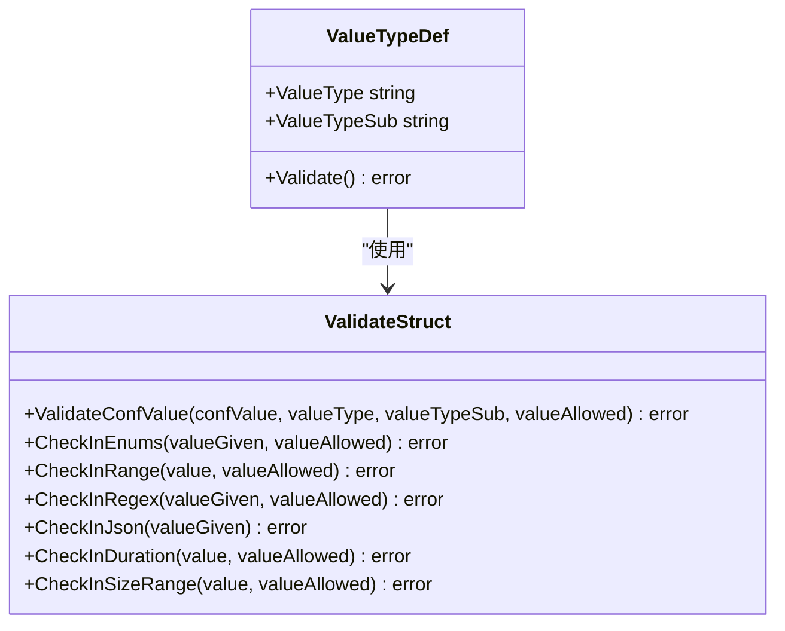
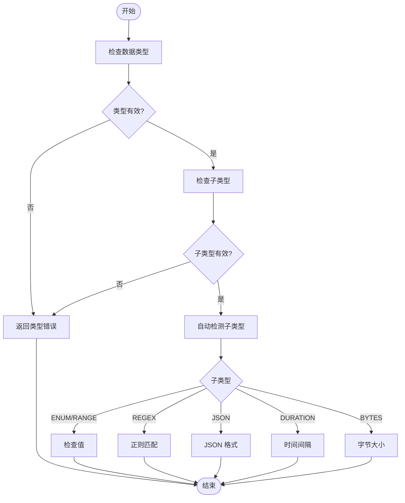
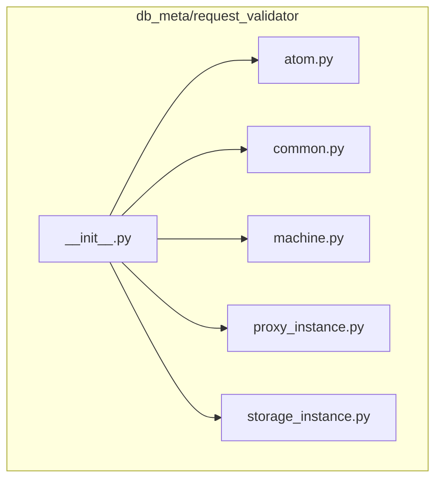
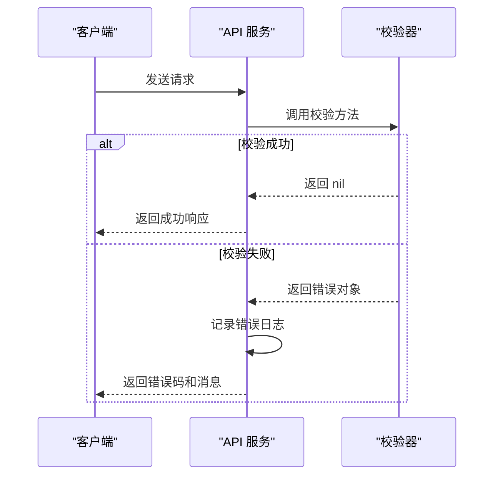

# 输入验证

<cite>
**本文档引用的文件**  
- [validatestruct/const.go](file://dbm-services/common/db-config/pkg/validatestruct/const.go)
- [validatestruct/check_value.go](file://dbm-services/common/db-config/pkg/validatestruct/check_value.go)
- [validatestruct/check_value_test.go](file://dbm-services/common/db-config/pkg/validatestruct/check_value_test.go)
- [go-pubpkg/validate/validate.go](file://dbm-services/common/go-pubpkg/validate/validate.go)
- [bk_web/viewsets.py](file://dbm-ui/backend/bk_web/viewsets.py)
- [ticket/builders/common/base.py](file://dbm-ui/backend/ticket/builders/common/base.py)
- [db_services/redis/capacity_evaluate_service/api/evaluate_api.py](file://dbm-ui/backend/db_services/redis/capacity_evaluate_service/api/evaluate_api.py)
- [flow/utils/base/validate_handler.py](file://dbm-ui/backend/flow/utils/base/validate_handler.py)
- [db_meta/request_validator/\_\_init\_\_.py](file://dbm-ui/backend/db_meta/request_validator/__init__.py)
</cite>

## 目录
1. [引言](#引言)
2. [验证规则体系](#验证规则体系)
3. [validatestruct 包的验证实现](#validatestruct-包的验证实现)
4. [API 请求参数校验逻辑](#api-请求参数校验逻辑)
5. [Go 和 Python 代码示例](#go-和-python-代码示例)
6. [安全防护措施](#安全防护措施)
7. [错误处理机制](#错误处理机制)

## 引言

输入验证是确保系统安全性和数据完整性的关键环节。本文档详细阐述了 db-config 服务中 `validatestruct` 包的验证规则，以及 `db_meta` 模块中 `request_validator` 对业务请求参数的校验逻辑。文档将涵盖正则表达式、枚举值、范围检查等核心验证规则，并提供 Go 和 Python 的代码示例，同时介绍针对 SQL 注入、XSS 等常见输入攻击的防护措施和验证失败后的错误处理机制。

## 验证规则体系

系统定义了一套完整的验证规则体系，用于对配置项和业务请求进行校验。该体系主要由数据类型（`value_type`）和子类型（`value_type_sub`）构成。

### 核心数据类型

系统支持多种核心数据类型，每种类型对应不同的基础校验逻辑。

**数据类型定义**
- **STRING**: 字符串类型
- **INT**: 整数类型
- **FLOAT**: 浮点数类型
- **NUMBER**: 通用数字类型
- **BOOL**: 布尔类型

### 验证子类型

子类型定义了具体的验证规则，如范围、枚举等。`ValueTypeSubRef` 映射表严格定义了哪些子类型可以应用于哪些核心数据类型。

**验证子类型列表**
- **ENUM**: 枚举类型，单值
- **ENUMS**: 枚举类型，多值
- **RANGE**: 范围检查，支持开闭区间 `(a,b]`
- **BYTES**: 字节大小检查，支持 `1k`, `64m`, `1G` 等单位
- **REGEX**: 正则表达式匹配
- **JSON**: JSON 格式校验
- **DURATION**: 时间间隔校验，如 `1d2h3m1s`
- **GOVALIDATE**: 使用 `go-playground/validator` 库进行高级校验



**Diagram sources**
- [validatestruct/const.go](file://dbm-services/common/db-config/pkg/validatestruct/const.go#L12-L86)
- [validatestruct/check_value.go](file://dbm-services/common/db-config/pkg/validatestruct/check_value.go#L32-L408)

## validatestruct 包的验证实现

`db-config` 服务中的 `validatestruct` 包是核心的验证逻辑实现，它提供了对配置项值的全面校验。

### 核心验证流程

`ValidateConfValue` 函数是入口，它按照以下流程进行校验：
1.  **数据类型校验**：首先检查 `confValue` 是否符合 `valueType` 定义的类型（如整数、布尔值）。
2.  **子类型校验**：检查 `valueTypeSub` 是否是 `valueType` 允许的子类型。
3.  **具体规则校验**：根据 `valueTypeSub` 和 `valueAllowed` 的值，调用相应的校验函数。



**Diagram sources**
- [validatestruct/check_value.go](file://dbm-services/common/db-config/pkg/validatestruct/check_value.go#L313-L408)

### 具体验证规则详解

#### 范围检查 (RANGE)
范围检查使用正则表达式 `^([\(\[])(.+),(.+)([\)\]])$` 来解析 `valueAllowed` 字符串，例如 `(0, 2]`。它支持开闭区间，并对 `confValue` 进行数值比较。

**Section sources**
- [validatestruct/const.go](file://dbm-services/common/db-config/pkg/validatestruct/const.go#L5-L10)
- [validatestruct/check_value.go](file://dbm-services/common/db-config/pkg/validatestruct/check_value.go#L117-L145)

#### 枚举检查 (ENUM/ENUMS)
枚举检查通过 `|` 或 `,` 分隔符解析 `valueAllowed` 字符串，形成一个允许值的列表。`confValue` 必须完全匹配列表中的一个或多个值（对于 `ENUMS`）。

**Section sources**
- [validatestruct/check_value.go](file://dbm-services/common/db-config/pkg/validatestruct/check_value.go#L88-L114)

#### 正则表达式检查 (REGEX)
此规则将 `valueAllowed` 视为一个正则表达式模式，使用 Go 的 `regexp.Compile` 编译并匹配 `confValue`。

**Section sources**
- [validatestruct/check_value.go](file://dbm-services/common/db-config/pkg/validatestruct/check_value.go#L197-L209)

#### 字节大小检查 (BYTES)
该规则能处理带单位的字符串（如 `1k`, `64m`），将其转换为字节数后，再与 `valueAllowed` 定义的范围进行比较。

**Section sources**
- [validatestruct/check_value.go](file://dbm-services/common/db-config/pkg/validatestruct/check_value.go#L148-L169)

#### 时间间隔检查 (DURATION)
支持 `1d2h3m1s` 这样的时间间隔格式，将其转换为秒数后，再与范围进行比较。

**Section sources**
- [validatestruct/check_value.go](file://dbm-services/common/db-config/pkg/validatestruct/check_value.go#L172-L195)

## API 请求参数校验逻辑

在 `db_meta` 模块中，`request_validator` 负责对业务请求参数进行校验，确保业务逻辑的正确执行。

### 校验器架构

`request_validator` 采用模块化设计，通过 `__init__.py` 导入了多个子模块（如 `atom`, `common`, `machine`），每个子模块负责特定业务领域的参数校验。



**Diagram sources**
- [db_meta/request_validator/\_\_init\_\_.py](file://dbm-ui/backend/db_meta/request_validator/__init__.py#L1-L18)

### 通用校验入口

`ParamValidateSerializerMixin` 类提供了一个通用的校验入口。它通过 `validated_params` 方法，根据单据类型（`ticket_type`）动态选择对应的校验器（`validator`）来执行校验。

**Section sources**
- [ticket/builders/common/base.py](file://dbm-ui/backend/ticket/builders/common/base.py#L211-L246)

### 业务特定校验

以 Redis 容量评估服务为例，`EvaluateAPI.validate_request` 方法实现了具体的业务校验逻辑，包括：
- 时间戳的有效性（开始时间不能晚于结束时间）
- 结束时间不能在当前时间之前
- 容量请求参数的互斥性校验

**Section sources**
- [db_services/redis/capacity_evaluate_service/api/evaluate_api.py](file://dbm-ui/backend/db_services/redis/capacity_evaluate_service/api/evaluate_api.py#L33-L54)

## Go 和 Python 代码示例

### Go 代码示例

以下示例展示了如何使用 `validatestruct` 包进行配置项校验。

```go
// 定义配置项
confValue := "1.5"
valueType := "FLOAT"
valueTypeSub := "RANGE"
valueAllowed := "(0.0, 2.0]"

// 执行校验
err := validatestruct.ValidateConfValue(confValue, valueType, valueTypeSub, valueAllowed)
if err != nil {
    log.Printf("Validation failed: %v", err)
    // 处理错误
}
```

**Section sources**
- [validatestruct/check_value.go](file://dbm-services/common/db-config/pkg/validatestruct/check_value.go#L313-L408)

### Python 代码示例

以下示例展示了如何在 Python 中实现自定义数据类校验。

```python
from dataclasses import dataclass
from flow.utils.base.validate_handler import ValidateHandler, validate_list

def validate_positive_int(value):
    if not isinstance(value, int) or value <= 0:
        raise ValueError(f"{value} must be a positive integer")

@dataclass
class RequestParams(ValidateHandler):
    user_ids: list = None # type: ignore
    timeout: int = 30
    
    def __post_init__(self):
        # 使用 metadata 指定校验函数
        self.user_ids = validate_list(self.user_ids) if self.user_ids else []
        validate_positive_int(self.timeout)
```

**Section sources**
- [flow/utils/base/validate_handler.py](file://dbm-ui/backend/flow/utils/base/validate_handler.py#L1-L34)

## 安全防护措施

系统通过多层次的输入验证来防范常见的安全攻击。

### SQL 注入防护

- **参数化查询**：所有数据库操作均使用参数化查询或预编译语句，从根本上防止 SQL 注入。
- **输入过滤**：在应用层，对用户输入进行严格的白名单过滤，例如 `hasCommentInQuery` 函数会检测 SQL 语句中是否包含注释，这可能是注入攻击的迹象。

**Section sources**
- [mysql-monitor/pkg/itemscollect/mysqlprocesslist/mysql_inject.go](file://dbm-services/mysql/db-tools/mysql-monitor/pkg/itemscollect/mysqlprocesslist/mysql_inject.go#L72-L84)

### XSS 防护

- **输出编码**：在将用户输入渲染到前端页面时，对特殊字符（如 `<`, `>`, `&`）进行 HTML 编码。
- **内容安全策略 (CSP)**：通过 HTTP 头设置严格的 CSP 策略，限制脚本的执行来源。

### 敏感数据脱敏

在日志记录中，`maskSensitiveData` 函数会自动检测并脱敏敏感字段（如 password, token），防止敏感信息泄露。

**Section sources**
- [db-resource/internal/controller/manage/rs_resource_param.go](file://dbm-services/common/db-resource/internal/controller/manage/rs_resource_param.go#L89-L126)

## 错误处理机制

系统采用统一的错误处理机制，确保验证失败时能提供清晰的反馈。

### 错误类型

- **ValidationError**：通用的验证错误，包含详细的错误信息。
- **TicketParamsVerifyException**：特定于单据参数验证的异常。
- **GError**：自定义错误类型，包含错误码和消息，便于追踪和分类。

### 错误处理流程

当验证失败时，系统会：
1.  记录详细的错误日志。
2.  抛出带有明确错误信息的异常。
3.  在 API 响应中返回标准的错误码和消息，供前端展示。



**Diagram sources**
- [go-pubpkg/validate/validate.go](file://dbm-services/common/go-pubpkg/validate/validate.go#L45-L102)
- [gerrors/errors.go](file://dbm-services/common/dbha-v2/pkg/gerrors/errors.go#L110-L177)