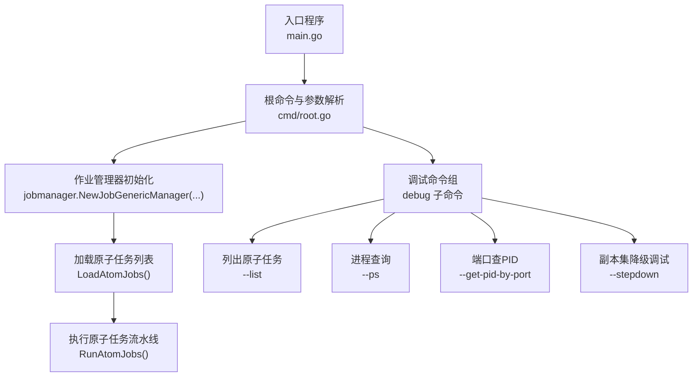
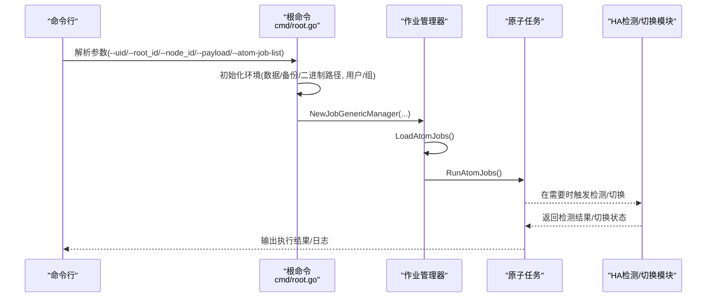
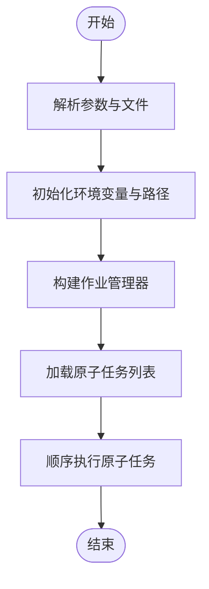
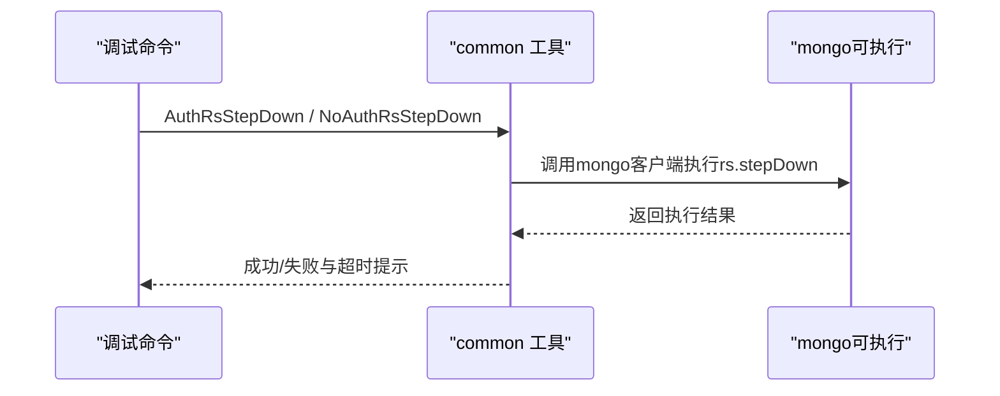
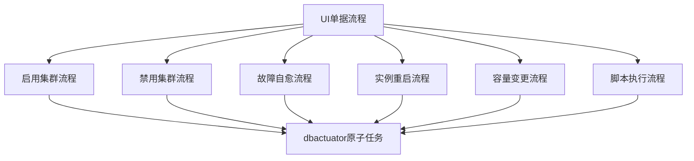
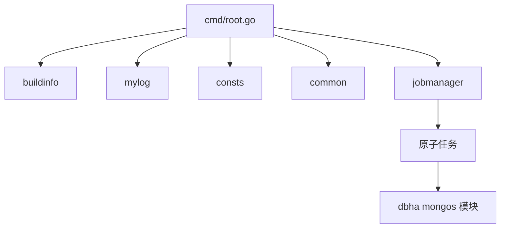

# MongoDB数据库工具

<cite>
**本文引用的文件**
- [main.go](file://dbm-services/mongodb/db-tools/dbactuator/main.go)
- [root.go](file://dbm-services/mongodb/db-tools/dbactuator/cmd/root.go)
- [README.md](file://dbm-services/mongodb/db-tools/dbactuator/README.md)
- [mongos_detect.go](file://dbm-services/common/dbha/ha-module/dbmodule/mongodb/mongos_detect.go)
- [mongos_switch.go](file://dbm-services/common/dbha/ha-module/dbmodule/mongodb/mongos_switch.go)
- [mongos_callback.go](file://dbm-services/common/dbha/ha-module/dbmodule/mongodb/mongos_callback.go)
- [mongo_enable.py](file://dbm-ui/backend/ticket/builders/mongodb/mongo_enable.py)
- [mongo_disable.py](file://dbm-ui/backend/ticket/builders/mongodb/mongo_disable.py)
- [mongo_autofix.py](file://dbm-ui/backend/ticket/builders/mongodb/mongo_autofix.py)
- [mongo_instance_reload.py](file://dbm-ui/backend/ticket/builders/mongodb/mongo_instance_reload.py)
- [mongo_scale_updown.py](file://dbm-ui/backend/ticket/builders/mongodb/mongo_scale_updown.py)
- [mongo_script_exec.py](file://dbm-ui/backend/ticket/builders/mongodb/mongo_script_exec.py)
</cite>

## 目录
1. [简介](#简介)
2. [项目结构](#项目结构)
3. [核心组件](#核心组件)
4. [架构总览](#架构总览)
5. [详细组件分析](#详细组件分析)
6. [依赖分析](#依赖分析)
7. [性能考虑](#性能考虑)
8. [故障排查指南](#故障排查指南)
9. [结论](#结论)
10. [附录](#附录)

## 简介
本文件面向MongoDB数据库运维与自动化场景，系统化梳理“MongoDB dbactuator”工具的功能边界与实现要点，涵盖副本集初始化、分片集群管理、实例安装部署、数据迁移与备份恢复、作业调度与运行时环境、原子操作管理、以及在真实集群中的部署、故障处理与性能优化实践。文档以仓库现有源码为依据，结合UI侧单据流程与HA模块能力，给出可操作的命令使用范式、配置参数说明与流程图示。

## 项目结构
MongoDB dbactuator位于dbm-services/mongodb/db-tools/dbactuator，采用Go语言实现，入口程序通过Cobra框架组织命令行子命令与调试命令。其核心职责是承载“原子任务”的编排与执行，配合作业管理器完成多任务流水线的加载与运行。

图表来源
- [main.go:10-12](file://dbm-services/mongodb/db-tools/dbactuator/main.go#L10-L12)
- [root.go:88-126](file://dbm-services/mongodb/db-tools/dbactuator/cmd/root.go#L88-L126)
- [root.go:128-214](file://dbm-services/mongodb/db-tools/dbactuator/cmd/root.go#L128-L214)

章节来源
- [main.go:1-13](file://dbm-services/mongodb/db-tools/dbactuator/main.go#L1-L13)
- [root.go:88-126](file://dbm-services/mongodb/db-tools/dbactuator/cmd/root.go#L88-L126)
- [README.md:1-36](file://dbm-services/mongodb/db-tools/dbactuator/README.md#L1-L36)

## 核心组件
- 命令行入口与根命令：负责参数解析、环境初始化、作业管理器装配与任务执行。
- 作业管理器：根据传入的原子任务列表动态加载并顺序执行，支持打印参数、列出任务等调试能力。
- 调试子命令：提供任务清单、进程扫描、端口到进程映射、副本集降级等辅助诊断能力。
- 环境变量与路径：支持通过参数或环境变量设置二进制、数据与备份目录，以及运行用户与组。
- UI单据集成：dbactuator作为后端原子操作载体，被UI侧各类MongoDB单据流程调用，如启用/禁用、故障自愈、实例重启、容量变更、脚本执行等。

章节来源
- [root.go:28-85](file://dbm-services/mongodb/db-tools/dbactuator/cmd/root.go#L28-L85)
- [root.go:128-214](file://dbm-services/mongodb/db-tools/dbactuator/cmd/root.go#L128-L214)
- [README.md:13-31](file://dbm-services/mongodb/db-tools/dbactuator/README.md#L13-L31)

## 架构总览
下图展示从命令行到原子任务执行的整体链路，以及与HA检测与切换模块的协作关系：

图表来源
- [root.go:94-125](file://dbm-services/mongodb/db-tools/dbactuator/cmd/root.go#L94-L125)
- [root.go:128-214](file://dbm-services/mongodb/db-tools/dbactuator/cmd/root.go#L128-L214)
- [mongos_detect.go](file://dbm-services/common/dbha/ha-module/dbmodule/mongodb/mongos_detect.go)
- [mongos_switch.go](file://dbm-services/common/dbha/ha-module/dbmodule/mongodb/mongos_switch.go)

## 详细组件分析

### 命令行与参数体系
- 关键参数
  - --uid/-U：单据ID
  - --root_id/-R：流程ID
  - --node_id/-N：节点ID
  - --version_id/-V：运行版本ID
  - --data_dir/-D：数据目录
  - --backup_dir/-B：备份目录
  - --bin_dir：Mongo二进制根路径，默认/usr/local
  - --payload/-p：原子任务参数（Base64包裹）
  - --payload_file/-f：参数文件（JSON/YAML）
  - --payload-format/-m：参数格式（base64/raw）
  - --atom-job-list/-A：多个原子任务名以逗号分隔
  - --user/-u：运行OS用户
  - --group/-g：运行OS用户属主
- 调试参数
  - --list/-L：列出可用原子任务
  - --ps/-S：列出进程
  - --get-pid-by-port：按TCP监听端口查询进程
  - --stepdown：对指定端口发起副本集降级调试
  - --stepdown-ip/--stepdown-user/--stepdown-pass：降级调试所需连接参数

章节来源
- [root.go:224-254](file://dbm-services/mongodb/db-tools/dbactuator/cmd/root.go#L224-L254)
- [README.md:13-31](file://dbm-services/mongodb/db-tools/dbactuator/README.md#L13-L31)

### 作业调度与运行时
- 作业管理器装配：根据UID、RootID、NodeID、VersionID与参数构造通用作业管理器。
- 任务加载：按逗号分隔的任务列表动态注册与加载。
- 任务执行：顺序执行已加载的原子任务，错误时退出并输出版本信息。
- 调试模式：支持打印某原子任务的参数JSON、列出任务、进程扫描、端口查PID、副本集降级等。

图表来源
- [root.go:94-125](file://dbm-services/mongodb/db-tools/dbactuator/cmd/root.go#L94-L125)

章节来源
- [root.go:94-125](file://dbm-services/mongodb/db-tools/dbactuator/cmd/root.go#L94-L125)
- [root.go:128-214](file://dbm-services/mongodb/db-tools/dbactuator/cmd/root.go#L128-L214)

### 副本集与分片集群管理
- 副本集降级调试：支持带认证与不带认证两种模式，通过指定IP、端口、用户名与密码进行降级操作，并返回是否成功切换或仍为主节点。
- 分片集群管理：dbactuator通过原子任务承载副本集初始化、添加分片、平衡器开关等操作，具体任务名称由--atom-job-list传入。

图表来源
- [root.go:166-206](file://dbm-services/mongodb/db-tools/dbactuator/cmd/root.go#L166-L206)

章节来源
- [root.go:166-206](file://dbm-services/mongodb/db-tools/dbactuator/cmd/root.go#L166-L206)

### 实例安装部署与数据迁移/备份恢复
- 安装部署：通过原子任务实现MongoDB实例的安装、替换包、进程重启等。
- 数据迁移/备份恢复：dbactuator通过原子任务承载数据导出、导入、备份下载等能力，参数通过--payload或--payload_file传入。

章节来源
- [README.md:29-31](file://dbm-services/mongodb/db-tools/dbactuator/README.md#L29-L31)

### UI单据与原子操作联动
dbactuator作为后端原子操作执行器，被UI侧多种MongoDB单据流程调用，典型场景如下：
- 启用/禁用集群：在线/离线阶段的启停控制。
- 故障自愈：自动修复类流程，减少人工干预。
- 实例重启：针对单实例的重启需求。
- 容量变更：扩缩容执行流程。
- 脚本执行：批量执行运维脚本。

图表来源
- [mongo_enable.py:27-41](file://dbm-ui/backend/ticket/builders/mongodb/mongo_enable.py#L27-L41)
- [mongo_disable.py:27-41](file://dbm-ui/backend/ticket/builders/mongodb/mongo_disable.py#L27-L41)
- [mongo_autofix.py:64-70](file://dbm-ui/backend/ticket/builders/mongodb/mongo_autofix.py#L64-L70)
- [mongo_instance_reload.py:62-66](file://dbm-ui/backend/ticket/builders/mongodb/mongo_instance_reload.py#L62-L66)
- [mongo_scale_updown.py:102-107](file://dbm-ui/backend/ticket/builders/mongodb/mongo_scale_updown.py#L102-L107)
- [mongo_script_exec.py:54-57](file://dbm-ui/backend/ticket/builders/mongodb/mongo_script_exec.py#L54-L57)

章节来源
- [mongo_enable.py:27-41](file://dbm-ui/backend/ticket/builders/mongodb/mongo_enable.py#L27-L41)
- [mongo_disable.py:27-41](file://dbm-ui/backend/ticket/builders/mongodb/mongo_disable.py#L27-L41)
- [mongo_autofix.py:64-70](file://dbm-ui/backend/ticket/builders/mongodb/mongo_autofix.py#L64-L70)
- [mongo_instance_reload.py:62-66](file://dbm-ui/backend/ticket/builders/mongodb/mongo_instance_reload.py#L62-L66)
- [mongo_scale_updown.py:102-107](file://dbm-ui/backend/ticket/builders/mongodb/mongo_scale_updown.py#L102-L107)
- [mongo_script_exec.py:54-57](file://dbm-ui/backend/ticket/builders/mongodb/mongo_script_exec.py#L54-L57)

## 依赖分析
- 命令行框架：Cobra，提供根命令、子命令与调试命令的组织。
- 版本信息：buildinfo，用于打印版本信息。
- 日志：mylog，统一日志入口。
- 常量与环境：consts，封装数据/备份/二进制路径与进程用户/组设置。
- 通用工具：common，提供进程查询、副本集降级等通用能力。
- 作业管理：jobmanager，负责原子任务的加载与执行。
- HA模块：dbha的mongos检测与切换模块，与dbactuator在运维动作上协同。

图表来源
- [root.go:8-26](file://dbm-services/mongodb/db-tools/dbactuator/cmd/root.go#L8-L26)
- [mongos_detect.go](file://dbm-services/common/dbha/ha-module/dbmodule/mongodb/mongos_detect.go)
- [mongos_switch.go](file://dbm-services/common/dbha/ha-module/dbmodule/mongodb/mongos_switch.go)

章节来源
- [root.go:8-26](file://dbm-services/mongodb/db-tools/dbactuator/cmd/root.go#L8-L26)

## 性能考虑
- 任务串行执行：当前实现按顺序执行原子任务，适合保证一致性但可能影响吞吐。对于可并行任务，建议在业务层拆分任务列表并分批提交。
- 路径与权限：合理设置--bin_dir、--data_dir、--backup_dir与--user/--group，避免跨盘IO与权限问题导致的额外开销。
- 调试命令：在生产环境谨慎使用--stepdown等高风险调试命令，建议仅在维护窗口内执行。
- 日志与版本：通过mylog与buildinfo输出有助于快速定位问题，建议保留足够的日志轮转空间。

## 故障排查指南
- 端口查进程：使用--get-pid-by-port检查目标端口监听进程，确认进程是否存在且为MongoDB。
- 进程扫描：使用--ps查看系统进程，核对MongoDB进程状态。
- 列出任务：使用--list查看可用原子任务，确保任务名称正确。
- 副本集降级：使用--stepdown进行降级调试，若出现“获取主节点信息超时”，需检查网络连通性与认证配置。
- 参数打印：使用--param打印指定原子任务的参数JSON，便于核对输入参数。

章节来源
- [root.go:133-206](file://dbm-services/mongodb/db-tools/dbactuator/cmd/root.go#L133-L206)

## 结论
MongoDB dbactuator以“原子任务”为核心，通过Cobra命令行框架与作业管理器实现可组合、可扩展的运维能力。结合UI单据与HA模块，能够覆盖副本集初始化、分片集群管理、实例部署、数据迁移与备份恢复等关键场景。建议在生产环境中严格控制调试命令的使用范围与时机，并通过合理的参数与路径配置保障性能与稳定性。

## 附录

### 常用命令示例（基于README与参数定义）
- 基本执行
  - mongo-dbactuator --uid=1111 --root_id=2222 --node_id=3333 --version_id=v1 --payload='' --atom-job-list="mongod_install"
- 调试模式
  - 列出任务：mongo-dbactuator debug --list
  - 打印参数：mongo-dbactuator debug --param=mongod_install
  - 进程扫描：mongo-dbactuator debug --ps
  - 端口查PID：mongo-dbactuator debug --get-pid-by-port=27017
  - 副本集降级：mongo-dbactuator debug --stepdown=27017 --stepdown-ip=127.0.0.1 --stepdown-user=admin --stepdown-pass=pass

章节来源
- [README.md:29-31](file://dbm-services/mongodb/db-tools/dbactuator/README.md#L29-L31)
- [root.go:242-254](file://dbm-services/mongodb/db-tools/dbactuator/cmd/root.go#L242-L254)