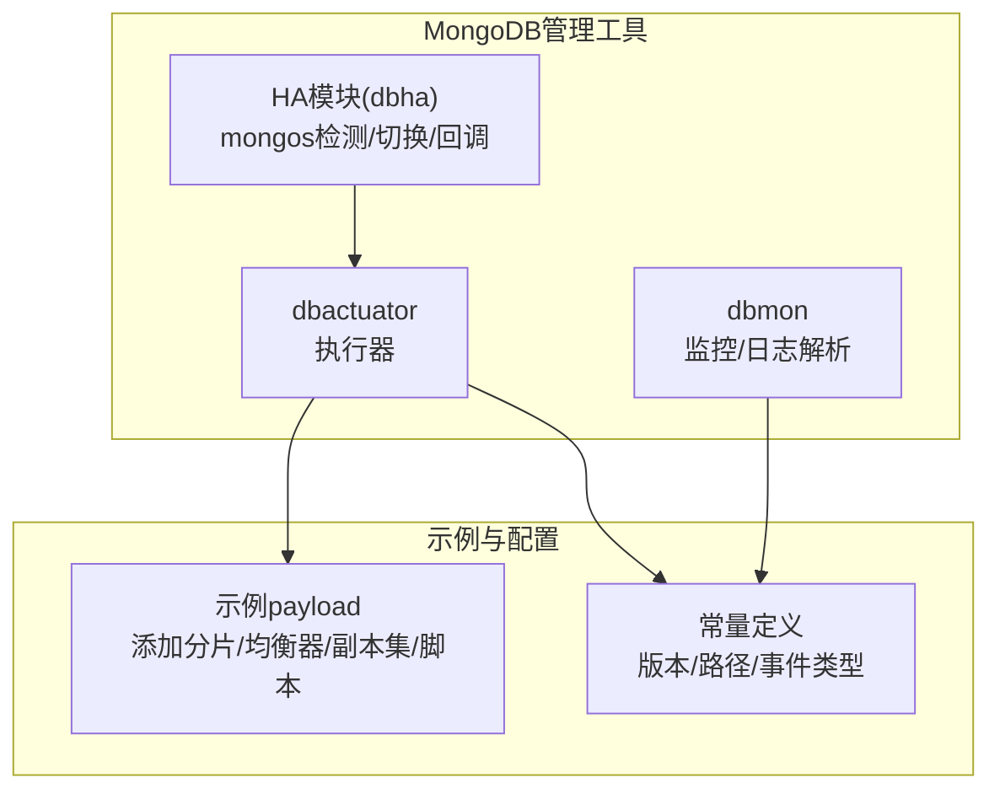
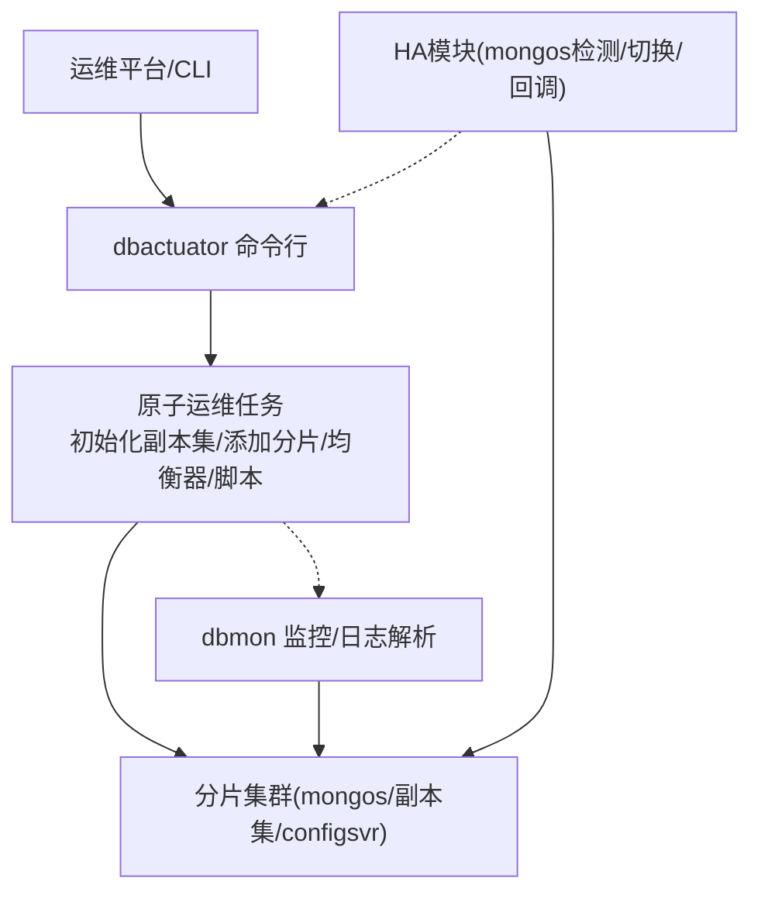
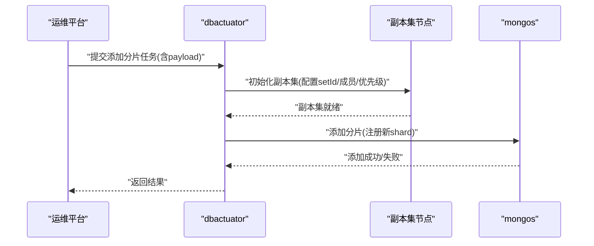
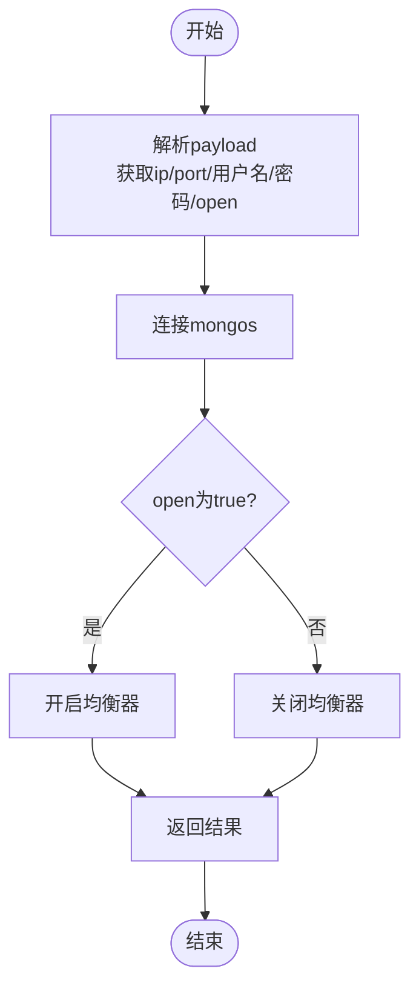
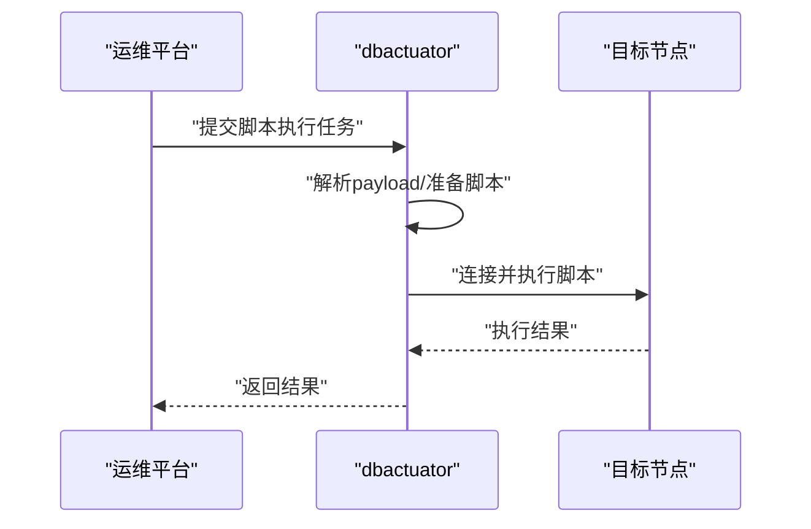
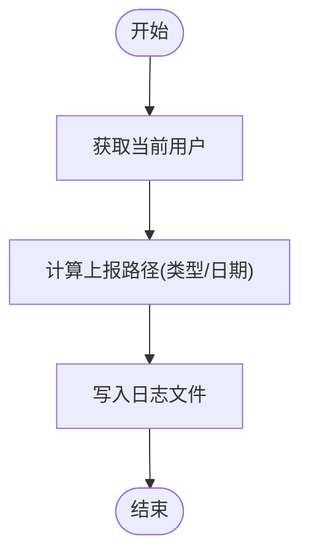
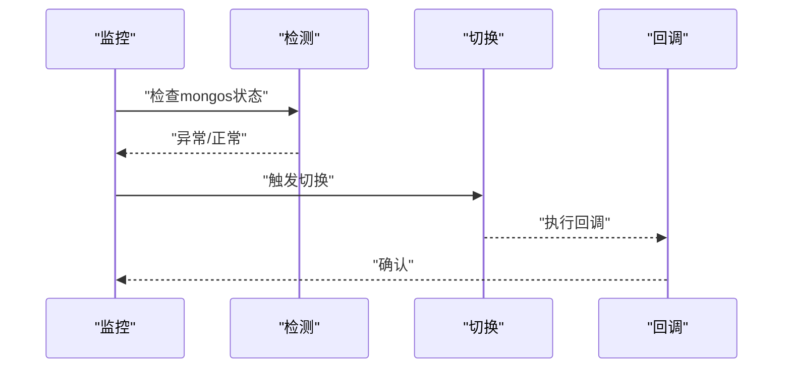
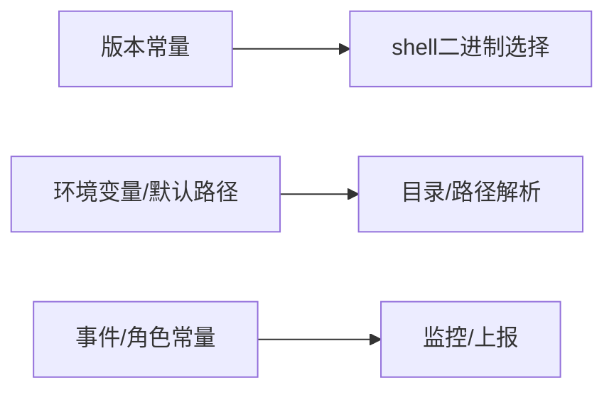

# 分片集群管理

<cite>
**本文引用的文件**
- [dbactuator/main.go](file://dbm-services/mongodb/db-tools/dbactuator/main.go)
- [dbmon/main.go](file://dbm-services/mongodb/db-tools/dbmon/main.go)
- [dbactuator/pkg/consts/mongo.go](file://dbm-services/mongodb/db-tools/dbactuator/pkg/consts/mongo.go)
- [dbmon/pkg/consts/mongo.go](file://dbm-services/mongodb/db-tools/dbmon/pkg/consts/mongo.go)
- [dbactuator/example/add_shard_to_cluster.example.md](file://dbm-services/mongodb/db-tools/dbactuator/example/add_shard_to_cluster.example.md)
- [dbactuator/example/cluster_balancer.example.md](file://dbm-services/mongodb/db-tools/dbactuator/example/cluster_balancer.example.md)
- [dbactuator/example/initiate_replicaset.example.md](file://dbm-services/mongodb/db-tools/dbactuator/example/initiate_replicaset.example.md)
- [dbactuator/example/mongo_execute_script.example.md](file://dbm-services/mongodb/db-tools/dbactuator/example/mongo_execute_script.example.md)
- [dbha/dbmodule/mongodb/mongos_callback.go](file://dbm-services/common/dbha/ha-module/dbmodule/mongodb/mongos_callback.go)
- [dbha/dbmodule/mongodb/mongos_detect.go](file://dbm-services/common/dbha/ha-module/dbmodule/mongodb/mongos_detect.go)
- [dbha/dbmodule/mongodb/mongos_switch.go](file://dbm-services/common/dbha/ha-module/dbmodule/mongodb/mongos_switch.go)
</cite>

## 目录
1. [简介](#简介)
2. [项目结构](#项目结构)
3. [核心组件](#核心组件)
4. [架构总览](#架构总览)
5. [详细组件分析](#详细组件分析)
6. [依赖分析](#依赖分析)
7. [性能考虑](#性能考虑)
8. [故障排查指南](#故障排查指南)
9. [结论](#结论)
10. [附录](#附录)

## 简介
本文件面向MongoDB分片集群的运维与管理，系统性阐述分片集群的部署、配置与维护流程，覆盖分片添加、移除、路由配置、数据分布策略、chunk迁移机制、扩容/缩容与负载均衡、分片键选择原则、数据分布算法、性能调优、监控、故障诊断与恢复等主题。文档基于仓库中的dbactuator与dbmon工具以及HA模块，结合示例payload与常量定义，给出可落地的操作步骤与最佳实践。

## 项目结构
该MongoDB管理能力由以下子模块构成：
- dbactuator：面向原子化运维任务的执行器，负责分片集群初始化、副本集搭建、添加分片、开启/关闭均衡器、执行脚本等。
- dbmon：面向监控与日志解析的守护进程，支撑备份、巡检与事件上报。
- HA模块（dbha）：提供mongos检测、切换与回调能力，保障路由层高可用。
- 示例与常量：提供典型场景的payload示例与工具链版本/路径常量。

**图表来源**
- [dbactuator/main.go:10-12](file://dbm-services/mongodb/db-tools/dbactuator/main.go#L10-L12)
- [dbmon/main.go:23-25](file://dbm-services/mongodb/db-tools/dbmon/main.go#L23-L25)
- [dbha/dbmodule/mongodb/mongos_detect.go](file://dbm-services/common/dbha/ha-module/dbmodule/mongodb/mongos_detect.go)
- [dbha/dbmodule/mongodb/mongos_switch.go](file://dbm-services/common/dbha/ha-module/dbmodule/mongodb/mongos_switch.go)
- [dbha/dbmodule/mongodb/mongos_callback.go](file://dbm-services/common/dbha/ha-module/dbmodule/mongodb/mongos_callback.go)

**章节来源**
- [dbactuator/main.go:10-12](file://dbm-services/mongodb/db-tools/dbactuator/main.go#L10-L12)
- [dbmon/main.go:23-25](file://dbm-services/mongodb/db-tools/dbmon/main.go#L23-L25)

## 核心组件
- 执行器入口
  - dbactuator入口函数负责启动命令行子系统，承载各类原子运维任务。
- 监控入口
  - dbmon入口函数负责初始化运行参数并启动监控服务。
- 版本与工具路径常量
  - 定义MongoDB版本常量与shell二进制选择逻辑，确保工具链适配不同版本。
- 目录与路径常量
  - 定义dbtools目录、备份目录、数据目录查找规则与二进制查找辅助函数，保证工具链与环境变量兼容。
- 事件与角色常量
  - 定义监控事件类别与元角色标识，便于事件分类与上报。

**章节来源**
- [dbactuator/main.go:10-12](file://dbm-services/mongodb/db-tools/dbactuator/main.go#L10-L12)
- [dbmon/main.go:13-21](file://dbm-services/mongodb/db-tools/dbmon/main.go#L13-L21)
- [dbactuator/pkg/consts/mongo.go:10-48](file://dbm-services/mongodb/db-tools/dbactuator/pkg/consts/mongo.go#L10-L48)
- [dbmon/pkg/consts/mongo.go:14-130](file://dbm-services/mongodb/db-tools/dbmon/pkg/consts/mongo.go#L14-L130)

## 架构总览
下图展示分片集群管理的关键交互：执行器通过命令行接收payload，调用内部逻辑完成副本集初始化、添加分片、开启/关闭均衡器、执行脚本等；监控模块负责备份与日志解析；HA模块保障mongos路由层的健康与切换。

**图表来源**
- [dbactuator/main.go:10-12](file://dbm-services/mongodb/db-tools/dbactuator/main.go#L10-L12)
- [dbmon/main.go:23-25](file://dbm-services/mongodb/db-tools/dbmon/main.go#L23-L25)
- [dbha/dbmodule/mongodb/mongos_detect.go](file://dbm-services/common/dbha/ha-module/dbmodule/mongodb/mongos_detect.go)
- [dbha/dbmodule/mongodb/mongos_switch.go](file://dbm-services/common/dbha/ha-module/dbmodule/mongodb/mongos_switch.go)
- [dbha/dbmodule/mongodb/mongos_callback.go](file://dbm-services/common/dbha/ha-module/dbmodule/mongodb/mongos_callback.go)

## 详细组件分析

### 组件A：分片添加与集群初始化
- 功能要点
  - 初始化副本集：配置副本集ID、成员列表、优先级与隐藏节点。
  - 添加分片到集群：向mongos注册新的shard节点。
  - 执行脚本：在主/从节点执行JS脚本，支持从制品库拉取脚本。
- 关键输入
  - IP/端口、管理员账号密码、副本集配置、分片映射、脚本仓库信息等。
- 处理流程
  - 解析payload → 连接目标实例 → 应用副本集配置 → 注册分片 → 可选：执行脚本。

**图表来源**
- [dbactuator/example/initiate_replicaset.example.md:10-31](file://dbm-services/mongodb/db-tools/dbactuator/example/initiate_replicaset.example.md#L10-L31)
- [dbactuator/example/add_shard_to_cluster.example.md:11-23](file://dbm-services/mongodb/db-tools/dbactuator/example/add_shard_to_cluster.example.md#L11-L23)

**章节来源**
- [dbactuator/example/initiate_replicaset.example.md:1-32](file://dbm-services/mongodb/db-tools/dbactuator/example/initiate_replicaset.example.md#L1-L32)
- [dbactuator/example/add_shard_to_cluster.example.md:1-24](file://dbm-services/mongodb/db-tools/dbactuator/example/add_shard_to_cluster.example.md#L1-L24)

### 组件B：均衡器控制与负载均衡
- 功能要点
  - 开启/关闭集群均衡器，控制chunk迁移节奏。
- 关键输入
  - 目标mongos地址、管理员凭据、open标志(true/false)。
- 处理流程
  - 连接mongos → 切换均衡器状态 → 返回结果。

**图表来源**
- [dbactuator/example/cluster_balancer.example.md:11-20](file://dbm-services/mongodb/db-tools/dbactuator/example/cluster_balancer.example.md#L11-L20)

**章节来源**
- [dbactuator/example/cluster_balancer.example.md:1-21](file://dbm-services/mongodb/db-tools/dbactuator/example/cluster_balancer.example.md#L1-L21)

### 组件C：脚本执行与扩展能力
- 功能要点
  - 在指定节点执行JS脚本，支持从制品库拉取脚本资源。
- 关键输入
  - 目标实例、脚本内容或脚本名、是否在从节点执行、仓库URL与鉴权信息。
- 处理流程
  - 解析payload → 拉取脚本(如需) → 选择主/从节点 → 执行脚本 → 上报结果。

**图表来源**
- [dbactuator/example/mongo_execute_script.example.md:12-37](file://dbm-services/mongodb/db-tools/dbactuator/example/mongo_execute_script.example.md#L12-L37)

**章节来源**
- [dbactuator/example/mongo_execute_script.example.md:1-37](file://dbm-services/mongodb/db-tools/dbactuator/example/mongo_execute_script.example.md#L1-L37)

### 组件D：监控与事件上报
- 功能要点
  - 监控备份状态、解析日志、生成上报文件路径，支持事件分类。
- 关键输入
  - 用户名、报告类型、日期等。
- 处理流程
  - 计算上报路径 → 写入日志 → 上报结果。

**图表来源**
- [dbmon/pkg/consts/mongo.go:64-75](file://dbm-services/mongodb/db-tools/dbmon/pkg/consts/mongo.go#L64-L75)

**章节来源**
- [dbmon/pkg/consts/mongo.go:64-75](file://dbm-services/mongodb/db-tools/dbmon/pkg/consts/mongo.go#L64-L75)

### 组件E：路由层高可用(HA)
- 功能要点
  - 检测mongos健康状态、触发切换、执行回调。
- 关键输入
  - 集群拓扑、检测阈值、切换策略。
- 处理流程
  - 定期检测 → 异常告警 → 触发切换 → 回调通知。

**图表来源**
- [dbha/dbmodule/mongodb/mongos_detect.go](file://dbm-services/common/dbha/ha-module/dbmodule/mongodb/mongos_detect.go)
- [dbha/dbmodule/mongodb/mongos_switch.go](file://dbm-services/common/dbha/ha-module/dbmodule/mongodb/mongos_switch.go)
- [dbha/dbmodule/mongodb/mongos_callback.go](file://dbm-services/common/dbha/ha-module/dbmodule/mongodb/mongos_callback.go)

**章节来源**
- [dbha/dbmodule/mongodb/mongos_detect.go](file://dbm-services/common/dbha/ha-module/dbmodule/mongodb/mongos_detect.go)
- [dbha/dbmodule/mongodb/mongos_switch.go](file://dbm-services/common/dbha/ha-module/dbmodule/mongodb/mongos_switch.go)
- [dbha/dbmodule/mongodb/mongos_callback.go](file://dbm-services/common/dbha/ha-module/dbmodule/mongodb/mongos_callback.go)

## 依赖分析
- 工具链与版本适配
  - shell二进制选择依据MongoDB主版本，确保mongosh或mongo的正确使用。
- 目录与路径解析
  - dbtools目录、备份目录、数据目录的查找遵循环境变量与默认路径策略，提升跨环境兼容性。
- 事件与角色
  - 事件类别与元角色用于监控与上报，便于统一处理与溯源。

**图表来源**
- [dbactuator/pkg/consts/mongo.go:10-48](file://dbm-services/mongodb/db-tools/dbactuator/pkg/consts/mongo.go#L10-L48)
- [dbmon/pkg/consts/mongo.go:77-130](file://dbm-services/mongodb/db-tools/dbmon/pkg/consts/mongo.go#L77-L130)

**章节来源**
- [dbactuator/pkg/consts/mongo.go:10-48](file://dbm-services/mongodb/db-tools/dbactuator/pkg/consts/mongo.go#L10-L48)
- [dbmon/pkg/consts/mongo.go:77-130](file://dbm-services/mongodb/db-tools/dbmon/pkg/consts/mongo.go#L77-L130)

## 性能考虑
- 均衡器开关
  - 在大规模数据导入或迁移期间建议关闭均衡器，避免chunk迁移造成额外IO与网络压力；完成后及时开启以恢复自动均衡。
- chunk迁移策略
  - 结合业务高峰/低谷时段进行迁移，减少对在线查询的影响；必要时限制迁移速率或分批迁移。
- 监控与日志
  - 使用dbmon定期上报备份与日志解析结果，结合HA模块的检测与切换，降低单点风险。
- 工具链版本
  - 根据MongoDB版本选择合适的shell二进制，避免因工具链不匹配导致的性能退化或失败。

## 故障排查指南
- 常见问题定位
  - 连接失败：核对IP/端口、认证信息与网络连通性。
  - 副本集初始化失败：检查setId、成员列表与优先级配置是否冲突。
  - 添加分片失败：确认mongos已启用分片、新节点配置正确且未被占用。
  - 均衡器无法控制：检查管理员权限与当前状态。
  - 脚本执行失败：确认脚本内容/仓库信息正确，节点可达。
- HA联动
  - 若检测到mongos异常，优先触发切换并执行回调，确保路由层快速恢复。
- 日志与上报
  - 通过dbmon生成的上报路径定位当日日志，结合事件类别进行归因分析。

**章节来源**
- [dbactuator/example/initiate_replicaset.example.md:10-31](file://dbm-services/mongodb/db-tools/dbactuator/example/initiate_replicaset.example.md#L10-L31)
- [dbactuator/example/add_shard_to_cluster.example.md:11-23](file://dbm-services/mongodb/db-tools/dbactuator/example/add_shard_to_cluster.example.md#L11-L23)
- [dbactuator/example/cluster_balancer.example.md:11-20](file://dbm-services/mongodb/db-tools/dbactuator/example/cluster_balancer.example.md#L11-L20)
- [dbactuator/example/mongo_execute_script.example.md:12-37](file://dbm-services/mongodb/db-tools/dbactuator/example/mongo_execute_script.example.md#L12-L37)
- [dbmon/pkg/consts/mongo.go:64-75](file://dbm-services/mongodb/db-tools/dbmon/pkg/consts/mongo.go#L64-L75)
- [dbha/dbmodule/mongodb/mongos_detect.go](file://dbm-services/common/dbha/ha-module/dbmodule/mongodb/mongos_detect.go)
- [dbha/dbmodule/mongodb/mongos_switch.go](file://dbm-services/common/dbha/ha-module/dbmodule/mongodb/mongos_switch.go)
- [dbha/dbmodule/mongodb/mongos_callback.go](file://dbm-services/common/dbha/ha-module/dbmodule/mongodb/mongos_callback.go)

## 结论
本方案通过dbactuator与dbmon工具配合HA模块，提供了从副本集初始化、分片添加、均衡器控制到脚本执行与监控上报的完整能力闭环。结合合理的分片键设计、chunk迁移策略与均衡器开关时机，可在保证业务连续性的前提下实现平滑扩容与负载均衡。建议在生产环境中严格遵循示例payload的字段规范，并结合HA与监控体系进行持续观测与优化。

## 附录
- 示例payload参考
  - 添加分片到集群：[示例:11-23](file://dbm-services/mongodb/db-tools/dbactuator/example/add_shard_to_cluster.example.md#L11-L23)
  - 集群均衡器控制：[示例:11-20](file://dbm-services/mongodb/db-tools/dbactuator/example/cluster_balancer.example.md#L11-L20)
  - 副本集初始化：[示例:10-31](file://dbm-services/mongodb/db-tools/dbactuator/example/initiate_replicaset.example.md#L10-L31)
  - 执行脚本：[示例:12-37](file://dbm-services/mongodb/db-tools/dbactuator/example/mongo_execute_script.example.md#L12-L37)
- 常量定义参考
  - 版本与工具路径：[常量:10-48](file://dbm-services/mongodb/db-tools/dbactuator/pkg/consts/mongo.go#L10-L48)
  - 目录与路径：[常量:77-130](file://dbm-services/mongodb/db-tools/dbmon/pkg/consts/mongo.go#L77-L130)
  - 事件与角色：[常量:14-75](file://dbm-services/mongodb/db-tools/dbmon/pkg/consts/mongo.go#L14-L75)