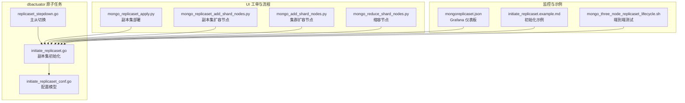
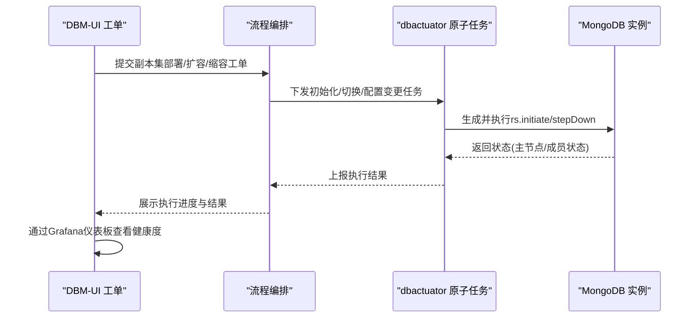
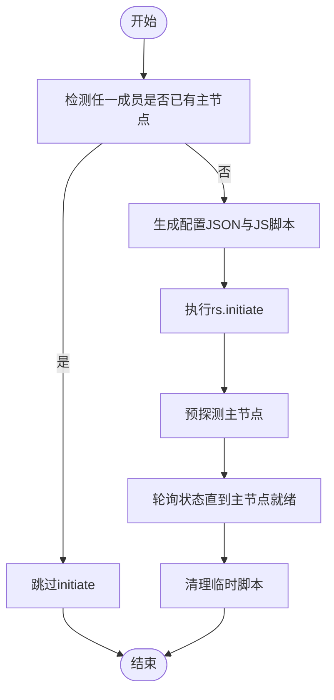
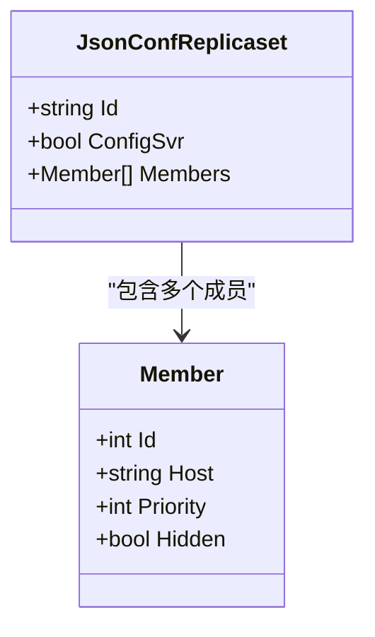
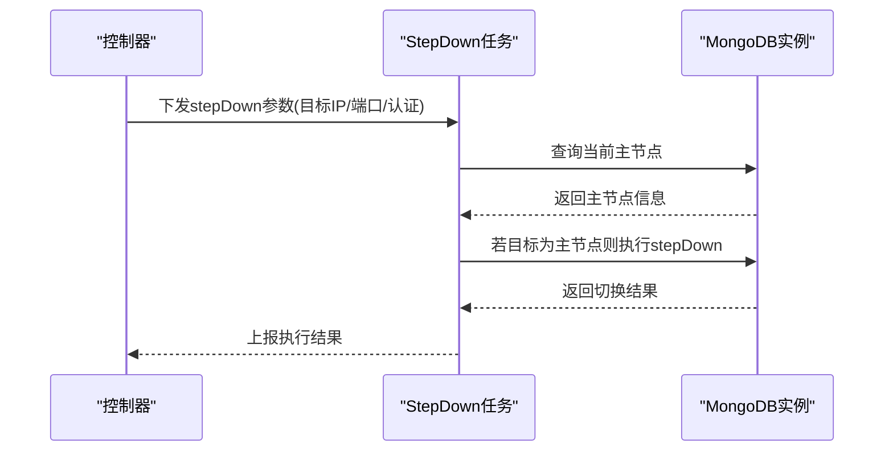
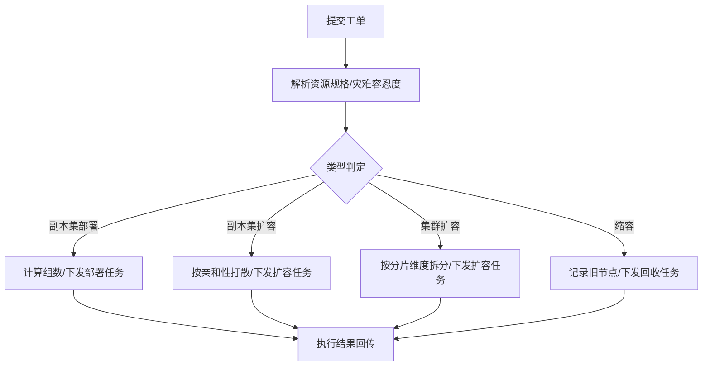
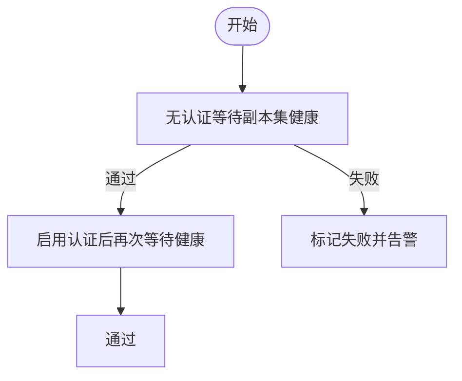
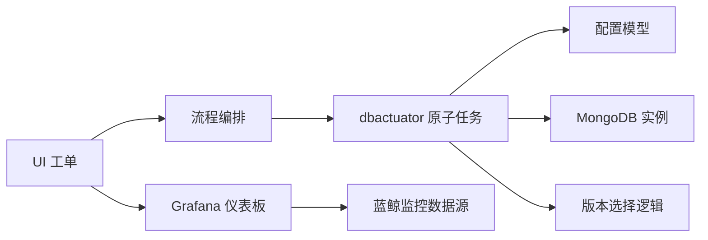

# 副本集管理

<cite>
**本文引用的文件**
- [initiate_replicaset.go](file://dbm-services/mongodb/db-tools/dbactuator/pkg/atomjobs/atommongodb/initiate_replicaset.go)
- [initiate_replicaset_conf.go](file://dbm-services/mongodb/db-tools/dbactuator/pkg/common/initiate_replicaset_conf.go)
- [replicaset_stepdown.go](file://dbm-services/mongodb/db-tools/dbactuator/pkg/atomjobs/atommongodb/replicaset_stepdown.go)
- [initiate_replicaset.example.md](file://dbm-services/mongodb/db-tools/dbactuator/example/initiate_replicaset.example.md)
- [mongo_three_node_replicaset_lifecycle.sh](file://dbm-services/mongodb/db-tools/dbactuator/tests/e2e/mongo_three_node_replicaset_lifecycle.sh)
- [mongoreplicaset.json](file://dbm-ui/backend/bk_dataview/dashboards/json/mongoreplicaset.json)
- [mongo_replicaset_apply.py](file://dbm-ui/backend/ticket/builders/mongodb/mongo_replicaset_apply.py)
- [mongo_replicaset_add_shard_nodes.py](file://dbm-ui/backend/ticket/builders/mongodb/mongo_replicaset_add_shard_nodes.py)
- [mongo_add_shard_nodes.py](file://dbm-ui/backend/ticket/builders/mongodb/mongo_add_shard_nodes.py)
- [mongo_reduce_shard_nodes.py](file://dbm-ui/backend/ticket/builders/mongodb/mongo_reduce_shard_nodes.py)
- [mongo.go](file://dbm-services/mongodb/db-tools/dbactuator/pkg/consts/mongo.go)
</cite>

## 目录
1. [简介](#简介)
2. [项目结构](#项目结构)
3. [核心组件](#核心组件)
4. [架构总览](#架构总览)
5. [详细组件分析](#详细组件分析)
6. [依赖关系分析](#依赖关系分析)
7. [性能考量](#性能考量)
8. [故障排查指南](#故障排查指南)
9. [结论](#结论)
10. [附录](#附录)

## 简介
本文件面向MongoDB副本集的全生命周期管理，覆盖副本集初始化、成员添加/删除、主从切换与故障转移、配置参数与角色分配、选举机制与数据同步策略、健康检查与监控、常见问题处理以及最佳实践与性能优化建议。文档以仓库中dbactuator原子任务、UI流程编排与监控仪表板为依据，结合命令行示例与流程图，帮助读者在真实部署场景中安全、可控地完成副本集运维。

## 项目结构
围绕副本集管理的关键代码分布在以下模块：
- dbactuator原子任务：负责副本集初始化、主从切换等底层操作
- 公共配置模型：用于生成副本集配置JSON
- UI工单与流程：负责资源申请、参数校验与执行编排
- 监控仪表板：提供副本集健康度与主机侧指标可视化
- 示例与测试：提供初始化payload样例与端到端生命周期验证脚本

**图表来源**
- [initiate_replicaset.go:1-375](file://dbm-services/mongodb/db-tools/dbactuator/pkg/atomjobs/atommongodb/initiate_replicaset.go#L1-L375)
- [replicaset_stepdown.go:1-135](file://dbm-services/mongodb/db-tools/dbactuator/pkg/atomjobs/atommongodb/replicaset_stepdown.go#L1-L135)
- [initiate_replicaset_conf.go:1-38](file://dbm-services/mongodb/db-tools/dbactuator/pkg/common/initiate_replicaset_conf.go#L1-L38)
- [mongo_replicaset_apply.py:100-130](file://dbm-ui/backend/ticket/builders/mongodb/mongo_replicaset_apply.py#L100-L130)
- [mongo_replicaset_add_shard_nodes.py:44-78](file://dbm-ui/backend/ticket/builders/mongodb/mongo_replicaset_add_shard_nodes.py#L44-L78)
- [mongo_add_shard_nodes.py:74-99](file://dbm-ui/backend/ticket/builders/mongodb/mongo_add_shard_nodes.py#L74-L99)
- [mongo_reduce_shard_nodes.py:72-81](file://dbm-ui/backend/ticket/builders/mongodb/mongo_reduce_shard_nodes.py#L72-L81)
- [mongoreplicaset.json:1-800](file://dbm-ui/backend/bk_dataview/dashboards/json/mongoreplicaset.json#L1-L800)
- [initiate_replicaset.example.md:1-32](file://dbm-services/mongodb/db-tools/dbactuator/example/initiate_replicaset.example.md#L1-L32)
- [mongo_three_node_replicaset_lifecycle.sh:1-407](file://dbm-services/mongodb/db-tools/dbactuator/tests/e2e/mongo_three_node_replicaset_lifecycle.sh#L1-L407)

**章节来源**
- [initiate_replicaset.go:1-375](file://dbm-services/mongodb/db-tools/dbactuator/pkg/atomjobs/atommongodb/initiate_replicaset.go#L1-L375)
- [initiate_replicaset_conf.go:1-38](file://dbm-services/mongodb/db-tools/dbactuator/pkg/common/initiate_replicaset_conf.go#L1-L38)
- [replicaset_stepdown.go:1-135](file://dbm-services/mongodb/db-tools/dbactuator/pkg/atomjobs/atommongodb/replicaset_stepdown.go#L1-L135)
- [mongo_replicaset_apply.py:100-130](file://dbm-ui/backend/ticket/builders/mongodb/mongo_replicaset_apply.py#L100-L130)
- [mongo_replicaset_add_shard_nodes.py:44-78](file://dbm-ui/backend/ticket/builders/mongodb/mongo_replicaset_add_shard_nodes.py#L44-L78)
- [mongo_add_shard_nodes.py:74-99](file://dbm-ui/backend/ticket/builders/mongodb/mongo_add_shard_nodes.py#L74-L99)
- [mongo_reduce_shard_nodes.py:72-81](file://dbm-ui/backend/ticket/builders/mongodb/mongo_reduce_shard_nodes.py#L72-L81)
- [mongoreplicaset.json:1-800](file://dbm-ui/backend/bk_dataview/dashboards/json/mongoreplicaset.json#L1-L800)
- [initiate_replicaset.example.md:1-32](file://dbm-services/mongodb/db-tools/dbactuator/example/initiate_replicaset.example.md#L1-L32)
- [mongo_three_node_replicaset_lifecycle.sh:1-407](file://dbm-services/mongodb/db-tools/dbactuator/tests/e2e/mongo_three_node_replicaset_lifecycle.sh#L1-L407)

## 核心组件
- 副本集初始化任务：负责生成配置、调用MongoDB shell执行rs.initiate，并轮询主节点就绪状态，确保初始化成功后清理临时脚本。
- 副本集配置模型：定义副本集配置结构（_id、members、configsvr等），并提供序列化能力。
- 主从切换任务：在目标为主节点时触发stepDown，促使仲裁或更高优先级节点接任。
- UI流程编排：将资源规格、灾难容忍度、节点亲和性等参数注入到执行流程，保障部署与扩容的正确性。
- 监控仪表板：提供CPU、内存、磁盘、网络等多维指标，辅助判断副本集健康度与潜在瓶颈。

**章节来源**
- [initiate_replicaset.go:33-100](file://dbm-services/mongodb/db-tools/dbactuator/pkg/atomjobs/atommongodb/initiate_replicaset.go#L33-L100)
- [initiate_replicaset_conf.go:5-38](file://dbm-services/mongodb/db-tools/dbactuator/pkg/common/initiate_replicaset_conf.go#L5-L38)
- [replicaset_stepdown.go:26-56](file://dbm-services/mongodb/db-tools/dbactuator/pkg/atomjobs/atommongodb/replicaset_stepdown.go#L26-L56)
- [mongoreplicaset.json:1-800](file://dbm-ui/backend/bk_dataview/dashboards/json/mongoreplicaset.json#L1-L800)

## 架构总览
下图展示从UI发起到dbactuator执行的副本集管理关键路径，包括初始化、扩容与监控联动。

**图表来源**
- [mongo_replicaset_apply.py:100-130](file://dbm-ui/backend/ticket/builders/mongodb/mongo_replicaset_apply.py#L100-L130)
- [mongo_replicaset_add_shard_nodes.py:44-78](file://dbm-ui/backend/ticket/builders/mongodb/mongo_replicaset_add_shard_nodes.py#L44-L78)
- [mongo_add_shard_nodes.py:74-99](file://dbm-ui/backend/ticket/builders/mongodb/mongo_add_shard_nodes.py#L74-L99)
- [mongo_reduce_shard_nodes.py:72-81](file://dbm-ui/backend/ticket/builders/mongodb/mongo_reduce_shard_nodes.py#L72-L81)
- [initiate_replicaset.go:59-100](file://dbm-services/mongodb/db-tools/dbactuator/pkg/atomjobs/atommongodb/initiate_replicaset.go#L59-L100)
- [replicaset_stepdown.go:48-56](file://dbm-services/mongodb/db-tools/dbactuator/pkg/atomjobs/atommongodb/replicaset_stepdown.go#L48-L56)
- [mongoreplicaset.json:1-800](file://dbm-ui/backend/bk_dataview/dashboards/json/mongoreplicaset.json#L1-L800)

## 详细组件分析

### 副本集初始化（init_replicaset）
- 输入参数：ip/port/setId/configSvr/成员列表/优先级映射/隐藏节点映射
- 关键步骤：
  - 检测任一成员是否已存在主节点，若存在则跳过initiate
  - 生成配置JSON并写入临时JS脚本
  - 通过mongo shell执行rs.initiate
  - 预探测主节点，随后轮询状态直至主节点就绪
  - 清理临时脚本
- 错误处理：参数校验失败、脚本执行失败、超时未选举主节点均会返回错误

**图表来源**
- [initiate_replicaset.go:59-100](file://dbm-services/mongodb/db-tools/dbactuator/pkg/atomjobs/atommongodb/initiate_replicaset.go#L59-L100)
- [initiate_replicaset.go:218-272](file://dbm-services/mongodb/db-tools/dbactuator/pkg/atomjobs/atommongodb/initiate_replicaset.go#L218-L272)
- [initiate_replicaset.go:292-307](file://dbm-services/mongodb/db-tools/dbactuator/pkg/atomjobs/atommongodb/initiate_replicaset.go#L292-L307)
- [initiate_replicaset.go:341-361](file://dbm-services/mongodb/db-tools/dbactuator/pkg/atomjobs/atommongodb/initiate_replicaset.go#L341-L361)

**章节来源**
- [initiate_replicaset.go:22-57](file://dbm-services/mongodb/db-tools/dbactuator/pkg/atomjobs/atommongodb/initiate_replicaset.go#L22-L57)
- [initiate_replicaset.go:102-132](file://dbm-services/mongodb/db-tools/dbactuator/pkg/atomjobs/atommongodb/initiate_replicaset.go#L102-L132)
- [initiate_replicaset.go:218-272](file://dbm-services/mongodb/db-tools/dbactuator/pkg/atomjobs/atommongodb/initiate_replicaset.go#L218-L272)
- [initiate_replicaset.go:292-307](file://dbm-services/mongodb/db-tools/dbactuator/pkg/atomjobs/atommongodb/initiate_replicaset.go#L292-L307)
- [initiate_replicaset.go:341-361](file://dbm-services/mongodb/db-tools/dbactuator/pkg/atomjobs/atommongodb/initiate_replicaset.go#L341-L361)
- [initiate_replicaset_conf.go:5-38](file://dbm-services/mongodb/db-tools/dbactuator/pkg/common/initiate_replicaset_conf.go#L5-L38)

### 副本集配置模型（JsonConfReplicaset/Member）
- 结构要点：_id、members（含_id/host/priority/hidden）、configsvr
- 用途：作为initiate时的配置载体，确保成员优先级与隐藏属性正确传递

**图表来源**
- [initiate_replicaset_conf.go:5-38](file://dbm-services/mongodb/db-tools/dbactuator/pkg/common/initiate_replicaset_conf.go#L5-L38)

**章节来源**
- [initiate_replicaset_conf.go:5-38](file://dbm-services/mongodb/db-tools/dbactuator/pkg/common/initiate_replicaset_conf.go#L5-L38)

### 主从切换（replicaset_stepdown）
- 触发条件：当目标节点为主节点时执行stepDown
- 执行流程：获取当前主节点信息，若目标与当前主一致则发起stepDown
- 适用场景：计划内主节点迁移、维护窗口内的平滑切换

**图表来源**
- [replicaset_stepdown.go:48-56](file://dbm-services/mongodb/db-tools/dbactuator/pkg/atomjobs/atommongodb/replicaset_stepdown.go#L48-L56)
- [replicaset_stepdown.go:117-134](file://dbm-services/mongodb/db-tools/dbactuator/pkg/atomjobs/atommongodb/replicaset_stepdown.go#L117-L134)

**章节来源**
- [replicaset_stepdown.go:17-56](file://dbm-services/mongodb/db-tools/dbactuator/pkg/atomjobs/atommongodb/replicaset_stepdown.go#L17-L56)
- [replicaset_stepdown.go:84-103](file://dbm-services/mongodb/db-tools/dbactuator/pkg/atomjobs/atommongodb/replicaset_stepdown.go#L84-L103)
- [replicaset_stepdown.go:117-134](file://dbm-services/mongodb/db-tools/dbactuator/pkg/atomjobs/atommongodb/replicaset_stepdown.go#L117-L134)

### UI流程编排与资源规格
- 副本集部署：将资源规格转换为内部字段，计算副本集组数与灾难容忍度
- 副本集扩容节点：按同机房/同拓扑亲和性打散，避免集中风险
- 集群扩容节点：按分片维度拆分资源规格，保证各分片均衡
- 缩容节点：记录旧节点集合，便于回收与审计

**图表来源**
- [mongo_replicaset_apply.py:100-130](file://dbm-ui/backend/ticket/builders/mongodb/mongo_replicaset_apply.py#L100-L130)
- [mongo_replicaset_add_shard_nodes.py:58-71](file://dbm-ui/backend/ticket/builders/mongodb/mongo_replicaset_add_shard_nodes.py#L58-L71)
- [mongo_add_shard_nodes.py:74-99](file://dbm-ui/backend/ticket/builders/mongodb/mongo_add_shard_nodes.py#L74-L99)
- [mongo_reduce_shard_nodes.py:72-81](file://dbm-ui/backend/ticket/builders/mongodb/mongo_reduce_shard_nodes.py#L72-L81)

**章节来源**
- [mongo_replicaset_apply.py:100-130](file://dbm-ui/backend/ticket/builders/mongodb/mongo_replicaset_apply.py#L100-L130)
- [mongo_replicaset_add_shard_nodes.py:58-71](file://dbm-ui/backend/ticket/builders/mongodb/mongo_replicaset_add_shard_nodes.py#L58-L71)
- [mongo_add_shard_nodes.py:74-99](file://dbm-ui/backend/ticket/builders/mongodb/mongo_add_shard_nodes.py#L74-L99)
- [mongo_reduce_shard_nodes.py:72-81](file://dbm-ui/backend/ticket/builders/mongodb/mongo_reduce_shard_nodes.py#L72-L81)

### 健康检查与监控
- 健康检查：通过shell查询rs.status()统计成员总数与主/从数量，结合认证/非认证两种模式等待副本集健康
- 监控仪表板：涵盖CPU、内存、磁盘占用、网络速率等指标，支持按实例角色与IP聚合
- 建议：在初始化后先无认证等待健康，再启用认证并再次确认

**图表来源**
- [mongo_three_node_replicaset_lifecycle.sh:138-170](file://dbm-services/mongodb/db-tools/dbactuator/tests/e2e/mongo_three_node_replicaset_lifecycle.sh#L138-L170)
- [mongoreplicaset.json:1-800](file://dbm-ui/backend/bk_dataview/dashboards/json/mongoreplicaset.json#L1-L800)

**章节来源**
- [mongo_three_node_replicaset_lifecycle.sh:138-170](file://dbm-services/mongodb/db-tools/dbactuator/tests/e2e/mongo_three_node_replicaset_lifecycle.sh#L138-L170)
- [mongoreplicaset.json:1-800](file://dbm-ui/backend/bk_dataview/dashboards/json/mongoreplicaset.json#L1-L800)

## 依赖关系分析
- dbactuator依赖公共配置模型生成副本集配置；UI流程依赖dbactuator原子任务完成具体操作
- 监控仪表板依赖蓝鲸监控数据源，提供副本集与主机侧指标
- 版本选择：根据MongoDB版本动态选择mongo或mongosh作为shell二进制

**图表来源**
- [mongo_replicaset_apply.py:100-130](file://dbm-ui/backend/ticket/builders/mongodb/mongo_replicaset_apply.py#L100-L130)
- [initiate_replicaset.go:176-203](file://dbm-services/mongodb/db-tools/dbactuator/pkg/atomjobs/atommongodb/initiate_replicaset.go#L176-L203)
- [initiate_replicaset_conf.go:5-38](file://dbm-services/mongodb/db-tools/dbactuator/pkg/common/initiate_replicaset_conf.go#L5-L38)
- [mongoreplicaset.json:1-800](file://dbm-ui/backend/bk_dataview/dashboards/json/mongoreplicaset.json#L1-L800)
- [mongo.go:33-48](file://dbm-services/mongodb/db-tools/dbactuator/pkg/consts/mongo.go#L33-L48)

**章节来源**
- [mongo.go:33-48](file://dbm-services/mongodb/db-tools/dbactuator/pkg/consts/mongo.go#L33-L48)

## 性能考量
- 优先级与隐藏节点：合理设置priority与hidden，有助于控制主节点候选与仲裁节点分布，提升可用性与灾备能力
- 网络与磁盘：通过监控仪表板关注网络速率与磁盘使用率，避免IO瓶颈导致同步延迟
- 认证开销：启用认证后需额外鉴权成本，建议在副本集稳定后再启用
- 扩容节奏：分批扩容，避免一次性引入过多成员导致同步压力过大

[本节为通用指导，无需特定文件引用]

## 故障排查指南
- 初始化超时：检查成员间连通性、端口监听、认证配置；参考端到端测试脚本中的健康等待逻辑
- 无法选举主节点：确认优先级设置、隐藏节点配置、仲裁节点数量；必要时执行主从切换
- 数据不同步：检查oplog大小与慢查询阈值、磁盘空间与IO性能
- 缩容失败：核对旧节点集合与回收策略，确保无业务连接残留

**章节来源**
- [mongo_three_node_replicaset_lifecycle.sh:138-170](file://dbm-services/mongodb/db-tools/dbactuator/tests/e2e/mongo_three_node_replicaset_lifecycle.sh#L138-L170)
- [initiate_replicaset.go:341-361](file://dbm-services/mongodb/db-tools/dbactuator/pkg/atomjobs/atommongodb/initiate_replicaset.go#L341-L361)

## 结论
通过dbactuator原子任务与UI流程编排的协同，副本集的初始化、成员管理、主从切换与健康监控形成闭环。配合监控仪表板与端到端测试脚本，可在生产环境中实现高可靠、可追溯的副本集运维。

[本节为总结性内容，无需特定文件引用]

## 附录

### 命令行示例与参数说明
- 副本集初始化命令（dbactuator）：参考示例文件中的命令格式与payload字段
- 添加成员命令：通过扩容流程编排，系统自动下发配置变更
- 移除成员命令：通过缩容流程编排，系统自动清理并回收资源
- 状态检查命令：使用mongo shell查询rs.status()，结合仪表板观察指标

**章节来源**
- [initiate_replicaset.example.md:1-32](file://dbm-services/mongodb/db-tools/dbactuator/example/initiate_replicaset.example.md#L1-L32)
- [mongo_three_node_replicaset_lifecycle.sh:138-170](file://dbm-services/mongodb/db-tools/dbactuator/tests/e2e/mongo_three_node_replicaset_lifecycle.sh#L138-L170)
- [mongoreplicaset.json:1-800](file://dbm-ui/backend/bk_dataview/dashboards/json/mongoreplicaset.json#L1-L800)