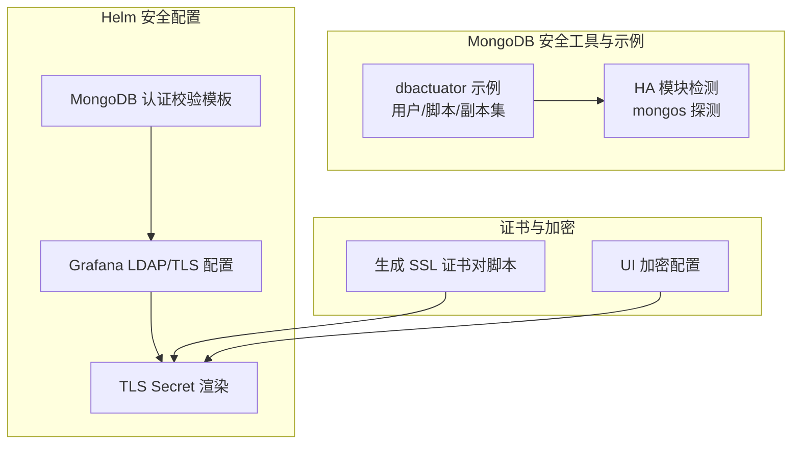
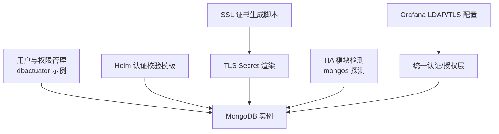
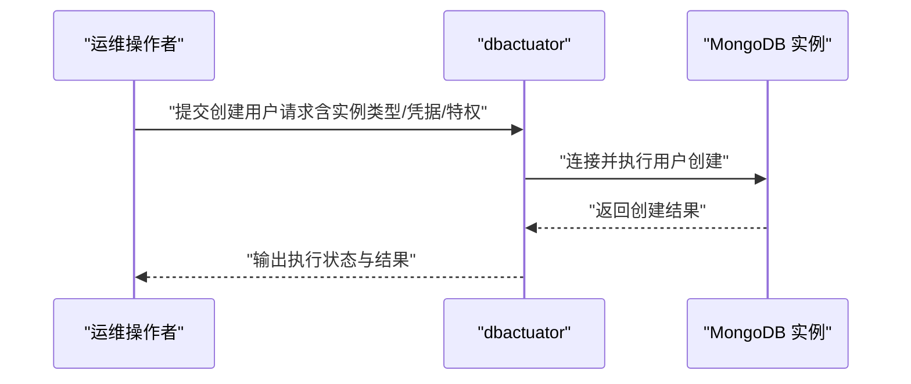
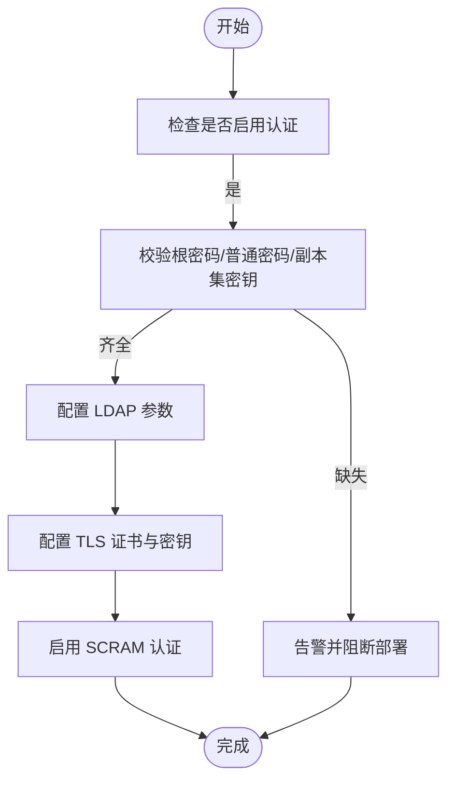
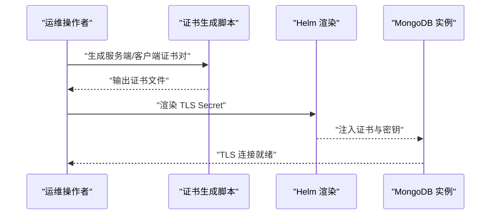
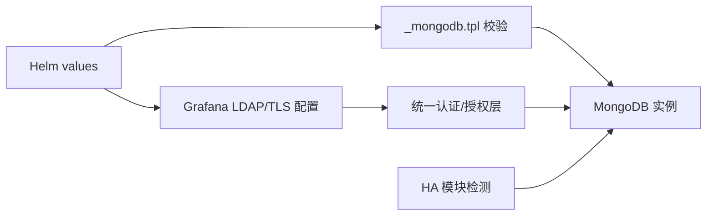

# 安全管理

<cite>
**本文引用的文件**   
- [mongo_add_user.example.md](file://dbm-services/mongodb/db-tools/dbactuator/example/mongo_add_user.example.md)
- [mongo_del_user.example.md](file://dbm-services/mongodb/db-tools/dbactuator/example/mongo_del_user.example.md)
- [mongo_execute_script.example.md](file://dbm-services/mongodb/db-tools/dbactuator/example/mongo_execute_script.example.md)
- [mongo_set_profilter.example.md](file://dbm-services/mongodb/db-tools/dbactuator/example/mongo_set_profilter.example.md)
- [initiate_replicaset.example.md](file://dbm-services/mongodb/db-tools/dbactuator/example/initiate_replicaset.example.md)
- [mongos_detect.go](file://dbm-services/common/dbha/ha-module/dbmodule/mongodb/mongos_detect.go)
- [_mongodb.tpl](file://helm-charts/bk-dbm/charts/k8s-dbs/charts/common/templates/validations/_mongodb.tpl)
- [values.yaml](file://helm-charts/bk-dbm/charts/grafana/values.yaml)
- [_helpers.tpl](file://helm-charts/bk-dbm/charts/grafana/templates/_helpers.tpl)
- [tls-secret.yaml](file://helm-charts/bk-dbm/charts/grafana/templates/tls-secret.yaml)
- [make_ssl_pairs.sh](file://dbm-ui/scripts/make_ssl_pairs.sh)
- [default.py](file://dbm-ui/config/default.py)
</cite>

## 目录
1. [简介](#简介)
2. [项目结构](#项目结构)
3. [核心组件](#核心组件)
4. [架构总览](#架构总览)
5. [详细组件分析](#详细组件分析)
6. [依赖关系分析](#依赖关系分析)
7. [性能考量](#性能考量)
8. [故障排查指南](#故障排查指南)
9. [结论](#结论)
10. [附录](#附录)

## 简介
本文件聚焦于 MongoDB 的安全管理能力，结合仓库中的工具与模板，系统阐述用户管理、权限控制、认证配置与安全加固要点。内容覆盖：
- 用户生命周期管理：创建、删除、权限分配与角色管理
- 认证机制：LDAP、X.509 证书、SCRAM 的配置思路与最佳实践
- 权限控制：数据库级与集合级访问限制、IP 白名单策略
- 加固措施：SSL/TLS 配置、审计日志与安全监控
- 生产实施：具体实施方案与风险评估方法

## 项目结构
围绕 MongoDB 安全管理的相关文件主要分布在以下位置：
- dbactuator 示例：用户管理、脚本执行、副本集初始化等
- HA 模块：对 mongos 实例的存活检测与 SSH 探测
- Helm 模板：MongoDB 认证参数校验、Grafana LDAP/TLS 配置
- SSL 工具：自动生成服务端/客户端证书对
- 加密配置：UI 层对称/非对称加密选项

**图表来源**
- [mongo_add_user.example.md:1-52](file://dbm-services/mongodb/db-tools/dbactuator/example/mongo_add_user.example.md#L1-L52)
- [mongos_detect.go:110-173](file://dbm-services/common/dbha/ha-module/dbmodule/mongodb/mongos_detect.go#L110-L173)
- [_mongodb.tpl:24-46](file://helm-charts/bk-dbm/charts/k8s-dbs/charts/common/templates/validations/_mongodb.tpl#L24-L46)
- [values.yaml:153-204](file://helm-charts/bk-dbm/charts/grafana/values.yaml#L153-L204)
- [_helpers.tpl:193-237](file://helm-charts/bk-dbm/charts/grafana/templates/_helpers.tpl#L193-L237)
- [tls-secret.yaml:35-46](file://helm-charts/bk-dbm/charts/grafana/templates/tls-secret.yaml#L35-L46)
- [make_ssl_pairs.sh:1-22](file://dbm-ui/scripts/make_ssl_pairs.sh#L1-L22)
- [default.py:582-614](file://dbm-ui/config/default.py#L582-L614)

**章节来源**
- [mongo_add_user.example.md:1-52](file://dbm-services/mongodb/db-tools/dbactuator/example/mongo_add_user.example.md#L1-L52)
- [mongos_detect.go:110-173](file://dbm-services/common/dbha/ha-module/dbmodule/mongodb/mongos_detect.go#L110-L173)
- [_mongodb.tpl:24-46](file://helm-charts/bk-dbm/charts/k8s-dbs/charts/common/templates/validations/_mongodb.tpl#L24-L46)
- [values.yaml:153-204](file://helm-charts/bk-dbm/charts/grafana/values.yaml#L153-L204)
- [_helpers.tpl:193-237](file://helm-charts/bk-dbm/charts/grafana/templates/_helpers.tpl#L193-L237)
- [tls-secret.yaml:35-46](file://helm-charts/bk-dbm/charts/grafana/templates/tls-secret.yaml#L35-L46)
- [make_ssl_pairs.sh:1-22](file://dbm-ui/scripts/make_ssl_pairs.sh#L1-L22)
- [default.py:582-614](file://dbm-ui/config/default.py#L582-L614)

## 核心组件
- 用户与权限管理：通过 dbactuator 示例展示如何在 mongod/mongos 上创建/删除用户，并基于特权列表进行授权
- 认证与授权校验：Helm 模板对 MongoDB 认证所需凭据进行强制校验
- LDAP/TLS 配置：Grafana 提供 LDAP 与 TLS 配置示例，可借鉴到统一认证体系
- SSL/TLS 证书：提供自动生成服务端/客户端证书对的脚本
- 安全监控与检测：HA 模块对 mongos 实例进行存活检测与 SSH 探测，辅助安全运维

**章节来源**
- [mongo_add_user.example.md:11-49](file://dbm-services/mongodb/db-tools/dbactuator/example/mongo_add_user.example.md#L11-L49)
- [mongo_del_user.example.md:10-34](file://dbm-services/mongodb/db-tools/dbactuator/example/mongo_del_user.example.md#L10-L34)
- [_mongodb.tpl:24-46](file://helm-charts/bk-dbm/charts/k8s-dbs/charts/common/templates/validations/_mongodb.tpl#L24-L46)
- [values.yaml:153-204](file://helm-charts/bk-dbm/charts/grafana/values.yaml#L153-L204)
- [_helpers.tpl:193-237](file://helm-charts/bk-dbm/charts/grafana/templates/_helpers.tpl#L193-L237)
- [make_ssl_pairs.sh:1-22](file://dbm-ui/scripts/make_ssl_pairs.sh#L1-L22)
- [mongos_detect.go:110-173](file://dbm-services/common/dbha/ha-module/dbmodule/mongodb/mongos_detect.go#L110-L173)

## 架构总览
下图展示了 MongoDB 安全管理的关键交互：用户管理通过 dbactuator 执行，认证与授权由 Helm 模板约束，LDAP/TLS 由 Grafana 模板提供参考，证书由脚本生成，HA 模块负责运行态检测。

**图表来源**
- [mongo_add_user.example.md:11-49](file://dbm-services/mongodb/db-tools/dbactuator/example/mongo_add_user.example.md#L11-L49)
- [_mongodb.tpl:24-46](file://helm-charts/bk-dbm/charts/k8s-dbs/charts/common/templates/validations/_mongodb.tpl#L24-L46)
- [values.yaml:153-204](file://helm-charts/bk-dbm/charts/grafana/values.yaml#L153-L204)
- [_helpers.tpl:193-237](file://helm-charts/bk-dbm/charts/grafana/templates/_helpers.tpl#L193-L237)
- [tls-secret.yaml:35-46](file://helm-charts/bk-dbm/charts/grafana/templates/tls-secret.yaml#L35-L46)
- [make_ssl_pairs.sh:1-22](file://dbm-ui/scripts/make_ssl_pairs.sh#L1-L22)
- [mongos_detect.go:110-173](file://dbm-services/common/dbha/ha-module/dbmodule/mongodb/mongos_detect.go#L110-L173)

## 详细组件分析

### 用户与权限管理（创建/删除/授权）
- 创建用户
  - 支持在 mongod（副本集/单节点）与 mongos（集群）上创建用户
  - 需要提供实例 IP/端口、实例类型、用户名/密码、认证数据库、管理员凭据与特权列表
  - 管理员用户可直接赋予 root 等高权限，业务用户按需授予数据库/集合级权限
- 删除用户
  - 支持在 mongod/mongos 上删除指定用户，需提供管理员凭据与目标用户信息
- 权限分配与角色管理
  - 通过特权列表进行授权，建议遵循最小权限原则
  - 对数据库级与集合级访问进行细粒度控制，避免授予不必要的全局权限

**图表来源**
- [mongo_add_user.example.md:11-49](file://dbm-services/mongodb/db-tools/dbactuator/example/mongo_add_user.example.md#L11-L49)

**章节来源**
- [mongo_add_user.example.md:11-49](file://dbm-services/mongodb/db-tools/dbactuator/example/mongo_add_user.example.md#L11-L49)
- [mongo_del_user.example.md:10-34](file://dbm-services/mongodb/db-tools/dbactuator/example/mongo_del_user.example.md#L10-L34)

### 认证配置（LDAP、X.509 证书、SCRAM）
- LDAP
  - Grafana 提供 LDAP 启用开关、绑定 DN/密码、基础 DN、搜索属性/过滤器、TLS 配置与证书挂载路径等参数
  - 可通过配置文件或 Secret/ConfigMap 注入 LDAP 配置
- X.509 证书
  - 通过 Helm 模板渲染 TLS Secret，包含服务端证书、私钥与 CA
  - 证书生成脚本可快速产出服务端/客户端证书对，便于测试与预生产环境
- SCRAM
  - Helm 模板对 MongoDB 认证所需的根密码、普通密码与副本集密钥进行强制校验，确保启用认证时具备必要凭据

**图表来源**
- [_mongodb.tpl:24-46](file://helm-charts/bk-dbm/charts/k8s-dbs/charts/common/templates/validations/_mongodb.tpl#L24-L46)
- [values.yaml:153-204](file://helm-charts/bk-dbm/charts/grafana/values.yaml#L153-L204)
- [_helpers.tpl:193-237](file://helm-charts/bk-dbm/charts/grafana/templates/_helpers.tpl#L193-L237)
- [tls-secret.yaml:35-46](file://helm-charts/bk-dbm/charts/grafana/templates/tls-secret.yaml#L35-L46)
- [make_ssl_pairs.sh:1-22](file://dbm-ui/scripts/make_ssl_pairs.sh#L1-L22)

**章节来源**
- [values.yaml:153-204](file://helm-charts/bk-dbm/charts/grafana/values.yaml#L153-L204)
- [_helpers.tpl:193-237](file://helm-charts/bk-dbm/charts/grafana/templates/_helpers.tpl#L193-L237)
- [tls-secret.yaml:35-46](file://helm-charts/bk-dbm/charts/grafana/templates/tls-secret.yaml#L35-L46)
- [make_ssl_pairs.sh:1-22](file://dbm-ui/scripts/make_ssl_pairs.sh#L1-L22)
- [_mongodb.tpl:24-46](file://helm-charts/bk-dbm/charts/k8s-dbs/charts/common/templates/validations/_mongodb.tpl#L24-L46)

### 权限控制（数据库级/集合级/IP 白名单）
- 数据库级与集合级访问限制
  - 通过特权列表与角色组合，限定用户仅能访问指定数据库/集合
  - 建议为不同业务线划分独立数据库与集合，减少越权风险
- IP 白名单
  - 在网络层面限制 MongoDB 绑定地址与访问来源，仅允许受信网段访问
  - 结合防火墙与安全组策略，实现最小暴露面

[本节为通用安全实践说明，不直接分析特定源码文件]

### 安全加固（SSL/TLS、审计日志、安全监控）
- SSL/TLS
  - 使用脚本生成服务端/客户端证书对，结合 Helm 渲染 TLS Secret，确保服务端与客户端双向认证
- 审计日志
  - 通过脚本化方式设置 profiler 级别与集合大小，记录慢查询与全量语句，辅助审计与性能分析
- 安全监控
  - HA 模块对 mongos 实例进行存活检测与 SSH 探测，及时发现异常并触发告警

**图表来源**
- [make_ssl_pairs.sh:1-22](file://dbm-ui/scripts/make_ssl_pairs.sh#L1-L22)
- [tls-secret.yaml:35-46](file://helm-charts/bk-dbm/charts/grafana/templates/tls-secret.yaml#L35-L46)

**章节来源**
- [mongo_set_profilter.example.md:11-26](file://dbm-services/mongodb/db-tools/dbactuator/example/mongo_set_profilter.example.md#L11-L26)
- [mongos_detect.go:110-173](file://dbm-services/common/dbha/ha-module/dbmodule/mongodb/mongos_detect.go#L110-L173)
- [make_ssl_pairs.sh:1-22](file://dbm-ui/scripts/make_ssl_pairs.sh#L1-L22)
- [tls-secret.yaml:35-46](file://helm-charts/bk-dbm/charts/grafana/templates/tls-secret.yaml#L35-L46)

### 生产实施与风险评估
- 实施步骤
  - 启用认证：在 Helm 中开启认证并补齐凭据；同时启用 LDAP/TLS 或 SCRAM
  - 权限最小化：基于特权列表授予数据库/集合级权限，避免全局权限
  - 网络隔离：绑定内网地址，开放受控端口，配置 IP 白名单
  - 证书管理：定期轮换证书与密钥，确保服务端/客户端一致性
  - 审计与监控：开启审计日志与 profiler，结合 HA 检测与告警联动
- 风险评估
  - 认证缺失：可能导致未授权访问；通过 Helm 校验与强制凭据降低风险
  - 权限滥用：通过最小权限与定期评审控制
  - 证书过期：建立自动化轮换流程与到期预警
  - 网络暴露：严格限制访问来源，定期审查安全组规则

[本节为通用安全实践说明，不直接分析特定源码文件]

## 依赖关系分析
- dbactuator 示例依赖 MongoDB 实例可用性与管理员凭据
- Helm 认证校验模板依赖 values 中的认证参数与架构类型
- Grafana LDAP/TLS 配置依赖 Secret/ConfigMap 与证书挂载路径
- HA 模块依赖 SSH 凭据与 MongoDB 连接参数

**图表来源**
- [_mongodb.tpl:24-46](file://helm-charts/bk-dbm/charts/k8s-dbs/charts/common/templates/validations/_mongodb.tpl#L24-L46)
- [values.yaml:153-204](file://helm-charts/bk-dbm/charts/grafana/values.yaml#L153-L204)
- [_helpers.tpl:193-237](file://helm-charts/bk-dbm/charts/grafana/templates/_helpers.tpl#L193-L237)
- [mongos_detect.go:110-173](file://dbm-services/common/dbha/ha-module/dbmodule/mongodb/mongos_detect.go#L110-L173)

**章节来源**
- [_mongodb.tpl:24-46](file://helm-charts/bk-dbm/charts/k8s-dbs/charts/common/templates/validations/_mongodb.tpl#L24-L46)
- [values.yaml:153-204](file://helm-charts/bk-dbm/charts/grafana/values.yaml#L153-L204)
- [_helpers.tpl:193-237](file://helm-charts/bk-dbm/charts/grafana/templates/_helpers.tpl#L193-L237)
- [mongos_detect.go:110-173](file://dbm-services/common/dbha/ha-module/dbmodule/mongodb/mongos_detect.go#L110-L173)

## 性能考量
- 权限检查与审计日志会带来额外开销，应根据业务需求合理设置 profiler 级别与审计范围
- LDAP/TLS 认证链路增加握手与验证成本，建议优化证书与密钥长度、启用连接池复用
- HA 探测频率与超时参数需平衡准确性与资源消耗

[本节为通用性能建议，不直接分析特定源码文件]

## 故障排查指南
- 认证失败
  - 检查 Helm values 中认证参数是否齐全，确认 root/password/replica set key 是否正确
  - 核对 LDAP/TLS 配置与证书挂载路径
- 连接异常
  - 使用 HA 模块的 mongos 探测逻辑定位实例存活与 SSH 认证问题
- 权限不足
  - 回溯用户创建时的特权列表，核对数据库/集合级权限是否满足业务需求

**章节来源**
- [_mongodb.tpl:24-46](file://helm-charts/bk-dbm/charts/k8s-dbs/charts/common/templates/validations/_mongodb.tpl#L24-L46)
- [mongos_detect.go:110-173](file://dbm-services/common/dbha/ha-module/dbmodule/mongodb/mongos_detect.go#L110-L173)

## 结论
本文件基于仓库中的 dbactuator 示例、Helm 模板与 HA 检测模块，梳理了 MongoDB 安全管理的关键环节：用户与权限、认证与授权、SSL/TLS、审计与监控，并给出了生产实施与风险评估建议。建议在实际落地中结合组织的安全基线，持续完善凭据管理、权限治理与监控告警体系。

## 附录
- 复制集初始化示例：用于集群高可用与副本集密钥管理
- 脚本化证书生成：便于快速搭建测试与预生产环境的 TLS 通道

**章节来源**
- [initiate_replicaset.example.md:10-32](file://dbm-services/mongodb/db-tools/dbactuator/example/initiate_replicaset.example.md#L10-L32)
- [make_ssl_pairs.sh:1-22](file://dbm-ui/scripts/make_ssl_pairs.sh#L1-L22)