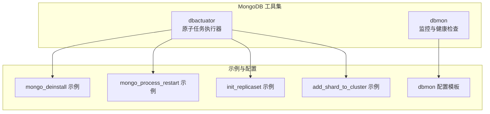
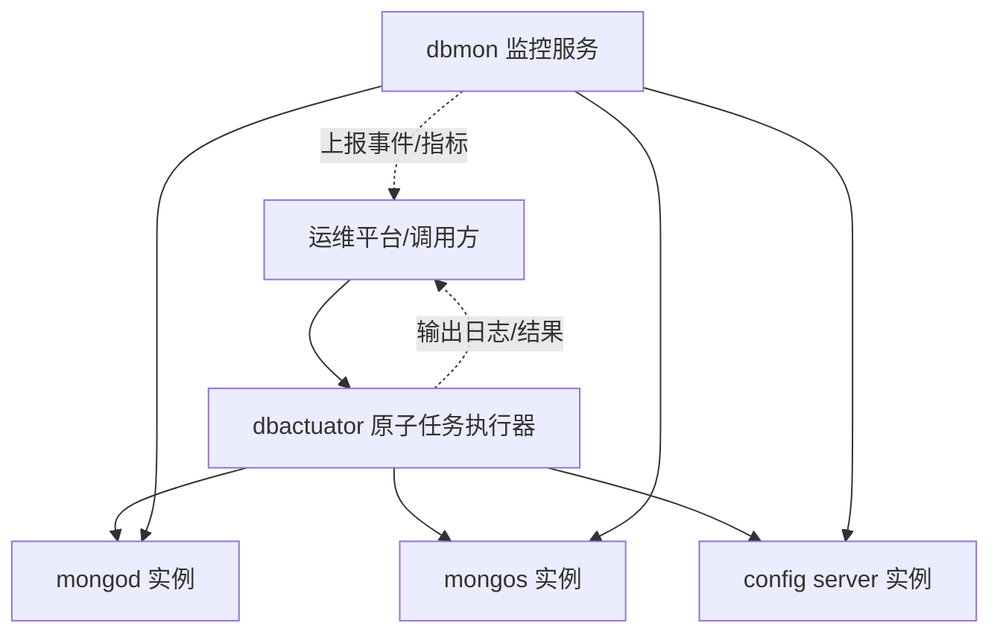
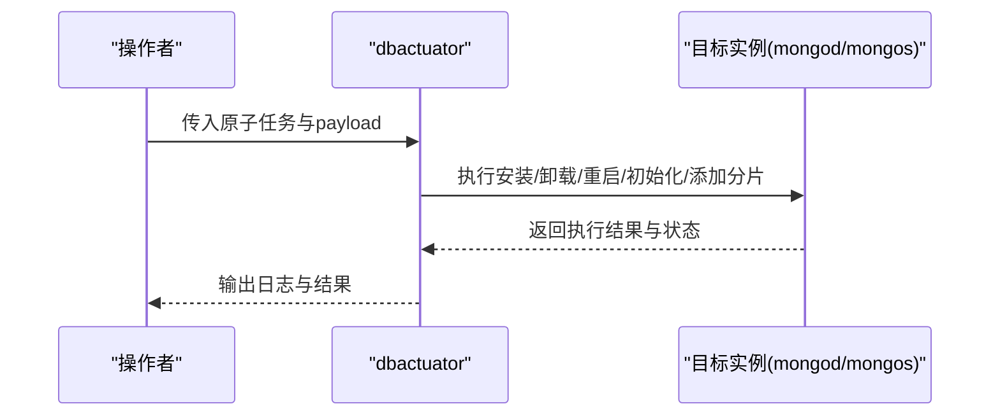
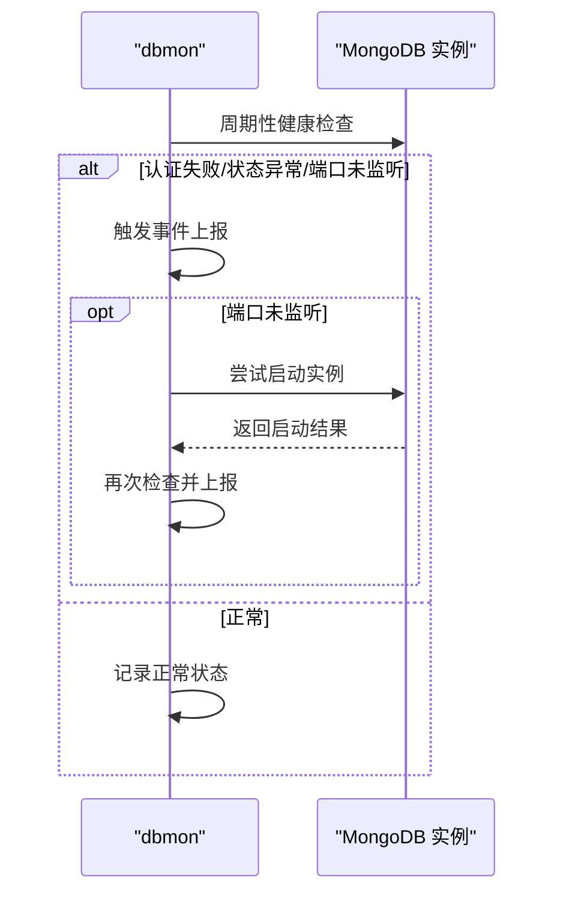
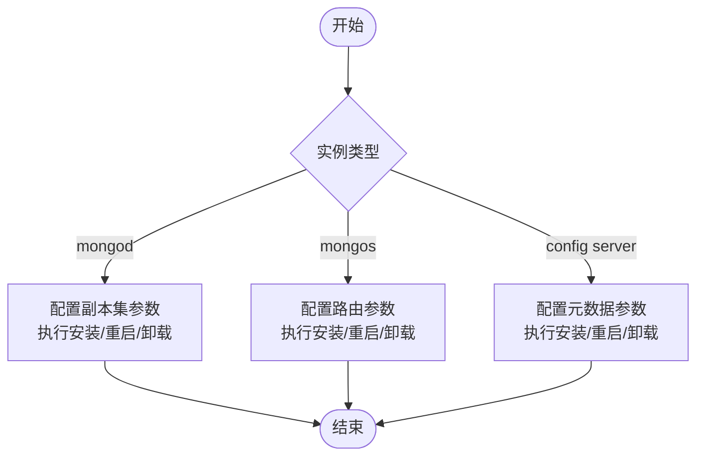
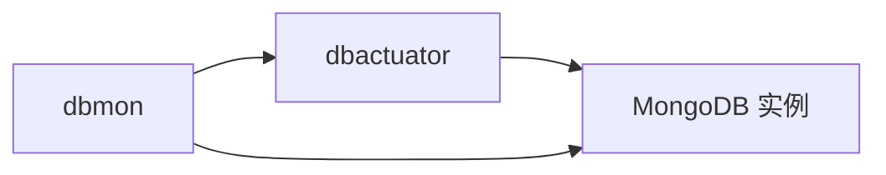

# 实例操作

<cite>
**本文引用的文件**
- [README.md](file://dbm-services/mongodb/db-tools/dbactuator/README.md)
- [mongo_deinstall.example.md](file://dbm-services/mongodb/db-tools/dbactuator/example/mongo_deinstall.example.md)
- [mongo_process_restart.example.md](file://dbm-services/mongodb/db-tools/dbactuator/example/mongo_process_restart.example.md)
- [initiate_replicaset.example.md](file://dbm-services/mongodb/db-tools/dbactuator/example/initiate_replicaset.example.md)
- [add_shard_to_cluster.example.md](file://dbm-services/mongodb/db-tools/dbactuator/example/add_shard_to_cluster.example.md)
- [README.md](file://dbm-services/mongodb/db-tools/dbmon/README.md)
- [dbmon-config.yaml](file://dbm-services/mongodb/db-tools/dbmon/dbmon-config.yaml)
</cite>

## 目录
1. [简介](#简介)
2. [项目结构](#项目结构)
3. [核心组件](#核心组件)
4. [架构总览](#架构总览)
5. [详细组件分析](#详细组件分析)
6. [依赖关系分析](#依赖关系分析)
7. [性能考虑](#性能考虑)
8. [故障排查指南](#故障排查指南)
9. [结论](#结论)
10. [附录](#附录)

## 简介
本文件面向MongoDB实例操作场景，系统化梳理安装、启动、停止、重启与卸载等基础操作，明确不同实例类型（mongod、mongos、config server）的配置参数与部署要求，提供实例配置文件模板、启动参数说明与环境变量设置指引，并解释实例状态检查、日志管理与性能监控方法。最后给出实例升级、降级与迁移的操作步骤与注意事项，帮助读者在生产环境中安全、规范地完成MongoDB实例生命周期管理。

## 项目结构
围绕MongoDB实例操作，本仓库中与之直接相关的工具与示例主要分布在以下模块：
- dbactuator：提供MongoDB原子任务执行器，涵盖安装、卸载、重启、副本集初始化、添加分片等操作。
- dbmon：提供MongoDB实例健康检查与事件上报能力，支持配置文件驱动的监控与告警。

**图表来源**
- [README.md:1-36](file://dbm-services/mongodb/db-tools/dbactuator/README.md#L1-L36)
- [README.md:1-57](file://dbm-services/mongodb/db-tools/dbmon/README.md#L1-L57)
- [dbmon-config.yaml:1-31](file://dbm-services/mongodb/db-tools/dbmon/dbmon-config.yaml#L1-L31)

**章节来源**
- [README.md:1-36](file://dbm-services/mongodb/db-tools/dbactuator/README.md#L1-L36)
- [README.md:1-57](file://dbm-services/mongodb/db-tools/dbmon/README.md#L1-L57)

## 核心组件
- dbactuator（MongoDB原子任务执行器）
  - 提供统一入口执行各类MongoDB实例操作原子任务，支持通过命令行参数与payload传参。
  - 关键参数包括：原子任务列表、备份目录、二进制路径、数据目录、运行用户与组、流程与单据标识等。
  - 支持通过环境变量覆盖部分路径类参数，便于测试与多环境适配。
- dbmon（MongoDB监控与健康检查）
  - 提供基于配置文件的服务器清单与监控参数，支持心跳检测、事件上报与指标采集。
  - 可通过命令行调试模式快速验证配置与连通性。

**章节来源**
- [README.md:13-31](file://dbm-services/mongodb/db-tools/dbactuator/README.md#L13-L31)
- [README.md:4-57](file://dbm-services/mongodb/db-tools/dbmon/README.md#L4-L57)

## 架构总览
dbactuator与dbmon协同工作，前者负责实例层面的安装、重启、卸载等操作，后者负责实例健康状态的持续监测与事件上报。

**图表来源**
- [README.md:1-36](file://dbm-services/mongodb/db-tools/dbactuator/README.md#L1-L36)
- [README.md:1-57](file://dbm-services/mongodb/db-tools/dbmon/README.md#L1-L57)

## 详细组件分析

### 组件一：dbactuator（实例操作原子任务）
- 功能定位
  - 作为MongoDB实例操作的统一入口，封装安装、重启、卸载、副本集初始化、添加分片等原子任务。
- 启动参数与环境变量
  - 通过命令行标志与环境变量控制二进制路径、数据目录、备份目录等关键路径。
  - 支持通过payload传入具体任务参数，payload可来自命令行或文件。
- 任务类型与典型场景
  - 安装/卸载：面向mongod与mongos实例的基础生命周期管理。
  - 重启：支持仅变更配置或同时重启实例，适用于参数调整与版本切换。
  - 初始化副本集：定义副本集成员、优先级与隐藏节点等。
  - 添加分片：向集群动态扩展分片副本集。

**图表来源**
- [README.md:13-31](file://dbm-services/mongodb/db-tools/dbactuator/README.md#L13-L31)
- [mongo_deinstall.example.md:1-28](file://dbm-services/mongodb/db-tools/dbactuator/example/mongo_deinstall.example.md#L1-L28)
- [mongo_process_restart.example.md:1-46](file://dbm-services/mongodb/db-tools/dbactuator/example/mongo_process_restart.example.md#L1-L46)
- [initiate_replicaset.example.md:1-32](file://dbm-services/mongodb/db-tools/dbactuator/example/initiate_replicaset.example.md#L1-L32)
- [add_shard_to_cluster.example.md:1-24](file://dbm-services/mongodb/db-tools/dbactuator/example/add_shard_to_cluster.example.md#L1-L24)

**章节来源**
- [README.md:13-31](file://dbm-services/mongodb/db-tools/dbactuator/README.md#L13-L31)
- [mongo_deinstall.example.md:1-28](file://dbm-services/mongodb/db-tools/dbactuator/example/mongo_deinstall.example.md#L1-L28)
- [mongo_process_restart.example.md:1-46](file://dbm-services/mongodb/db-tools/dbactuator/example/mongo_process_restart.example.md#L1-L46)
- [initiate_replicaset.example.md:1-32](file://dbm-services/mongodb/db-tools/dbactuator/example/initiate_replicaset.example.md#L1-L32)
- [add_shard_to_cluster.example.md:1-24](file://dbm-services/mongodb/db-tools/dbactuator/example/add_shard_to_cluster.example.md#L1-L24)

### 组件二：dbmon（实例状态检查与监控）
- 功能定位
  - 对MongoDB实例进行周期性健康检查，支持认证失败、状态异常、端口监听异常等事件上报。
  - 可在检测到端口未监听时尝试自动重启，并二次验证实例状态。
- 配置文件模板
  - 提供dbmon-config.yaml示例，包含上报地址、监控beat配置、服务器清单与认证信息等。
- 调试与验证
  - 提供调试命令，支持手动触发事件与时间戳上报，便于快速验证配置正确性。

**图表来源**
- [README.md:40-57](file://dbm-services/mongodb/db-tools/dbmon/README.md#L40-L57)
- [dbmon-config.yaml:1-31](file://dbm-services/mongodb/db-tools/dbmon/dbmon-config.yaml#L1-L31)

**章节来源**
- [README.md:40-57](file://dbm-services/mongodb/db-tools/dbmon/README.md#L40-L57)
- [dbmon-config.yaml:1-31](file://dbm-services/mongodb/db-tools/dbmon/dbmon-config.yaml#L1-L31)

### 组件三：实例类型与配置要点
- mongod（数据节点）
  - 用途：存储数据与处理读写请求，可参与副本集选举与数据同步。
  - 关键参数：IP、端口、副本集名称、成员列表、优先级、隐藏节点等。
  - 典型操作：安装、重启（可仅改配置）、卸载。
- mongos（路由节点）
  - 用途：对外提供MongoDB接口，路由查询与写入至对应分片。
  - 关键参数：IP、端口、配置服务器连接串、认证信息、缓存大小等。
  - 典型操作：安装、重启（可仅改配置）、卸载。
- config server（配置服务器）
  - 用途：存储集群元数据与分片路由信息，通常以副本集形式部署。
  - 关键参数：副本集名称、成员列表、优先级与隐藏节点等。
  - 典型操作：安装、重启（可仅改配置）、卸载。

**图表来源**
- [initiate_replicaset.example.md:1-32](file://dbm-services/mongodb/db-tools/dbactuator/example/initiate_replicaset.example.md#L1-L32)
- [add_shard_to_cluster.example.md:1-24](file://dbm-services/mongodb/db-tools/dbactuator/example/add_shard_to_cluster.example.md#L1-L24)
- [mongo_process_restart.example.md:1-46](file://dbm-services/mongodb/db-tools/dbactuator/example/mongo_process_restart.example.md#L1-L46)
- [mongo_deinstall.example.md:1-28](file://dbm-services/mongodb/db-tools/dbactuator/example/mongo_deinstall.example.md#L1-L28)

**章节来源**
- [initiate_replicaset.example.md:1-32](file://dbm-services/mongodb/db-tools/dbactuator/example/initiate_replicaset.example.md#L1-L32)
- [add_shard_to_cluster.example.md:1-24](file://dbm-services/mongodb/db-tools/dbactuator/example/add_shard_to_cluster.example.md#L1-L24)
- [mongo_process_restart.example.md:1-46](file://dbm-services/mongodb/db-tools/dbactuator/example/mongo_process_restart.example.md#L1-L46)
- [mongo_deinstall.example.md:1-28](file://dbm-services/mongodb/db-tools/dbactuator/example/mongo_deinstall.example.md#L1-L28)

## 依赖关系分析
- dbactuator依赖于目标主机上的MongoDB二进制与数据目录，通过命令行参数与环境变量控制路径。
- dbmon依赖于dbactuator提供的实例状态与事件上报能力，形成“执行—监控”的闭环。
- dbmon配置文件决定监控范围与上报通道，需与dbactuator执行的任务保持一致。

**图表来源**
- [README.md:13-31](file://dbm-services/mongodb/db-tools/dbactuator/README.md#L13-L31)
- [README.md:40-57](file://dbm-services/mongodb/db-tools/dbmon/README.md#L40-L57)

**章节来源**
- [README.md:13-31](file://dbm-services/mongodb/db-tools/dbactuator/README.md#L13-L31)
- [README.md:40-57](file://dbm-services/mongodb/db-tools/dbmon/README.md#L40-L57)

## 性能考虑
- 合理设置缓存大小与数据目录所在磁盘，避免I/O成为瓶颈。
- 在大规模集群中，mongos路由与config server的高可用与低延迟至关重要。
- 使用dbmon进行周期性健康检查，及时发现并处理潜在问题，降低故障恢复成本。

## 故障排查指南
- 认证失败
  - 现象：健康检查或连接时报认证错误。
  - 排查：核对用户名、密码与认证数据库；确认实例已启用认证。
- 状态异常
  - 现象：实例状态不在预期范围内（如非primary/secondary/arbiter）。
  - 排查：检查副本集成员状态与仲裁情况；必要时进行故障转移或修复。
- 端口未监听
  - 现象：监控提示端口未监听。
  - 排查：查看实例进程与日志；尝试重启实例并再次验证；确认防火墙与安全组放行。
- 事件上报
  - dbmon支持事件上报与调试命令，可用于快速定位配置与连通性问题。

**章节来源**
- [README.md:49-57](file://dbm-services/mongodb/db-tools/dbmon/README.md#L49-L57)

## 结论
通过dbactuator与dbmon的协同，可以实现对MongoDB实例从安装到卸载的全生命周期管理，并借助监控与事件上报机制保障实例健康与稳定性。建议在生产环境中严格遵循配置模板与参数说明，结合dbmon的周期性检查与事件上报，确保实例运行的可靠性与可观测性。

## 附录

### 实例操作清单与参数说明
- 安装/卸载
  - 适用类型：mongod、mongos
  - 关键参数：IP、端口、实例类型、是否强制卸载、是否重命名目录等。
  - 参考示例：[mongo_deinstall 示例:1-28](file://dbm-services/mongodb/db-tools/dbactuator/example/mongo_deinstall.example.md#L1-L28)
- 重启
  - 适用类型：mongod、mongos
  - 关键参数：IP、端口、实例类型、是否仅变更配置、缓存大小等。
  - 参考示例：[mongo_process_restart 示例:1-46](file://dbm-services/mongodb/db-tools/dbactuator/example/mongo_process_restart.example.md#L1-L46)
- 初始化副本集
  - 适用类型：mongod
  - 关键参数：副本集名称、成员列表、优先级、隐藏节点等。
  - 参考示例：[init_replicaset 示例:1-32](file://dbm-services/mongodb/db-tools/dbactuator/example/initiate_replicaset.example.md#L1-L32)
- 添加分片
  - 适用类型：mongos
  - 关键参数：管理员账号与密码、分片映射关系等。
  - 参考示例：[add_shard_to_cluster 示例:1-24](file://dbm-services/mongodb/db-tools/dbactuator/example/add_shard_to_cluster.example.md#L1-L24)

### 配置文件模板与环境变量
- dbmon配置模板
  - 文件：dbmon-config.yaml
  - 内容要点：上报地址、监控beat配置、服务器清单、认证信息等。
  - 参考：[dbmon 配置模板:1-31](file://dbm-services/mongodb/db-tools/dbmon/dbmon-config.yaml#L1-L31)
- dbactuator环境变量
  - 二进制路径、数据目录、备份目录等可通过环境变量覆盖。
  - 参考：[dbactuator 参数说明:13-31](file://dbm-services/mongodb/db-tools/dbactuator/README.md#L13-L31)

### 日志管理与性能监控
- 日志位置
  - dbactuator与MongoDB实例的日志输出由各自配置决定，建议统一收集与归档。
- 监控指标
  - 通过dbmon上报事件与指标，结合外部监控系统进行可视化与告警。

**章节来源**
- [README.md:40-57](file://dbm-services/mongodb/db-tools/dbmon/README.md#L40-L57)
- [dbmon-config.yaml:1-31](file://dbm-services/mongodb/db-tools/dbmon/dbmon-config.yaml#L1-L31)
- [README.md:13-31](file://dbm-services/mongodb/db-tools/dbactuator/README.md#L13-L31)

### 升级、降级与迁移操作步骤与注意事项
- 升级
  - 步骤概览：准备新版本包、逐实例替换二进制与配置、重启验证、更新监控配置。
  - 注意事项：确保新旧版本兼容、备份元数据、灰度验证与回滚预案。
- 降级
  - 步骤概览：评估影响面、回滚到上一个稳定版本、验证实例状态与业务可用性。
  - 注意事项：降级前必须有完整的备份与演练记录。
- 迁移
  - 步骤概览：规划迁移窗口、导出/导入数据、切换路由、验证一致性与性能。
  - 注意事项：迁移过程中需严格控制停机时间与数据一致性。

[本节为通用实践指导，不直接分析具体源码文件，故无“章节来源”标注]