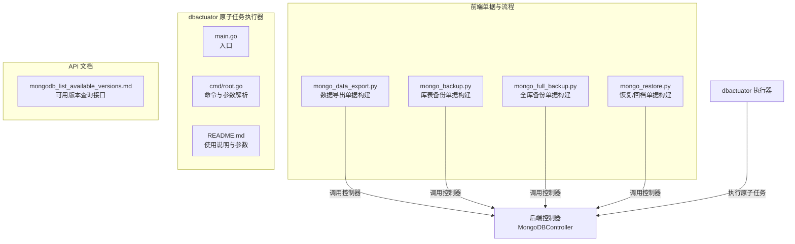
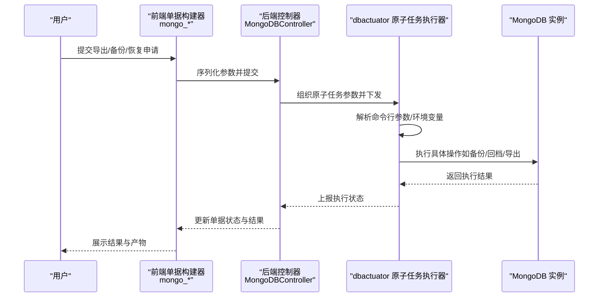
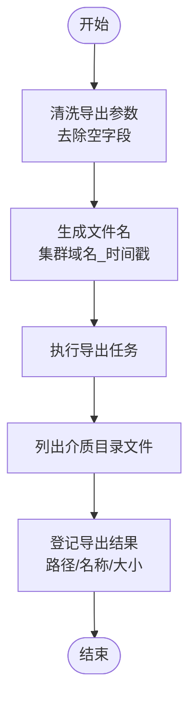
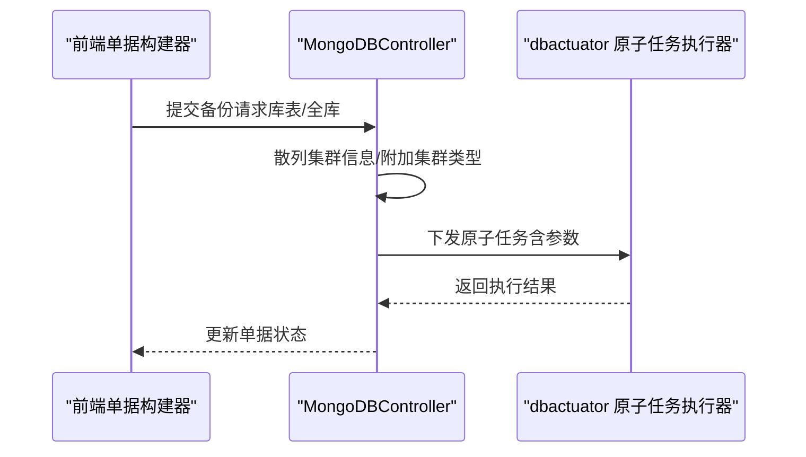
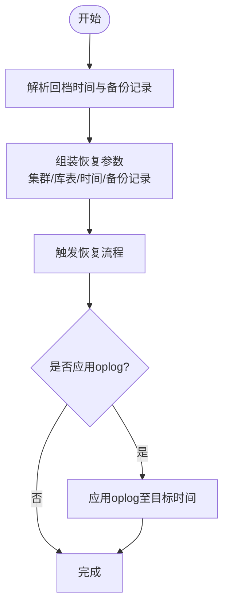
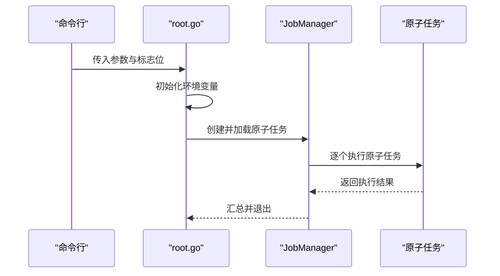

# 数据管理

<cite>
**本文引用的文件**   
- [dbactuator/main.go](file://dbm-services/mongodb/db-tools/dbactuator/main.go)
- [dbactuator/README.md](file://dbm-services/mongodb/db-tools/dbactuator/README.md)
- [dbactuator/cmd/root.go](file://dbm-services/mongodb/db-tools/dbactuator/cmd/root.go)
- [mongo_data_export.py](file://dbm-ui/backend/ticket/builders/mongodb/mongo_data_export.py)
- [mongo_backup.py](file://dbm-ui/backend/ticket/builders/mongodb/mongo_backup.py)
- [mongo_full_backup.py](file://dbm-ui/backend/ticket/builders/mongodb/mongo_full_backup.py)
- [mongo_restore.py](file://dbm-ui/backend/ticket/builders/mongodb/mongo_restore.py)
- [mongodb_list_available_versions.md](file://docs/api/mongodb_list_available_versions.md)
</cite>

## 目录
1. [简介](#简介)
2. [项目结构](#项目结构)
3. [核心组件](#核心组件)
4. [架构总览](#架构总览)
5. [组件详解](#组件详解)
6. [依赖关系分析](#依赖关系分析)
7. [性能与可靠性](#性能与可靠性)
8. [故障排查指南](#故障排查指南)
9. [结论](#结论)
10. [附录](#附录)

## 简介
本文件面向 MongoDB 数据管理能力，系统化梳理数据导入导出、备份恢复、数据迁移与校验等关键操作在本仓库中的实现与使用方式。重点结合前端单据构建器与后端控制器，以及 dbactuator 原子任务执行器，给出从参数配置到执行流程的全景说明，并补充增量备份、全量备份与时间点恢复（PITR）的实施方案要点、数据压缩与传输安全建议、大数据量场景下的性能优化策略与故障恢复方法，以及生产最佳实践。

## 项目结构
围绕 MongoDB 数据管理，相关代码主要分布在以下位置：
- 后端单据与流程：dbm-ui/backend/ticket/.../mongodb/*.py
- 前端原子任务执行器：dbm-services/mongodb/db-tools/dbactuator/*
- API 文档：docs/api/mongodb_list_available_versions.md

下图展示与“数据管理”直接相关的模块与文件：

图表来源
- [mongo_data_export.py:1-151](file://dbm-ui/backend/ticket/builders/mongodb/mongo_data_export.py#L1-L151)
- [mongo_backup.py:1-52](file://dbm-ui/backend/ticket/builders/mongodb/mongo_backup.py#L1-L52)
- [mongo_full_backup.py:1-50](file://dbm-ui/backend/ticket/builders/mongodb/mongo_full_backup.py#L1-L50)
- [mongo_restore.py:1-184](file://dbm-ui/backend/ticket/builders/mongodb/mongo_restore.py#L1-L184)
- [dbactuator/main.go:1-13](file://dbm-services/mongodb/db-tools/dbactuator/main.go#L1-L13)
- [dbactuator/cmd/root.go:1-285](file://dbm-services/mongodb/db-tools/dbactuator/cmd/root.go#L1-L285)
- [dbactuator/README.md:1-36](file://dbm-services/mongodb/db-tools/dbactuator/README.md#L1-L36)
- [mongodb_list_available_versions.md:59-124](file://docs/api/mongodb_list_available_versions.md#L59-L124)

章节来源
- [dbactuator/main.go:1-13](file://dbm-services/mongodb/db-tools/dbactuator/main.go#L1-L13)
- [dbactuator/README.md:1-36](file://dbm-services/mongodb/db-tools/dbactuator/README.md#L1-L36)
- [dbactuator/cmd/root.go:1-285](file://dbm-services/mongodb/db-tools/dbactuator/cmd/root.go#L1-L285)
- [mongo_data_export.py:1-151](file://dbm-ui/backend/ticket/builders/mongodb/mongo_data_export.py#L1-L151)
- [mongo_backup.py:1-52](file://dbm-ui/backend/ticket/builders/mongodb/mongo_backup.py#L1-L52)
- [mongo_full_backup.py:1-50](file://dbm-ui/backend/ticket/builders/mongodb/mongo_full_backup.py#L1-L50)
- [mongo_restore.py:1-184](file://dbm-ui/backend/ticket/builders/mongodb/mongo_restore.py#L1-L184)
- [mongodb_list_available_versions.md:59-124](file://docs/api/mongodb_list_available_versions.md#L59-L124)

## 核心组件
- 前端单据构建器：负责将用户输入的导出/备份/恢复参数标准化、校验并下发给后端控制器。
- 后端控制器：承接前端单据，组织执行流程，协调 dbactuator 原子任务。
- dbactuator 原子任务执行器：封装具体 MongoDB 操作（如安装、备份、回档等），通过命令行参数与环境变量驱动执行。
- API 文档：提供版本查询等工具箱接口，辅助运维决策。

章节来源
- [mongo_data_export.py:37-108](file://dbm-ui/backend/ticket/builders/mongodb/mongo_data_export.py#L37-L108)
- [mongo_backup.py:28-51](file://dbm-ui/backend/ticket/builders/mongodb/mongo_backup.py#L28-L51)
- [mongo_full_backup.py:22-50](file://dbm-ui/backend/ticket/builders/mongodb/mongo_full_backup.py#L22-L50)
- [mongo_restore.py:42-184](file://dbm-ui/backend/ticket/builders/mongodb/mongo_restore.py#L42-L184)
- [dbactuator/cmd/root.go:88-126](file://dbm-services/mongodb/db-tools/dbactuator/cmd/root.go#L88-L126)
- [dbactuator/README.md:1-36](file://dbm-services/mongodb/db-tools/dbactuator/README.md#L1-L36)
- [mongodb_list_available_versions.md:59-124](file://docs/api/mongodb_list_available_versions.md#L59-L124)

## 架构总览
下图展示从前端单据到 dbactuator 原子任务的总体执行链路：

图表来源
- [mongo_data_export.py:60-108](file://dbm-ui/backend/ticket/builders/mongodb/mongo_data_export.py#L60-L108)
- [mongo_backup.py:38-51](file://dbm-ui/backend/ticket/builders/mongodb/mongo_backup.py#L38-L51)
- [mongo_full_backup.py:31-50](file://dbm-ui/backend/ticket/builders/mongodb/mongo_full_backup.py#L31-L50)
- [mongo_restore.py:42-184](file://dbm-ui/backend/ticket/builders/mongodb/mongo_restore.py#L42-L184)
- [dbactuator/cmd/root.go:88-126](file://dbm-services/mongodb/db-tools/dbactuator/cmd/root.go#L88-L126)
- [dbactuator/README.md:1-36](file://dbm-services/mongodb/db-tools/dbactuator/README.md#L1-L36)

## 组件详解

### 数据导出（mongo_data_export）
- 功能概述：支持按库表选择器导出 JSON/CSV/BSON，支持查询条件与字段过滤，生成归档产物并登记介质存储路径与大小。
- 关键参数：
  - 导出格式：json/csv/bson
  - 查询条件与字段过滤：可选
  - 集群选择：cluster_id
- 执行流程要点：
  - 参数清洗：去除空字符串项
  - 文件命名：基于集群域名与当前时间戳
  - 结果登记：遍历介质目录，登记导出文件路径、名称与大小

图表来源
- [mongo_data_export.py:63-100](file://dbm-ui/backend/ticket/builders/mongodb/mongo_data_export.py#L63-L100)

章节来源
- [mongo_data_export.py:37-108](file://dbm-ui/backend/ticket/builders/mongodb/mongo_data_export.py#L37-L108)

### 库表备份（mongo_backup）与全库备份（mongo_full_backup）
- 库表备份（mongo_backup）：
  - 支持按库表选择器与集群类型/ID列表进行备份
  - 默认关闭 oplog 备份开关
- 全库备份（mongo_full_backup）：
  - 针对单集群全库备份
  - 自动填充空的库表选择器与备份主机信息
- 控制器对接：两者均通过 MongoDBController.mongo_backup 触发后端流程

图表来源
- [mongo_backup.py:38-51](file://dbm-ui/backend/ticket/builders/mongodb/mongo_backup.py#L38-L51)
- [mongo_full_backup.py:31-50](file://dbm-ui/backend/ticket/builders/mongodb/mongo_full_backup.py#L31-L50)
- [dbactuator/cmd/root.go:88-126](file://dbm-services/mongodb/db-tools/dbactuator/cmd/root.go#L88-L126)

章节来源
- [mongo_backup.py:28-51](file://dbm-ui/backend/ticket/builders/mongodb/mongo_backup.py#L28-L51)
- [mongo_full_backup.py:22-50](file://dbm-ui/backend/ticket/builders/mongodb/mongo_full_backup.py#L22-L50)

### 恢复/回档（mongo_restore）
- 功能概述：支持按集群列表、库表选择器、回档时间点或指定备份记录进行恢复；可选择应用 oplog。
- 关键参数：
  - cluster_ids：目标集群列表
  - ns_filter：库表选择器（可选）
  - rollback_time：回档时间（JSON）
  - backupinfo：指定备份记录映射（可选）
  - apply_oplog：是否应用 oplog（通常为真）

图表来源
- [mongo_restore.py:42-184](file://dbm-ui/backend/ticket/builders/mongodb/mongo_restore.py#L42-L184)

章节来源
- [mongo_restore.py:42-184](file://dbm-ui/backend/ticket/builders/mongodb/mongo_restore.py#L42-L184)

### dbactuator 原子任务执行器
- 入口与命令行：
  - main.go 作为程序入口
  - root.go 定义命令行参数与子命令，加载原子任务并执行
- 关键参数（来自 README 与参数定义）：
  - 原子任务列表：--atom-job-list
  - 单据/流程/节点/版本：--uid/--root_id/--node_id/--version_id
  - 参数载体：--payload/--payload_file（支持 base64/raw）
  - 环境变量：MONGO_DATA_DIR/MONGO_BACKUP_DIR/MONGO_BIN_DIR
  - 用户与组：--user/--group
- 执行流程：
  - 初始化环境变量（数据/备份/二进制路径、进程用户/组）
  - 加载原子任务并运行

图表来源
- [dbactuator/main.go:10-12](file://dbm-services/mongodb/db-tools/dbactuator/main.go#L10-L12)
- [dbactuator/cmd/root.go:88-126](file://dbm-services/mongodb/db-tools/dbactuator/cmd/root.go#L88-L126)
- [dbactuator/README.md:13-31](file://dbm-services/mongodb/db-tools/dbactuator/README.md#L13-L31)

章节来源
- [dbactuator/main.go:1-13](file://dbm-services/mongodb/db-tools/dbactuator/main.go#L1-L13)
- [dbactuator/README.md:1-36](file://dbm-services/mongodb/db-tools/dbactuator/README.md#L1-L36)
- [dbactuator/cmd/root.go:28-126](file://dbm-services/mongodb/db-tools/dbactuator/cmd/root.go#L28-L126)

### 工具箱接口：可用版本查询
- 接口用途：查询业务下多集群的可升级版本集合（支持按集群交集）
- 请求参数：cluster_ids（多行同名键）
- 响应结构：按主版本线分组返回完整版本号列表

章节来源
- [mongodb_list_available_versions.md:59-124](file://docs/api/mongodb_list_available_versions.md#L59-L124)

## 依赖关系分析
- 前端单据构建器依赖后端控制器（MongoDBController）以统一调度备份/恢复/导出等流程。
- 后端控制器依赖 dbactuator 原子任务执行器完成具体数据库操作。
- dbactuator 通过命令行参数与环境变量控制执行行为，确保在不同环境中的一致性。

图表来源
- [mongo_data_export.py:60-108](file://dbm-ui/backend/ticket/builders/mongodb/mongo_data_export.py#L60-L108)
- [mongo_backup.py:38-51](file://dbm-ui/backend/ticket/builders/mongodb/mongo_backup.py#L38-L51)
- [mongo_full_backup.py:31-50](file://dbm-ui/backend/ticket/builders/mongodb/mongo_full_backup.py#L31-L50)
- [mongo_restore.py:42-184](file://dbm-ui/backend/ticket/builders/mongodb/mongo_restore.py#L42-L184)
- [dbactuator/cmd/root.go:88-126](file://dbm-services/mongodb/db-tools/dbactuator/cmd/root.go#L88-L126)
- [dbactuator/README.md:13-31](file://dbm-services/mongodb/db-tools/dbactuator/README.md#L13-L31)

章节来源
- [mongo_data_export.py:60-108](file://dbm-ui/backend/ticket/builders/mongodb/mongo_data_export.py#L60-L108)
- [mongo_backup.py:38-51](file://dbm-ui/backend/ticket/builders/mongodb/mongo_backup.py#L38-L51)
- [mongo_full_backup.py:31-50](file://dbm-ui/backend/ticket/builders/mongodb/mongo_full_backup.py#L31-L50)
- [mongo_restore.py:42-184](file://dbm-ui/backend/ticket/builders/mongodb/mongo_restore.py#L42-L184)
- [dbactuator/cmd/root.go:88-126](file://dbm-services/mongodb/db-tools/dbactuator/cmd/root.go#L88-L126)
- [dbactuator/README.md:13-31](file://dbm-services/mongodb/db-tools/dbactuator/README.md#L13-L31)

## 性能与可靠性
- 大数据量场景下的性能优化建议（通用指导，非特定文件分析）：
  - 并行度与批处理：合理拆分库表范围，分批导出/备份，避免单任务长时间占用资源。
  - 索引与查询：导出时尽量使用带索引的查询条件，减少全表扫描。
  - 存储与网络：优先使用本地高吞吐磁盘作为备份/导出临时目录，网络传输采用带宽充足的链路。
  - 压缩与分卷：导出/备份产物建议启用压缩；对于超大文件考虑分卷归档，便于传输与校验。
  - 限流与资源预留：在业务低峰期执行，避免与写入高峰重叠；为 mongod 与执行器预留足够 CPU/IO。
- 可靠性保障：
  - 失败重试与幂等：单据层设置合理的重试策略；原子任务需具备幂等性，避免重复执行造成副作用。
  - 校验与校验和：导出/备份完成后计算校验和，比对一致性；失败即回滚或告警。
  - 日志与可观测：执行器输出详细日志，关键步骤打点，便于定位问题。

## 故障排查指南
- 常见问题定位思路：
  - 参数错误：检查命令行参数与环境变量是否正确设置（数据/备份/二进制路径、用户/组）。
  - 权限问题：确认执行用户对数据目录、备份目录与二进制路径具有读写权限。
  - 网络与可达性：恢复/回档涉及跨实例操作时，检查网络连通与认证配置。
  - 资源不足：观察磁盘空间、内存与 CPU 使用率，必要时扩容或调整并发。
- 原子任务调试：
  - 使用 dbactuator 的 debug 子命令列举任务、查看进程、根据端口获取 PID、执行副本集降级等诊断动作。
- 单据状态与结果：
  - 导出完成后，通过介质存储目录核对产物是否存在与大小是否匹配。
  - 备份/恢复完成后，关注后端控制器返回的状态与错误码，结合执行器日志定位。

章节来源
- [dbactuator/README.md:13-31](file://dbm-services/mongodb/db-tools/dbactuator/README.md#L13-L31)
- [dbactuator/cmd/root.go:128-214](file://dbm-services/mongodb/db-tools/dbactuator/cmd/root.go#L128-L214)
- [mongo_data_export.py:81-100](file://dbm-ui/backend/ticket/builders/mongodb/mongo_data_export.py#L81-L100)

## 结论
本仓库围绕 MongoDB 数据管理形成了从前端单据、后端控制器到 dbactuator 原子任务的完整闭环。通过库表选择器、导出格式与查询/字段过滤、备份类型与恢复时间点等参数，能够满足日常的数据导入导出、备份恢复与迁移需求。配合工具箱接口与执行器的参数/环境变量机制，可在不同生产环境下稳定落地。建议在大数据量场景下结合并行与压缩、限流与资源预留等策略，并完善校验与可观测性，以提升整体可靠性与效率。

## 附录

### 增量备份、全量备份与时间点恢复（PITR）实施方案要点
- 全量备份：按集群维度执行全库快照，建议在业务低峰期进行，完成后进行一致性校验。
- 增量备份：针对库表选择器的增量采集，结合 oplog 备份开关，按需启用以降低全备频率。
- 时间点恢复（PITR）：基于备份记录与 oplog 应用至目标时间点，支持按集群与库表粒度回档；需确保 oplog 保留策略满足回档窗口要求。

章节来源
- [mongo_backup.py:38-51](file://dbm-ui/backend/ticket/builders/mongodb/mongo_backup.py#L38-L51)
- [mongo_full_backup.py:31-50](file://dbm-ui/backend/ticket/builders/mongodb/mongo_full_backup.py#L31-L50)
- [mongo_restore.py:42-184](file://dbm-ui/backend/ticket/builders/mongodb/mongo_restore.py#L42-L184)

### 数据压缩、加密与传输安全
- 压缩：导出/备份产物建议启用压缩，减小存储与传输成本。
- 加密：在传输链路与静态存储层面实施加密，确保敏感数据不被泄露。
- 传输安全：通过受控网络与专线传输，限制访问范围；对介质存储进行权限控制与审计。

（本节为通用实践建议，不直接对应特定文件）

### 实际生产环境最佳实践
- 分层治理：将备份/导出任务纳入统一单据流程，明确审批与人工确认节点。
- 版本管理：利用工具箱接口查询可升级版本，结合业务计划制定升级与迁移窗口。
- 回归验证：每次恢复/回档后进行抽样校验与业务验证，确保数据完整性与一致性。

章节来源
- [mongodb_list_available_versions.md:59-124](file://docs/api/mongodb_list_available_versions.md#L59-L124)
- [mongo_data_export.py:110-151](file://dbm-ui/backend/ticket/builders/mongodb/mongo_data_export.py#L110-L151)
- [mongo_restore.py:165-184](file://dbm-ui/backend/ticket/builders/mongodb/mongo_restore.py#L165-L184)