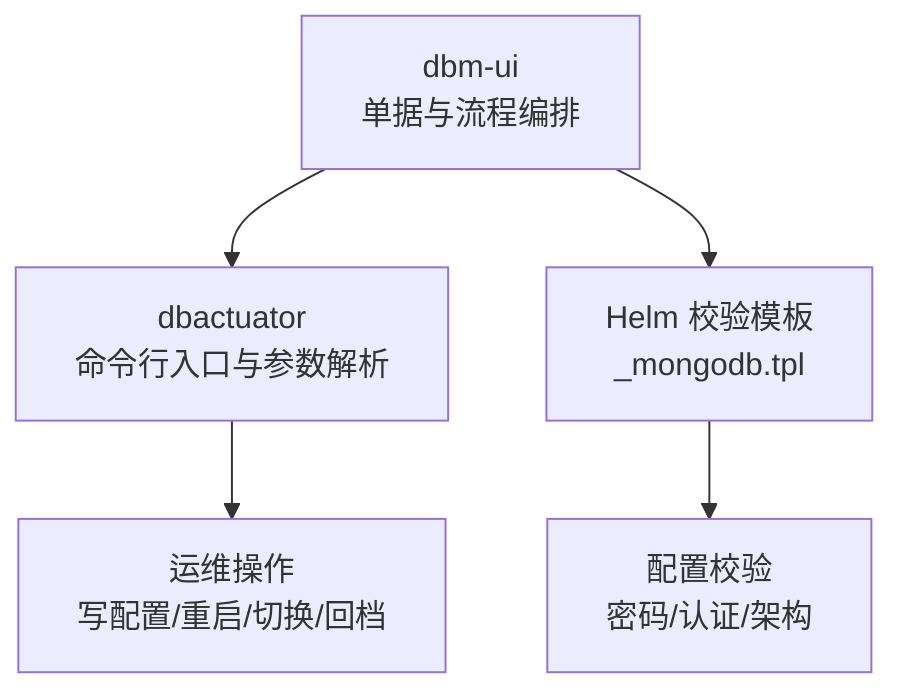
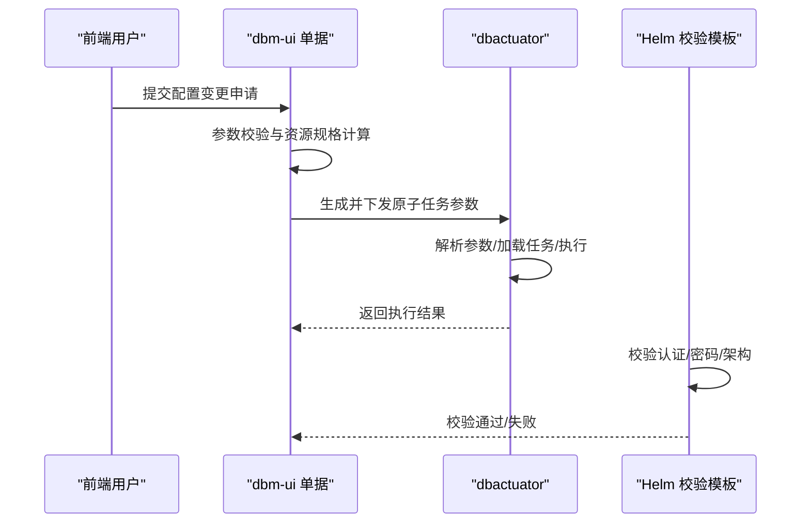
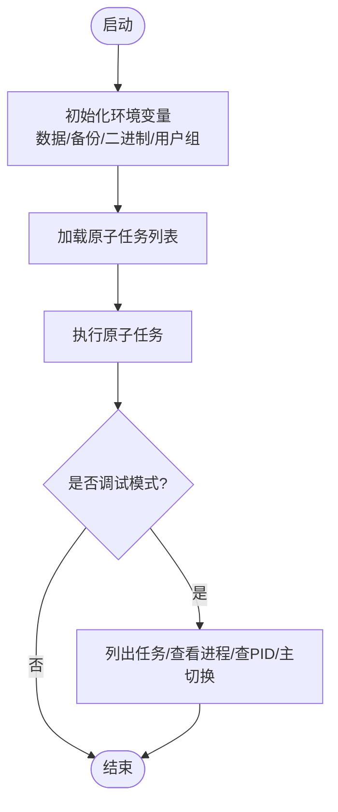
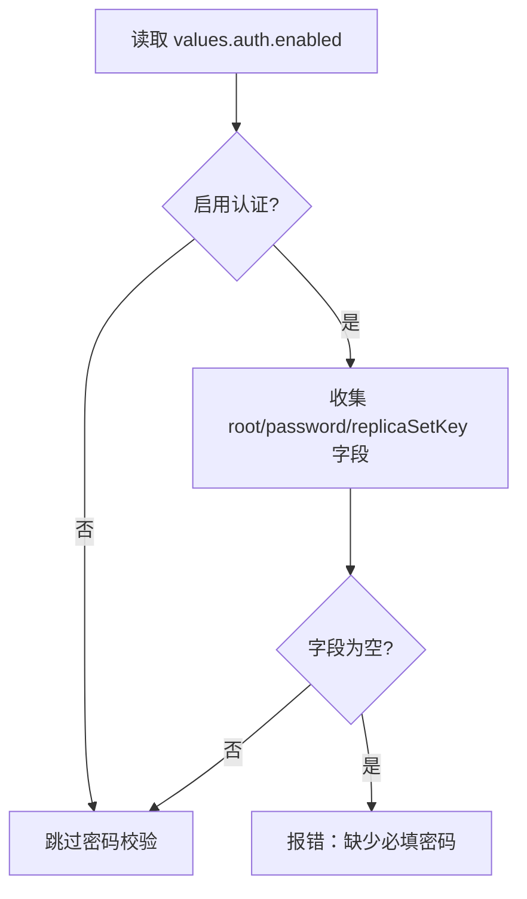
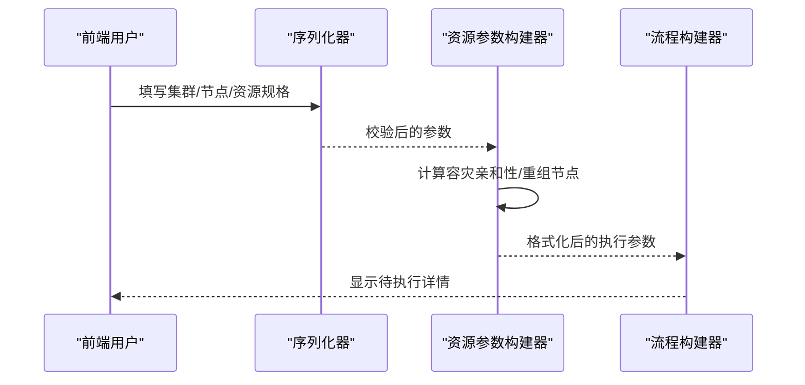

# 配置管理

<cite>
**本文引用的文件**   
- [README.md](file://dbm-services/mongodb/db-tools/dbactuator/README.md)
- [root.go](file://dbm-services/mongodb/db-tools/dbactuator/cmd/root.go)
- [_mongodb.tpl](file://helm-charts/bk-dbm/charts/grafana/charts/common/templates/validations/_mongodb.tpl)
- [_mongodb.tpl](file://helm-charts/bk-dbm/charts/k8s-dbs/charts/common/templates/validations/_mongodb.tpl)
- [mongo_shard_apply.py](file://dbm-ui/backend/ticket/builders/mongodb/mongo_shard_apply.py)
- [mongo_scale_updown.py](file://dbm-ui/backend/ticket/builders/mongodb/mongo_scale_updown.py)
- [mongo_shard_add_shard_nodes.py](file://dbm-ui/backend/ticket/builders/mongodb/mongo_shard_add_shard_nodes.py)
- [mongo_replicaset_cutoff.py](file://dbm-ui/backend/ticket/builders/mongodb/mongo_replicaset_cutoff.py)
- [mongo_restore.py](file://dbm-ui/backend/ticket/builders/mongodb/mongo_restore.py)
</cite>

## 目录
1. [简介](#简介)
2. [项目结构](#项目结构)
3. [核心组件](#核心组件)
4. [架构总览](#架构总览)
5. [详细组件分析](#详细组件分析)
6. [依赖关系分析](#依赖关系分析)
7. [性能与调优](#性能与调优)
8. [故障排查指南](#故障排查指南)
9. [结论](#结论)
10. [附录](#附录)

## 简介
本文件面向 MongoDB 配置管理能力，系统化梳理从“配置文件编辑、参数调整、动态更新”到“验证、热更新与回滚”的全链路流程，并结合仓库中已有的工具与前端单据编排能力，给出可落地的操作步骤与最佳实践。内容涵盖：
- 核心配置参数类别与调优方向（存储、网络、分片、副本集等）
- 不同部署模式下的配置模板与参数建议
- 配置验证、热更新与回滚机制
- 性能调优、内存管理与网络优化
- 配置变更的审批、测试与上线发布流程

## 项目结构
围绕 MongoDB 配置管理，本仓库的关键位置包括：
- 后端运维编排：dbm-ui 中的 MongoDB 单据构建器，负责将业务需求转化为资源与执行参数
- 原子执行器：dbactuator 提供命令行入口与参数解析，承载具体配置写入、服务重启、切换等动作
- Helm Chart 校验模板：提供 MongoDB 密码、认证、架构等校验逻辑，保障配置正确性
- 前端单据：定义不同场景（新建、扩容、回档、替换等）的参数与流程

图表来源
- [root.go:88-126](file://dbm-services/mongodb/db-tools/dbactuator/cmd/root.go#L88-L126)
- [_mongodb.tpl:1-108](file://helm-charts/bk-dbm/charts/grafana/charts/common/templates/validations/_mongodb.tpl#L1-L108)
- [mongo_shard_apply.py:75-105](file://dbm-ui/backend/ticket/builders/mongodb/mongo_shard_apply.py#L75-L105)

章节来源
- [README.md:1-36](file://dbm-services/mongodb/db-tools/dbactuator/README.md#L1-L36)
- [root.go:88-126](file://dbm-services/mongodb/db-tools/dbactuator/cmd/root.go#L88-L126)

## 核心组件
- dbactuator 命令行入口与参数解析
  - 提供统一入口，支持通过 payload/payload_file 指定原子任务参数，支持多任务串并联执行
  - 支持调试模式，便于定位端口、进程、主切等现场问题
- Helm 校验模板
  - 对 MongoDB 认证、密码、架构等进行必填校验，避免错误配置进入生产
- 前端单据编排
  - 将业务需求（新建、扩容、回档、替换等）转换为资源规格与执行参数，驱动后端执行器

章节来源
- [README.md:1-36](file://dbm-services/mongodb/db-tools/dbactuator/README.md#L1-L36)
- [root.go:216-258](file://dbm-services/mongodb/db-tools/dbactuator/cmd/root.go#L216-L258)
- [_mongodb.tpl:1-108](file://helm-charts/bk-dbm/charts/grafana/charts/common/templates/validations/_mongodb.tpl#L1-L108)

## 架构总览
下图展示从“前端单据”到“dbactuator 执行”，再到“Helm 校验”的整体流程。

图表来源
- [root.go:94-125](file://dbm-services/mongodb/db-tools/dbactuator/cmd/root.go#L94-L125)
- [_mongodb.tpl:23-46](file://helm-charts/bk-dbm/charts/grafana/charts/common/templates/validations/_mongodb.tpl#L23-L46)

## 详细组件分析

### 组件A：dbactuator 命令行与参数解析
- 入口职责
  - 初始化环境变量（数据目录、备份目录、二进制目录、运行用户/组）
  - 加载原子任务列表，按顺序执行
  - 支持调试模式：列出任务、查看进程、按端口查询 PID、触发主切换等
- 关键参数
  - 数据目录、备份目录、二进制目录、用户/组、payload/payload_file、原子任务列表等
- 调试能力
  - 列出可用原子任务
  - 查看进程
  - 通过端口获取 PID
  - 触发主切换（stepDown）

图表来源
- [root.go:60-84](file://dbm-services/mongodb/db-tools/dbactuator/cmd/root.go#L60-L84)
- [root.go:128-214](file://dbm-services/mongodb/db-tools/dbactuator/cmd/root.go#L128-L214)

章节来源
- [README.md:1-36](file://dbm-services/mongodb/db-tools/dbactuator/README.md#L1-L36)
- [root.go:88-126](file://dbm-services/mongodb/db-tools/dbactuator/cmd/root.go#L88-L126)
- [root.go:216-258](file://dbm-services/mongodb/db-tools/dbactuator/cmd/root.go#L216-L258)

### 组件B：Helm 校验模板（MongoDB）
- 校验范围
  - 认证开关、根密码、用户名/库、副本集密钥等字段的必填性
  - 架构为副本集时的额外密钥校验
- 使用方式
  - 在 Helm values 中启用 MongoDB 并配置认证，模板自动校验缺失项

图表来源
- [_mongodb.tpl:23-46](file://helm-charts/bk-dbm/charts/grafana/charts/common/templates/validations/_mongodb.tpl#L23-L46)
- [_mongodb.tpl:24-46](file://helm-charts/bk-dbm/charts/k8s-dbs/charts/common/templates/validations/_mongodb.tpl#L24-L46)

章节来源
- [_mongodb.tpl:1-108](file://helm-charts/bk-dbm/charts/grafana/charts/common/templates/validations/_mongodb.tpl#L1-L108)
- [_mongodb.tpl:24-94](file://helm-charts/bk-dbm/charts/k8s-dbs/charts/common/templates/validations/_mongodb.tpl#L24-L94)

### 组件C：前端单据编排（MongoDB）
- 新建分片集群
  - 计算资源规格、容灾亲和性、zone 列表
  - 重组节点信息，确保后续执行器可识别
- 容量变更（扩容/缩容）
  - 基于分片数与节点数计算资源规格
  - 应用容灾亲和性策略
- 扩容 shard 节点数
  - 保持城市一致性，不强制亲和性
  - 将节点按分片归组
- 副本集替换
  - 为新机器补充城市与亲和性
- 回档
  - 生成临时集群名与部署参数，固定分片节点数为 1

图表来源
- [mongo_shard_apply.py:75-105](file://dbm-ui/backend/ticket/builders/mongodb/mongo_shard_apply.py#L75-L105)
- [mongo_scale_updown.py:73-100](file://dbm-ui/backend/ticket/builders/mongodb/mongo_scale_updown.py#L73-L100)
- [mongo_shard_add_shard_nodes.py:63-128](file://dbm-ui/backend/ticket/builders/mongodb/mongo_shard_add_shard_nodes.py#L63-L128)
- [mongo_replicaset_cutoff.py:31-50](file://dbm-ui/backend/ticket/builders/mongodb/mongo_replicaset_cutoff.py#L31-L50)
- [mongo_restore.py:209-237](file://dbm-ui/backend/ticket/builders/mongodb/mongo_restore.py#L209-L237)

章节来源
- [mongo_shard_apply.py:75-105](file://dbm-ui/backend/ticket/builders/mongodb/mongo_shard_apply.py#L75-L105)
- [mongo_scale_updown.py:73-100](file://dbm-ui/backend/ticket/builders/mongodb/mongo_scale_updown.py#L73-L100)
- [mongo_shard_add_shard_nodes.py:63-128](file://dbm-ui/backend/ticket/builders/mongodb/mongo_shard_add_shard_nodes.py#L63-L128)
- [mongo_replicaset_cutoff.py:31-50](file://dbm-ui/backend/ticket/builders/mongodb/mongo_replicaset_cutoff.py#L31-L50)
- [mongo_restore.py:209-237](file://dbm-ui/backend/ticket/builders/mongodb/mongo_restore.py#L209-L237)

## 依赖关系分析
- 前端单据依赖 dbactuator 的原子任务参数格式与执行语义
- Helm 校验模板依赖 values 中的认证与架构配置
- dbactuator 通过命令行参数与 payload 文件对接单据编排

图表来源
- [root.go:94-125](file://dbm-services/mongodb/db-tools/dbactuator/cmd/root.go#L94-L125)
- [_mongodb.tpl:23-46](file://helm-charts/bk-dbm/charts/grafana/charts/common/templates/validations/_mongodb.tpl#L23-L46)

章节来源
- [root.go:94-125](file://dbm-services/mongodb/db-tools/dbactuator/cmd/root.go#L94-L125)
- [_mongodb.tpl:1-108](file://helm-charts/bk-dbm/charts/grafana/charts/common/templates/validations/_mongodb.tpl#L1-L108)

## 性能与调优
以下为通用调优方向与建议，便于在配置文件中落地。由于本仓库未直接提供具体参数样例，建议结合业务负载与硬件资源，按需调整并纳入变更流程。

- 存储层
  - 日志与数据分离磁盘，降低 IO 抖动
  - 合理设置日志组大小与 fsync 策略
  - oplog 占比与容量按峰值写入与恢复窗口评估
- 网络层
  - 限制连接数与超时时间，避免突发流量冲击
  - 合理设置 keepalive 与套接字缓冲区
- 内存管理
  - 为 mongod 预留足够内存，避免频繁换页
  - 合理设置缓存命中率目标，平衡读写性能
- 分片与副本集
  - 副本集节点数控制在 3/5 以内，避免仲裁成本
  - 分片键选择与热点规避，定期均衡
- 动态配置
  - 优先使用支持热生效的参数；对不支持热生效的参数，结合滚动重启策略
  - 变更前做好备份与回滚预案

## 故障排查指南
- 端口与进程
  - 使用调试模式按端口查询 PID，确认监听状态
- 主切换
  - 在调试模式下触发主切换，观察切换结果与超时处理
- 配置校验
  - 若 Helm 渲染失败，检查认证开关与密码字段是否齐全
- 执行失败
  - 检查 payload 参数格式与必要字段是否完整
  - 查看执行器日志与返回码，定位具体原子任务

章节来源
- [root.go:145-206](file://dbm-services/mongodb/db-tools/dbactuator/cmd/root.go#L145-L206)
- [_mongodb.tpl:23-46](file://helm-charts/bk-dbm/charts/grafana/charts/common/templates/validations/_mongodb.tpl#L23-L46)

## 结论
本仓库提供了 MongoDB 配置管理的前端编排、执行器与 Helm 校验三类关键能力。通过单据编排将业务需求转化为标准化参数，借助 dbactuator 执行原子任务，配合 Helm 校验模板确保配置正确性，形成“可审计、可验证、可回滚”的配置管理闭环。建议在实际落地中，将核心参数调优纳入变更流程，并配套压测与演练，确保变更安全可控。

## 附录

### 不同部署模式下的配置模板与参数建议
- 副本集模式
  - 必填：认证开关、根密码、副本集密钥
  - 建议：节点数为 3 或 5；oplog 占比按峰值写入与恢复窗口评估
- 分片集群模式
  - 必填：认证开关、根密码、用户名/库
  - 建议：分片键设计避免热点；mongos 数量与负载匹配
- 单机模式
  - 必填：认证开关与根密码
  - 建议：仅用于测试或小规模场景，避免生产风险

章节来源
- [_mongodb.tpl:23-46](file://helm-charts/bk-dbm/charts/grafana/charts/common/templates/validations/_mongodb.tpl#L23-L46)
- [_mongodb.tpl:24-46](file://helm-charts/bk-dbm/charts/k8s-dbs/charts/common/templates/validations/_mongodb.tpl#L24-L46)

### 配置验证、热更新与回滚机制
- 验证
  - 前端单据：参数校验与资源规格计算
  - Helm 校验：认证/密码/架构必填校验
- 热更新
  - 优先采用支持热生效的参数；对不支持热生效的参数，制定滚动更新与回滚策略
- 回滚
  - 变更前备份配置与数据；失败时快速回退至上一稳定版本

章节来源
- [mongo_shard_apply.py:75-105](file://dbm-ui/backend/ticket/builders/mongodb/mongo_shard_apply.py#L75-L105)
- [mongo_scale_updown.py:73-100](file://dbm-ui/backend/ticket/builders/mongodb/mongo_scale_updown.py#L73-L100)
- [_mongodb.tpl:23-46](file://helm-charts/bk-dbm/charts/grafana/charts/common/templates/validations/_mongodb.tpl#L23-L46)

### 配置变更的审批、测试与上线发布标准操作程序
- 审批
  - 单据提交时完成参数与资源规格校验
  - 关键参数变更需双人复核
- 测试
  - 预生产环境验证配置与性能
  - 回档/切换演练验证回滚有效性
- 上线
  - 制定灰度策略与回滚窗口
  - 执行后监控指标与告警，异常时立即回滚

章节来源
- [mongo_restore.py:209-237](file://dbm-ui/backend/ticket/builders/mongodb/mongo_restore.py#L209-L237)
- [mongo_replicaset_cutoff.py:31-50](file://dbm-ui/backend/ticket/builders/mongodb/mongo_replicaset_cutoff.py#L31-L50)