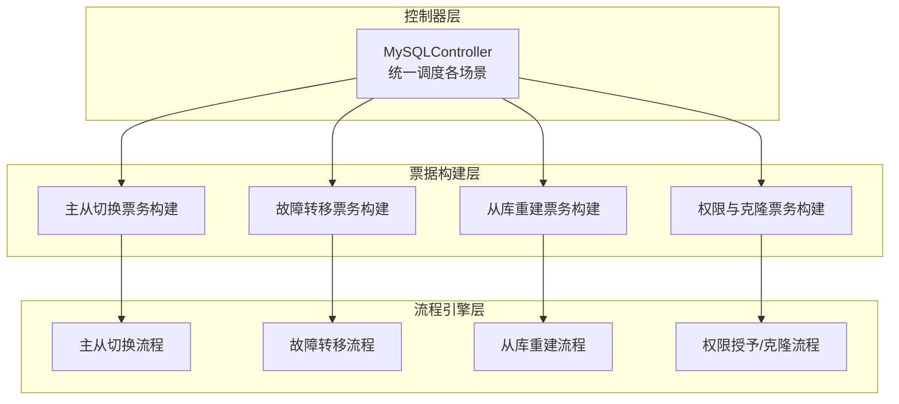
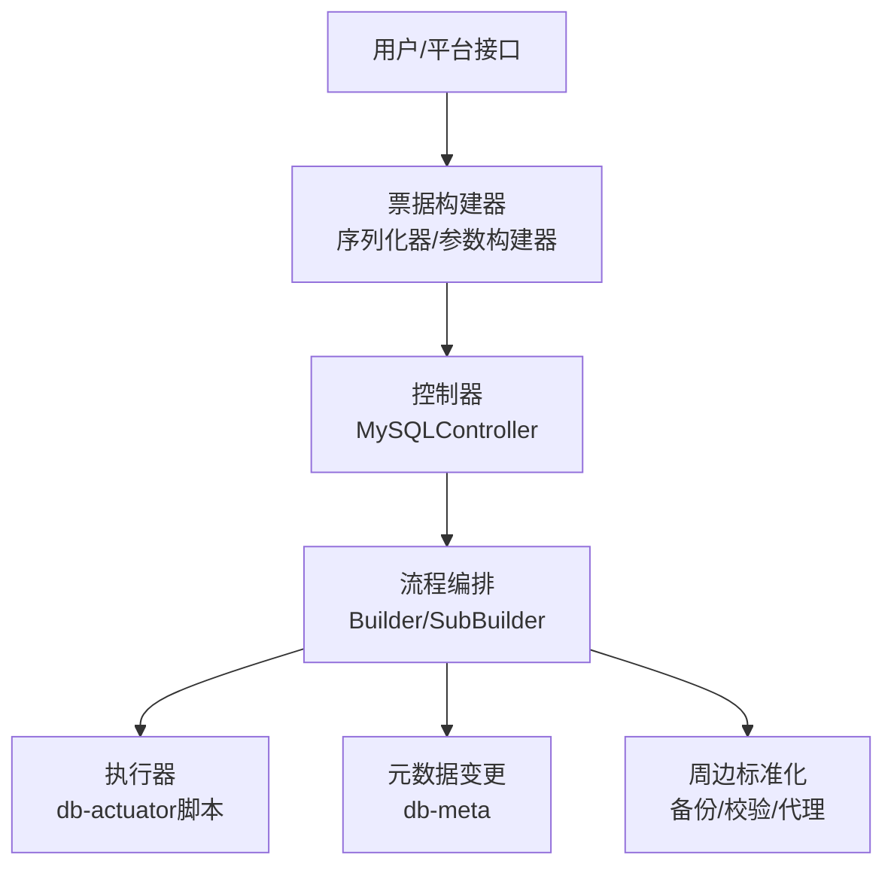
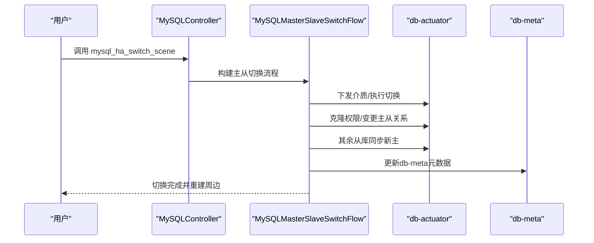
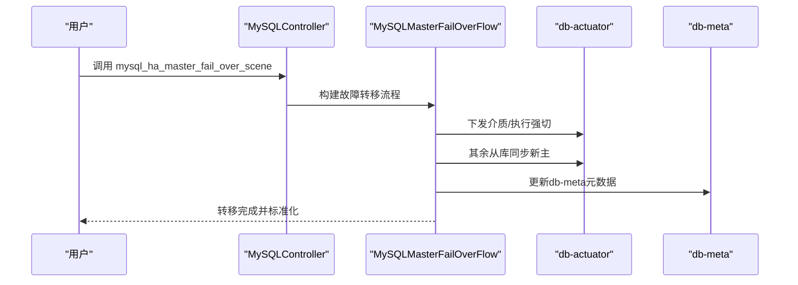
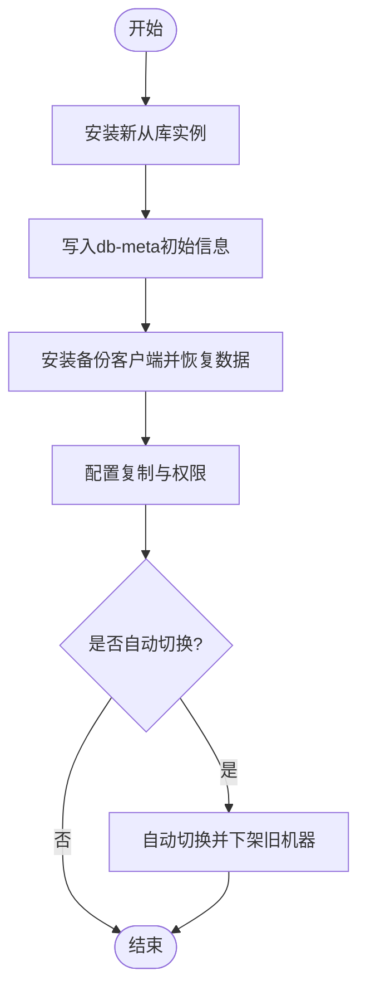
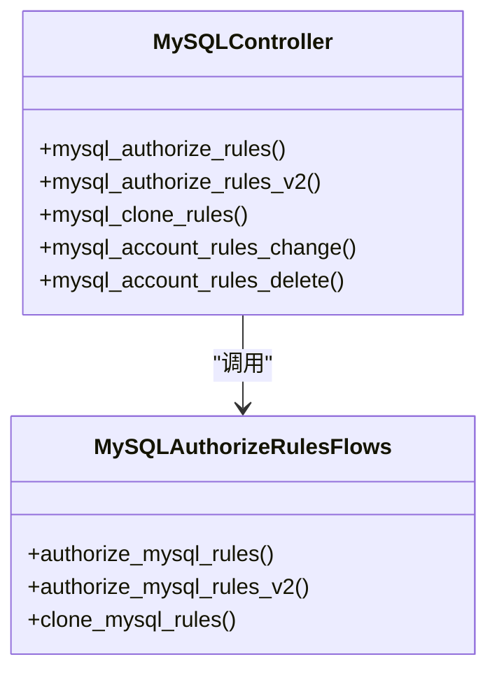
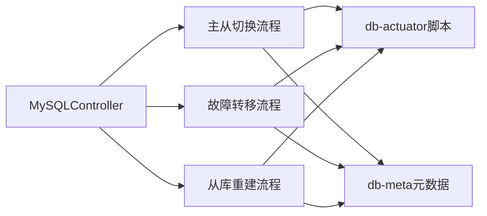

# MySQL复制管理

<cite>
**本文引用的文件**
- [dbm-ui/backend/flow/engine/controller/mysql.py](file://dbm-ui/backend/flow/engine/controller/mysql.py)
- [dbm-ui/backend/flow/engine/bamboo/scene/mysql/mysql_master_slave_switch.py](file://dbm-ui/backend/flow/engine/bamboo/scene/mysql/mysql_master_slave_switch.py)
- [dbm-ui/backend/flow/engine/bamboo/scene/mysql/mysql_master_fail_over.py](file://dbm-ui/backend/flow/engine/bamboo/scene/mysql/mysql_master_fail_over.py)
- [dbm-ui/backend/flow/engine/bamboo/scene/mysql/mysql_restore_slave_remote_flow.py](file://dbm-ui/backend/flow/engine/bamboo/scene/mysql/mysql_restore_slave_remote_flow.py)
- [dbm-ui/backend/ticket/builders/mysql/mysql_master_slave_switch.py](file://dbm-ui/backend/ticket/builders/mysql/mysql_master_slave_switch.py)
- [dbm-ui/backend/ticket/builders/mysql/mysql_master_fail_over.py](file://dbm-ui/backend/ticket/builders/mysql/mysql_master_fail_over.py)
- [dbm-ui/backend/ticket/builders/mysql/mysql_restore_slave.py](file://dbm-ui/backend/ticket/builders/mysql/mysql_restore_slave.py)
- [dbm-ui/backend/ticket/builders/mysql/mysql_restore_local_slave.py](file://dbm-ui/backend/ticket/builders/mysql/mysql_restore_local_slave.py)
- [dbm-ui/backend/ticket/builders/mysql/dbha_autofix/mysql_dbha_af_repair_replicate.py](file://dbm-ui/backend/ticket/builders/mysql/dbha_autofix/mysql_dbha_af_repair_replicate.py)
- [dbm-ui/backend/ticket/tasks/ticket_tasks.py](file://dbm-ui/backend/ticket/tasks/ticket_tasks.py)
- [dbm-ui/backend/ticket/builders/mysql/mysql_add_slave.py](file://dbm-ui/backend/ticket/builders/mysql/mysql_add_slave.py)
- [dbm-ui/backend/ticket/builders/mysql/mysql_migrate_cluster.py](file://dbm-ui/backend/ticket/builders/mysql/mysql_migrate_cluster.py)
- [dbm-ui/backend/ticket/builders/mysql/mysql_migrate_upgrade.py](file://dbm-ui/backend/ticket/builders/mysql/mysql_migrate_upgrade.py)
- [dbm-ui/backend/ticket/builders/mysql/mysql_clone_rules.py](file://dbm-ui/backend/ticket/builders/mysql/mysql_clone_rules.py)
- [dbm-ui/backend/ticket/builders/mysql/mysql_priv_change.py](file://dbm-ui/backend/ticket/builders/mysql/mysql_priv_change.py)
- [dbm-ui/backend/ticket/builders/mysql/mysql_failover_drill.py](file://dbm-ui/backend/ticket/builders/mysql/mysql_failover_drill.py)
- [dbm-ui/backend/flow/engine/bamboo/scene/mysql/mysql_ha_apply_flow.py](file://dbm-ui/backend/flow/engine/bamboo/scene/mysql/mysql_ha_apply_flow.py)
- [dbm-ui/backend/ticket/builders/mysql/mysql_ha_apply.py](file://dbm-ui/backend/ticket/builders/mysql/mysql_ha_apply.py)
- [dbm-ui/backend/flow/engine/bamboo/scene/mysql/mysql_ha_destroy_flow.py](file://dbm-ui/backend/flow/engine/bamboo/scene/mysql/mysql_ha_destroy_flow.py)
- [dbm-ui/backend/flow/engine/bamboo/scene/mysql/mysql_ha_disable_flow.py](file://dbm-ui/backend/flow/engine/bamboo/scene/mysql/mysql_ha_disable_flow.py)
- [dbm-ui/backend/flow/engine/bamboo/scene/mysql/mysql_ha_enable_flow.py](file://dbm-ui/backend/flow/engine/bamboo/scene/mysql/mysql_ha_enable_flow.py)
- [dbm-ui/backend/flow/engine/bamboo/scene/mysql/mysql_single_apply_flow.py](file://dbm-ui/backend/flow/engine/bamboo/scene/mysql/mysql_single_apply_flow.py)
- [dbm-ui/backend/flow/engine/bamboo/scene/mysql/mysql_single_destroy_flow.py](file://dbm-ui/backend/flow/engine/bamboo/scene/mysql/mysql_single_destroy_flow.py)
- [dbm-ui/backend/flow/engine/bamboo/scene/mysql/mysql_single_disable_flow.py](file://dbm-ui/backend/flow/engine/bamboo/scene/mysql/mysql_single_disable_flow.py)
- [dbm-ui/backend/flow/engine/bamboo/scene/mysql/mysql_single_enable_flow.py](file://dbm-ui/backend/flow/engine/bamboo/scene/mysql/mysql_single_enable_flow.py)
- [dbm-ui/backend/flow/engine/bamboo/scene/mysql/mysql_proxy_cluster_add.py](file://dbm-ui/backend/flow/engine/bamboo/scene/mysql/mysql_proxy_cluster_add.py)
- [dbm-ui/backend/flow/engine/bamboo/scene/mysql/mysql_proxy_cluster_reduce.py](file://dbm-ui/backend/flow/engine/bamboo/scene/mysql/mysql_proxy_cluster_reduce.py)
- [dbm-ui/backend/flow/engine/bamboo/scene/mysql/mysql_proxy_cluster_switch.py](file://dbm-ui/backend/flow/engine/bamboo/scene/mysql/mysql_proxy_cluster_switch.py)
- [dbm-ui/backend/flow/engine/bamboo/scene/mysql/mysql_proxy_switch_for_extend.py](file://dbm-ui/backend/flow/engine/bamboo/scene/mysql/mysql_proxy_switch_for_extend.py)
- [dbm-ui/backend/flow/engine/bamboo/scene/mysql/mysql_proxy_switch_for_migrate.py](file://dbm-ui/backend/flow/engine/bamboo/scene/mysql/mysql_proxy_switch_for_migrate.py)
- [dbm-ui/backend/flow/engine/bamboo/scene/mysql/mysql_proxy_upgrade.py](file://dbm-ui/backend/flow/engine/bamboo/scene/mysql/mysql_proxy_upgrade.py)
- [dbm-ui/backend/flow/engine/bamboo/scene/mysql/mysql_upgrade.py](file://dbm-ui/backend/flow/engine/bamboo/scene/mysql/mysql_upgrade.py)
- [dbm-ui/backend/flow/engine/bamboo/scene/mysql/mysql_data_migrate_flow.py](file://dbm-ui/backend/flow/engine/bamboo/scene/mysql/mysql_data_migrate_flow.py)
- [dbm-ui/backend/flow/engine/bamboo/scene/mysql/mysql_db_table_backup.py](file://dbm-ui/backend/flow/engine/bamboo/scene/mysql/mysql_db_table_backup.py)
- [dbm-ui/backend/flow/engine/bamboo/scene/mysql/mysql_full_backup_flow.py](file://dbm-ui/backend/flow/engine/bamboo/scene/mysql/mysql_full_backup_flow.py)
- [dbm-ui/backend/flow/engine/bamboo/scene/mysql/mysql_partition.py](file://dbm-ui/backend/flow/engine/bamboo/scene/mysql/mysql_partition.py)
- [dbm-ui/backend/flow/engine/bamboo/scene/mysql/mysql_partition_cron.py](file://dbm-ui/backend/flow/engine/bamboo/scene/mysql/mysql_partition_cron.py)
- [dbm-ui/backend/flow/engine/bamboo/scene/mysql/mysql_partition_v2_flow.py](file://dbm-ui/backend/flow/engine/bamboo/scene/mysql/mysql_partition_v2_flow.py)
- [dbm-ui/backend/flow/engine/bamboo/scene/mysql/mysql_truncate_flow.py](file://dbm-ui/backend/flow/engine/bamboo/scene/mysql/mysql_truncate_flow.py)
- [dbm-ui/backend/flow/engine/bamboo/scene/mysql/mysql_rename_database_flow.py](file://dbm-ui/backend/flow/engine/bamboo/scene/mysql/mysql_rename_database_flow.py)
- [dbm-ui/backend/flow/engine/bamboo/scene/mysql/mysql_random_password.py](file://dbm-ui/backend/flow/engine/bamboo/scene/mysql/mysql_random_password.py)
- [dbm-ui/backend/flow/engine/bamboo/scene/mysql/mysql_open_area_flow.py](file://dbm-ui/backend/flow/engine/bamboo/scene/mysql/mysql_open_area_flow.py)
- [dbm-ui/backend/flow/engine/bamboo/scene/mysql/mysql_checksum.py](file://dbm-ui/backend/flow/engine/bamboo/scene/mysql/mysql_checksum.py)
- [dbm-ui/backend/flow/engine/bamboo/scene/mysql/mysql_pt_table_sync.py](file://dbm-ui/backend/flow/engine/bamboo/scene/mysql/mysql_pt_table_sync.py)
- [dbm-ui/backend/flow/engine/bamboo/scene/mysql/mysql_flashback_flow.py](file://dbm-ui/backend/flow/engine/bamboo/scene/mysql/mysql_flashback_flow.py)
- [dbm-ui/backend/flow/engine/bamboo/scene/mysql/mysql_clone_cluster_flow.py](file://dbm-ui/backend/flow/engine/bamboo/scene/mysql/mysql_clone_cluster_flow.py)
- [dbm-ui/backend/flow/engine/bamboo/scene/mysql/mysql_rollback_data_flow.py](file://dbm-ui/backend/flow/engine/bamboo/scene/mysql/mysql_rollback_data_flow.py)
- [dbm-ui/backend/flow/engine/bamboo/scene/mysql/mysql_machine_clear_flow.py](file://dbm-ui/backend/flow/engine/bamboo/scene/mysql/mysql_machine_clear_flow.py)
- [dbm-ui/backend/flow/engine/bamboo/scene/mysql/mysql_ha_upgrade.py](file://dbm-ui/backend/flow/engine/bamboo/scene/mysql/mysql_ha_upgrade.py)
- [dbm-ui/backend/flow/engine/bamboo/scene/mysql/mysql_migrate_single_flow.py](file://dbm-ui/backend/flow/engine/bamboo/scene/mysql/mysql_migrate_single_flow.py)
- [dbm-ui/backend/flow/engine/bamboo/scene/mysql/mysql_migrate_cluster_remote_flow.py](file://dbm-ui/backend/flow/engine/bamboo/scene/mysql/mysql_migrate_cluster_remote_flow.py)
- [dbm-ui/backend/flow/engine/bamboo/scene/mysql/mysql_authorize_rules.py](file://dbm-ui/backend/flow/engine/bamboo/scene/mysql/mysql_authorize_rules.py)
- [dbm-ui/backend/flow/engine/bamboo/scene/mysql/mysql_clone_cluster_flow.py](file://dbm-ui/backend/flow/engine/bamboo/scene/mysql/mysql_clone_cluster_flow.py)
- [dbm-ui/backend/flow/engine/bamboo/scene/mysql/autofix/mysql_dbha_af_event_register_flow.py](file://dbm-ui/backend/flow/engine/bamboo/scene/mysql/autofix/mysql_dbha_af_event_register_flow.py)
- [dbm-ui/backend/flow/engine/bamboo/scene/mysql/autofix/mysql_dbha_af_repair_replicate.py](file://dbm-ui/backend/flow/engine/bamboo/scene/mysql/autofix/mysql_dbha_af_repair_replicate.py)
- [dbm-ui/backend/flow/engine/bamboo/scene/common/failover_drill_flow.py](file://dbm-ui/backend/flow/engine/bamboo/scene/common/failover_drill_flow.py)
- [dbm-ui/backend/flow/engine/bamboo/scene/common/download_dbactor.py](file://dbm-ui/backend/flow/engine/bamboo/scene/common/download_dbactor.py)
- [dbm-ui/backend/flow/engine/bamboo/scene/common/download_file.py](file://dbm-ui/backend/flow/engine/bamboo/scene/common/download_file.py)
- [dbm-ui/backend/flow/engine/bamboo/scene/mysql/import_sqlfile_flow.py](file://dbm-ui/backend/flow/engine/bamboo/scene/mysql/import_sqlfile_flow.py)
- [dbm-ui/backend/flow/engine/bamboo/scene/mysql/dbconsole.py](file://dbm-ui/backend/flow/engine/bamboo/scene/mysql/dbconsole.py)
- [dbm-ui/backend/flow/engine/bamboo/scene/mysql/deploy_peripheraltools/flow.py](file://dbm-ui/backend/flow/engine/bamboo/scene/mysql/deploy_peripheraltools/flow.py)
- [dbm-ui/backend/flow/engine/bamboo/scene/mysql/revoke/mysql_ha_apply_revoke_flow.py](file://dbm-ui/backend/flow/engine/bamboo/scene/mysql/revoke/mysql_ha_apply_revoke_flow.py)
- [dbm-ui/backend/flow/engine/bamboo/scene/mysql/revoke/mysql_single_apply_revoke_flow.py](file://dbm-ui/backend/flow/engine/bamboo/scene/mysql/revoke/mysql_single_apply_revoke_flow.py)
- [dbm-ui/backend/flow/engine/bamboo/scene/mysql/validate/mysql_local_upgrade_validator.py](file://dbm-ui/backend/flow/engine/bamboo/scene/mysql/validate/mysql_local_upgrade_validator.py)
- [dbm-ui/backend/flow/engine/bamboo/scene/mysql/validate/mysql_proxy_add_validator.py](file://dbm-ui/backend/flow/engine/bamboo/scene/mysql/validate/mysql_proxy_add_validator.py)
- [dbm-ui/backend/flow/engine/bamboo/scene/mysql/validate/mysql_proxy_reduce_validator.py](file://dbm-ui/backend/flow/engine/bamboo/scene/mysql/validate/mysql_proxy_reduce_validator.py)
- [dbm-ui/backend/flow/engine/bamboo/scene/mysql/validate/mysql_proxy_switch_for_extend_validator.py](file://dbm-ui/backend/flow/engine/bamboo/scene/mysql/validate/mysql_proxy_switch_for_extend_validator.py)
- [dbm-ui/backend/flow/engine/bamboo/scene/mysql/validate/mysql_proxy_switch_for_migrate_ins_validator.py](file://dbm-ui/backend/flow/engine/bamboo/scene/mysql/validate/mysql_proxy_switch_for_migrate_ins_validator.py)
- [dbm-ui/backend/flow/engine/bamboo/scene/mysql/validate/mysql_proxy_switch_for_migrate_validator.py](file://dbm-ui/backend/flow/engine/bamboo/scene/mysql/validate/mysql_proxy_switch_for_migrate_validator.py)
- [dbm-ui/backend/flow/engine/bamboo/scene/mysql/validate/mysql_proxy_switch_validator.py](file://dbm-ui/backend/flow/engine/bamboo/scene/mysql/validate/mysql_proxy_switch_validator.py)
- [dbm-ui/backend/flow/engine/bamboo/scene/mysql/validate/mysql_proxy_upgrade_validator.py](file://dbm-ui/backend/flow/engine/bamboo/scene/mysql/validate/mysql_proxy_upgrade_validator.py)
- [dbm-ui/backend/flow/engine/bamboo/scene/mysql/validate/mysql_rollback_validator.py](file://dbm-ui/backend/flow/engine/bamboo/scene/mysql/validate/mysql_rollback_validator.py)
- [dbm-ui/backend/flow/engine/bamboo/scene/mysql/validate/tendbha_upgrade_validator.py](file://dbm-ui/backend/flow/engine/bamboo/scene/mysql/validate/tendbha_upgrade_validator.py)
- [dbm-ui/backend/flow/engine/bamboo/scene/mysql/validate/tendbsingle_migrate_validator.py](file://dbm-ui/backend/flow/engine/bamboo/scene/mysql/validate/tendbsingle_migrate_validator.py)
- [dbm-ui/backend/flow/engine/controller/base.py](file://dbm-ui/backend/flow/engine/controller/base.py)
- [dbm-ui/backend/flow/engine/bamboo/scene/common/account_rule_manage.py](file://dbm-ui/backend/flow/engine/bamboo/scene/common/account_rule_manage.py)
- [dbm-ui/backend/flow/engine/bamboo/scene/common/transfer_cluster_to_other_biz.py](file://dbm-ui/backend/flow/engine/bamboo/scene/common/transfer_cluster_to_other_biz.py)
- [dbm-ui/backend/flow/engine/bamboo/scene/mysql/mysql_authorize_rules.py](file://dbm-ui/backend/flow/engine/bamboo/scene/mysql/mysql_authorize_rules.py)
- [dbm-ui/backend/flow/engine/bamboo/scene/mysql/mysql_clone_cluster_flow.py](file://dbm-ui/backend/flow/engine/bamboo/scene/mysql/mysql_clone_cluster_flow.py)
- [dbm-ui/backend/flow/engine/bamboo/scene/mysql/mysql_data_migrate_flow.py](file://dbm-ui/backend/flow/engine/bamboo/scene/mysql/mysql_data_migrate_flow.py)
- [dbm-ui/backend/flow/engine/bamboo/scene/mysql/mysql_db_table_backup.py](file://dbm-ui/backend/flow/engine/bamboo/scene/mysql/mysql_db_table_backup.py)
- [dbm-ui/backend/flow/engine/bamboo/scene/mysql/mysql_full_backup_flow.py](file://dbm-ui/backend/flow/engine/bamboo/scene/mysql/mysql_full_backup_flow.py)
- [dbm-ui/backend/flow/engine/bamboo/scene/mysql/mysql_partition.py](file://dbm-ui/backend/flow/engine/bamboo/scene/mysql/mysql_partition.py)
- [dbm-ui/backend/flow/engine/bamboo/scene/mysql/mysql_partition_cron.py](file://dbm-ui/backend/flow/engine/bamboo/scene/mysql/mysql_partition_cron.py)
- [dbm-ui/backend/flow/engine/bamboo/scene/mysql/mysql_partition_v2_flow.py](file://dbm-ui/backend/flow/engine/bamboo/scene/mysql/mysql_partition_v2_flow.py)
- [dbm-ui/backend/flow/engine/bamboo/scene/mysql/mysql_truncate_flow.py](file://dbm-ui/backend/flow/engine/bamboo/scene/mysql/mysql_truncate_flow.py)
- [dbm-ui/backend/flow/engine/bamboo/scene/mysql/mysql_rename_database_flow.py](file://dbm-ui/backend/flow/engine/bamboo/scene/mysql/mysql_rename_database_flow.py)
- [dbm-ui/backend/flow/engine/bamboo/scene/mysql/mysql_random_password.py](file://dbm-ui/backend/flow/engine/bamboo/scene/mysql/mysql_random_password.py)
- [dbm-ui/backend/flow/engine/bamboo/scene/mysql/mysql_open_area_flow.py](file://dbm-ui/backend/flow/engine/bamboo/scene/mysql/mysql_open_area_flow.py)
- [dbm-ui/backend/flow/engine/bamboo/scene/mysql/mysql_checksum.py](file://dbm-ui/backend/flow/engine/bamboo/scene/mysql/mysql_checksum.py)
- [dbm-ui/backend/flow/engine/bamboo/scene/mysql/mysql_pt_table_sync.py](file://dbm-ui/backend/flow/engine/bamboo/scene/mysql/mysql_pt_table_sync.py)
- [dbm-ui/backend/flow/engine/bamboo/scene/mysql/mysql_flashback_flow.py](file://dbm-ui/backend/flow/engine/bamboo/scene/mysql/mysql_flashback_flow.py)
- [dbm-ui/backend/flow/engine/bamboo/scene/mysql/mysql_clone_cluster_flow.py](file://dbm-ui/backend/flow/engine/bamboo/scene/mysql/mysql_clone_cluster_flow.py)
- [dbm-ui/backend/flow/engine/bamboo/scene/mysql/mysql_rollback_data_flow.py](file://dbm-ui/backend/flow/engine/bamboo/scene/mysql/mysql_rollback_data_flow.py)
- [dbm-ui/backend/flow/engine/bamboo/scene/mysql/mysql_machine_clear_flow.py](file://dbm-ui/backend/flow/engine/bamboo/scene/mysql/mysql_machine_clear_flow.py)
- [dbm-ui/backend/flow/engine/bamboo/scene/mysql/mysql_ha_upgrade.py](file://dbm-ui/backend/flow/engine/bamboo/scene/mysql/mysql_ha_upgrade.py)
- [dbm-ui/backend/flow/engine/bamboo/scene/mysql/mysql_migrate_single_flow.py](file://dbm-ui/backend/flow/engine/bamboo/scene/mysql/mysql_migrate_single_flow.py)
- [dbm-ui/backend/flow/engine/bamboo/scene/mysql/mysql_migrate_cluster_remote_flow.py](file://dbm-ui/backend/flow/engine/bamboo/scene/mysql/mysql_migrate_cluster_remote_flow.py)
- [dbm-ui/backend/flow/engine/bamboo/scene/mysql/mysql_authorize_rules.py](file://dbm-ui/backend/flow/engine/bamboo/scene/mysql/mysql_authorize_rules.py)
- [dbm-ui/backend/flow/engine/bamboo/scene/mysql/mysql_clone_cluster_flow.py](file://dbm-ui/backend/flow/engine/bamboo/scene/mysql/mysql_clone_cluster_flow.py)
- [dbm-ui/backend/flow/engine/bamboo/scene/mysql/autofix/mysql_dbha_af_event_register_flow.py](file://dbm-ui/backend/flow/engine/bamboo/scene/mysql/autofix/mysql_dbha_af_event_register_flow.py)
- [dbm-ui/backend/flow/engine/bamboo/scene/mysql/autofix/mysql_dbha_af_repair_replicate.py](file://dbm-ui/backend/flow/engine/bamboo/scene/mysql/autofix/mysql_dbha_af_repair_replicate.py)
- [dbm-ui/backend/flow/engine/bamboo/scene/common/failover_drill_flow.py](file://dbm-ui/backend/flow/engine/bamboo/scene/common/failover_drill_flow.py)
- [dbm-ui/backend/flow/engine/bamboo/scene/common/download_dbactor.py](file://dbm-ui/backend/flow/engine/bamboo/scene/common/download_dbactor.py)
- [dbm-ui/backend/flow/engine/bamboo/scene/common/download_file.py](file://dbm-ui/backend/flow/engine/bamboo/scene/common/download_file.py)
- [dbm-ui/backend/flow/engine/bamboo/scene/mysql/import_sqlfile_flow.py](file://dbm-ui/backend/flow/engine/bamboo/scene/mysql/import_sqlfile_flow.py)
- [dbm-ui/backend/flow/engine/bamboo/scene/mysql/dbconsole.py](file://dbm-ui/backend/flow/engine/bamboo/scene/mysql/dbconsole.py)
- [dbm-ui/backend/flow/engine/bamboo/scene/mysql/deploy_peripheraltools/flow.py](file://dbm-ui/backend/flow/engine/bamboo/scene/mysql/deploy_peripheraltools/flow.py)
- [dbm-ui/backend/flow/engine/bamboo/scene/mysql/revoke/mysql_ha_apply_revoke_flow.py](file://dbm-ui/backend/flow/engine/bamboo/scene/mysql/revoke/mysql_ha_apply_revoke_flow.py)
- [dbm-ui/backend/flow/engine/bamboo/scene/mysql/revoke/mysql_single_apply_revoke_flow.py](file://dbm-ui/backend/flow/engine/bamboo/scene/mysql/revoke/mysql_single_apply_revoke_flow.py)
- [dbm-ui/backend/flow/engine/bamboo/scene/mysql/validate/mysql_local_upgrade_validator.py](file://dbm-ui/backend/flow/engine/bamboo/scene/mysql/validate/mysql_local_upgrade_validator.py)
- [dbm-ui/backend/flow/engine/bamboo/scene/mysql/validate/mysql_proxy_add_validator.py](file://dbm-ui/backend/flow/engine/bamboo/scene/mysql/validate/mysql_proxy_add_validator.py)
- [dbm-ui/backend/flow/engine/bamboo/scene/mysql/validate/mysql_proxy_reduce_validator.py](file://dbm-ui/backend/flow/engine/bamboo/scene/mysql/validate/mysql_proxy_reduce_validator.py)
- [dbm-ui/backend/flow/engine/bamboo/scene/mysql/validate/mysql_proxy_switch_for_extend_validator.py](file://dbm-ui/backend/flow/engine/bamboo/scene/mysql/validate/mysql_proxy_switch_for_extend_validator.py)
- [dbm-ui/backend/flow/engine/bamboo/scene/mysql/validate/mysql_proxy_switch_for_migrate_ins_validator.py](file://dbm-ui/backend/flow/engine/bamboo/scene/mysql/validate/mysql_proxy_switch_for_migrate_ins_validator.py)
- [dbm-ui/backend/flow/engine/bamboo/scene/mysql/validate/mysql_proxy_switch_for_migrate_validator.py](file://dbm-ui/backend/flow/engine/bamboo/scene/mysql/validate/mysql_proxy_switch_for_migrate_validator.py)
- [dbm-ui/backend/flow/engine/bamboo/scene/mysql/validate/mysql_proxy_switch_validator.py](file://dbm-ui/backend/flow/engine/bamboo/scene/mysql/validate/mysql_proxy_switch_validator.py)
- [dbm-ui/backend/flow/engine/bamboo/scene/mysql/validate/mysql_proxy_upgrade_validator.py](file://dbm-ui/backend/flow/engine/bamboo/scene/mysql/validate/mysql_proxy_upgrade_validator.py)
- [dbm-ui/backend/flow/engine/bamboo/scene/mysql/validate/mysql_rollback_validator.py](file://dbm-ui/backend/flow/engine/bamboo/scene/mysql/validate/mysql_rollback_validator.py)
- [dbm-ui/backend/flow/engine/bamboo/scene/mysql/validate/tendbha_upgrade_validator.py](file://dbm-ui/backend/flow/engine/bamboo/scene/mysql/validate/tendbha_upgrade_validator.py)
- [dbm-ui/backend/flow/engine/bamboo/scene/mysql/validate/tendbsingle_migrate_validator.py](file://dbm-ui/backend/flow/engine/bamboo/scene/mysql/validate/tendbsingle_migrate_validator.py)
- [dbm-ui/backend/flow/engine/controller/base.py](file://dbm-ui/backend/flow/engine/controller/base.py)
- [dbm-ui/backend/flow/engine/bamboo/scene/common/account_rule_manage.py](file://dbm-ui/backend/flow/engine/bamboo/scene/common/account_rule_manage.py)
- [dbm-ui/backend/flow/engine/bamboo/scene/common/transfer_cluster_to_other_biz.py](file://dbm-ui/backend/flow/engine/bamboo/scene/common/transfer_cluster_to_other_biz.py)
</cite>

## 目录
1. [简介](#简介)
2. [项目结构](#项目结构)
3. [核心组件](#核心组件)
4. [架构总览](#架构总览)
5. [详细组件分析](#详细组件分析)
6. [依赖分析](#依赖分析)
7. [性能考虑](#性能考虑)
8. [故障排查指南](#故障排查指南)
9. [结论](#结论)
10. [附录](#附录)

## 简介
本文件面向MySQL复制管理能力，围绕主从复制、读写分离与高可用配置，系统化梳理以下关键能力与流程：
- grant_repl命令的复制权限授予、用户创建与访问控制
- build_ms_relation命令的主从关系建立、复制配置与同步状态监控
- cut_over_to_slave命令的切换流程、数据一致性保证与故障转移机制
- restore_dr命令的灾难恢复、数据恢复与系统重建流程
- 提供复制配置示例、监控指标与故障排除方法，并给出典型部署场景与性能调优建议

## 项目结构
MySQL复制管理相关代码主要分布在以下层次：
- 控制器层：统一调度各类MySQL场景流程（如主从切换、故障转移、从库重建等）
- 票据构建层：将业务需求转化为可执行流程（序列化器、参数构建器、流程构建器）
- 流程引擎层：具体场景的流水线编排与执行（db-actuator脚本、元数据变更、周边标准化）

图表来源
- [dbm-ui/backend/flow/engine/controller/mysql.py:99-790](file://dbm-ui/backend/flow/engine/controller/mysql.py#L99-L790)
- [dbm-ui/backend/ticket/builders/mysql/mysql_master_slave_switch.py:24-105](file://dbm-ui/backend/ticket/builders/mysql/mysql_master_slave_switch.py#L24-L105)
- [dbm-ui/backend/ticket/builders/mysql/mysql_master_fail_over.py:25-44](file://dbm-ui/backend/ticket/builders/mysql/mysql_master_fail_over.py#L25-L44)
- [dbm-ui/backend/ticket/builders/mysql/mysql_restore_slave.py:45-108](file://dbm-ui/backend/ticket/builders/mysql/mysql_restore_slave.py#L45-L108)
- [dbm-ui/backend/ticket/builders/mysql/mysql_clone_rules.py:47-92](file://dbm-ui/backend/ticket/builders/mysql/mysql_clone_rules.py#L47-L92)

章节来源
- [dbm-ui/backend/flow/engine/controller/mysql.py:99-790](file://dbm-ui/backend/flow/engine/controller/mysql.py#L99-L790)

## 核心组件
- MySQLController：集中式控制器，按场景路由到具体流程编排类，涵盖主从切换、故障转移、从库重建、权限管理、备份与恢复、代理与升级、分区与清档、闪回与回档、克隆与迁移、DBHA自愈等。
- 票据构建器：将前端请求参数转换为流程所需数据结构，注入控制器方法名与执行参数。
- 流程编排：基于Builder/SubBuilder串联各执行步骤，包括介质下发、db-actuator执行、权限克隆、域名映射调整、db-meta元数据变更、周边标准化等。

章节来源
- [dbm-ui/backend/flow/engine/controller/mysql.py:99-790](file://dbm-ui/backend/flow/engine/controller/mysql.py#L99-L790)
- [dbm-ui/backend/ticket/builders/mysql/mysql_master_slave_switch.py:24-105](file://dbm-ui/backend/ticket/builders/mysql/mysql_master_slave_switch.py#L24-L105)
- [dbm-ui/backend/ticket/builders/mysql/mysql_master_fail_over.py:25-44](file://dbm-ui/backend/ticket/builders/mysql/mysql_master_fail_over.py#L25-L44)
- [dbm-ui/backend/ticket/builders/mysql/mysql_restore_slave.py:45-108](file://dbm-ui/backend/ticket/builders/mysql/mysql_restore_slave.py#L45-L108)
- [dbm-ui/backend/ticket/builders/mysql/mysql_clone_rules.py:47-92](file://dbm-ui/backend/ticket/builders/mysql/mysql_clone_rules.py#L47-L92)

## 架构总览
MySQL复制管理的整体架构由“控制器-票据-流程”三层构成，控制器负责场景编排，票据构建器负责参数校验与格式化，流程引擎负责具体执行步骤与状态推进。

图表来源
- [dbm-ui/backend/flow/engine/controller/mysql.py:99-790](file://dbm-ui/backend/flow/engine/controller/mysql.py#L99-L790)
- [dbm-ui/backend/flow/engine/bamboo/scene/mysql/mysql_master_slave_switch.py:63-355](file://dbm-ui/backend/flow/engine/bamboo/scene/mysql/mysql_master_slave_switch.py#L63-L355)
- [dbm-ui/backend/flow/engine/bamboo/scene/mysql/mysql_master_fail_over.py:42-244](file://dbm-ui/backend/flow/engine/bamboo/scene/mysql/mysql_master_fail_over.py#L42-L244)
- [dbm-ui/backend/flow/engine/bamboo/scene/mysql/mysql_restore_slave_remote_flow.py:83-847](file://dbm-ui/backend/flow/engine/bamboo/scene/mysql/mysql_restore_slave_remote_flow.py#L83-L847)

## 详细组件分析

### 主从切换（mysql_ha_switch_scene）
- 触发方式：通过MySQLController.mysql_ha_switch_scene进入流程编排。
- 关键步骤：
  - 下发db-actuator介质至主/从节点
  - 临时账号添加与权限克隆（新主与旧主相互克隆）
  - 执行集群切换（db-actuator）
  - 其余从库并发同步新主数据
  - 域名映射切换与db-meta元数据更新
  - 重建备份与数据校验程序
- 数据一致性保障：
  - 切换前预检测（连接、checksum、长事务）
  - 严格的一致性校验与变量一致性检查
  - 切换后标准化流程确保环境一致

图表来源
- [dbm-ui/backend/flow/engine/controller/mysql.py:455-474](file://dbm-ui/backend/flow/engine/controller/mysql.py#L455-L474)
- [dbm-ui/backend/flow/engine/bamboo/scene/mysql/mysql_master_slave_switch.py:63-355](file://dbm-ui/backend/flow/engine/bamboo/scene/mysql/mysql_master_slave_switch.py#L63-L355)

章节来源
- [dbm-ui/backend/flow/engine/controller/mysql.py:455-474](file://dbm-ui/backend/flow/engine/controller/mysql.py#L455-L474)
- [dbm-ui/backend/flow/engine/bamboo/scene/mysql/mysql_master_slave_switch.py:63-355](file://dbm-ui/backend/flow/engine/bamboo/scene/mysql/mysql_master_slave_switch.py#L63-L355)
- [dbm-ui/backend/ticket/builders/mysql/mysql_master_slave_switch.py:24-105](file://dbm-ui/backend/ticket/builders/mysql/mysql_master_slave_switch.py#L24-L105)

### 故障转移（mysql_ha_master_fail_over_scene）
- 触发方式：通过MySQLController.mysql_ha_master_fail_over_scene进入故障强切流程。
- 关键步骤：
  - 下发介质至候选从库
  - 执行故障切换（db-actuator），标记旧主不可用
  - 其余从库并发同步新主
  - 域名映射切换与db-meta元数据更新
  - 切换后周边标准化
- 数据一致性与风险：
  - 强切场景不保证数据零丢失，需结合备份策略与回档能力
  - 切换前后进行预检测与checksum校验

图表来源
- [dbm-ui/backend/flow/engine/controller/mysql.py:475-494](file://dbm-ui/backend/flow/engine/controller/mysql.py#L475-L494)
- [dbm-ui/backend/flow/engine/bamboo/scene/mysql/mysql_master_fail_over.py:42-244](file://dbm-ui/backend/flow/engine/bamboo/scene/mysql/mysql_master_fail_over.py#L42-L244)

章节来源
- [dbm-ui/backend/flow/engine/controller/mysql.py:475-494](file://dbm-ui/backend/flow/engine/controller/mysql.py#L475-L494)
- [dbm-ui/backend/flow/engine/bamboo/scene/mysql/mysql_master_fail_over.py:42-244](file://dbm-ui/backend/flow/engine/bamboo/scene/mysql/mysql_master_fail_over.py#L42-L244)
- [dbm-ui/backend/ticket/builders/mysql/mysql_master_fail_over.py:25-44](file://dbm-ui/backend/ticket/builders/mysql/mysql_master_fail_over.py#L25-L44)

### 从库重建（mysql_restore_slave_remote_scene 与 mysql_restore_local_remote_scene）
- 场景差异：
  - 仅重建从库：add_slave_only=true，不切换主从
  - 原地重建：restore_local_slave_flow，直接替换旧从库实例
- 关键步骤：
  - 安装新从库实例、写入db-meta初始信息
  - 下发backup-client工具
  - 执行备份恢复与复制配置
  - 可选自动切换与下架旧机器
- 与权限的关系：
  - 重建流程通常配合权限克隆与复制账号配置，确保新从库具备复制权限

图表来源
- [dbm-ui/backend/flow/engine/controller/mysql.py:113-134](file://dbm-ui/backend/flow/engine/controller/mysql.py#L113-L134)
- [dbm-ui/backend/flow/engine/bamboo/scene/mysql/mysql_restore_slave_remote_flow.py:83-847](file://dbm-ui/backend/flow/engine/bamboo/scene/mysql/mysql_restore_slave_remote_flow.py#L83-L847)
- [dbm-ui/backend/ticket/builders/mysql/mysql_restore_slave.py:45-108](file://dbm-ui/backend/ticket/builders/mysql/mysql_restore_slave.py#L45-L108)
- [dbm-ui/backend/ticket/builders/mysql/mysql_restore_local_slave.py:47-72](file://dbm-ui/backend/ticket/builders/mysql/mysql_restore_local_slave.py#L47-L72)

章节来源
- [dbm-ui/backend/flow/engine/controller/mysql.py:113-134](file://dbm-ui/backend/flow/engine/controller/mysql.py#L113-L134)
- [dbm-ui/backend/flow/engine/bamboo/scene/mysql/mysql_restore_slave_remote_flow.py:83-847](file://dbm-ui/backend/flow/engine/bamboo/scene/mysql/mysql_restore_slave_remote_flow.py#L83-L847)
- [dbm-ui/backend/ticket/builders/mysql/mysql_restore_slave.py:45-108](file://dbm-ui/backend/ticket/builders/mysql/mysql_restore_slave.py#L45-L108)
- [dbm-ui/backend/ticket/builders/mysql/mysql_restore_local_slave.py:47-72](file://dbm-ui/backend/ticket/builders/mysql/mysql_restore_local_slave.py#L47-L72)

### 权限授予与克隆（grant_repl、mysql_authorize_rules、mysql_clone_rules）
- 授权与克隆：
  - mysql_authorize_rules/mysql_authorize_rules_v2：批量授权规则
  - mysql_clone_rules：实例间/客户端权限克隆
  - mysql_account_rules_change/delete：账号规则模板的修改与删除
- 与复制的关系：
  - grant_repl通常用于授予复制账号REPLICATION SLAVE/REPLICATION CLIENT权限
  - 在主从切换/从库重建后，需确保新主/新从具备复制权限
- 访问控制：
  - 通过规则模板与权限克隆，统一管理跨实例的访问控制

图表来源
- [dbm-ui/backend/flow/engine/controller/mysql.py:235-268](file://dbm-ui/backend/flow/engine/controller/mysql.py#L235-L268)
- [dbm-ui/backend/flow/engine/bamboo/scene/mysql/mysql_authorize_rules.py](file://dbm-ui/backend/flow/engine/bamboo/scene/mysql/mysql_authorize_rules.py)
- [dbm-ui/backend/flow/engine/bamboo/scene/common/account_rule_manage.py](file://dbm-ui/backend/flow/engine/bamboo/scene/common/account_rule_manage.py)

章节来源
- [dbm-ui/backend/flow/engine/controller/mysql.py:235-268](file://dbm-ui/backend/flow/engine/controller/mysql.py#L235-L268)
- [dbm-ui/backend/ticket/builders/mysql/mysql_clone_rules.py:47-92](file://dbm-ui/backend/ticket/builders/mysql/mysql_clone_rules.py#L47-L92)
- [dbm-ui/backend/ticket/builders/mysql/mysql_priv_change.py:21-50](file://dbm-ui/backend/ticket/builders/mysql/mysql_priv_change.py#L21-L50)

### 主从关系建立与同步监控（build_ms_relation 与同步状态）
- 主从关系建立：
  - 通过权限授予（grant_repl）、复制配置（CHANGE MASTER TO）、启动复制（START SLAVE）
  - 在切换/重建流程中，db-actuator负责执行上述原子任务
- 同步状态监控：
  - 使用checksum与长事务检测作为预检手段
  - 切换后重建备份与数据校验程序，持续监控复制延迟与一致性

章节来源
- [dbm-ui/backend/flow/engine/bamboo/scene/mysql/mysql_master_slave_switch.py:159-198](file://dbm-ui/backend/flow/engine/bamboo/scene/mysql/mysql_master_slave_switch.py#L159-L198)
- [dbm-ui/backend/flow/engine/bamboo/scene/mysql/mysql_master_fail_over.py:135-152](file://dbm-ui/backend/flow/engine/bamboo/scene/mysql/mysql_master_fail_over.py#L135-L152)
- [dbm-ui/backend/ticket/tasks/ticket_tasks.py:142-169](file://dbm-ui/backend/ticket/tasks/ticket_tasks.py#L142-L169)

### 切换流程与数据一致性（cut_over_to_slave）
- 切换流程要点：
  - 临时账号添加与权限克隆，确保新主具备复制权限
  - 执行切换（db-actuator），并发处理其余从库同步
  - 域名映射切换与db-meta元数据更新
- 数据一致性保障：
  - 切换前进行连接检测、checksum校验与长事务清理
  - 切换后重建备份与数据校验，确保后续稳定运行

章节来源
- [dbm-ui/backend/flow/engine/bamboo/scene/mysql/mysql_master_slave_switch.py:200-350](file://dbm-ui/backend/flow/engine/bamboo/scene/mysql/mysql_master_slave_switch.py#L200-L350)

### 灾难恢复（restore_dr）
- 流程概述：
  - 从备份系统恢复数据到新从库或目标集群
  - 重建复制关系，必要时断开与源集群的同步
  - 切换后标准化周边组件
- 与克隆/迁移的关系：
  - 可与mysql_clone_cluster_scene配合，实现跨集群数据克隆与断开同步

章节来源
- [dbm-ui/backend/flow/engine/controller/mysql.py:753-756](file://dbm-ui/backend/flow/engine/controller/mysql.py#L753-L756)
- [dbm-ui/backend/flow/engine/bamboo/scene/common/failover_drill_flow.py](file://dbm-ui/backend/flow/engine/bamboo/scene/common/failover_drill_flow.py)
- [dbm-ui/backend/flow/engine/bamboo/scene/mysql/mysql_clone_cluster_flow.py](file://dbm-ui/backend/flow/engine/bamboo/scene/mysql/mysql_clone_cluster_flow.py)

## 依赖分析
- 控制器与流程编排的耦合度低，通过控制器方法名解耦具体流程
- 票据构建器负责参数校验与格式化，减少流程内部复杂度
- 流程编排依赖db-actuator脚本与db-meta组件，形成清晰的执行边界

图表来源
- [dbm-ui/backend/flow/engine/controller/mysql.py:99-790](file://dbm-ui/backend/flow/engine/controller/mysql.py#L99-L790)
- [dbm-ui/backend/flow/engine/bamboo/scene/mysql/mysql_master_slave_switch.py:63-355](file://dbm-ui/backend/flow/engine/bamboo/scene/mysql/mysql_master_slave_switch.py#L63-L355)
- [dbm-ui/backend/flow/engine/bamboo/scene/mysql/mysql_master_fail_over.py:42-244](file://dbm-ui/backend/flow/engine/bamboo/scene/mysql/mysql_master_fail_over.py#L42-L244)
- [dbm-ui/backend/flow/engine/bamboo/scene/mysql/mysql_restore_slave_remote_flow.py:83-847](file://dbm-ui/backend/flow/engine/bamboo/scene/mysql/mysql_restore_slave_remote_flow.py#L83-L847)

章节来源
- [dbm-ui/backend/flow/engine/controller/mysql.py:99-790](file://dbm-ui/backend/flow/engine/controller/mysql.py#L99-L790)

## 性能考虑
- 复制延迟与一致性：
  - 切换前进行checksum校验与长事务检测，降低切换窗口内的数据差异
  - 并发同步其余从库，缩短全量同步时间
- 介质与网络：
  - db-actuator介质与备份客户端的下载路径优化，减少IO与网络瓶颈
- 配置与参数：
  - 合理设置binlog与relay log参数，避免过大文件导致恢复时间延长
  - 代理与周边组件的扩容与隔离，提升整体吞吐

## 故障排查指南
- 常见问题定位：
  - 复制延迟：检查checksum与长事务，确认是否存在大事务阻塞
  - 权限不足：核对grant_repl授权与权限克隆是否生效
  - 切换失败：查看db-actuator执行日志与db-meta变更状态
- 自愈与修复：
  - DBHA自愈事件注册与修复流程，自动匹配主从关系并修复复制
  - 数据修复流程（pt-table-sync）用于修复不一致的数据

章节来源
- [dbm-ui/backend/ticket/tasks/ticket_tasks.py:142-169](file://dbm-ui/backend/ticket/tasks/ticket_tasks.py#L142-L169)
- [dbm-ui/backend/ticket/builders/mysql/dbha_autofix/mysql_dbha_af_repair_replicate.py:22-51](file://dbm-ui/backend/ticket/builders/mysql/dbha_autofix/mysql_dbha_af_repair_replicate.py#L22-L51)
- [dbm-ui/backend/flow/engine/bamboo/scene/mysql/mysql_pt_table_sync.py](file://dbm-ui/backend/flow/engine/bamboo/scene/mysql/mysql_pt_table_sync.py)

## 结论
MySQL复制管理通过控制器统一编排、票据构建器规范输入、流程引擎精确执行，实现了主从切换、故障转移、从库重建、权限管理与灾难恢复的闭环。结合严格的预检与一致性校验，能够在保证数据安全的前提下高效完成复制关系的建立与维护。

## 附录

### 复制配置示例（概念性说明）
- 复制账号授权（grant_repl）：为复制账号授予REPLICATION SLAVE/REPLICATION CLIENT权限
- CHANGE MASTER TO：配置主库地址、端口、复制用户与认证信息、POS点
- START SLAVE：启动复制
- 同步状态监控：使用checksum与长事务检测，关注复制延迟与一致性

### 监控指标（概念性说明）
- 复制延迟（Seconds_Behind_Master）
- 主从一致性（checksum对比）
- 长事务数量与持续时间
- 切换前后备份与校验任务状态

### 典型部署场景与实践
- 读写分离与高可用：通过代理与域名映射实现读流量分摊与故障切换
- 主从切换：整机切换保证同一主机内实例角色一致性
- 从库重建：接入备份系统快速恢复从库并重建复制
- 权限管理：统一授权与克隆，确保跨实例访问控制一致

### 性能调优建议
- 合理设置binlog与relay log参数，平衡IO与恢复时间
- 并发同步其余从库，缩短全量同步窗口
- 切换前清理长事务，降低切换风险
- 代理与周边组件隔离部署，提升整体吞吐与稳定性