# MySQL安全操作

<cite>
**本文引用的文件**
- [process_grant_sql.go](file://dbm-services/mysql/db-priv/service/v2/clone_instance_priv/internal/mysql/process_grant_sql.go)
- [clone_grants_dump_priv.go](file://dbm-services/mysql/db-tools/dbactuator/internal/subcmd/mysqlcmd/v2/clone_grants_from_file/clone_grants_dump_priv.go)
- [clone_grants_parse_file.go](file://dbm-services/mysql/db-tools/dbactuator/internal/subcmd/mysqlcmd/v2/clone_grants_from_file/clone_grants_parse_file.go)
- [clone_grants_import_create.go](file://dbm-services/mysql/db-tools/dbactuator/internal/subcmd/mysqlcmd/v2/clone_grants_from_file/clone_grants_import_create.go)
- [clone_grants_import_grant.go](file://dbm-services/mysql/db-tools/dbactuator/internal/subcmd/mysqlcmd/v2/clone_grants_from_file/clone_grants_import_grant.go)
- [clone_grants_precheck_create.go](file://dbm-services/mysql/db-tools/dbactuator/internal/subcmd/mysqlcmd/v2/clone_grants_from_file/clone_grants_precheck_create.go)
- [clone_grants_verify_create.go](file://dbm-services/mysql/db-tools/dbactuator/internal/subcmd/mysqlcmd/v2/clone_grants_from_file/clone_grants_verify_create.go)
- [clone_grants_verify_grant.go](file://dbm-services/mysql/db-tools/dbactuator/internal/subcmd/mysqlcmd/v2/clone_grants_from_file/clone_grants_verify_grant.go)
- [000002_init.up.sql](file://dbm-services/mysql/db-priv/assests/migrations/000002_init.up.sql)
- [README.md](file://dbm-services/mysql/db-priv/README.md)
</cite>

## 目录
1. [引言](#引言)
2. [项目结构](#项目结构)
3. [核心组件](#核心组件)
4. [架构总览](#架构总览)
5. [详细组件分析](#详细组件分析)
6. [依赖关系分析](#依赖关系分析)
7. [性能考量](#性能考量)
8. [故障排查指南](#故障排查指南)
9. [结论](#结论)
10. [附录](#附录)

## 引言
本文件面向MySQL安全操作与权限管理，系统化梳理“从文件克隆权限”的完整流程，包括权限导出、解析、导入与验证等环节；阐明权限克隆过程中的安全机制（如主机替换、版本兼容转换）、数据脱敏与访问控制策略；并给出权限验证的完整性检查、权限比对与异常处理机制。同时提供最佳实践、最小权限原则、定期审计流程、具体操作示例与合规性检查方法，并结合实际场景给出安全风险防范建议。

## 项目结构
围绕MySQL权限管理与安全操作，本仓库涉及以下关键模块：
- 权限后台服务：负责权限日志、账号与规则持久化，支撑审计与合规。
- 权限克隆工具链：通过dbactuator子命令实现“从文件克隆权限”的全链路自动化，覆盖导出、解析、导入与验证。
- 核心SQL处理：针对不同MySQL版本差异进行授权语句转换与兼容处理。

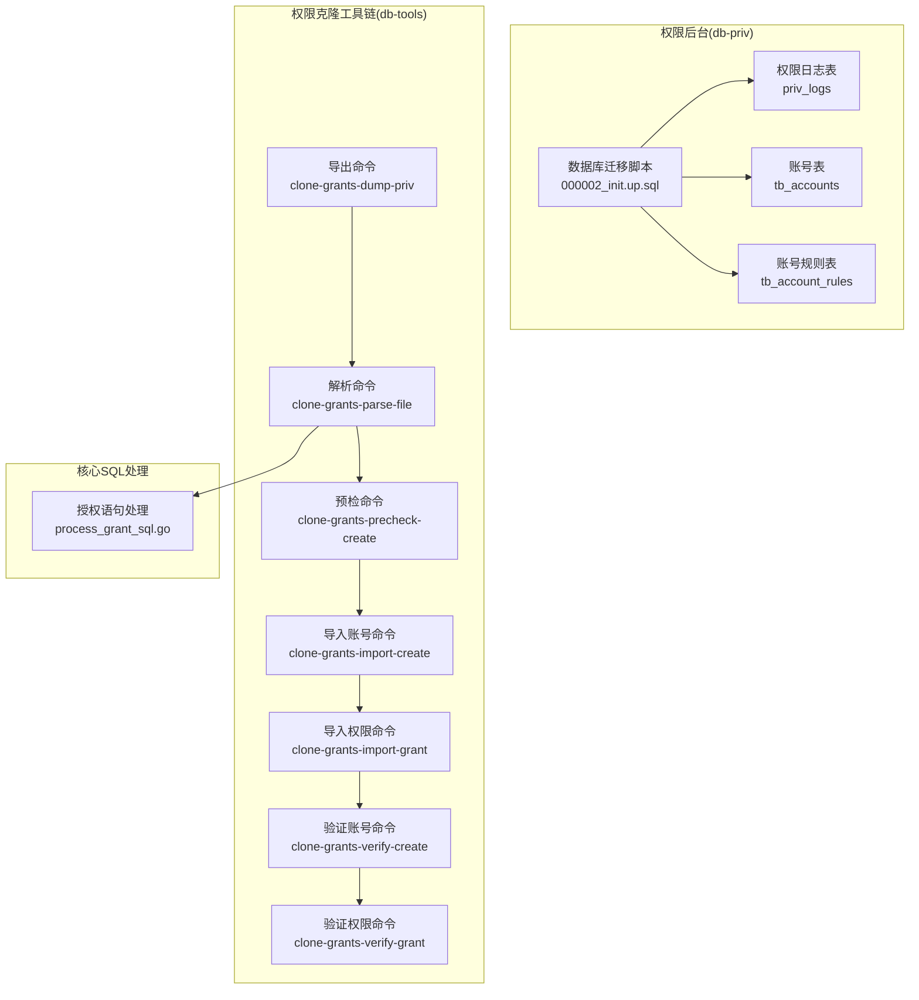

图表来源
- [000002_init.up.sql:36-124](file://dbm-services/mysql/db-priv/assests/migrations/000002_init.up.sql#L36-L124)
- [clone_grants_dump_priv.go:18-87](file://dbm-services/mysql/db-tools/dbactuator/internal/subcmd/mysqlcmd/v2/clone_grants_from_file/clone_grants_dump_priv.go#L18-L87)
- [clone_grants_parse_file.go:18-74](file://dbm-services/mysql/db-tools/dbactuator/internal/subcmd/mysqlcmd/v2/clone_grants_from_file/clone_grants_parse_file.go#L18-L74)
- [clone_grants_precheck_create.go:18-74](file://dbm-services/mysql/db-tools/dbactuator/internal/subcmd/mysqlcmd/v2/clone_grants_from_file/clone_grants_precheck_create.go#L18-L74)
- [clone_grants_import_create.go:18-78](file://dbm-services/mysql/db-tools/dbactuator/internal/subcmd/mysqlcmd/v2/clone_grants_from_file/clone_grants_import_create.go#L18-L78)
- [clone_grants_import_grant.go:18-78](file://dbm-services/mysql/db-tools/dbactuator/internal/subcmd/mysqlcmd/v2/clone_grants_from_file/clone_grants_import_grant.go#L18-L78)
- [clone_grants_verify_create.go:18-74](file://dbm-services/mysql/db-tools/dbactuator/internal/subcmd/mysqlcmd/v2/clone_grants_from_file/clone_grants_verify_create.go#L18-L74)
- [clone_grants_verify_grant.go:18-74](file://dbm-services/mysql/db-tools/dbactuator/internal/subcmd/mysqlcmd/v2/clone_grants_from_file/clone_grants_verify_grant.go#L18-L74)
- [process_grant_sql.go:67-98](file://dbm-services/mysql/db-priv/service/v2/clone_instance_priv/internal/mysql/process_grant_sql.go#L67-L98)

章节来源
- [README.md:1-2](file://dbm-services/mysql/db-priv/README.md#L1-L2)

## 核心组件
- 权限导出组件：负责连接源实例、生成备份配置、终止遗留备份进程、执行备份并将权限文件重命名，形成可离线传输的权限快照。
- 权限解析组件：将导出的权限文件解析为“创建用户”和“授权”两类独立文件，便于分步验证与导入。
- 预检查组件：在目标实例上对“创建用户”语句进行语法与兼容性预检查，降低导入失败风险。
- 导入组件：分别导入“创建用户”和“授权”文件，确保账号与权限同步。
- 验证组件：在导入完成后，对账号与权限进行一致性校验，保证克隆结果正确。
- SQL处理引擎：根据源/目标MySQL版本差异，对授权语句进行兼容转换（如5.6到5.7的语法迁移、IF NOT EXISTS注入、主机IP替换等）。

章节来源
- [clone_grants_dump_priv.go:56-87](file://dbm-services/mysql/db-tools/dbactuator/internal/subcmd/mysqlcmd/v2/clone_grants_from_file/clone_grants_dump_priv.go#L56-L87)
- [clone_grants_parse_file.go:56-74](file://dbm-services/mysql/db-tools/dbactuator/internal/subcmd/mysqlcmd/v2/clone_grants_from_file/clone_grants_parse_file.go#L56-L74)
- [clone_grants_precheck_create.go:56-74](file://dbm-services/mysql/db-tools/dbactuator/internal/subcmd/mysqlcmd/v2/clone_grants_from_file/clone_grants_precheck_create.go#L56-L74)
- [clone_grants_import_create.go:56-78](file://dbm-services/mysql/db-tools/dbactuator/internal/subcmd/mysqlcmd/v2/clone_grants_from_file/clone_grants_import_create.go#L56-L78)
- [clone_grants_import_grant.go:56-78](file://dbm-services/mysql/db-tools/dbactuator/internal/subcmd/mysqlcmd/v2/clone_grants_from_file/clone_grants_import_grant.go#L56-L78)
- [clone_grants_verify_create.go:56-74](file://dbm-services/mysql/db-tools/dbactuator/internal/subcmd/mysqlcmd/v2/clone_grants_from_file/clone_grants_verify_create.go#L56-L74)
- [clone_grants_verify_grant.go:56-74](file://dbm-services/mysql/db-tools/dbactuator/internal/subcmd/mysqlcmd/v2/clone_grants_from_file/clone_grants_verify_grant.go#L56-L74)
- [process_grant_sql.go:67-98](file://dbm-services/mysql/db-priv/service/v2/clone_instance_priv/internal/mysql/process_grant_sql.go#L67-L98)

## 架构总览
下图展示“从文件克隆权限”的端到端流程：从源实例导出权限，到目标实例导入与验证，贯穿预检查与SQL兼容处理。

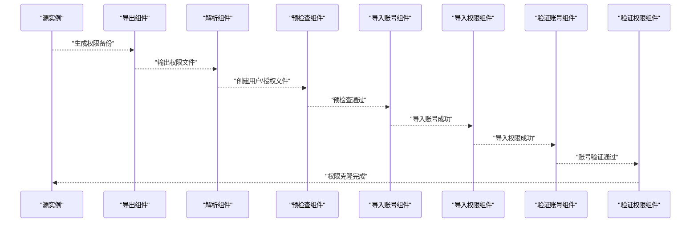

图表来源
- [clone_grants_dump_priv.go:56-87](file://dbm-services/mysql/db-tools/dbactuator/internal/subcmd/mysqlcmd/v2/clone_grants_from_file/clone_grants_dump_priv.go#L56-L87)
- [clone_grants_parse_file.go:56-74](file://dbm-services/mysql/db-tools/dbactuator/internal/subcmd/mysqlcmd/v2/clone_grants_from_file/clone_grants_parse_file.go#L56-L74)
- [clone_grants_precheck_create.go:56-74](file://dbm-services/mysql/db-tools/dbactuator/internal/subcmd/mysqlcmd/v2/clone_grants_from_file/clone_grants_precheck_create.go#L56-L74)
- [clone_grants_import_create.go:56-78](file://dbm-services/mysql/db-tools/dbactuator/internal/subcmd/mysqlcmd/v2/clone_grants_from_file/clone_grants_import_create.go#L56-L78)
- [clone_grants_import_grant.go:56-78](file://dbm-services/mysql/db-tools/dbactuator/internal/subcmd/mysqlcmd/v2/clone_grants_from_file/clone_grants_import_grant.go#L56-L78)
- [clone_grants_verify_create.go:56-74](file://dbm-services/mysql/db-tools/dbactuator/internal/subcmd/mysqlcmd/v2/clone_grants_from_file/clone_grants_verify_create.go#L56-L74)
- [clone_grants_verify_grant.go:56-74](file://dbm-services/mysql/db-tools/dbactuator/internal/subcmd/mysqlcmd/v2/clone_grants_from_file/clone_grants_verify_grant.go#L56-L74)

## 详细组件分析

### 组件A：授权语句处理引擎（版本兼容与主机替换）
该组件负责：
- 版本兼容转换：将5.6风格的GRANT语句拆分为5.7风格的CREATE USER与GRANT语句，分离WITH子句中的“grant option”与其他资源限制。
- 注入IF NOT EXISTS：在目标版本支持时自动添加幂等性关键字，避免重复导入失败。
- 主机替换：将源实例IP替换为目标实例IP，确保权限绑定到正确的网络位置。
- 日志记录：记录处理前后的语句数量与版本信息，便于审计与排障。

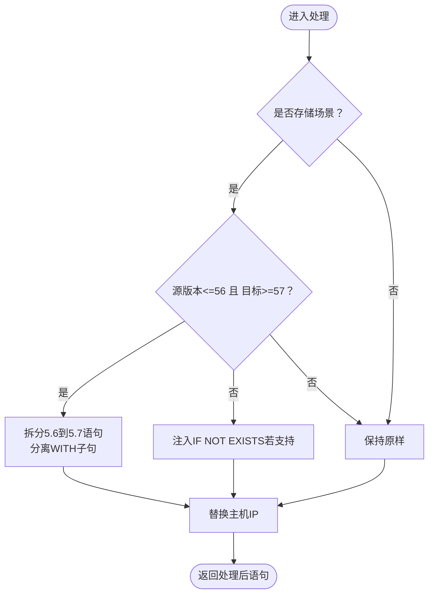

图表来源
- [process_grant_sql.go:67-98](file://dbm-services/mysql/db-priv/service/v2/clone_instance_priv/internal/mysql/process_grant_sql.go#L67-L98)
- [process_grant_sql.go:140-210](file://dbm-services/mysql/db-priv/service/v2/clone_instance_priv/internal/mysql/process_grant_sql.go#L140-L210)
- [process_grant_sql.go:238-246](file://dbm-services/mysql/db-priv/service/v2/clone_instance_priv/internal/mysql/process_grant_sql.go#L238-L246)

章节来源
- [process_grant_sql.go:67-98](file://dbm-services/mysql/db-priv/service/v2/clone_instance_priv/internal/mysql/process_grant_sql.go#L67-L98)
- [process_grant_sql.go:140-210](file://dbm-services/mysql/db-priv/service/v2/clone_instance_priv/internal/mysql/process_grant_sql.go#L140-L210)
- [process_grant_sql.go:221-236](file://dbm-services/mysql/db-priv/service/v2/clone_instance_priv/internal/mysql/process_grant_sql.go#L221-L236)
- [process_grant_sql.go:238-246](file://dbm-services/mysql/db-priv/service/v2/clone_instance_priv/internal/mysql/process_grant_sql.go#L238-L246)

### 组件B：权限导出（clone-grants-dump-priv）
职责：
- 初始化运行环境与参数。
- 生成备份配置并终止遗留备份进程，确保导出一致性。
- 执行备份并将权限文件重命名为最终产物，供后续解析与导入使用。

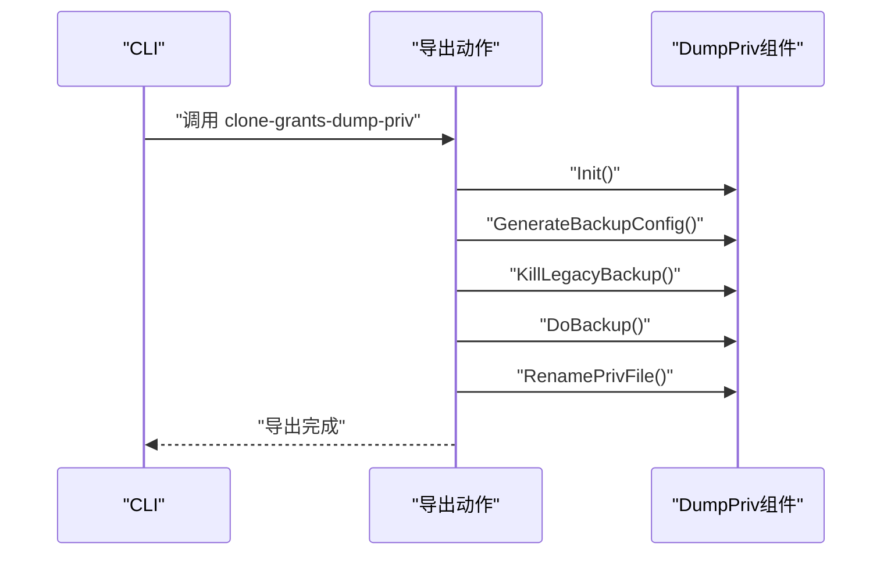

图表来源
- [clone_grants_dump_priv.go:56-87](file://dbm-services/mysql/db-tools/dbactuator/internal/subcmd/mysqlcmd/v2/clone_grants_from_file/clone_grants_dump_priv.go#L56-L87)

章节来源
- [clone_grants_dump_priv.go:18-87](file://dbm-services/mysql/db-tools/dbactuator/internal/subcmd/mysqlcmd/v2/clone_grants_from_file/clone_grants_dump_priv.go#L18-L87)

### 组件C：权限解析（clone-grants-parse-file）
职责：
- 初始化解析器。
- 将导出的权限文件按“创建用户”和“授权”两类拆分，便于后续分步导入与验证。

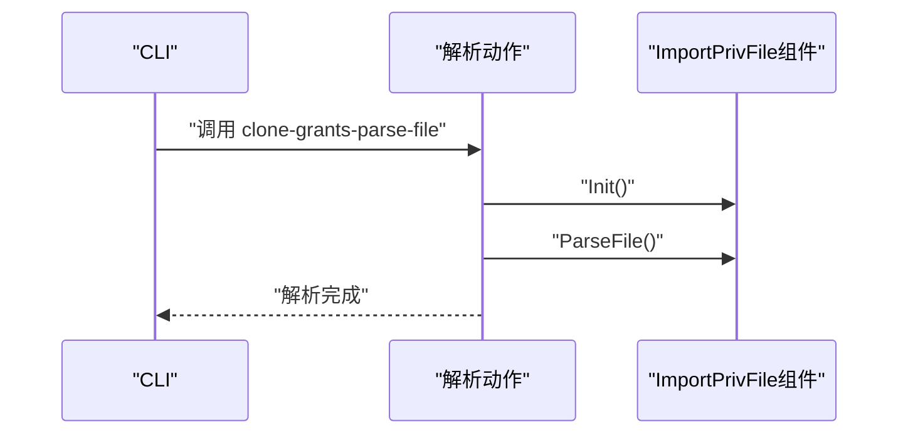

图表来源
- [clone_grants_parse_file.go:56-74](file://dbm-services/mysql/db-tools/dbactuator/internal/subcmd/mysqlcmd/v2/clone_grants_from_file/clone_grants_parse_file.go#L56-L74)

章节来源
- [clone_grants_parse_file.go:18-74](file://dbm-services/mysql/db-tools/dbactuator/internal/subcmd/mysqlcmd/v2/clone_grants_from_file/clone_grants_parse_file.go#L18-L74)

### 组件D：预检查（clone-grants-precheck-create）
职责：
- 在目标实例上对“创建用户”语句进行预检查，确保语法与兼容性满足目标版本要求，降低导入阶段失败率。

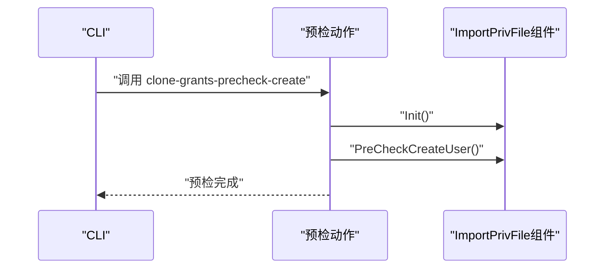

图表来源
- [clone_grants_precheck_create.go:56-74](file://dbm-services/mysql/db-tools/dbactuator/internal/subcmd/mysqlcmd/v2/clone_grants_from_file/clone_grants_precheck_create.go#L56-L74)

章节来源
- [clone_grants_precheck_create.go:18-74](file://dbm-services/mysql/db-tools/dbactuator/internal/subcmd/mysqlcmd/v2/clone_grants_from_file/clone_grants_precheck_create.go#L18-L74)

### 组件E：导入账号（clone-grants-import-create）
职责：
- 导入“创建用户”文件至目标实例，建立账号主体。

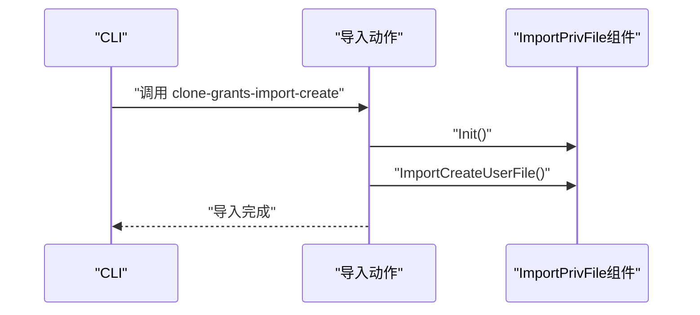

图表来源
- [clone_grants_import_create.go:56-78](file://dbm-services/mysql/db-tools/dbactuator/internal/subcmd/mysqlcmd/v2/clone_grants_from_file/clone_grants_import_create.go#L56-L78)

章节来源
- [clone_grants_import_create.go:18-78](file://dbm-services/mysql/db-tools/dbactuator/internal/subcmd/mysqlcmd/v2/clone_grants_from_file/clone_grants_import_create.go#L18-L78)

### 组件F：导入权限（clone-grants-import-grant）
职责：
- 导入“授权”文件至目标实例，授予对应权限。

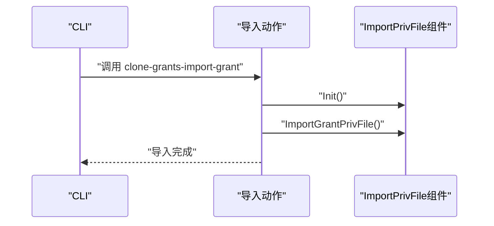

图表来源
- [clone_grants_import_grant.go:56-78](file://dbm-services/mysql/db-tools/dbactuator/internal/subcmd/mysqlcmd/v2/clone_grants_from_file/clone_grants_import_grant.go#L56-L78)

章节来源
- [clone_grants_import_grant.go:18-78](file://dbm-services/mysql/db-tools/dbactuator/internal/subcmd/mysqlcmd/v2/clone_grants_from_file/clone_grants_import_grant.go#L18-L78)

### 组件G：验证账号（clone-grants-verify-create）
职责：
- 对导入后的账号进行验证，确保账号存在且属性一致。

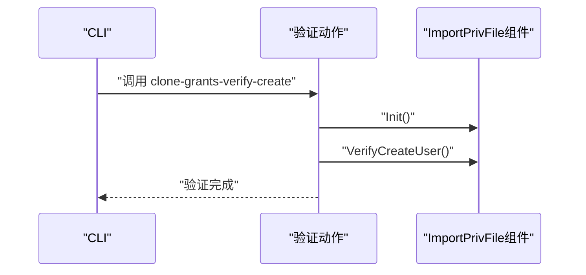

图表来源
- [clone_grants_verify_create.go:56-74](file://dbm-services/mysql/db-tools/dbactuator/internal/subcmd/mysqlcmd/v2/clone_grants_from_file/clone_grants_verify_create.go#L56-L74)

章节来源
- [clone_grants_verify_create.go:18-74](file://dbm-services/mysql/db-tools/dbactuator/internal/subcmd/mysqlcmd/v2/clone_grants_from_file/clone_grants_verify_create.go#L18-L74)

### 组件H：验证权限（clone-grants-verify-grant）
职责：
- 对导入后的权限进行验证，确保授权对象、权限类型与范围一致。

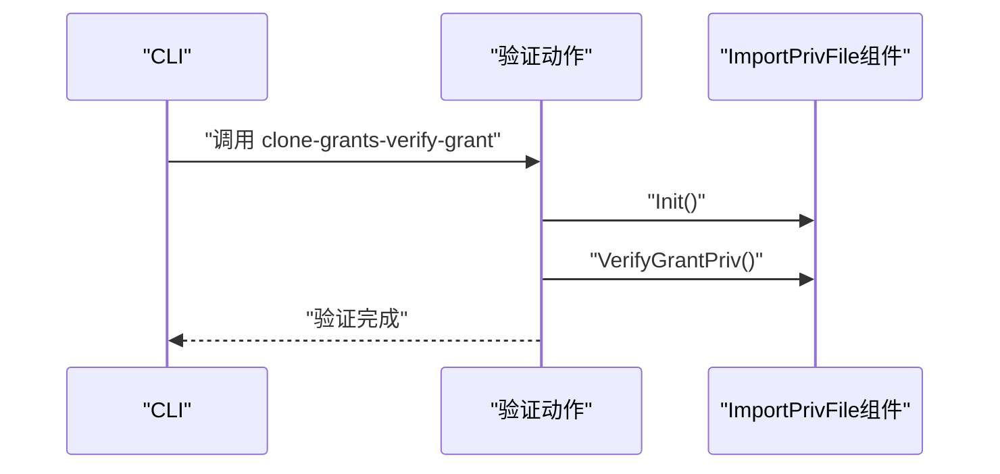

图表来源
- [clone_grants_verify_grant.go:56-74](file://dbm-services/mysql/db-tools/dbactuator/internal/subcmd/mysqlcmd/v2/clone_grants_from_file/clone_grants_verify_grant.go#L56-L74)

章节来源
- [clone_grants_verify_grant.go:18-74](file://dbm-services/mysql/db-tools/dbactuator/internal/subcmd/mysqlcmd/v2/clone_grants_from_file/clone_grants_verify_grant.go#L18-L74)

## 依赖关系分析
- 命令层依赖：各子命令动作类统一继承基础选项与运行时参数，通过步骤编排器执行具体流程。
- 组件层依赖：导入/验证组件共享同一套参数结构与运行时上下文，确保跨步骤状态一致。
- SQL处理层依赖：授权语句处理函数被导入/验证流程复用，保障版本兼容与主机替换逻辑的一致性。

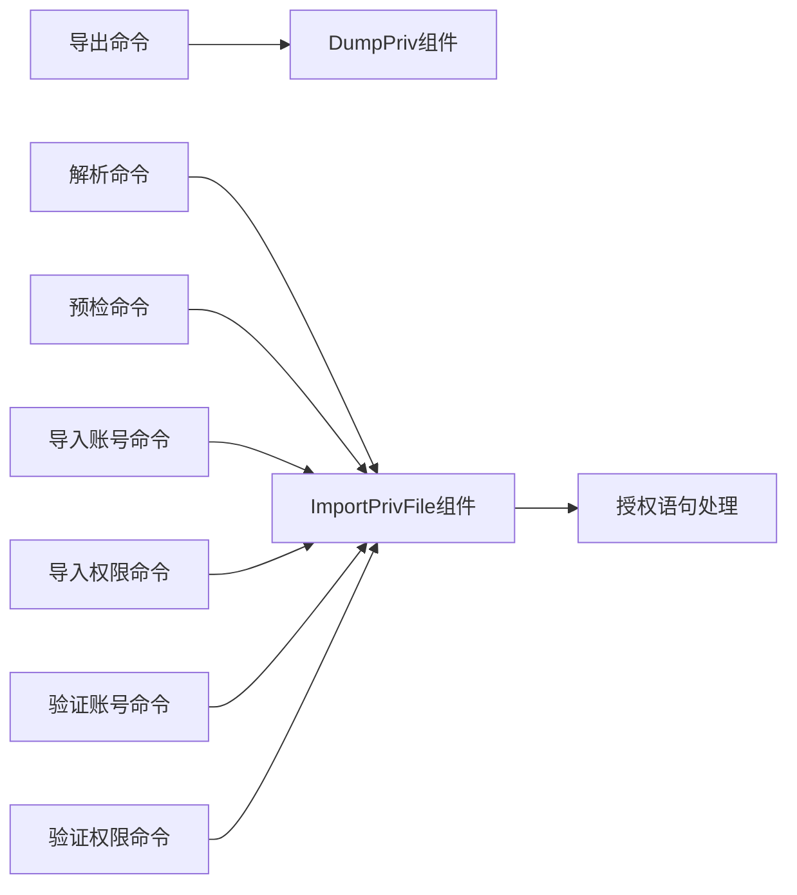

图表来源
- [clone_grants_dump_priv.go:13-54](file://dbm-services/mysql/db-tools/dbactuator/internal/subcmd/mysqlcmd/v2/clone_grants_from_file/clone_grants_dump_priv.go#L13-L54)
- [clone_grants_parse_file.go:13-54](file://dbm-services/mysql/db-tools/dbactuator/internal/subcmd/mysqlcmd/v2/clone_grants_from_file/clone_grants_parse_file.go#L13-L54)
- [clone_grants_precheck_create.go:13-54](file://dbm-services/mysql/db-tools/dbactuator/internal/subcmd/mysqlcmd/v2/clone_grants_from_file/clone_grants_precheck_create.go#L13-L54)
- [clone_grants_import_create.go:13-54](file://dbm-services/mysql/db-tools/dbactuator/internal/subcmd/mysqlcmd/v2/clone_grants_from_file/clone_grants_import_create.go#L13-L54)
- [clone_grants_import_grant.go:13-54](file://dbm-services/mysql/db-tools/dbactuator/internal/subcmd/mysqlcmd/v2/clone_grants_from_file/clone_grants_import_grant.go#L13-L54)
- [clone_grants_verify_create.go:13-54](file://dbm-services/mysql/db-tools/dbactuator/internal/subcmd/mysqlcmd/v2/clone_grants_from_file/clone_grants_verify_create.go#L13-L54)
- [clone_grants_verify_grant.go:13-54](file://dbm-services/mysql/db-tools/dbactuator/internal/subcmd/mysqlcmd/v2/clone_grants_from_file/clone_grants_verify_grant.go#L13-L54)
- [process_grant_sql.go:67-98](file://dbm-services/mysql/db-priv/service/v2/clone_instance_priv/internal/mysql/process_grant_sql.go#L67-L98)

章节来源
- [clone_grants_dump_priv.go:13-54](file://dbm-services/mysql/db-tools/dbactuator/internal/subcmd/mysqlcmd/v2/clone_grants_from_file/clone_grants_dump_priv.go#L13-L54)
- [clone_grants_parse_file.go:13-54](file://dbm-services/mysql/db-tools/dbactuator/internal/subcmd/mysqlcmd/v2/clone_grants_from_file/clone_grants_parse_file.go#L13-L54)
- [clone_grants_precheck_create.go:13-54](file://dbm-services/mysql/db-tools/dbactuator/internal/subcmd/mysqlcmd/v2/clone_grants_from_file/clone_grants_precheck_create.go#L13-L54)
- [clone_grants_import_create.go:13-54](file://dbm-services/mysql/db-tools/dbactuator/internal/subcmd/mysqlcmd/v2/clone_grants_from_file/clone_grants_import_create.go#L13-L54)
- [clone_grants_import_grant.go:13-54](file://dbm-services/mysql/db-tools/dbactuator/internal/subcmd/mysqlcmd/v2/clone_grants_from_file/clone_grants_import_grant.go#L13-L54)
- [clone_grants_verify_create.go:13-54](file://dbm-services/mysql/db-tools/dbactuator/internal/subcmd/mysqlcmd/v2/clone_grants_from_file/clone_grants_verify_create.go#L13-L54)
- [clone_grants_verify_grant.go:13-54](file://dbm-services/mysql/db-tools/dbactuator/internal/subcmd/mysqlcmd/v2/clone_grants_from_file/clone_grants_verify_grant.go#L13-L54)

## 性能考量
- 备份与重命名：导出阶段尽量减少对源实例的锁影响，优先采用在线备份策略；重命名权限文件应原子化，避免中间态导致解析失败。
- 解析与导入：解析阶段建议分批处理大文件，避免内存峰值；导入阶段可利用事务批量提交，提升吞吐并降低单点失败风险。
- 预检查与验证：预检查与验证应并行化，充分利用目标实例资源；对大规模账号/权限集，建议分批执行并记录进度。
- 版本兼容：在高版本目标上启用IF NOT EXISTS与资源限制迁移，减少重复导入失败与回滚成本。

## 故障排查指南
- 导出失败
  - 检查备份配置与遗留进程清理是否成功。
  - 关注权限文件生成与重命名阶段的日志。
- 解析失败
  - 确认导出文件格式与内容完整性。
  - 核对解析参数与路径配置。
- 预检查失败
  - 检查目标实例版本与语法兼容性。
  - 审核“创建用户”语句中的主机/IP是否正确。
- 导入失败
  - 核对导入账号与导入权限的先后顺序。
  - 检查目标实例权限缓存与锁状态。
- 验证失败
  - 对比源/目标实例的账号与权限快照。
  - 使用验证命令逐项比对差异并定位问题。

章节来源
- [clone_grants_dump_priv.go:56-87](file://dbm-services/mysql/db-tools/dbactuator/internal/subcmd/mysqlcmd/v2/clone_grants_from_file/clone_grants_dump_priv.go#L56-L87)
- [clone_grants_parse_file.go:56-74](file://dbm-services/mysql/db-tools/dbactuator/internal/subcmd/mysqlcmd/v2/clone_grants_from_file/clone_grants_parse_file.go#L56-L74)
- [clone_grants_precheck_create.go:56-74](file://dbm-services/mysql/db-tools/dbactuator/internal/subcmd/mysqlcmd/v2/clone_grants_from_file/clone_grants_precheck_create.go#L56-L74)
- [clone_grants_import_create.go:56-78](file://dbm-services/mysql/db-tools/dbactuator/internal/subcmd/mysqlcmd/v2/clone_grants_from_file/clone_grants_import_create.go#L56-L78)
- [clone_grants_import_grant.go:56-78](file://dbm-services/mysql/db-tools/dbactuator/internal/subcmd/mysqlcmd/v2/clone_grants_from_file/clone_grants_import_grant.go#L56-L78)
- [clone_grants_verify_create.go:56-74](file://dbm-services/mysql/db-tools/dbactuator/internal/subcmd/mysqlcmd/v2/clone_grants_from_file/clone_grants_verify_create.go#L56-L74)
- [clone_grants_verify_grant.go:56-74](file://dbm-services/mysql/db-tools/dbactuator/internal/subcmd/mysqlcmd/v2/clone_grants_from_file/clone_grants_verify_grant.go#L56-L74)

## 结论
通过“导出—解析—预检—导入—验证”的闭环流程，结合版本兼容与主机替换的SQL处理能力，实现了安全、可控、可观测的MySQL权限克隆。配合权限后台的日志与规则表，可满足企业级审计与合规需求。建议在生产环境中严格执行最小权限原则、定期审计与演练，确保权限变更的可追溯与可恢复。

## 附录

### 数据模型概览（权限后台）
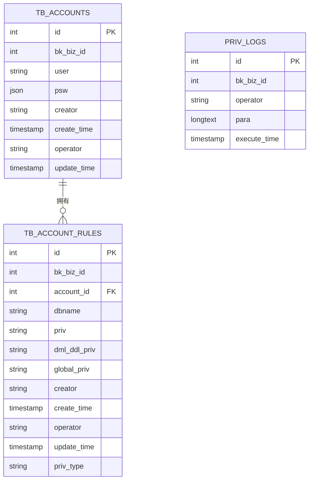

图表来源
- [000002_init.up.sql:39-124](file://dbm-services/mysql/db-priv/assests/migrations/000002_init.up.sql#L39-L124)

### 最佳实践与最小权限原则
- 最小权限：仅授予业务所需的最小权限集合，避免过度授权。
- 账号分离：区分只读、写入、运维与管理员账号，按角色分配。
- 定期审计：周期性比对源/目标实例权限快照，识别漂移与冗余权限。
- 变更流程：所有权限变更必须通过审批与自动化流程，保留审计日志。
- 脱敏策略：导出文件中避免明文存储敏感信息，必要时进行脱敏或加密传输。

### 合规性检查方法
- 账号与规则一致性：核对账号表与规则表的唯一性约束与外键关系。
- 权限完整性：通过验证命令比对授权对象、权限类型与范围。
- 操作审计：检查权限日志表的参数与执行时间字段，确保可追溯。

### 实际场景应用案例
- 场景一：跨机房权限迁移
  - 步骤：导出源实例权限 → 解析为创建用户与授权文件 → 预检查 → 导入账号 → 导入权限 → 验证账号与权限。
  - 关键点：主机IP替换、版本兼容转换、幂等导入。
- 场景二：多版本实例权限对齐
  - 步骤：解析5.6风格授权 → 转换为5.7风格 → 注入IF NOT EXISTS → 导入并验证。
  - 关键点：WITH子句拆分、资源限制迁移。