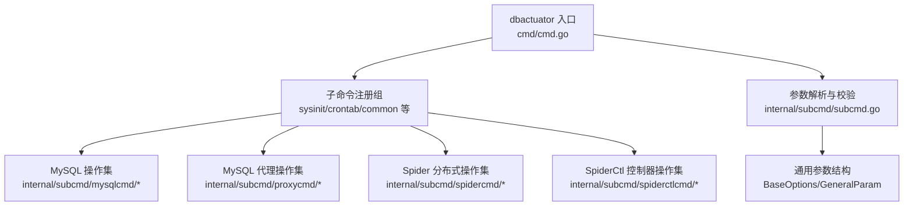
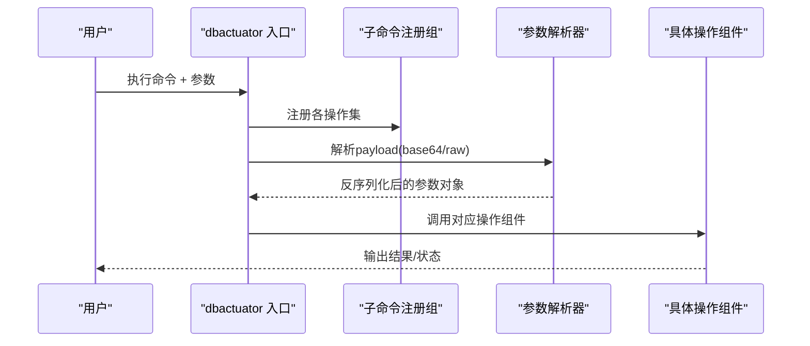
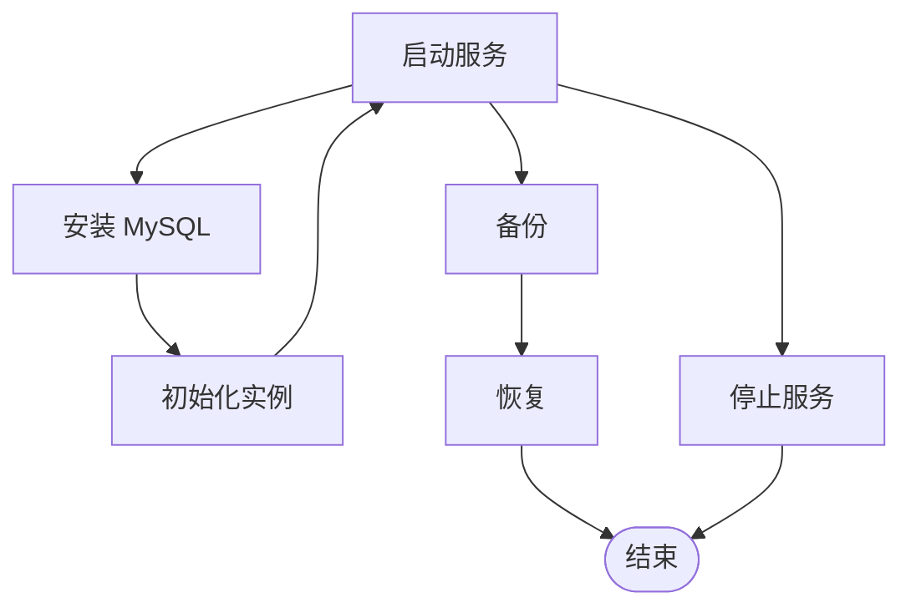
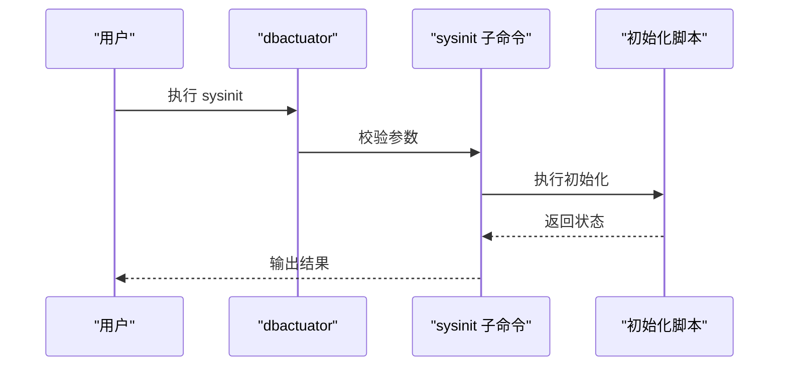
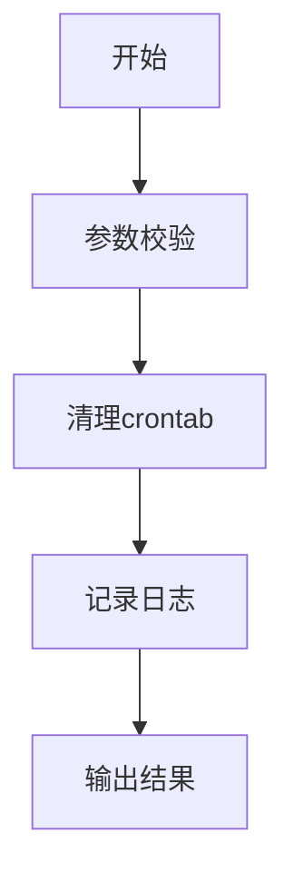
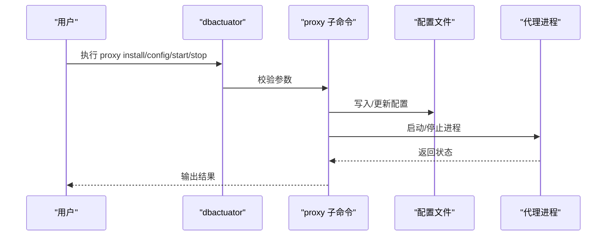
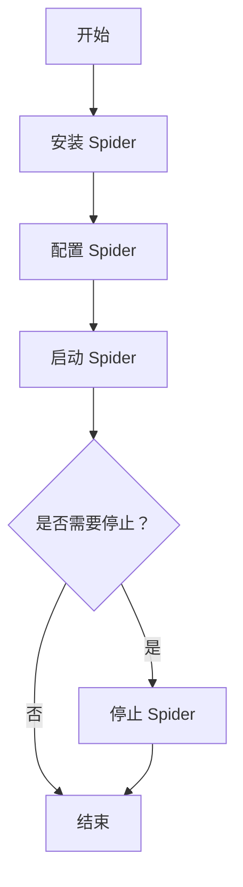
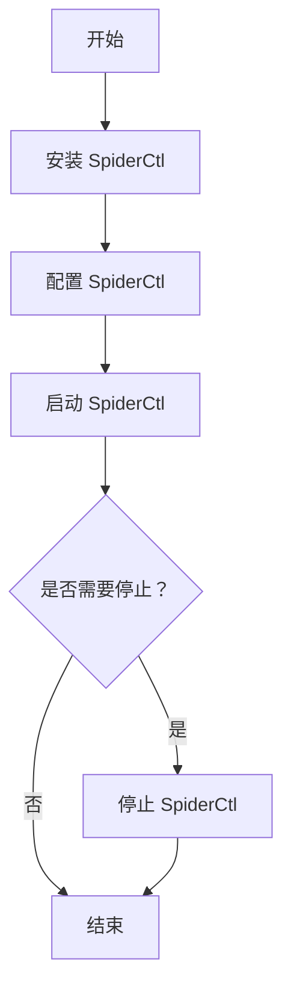
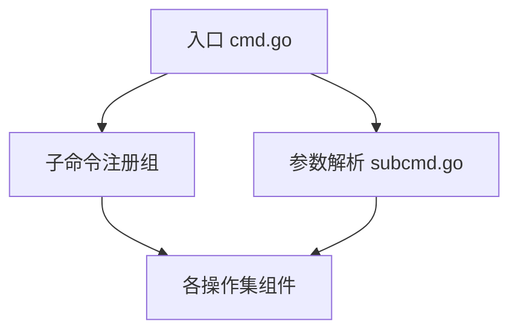

# MySQL数据库工具

<cite>
**本文引用的文件**
- [README.md](file://dbm-services/bigdata/db-tools/dbactuator/README.md)
- [cmd.go](file://dbm-services/bigdata/db-tools/dbactuator/cmd/cmd.go)
- [subcmd.go](file://dbm-services/bigdata/db-tools/dbactuator/internal/subcmd/subcmd.go)
- [subcmd_helper.go](file://dbm-services/bigdata/db-tools/dbactuator/internal/subcmd/subcmd_helper.go)
- [subcmd_util.go](file://dbm-services/bigdata/db-tools/dbactuator/internal/subcmd/subcmd_util.go)
- [sysinitcmd/sysinit.go](file://dbm-services/bigdata/db-tools/dbactuator/internal/subcmd/sysinitcmd/sysinit.go)
- [crontabcmd/clear_crontab.go](file://dbm-services/bigdata/db-tools/dbactuator/internal/subcmd/crontabcmd/clear_crontab.go)
- [commoncmd/common.go](file://dbm-services/bigdata/db-tools/dbactuator/internal/subcmd/commoncmd/common.go)
- [commoncmd/download.go](file://dbm-services/bigdata/db-tools/dbactuator/internal/subcmd/commoncmd/download.go)
- [mysql/](file://dbm-services/mysql/db-tools/dbactuator/)
- [mysql/README.md](file://dbm-services/mysql/db-tools/dbactuator/README.md)
- [mysql/cmd/](file://dbm-services/mysql/db-tools/dbactuator/cmd/)
- [mysql/cmd/cmd.go](file://dbm-services/mysql/db-tools/dbactuator/cmd/cmd.go)
- [mysql/internal/](file://dbm-services/mysql/db-tools/dbactuator/internal/)
- [mysql/internal/subcmd/](file://dbm-services/mysql/db-tools/dbactuator/internal/subcmd/)
- [mysql/internal/subcmd/mysqlcmd/](file://dbm-services/mysql/db-tools/dbactuator/internal/subcmd/mysqlcmd/)
- [mysql/internal/subcmd/mysqlcmd/install.go](file://dbm-services/mysql/db-tools/dbactuator/internal/subcmd/mysqlcmd/install.go)
- [mysql/internal/subcmd/mysqlcmd/init.go](file://dbm-services/mysql/db-tools/dbactuator/internal/subcmd/mysqlcmd/init.go)
- [mysql/internal/subcmd/mysqlcmd/start.go](file://dbm-services/mysql/db-tools/dbactuator/internal/subcmd/mysqlcmd/start.go)
- [mysql/internal/subcmd/mysqlcmd/stop.go](file://dbm-services/mysql/db-tools/dbactuator/internal/subcmd/mysqlcmd/stop.go)
- [mysql/internal/subcmd/mysqlcmd/backup.go](file://dbm-services/mysql/db-tools/dbactuator/internal/subcmd/mysqlcmd/backup.go)
- [mysql/internal/subcmd/mysqlcmd/restore.go](file://dbm-services/mysql/db-tools/dbactuator/internal/subcmd/mysqlcmd/restore.go)
- [mysql/internal/subcmd/proxycmd/](file://dbm-services/mysql/db-tools/dbactuator/internal/subcmd/proxycmd/)
- [mysql/internal/subcmd/proxycmd/install.go](file://dbm-services/mysql/db-tools/dbactuator/internal/subcmd/proxycmd/install.go)
- [mysql/internal/subcmd/proxycmd/config.go](file://dbm-services/mysql/db-tools/dbactuator/internal/subcmd/proxycmd/config.go)
- [mysql/internal/subcmd/proxycmd/start.go](file://dbm-services/mysql/db-tools/dbactuator/internal/subcmd/proxycmd/start.go)
- [mysql/internal/subcmd/proxycmd/stop.go](file://dbm-services/mysql/db-tools/dbactuator/internal/subcmd/proxycmd/stop.go)
- [mysql/internal/subcmd/spidercmd/](file://dbm-services/mysql/db-tools/dbactuator/internal/subcmd/spidercmd/)
- [mysql/internal/subcmd/spidercmd/install.go](file://dbm-services/mysql/db-tools/dbactuator/internal/subcmd/spidercmd/install.go)
- [mysql/internal/subcmd/spidercmd/config.go](file://dbm-services/mysql/db-tools/dbactuator/internal/subcmd/spidercmd/config.go)
- [mysql/internal/subcmd/spidercmd/start.go](file://dbm-services/mysql/db-tools/dbactuator/internal/subcmd/spidercmd/start.go)
- [mysql/internal/subcmd/spidercmd/stop.go](file://dbm-services/mysql/db-tools/dbactuator/internal/subcmd/spidercmd/stop.go)
- [mysql/internal/subcmd/spiderctlcmd/](file://dbm-services/mysql/db-tools/dbactuator/internal/subcmd/spiderctlcmd/)
- [mysql/internal/subcmd/spiderctlcmd/install.go](file://dbm-services/mysql/db-tools/dbactuator/internal/subcmd/spiderctlcmd/install.go)
- [mysql/internal/subcmd/spiderctlcmd/config.go](file://dbm-services/mysql/db-tools/dbactuator/internal/subcmd/spiderctlcmd/config.go)
- [mysql/internal/subcmd/spiderctlcmd/start.go](file://dbm-services/mysql/db-tools/dbactuator/internal/subcmd/spiderctlcmd/start.go)
- [mysql/internal/subcmd/spiderctlcmd/stop.go](file://dbm-services/mysql/db-tools/dbactuator/internal/subcmd/spiderctlcmd/stop.go)
</cite>

## 目录
1. [简介](#简介)
2. [项目结构](#项目结构)
3. [核心组件](#核心组件)
4. [架构总览](#架构总览)
5. [详细组件分析](#详细组件分析)
6. [依赖分析](#依赖分析)
7. [性能考虑](#性能考虑)
8. [故障排除指南](#故障排除指南)
9. [结论](#结论)
10. [附录](#附录)

## 简介
本文件面向MySQL数据库工具（dbactuator）的使用者与维护者，系统性梳理MySQL相关操作集（mysql operation sets）、系统初始化（sysinit operation sets）、定时任务（crontab operation sets）、MySQL代理（proxy sets）以及分布式数据库管理（spider/spiderctl operation sets）。文档覆盖命令使用方式、参数与payload格式、配置文件管理、集群部署策略，并结合实际运维场景提供可执行的流程图与排障建议。

## 项目结构
dbactuator通过子命令组织能力，顶层入口负责注册各操作集，参数通过payload传递并进行解码与校验。MySQL相关能力位于独立模块中，按“安装/初始化/启动/停止/备份/恢复”和“代理/分布式/分布式控制器”分层组织。

图表来源
- [cmd.go:75-185](file://dbm-services/bigdata/db-tools/dbactuator/cmd/cmd.go#L75-L185)
- [subcmd.go:44-54](file://dbm-services/bigdata/db-tools/dbactuator/internal/subcmd/subcmd.go#L44-L54)

章节来源
- [README.md:12-32](file://dbm-services/bigdata/db-tools/dbactuator/README.md#L12-L32)
- [cmd.go:75-185](file://dbm-services/bigdata/db-tools/dbactuator/cmd/cmd.go#L75-L185)
- [subcmd.go:44-54](file://dbm-services/bigdata/db-tools/dbactuator/internal/subcmd/subcmd.go#L44-L54)

## 核心组件
- 入口与参数体系
  - 入口函数负责初始化日志、心跳输出、全局标志位注册与子命令分组展示。
  - 全局参数包括单据ID、节点ID、payload及其格式（raw/base64）、回滚标记、帮助标记等。
- 子命令与参数解析
  - 提供统一的payload解码、JSON反序列化与结构体校验流程，支持“extend”包装与简单模式。
  - 支持输出上下文标记、设置结构化日志、打印子命令帮助信息。
- 操作集分组
  - sysinit operation sets：系统初始化。
  - crontab operation sets：定时任务清理。
  - common operation sets：通用下载等。
  - mysql operation sets：MySQL安装、初始化、启动、停止、备份、恢复等。
  - proxy operation sets：MySQL代理安装、配置、启动、停止。
  - spider/spiderctl operation sets：分布式数据库与控制器安装、配置、启动、停止。

章节来源
- [cmd.go:58-207](file://dbm-services/bigdata/db-tools/dbactuator/cmd/cmd.go#L58-L207)
- [subcmd.go:44-54](file://dbm-services/bigdata/db-tools/dbactuator/internal/subcmd/subcmd.go#L44-L54)
- [subcmd.go:106-165](file://dbm-services/bigdata/db-tools/dbactuator/internal/subcmd/subcmd.go#L106-L165)
- [subcmd.go:167-191](file://dbm-services/bigdata/db-tools/dbactuator/internal/subcmd/subcmd.go#L167-L191)

## 架构总览
dbactuator采用“入口注册 + 子命令分组 + 统一参数解析 + 组件化执行”的架构。各操作集通过Cobra命令组织，参数通过payload传入，内部完成解码与校验后交由具体组件执行。

图表来源
- [cmd.go:75-185](file://dbm-services/bigdata/db-tools/dbactuator/cmd/cmd.go#L75-L185)
- [subcmd.go:106-165](file://dbm-services/bigdata/db-tools/dbactuator/internal/subcmd/subcmd.go#L106-L165)

## 详细组件分析

### MySQL 操作集（mysql operation sets）
涵盖安装、初始化、启动、停止、备份、恢复等核心生命周期操作。

- 安装（install）
  - 功能：安装MySQL实例，准备数据目录、权限与基础配置。
  - 关键步骤：参数校验、目录准备、初始化数据字典、权限初始化。
- 初始化（init）
  - 功能：初始化实例，创建系统表、初始化root密码、设置安全参数。
- 启动（start）
  - 功能：启动MySQL服务，等待就绪。
- 停止（stop）
  - 功能：停止MySQL服务，确保进程退出。
- 备份（backup）
  - 功能：执行逻辑/物理备份，输出备份元数据。
- 恢复（restore）
  - 功能：从备份恢复数据，支持增量/全量恢复策略。

图表来源
- [install.go](file://dbm-services/mysql/db-tools/dbactuator/internal/subcmd/mysqlcmd/install.go)
- [init.go](file://dbm-services/mysql/db-tools/dbactuator/internal/subcmd/mysqlcmd/init.go)
- [start.go](file://dbm-services/mysql/db-tools/dbactuator/internal/subcmd/mysqlcmd/start.go)
- [stop.go](file://dbm-services/mysql/db-tools/dbactuator/internal/subcmd/mysqlcmd/stop.go)
- [backup.go](file://dbm-services/mysql/db-tools/dbactuator/internal/subcmd/mysqlcmd/backup.go)
- [restore.go](file://dbm-services/mysql/db-tools/dbactuator/internal/subcmd/mysqlcmd/restore.go)

章节来源
- [mysql/internal/subcmd/mysqlcmd/install.go](file://dbm-services/mysql/db-tools/dbactuator/internal/subcmd/mysqlcmd/install.go)
- [mysql/internal/subcmd/mysqlcmd/init.go](file://dbm-services/mysql/db-tools/dbactuator/internal/subcmd/mysqlcmd/init.go)
- [mysql/internal/subcmd/mysqlcmd/start.go](file://dbm-services/mysql/db-tools/dbactuator/internal/subcmd/mysqlcmd/start.go)
- [mysql/internal/subcmd/mysqlcmd/stop.go](file://dbm-services/mysql/db-tools/dbactuator/internal/subcmd/mysqlcmd/stop.go)
- [mysql/internal/subcmd/mysqlcmd/backup.go](file://dbm-services/mysql/db-tools/dbactuator/internal/subcmd/mysqlcmd/backup.go)
- [mysql/internal/subcmd/mysqlcmd/restore.go](file://dbm-services/mysql/db-tools/dbactuator/internal/subcmd/mysqlcmd/restore.go)

### 系统初始化（sysinit operation sets）
- 功能：执行系统初始化脚本，初始化MySQL默认OS用户、密码等。
- 典型流程：参数校验 -> 执行初始化脚本 -> 记录日志 -> 输出结果。

图表来源
- [sysinit.go](file://dbm-services/bigdata/db-tools/dbactuator/internal/subcmd/sysinitcmd/sysinit.go)

章节来源
- [sysinit.go](file://dbm-services/bigdata/db-tools/dbactuator/internal/subcmd/sysinitcmd/sysinit.go)

### 定时任务（crontab operation sets）
- 功能：清理系统定时任务，避免残留任务影响新部署。
- 典型流程：参数校验 -> 清理crontab -> 输出清理结果。

图表来源
- [clear_crontab.go](file://dbm-services/bigdata/db-tools/dbactuator/internal/subcmd/crontabcmd/clear_crontab.go)

章节来源
- [clear_crontab.go](file://dbm-services/bigdata/db-tools/dbactuator/internal/subcmd/crontabcmd/clear_crontab.go)

### MySQL 代理（proxy operation sets）
- 安装（install）
  - 准备代理配置与运行环境。
- 配置（config）
  - 应用代理配置，生成/更新配置文件。
- 启动（start）
  - 启动代理进程。
- 停止（stop）
  - 停止代理进程。

图表来源
- [proxycmd/install.go](file://dbm-services/mysql/db-tools/dbactuator/internal/subcmd/proxycmd/install.go)
- [proxycmd/config.go](file://dbm-services/mysql/db-tools/dbactuator/internal/subcmd/proxycmd/config.go)
- [proxycmd/start.go](file://dbm-services/mysql/db-tools/dbactuator/internal/subcmd/proxycmd/start.go)
- [proxycmd/stop.go](file://dbm-services/mysql/db-tools/dbactuator/internal/subcmd/proxycmd/stop.go)

章节来源
- [proxycmd/install.go](file://dbm-services/mysql/db-tools/dbactuator/internal/subcmd/proxycmd/install.go)
- [proxycmd/config.go](file://dbm-services/mysql/db-tools/dbactuator/internal/subcmd/proxycmd/config.go)
- [proxycmd/start.go](file://dbm-services/mysql/db-tools/dbactuator/internal/subcmd/proxycmd/start.go)
- [proxycmd/stop.go](file://dbm-services/mysql/db-tools/dbactuator/internal/subcmd/proxycmd/stop.go)

### Spider 分布式（spider operation sets）
- 安装（install）
  - 准备Spider节点运行环境。
- 配置（config）
  - 应用分布式配置，生成/更新配置文件。
- 启动（start）
  - 启动Spider节点。
- 停止（stop）
  - 停止Spider节点。

图表来源
- [spidercmd/install.go](file://dbm-services/mysql/db-tools/dbactuator/internal/subcmd/spidercmd/install.go)
- [spidercmd/config.go](file://dbm-services/mysql/db-tools/dbactuator/internal/subcmd/spidercmd/config.go)
- [spidercmd/start.go](file://dbm-services/mysql/db-tools/dbactuator/internal/subcmd/spidercmd/start.go)
- [spidercmd/stop.go](file://dbm-services/mysql/db-tools/dbactuator/internal/subcmd/spidercmd/stop.go)

章节来源
- [spidercmd/install.go](file://dbm-services/mysql/db-tools/dbactuator/internal/subcmd/spidercmd/install.go)
- [spidercmd/config.go](file://dbm-services/mysql/db-tools/dbactuator/internal/subcmd/spidercmd/config.go)
- [spidercmd/start.go](file://dbm-services/mysql/db-tools/dbactuator/internal/subcmd/spidercmd/start.go)
- [spidercmd/stop.go](file://dbm-services/mysql/db-tools/dbactuator/internal/subcmd/spidercmd/stop.go)

### SpiderCtl 控制器（spiderctl operation sets）
- 安装（install）
  - 准备SpiderCtl控制器运行环境。
- 配置（config）
  - 应用控制器配置。
- 启动（start）
  - 启动控制器。
- 停止（stop）
  - 停止控制器。

图表来源
- [spiderctlcmd/install.go](file://dbm-services/mysql/db-tools/dbactuator/internal/subcmd/spiderctlcmd/install.go)
- [spiderctlcmd/config.go](file://dbm-services/mysql/db-tools/dbactuator/internal/subcmd/spiderctlcmd/config.go)
- [spiderctlcmd/start.go](file://dbm-services/mysql/db-tools/dbactuator/internal/subcmd/spiderctlcmd/start.go)
- [spiderctlcmd/stop.go](file://dbm-services/mysql/db-tools/dbactuator/internal/subcmd/spiderctlcmd/stop.go)

章节来源
- [spiderctlcmd/install.go](file://dbm-services/mysql/db-tools/dbactuator/internal/subcmd/spiderctlcmd/install.go)
- [spiderctlcmd/config.go](file://dbm-services/mysql/db-tools/dbactuator/internal/subcmd/spiderctlcmd/config.go)
- [spiderctlcmd/start.go](file://dbm-services/mysql/db-tools/dbactuator/internal/subcmd/spiderctlcmd/start.go)
- [spiderctlcmd/stop.go](file://dbm-services/mysql/db-tools/dbactuator/internal/subcmd/spiderctlcmd/stop.go)

## 依赖分析
- 入口与子命令
  - 入口通过Cobra注册各操作集，统一处理全局标志位与日志。
- 参数解析
  - 统一的payload解码与校验，支持两种模式：raw与base64；支持“extend”包装与简单模式。
- 组件耦合
  - 各操作集相对独立，通过公共的参数解析器与日志系统耦合，降低相互依赖。

图表来源
- [cmd.go:75-185](file://dbm-services/bigdata/db-tools/dbactuator/cmd/cmd.go#L75-L185)
- [subcmd.go:106-165](file://dbm-services/bigdata/db-tools/dbactuator/internal/subcmd/subcmd.go#L106-L165)

章节来源
- [cmd.go:75-185](file://dbm-services/bigdata/db-tools/dbactuator/cmd/cmd.go#L75-L185)
- [subcmd.go:106-165](file://dbm-services/bigdata/db-tools/dbactuator/internal/subcmd/subcmd.go#L106-L165)

## 性能考虑
- 日志与心跳
  - 入口内置周期性心跳输出，便于长时间任务的可观测性。
- 并发与重试
  - 步骤执行器支持重试与回滚机制，适合对稳定性要求高的数据库操作。
- 参数解析
  - 采用结构化参数与严格校验，减少无效调用带来的资源浪费。

章节来源
- [cmd.go:192-207](file://dbm-services/bigdata/db-tools/dbactuator/cmd/cmd.go#L192-L207)
- [subcmd.go:71-80](file://dbm-services/bigdata/db-tools/dbactuator/internal/subcmd/subcmd.go#L71-L80)
- [subcmd.go:106-165](file://dbm-services/bigdata/db-tools/dbactuator/internal/subcmd/subcmd.go#L106-L165)

## 故障排除指南
- 常见问题
  - payload为空或格式错误：检查base64编码或raw格式是否正确。
  - 参数校验失败：核对extend包装或简单模式的参数结构。
  - 子命令不存在：确认操作集名称与子命令拼写。
- 排错步骤
  - 使用帮助标记输出参数说明，定位参数问题。
  - 查看日志文件（logs/actuator_{uid}_{node_id}.log），定位执行阶段。
  - 对于长耗时操作，观察心跳输出判断是否卡住。
- 回滚与重试
  - 若启用回滚标记，可在失败时触发回滚流程。
  - 步骤执行器支持重试次数配置，必要时适当提高重试次数。

章节来源
- [subcmd.go:106-165](file://dbm-services/bigdata/db-tools/dbactuator/internal/subcmd/subcmd.go#L106-L165)
- [subcmd.go:263-284](file://dbm-services/bigdata/db-tools/dbactuator/internal/subcmd/subcmd.go#L263-L284)
- [cmd.go:192-207](file://dbm-services/bigdata/db-tools/dbactuator/cmd/cmd.go#L192-L207)

## 结论
dbactuator通过清晰的子命令分组与统一的参数解析体系，为MySQL数据库的安装、初始化、启动停止、备份恢复、代理与分布式管理提供了标准化、可编排的能力集合。配合严格的参数校验与日志/心跳机制，能够满足生产环境对稳定性与可观测性的要求。

## 附录

### 命令与参数使用示例（基于仓库文档）
- 基本用法
  - 使用全局标志位：uid、node_id、payload、payload-format、rollback、helper等。
  - 示例：dbactuator mysql install -u {uid} -n {node_id} -p {base64}
- 子命令帮助
  - 通过helper标记输出参数说明，辅助编写payload。
- 文档生成
  - 使用swagger注解与构建脚本生成文档，便于接口说明与示例输出。

章节来源
- [README.md:12-32](file://dbm-services/bigdata/db-tools/dbactuator/README.md#L12-L32)
- [README.md:38-114](file://dbm-services/bigdata/db-tools/dbactuator/README.md#L38-L114)
- [cmd.go:170-182](file://dbm-services/bigdata/db-tools/dbactuator/cmd/cmd.go#L170-L182)

### payload 格式与参数说明
- 两种payload格式
  - raw：直接传入JSON字符串。
  - base64：对JSON字符串进行base64编码。
- 两种解析模式
  - extend包装：{"general":{...},"extend":{...}}
  - 简单模式：直接传入body
- 参数校验
  - 采用结构体校验，支持必填、范围、枚举等约束。

章节来源
- [subcmd.go:106-165](file://dbm-services/bigdata/db-tools/dbactuator/internal/subcmd/subcmd.go#L106-L165)
- [subcmd.go:167-191](file://dbm-services/bigdata/db-tools/dbactuator/internal/subcmd/subcmd.go#L167-L191)