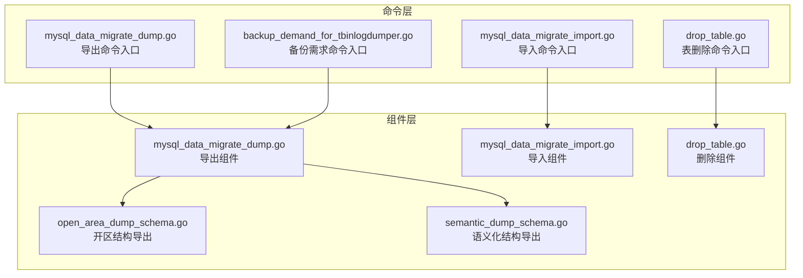
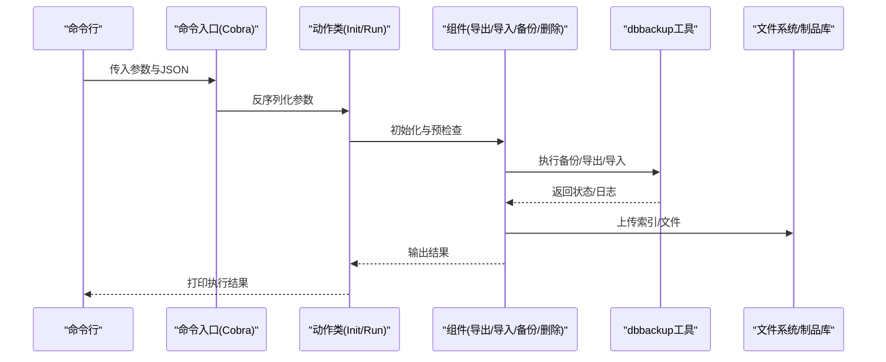
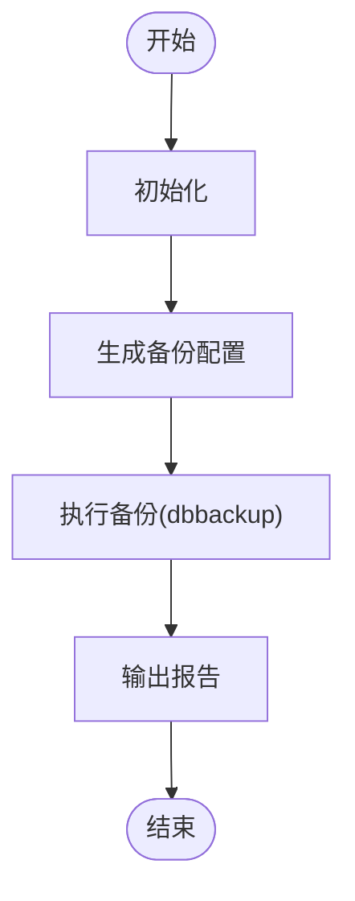
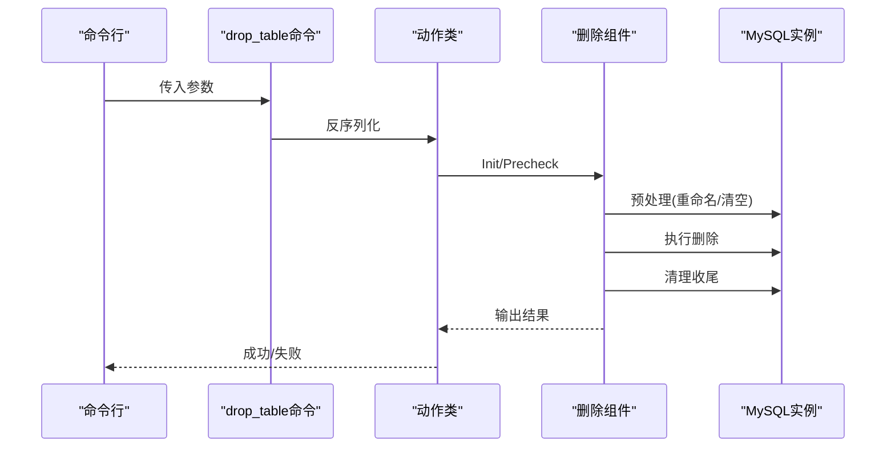
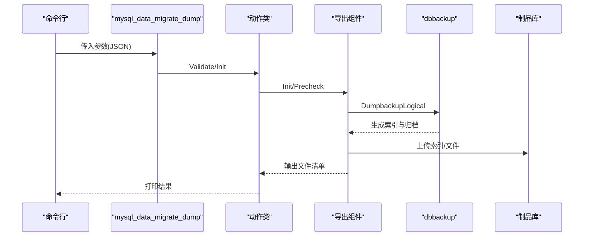
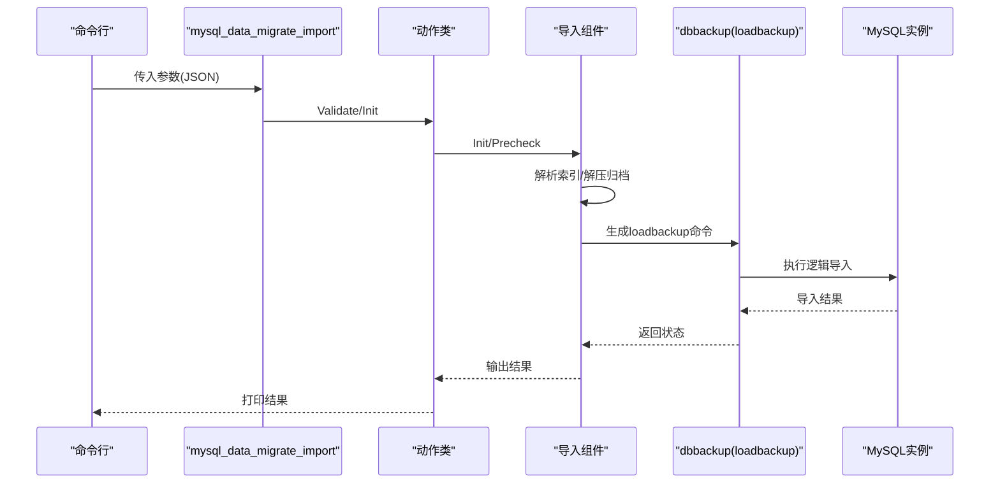
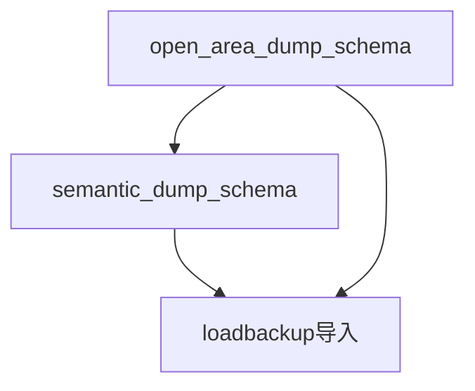
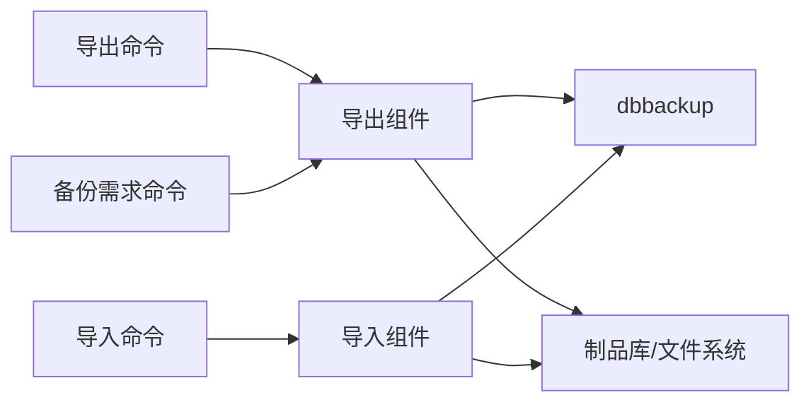

# MySQL数据管理

<cite>
**本文引用的文件**
- [mysql_data_migrate_dump.go](file://dbm-services/mysql/db-tools/dbactuator/internal/subcmd/mysqlcmd/mysql_data_migrate_dump.go)
- [mysql_data_migrate_import.go](file://dbm-services/mysql/db-tools/dbactuator/internal/subcmd/mysqlcmd/mysql_data_migrate_import.go)
- [backup_demand_for_tbinlogdumper.go](file://dbm-services/mysql/db-tools/dbactuator/internal/subcmd/tbinlogdumpercmd/backup_demand_for_tbinlogdumper.go)
- [mysql_data_migrate_dump.go](file://dbm-services/mysql/db-tools/dbactuator/pkg/components/mysql/mysql_data_migrate_dump.go)
- [mysql_data_migrate_import.go](file://dbm-services/mysql/db-tools/dbactuator/pkg/components/mysql/mysql_data_migrate_import.go)
- [drop_table.go](file://dbm-services/mysql/db-tools/dbactuator/pkg/components/mysql/drop_table.go)
- [drop_table.go](file://dbm-services/mysql/db-tools/dbactuator/internal/subcmd/mysqlcmd/drop_table.go)
- [open_area_dump_schema.go](file://dbm-services/mysql/db-tools/dbactuator/pkg/components/mysql/open_area_dump_schema.go)
- [semantic_dump_schema.go](file://dbm-services/mysql/db-tools/dbactuator/pkg/components/mysql/semantic_dump_schema.go)
- [migrate_account_rule.go](file://dbm-services\mysql\db-priv\service\migrate_account_rule.go)
- [migrate_account_rule_base_func.go](file://dbm-services\mysql\db-priv\service\migrate_account_rule_base_func.go)
- [migrate_account_rule_object.go](file://dbm-services\mysql\db-priv\service\migrate_account_rule_object.go)
</cite>

## 目录
1. [简介](#简介)
2. [项目结构](#项目结构)
3. [核心组件](#核心组件)
4. [架构总览](#架构总览)
5. [详细组件分析](#详细组件分析)
6. [依赖关系分析](#依赖关系分析)
7. [性能考量](#性能考量)
8. [故障排查指南](#故障排查指南)
9. [结论](#结论)
10. [附录](#附录)

## 简介
本文件面向MySQL数据管理能力，围绕以下主题提供系统化说明与实操指导：
- 备份需求（backup-demand）：全量/增量备份策略、配置生成与执行流程。
- 表删除（drop_table）：安全删除机制、数据保护与确认流程。
- 数据迁移（data_migrate_dump / data_migrate_import）：导出/导入流程、性能优化与断点续传思路。
- 结构迁移（schema导出/导入）：对象级结构迁移、依赖处理与版本兼容。
- 实战场景与最佳实践：典型迁移案例、参数配置与数据格式说明。

## 项目结构
MySQL数据管理相关能力主要分布在如下模块：
- 命令层：dbactuator内部子命令，负责解析参数、编排步骤并调用组件。
- 组件层：封装具体业务逻辑，如备份、迁移、删除、结构导出等。
- 公共常量与工具：安装路径、工具路径、日志目录等约定。

图表来源
- [mysql_data_migrate_dump.go:31-52](file://dbm-services/mysql/db-tools/dbactuator/internal/subcmd/mysqlcmd/mysql_data_migrate_dump.go#L31-L52)
- [mysql_data_migrate_import.go:30-49](file://dbm-services/mysql/db-tools/dbactuator/internal/subcmd/mysqlcmd/mysql_data_migrate_import.go#L30-L49)
- [backup_demand_for_tbinlogdumper.go:27-42](file://dbm-services/mysql/db-tools/dbactuator/internal/subcmd/tbinlogdumpercmd/backup_demand_for_tbinlogdumper.go#L27-L42)
- [drop_table.go](file://dbm-services/mysql/db-tools/dbactuator/internal/subcmd/mysqlcmd/drop_table.go)

章节来源
- [mysql_data_migrate_dump.go:1-96](file://dbm-services/mysql/db-tools/dbactuator/internal/subcmd/mysqlcmd/mysql_data_migrate_dump.go#L1-L96)
- [mysql_data_migrate_import.go:1-100](file://dbm-services/mysql/db-tools/dbactuator/internal/subcmd/mysqlcmd/mysql_data_migrate_import.go#L1-L100)
- [backup_demand_for_tbinlogdumper.go:1-90](file://dbm-services/mysql/db-tools/dbactuator/internal/subcmd/tbinlogdumpercmd/backup_demand_for_tbinlogdumper.go#L1-L90)
- [drop_table.go](file://dbm-services/mysql/db-tools/dbactuator/internal/subcmd/mysqlcmd/drop_table.go)

## 核心组件
- 导出组件（DbMigrateDumpComp）
  - 负责确定工作目录、校验备份工具、调用dbbackup执行逻辑导出、生成索引并输出待传输文件清单。
- 导入组件（DbMigrateImportComp）
  - 负责解析索引、解压归档、拼装loadbackup命令并执行导入。
- 备份需求组件（BackupDemandAct）
  - 负责初始化、生成备份配置、执行备份并输出报告。
- 删除组件（DropTableComp）
  - 封装安全删除流程，包含前置检查、远程阶段操作与清理。

章节来源
- [mysql_data_migrate_dump.go:29-50](file://dbm-services/mysql/db-tools/dbactuator/pkg/components/mysql/mysql_data_migrate_dump.go#L29-L50)
- [mysql_data_migrate_import.go:29-45](file://dbm-services/mysql/db-tools/dbactuator/pkg/components/mysql/mysql_data_migrate_import.go#L29-L45)
- [backup_demand_for_tbinlogdumper.go:22-25](file://dbm-services/mysql/db-tools/dbactuator/internal/subcmd/tbinlogdumpercmd/backup_demand_for_tbinlogdumper.go#L22-L25)
- [drop_table.go](file://dbm-services/mysql/db-tools/dbactuator/pkg/components/mysql/drop_table.go)

## 架构总览
下图展示从命令入口到组件执行的关键交互：

图表来源
- [mysql_data_migrate_dump.go:45-95](file://dbm-services/mysql/db-tools/dbactuator/internal/subcmd/mysqlcmd/mysql_data_migrate_dump.go#L45-L95)
- [mysql_data_migrate_import.go:42-99](file://dbm-services/mysql/db-tools/dbactuator/internal/subcmd/mysqlcmd/mysql_data_migrate_import.go#L42-L99)
- [backup_demand_for_tbinlogdumper.go:35-89](file://dbm-services/mysql/db-tools/dbactuator/internal/subcmd/tbinlogdumpercmd/backup_demand_for_tbinlogdumper.go#L35-L89)
- [mysql_data_migrate_dump.go:104-122](file://dbm-services/mysql/db-tools/dbactuator/pkg/components/mysql/mysql_data_migrate_dump.go#L104-L122)
- [mysql_data_migrate_import.go:117-125](file://dbm-services/mysql/db-tools/dbactuator/pkg/components/mysql/mysql_data_migrate_import.go#L117-L125)

## 详细组件分析

### 备份需求（backup-demand）与备份策略
- 功能定位
  - 接收“按需备份”请求，生成备份配置并执行，最终输出报告。
- 关键流程
  - 初始化 → 生成备份配置 → 执行备份 → 输出报告。
- 备份类型与策略
  - 通过组件参数控制备份粒度与范围；结合dbbackup工具支持逻辑备份（schema/data）与元数据导出。
- 增量/全量配置
  - 增量备份通常依赖binlog/时间点；全量备份由dbbackup统一执行。具体开关与粒度由组件参数与工具行为共同决定。
- 断点续传
  - 通过索引文件记录已备份文件集合，仅对缺失部分重试，避免重复传输与浪费。

图表来源
- [backup_demand_for_tbinlogdumper.go:62-89](file://dbm-services/mysql/db-tools/dbactuator/internal/subcmd/tbinlogdumpercmd/backup_demand_for_tbinlogdumper.go#L62-L89)

章节来源
- [backup_demand_for_tbinlogdumper.go:1-90](file://dbm-services/mysql/db-tools/dbactuator/internal/subcmd/tbinlogdumpercmd/backup_demand_for_tbinlogdumper.go#L1-L90)

### 表删除（drop_table）安全机制
- 安全删除流程
  - 参数校验 → 远程预处理（如重命名/清空阶段）→ 执行删除 → 清理与收尾。
- 数据保护
  - 通过“预阶段”将潜在破坏性操作拆分为可逆步骤，降低误删风险。
- 确认与回滚
  - 在关键节点要求确认；若失败则回滚至上一稳定状态。
- 适用场景
  - 低风险表清理、灰度验证后的批量删除。

图表来源
- [drop_table.go](file://dbm-services/mysql/db-tools/dbactuator/internal/subcmd/mysqlcmd/drop_table.go)
- [drop_table.go](file://dbm-services/mysql/db-tools/dbactuator/pkg/components/mysql/drop_table.go)

章节来源
- [drop_table.go](file://dbm-services/mysql/db-tools/dbactuator/internal/subcmd/mysqlcmd/drop_table.go)
- [drop_table.go](file://dbm-services/mysql/db-tools/dbactuator/pkg/components/mysql/drop_table.go)

### 数据迁移：导出（data_migrate_dump）
- 目标
  - 以逻辑备份方式导出指定数据库的schema、data与元数据，生成索引文件并输出待传输文件列表。
- 关键步骤
  - 初始化工作目录与dump目录 → 预检查备份工具存在性 → 调用dbbackup执行逻辑导出 → 读取索引文件并打印文件清单。
- 参数要点
  - 主机、端口、字符集、工作目录、dump目录名、数据库列表、导出粒度（schema/data/全部）。
- 性能优化建议
  - 合理设置并发与缓冲；优先选择SSD存储；分库导出并行化；导出完成后立即上传索引文件以便下游并行下载。
- 断点续传
  - 依据索引文件识别缺失文件，仅重试缺失项。

图表来源
- [mysql_data_migrate_dump.go:45-95](file://dbm-services/mysql/db-tools/dbactuator/internal/subcmd/mysqlcmd/mysql_data_migrate_dump.go#L45-L95)
- [mysql_data_migrate_dump.go:72-122](file://dbm-services/mysql/db-tools/dbactuator/pkg/components/mysql/mysql_data_migrate_dump.go#L72-L122)
- [mysql_data_migrate_dump.go:124-156](file://dbm-services/mysql/db-tools/dbactuator/pkg/components/mysql/mysql_data_migrate_dump.go#L124-L156)

章节来源
- [mysql_data_migrate_dump.go:1-96](file://dbm-services/mysql/db-tools/dbactuator/internal/subcmd/mysqlcmd/mysql_data_migrate_dump.go#L1-L96)
- [mysql_data_migrate_dump.go:1-206](file://dbm-services/mysql/db-tools/dbactuator/pkg/components/mysql/mysql_data_migrate_dump.go#L1-L206)

### 数据迁移：导入（data_migrate_import）
- 目标
  - 在目标实例上导入已导出的schema/data，支持解压与loadbackup逻辑导入。
- 关键步骤
  - 初始化与索引解析 → 解压归档文件 → 拼装loadbackup命令并执行导入。
- 参数要点
  - 主机、端口、字符集、工作目录、导入目录名、索引文件名。
- 性能优化建议
  - 关闭外键检查与二进制日志（导入期间），合理设置批量提交；导入完成后恢复。
- 断点续传
  - 若部分文件导入失败，可基于索引文件定位失败项并重试。

图表来源
- [mysql_data_migrate_import.go:42-99](file://dbm-services/mysql/db-tools/dbactuator/internal/subcmd/mysqlcmd/mysql_data_migrate_import.go#L42-L99)
- [mysql_data_migrate_import.go:81-125](file://dbm-services/mysql/db-tools/dbactuator/pkg/components/mysql/mysql_data_migrate_import.go#L81-L125)
- [mysql_data_migrate_import.go:140-176](file://dbm-services/mysql/db-tools/dbactuator/pkg/components/mysql/mysql_data_migrate_import.go#L140-L176)

章节来源
- [mysql_data_migrate_import.go:1-100](file://dbm-services/mysql/db-tools/dbactuator/internal/subcmd/mysqlcmd/mysql_data_migrate_import.go#L1-L100)
- [mysql_data_migrate_import.go:1-176](file://dbm-services/mysql/db-tools/dbactuator/pkg/components/mysql/mysql_data_migrate_import.go#L1-L176)

### 结构导出/导入（schema）
- 开区结构导出（open_area_dump_schema）
  - 面向开区场景的结构导出，便于快速复制与对比。
- 语义化结构导出（semantic_dump_schema）
  - 更关注对象间依赖与一致性，适合跨版本迁移与兼容性处理。
- 导入流程
  - 通过dbbackup的逻辑导入能力，结合索引文件完成结构恢复。
- 版本兼容
  - 导出时保留兼容性标记，导入时根据目标版本调整语法与对象定义。

图表来源
- [open_area_dump_schema.go](file://dbm-services/mysql/db-tools/dbactuator/pkg/components/mysql/open_area_dump_schema.go)
- [semantic_dump_schema.go](file://dbm-services/mysql/db-tools/dbactuator/pkg/components/mysql/semantic_dump_schema.go)

章节来源
- [open_area_dump_schema.go](file://dbm-services/mysql/db-tools/dbactuator/pkg/components/mysql/open_area_dump_schema.go)
- [semantic_dump_schema.go](file://dbm-services/mysql/db-tools/dbactuator/pkg/components/mysql/semantic_dump_schema.go)

### 账号迁移规则（账户权限导出/导入）
- 能力概述
  - 支持账号迁移规则的导出与导入，确保权限在不同环境间一致。
- 关键文件
  - 规则服务：迁移规则主流程、基础函数、对象定义。
- 适用场景
  - 跨集群权限同步、新环境初始化、审计与合规。

章节来源
- [migrate_account_rule.go](file://dbm-services\mysql\db-priv\service\migrate_account_rule.go)
- [migrate_account_rule_base_func.go](file://dbm-services\mysql\db-priv\service\migrate_account_rule_base_func.go)
- [migrate_account_rule_object.go](file://dbm-services\mysql\db-priv\service\migrate_account_rule_object.go)

## 依赖关系分析
- 命令层与组件层解耦：命令仅负责参数解析与步骤编排，业务逻辑集中在组件层。
- 组件依赖公共常量与工具：如安装路径、工具路径、日志目录等。
- 外部工具依赖：dbbackup（逻辑备份/导入）、shell命令（解压、执行命令）。
- 文件系统与制品库：索引文件驱动文件传输与断点续传。

图表来源
- [mysql_data_migrate_dump.go:45-95](file://dbm-services/mysql/db-tools/dbactuator/internal/subcmd/mysqlcmd/mysql_data_migrate_dump.go#L45-L95)
- [mysql_data_migrate_import.go:42-99](file://dbm-services/mysql/db-tools/dbactuator/internal/subcmd/mysqlcmd/mysql_data_migrate_import.go#L42-L99)
- [backup_demand_for_tbinlogdumper.go:62-89](file://dbm-services/mysql/db-tools/dbactuator/internal/subcmd/tbinlogdumpercmd/backup_demand_for_tbinlogdumper.go#L62-L89)

章节来源
- [mysql_data_migrate_dump.go:1-96](file://dbm-services/mysql/db-tools/dbactuator/internal/subcmd/mysqlcmd/mysql_data_migrate_dump.go#L1-L96)
- [mysql_data_migrate_import.go:1-100](file://dbm-services/mysql/db-tools/dbactuator/internal/subcmd/mysqlcmd/mysql_data_migrate_import.go#L1-L100)
- [backup_demand_for_tbinlogdumper.go:1-90](file://dbm-services/mysql/db-tools/dbactuator/internal/subcmd/tbinlogdumpercmd/backup_demand_for_tbinlogdumper.go#L1-L90)

## 性能考量
- 并行化
  - 对多库导出采用并行任务，减少整体耗时。
- 存储与I/O
  - 优先使用SSD；导出目录与导入目录分离，避免IO争用。
- 导入阶段优化
  - 导入前关闭外键检查与二进制日志，导入后统一开启并校验一致性。
- 索引驱动的断点续传
  - 通过索引文件识别缺失文件，避免重复传输与浪费。

## 故障排查指南
- 常见问题与处理
  - 备份工具缺失：检查dbbackup是否安装于约定路径。
  - 索引文件异常：确认导出阶段索引生成成功；导入阶段索引文件存在且可读。
  - 权限不足：确认备份用户与管理员用户具备相应权限。
  - 导入失败：查看loadbackup输出与日志目录，定位失败SQL或对象依赖。
- 日志与输出
  - 组件均会写入日志目录，便于定位错误；命令行输出包含执行结果与文件清单。

章节来源
- [mysql_data_migrate_dump.go:93-101](file://dbm-services/mysql/db-tools/dbactuator/pkg/components/mysql/mysql_data_migrate_dump.go#L93-L101)
- [mysql_data_migrate_import.go:93-99](file://dbm-services/mysql/db-tools/dbactuator/pkg/components/mysql/mysql_data_migrate_import.go#L93-L99)
- [mysql_data_migrate_import.go:117-125](file://dbm-services/mysql/db-tools/dbactuator/pkg/components/mysql/mysql_data_migrate_import.go#L117-L125)

## 结论
本文梳理了MySQL数据管理的核心能力：备份需求、表删除、数据迁移与结构迁移。通过命令层与组件层的清晰分工，配合dbbackup工具与索引文件驱动的断点续传，实现了高可靠、可扩展的数据管理方案。建议在生产环境中严格遵循参数校验、预检查与回滚机制，并结合并行化与I/O优化提升整体效率。

## 附录

### 命令使用示例与参数说明
- 备份需求（backup-demand）
  - 示例：dbactuator tbinlogdumper backup-demand <基础参数> <组件示例JSON>
  - 步骤：初始化 → 生成备份配置 → 执行备份 → 输出报告
- 导出（data_migrate_dump）
  - 示例：dbactuator mysql mysql_data_migrate_dump <基础参数> <组件示例JSON>
  - 关键参数：host/port/charset/work_dir/dump_dir_name/db_list/data_schema_grant
  - 输出：文件清单（含索引文件名与归档文件名）
- 导入（data_migrate_import）
  - 示例：dbactuator mysql mysql_data_migrate_import <基础参数> <组件示例JSON>
  - 关键参数：host/port/charset/work_dir/import_dir_name/index_file_name
  - 流程：解析索引 → 解压归档 → loadbackup导入
- 表删除（drop_table）
  - 示例：dbactuator mysql drop_table <基础参数> <组件示例JSON>
  - 流程：预检查 → 远程预处理 → 删除 → 清理

章节来源
- [backup_demand_for_tbinlogdumper.go:27-42](file://dbm-services/mysql/db-tools/dbactuator/internal/subcmd/tbinlogdumpercmd/backup_demand_for_tbinlogdumper.go#L27-L42)
- [mysql_data_migrate_dump.go:31-52](file://dbm-services/mysql/db-tools/dbactuator/internal/subcmd/mysqlcmd/mysql_data_migrate_dump.go#L31-L52)
- [mysql_data_migrate_import.go:30-49](file://dbm-services/mysql/db-tools/dbactuator/internal/subcmd/mysqlcmd/mysql_data_migrate_import.go#L30-L49)
- [drop_table.go](file://dbm-services/mysql/db-tools/dbactuator/internal/subcmd/mysqlcmd/drop_table.go)

### 数据格式说明
- 索引文件（.index）
  - 内容：文件列表（文件名、类型：schema/data/metadata/priv等）
  - 用途：驱动断点续传与制品库传输
- 归档文件（.tar）
  - 内容：对应索引条目所指的归档包
  - 用途：导入阶段解压与loadbackup加载

章节来源
- [mysql_data_migrate_dump.go:158-206](file://dbm-services/mysql/db-tools/dbactuator/pkg/components/mysql/mysql_data_migrate_dump.go#L158-L206)
- [mysql_data_migrate_import.go:58-66](file://dbm-services/mysql/db-tools/dbactuator/pkg/components/mysql/mysql_data_migrate_import.go#L58-L66)
- [mysql_data_migrate_import.go:127-158](file://dbm-services/mysql/db-tools/dbactuator/pkg/components/mysql/mysql_data_migrate_import.go#L127-L158)

### 实际迁移场景与最佳实践
- 场景一：跨环境结构迁移
  - 使用语义化结构导出，导入到目标实例；注意版本差异与依赖顺序。
- 场景二：全量数据迁移
  - 使用data_migrate_dump导出，制品库传输后在目标侧data_migrate_import导入；导入前关闭外键检查与二进制日志。
- 场景三：按需备份与恢复
  - 使用backup-demand生成备份配置并执行；通过索引文件进行断点续传。
- 最佳实践
  - 严格的参数校验与预检查；分批执行与回滚机制；导入前后一致性校验；日志与索引文件留存。