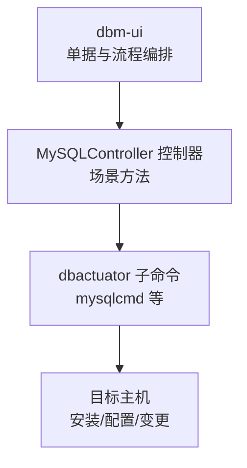
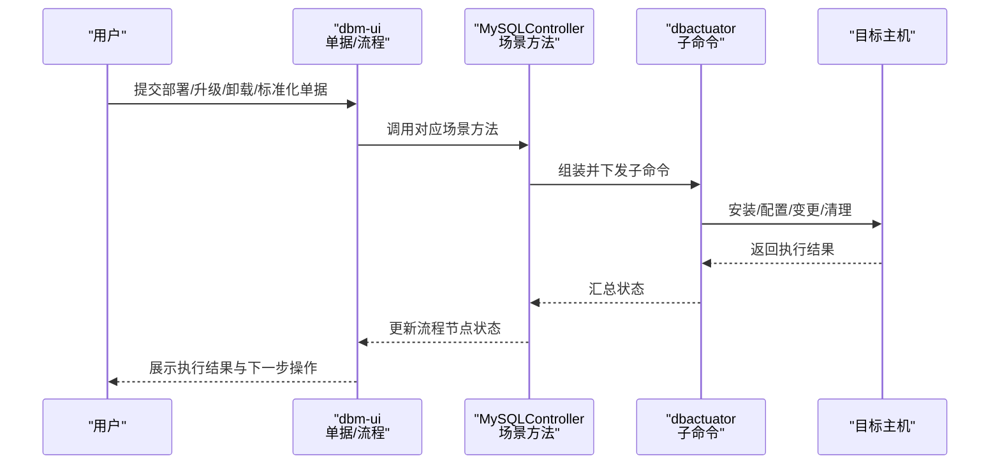
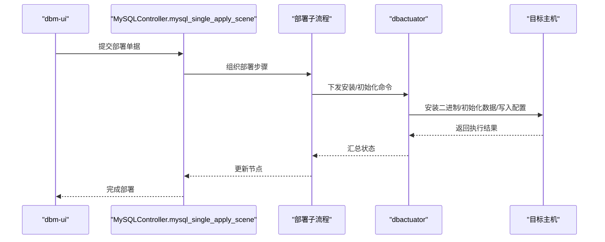
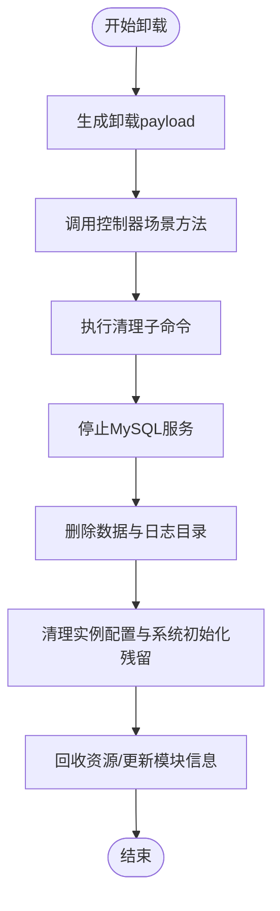
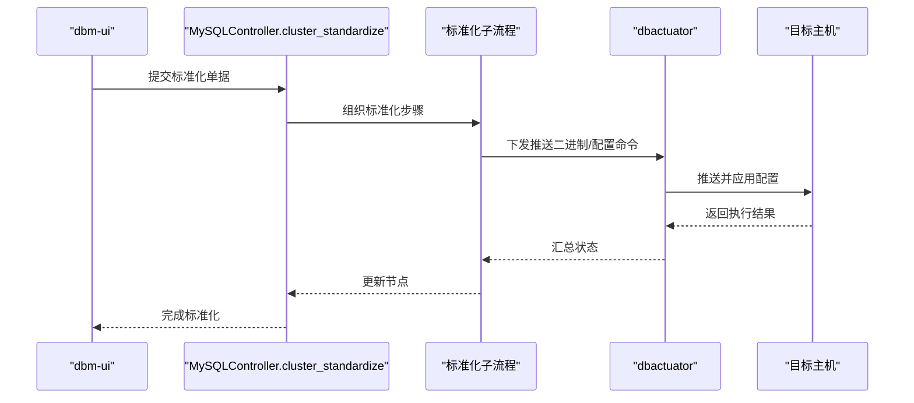
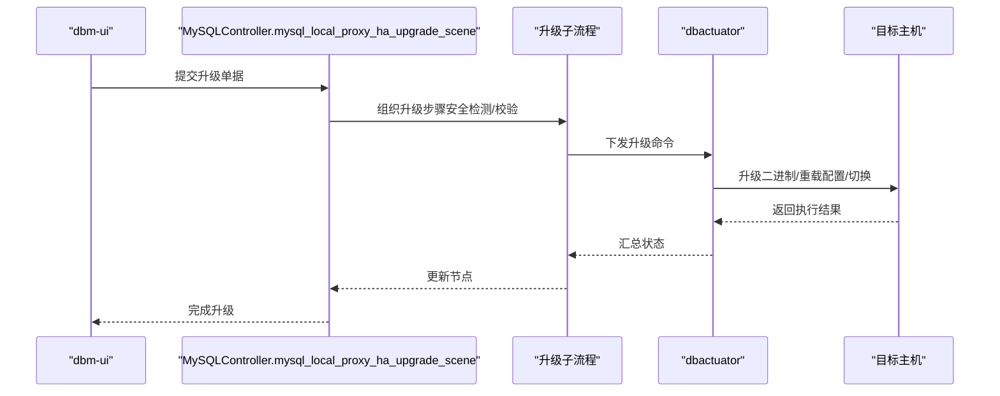

# MySQL核心操作

<cite>
**本文引用的文件**
- [cmd.go](file://dbm-services/mysql/db-tools/dbactuator/cmd/cmd.go)
- [mysqlcmd.go](file://dbm-services/mysql/db-tools/dbactuator/internal/subcmd/mysqlcmd/mysqlcmd.go)
- [clean_mysql.go](file://dbm-services/mysql/db-tools/dbactuator/internal/subcmd/mysqlcmd/clean_mysql.go)
- [clear_instance_config.go](file://dbm-services/mysql/db-tools/dbactuator/internal/subcmd/mysqlcmd/clear_instance_config.go)
- [build_master_slave_relation.go](file://dbm-services/mysql/db-tools/dbactuator/internal/subcmd/mysqlcmd/build_master_slave_relation.go)
- [mysql_local_upgrade.py](file://dbm-ui/backend/ticket/builders/mysql/mysql_local_upgrade.py)
- [mysql_proxy_upgrade.py](file://dbm-ui/backend/ticket/builders/mysql/mysql_proxy_upgrade.py)
- [mysql_cluster_standardize.py](file://dbm-ui/backend/ticket/builders/mysql/mysql_cluster_standardize.py)
- [mysql_ha_destroy.py](file://dbm-ui/backend/ticket/builders/mysql/mysql_ha_destroy.py)
- [mysql_single_destroy.py](file://dbm-ui/backend/ticket/builders/mysql/mysql_single_destroy.py)
- [mysql_ha_enable.py](file://dbm-ui/backend/ticket/builders/mysql/mysql_ha_enable.py)
- [mysql_ha_disable.py](file://dbm-ui/backend/ticket/builders/mysql/mysql_ha_disable.py)
- [mysql_single_enable.py](file://dbm-ui/backend/ticket/builders/mysql/mysql_single_enable.py)
- [mysql_single_disable.py](file://dbm-ui/backend/ticket/builders/mysql/mysql_single_disable.py)
- [mysql_single_apply.py](file://dbm-ui/backend/ticket/builders/mysql/mysql_single_apply.py)
- [mysql_master_slave_switch.py](file://dbm-ui/backend/flow/engine/bamboo/scene/mysql/mysql_master_slave_switch.py)
- [mysql_master_fail_over.py](file://dbm-ui/backend/flow/engine/bamboo/scene/mysql/mysql_master_fail_over.py)
- [mysql_ha_upgrade.py](file://dbm-ui/backend/flow/engine/bamboo/scene/mysql/mysql_ha_upgrade.py)
- [mysql_migrate_cluster_remote_flow.py](file://dbm-ui/backend/flow/engine/bamboo/scene/mysql/mysql_migrate_cluster_remote_flow.py)
- [mysql_checksum.py](file://dbm-ui/backend/flow/engine/bamboo/scene/mysql/mysql_checksum.py)
- [mysql_ha_apply_flow.py](file://dbm-ui/backend/flow/engine/bamboo/scene/mysql/mysql_ha_apply_flow.py)
- [mysql_ha_destroy_flow.py](file://dbm-ui/backend/flow/engine/bamboo/scene/mysql/mysql_ha_destroy_flow.py)
- [transfer_cluster_to_other_biz.py](file://dbm-ui/backend/flow/engine/bamboo/scene/common/transfer_cluster_to_other_biz.py)
- [deploy_peripheraltools_subflow.py](file://dbm-ui/backend/flow/engine/bamboo/scene/mysql/deploy_peripheraltools/subflow.py)
- [flow.py](file://dbm-ui/backend/flow/engine/bamboo/scene/mysql/deploy_peripheraltools/flow.py)
- [mysql.go](file://dbm-services/bigdata/db-tools/dbactuator/pkg/core/cst/mysql.go)
- [sysinit_mysql.go](file://dbm-services/bigdata/db-tools/dbactuator/pkg/core/staticembed/sysinit_mysql.go)
- [mysql.go](file://dbm-services/common/db-config/pkg/constvar/mysql.go)
- [mysql.go](file://dbm-services/common/db-event-consumer/pkg/model/mysql_slow_log.go)
- [mysql.go](file://dbm-services/common/db-event-consumer/pkg/model/mysql_slow_log_extractor.go)
</cite>

## 目录
1. [引言](#引言)
2. [项目结构](#项目结构)
3. [核心组件](#核心组件)
4. [架构总览](#架构总览)
5. [详细组件分析](#详细组件分析)
6. [依赖分析](#依赖分析)
7. [性能考虑](#性能考虑)
8. [故障排查指南](#故障排查指南)
9. [结论](#结论)
10. [附录](#附录)

## 引言
本文件聚焦于MySQL核心操作能力，围绕以下关键主题展开：MySQL实例部署、卸载、标准化配置与版本升级等基础操作；深入解析deploy_mysql_instance（部署）、uninstall_mysql（卸载）、standardize_mysql（标准化）以及upgrade_mysql系列（本地升级、代理升级、高可用升级）的命令语义、参数与执行策略；并结合UI侧单据与流程编排，给出payload格式、典型使用场景与常见问题处理建议。

## 项目结构
MySQL相关能力在后端由两部分协同实现：
- 前端UI侧：通过“单据构建器”定义各场景的参数、调用控制器方法与生成流程子流，形成可编排的运维动作。
- 后端dbactuator工具：提供具体子命令（如部署、清理、配置标准化、主从关系建立等），在目标主机上执行实际安装、配置与变更。

图中涉及的关键文件包括：
- UI单据与流程：mysql_local_upgrade.py、mysql_proxy_upgrade.py、mysql_cluster_standardize.py、mysql_ha_destroy.py、mysql_single_destroy.py、mysql_ha_enable.py、mysql_ha_disable.py、mysql_single_enable.py、mysql_single_disable.py、mysql_single_apply.py、mysql_master_slave_switch.py、mysql_master_fail_over.py、mysql_ha_upgrade.py、mysql_migrate_cluster_remote_flow.py、mysql_checksum.py、mysql_ha_apply_flow.py、mysql_ha_destroy_flow.py、transfer_cluster_to_other_biz.py、deploy_peripheraltools_subflow.py、flow.py
- dbactuator子命令：cmd.go、mysqlcmd.go、clean_mysql.go、clear_instance_config.go、build_master_slave_relation.go
- 常量与配置：mysql.go（cst、constvar、slow log模型）

**图表来源**
- [mysql_local_upgrade.py](file://dbm-ui/backend/ticket/builders/mysql/mysql_local_upgrade.py)
- [mysql_proxy_upgrade.py](file://dbm-ui/backend/ticket/builders/mysql/mysql_proxy_upgrade.py)
- [mysql_cluster_standardize.py](file://dbm-ui/backend/ticket/builders/mysql/mysql_cluster_standardize.py)
- [mysql_ha_destroy.py](file://dbm-ui/backend/ticket/builders/mysql/mysql_ha_destroy.py)
- [mysql_single_destroy.py](file://dbm-ui/backend/ticket/builders/mysql/mysql_single_destroy.py)
- [mysql_ha_enable.py](file://dbm-ui/backend/ticket/builders/mysql/mysql_ha_enable.py)
- [mysql_ha_disable.py](file://dbm-ui/backend/ticket/builders/mysql/mysql_ha_disable.py)
- [mysql_single_enable.py](file://dbm-ui/backend/ticket/builders/mysql/mysql_single_enable.py)
- [mysql_single_disable.py](file://dbm-ui/backend/ticket/builders/mysql/mysql_single_disable.py)
- [mysql_single_apply.py](file://dbm-ui/backend/ticket/builders/mysql/mysql_single_apply.py)
- [cmd.go](file://dbm-services/mysql/db-tools/dbactuator/cmd/cmd.go)
- [mysqlcmd.go](file://dbm-services/mysql/db-tools/dbactuator/internal/subcmd/mysqlcmd/mysqlcmd.go)
- [clean_mysql.go](file://dbm-services/mysql/db-tools/dbactuator/internal/subcmd/mysqlcmd/clean_mysql.go)
- [clear_instance_config.go](file://dbm-services/mysql/db-tools/dbactuator/internal/subcmd/mysqlcmd/clear_instance_config.go)
- [build_master_slave_relation.go](file://dbm-services/mysql/db-tools/dbactuator/internal/subcmd/mysqlcmd/build_master_slave_relation.go)

**章节来源**
- [cmd.go](file://dbm-services/mysql/db-tools/dbactuator/cmd/cmd.go)
- [mysqlcmd.go](file://dbm-services/mysql/db-tools/dbactuator/internal/subcmd/mysqlcmd/mysqlcmd.go)

## 核心组件
- dbactuator子命令体系：负责在目标主机执行MySQL安装、清理、配置、主从关系建立等原子操作。
- UI单据与流程：将运维需求转化为可编排的步骤，调用控制器场景方法，并通过payload传递参数。
- 常量与配置：统一管理MySQL相关常量、默认值与配置项，确保部署与升级一致性。

**章节来源**
- [mysqlcmd.go](file://dbm-services/mysql/db-tools/dbactuator/internal/subcmd/mysqlcmd/mysqlcmd.go)
- [mysql.go](file://dbm-services/common/db-config/pkg/constvar/mysql.go)
- [mysql.go](file://dbm-services/bigdata/db-tools/dbactuator/pkg/core/cst/mysql.go)

## 架构总览
MySQL核心操作的端到端流程如下：

该流程覆盖部署、卸载、标准化与版本升级四大类操作，分别由不同的单据与子流程驱动。

**图表来源**
- [mysql_single_apply.py](file://dbm-ui/backend/ticket/builders/mysql/mysql_single_apply.py)
- [mysql_local_upgrade.py](file://dbm-ui/backend/ticket/builders/mysql/mysql_local_upgrade.py)
- [mysql_proxy_upgrade.py](file://dbm-ui/backend/ticket/builders/mysql/mysql_proxy_upgrade.py)
- [mysql_cluster_standardize.py](file://dbm-ui/backend/ticket/builders/mysql/mysql_cluster_standardize.py)
- [mysql_ha_destroy.py](file://dbm-ui/backend/ticket/builders/mysql/mysql_ha_destroy.py)
- [mysql_single_destroy.py](file://dbm-ui/backend/ticket/builders/mysql/mysql_single_destroy.py)
- [cmd.go](file://dbm-services/mysql/db-tools/dbactuator/cmd/cmd.go)

## 详细组件分析

### 部署操作：deploy_mysql_instance
- 场景定位：面向单节点或高可用集群的部署执行，通常在单据中定义资源规格、版本包、字符集、时区等参数。
- 关键参数（以单据serializer为例）：
  - apply_infos：部署节点信息列表（含主机、端口、实例名等）
  - resource_spec：资源规格映射（如单节点规格）
  - charset：字符集
  - db_module_id：模块ID
  - 其他与版本、备份、监控相关的开关
- 执行策略：
  - UI侧组装payload并调用控制器场景方法
  - 控制器根据集群类型选择相应子流程（单节点/高可用）
  - dbactuator子命令完成安装、初始化、配置推送与启动
- payload格式要点（示意）：
  - { "ticket_data": { "apply_infos": [...], "resource_spec": {...}, "charset": "...", "db_module_id": N } }

**图表来源**
- [mysql_single_apply.py](file://dbm-ui/backend/ticket/builders/mysql/mysql_single_apply.py)
- [cmd.go](file://dbm-services/mysql/db-tools/dbactuator/cmd/cmd.go)

**章节来源**
- [mysql_single_apply.py](file://dbm-ui/backend/ticket/builders/mysql/mysql_single_apply.py)
- [cmd.go](file://dbm-services/mysql/db-tools/dbactuator/cmd/cmd.go)

### 卸载操作：uninstall_mysql
- 场景定位：销毁MySQL实例或集群，清理数据与配置，恢复环境。
- 关键流程：
  - 生成卸载payload（包含集群/实例信息）
  - 调用控制器场景方法
  - dbactuator执行清理：停止服务、删除数据目录、清理配置与系统初始化残留
- 数据清理与环境恢复：
  - 清理实例配置与系统初始化脚本残留
  - 删除数据目录与日志目录
  - 回收资源与模块信息更新

**图表来源**
- [mysql_ha_destroy.py](file://dbm-ui/backend/ticket/builders/mysql/mysql_ha_destroy.py)
- [mysql_single_destroy.py](file://dbm-ui/backend/ticket/builders/mysql/mysql_single_destroy.py)
- [clean_mysql.go](file://dbm-services/mysql/db-tools/dbactuator/internal/subcmd/mysqlcmd/clean_mysql.go)
- [clear_instance_config.go](file://dbm-services/mysql/db-tools/dbactuator/internal/subcmd/mysqlcmd/clear_instance_config.go)

**章节来源**
- [mysql_ha_destroy.py](file://dbm-ui/backend/ticket/builders/mysql/mysql_ha_destroy.py)
- [mysql_single_destroy.py](file://dbm-ui/backend/ticket/builders/mysql/mysql_single_destroy.py)
- [clean_mysql.go](file://dbm-services/mysql/db-tools/dbactuator/internal/subcmd/mysqlcmd/clean_mysql.go)
- [clear_instance_config.go](file://dbm-services/mysql/db-tools/dbactuator/internal/subcmd/mysqlcmd/clear_instance_config.go)

### 标准化配置：standardize_mysql
- 场景定位：对现有集群进行配置标准化，支持推送二进制、配置、Exporter配置、CC模块标准与实例标准化（高危）。
- 关键参数：
  - cluster_ids：待标准化的集群ID列表
  - with_deploy_binary：是否推送二进制
  - with_push_config：是否推送配置
  - with_cc_standardize：是否进行CC模块标准
  - with_instance_standardize：是否进行实例标准化（高危）
- 执行策略：
  - UI侧构造payload并调用控制器cluster_standardize
  - 子流程按需推送二进制与配置，更新模块与实例元数据
  - 可选地执行实例标准化（谨慎使用）

**图表来源**
- [mysql_cluster_standardize.py](file://dbm-ui/backend/ticket/builders/mysql/mysql_cluster_standardize.py)
- [deploy_peripheraltools_subflow.py](file://dbm-ui/backend/flow/engine/bamboo/scene/mysql/deploy_peripheraltools/subflow.py)
- [flow.py](file://dbm-ui/backend/flow/engine/bamboo/scene/mysql/deploy_peripheraltools/flow.py)

**章节来源**
- [mysql_cluster_standardize.py](file://dbm-ui/backend/ticket/builders/mysql/mysql_cluster_standardize.py)
- [deploy_peripheraltools_subflow.py](file://dbm-ui/backend/flow/engine/bamboo/scene/mysql/deploy_peripheraltools/subflow.py)
- [flow.py](file://dbm-ui/backend/flow/engine/bamboo/scene/mysql/deploy_peripheraltools/flow.py)

### 版本升级：upgrade_mysql系列
- 本地升级（local upgrade）：
  - 参数要点：cluster_ids、pkg_id、new_db_module_id、is_check_process、is_verify_checksum
  - 执行策略：安全检测、主从数据校验、分批升级、失败回滚
- 代理升级（proxy upgrade）：
  - 参数要点：cluster_ids、pkg_id、is_check_process
  - 执行策略：代理层升级与切换，保障业务连续性
- 高可用升级（ha upgrade）：
  - 参数要点：集群ID列表、目标版本包、安全检测与校验开关
  - 执行策略：主从切换、升级、回切与一致性校验

**图表来源**
- [mysql_local_upgrade.py](file://dbm-ui/backend/ticket/builders/mysql/mysql_local_upgrade.py)
- [mysql_proxy_upgrade.py](file://dbm-ui/backend/ticket/builders/mysql/mysql_proxy_upgrade.py)
- [mysql_ha_upgrade.py](file://dbm-ui/backend/flow/engine/bamboo/scene/mysql/mysql_ha_upgrade.py)

**章节来源**
- [mysql_local_upgrade.py](file://dbm-ui/backend/ticket/builders/mysql/mysql_local_upgrade.py)
- [mysql_proxy_upgrade.py](file://dbm-ui/backend/ticket/builders/mysql/mysql_proxy_upgrade.py)
- [mysql_ha_upgrade.py](file://dbm-ui/backend/flow/engine/bamboo/scene/mysql/mysql_ha_upgrade.py)

### 典型使用示例与payload格式
- 部署（单节点）：
  - payload关键字段：apply_infos、resource_spec、charset、db_module_id
  - 触发路径：mysql_single_apply.py -> 控制器场景方法 -> dbactuator安装与初始化
- 卸载（高可用/单节点）：
  - payload关键字段：cluster_ids 或实例信息
  - 触发路径：mysql_ha_destroy.py / mysql_single_destroy.py -> 控制器场景方法 -> dbactuator清理
- 标准化：
  - payload关键字段：cluster_ids、with_deploy_binary、with_push_config、with_cc_standardize、with_instance_standardize
  - 触发路径：mysql_cluster_standardize.py -> 控制器cluster_standardize -> 子流程推送与更新
- 升级：
  - 本地升级：cluster_ids、pkg_id、is_check_process、is_verify_checksum
  - 代理升级：cluster_ids、pkg_id、is_check_process
  - 高可用升级：cluster_ids、pkg_id、安全检测与校验开关

**章节来源**
- [mysql_single_apply.py](file://dbm-ui/backend/ticket/builders/mysql/mysql_single_apply.py)
- [mysql_ha_destroy.py](file://dbm-ui/backend/ticket/builders/mysql/mysql_ha_destroy.py)
- [mysql_single_destroy.py](file://dbm-ui/backend/ticket/builders/mysql/mysql_single_destroy.py)
- [mysql_cluster_standardize.py](file://dbm-ui/backend/ticket/builders/mysql/mysql_cluster_standardize.py)
- [mysql_local_upgrade.py](file://dbm-ui/backend/ticket/builders/mysql/mysql_local_upgrade.py)
- [mysql_proxy_upgrade.py](file://dbm-ui/backend/ticket/builders/mysql/mysql_proxy_upgrade.py)

### 实际部署场景应用案例
- 单节点扩容与迁移：
  - 使用单节点部署流程，完成后进行主从切换与数据校验，最后执行集群标准化。
- 高可用集群升级：
  - 通过高可用升级流程，先进行主从切换与代理层升级，再进行数据校验与回切。
- 跨业务迁移：
  - 使用迁移流程，配合集群标准化与模块标准，确保新业务线配置一致。

**章节来源**
- [mysql_master_slave_switch.py](file://dbm-ui/backend/flow/engine/bamboo/scene/mysql/mysql_master_slave_switch.py)
- [mysql_master_fail_over.py](file://dbm-ui/backend/flow/engine/bamboo/scene/mysql/mysql_master_fail_over.py)
- [mysql_migrate_cluster_remote_flow.py](file://dbm-ui/backend/flow/engine/bamboo/scene/mysql/mysql_migrate_cluster_remote_flow.py)
- [mysql_checksum.py](file://dbm-ui/backend/flow/engine/bamboo/scene/mysql/mysql_checksum.py)
- [mysql_ha_apply_flow.py](file://dbm-ui/backend/flow/engine/bamboo/scene/mysql/mysql_ha_apply_flow.py)
- [transfer_cluster_to_other_biz.py](file://dbm-ui/backend/flow/engine/bamboo/scene/common/transfer_cluster_to_other_biz.py)

## 依赖分析
- UI单据与流程对控制器的依赖：各场景单据通过builder注册并绑定控制器场景方法，形成强契约。
- 控制器对dbactuator子命令的依赖：控制器将payload转换为子命令参数，下发至目标主机执行。
- dbactuator内部子命令之间的依赖：如清理依赖于配置清理、主从关系建立依赖于安装与初始化。

**图表来源**
- [mysql_local_upgrade.py](file://dbm-ui/backend/ticket/builders/mysql/mysql_local_upgrade.py)
- [mysql_proxy_upgrade.py](file://dbm-ui/backend/ticket/builders/mysql/mysql_proxy_upgrade.py)
- [mysql_cluster_standardize.py](file://dbm-ui/backend/ticket/builders/mysql/mysql_cluster_standardize.py)
- [mysql_ha_destroy.py](file://dbm-ui/backend/ticket/builders/mysql/mysql_ha_destroy.py)
- [mysql_single_destroy.py](file://dbm-ui/backend/ticket/builders/mysql/mysql_single_destroy.py)
- [cmd.go](file://dbm-services/mysql/db-tools/dbactuator/cmd/cmd.go)

**章节来源**
- [mysql_local_upgrade.py](file://dbm-ui/backend/ticket/builders/mysql/mysql_local_upgrade.py)
- [mysql_proxy_upgrade.py](file://dbm-ui/backend/ticket/builders/mysql/mysql_proxy_upgrade.py)
- [mysql_cluster_standardize.py](file://dbm-ui/backend/ticket/builders/mysql/mysql_cluster_standardize.py)
- [mysql_ha_destroy.py](file://dbm-ui/backend/ticket/builders/mysql/mysql_ha_destroy.py)
- [mysql_single_destroy.py](file://dbm-ui/backend/ticket/builders/mysql/mysql_single_destroy.py)
- [cmd.go](file://dbm-services/mysql/db-tools/dbactuator/cmd/cmd.go)

## 性能考虑
- 升级与迁移过程中尽量采用分批与灰度策略，降低对业务的影响。
- 校验与回滚策略应优先保证数据一致性，再考虑性能。
- 标准化过程中避免不必要的重复推送，减少IO与网络开销。

## 故障排查指南
- 卸载后残留问题：
  - 检查清理子命令是否执行成功，确认数据目录与配置是否被删除。
  - 若存在系统初始化残留，使用配置清理子命令进行二次清理。
- 配置不生效：
  - 核对推送配置流程与目标主机配置文件路径。
  - 检查dbactuator子命令返回状态与日志。
- 升级失败回滚：
  - 依据升级流程中的回滚策略，执行回退步骤并重新校验数据一致性。

**章节来源**
- [clean_mysql.go](file://dbm-services/mysql/db-tools/dbactuator/internal/subcmd/mysqlcmd/clean_mysql.go)
- [clear_instance_config.go](file://dbm-services/mysql/db-tools/dbactuator/internal/subcmd/mysqlcmd/clear_instance_config.go)
- [mysql_ha_upgrade.py](file://dbm-ui/backend/flow/engine/bamboo/scene/mysql/mysql_ha_upgrade.py)

## 结论
MySQL核心操作通过UI单据与dbactuator子命令的协同，实现了从部署、卸载、标准化到版本升级的全生命周期管理。遵循本文所述的参数规范、执行策略与回滚机制，可在保证数据安全的前提下高效完成各类运维任务。

## 附录
- 常用子命令与用途参考：
  - 安装与初始化：dbactuator子命令（安装、初始化、写入配置）
  - 清理与回收：清理实例、清理系统初始化残留
  - 配置标准化：推送二进制与配置、模块与实例标准化
  - 升级与切换：本地升级、代理升级、高可用升级与回滚

**章节来源**
- [mysqlcmd.go](file://dbm-services/mysql/db-tools/dbactuator/internal/subcmd/mysqlcmd/mysqlcmd.go)
- [build_master_slave_relation.go](file://dbm-services/mysql/db-tools/dbactuator/internal/subcmd/mysqlcmd/build_master_slave_relation.go)
- [sysinit_mysql.go](file://dbm-services/bigdata/db-tools/dbactuator/pkg/core/staticembed/sysinit_mysql.go)