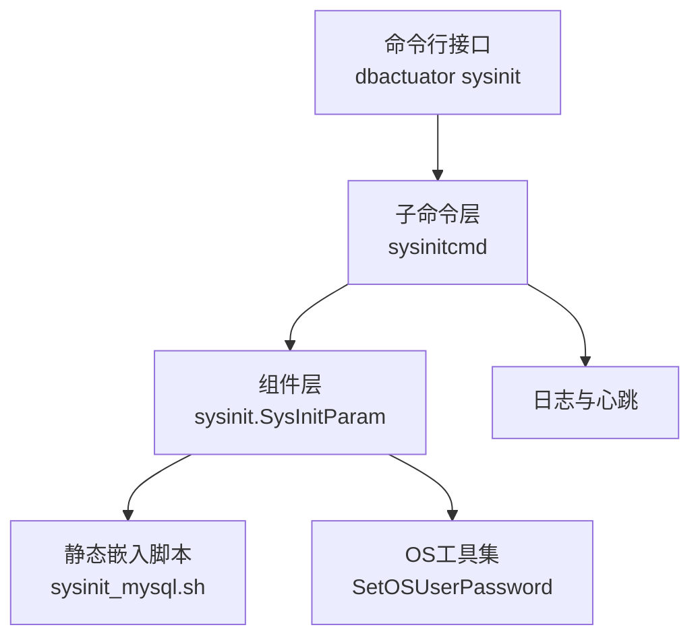
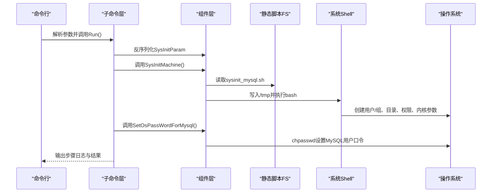
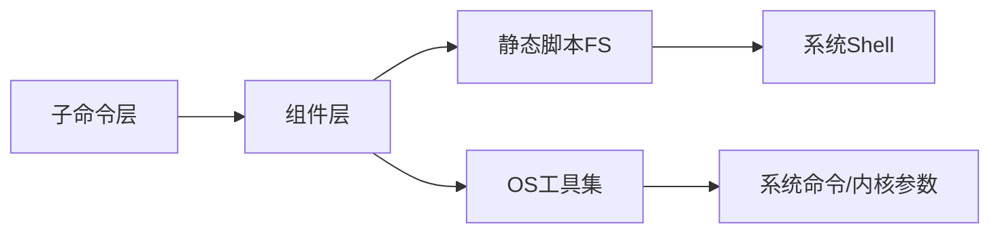

# MySQL系统初始化

<cite>
**本文引用的文件**
- [sysinit.go](file://dbm-services/mysql/db-tools/dbactuator/internal/subcmd/sysinitcmd/sysinit.go)
- [sysinitcmd.go](file://dbm-services/mysql/db-tools/dbactuator/internal/subcmd/sysinitcmd/sysinitcmd.go)
- [sysinit.go](file://dbm-services/mysql/db-tools/dbactuator/pkg/components/sysinit/sysinit.go)
- [sysinit_mysql.sh](file://dbm-services/mysql/db-tools/dbactuator/pkg/core/staticembed/sysinit_mysql.sh)
- [sysinit_mysql.go](file://dbm-services/mysql/db-tools/dbactuator/pkg/core/staticembed/sysinit_mysql.go)
- [osutil.go](file://dbm-services/mysql/db-tools/dbactuator/pkg/util/osutil/osutil.go)
- [cmd.go](file://dbm-services/mysql/db-tools/dbactuator/cmd/cmd.go)
- [subcmd.go](file://dbm-services/mysql/db-tools/dbactuator/internal/subcmd/subcmd.go)
- [util.go](file://dbm-services/mysql/db-tools/dbactuator/pkg/util/util.go)
- [README.md](file://dbm-services/mysql/db-tools/dbactuator/README.md)
- [Makefile](file://dbm-services/mysql/db-tools/dbactuator/Makefile)
- [build.sh](file://dbm-services/mysql/db-tools/dbactuator/build.sh)
</cite>

## 目录
1. [简介](#简介)
2. [项目结构](#项目结构)
3. [核心组件](#核心组件)
4. [架构总览](#架构总览)
5. [详细组件分析](#详细组件分析)
6. [依赖分析](#依赖分析)
7. [性能考虑](#性能考虑)
8. [故障排查指南](#故障排查指南)
9. [结论](#结论)
10. [附录](#附录)

## 简介
本文档围绕MySQL系统初始化功能，系统性梳理dbactuator中sysinit命令的实现与使用，覆盖系统环境检查、依赖安装与配置准备、系统用户与目录权限、网络与内核参数、安全配置、日志与错误处理、故障恢复、部署步骤与最佳实践等内容。读者无需深入Go语言即可理解并正确使用MySQL实例的系统级初始化流程。

## 项目结构
MySQL系统初始化能力位于dbactuator子模块中，采用“命令-组件-脚本-工具”的分层组织：
- 命令层：定义sysinit子命令及其参数解析与执行流程
- 组件层：封装系统初始化参数、脚本执行与OS密码设置
- 脚本层：静态嵌入的sysinit_mysql.sh，负责具体系统级变更
- 工具层：OS工具集，包括命令执行、用户管理、系统参数等

图表来源
- [cmd.go:108-110](file://dbm-services/mysql/db-tools/dbactuator/cmd/cmd.go#L108-L110)
- [sysinit.go:31-46](file://dbm-services/mysql/db-tools/dbactuator/internal/subcmd/sysinitcmd/sysinit.go#L31-L46)
- [sysinit.go:34-44](file://dbm-services/mysql/db-tools/dbactuator/pkg/components/sysinit/sysinit.go#L34-L44)
- [sysinit_mysql.sh:1-85](file://dbm-services/mysql/db-tools/dbactuator/pkg/core/staticembed/sysinit_mysql.sh#L1-L85)
- [osutil.go:509-530](file://dbm-services/mysql/db-tools/dbactuator/pkg/util/osutil/osutil.go#L509-L530)

章节来源
- [cmd.go:108-110](file://dbm-services/mysql/db-tools/dbactuator/cmd/cmd.go#L108-L110)
- [README.md:46-46](file://dbm-services/mysql/db-tools/dbactuator/README.md#L46-L46)

## 核心组件
- 子命令定义与执行链路：sysinit命令负责接收payload、反序列化参数、按顺序执行系统初始化脚本与OS密码设置，并输出步骤级日志与错误。
- 初始化参数模型：SysInitParam包含OS用户与密码字段，作为sysinit执行的输入。
- 脚本执行器：ExecSysInitScript负责读取静态嵌入的sysinit_mysql.sh，写入临时文件并以bash执行。
- OS密码设置：SetOSUserPassword通过chpasswd管道写入用户名与密码，实现MySQL系统用户口令重置。

章节来源
- [sysinit.go:24-82](file://dbm-services/mysql/db-tools/dbactuator/internal/subcmd/sysinitcmd/sysinit.go#L24-L82)
- [sysinit.go:23-78](file://dbm-services/mysql/db-tools/dbactuator/pkg/components/sysinit/sysinit.go#L23-L78)
- [osutil.go:509-530](file://dbm-services/mysql/db-tools/dbactuator/pkg/util/osutil/osutil.go#L509-L530)

## 架构总览
sysinit命令的执行流程如下：

图表来源
- [sysinit.go:57-82](file://dbm-services/mysql/db-tools/dbactuator/internal/subcmd/sysinitcmd/sysinit.go#L57-L82)
- [sysinit.go:34-65](file://dbm-services/mysql/db-tools/dbactuator/pkg/components/sysinit/sysinit.go#L34-L65)
- [sysinit_mysql.sh:53-65](file://dbm-services/mysql/db-tools/dbactuator/pkg/core/staticembed/sysinit_mysql.sh#L53-L65)
- [osutil.go:509-530](file://dbm-services/mysql/db-tools/dbactuator/pkg/util/osutil/osutil.go#L509-L530)

## 详细组件分析

### 子命令层：sysinit命令
- 参数解析：支持payload（base64或raw）与辅助参数，调用Validate()与DeserializeNonStandard()进行参数校验与反序列化。
- 步骤编排：按顺序执行“执行sysinit脚本”和“重置OS密码”，每步均记录日志并遇到错误立即返回。
- 错误处理：利用util.CheckErr包装错误，确保任一步失败即中断后续执行。

章节来源
- [sysinit.go:30-82](file://dbm-services/mysql/db-tools/dbactuator/internal/subcmd/sysinitcmd/sysinit.go#L30-L82)
- [subcmd.go:130-156](file://dbm-services/mysql/db-tools/dbactuator/internal/subcmd/subcmd.go#L130-L156)
- [util.go:35-67](file://dbm-services/mysql/db-tools/dbactuator/pkg/util/util.go#L35-L67)

### 组件层：SysInitParam与执行器
- SysInitParam：包含OsMysqlUser与OsMysqlPwd，作为系统初始化与密码设置的输入。
- SysInitMachine：调用ExecSysInitScript执行系统初始化脚本。
- SetOsPassWordForMysql：调用osutil.SetOSUserPassword设置MySQL系统用户口令。
- ExecSysInitScript：读取静态嵌入脚本、写入临时文件、以bash执行；失败时记录错误并返回。

章节来源
- [sysinit.go:23-78](file://dbm-services/mysql/db-tools/dbactuator/pkg/components/sysinit/sysinit.go#L23-L78)
- [sysinit_mysql.go:5-12](file://dbm-services/mysql/db-tools/dbactuator/pkg/core/staticembed/sysinit_mysql.go#L5-L12)

### 脚本层：sysinit_mysql.sh
脚本执行的主要系统级变更：
- 用户与组：若不存在mysql组则创建；若不存在mysql用户则useradd并设置主目录与有效期。
- 目录与权限：确保/data、/data1、/data/install、/data/dbha、/home/mysql/install等目录存在并归属mysql，必要时建立软链接。
- 系统参数：在/etc/profile追加ulimit、LC_ALL、PATH、umask等；在/etc/sysctl.conf追加fs.aio-max-nr并执行/sbin/sysctl -p。
- 密码设置：通过echo "mysql:$password"|chpasswd设置口令。

章节来源
- [sysinit_mysql.sh:15-84](file://dbm-services/mysql/db-tools/dbactuator/pkg/core/staticembed/sysinit_mysql.sh#L15-L84)

### 工具层：OS密码设置
- SetOSUserPassword：通过chpasswd进程的标准输入管道写入“用户名:口令”，避免交互式输入；失败时返回错误信息与输出。
- 其他OS工具：提供系统参数读取、磁盘信息、链接创建、当前用户查询等通用能力，为初始化提供支撑。

章节来源
- [osutil.go:509-530](file://dbm-services/mysql/db-tools/dbactuator/pkg/util/osutil/osutil.go#L509-L530)

### 命令注册与入口
- 主入口：cmd.go中注册sysinit命令至“sysinit operation sets”分组，统一暴露dbactuator命令树。
- 日志与心跳：SetLogger统一输出日志文件，startHeartbeat定时输出心跳，便于运维观察。

章节来源
- [cmd.go:108-110](file://dbm-services/mysql/db-tools/dbactuator/cmd/cmd.go#L108-L110)
- [cmd.go:202-213](file://dbm-services/mysql/db-tools/dbactuator/cmd/cmd.go#L202-L213)

## 依赖分析
- 命令层依赖组件层：sysinit命令通过SysInitAct编排组件层的SysInitMachine与SetOsPassWordForMysql。
- 组件层依赖脚本层与工具层：SysInitMachine依赖静态嵌入脚本FS与osutil工具；SetOsPassWordForMysql依赖osutil.SetOSUserPassword。
- 脚本层依赖系统环境：脚本直接操作用户、组、文件系统、内核参数与环境变量，需具备root权限。
- 工具层依赖系统命令：chpasswd、bash、ls、mkdir、chmod、chown、ln、sysctl等。

图表来源
- [sysinit.go:57-82](file://dbm-services/mysql/db-tools/dbactuator/internal/subcmd/sysinitcmd/sysinit.go#L57-L82)
- [sysinit.go:34-65](file://dbm-services/mysql/db-tools/dbactuator/pkg/components/sysinit/sysinit.go#L34-L65)
- [osutil.go:509-530](file://dbm-services/mysql/db-tools/dbactuator/pkg/util/osutil/osutil.go#L509-L530)

章节来源
- [sysinit.go:57-82](file://dbm-services/mysql/db-tools/dbactuator/internal/subcmd/sysinitcmd/sysinit.go#L57-L82)
- [sysinit.go:34-65](file://dbm-services/mysql/db-tools/dbactuator/pkg/components/sysinit/sysinit.go#L34-L65)
- [osutil.go:509-530](file://dbm-services/mysql/db-tools/dbactuator/pkg/util/osutil/osutil.go#L509-L530)

## 性能考虑
- 脚本执行：一次性写入临时脚本并执行，避免重复IO与多次shell启动开销。
- 日志输出：采用结构化日志与心跳输出，便于快速定位问题节点。
- 并发与重试：当前sysinit步骤串行执行，未内置重试逻辑；如需增强稳定性，可在上层编排中结合重试策略。

## 故障排查指南
常见问题与处理建议：
- 参数解析失败：检查payload是否为合法JSON并正确base64编码；确认payload-format参数选择正确。
- 脚本执行失败：查看日志文件中“read sysinit script failed”“write tmp script failed”“exec sysinit script failed”等错误；确认脚本可读、临时目录可写、bash可用。
- 密码设置失败：查看“run chpasswd failed”错误输出，确认chpasswd可用与用户存在；必要时在脚本中回退到手动设置。
- 权限不足：确保以root身份执行；检查sudoers配置与SELinux状态。
- 网络与内核参数：若sysctl修改未生效，检查/etc/sysctl.conf语法与/sbin/sysctl -p执行结果。

章节来源
- [subcmd.go:130-156](file://dbm-services/mysql/db-tools/dbactuator/internal/subcmd/subcmd.go#L130-L156)
- [sysinit.go:47-65](file://dbm-services/mysql/db-tools/dbactuator/pkg/components/sysinit/sysinit.go#L47-L65)
- [osutil.go:509-530](file://dbm-services/mysql/db-tools/dbactuator/pkg/util/osutil/osutil.go#L509-L530)

## 结论
MySQL系统初始化通过sysinit命令实现了从用户、目录、权限到内核参数的一站式准备，配合静态嵌入脚本与OS工具集，确保在不同环境中的一致性与可重复性。建议在生产部署中结合日志与心跳输出，严格校验payload与执行环境，并在上层编排中加入必要的重试与回滚策略。

## 附录

### 初始化步骤与参数
- 步骤一：执行系统初始化脚本
  - 功能：创建mysql用户与组、准备/data、/data1、/data/install、/home/mysql/install等目录，设置权限与软链接，追加系统环境变量与内核参数。
  - 触发：SysInitMachine调用ExecSysInitScript。
- 步骤二：重置MySQL系统用户口令
  - 功能：通过chpasswd设置指定用户口令。
  - 触发：SetOsPassWordForMysql调用osutil.SetOSUserPassword。

章节来源
- [sysinit.go:57-82](file://dbm-services/mysql/db-tools/dbactuator/internal/subcmd/sysinitcmd/sysinit.go#L57-L82)
- [sysinit.go:34-44](file://dbm-services/mysql/db-tools/dbactuator/pkg/components/sysinit/sysinit.go#L34-L44)
- [sysinit_mysql.sh:15-84](file://dbm-services/mysql/db-tools/dbactuator/pkg/core/staticembed/sysinit_mysql.sh#L15-L84)

### 配置参数说明
- OsMysqlUser：MySQL系统用户名称（默认mysql）
- OsMysqlPwd：MySQL系统用户口令（将通过chpasswd设置）

章节来源
- [sysinit.go:23-27](file://dbm-services/mysql/db-tools/dbactuator/pkg/components/sysinit/sysinit.go#L23-L27)

### 验证方法
- 用户与组：确认存在mysql用户与组，主目录为/home/mysql。
- 目录与权限：检查/data、/data1、/data/install、/home/mysql/install归属mysql，权限合理。
- 环境变量：确认/etc/profile中包含ulimit、LC_ALL、PATH、umask等。
- 内核参数：确认/etc/sysctl.conf中包含fs.aio-max-nr并执行sysctl -p生效。
- 口令设置：通过su切换到mysql用户验证口令可用。

章节来源
- [sysinit_mysql.sh:15-84](file://dbm-services/mysql/db-tools/dbactuator/pkg/core/staticembed/sysinit_mysql.sh#L15-L84)
- [osutil.go:509-530](file://dbm-services/mysql/db-tools/dbactuator/pkg/util/osutil/osutil.go#L509-L530)

### 实际部署场景与最佳实践
- 场景一：新机首次部署
  - 在目标主机以root执行dbactuator sysinit，提供包含user与pwd的payload；执行完成后验证目录、权限与口令。
- 场景二：批量初始化
  - 通过上层编排工具（如流水线）批量下发sysinit任务，统一记录日志与心跳输出，失败时及时回滚。
- 最佳实践
  - 明确payload格式与编码方式，避免base64解码失败。
  - 在执行前备份关键配置文件（如/etc/profile、/etc/sysctl.conf），以便回滚。
  - 严格控制口令安全，避免明文泄露；在上层系统中通过密钥管理服务注入。
  - 关注SELinux与防火墙策略，确保初始化后业务端口与工具链可用。

章节来源
- [README.md:46-46](file://dbm-services/mysql/db-tools/dbactuator/README.md#L46-L46)
- [Makefile:12-17](file://dbm-services/mysql/db-tools/dbactuator/Makefile#L12-L17)
- [build.sh:1-9](file://dbm-services/mysql/db-tools/dbactuator/build.sh#L1-L9)