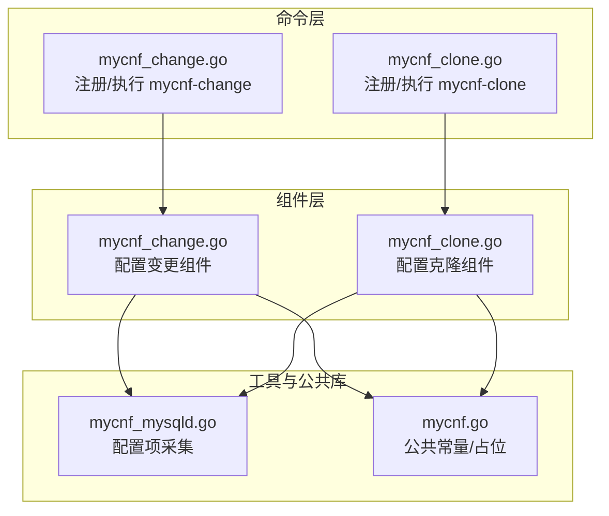
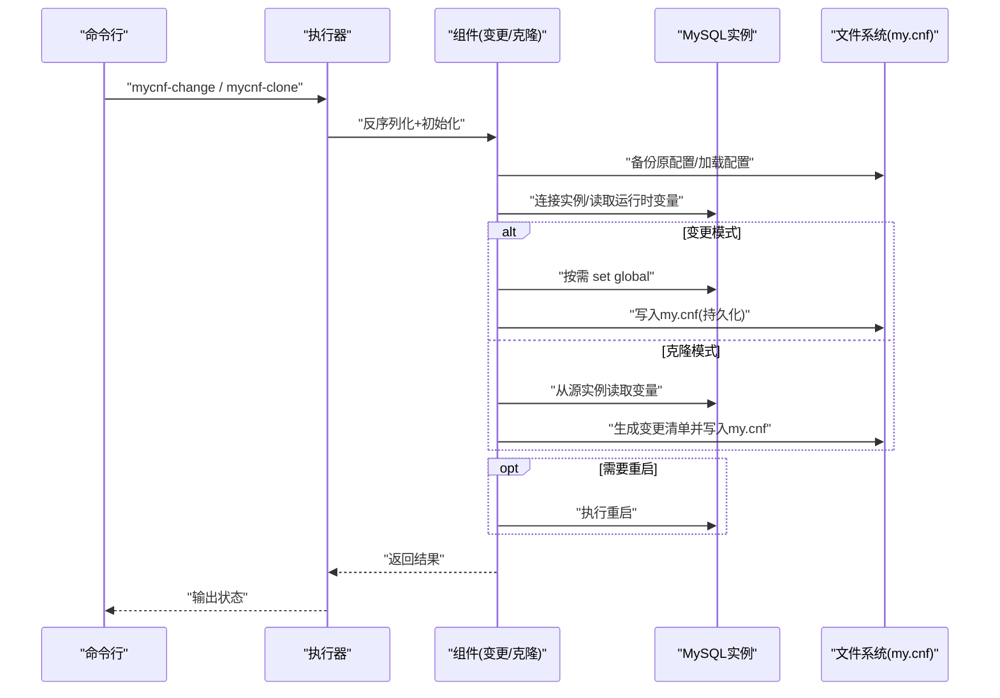
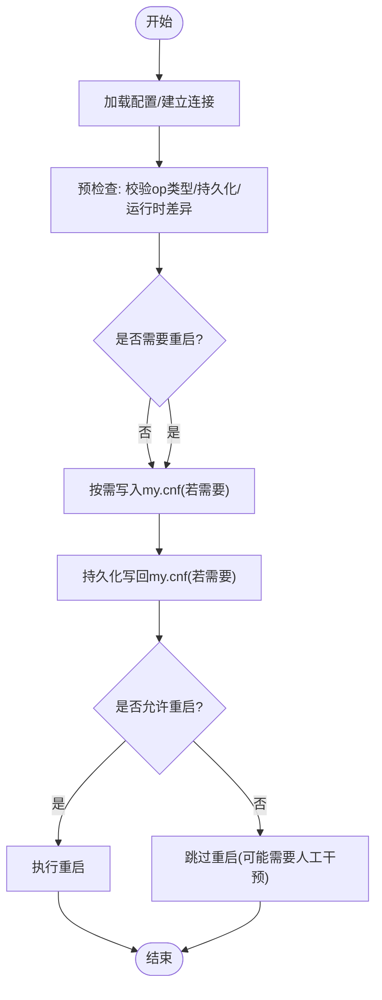
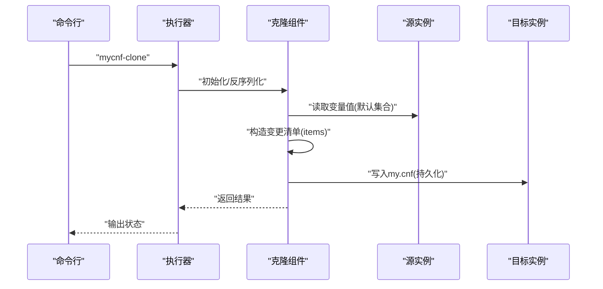
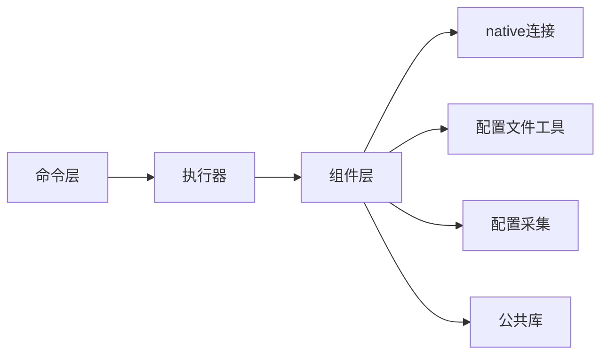

# MySQL配置管理

<cite>
**本文引用的文件**
- [mycnf_change.go](file://dbm-services/mysql/db-tools/dbactuator/internal/subcmd/mysqlcmd/mycnf_change.go)
- [mycnf_clone.go](file://dbm-services/mysql/db-tools/dbactuator/internal/subcmd/mysqlcmd/mycnf_clone.go)
- [mycnf_change.go](file://dbm-services/mysql/db-tools/dbactuator/pkg/components/mysql/mycnf_change.go)
- [mycnf_clone.go](file://dbm-services/mysql/db-tools/dbactuator/pkg/components/mysql/mycnf_clone.go)
- [mycnf_mysqld.go](file://dbm-services/mysql/db-tools/mysql-monitor/pkg/itemscollect/inforeport/configreport/mycnf_mysqld.go)
- [mycnf.go](file://dbm-services/common/go-pubpkg/mysqlcomm/mycnf.go)
</cite>

## 目录
1. [简介](#简介)
2. [项目结构](#项目结构)
3. [核心组件](#核心组件)
4. [架构总览](#架构总览)
5. [详细组件分析](#详细组件分析)
6. [依赖关系分析](#依赖关系分析)
7. [性能考量](#性能考量)
8. [故障排查指南](#故障排查指南)
9. [结论](#结论)
10. [附录](#附录)

## 简介
本文件系统性梳理MySQL配置管理能力，围绕以下目标展开：
- mycnf_change命令：配置修改、参数校验与热更新策略
- mycnf_clone命令：配置克隆、模板生成与批量部署思路
- init_common_config命令：通用配置初始化、默认值设置与环境适配（概念性说明）
- clear_instance_config命令：配置清理、重置恢复与故障诊断（概念性说明）

文档提供配置文件格式、参数说明、修改示例路径、典型应用场景与优化建议，帮助读者快速落地并安全地进行MySQL配置管理。

## 项目结构
MySQL配置管理相关代码主要分布在如下模块：
- 子命令层：负责命令注册、参数解析与执行流程编排
- 组件层：封装具体配置变更、克隆、校验与重启逻辑
- 工具与公共库：提供配置文件解析、备份、连接等通用能力
- 监控采集：提供配置项采集与上报能力，辅助配置一致性检查

**图表来源**
- [mycnf_change.go:1-93](file://dbm-services/mysql/db-tools/dbactuator/internal/subcmd/mysqlcmd/mycnf_change.go#L1-L93)
- [mycnf_clone.go:1-93](file://dbm-services/mysql/db-tools/dbactuator/internal/subcmd/mysqlcmd/mycnf_clone.go#L1-L93)
- [mycnf_change.go:1-269](file://dbm-services/mysql/db-tools/dbactuator/pkg/components/mysql/mycnf_change.go#L1-L269)
- [mycnf_clone.go:1-156](file://dbm-services/mysql/db-tools/dbactuator/pkg/components/mysql/mycnf_clone.go#L1-L156)
- [mycnf_mysqld.go](file://dbm-services/mysql/db-tools/mysql-monitor/pkg/itemscollect/inforeport/configreport/mycnf_mysqld.go)
- [mycnf.go:1-14](file://dbm-services/common/go-pubpkg/mysqlcomm/mycnf.go#L1-L14)

**章节来源**
- [mycnf_change.go:1-93](file://dbm-services/mysql/db-tools/dbactuator/internal/subcmd/mysqlcmd/mycnf_change.go#L1-L93)
- [mycnf_clone.go:1-93](file://dbm-services/mysql/db-tools/dbactuator/internal/subcmd/mysqlcmd/mycnf_clone.go#L1-L93)
- [mycnf_change.go:1-269](file://dbm-services/mysql/db-tools/dbactuator/pkg/components/mysql/mycnf_change.go#L1-L269)
- [mycnf_clone.go:1-156](file://dbm-services/mysql/db-tools/dbactuator/pkg/components/mysql/mycnf_clone.go#L1-L156)
- [mycnf_mysqld.go](file://dbm-services/mysql/db-tools/mysql-monitor/pkg/itemscollect/inforeport/configreport/mycnf_mysqld.go)
- [mycnf.go:1-14](file://dbm-services/common/go-pubpkg/mysqlcomm/mycnf.go#L1-L14)

## 核心组件
- 配置变更组件（mycnf_change）：支持按端口批量修改my.cnf，区分“仅运行时生效”“持久化到文件”“仅持久化不改运行时”，并基于NeedRestart与Restart策略决定是否重启。
- 配置克隆组件（mycnf_clone）：从源实例采集一组关键参数，生成变更清单并应用到目标实例；默认集合覆盖主从复制、字符集、连接数、查询超时等常用参数。
- 配置采集组件（mycnf_mysqld）：监控侧采集MySQL配置项，用于一致性核对与异常检测。

**章节来源**
- [mycnf_change.go:25-87](file://dbm-services/mysql/db-tools/dbactuator/pkg/components/mysql/mycnf_change.go#L25-L87)
- [mycnf_clone.go:75-93](file://dbm-services/mysql/db-tools/dbactuator/pkg/components/mysql/mycnf_clone.go#L75-L93)
- [mycnf_mysqld.go](file://dbm-services/mysql/db-tools/mysql-monitor/pkg/itemscollect/inforeport/configreport/mycnf_mysqld.go)

## 架构总览
下图展示命令到组件再到数据库与配置文件的交互路径，以及可选的重启流程。

**图表来源**
- [mycnf_change.go:68-92](file://dbm-services/mysql/db-tools/dbactuator/internal/subcmd/mysqlcmd/mycnf_change.go#L68-L92)
- [mycnf_clone.go:69-92](file://dbm-services/mysql/db-tools/dbactuator/internal/subcmd/mysqlcmd/mycnf_clone.go#L69-L92)
- [mycnf_change.go:108-145](file://dbm-services/mysql/db-tools/dbactuator/pkg/components/mysql/mycnf_change.go#L108-L145)
- [mycnf_clone.go:95-137](file://dbm-services/mysql/db-tools/dbactuator/pkg/components/mysql/mycnf_clone.go#L95-L137)

## 详细组件分析

### mycnf_change 命令与组件
- 命令入口：注册“mycnf-change”子命令，绑定执行器，完成参数校验、初始化与步骤编排。
- 执行流程：加载配置文件 → 预检查（校验op类型、持久化与运行时差异、是否需要重启）→ 修改配置（运行时set global或持久化到my.cnf）→ 可选重启。
- 关键参数：
  - Items：键为“区段.参数名”，值含“op_type”“conf_value”“need_restart”
  - Persistent：-1（仅运行时）、1（运行时+持久化）、2（仅持久化）
  - Restart：-1（不允许重启）、1（强制重启）、2（自动判断）
  - Host/Ports：目标实例地址与端口列表
- 热更新策略：
  - 若op_type=remove或Persistent=-1，仅运行时生效，不写回文件
  - 若Persistent>=1，先写回my.cnf，再按need_restart或Restart策略决定是否重启
  - 对于只读变量，尝试set global失败时记录需要重启，避免静默失败

**图表来源**
- [mycnf_change.go:68-92](file://dbm-services/mysql/db-tools/dbactuator/internal/subcmd/mysqlcmd/mycnf_change.go#L68-L92)
- [mycnf_change.go:147-203](file://dbm-services/mysql/db-tools/dbactuator/pkg/components/mysql/mycnf_change.go#L147-L203)
- [mycnf_change.go:205-256](file://dbm-services/mysql/db-tools/dbactuator/pkg/components/mysql/mycnf_change.go#L205-L256)

**章节来源**
- [mycnf_change.go:14-92](file://dbm-services/mysql/db-tools/dbactuator/internal/subcmd/mysqlcmd/mycnf_change.go#L14-L92)
- [mycnf_change.go:25-87](file://dbm-services/mysql/db-tools/dbactuator/pkg/components/mysql/mycnf_change.go#L25-L87)
- [mycnf_change.go:108-145](file://dbm-services/mysql/db-tools/dbactuator/pkg/components/mysql/mycnf_change.go#L108-L145)
- [mycnf_change.go:147-203](file://dbm-services/mysql/db-tools/dbactuator/pkg/components/mysql/mycnf_change.go#L147-L203)
- [mycnf_change.go:205-256](file://dbm-services/mysql/db-tools/dbactuator/pkg/components/mysql/mycnf_change.go#L205-L256)

### mycnf_clone 命令与组件
- 命令入口：注册“mycnf-clone”子命令，绑定执行器，完成参数校验、初始化与步骤编排。
- 执行流程：从源实例读取一组变量值 → 生成变更清单（默认集合）→ 写入目标实例my.cnf → 可选重启。
- 关键参数：
  - SrcInstance/TgtInstance：源/目标实例连接信息
  - Persistent/Restart：同上
  - Items：可选自定义变量列表，默认使用内置集合
- 默认克隆集合：包含binlog、字符集、连接数、超时、表缓存、复制并行等常用参数，兼顾主从一致性与兼容性。

**图表来源**
- [mycnf_clone.go:20-92](file://dbm-services/mysql/db-tools/dbactuator/internal/subcmd/mysqlcmd/mycnf_clone.go#L20-L92)
- [mycnf_clone.go:75-137](file://dbm-services/mysql/db-tools/dbactuator/pkg/components/mysql/mycnf_clone.go#L75-L137)

**章节来源**
- [mycnf_clone.go:14-92](file://dbm-services/mysql/db-tools/dbactuator/internal/subcmd/mysqlcmd/mycnf_clone.go#L14-L92)
- [mycnf_clone.go:15-93](file://dbm-services/mysql/db-tools/dbactuator/pkg/components/mysql/mycnf_clone.go#L15-L93)
- [mycnf_clone.go:95-137](file://dbm-services/mysql/db-tools/dbactuator/pkg/components/mysql/mycnf_clone.go#L95-L137)

### 配置采集与一致性核对
- 配置采集组件负责从MySQL实例读取配置项，便于在运维平台或巡检任务中进行一致性比对与异常告警。
- 采集结果可用于：
  - 配置审计：对比目标实例与基准配置
  - 故障定位：发现运行时与持久化配置不一致的情况
  - 自动化：作为mycnf_change/clone的输入数据源

**章节来源**
- [mycnf_mysqld.go](file://dbm-services/mysql/db-tools/mysql-monitor/pkg/itemscollect/inforeport/configreport/mycnf_mysqld.go)

### 通用配置初始化与清理（概念性说明）
- init_common_config（概念性）：用于统一初始化MySQL通用配置，设置默认值并适配不同环境（如容器、裸金属、云主机）。建议结合环境变量与模板引擎生成最终配置文件。
- clear_instance_config（概念性）：用于清理实例配置，恢复默认值或移除自定义项，支持回滚与诊断日志输出，便于故障复盘与快速恢复。

[本节为概念性说明，不直接分析具体文件，故无“章节来源”]

## 依赖关系分析
- 命令层依赖组件层：命令通过执行器调用组件的Init/PreCheck/Start方法
- 组件层依赖数据库连接与配置文件工具：通过native连接实例，通过util解析/写回my.cnf
- 组件层依赖监控采集：用于一致性核对与异常检测
- 公共库提供基础能力：如mycnf.go中的常量与占位，便于后续扩展

**图表来源**
- [mycnf_change.go:1-93](file://dbm-services/mysql/db-tools/dbactuator/internal/subcmd/mysqlcmd/mycnf_change.go#L1-L93)
- [mycnf_clone.go:1-93](file://dbm-services/mysql/db-tools/dbactuator/internal/subcmd/mysqlcmd/mycnf_clone.go#L1-L93)
- [mycnf_change.go:1-269](file://dbm-services/mysql/db-tools/dbactuator/pkg/components/mysql/mycnf_change.go#L1-L269)
- [mycnf_clone.go:1-156](file://dbm-services/mysql/db-tools/dbactuator/pkg/components/mysql/mycnf_clone.go#L1-L156)
- [mycnf_mysqld.go](file://dbm-services/mysql/db-tools/mysql-monitor/pkg/itemscollect/inforeport/configreport/mycnf_mysqld.go)
- [mycnf.go:1-14](file://dbm-services/common/go-pubpkg/mysqlcomm/mycnf.go#L1-L14)

**章节来源**
- [mycnf_change.go:1-269](file://dbm-services/mysql/db-tools/dbactuator/pkg/components/mysql/mycnf_change.go#L1-L269)
- [mycnf_clone.go:1-156](file://dbm-services/mysql/db-tools/dbactuator/pkg/components/mysql/mycnf_clone.go#L1-L156)
- [mycnf_mysqld.go](file://dbm-services/mysql/db-tools/mysql-monitor/pkg/itemscollect/inforeport/configreport/mycnf_mysqld.go)
- [mycnf.go:1-14](file://dbm-services/common/go-pubpkg/mysqlcomm/mycnf.go#L1-L14)

## 性能考量
- 批量端口处理：组件支持多端口并发处理，建议在保证幂等的前提下减少重复连接与IO
- 运行时vs持久化：优先使用“仅运行时”临时调优，避免频繁重启；仅在必要时持久化到my.cnf
- 变量读取与写回：尽量合并多次写入，减少磁盘IO与锁竞争
- 重启策略：在业务低峰期执行重启，或采用滚动重启降低影响面

[本节为通用指导，不直接分析具体文件，故无“章节来源”]

## 故障排查指南
- 预检查失败
  - 现象：op_type非法、无法读取运行时变量、持久化失败
  - 排查：确认参数格式、权限与网络连通性；查看组件日志中的错误堆栈
- 只读变量导致重启
  - 现象：set global失败但提示需要重启
  - 排查：确认变量是否只读；若必须修改，选择持久化并重启
- 重启后异常
  - 现象：实例启动失败或配置未生效
  - 排查：检查备份文件与my.cnf语法；核对监控采集结果与运行时变量
- 采集不一致
  - 现象：运行时与持久化配置不一致
  - 排查：通过配置采集组件比对；必要时执行mycnf_change进行修正

**章节来源**
- [mycnf_change.go:147-203](file://dbm-services/mysql/db-tools/dbactuator/pkg/components/mysql/mycnf_change.go#L147-L203)
- [mycnf_change.go:205-256](file://dbm-services/mysql/db-tools/dbactuator/pkg/components/mysql/mycnf_change.go#L205-L256)
- [mycnf_mysqld.go](file://dbm-services/mysql/db-tools/mysql-monitor/pkg/itemscollect/inforeport/configreport/mycnf_mysqld.go)

## 结论
- mycnf_change提供了灵活的配置修改能力，支持运行时与持久化双通道，并以NeedRestart/Restart策略保障安全变更
- mycnf_clone通过默认集合与可选自定义项，实现跨实例的一致性配置迁移
- 建议在变更前做好备份与预检查，在低峰期执行重启，并结合监控采集进行一致性核对

[本节为总结性内容，不直接分析具体文件，故无“章节来源”]

## 附录

### 配置文件格式与参数说明
- 配置文件：my.cnf（通常位于标准路径），由组件加载并备份
- 参数命名：采用“区段.参数名”的形式，如“mysqld.binlog_format”
- 常用参数类别：
  - 复制与日志：binlog_format、binlog_row_image、max_binlog_size、log_bin_compress、replica_parallel_workers等
  - 字符集与排序：character_set_server、collation_server、lower_case_table_names
  - 连接与资源：max_connections、interactive_timeout、wait_timeout、table_open_cache、innodb_buffer_pool_size
  - 安全与合规：secure_file_priv、sql_mode、innodb_strict_mode

**章节来源**
- [mycnf_clone.go:40-73](file://dbm-services/mysql/db-tools/dbactuator/pkg/components/mysql/mycnf_clone.go#L40-L73)
- [mycnf_change.go:76-87](file://dbm-services/mysql/db-tools/dbactuator/pkg/components/mysql/mycnf_change.go#L76-L87)

### 修改示例（路径指引）
- mycnf_change 示例（运行时+持久化）：参考组件Example字段，包含items与账户信息
  - 示例路径：[mycnf_change.go:39-66](file://dbm-services/mysql/db-tools/dbactuator/pkg/components/mysql/mycnf_change.go#L39-L66)
- mycnf_clone 示例（默认集合）：参考组件Example字段，包含源/目标实例与账户信息
  - 示例路径：[mycnf_clone.go:21-38](file://dbm-services/mysql/db-tools/dbactuator/pkg/components/mysql/mycnf_clone.go#L21-L38)

**章节来源**
- [mycnf_change.go:39-66](file://dbm-services/mysql/db-tools/dbactuator/pkg/components/mysql/mycnf_change.go#L39-L66)
- [mycnf_clone.go:21-38](file://dbm-services/mysql/db-tools/dbactuator/pkg/components/mysql/mycnf_clone.go#L21-L38)

### 实际场景应用案例
- 主从一致性修复：使用mycnf_clone从主库采集关键参数到从库，确保复制行为一致
  - 参考路径：[mycnf_clone.go:95-137](file://dbm-services/mysql/db-tools/dbactuator/pkg/components/mysql/mycnf_clone.go#L95-L137)
- 临时调优：使用mycnf_change将某些参数仅运行时生效，快速验证效果
  - 参考路径：[mycnf_change.go:205-235](file://dbm-services/mysql/db-tools/dbactuator/pkg/components/mysql/mycnf_change.go#L205-L235)
- 批量配置同步：对多个端口执行相同配置变更，结合Persistent与Restart策略
  - 参考路径：[mycnf_change.go:258-268](file://dbm-services/mysql/db-tools/dbactuator/pkg/components/mysql/mycnf_change.go#L258-L268)

**章节来源**
- [mycnf_clone.go:95-137](file://dbm-services/mysql/db-tools/dbactuator/pkg/components/mysql/mycnf_clone.go#L95-L137)
- [mycnf_change.go:205-268](file://dbm-services/mysql/db-tools/dbactuator/pkg/components/mysql/mycnf_change.go#L205-L268)

### 配置优化最佳实践
- 变更前备份：组件会在修改前备份原配置文件，仍建议在变更窗口外执行
- 分批执行：对大量实例分批变更，观察监控后再推进
- 优先运行时：对非持久化参数先运行时生效，确认无副作用后再持久化
- 重启窗口：集中安排重启，避免频繁重启造成抖动
- 一致性核对：结合监控采集组件定期比对运行时与持久化配置

[本节为通用指导，不直接分析具体文件，故无“章节来源”]