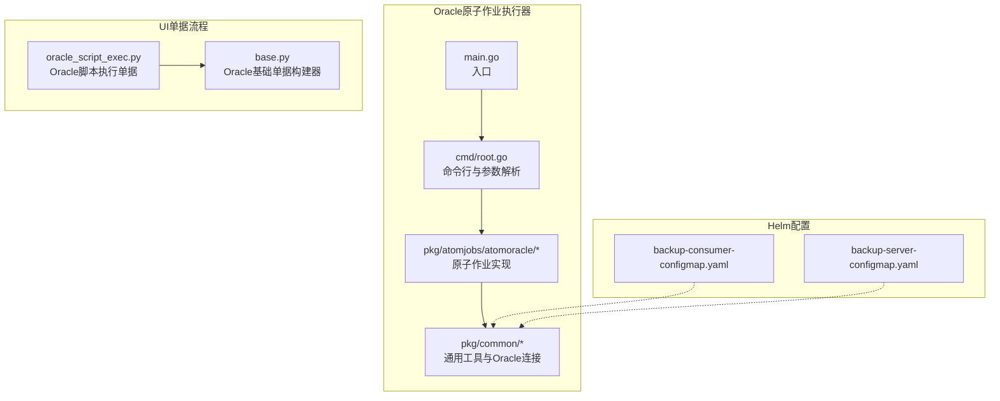
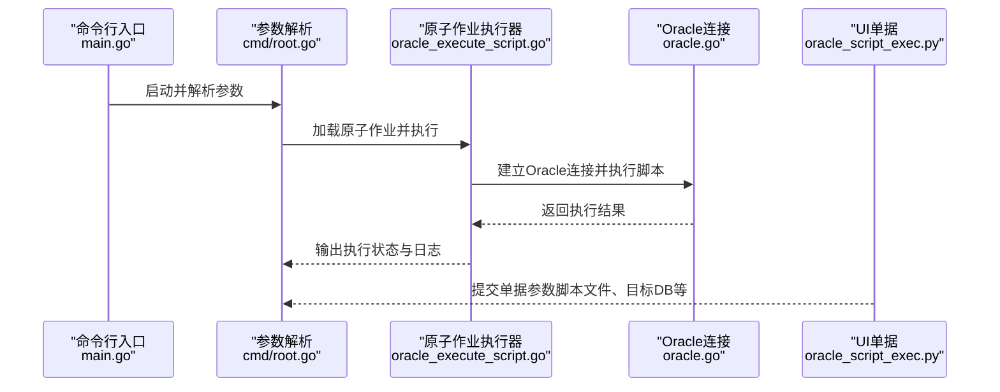
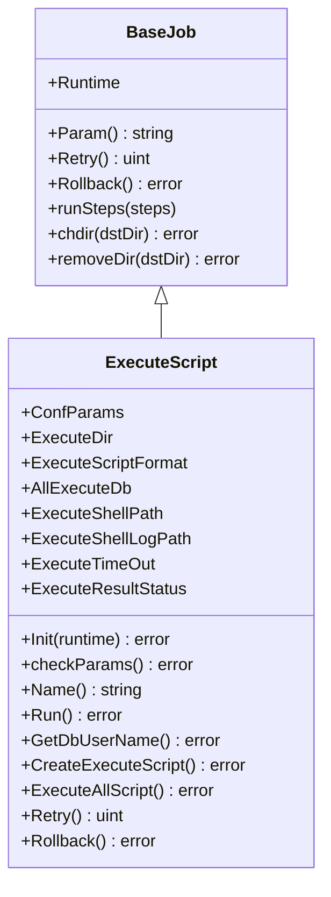
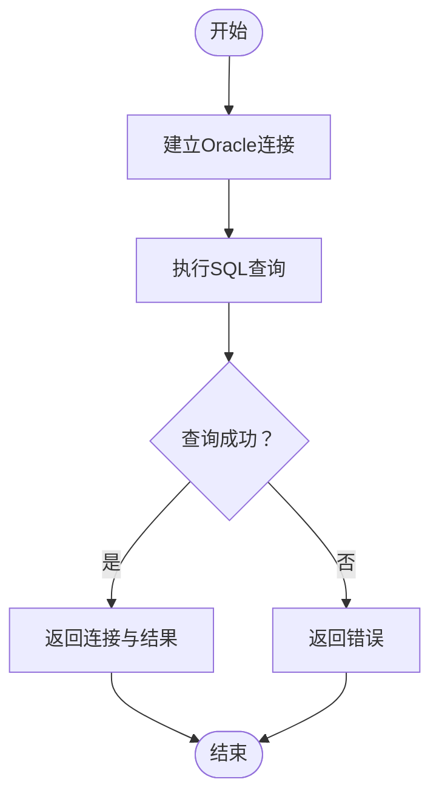
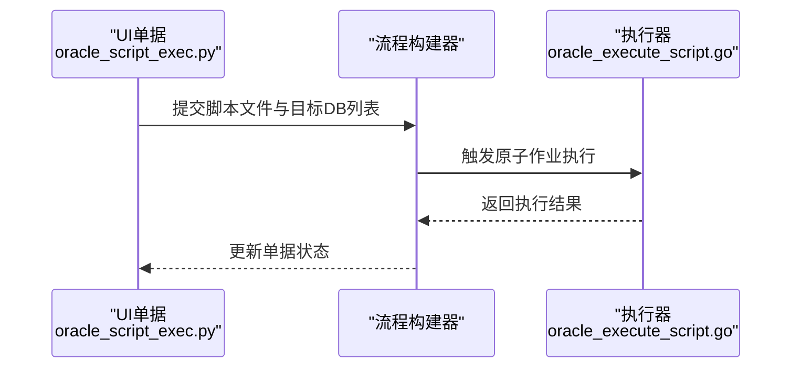
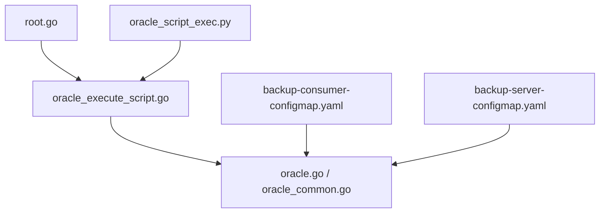

# Oracle备份恢复

<cite>
**本文引用的文件**
- [README.md](file://dbm-services/oracle/db-tools/dbactuator/README.md)
- [main.go](file://dbm-services/oracle/db-tools/dbactuator/main.go)
- [root.go](file://dbm-services/oracle/db-tools/dbactuator/cmd/root.go)
- [oracle_execute_script.go](file://dbm-services/oracle/db-tools/dbactuator/pkg/atomjobs/atomoracle/oracle_execute_script.go)
- [base_job.go](file://dbm-services/oracle/db-tools/dbactuator/pkg/atomjobs/atomoracle/base_job.go)
- [oracle.go](file://dbm-services/oracle/db-tools/dbactuator/pkg/common/oracle.go)
- [oracle_common.go](file://dbm-services/oracle/db-tools/dbactuator/pkg/common/oracle_common.go)
- [backup-consumer-configmap.yaml](file://helm-charts/bk-dbm/templates/configmaps/backup-consumer-configmap.yaml)
- [backup-server-configmap.yaml](file://helm-charts/bk-dbm/templates/configmaps/backup-server-configmap.yaml)
- [base.py](file://dbm-ui/backend/ticket/builders/oracle/base.py)
- [oracle_script_exec.py](file://dbm-ui/backend/ticket/builders/oracle/oracle_script_exec.py)
</cite>

## 目录
1. [简介](#简介)
2. [项目结构](#项目结构)
3. [核心组件](#核心组件)
4. [架构总览](#架构总览)
5. [详细组件分析](#详细组件分析)
6. [依赖分析](#依赖分析)
7. [性能考虑](#性能考虑)
8. [故障排查指南](#故障排查指南)
9. [结论](#结论)
10. [附录](#附录)

## 简介
本文件面向Oracle数据库备份与恢复场景，结合代码库中的Oracle原子作业执行器与相关UI单据流程，系统化阐述以下主题：
- 备份策略与恢复机制：物理备份、逻辑备份、增量备份、时间点恢复（PITR）的概念性说明与实施建议
- RMAN工具使用：备份集创建、镜像拷贝、通道配置、备份验证的流程化指导
- 闪回技术与归档日志管理：基于现有代码库对闪回与归档日志相关能力的定位与建议
- 备份恢复最佳实践、性能优化与故障恢复案例：结合代码中的可重入设计与日志输出进行落地建议

说明：本仓库中未发现直接的RMAN脚本或Oracle备份恢复自动化脚本。本文在不虚构具体命令的前提下，基于现有组件与通用Oracle备份恢复知识，给出可操作的流程与最佳实践。

## 项目结构
围绕Oracle备份恢复的相关代码主要分布在以下模块：
- Oracle原子作业执行器：负责接收任务参数、解析并执行脚本，支持可重入与日志输出
- UI单据流程：定义Oracle变更脚本执行的申请与执行流程
- Helm配置：提供备份消费者与备份服务器的运行时配置模板

图表来源
- [main.go:1-13](file://dbm-services/oracle/db-tools/dbactuator/main.go#L1-L13)
- [root.go:67-104](file://dbm-services/oracle/db-tools/dbactuator/cmd/root.go#L67-L104)
- [oracle_execute_script.go:32-121](file://dbm-services/oracle/db-tools/dbactuator/pkg/atomjobs/atomoracle/oracle_execute_script.go#L32-L121)
- [oracle.go:13-36](file://dbm-services/oracle/db-tools/dbactuator/pkg/common/oracle.go#L13-L36)
- [oracle_script_exec.py:24-50](file://dbm-ui/backend/ticket/builders/oracle/oracle_script_exec.py#L24-L50)
- [base.py:17-19](file://dbm-ui/backend/ticket/builders/oracle/base.py#L17-L19)
- [backup-consumer-configmap.yaml:1-37](file://helm-charts/bk-dbm/templates/configmaps/backup-consumer-configmap.yaml#L1-L37)
- [backup-server-configmap.yaml:40-91](file://helm-charts/bk-dbm/templates/configmaps/backup-server-configmap.yaml#L40-L91)

章节来源
- [main.go:1-13](file://dbm-services/oracle/db-tools/dbactuator/main.go#L1-L13)
- [root.go:67-104](file://dbm-services/oracle/db-tools/dbactuator/cmd/root.go#L67-L104)
- [README.md:1-84](file://dbm-services/oracle/db-tools/dbactuator/README.md#L1-L84)

## 核心组件
- 命令行入口与参数解析：提供UID、RootID、NodeID、Payload、原子作业列表、数据/备份目录、用户/组等参数，并加载原子作业执行
- 原子作业执行器：封装作业生命周期（Init/Run/Rollback/Retry），支持可重入与串行执行
- Oracle连接与脚本执行：通过通用模块连接Oracle，按用户生成执行脚本与日志，支持超时控制与错误截断日志输出
- UI单据：定义Oracle脚本执行的申请与执行流程，便于在平台侧编排备份恢复相关操作

章节来源
- [root.go:150-170](file://dbm-services/oracle/db-tools/dbactuator/cmd/root.go#L150-L170)
- [oracle_execute_script.go:32-121](file://dbm-services/oracle/db-tools/dbactuator/pkg/atomjobs/atomoracle/oracle_execute_script.go#L32-L121)
- [oracle.go:13-36](file://dbm-services/oracle/db-tools/dbactuator/pkg/common/oracle.go#L13-L36)
- [oracle_script_exec.py:24-50](file://dbm-ui/backend/ticket/builders/oracle/oracle_script_exec.py#L24-L50)

## 架构总览
Oracle备份恢复相关架构由“命令行入口—原子作业—通用工具—UI单据—Helm配置”构成，形成从参数到执行再到可观测性的闭环。

图表来源
- [main.go:10-12](file://dbm-services/oracle/db-tools/dbactuator/main.go#L10-L12)
- [root.go:90-104](file://dbm-services/oracle/db-tools/dbactuator/cmd/root.go#L90-L104)
- [oracle_execute_script.go:106-121](file://dbm-services/oracle/db-tools/dbactuator/pkg/atomjobs/atomoracle/oracle_execute_script.go#L106-L121)
- [oracle.go:13-36](file://dbm-services/oracle/db-tools/dbactuator/pkg/common/oracle.go#L13-L36)
- [oracle_script_exec.py:24-50](file://dbm-ui/backend/ticket/builders/oracle/oracle_script_exec.py#L24-L50)

## 详细组件分析

### 组件A：Oracle原子作业执行器（脚本执行）
- 职责：接收参数、解析目标DB、生成执行脚本与日志、串行执行并输出结果
- 关键流程：
  - 参数校验与初始化
  - 查询目标DB并生成脚本
  - 逐个执行脚本并记录成功/失败列表
  - 支持重试与可重入设计

图表来源
- [base_job.go:14-96](file://dbm-services/oracle/db-tools/dbactuator/pkg/atomjobs/atomoracle/base_job.go#L14-L96)
- [oracle_execute_script.go:32-267](file://dbm-services/oracle/db-tools/dbactuator/pkg/atomjobs/atomoracle/oracle_execute_script.go#L32-L267)

章节来源
- [oracle_execute_script.go:56-121](file://dbm-services/oracle/db-tools/dbactuator/pkg/atomjobs/atomoracle/oracle_execute_script.go#L56-L121)
- [base_job.go:64-74](file://dbm-services/oracle/db-tools/dbactuator/pkg/atomjobs/atomoracle/base_job.go#L64-L74)

### 组件B：Oracle连接与通用工具
- Oracle连接：短连接方式建立连接并执行查询
- 文件与权限：创建文件并修改属主，确保作业在正确用户下执行

图表来源
- [oracle.go:13-36](file://dbm-services/oracle/db-tools/dbactuator/pkg/common/oracle.go#L13-L36)

章节来源
- [oracle_common.go:12-39](file://dbm-services/oracle/db-tools/dbactuator/pkg/common/oracle_common.go#L12-L39)
- [oracle.go:13-36](file://dbm-services/oracle/db-tools/dbactuator/pkg/common/oracle.go#L13-L36)

### 组件C：UI单据与流程（Oracle脚本执行）
- 定义Oracle脚本执行的参数序列化器与流程构建器，便于在平台侧提交备份恢复相关脚本执行请求

图表来源
- [oracle_script_exec.py:24-50](file://dbm-ui/backend/ticket/builders/oracle/oracle_script_exec.py#L24-L50)
- [oracle_execute_script.go:106-121](file://dbm-services/oracle/db-tools/dbactuator/pkg/atomjobs/atomoracle/oracle_execute_script.go#L106-L121)

章节来源
- [oracle_script_exec.py:24-50](file://dbm-ui/backend/ticket/builders/oracle/oracle_script_exec.py#L24-L50)
- [base.py:17-19](file://dbm-ui/backend/ticket/builders/oracle/base.py#L17-L19)

## 依赖分析
- 组件耦合与内聚：
  - 原子作业与通用工具解耦，通过接口与参数传递交互
  - UI单据与执行器通过参数与流程编排耦合
- 外部依赖：
  - Oracle驱动用于连接与查询
  - Helm配置提供备份消费者与备份服务器的运行时参数

图表来源
- [root.go:90-104](file://dbm-services/oracle/db-tools/dbactuator/cmd/root.go#L90-L104)
- [oracle_execute_script.go:106-121](file://dbm-services/oracle/db-tools/dbactuator/pkg/atomjobs/atomoracle/oracle_execute_script.go#L106-L121)
- [oracle.go:13-36](file://dbm-services/oracle/db-tools/dbactuator/pkg/common/oracle.go#L13-L36)
- [oracle_common.go:12-39](file://dbm-services/oracle/db-tools/dbactuator/pkg/common/oracle_common.go#L12-L39)
- [backup-consumer-configmap.yaml:1-37](file://helm-charts/bk-dbm/templates/configmaps/backup-consumer-configmap.yaml#L1-L37)
- [backup-server-configmap.yaml:40-91](file://helm-charts/bk-dbm/templates/configmaps/backup-server-configmap.yaml#L40-L91)

章节来源
- [root.go:90-104](file://dbm-services/oracle/db-tools/dbactuator/cmd/root.go#L90-L104)
- [oracle_execute_script.go:106-121](file://dbm-services/oracle/db-tools/dbactuator/pkg/atomjobs/atomoracle/oracle_execute_script.go#L106-L121)
- [oracle.go:13-36](file://dbm-services/oracle/db-tools/dbactuator/pkg/common/oracle.go#L13-L36)

## 性能考虑
- 可重入设计：原子作业建议实现为可重入，降低回滚复杂度与风险，提升用户重试体验
- 并发与超时：脚本执行支持超时控制，避免长时间阻塞；建议在批量执行时采用串行或受控并发
- 日志与可观测性：执行器输出执行日志与最后若干行错误日志，便于快速定位问题
- 连接策略：通用模块使用短连接，避免连接池带来的资源占用与长事务影响

章节来源
- [README.md:71-78](file://dbm-services/oracle/db-tools/dbactuator/README.md#L71-L78)
- [oracle_execute_script.go:225-256](file://dbm-services/oracle/db-tools/dbactuator/pkg/atomjobs/atomoracle/oracle_execute_script.go#L225-L256)
- [oracle.go:24-26](file://dbm-services/oracle/db-tools/dbactuator/pkg/common/oracle.go#L24-L26)

## 故障排查指南
- 参数校验失败：检查参数格式与必填字段，确保Payload解析正确
- 脚本执行失败：查看对应用户日志文件，结合最后若干行错误日志定位问题
- 连接失败：确认Oracle连接字符串、用户名与密码、服务名与网络可达性
- 权限问题：确认生成的脚本文件属主与权限，确保执行用户具备相应权限

章节来源
- [oracle_execute_script.go:87-99](file://dbm-services/oracle/db-tools/dbactuator/pkg/atomjobs/atomoracle/oracle_execute_script.go#L87-L99)
- [oracle_execute_script.go:225-256](file://dbm-services/oracle/db-tools/dbactuator/pkg/atomjobs/atomoracle/oracle_execute_script.go#L225-L256)
- [oracle.go:13-36](file://dbm-services/oracle/db-tools/dbactuator/pkg/common/oracle.go#L13-L36)
- [oracle_common.go:12-39](file://dbm-services/oracle/db-tools/dbactuator/pkg/common/oracle_common.go#L12-L39)

## 结论
本仓库提供了Oracle备份恢复场景下的关键支撑能力：
- 原子作业执行器支持可重入、串行执行与完善的日志输出
- UI单据流程便于在平台侧编排脚本执行
- 通用模块提供Oracle连接与文件权限处理
- Helm配置为备份消费者与备份服务器提供运行时参数

结合上述能力，可在不直接依赖RMAN脚本的前提下，通过平台化的参数与流程编排，完成Oracle备份恢复相关任务的自动化与可观测化。

## 附录

### 备份策略与恢复机制（概念性说明）
- 物理备份：对数据文件、控制文件、重做日志等进行备份，适合全量恢复与高可靠性场景
- 逻辑备份：导出DDL/DML或使用逻辑工具进行备份，适合跨版本迁移与部分对象恢复
- 增量备份：基于上次备份的变更内容进行备份，减少存储与传输开销
- 时间点恢复（PITR）：结合归档日志与备份，在指定时间点进行精确恢复

### RMAN使用要点（流程化指导）
- 备份集创建：规划备份类型（全备/增备）、备份路径与保留策略
- 镜像拷贝：对数据文件进行物理复制，提高恢复速度
- 通道配置：合理设置并发度与带宽限制，避免对生产造成过大影响
- 备份验证：定期验证备份完整性与可恢复性，确保备份可用

### 闪回技术与归档日志管理（基于现有能力的定位）
- 闪回：可通过脚本执行器在目标DB上执行相关SQL，实现闪回操作
- 归档日志：建议在备份策略中纳入归档日志管理，保障PITR可行性

### 最佳实践与性能优化
- 可重入设计：优先实现可重入，降低回滚复杂度
- 并发与超时：根据业务窗口与资源情况设置并发与超时
- 日志与监控：完善日志输出与告警，缩短故障定位时间
- 连接策略：短连接适用于一次性任务，避免长事务与连接池占用

### 故障恢复案例（基于现有能力的落地建议）
- 参数错误：通过参数校验与日志输出快速定位
- 脚本执行失败：检查脚本文件、目标DB与权限，结合错误日志定位
- 连接异常：核对连接字符串与网络连通性，必要时切换短连接策略