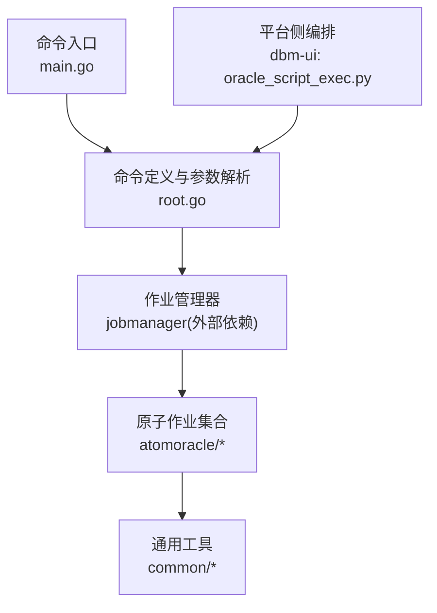
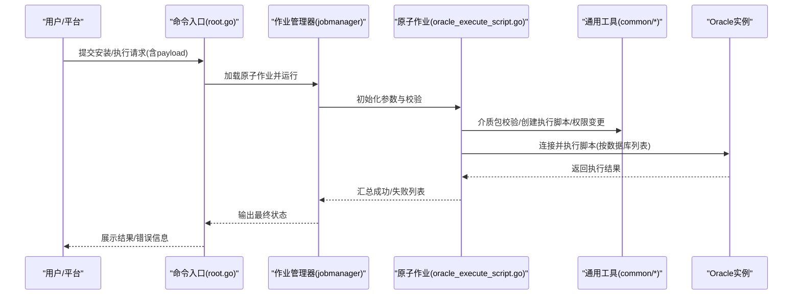
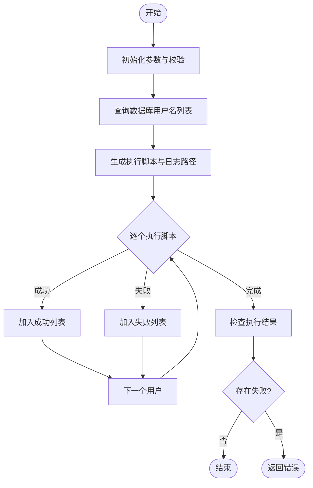
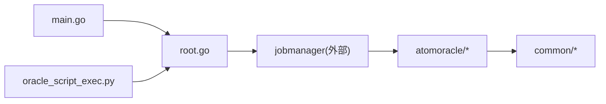

# Oracle安装配置

<cite>
**本文引用的文件**   
- [main.go](file://dbm-services/oracle/db-tools/dbactuator/main.go)
- [root.go](file://dbm-services/oracle/db-tools/dbactuator/cmd/root.go)
- [base_job.go](file://dbm-services/oracle/db-tools/dbactuator/pkg/atomjobs/atomoracle/base_job.go)
- [oracle_execute_script.go](file://dbm-services/oracle/db-tools/dbactuator/pkg/atomjobs/atomoracle/oracle_execute_script.go)
- [oracle_common.go](file://dbm-services/oracle/db-tools/dbactuator/pkg/common/oracle_common.go)
- [oracle_init_shell.go](file://dbm-services/oracle/db-tools/dbactuator/pkg/common/oracle_init_shell.go)
- [media_pkg.go](file://dbm-services/oracle/db-tools/dbactuator/pkg/common/media_pkg.go)
- [oracle.go](file://dbm-services/oracle/db-tools/dbactuator/pkg/common/oracle.go)
- [base.py](file://dbm-ui/backend/ticket/builders/oracle/base.py)
- [oracle_script_exec.py](file://dbm-ui/backend/ticket/builders/oracle/oracle_script_exec.py)
</cite>

## 目录
1. [简介](#简介)
2. [项目结构](#项目结构)
3. [核心组件](#核心组件)
4. [架构总览](#架构总览)
5. [详细组件分析](#详细组件分析)
6. [依赖关系分析](#依赖关系分析)
7. [性能考虑](#性能考虑)
8. [故障排查指南](#故障排查指南)
9. [结论](#结论)
10. [附录](#附录)

## 简介
本文件面向运维工程师与平台使用者，系统化梳理Oracle数据库在目标环境中的安装与初始化配置流程，结合代码库中已实现的原子作业与脚本执行能力，给出可操作的步骤、参数说明、配置模板与排障建议。内容涵盖：
- 系统环境准备与介质管理
- Oracle软件包下载与校验
- 安装参数配置与环境变量设置
- 实例初始化（SID、内存、字符集、网络）
- 关键步骤：root用户执行、grid用户配置、ASM磁盘组创建
- 常见问题排查与解决方案

## 项目结构
围绕Oracle安装与初始化，代码库主要由以下部分组成：
- 命令入口与参数解析：负责接收安装/执行任务参数、加载原子作业并执行
- 原子作业：封装安装、初始化、脚本执行等可复用步骤
- 通用工具：介质包校验、文件创建与权限变更、Oracle连接等
- 平台侧编排：通过工单/流程编排Oracle相关动作（如脚本执行）

图示来源
- [main.go:1-13](file://dbm-services/oracle/db-tools/dbactuator/main.go#L1-L13)
- [root.go:67-104](file://dbm-services/oracle/db-tools/dbactuator/cmd/root.go#L67-L104)

章节来源
- [main.go:1-13](file://dbm-services/oracle/db-tools/dbactuator/main.go#L1-L13)
- [root.go:142-172](file://dbm-services/oracle/db-tools/dbactuator/cmd/root.go#L142-L172)

## 核心组件
- 命令入口与参数解析：提供安装/执行任务的统一入口，支持payload传参、作业清单、调试选项等
- 原子作业：封装执行脚本、基础作业流程、步骤编排与错误处理
- 通用工具：介质包校验、文件创建与属主变更、Oracle连接辅助
- 平台侧编排：通过工单序列化器与流程构建器，驱动Oracle相关原子作业

章节来源
- [root.go:67-104](file://dbm-services/oracle/db-tools/dbactuator/cmd/root.go#L67-L104)
- [base_job.go:14-74](file://dbm-services/oracle/db-tools/dbactuator/pkg/atomjobs/atomoracle/base_job.go#L14-L74)
- [oracle_execute_script.go:32-85](file://dbm-services/oracle/db-tools/dbactuator/pkg/atomjobs/atomoracle/oracle_execute_script.go#L32-L85)
- [oracle_common.go:12-39](file://dbm-services/oracle/db-tools/dbactuator/pkg/common/oracle_common.go#L12-L39)
- [media_pkg.go:15-50](file://dbm-services/oracle/db-tools/dbactuator/pkg/common/media_pkg.go#L15-L50)

## 架构总览
Oracle安装与初始化的端到端流程如下：

图示来源
- [root.go:67-104](file://dbm-services/oracle/db-tools/dbactuator/cmd/root.go#L67-L104)
- [oracle_execute_script.go:56-121](file://dbm-services/oracle/db-tools/dbactuator/pkg/atomjobs/atomoracle/oracle_execute_script.go#L56-L121)
- [media_pkg.go:34-50](file://dbm-services/oracle/db-tools/dbactuator/pkg/common/media_pkg.go#L34-L50)
- [oracle_common.go:12-39](file://dbm-services/oracle/db-tools/dbactuator/pkg/common/oracle_common.go#L12-L39)

## 详细组件分析

### 命令入口与参数解析
- 入口程序将控制权交给命令模块，命令模块负责解析持久化标志、加载原子作业并执行
- 支持payload传参（base64或raw）、作业清单、调试打印参数等
- 通过作业管理器加载并运行原子作业

章节来源
- [main.go:8-12](file://dbm-services/oracle/db-tools/dbactuator/main.go#L8-L12)
- [root.go:67-104](file://dbm-services/oracle/db-tools/dbactuator/cmd/root.go#L67-L104)
- [root.go:142-172](file://dbm-services/oracle/db-tools/dbactuator/cmd/root.go#L142-L172)

### 原子作业：执行脚本（Oracle）
- 参数模型：包含应用标识、任务ID、IP、端口、服务名、模糊数据库名列表、管理员账号密码、执行用户密码、脚本文件列表等
- 初始化：解析payload、确定执行目录、拼接脚本格式、参数校验
- 执行流程：获取数据库用户名列表、生成执行脚本与日志路径、逐个执行并记录结果
- 错误处理：捕获执行异常、输出最后10行日志、汇总成功/失败列表

图示来源
- [oracle_execute_script.go:56-121](file://dbm-services/oracle/db-tools/dbactuator/pkg/atomjobs/atomoracle/oracle_execute_script.go#L56-L121)
- [oracle_execute_script.go:172-223](file://dbm-services/oracle/db-tools/dbactuator/pkg/atomjobs/atomoracle/oracle_execute_script.go#L172-L223)
- [oracle_execute_script.go:225-256](file://dbm-services/oracle/db-tools/dbactuator/pkg/atomjobs/atomoracle/oracle_execute_script.go#L225-L256)

章节来源
- [oracle_execute_script.go:18-54](file://dbm-services/oracle/db-tools/dbactuator/pkg/atomjobs/atomoracle/oracle_execute_script.go#L18-L54)
- [oracle_execute_script.go:87-99](file://dbm-services/oracle/db-tools/dbactuator/pkg/atomjobs/atomoracle/oracle_execute_script.go#L87-L99)
- [oracle_execute_script.go:106-121](file://dbm-services/oracle/db-tools/dbactuator/pkg/atomjobs/atomoracle/oracle_execute_script.go#L106-L121)

### 基础作业与步骤编排
- 基类提供参数、重试、回滚、步骤编排、目录切换、目录清理等通用能力
- 步骤函数以顺序方式执行，便于串联复杂流程

章节来源
- [base_job.go:14-74](file://dbm-services/oracle/db-tools/dbactuator/pkg/atomjobs/atomoracle/base_job.go#L14-L74)

### 通用工具：介质包与文件权限
- 介质包校验：检查安装包存在性与MD5一致性
- 文件创建与属主变更：创建配置/脚本文件并修改属主，确保后续执行权限
- Oracle连接辅助：基于godror驱动建立短连接并执行查询

章节来源
- [media_pkg.go:15-50](file://dbm-services/oracle/db-tools/dbactuator/pkg/common/media_pkg.go#L15-L50)
- [oracle_common.go:12-39](file://dbm-services/oracle/db-tools/dbactuator/pkg/common/oracle_common.go#L12-L39)
- [oracle.go:13-36](file://dbm-services/oracle/db-tools/dbactuator/pkg/common/oracle.go#L13-L36)

### 平台侧编排：Oracle脚本执行
- 序列化器定义脚本执行所需的集群、数据库列表、脚本文件与导入模式
- 流程构建器绑定控制器，驱动原子作业执行

章节来源
- [oracle_script_exec.py:24-50](file://dbm-ui/backend/ticket/builders/oracle/oracle_script_exec.py#L24-L50)
- [base.py:17-19](file://dbm-ui/backend/ticket/builders/oracle/base.py#L17-L19)

## 依赖关系分析
- 命令入口依赖命令模块；命令模块依赖作业管理器；作业管理器调度原子作业
- 原子作业依赖通用工具（介质包、文件权限、Oracle连接）
- 平台侧编排通过序列化器与流程构建器间接调用命令模块

图示来源
- [main.go:8-12](file://dbm-services/oracle/db-tools/dbactuator/main.go#L8-L12)
- [root.go:67-104](file://dbm-services/oracle/db-tools/dbactuator/cmd/root.go#L67-L104)
- [oracle_execute_script.go:32-54](file://dbm-services/oracle/db-tools/dbactuator/pkg/atomjobs/atomoracle/oracle_execute_script.go#L32-L54)

章节来源
- [root.go:67-104](file://dbm-services/oracle/db-tools/dbactuator/cmd/root.go#L67-L104)
- [oracle_execute_script.go:32-54](file://dbm-services/oracle/db-tools/dbactuator/pkg/atomjobs/atomoracle/oracle_execute_script.go#L32-L54)

## 性能考虑
- 连接策略：使用短连接避免连接池开销，适合一次性任务
- 执行策略：脚本串行执行，保证幂等与可观测性；如需并行，可在上层编排中拆分子任务
- 日志与超时：为执行设置合理超时，避免长时间阻塞；记录最后若干行日志便于定位

## 故障排查指南
- 介质包校验失败
  - 现象：提示安装包不存在或MD5不匹配
  - 处理：确认介质包路径与MD5，重新上传或修正校验值
  - 参考
    - [media_pkg.go:34-50](file://dbm-services/oracle/db-tools/dbactuator/pkg/common/media_pkg.go#L34-L50)
- 执行脚本失败
  - 现象：执行日志末尾显示错误
  - 处理：查看最后若干行日志，核对数据库连接参数与脚本内容
  - 参考
    - [oracle_execute_script.go:225-256](file://dbm-services/oracle/db-tools/dbactuator/pkg/atomjobs/atomoracle/oracle_execute_script.go#L225-L256)
- 文件权限问题
  - 现象：脚本无法写入或执行
  - 处理：确认创建文件的属主与权限，必要时手动调整
  - 参考
    - [oracle_common.go:12-39](file://dbm-services/oracle/db-tools/dbactuator/pkg/common/oracle_common.go#L12-L39)
- 连接失败
  - 现象：无法连通Oracle实例
  - 处理：核对IP、端口、服务名与凭据；使用短连接测试连通性
  - 参考
    - [oracle.go:13-36](file://dbm-services/oracle/db-tools/dbactuator/pkg/common/oracle.go#L13-L36)

章节来源
- [media_pkg.go:34-50](file://dbm-services/oracle/db-tools/dbactuator/pkg/common/media_pkg.go#L34-L50)
- [oracle_execute_script.go:225-256](file://dbm-services/oracle/db-tools/dbactuator/pkg/atomjobs/atomoracle/oracle_execute_script.go#L225-L256)
- [oracle_common.go:12-39](file://dbm-services/oracle/db-tools/dbactuator/pkg/common/oracle_common.go#L12-L39)
- [oracle.go:13-36](file://dbm-services/oracle/db-tools/dbactuator/pkg/common/oracle.go#L13-L36)

## 结论
本文件基于现有代码库，给出了Oracle安装与初始化的可落地实践：通过命令入口与参数解析，结合原子作业与通用工具，实现介质包校验、脚本生成与执行、权限与属主管理、以及连接与查询辅助。平台侧通过工单编排驱动上述能力，形成标准化的安装与初始化流程。实际部署时，应根据目标环境完善系统准备、网络与存储配置，并依据本文提供的参数与模板进行配置。

## 附录

### 安装流程与关键步骤
- 系统环境准备
  - 准备介质包并放置于约定路径，确保MD5一致
  - 准备执行用户与属主，确保文件创建与权限变更可用
  - 参考
    - [media_pkg.go:34-50](file://dbm-services/oracle/db-tools/dbactuator/pkg/common/media_pkg.go#L34-L50)
    - [oracle_common.go:12-39](file://dbm-services/oracle/db-tools/dbactuator/pkg/common/oracle_common.go#L12-L39)
- Oracle软件包下载与校验
  - 将软件包放置于介质目录，校验MD5
  - 参考
    - [media_pkg.go:34-50](file://dbm-services/oracle/db-tools/dbactuator/pkg/common/media_pkg.go#L34-L50)
- 安装参数配置与环境变量
  - 使用命令入口的持久化标志传参，或通过payload传递
  - 参考
    - [root.go:150-166](file://dbm-services/oracle/db-tools/dbactuator/cmd/root.go#L150-L166)
- 实例初始化（SID、内存、字符集、网络）
  - 通过执行脚本原子作业，按数据库列表逐个执行初始化脚本
  - 参考
    - [oracle_execute_script.go:106-121](file://dbm-services/oracle/db-tools/dbactuator/pkg/atomjobs/atomoracle/oracle_execute_script.go#L106-L121)
- 关键步骤：root用户执行、grid用户配置、ASM磁盘组创建
  - root用户执行：命令入口默认以root身份运行，确保具备系统级权限
  - grid用户与ASM：通过执行脚本原子作业在目标主机上创建所需目录、软链接与权限
  - 参考
    - [root.go:36-43](file://dbm-services/oracle/db-tools/dbactuator/cmd/root.go#L36-L43)
    - [oracle_init_shell.go:3-24](file://dbm-services/oracle/db-tools/dbactuator/pkg/common/oracle_init_shell.go#L3-L24)

### 安装命令示例（参数说明）
- 命令入口
  - 用途：加载原子作业并执行
  - 关键参数
    - --payload/-p：以base64或raw形式传递原子任务参数
    - --payload-file/-f：从JSON文件读取参数
    - --atom-job-list/-A：指定要执行的原子作业列表
    - --user/-u、--group/-g：指定执行进程的OS用户与属主
  - 参考
    - [root.go:150-166](file://dbm-services/oracle/db-tools/dbactuator/cmd/root.go#L150-L166)
    - [root.go:167-169](file://dbm-services/oracle/db-tools/dbactuator/cmd/root.go#L167-L169)

### 配置文件模板与参数说明
- 执行脚本参数模板（字段说明）
  - app：应用标识
  - taskid：任务ID
  - ip：数据库主机IP
  - port：数据库端口
  - servicename：服务名
  - blurdb：模糊数据库名列表（用于匹配真实用户名）
  - manageruser：管理员用户名
  - manageruserpassword：管理员密码
  - executeuserpassword：执行用户密码
  - scriptfiles：脚本文件名列表
  - 参考
    - [oracle_execute_script.go:18-30](file://dbm-services/oracle/db-tools/dbactuator/pkg/atomjobs/atomoracle/oracle_execute_script.go#L18-L30)

### 平台侧脚本执行编排
- 序列化器定义
  - cluster_info：集群执行列表（包含集群ID与执行数据库列表）
  - script_files：脚本文件列表
  - import_mode：SQL导入模式
  - 参考
    - [oracle_script_exec.py:24-39](file://dbm-ui/backend/ticket/builders/oracle/oracle_script_exec.py#L24-L39)
- 流程构建器
  - 绑定控制器，驱动原子作业执行
  - 参考
    - [oracle_script_exec.py:42-50](file://dbm-ui/backend/ticket/builders/oracle/oracle_script_exec.py#L42-L50)