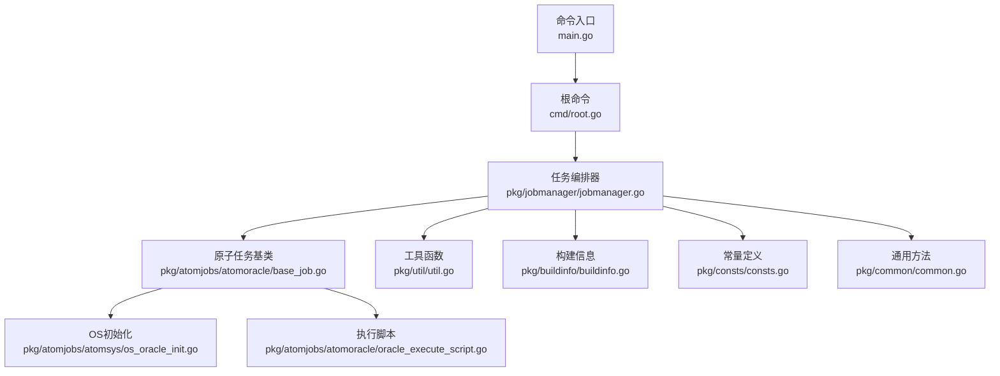
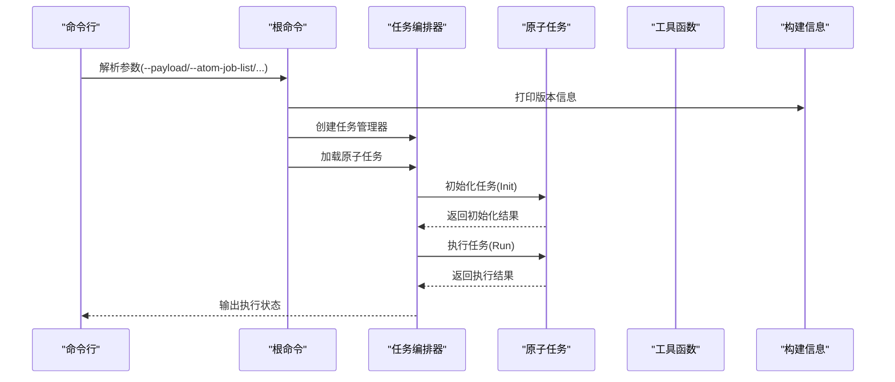
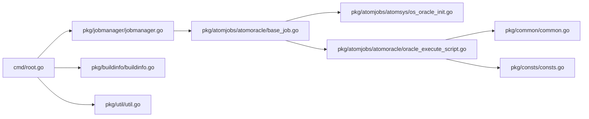

# Oracle数据库工具

<cite>
**本文引用的文件**
- [main.go](file://dbm-services/oracle/db-tools/dbactuator/main.go)
- [root.go](file://dbm-services/oracle/db-tools/dbactuator/cmd/root.go)
- [README.md](file://dbm-services/oracle/db-tools/dbactuator/README.md)
- [go.mod](file://dbm-services/oracle/db-tools/dbactuator/go.mod)
- [base_job.go](file://dbm-services/oracle/db-tools/dbactuator/pkg/atomjobs/atomoracle/base_job.go)
- [oracle_execute_script.go](file://dbm-services/oracle/db-tools/dbactuator/pkg/atomjobs/atomoracle/oracle_execute_script.go)
- [os_oracle_init.go](file://dbm-services/oracle/db-tools/dbactuator/pkg/atomjobs/atomsys/os_oracle_init.go)
- [jobmanager.go](file://dbm-services/oracle/db-tools/dbactuator/pkg/jobmanager/jobmanager.go)
- [util.go](file://dbm-services/oracle/db-tools/dbactuator/pkg/util/util.go)
- [buildinfo.go](file://dbm-services/oracle/db-tools/dbactuator/pkg/buildinfo/buildinfo.go)
- [common.go](file://dbm-services/oracle/db-tools/dbactuator/pkg/common/common.go)
- [consts.go](file://dbm-services/oracle/db-tools/dbactuator/pkg/consts/consts.go)
- [mylog.go](file://dbm-services/oracle/db-tools/dbactuator/mylog/mylog.go)
- [oracle_script_exec.py](file://dbm-ui/backend/ticket/builders/oracle/oracle_script_exec.py)
- [base.py](file://dbm-ui/backend/ticket/builders/oracle/base.py)
</cite>

## 目录
1. [简介](#简介)
2. [项目结构](#项目结构)
3. [核心组件](#核心组件)
4. [架构总览](#架构总览)
5. [详细组件分析](#详细组件分析)
6. [依赖分析](#依赖分析)
7. [性能考虑](#性能考虑)
8. [故障排除指南](#故障排除指南)
9. [结论](#结论)
10. [附录](#附录)

## 简介
本文件面向企业级运维与DBA团队，系统化梳理 Oracle 数据库工具（dbactuator）的功能边界与使用方法，覆盖 Oracle 实例安装前置准备、数据库脚本执行、表空间与用户权限管理的协同流程、备份恢复的编排入口、以及与平台侧工单系统的对接方式。文档同时解释工具的常量定义、通用工具函数、错误处理机制，并给出部署、维护与故障排除的最佳实践。

## 项目结构
Oracle dbactuator 采用命令行入口 + 任务编排器 + 原子任务模块的分层设计：
- 命令行入口负责参数解析、版本打印、任务加载与执行调度
- 任务编排器负责根据传入的原子任务清单加载并串并行执行
- 原子任务模块封装具体操作（如 OS 初始化、Oracle 脚本执行）
- 通用包提供常量、工具函数、日志、构建信息等支撑能力

图表来源
- [main.go:1-13](file://dbm-services/oracle/db-tools/dbactuator/main.go#L1-L13)
- [root.go:67-105](file://dbm-services/oracle/db-tools/dbactuator/cmd/root.go#L67-L105)
- [jobmanager.go](file://dbm-services/oracle/db-tools/dbactuator/pkg/jobmanager/jobmanager.go)
- [base_job.go](file://dbm-services/oracle/db-tools/dbactuator/pkg/atomjobs/atomoracle/base_job.go)
- [os_oracle_init.go](file://dbm-services/oracle/db-tools/dbactuator/pkg/atomjobs/atomsys/os_oracle_init.go)
- [oracle_execute_script.go](file://dbm-services/oracle/db-tools/dbactuator/pkg/atomjobs/atomoracle/oracle_execute_script.go)
- [util.go](file://dbm-services/oracle/db-tools/dbactuator/pkg/util/util.go)
- [buildinfo.go](file://dbm-services/oracle/db-tools/dbactuator/pkg/buildinfo/buildinfo.go)
- [consts.go](file://dbm-services/oracle/db-tools/dbactuator/pkg/consts/consts.go)
- [common.go](file://dbm-services/oracle/db-tools/dbactuator/pkg/common/common.go)

章节来源
- [main.go:1-13](file://dbm-services/oracle/db-tools/dbactuator/main.go#L1-L13)
- [root.go:67-105](file://dbm-services/oracle/db-tools/dbactuator/cmd/root.go#L67-L105)
- [README.md:1-84](file://dbm-services/oracle/db-tools/dbactuator/README.md#L1-L84)

## 核心组件
- 命令行入口与根命令
  - 入口程序仅负责调用根命令执行器
  - 根命令负责解析持久化参数、加载任务、执行任务并输出版本信息
- 任务编排器
  - 负责根据传入的原子任务清单动态加载并执行
  - 提供调试能力：列出任务名、打印参数、查看进程
- 原子任务
  - 基类定义统一的 JobRunner 接口（Init/Run/Rollback/Retry/Name），确保任务可重入与可回滚
  - OS 初始化与 Oracle 脚本执行作为典型原子任务示例
- 通用支撑
  - 常量定义、工具函数、日志、构建信息等

章节来源
- [root.go:67-105](file://dbm-services/oracle/db-tools/dbactuator/cmd/root.go#L67-L105)
- [base_job.go](file://dbm-services/oracle/db-tools/dbactuator/pkg/atomjobs/atomoracle/base_job.go)
- [os_oracle_init.go](file://dbm-services/oracle/db-tools/dbactuator/pkg/atomjobs/atomsys/os_oracle_init.go)
- [oracle_execute_script.go](file://dbm-services/oracle/db-tools/dbactuator/pkg/atomjobs/atomoracle/oracle_execute_script.go)
- [jobmanager.go](file://dbm-services/oracle/db-tools/dbactuator/pkg/jobmanager/jobmanager.go)
- [util.go](file://dbm-services/oracle/db-tools/dbactuator/pkg/util/util.go)
- [buildinfo.go](file://dbm-services/oracle/db-tools/dbactuator/pkg/buildinfo/buildinfo.go)
- [consts.go](file://dbm-services/oracle/db-tools/dbactuator/pkg/consts/consts.go)
- [common.go](file://dbm-services/oracle/db-tools/dbactuator/pkg/common/common.go)

## 架构总览
下图展示 Oracle dbactuator 的端到端执行链路：命令行参数解析 → 任务加载 → 原子任务执行 → 结果输出。

图表来源
- [root.go:73-104](file://dbm-services/oracle/db-tools/dbactuator/cmd/root.go#L73-L104)
- [jobmanager.go](file://dbm-services/oracle/db-tools/dbactuator/pkg/jobmanager/jobmanager.go)
- [base_job.go](file://dbm-services/oracle/db-tools/dbactuator/pkg/atomjobs/atomoracle/base_job.go)

## 详细组件分析

### 命令行与参数解析
- 支持的关键参数
  - 单据ID、流程ID、节点ID、版本ID：用于追踪与审计
  - 数据目录与备份目录：可通过环境变量覆盖
  - 原子任务参数载体：支持 base64 或原始格式
  - 原子任务清单：多个任务名以逗号分隔
  - 用户与组：指定进程运行的系统用户与属组
  - 调试模式：列出任务名、打印参数、查看进程
- 错误处理
  - 出错时打印错误并退出非零状态码
  - 版本信息在错误时也会输出，便于定位版本

章节来源
- [root.go:150-169](file://dbm-services/oracle/db-tools/dbactuator/cmd/root.go#L150-L169)
- [root.go:37-41](file://dbm-services/oracle/db-tools/dbactuator/cmd/root.go#L37-L41)
- [root.go:174-189](file://dbm-services/oracle/db-tools/dbactuator/cmd/root.go#L174-L189)

### 任务编排器
- 功能要点
  - 根据传入的原子任务清单动态注册与加载
  - 支持打印参数、列出任务名、查看进程等调试能力
  - 统一的版本打印与错误传播
- 使用建议
  - 将每个原子任务设计为可重入，降低回滚复杂度
  - 通过参数格式选择 base64 或 raw，满足不同场景

章节来源
- [root.go:90-104](file://dbm-services/oracle/db-tools/dbactuator/cmd/root.go#L90-L104)
- [root.go:111-139](file://dbm-services/oracle/db-tools/dbactuator/cmd/root.go#L111-L139)
- [README.md:71-78](file://dbm-services/oracle/db-tools/dbactuator/README.md#L71-L78)

### 原子任务基类与接口
- 接口职责
  - Init：任务执行前的参数读取与前置校验
  - Run：核心执行逻辑
  - Rollback：失败后的回滚逻辑
  - Retry：重试次数
  - Name：任务名称
- 设计原则
  - 强烈建议实现为可重入，避免复杂的回滚逻辑
  - 回滚应尽量幂等且低风险

章节来源
- [base_job.go](file://dbm-services/oracle/db-tools/dbactuator/pkg/atomjobs/atomoracle/base_job.go)
- [README.md:39-78](file://dbm-services/oracle/db-tools/dbactuator/README.md#L39-L78)

### OS 初始化（os_oracle_init）
- 作用
  - 为 Oracle 实例安装与运行准备操作系统环境（如用户、组、目录、权限等）
- 集成方式
  - 作为原子任务被任务编排器加载与执行
  - 依赖通用常量与工具函数

章节来源
- [os_oracle_init.go](file://dbm-services/oracle/db-tools/dbactuator/pkg/atomjobs/atomsys/os_oracle_init.go)
- [consts.go](file://dbm-services/oracle/db-tools/dbactuator/pkg/consts/consts.go)
- [util.go](file://dbm-services/oracle/db-tools/dbactuator/pkg/util/util.go)

### 执行脚本（oracle_execute_script）
- 作用
  - 在 Oracle 环境中执行指定脚本或 SQL
- 关键流程
  - 读取配置参数与连接信息
  - 通过通用方法连接 Oracle 并执行
- 适用场景
  - 表空间与用户权限管理的协同执行
  - 备份恢复后的验证脚本

章节来源
- [oracle_execute_script.go:31-140](file://dbm-services/oracle/db-tools/dbactuator/pkg/atomjobs/atomoracle/oracle_execute_script.go#L31-L140)
- [common.go](file://dbm-services/oracle/db-tools/dbactuator/pkg/common/common.go)

### 日志与构建信息
- 日志
  - 提供统一的日志封装，便于问题定位
- 构建信息
  - 输出版本信息，辅助排障与审计

章节来源
- [mylog.go](file://dbm-services/oracle/db-tools/dbactuator/mylog/mylog.go)
- [buildinfo.go](file://dbm-services/oracle/db-tools/dbactuator/pkg/buildinfo/buildinfo.go)

## 依赖分析
- 外部依赖
  - Cobra：命令行框架
  - godror：Oracle 连接驱动
  - 其他通用工具库：校验、系统工具等
- 内部依赖
  - 原子任务依赖任务编排器与通用工具
  - 任务编排器依赖常量、工具、构建信息

图表来源
- [root.go:8-16](file://dbm-services/oracle/db-tools/dbactuator/cmd/root.go#L8-L16)
- [go.mod:7-14](file://dbm-services/oracle/db-tools/dbactuator/go.mod#L7-L14)
- [jobmanager.go](file://dbm-services/oracle/db-tools/dbactuator/pkg/jobmanager/jobmanager.go)
- [base_job.go](file://dbm-services/oracle/db-tools/dbactuator/pkg/atomjobs/atomoracle/base_job.go)
- [os_oracle_init.go](file://dbm-services/oracle/db-tools/dbactuator/pkg/atomjobs/atomsys/os_oracle_init.go)
- [oracle_execute_script.go](file://dbm-services/oracle/db-tools/dbactuator/pkg/atomjobs/atomoracle/oracle_execute_script.go)
- [common.go](file://dbm-services/oracle/db-tools/dbactuator/pkg/common/common.go)
- [consts.go](file://dbm-services/oracle/db-tools/dbactuator/pkg/consts/consts.go)

章节来源
- [go.mod:7-14](file://dbm-services/oracle/db-tools/dbactuator/go.mod#L7-L14)

## 性能考虑
- 可重入设计优先：减少回滚复杂度，提升重复执行的安全性与效率
- 任务粒度划分：将长耗时操作拆分为多个原子任务，便于并行与重试
- 参数格式选择：base64 适合二进制或复杂 JSON，raw 适合简单明文参数
- 资源隔离：通过用户与组参数限制进程权限范围，降低资源争用风险

## 故障排除指南
- 常见问题与排查步骤
  - 参数解析失败：检查 --payload 与 --payload-format 是否匹配；确认 base64 编码正确
  - 任务加载失败：确认 --atom-job-list 中的任务名与注册映射一致
  - 任务执行失败：查看任务的 Rollback 与日志输出；必要时重试
  - 进程与权限问题：核对 --user 与 --group；确认系统用户与属组存在且具备相应权限
- 调试手段
  - 使用调试命令列出任务名、打印参数、查看进程，快速定位问题

章节来源
- [root.go:111-139](file://dbm-services/oracle/db-tools/dbactuator/cmd/root.go#L111-L139)
- [root.go:174-189](file://dbm-services/oracle/db-tools/dbactuator/cmd/root.go#L174-L189)

## 结论
Oracle dbactuator 通过清晰的命令行入口、可扩展的任务编排器与标准化的原子任务接口，为企业级 Oracle 数据库的安装前置、脚本执行、权限与表空间管理协同、备份恢复验证提供了稳定可靠的自动化能力。结合平台侧工单系统，可实现从申请到执行的全链路闭环管理。

## 附录

### 命令使用示例与参数说明
- 示例命令
  - 执行脚本任务：传入 base64 编码的参数与任务清单
- 关键参数说明
  - --uid：单据 ID
  - --root_id：流程 ID
  - --node_id：节点 ID
  - --version_id：运行版本 ID
  - --payload：原子任务参数（base64 或 raw）
  - --payload-format：参数格式（base64 或 raw）
  - --payload_file：参数文件（JSON/YAML）
  - --atom-job-list：多个任务名以逗号分隔
  - --data_dir：数据保存路径（可由环境变量覆盖）
  - --backup_dir：备份保存路径（可由环境变量覆盖）
  - --user：进程运行的系统用户
  - --group：进程运行的系统用户属组

章节来源
- [README.md:28-30](file://dbm-services/oracle/db-tools/dbactuator/README.md#L28-L30)
- [root.go:150-169](file://dbm-services/oracle/db-tools/dbactuator/cmd/root.go#L150-L169)

### 与平台侧工单系统的集成
- 工单类型与控制器
  - Oracle 变更脚本执行工单类型，对应控制器为多集群脚本执行
- 序列化器与流程
  - 包含集群信息、脚本文件列表、导入模式等字段
  - 流程名称与控制器绑定，确保执行链路贯通

章节来源
- [oracle_script_exec.py:24-50](file://dbm-ui/backend/ticket/builders/oracle/oracle_script_exec.py#L24-L50)
- [base.py:17-19](file://dbm-ui/backend/ticket/builders/oracle/base.py#L17-L19)