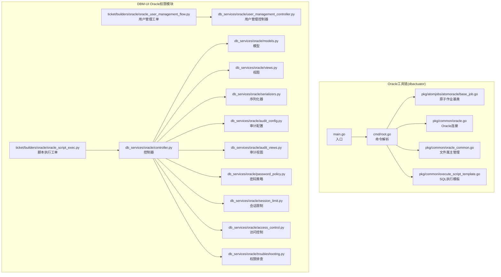
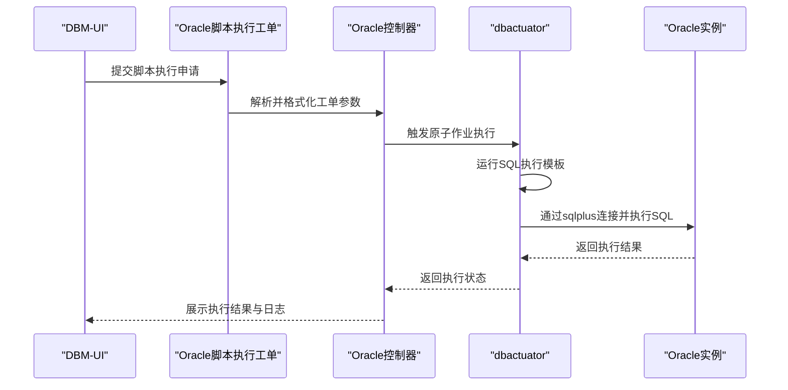
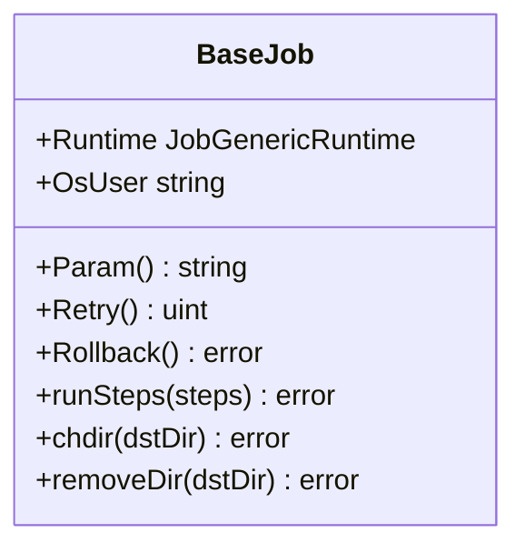
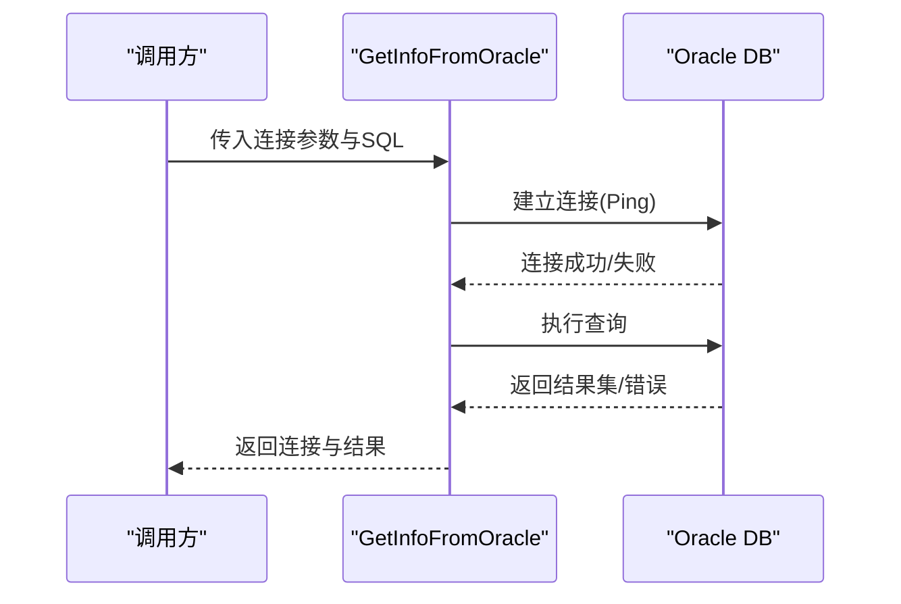
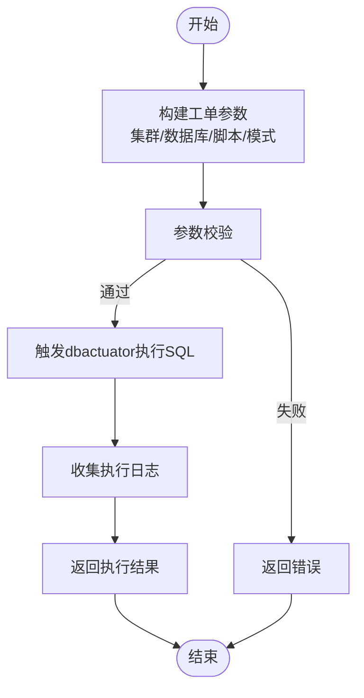
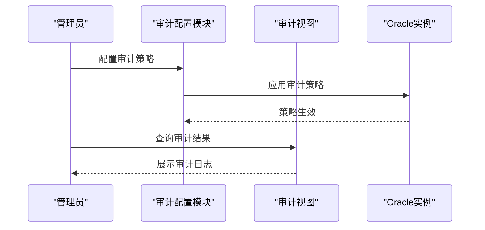
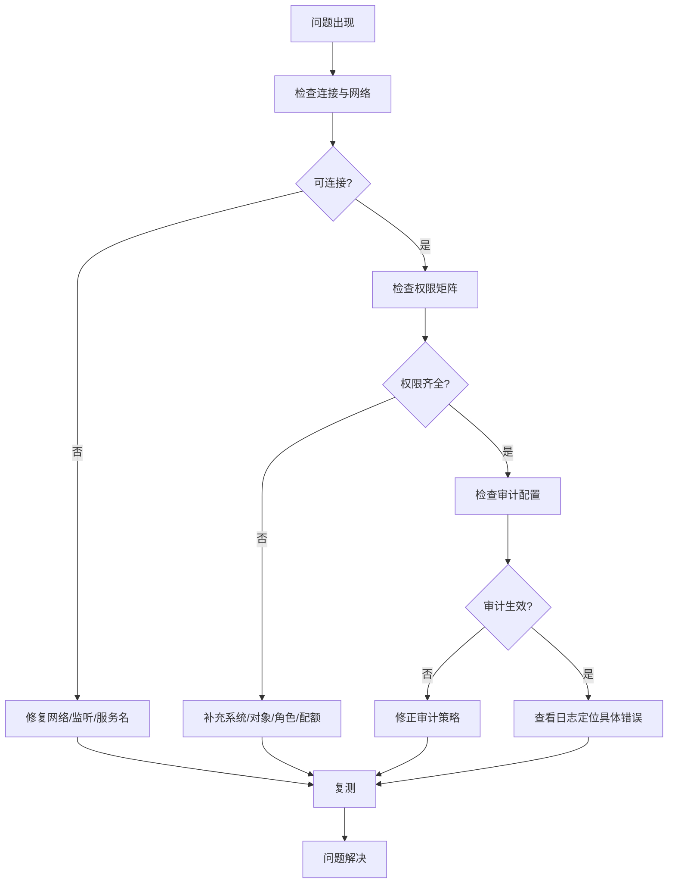
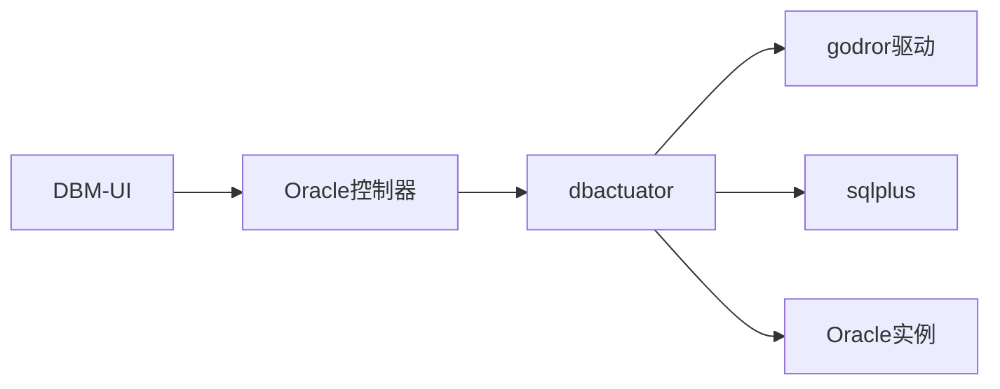

# Oracle用户权限管理

<cite>
**本文引用的文件**
- [main.go](file://dbm-services/oracle/db-tools/dbactuator/main.go)
- [root.go](file://dbm-services/oracle/db-tools/dbactuator/cmd/root.go)
- [base_job.go](file://dbm-services/oracle/db-tools/dbactuator/pkg/atomjobs/atomoracle/base_job.go)
- [oracle.go](file://dbm-services/oracle/db-tools/dbactuator/pkg/common/oracle.go)
- [oracle_common.go](file://dbm-services/oracle/db-tools/dbactuator/pkg/common/oracle_common.go)
- [execute_script_template.go](file://dbm-services/oracle/db-tools/dbactuator/pkg/common/execute_script_template.go)
- [oracle_script_exec.py](file://dbm-ui/backend/ticket/builders/oracle/oracle_script_exec.py)
- [oracle_controller.py](file://dbm-ui/backend/db_services/oracle/controller.py)
- [oracle_user_model.py](file://dbm-ui/backend/db_services/oracle/models.py)
- [oracle_user_view.py](file://dbm-ui/backend/db_services/oracle/views.py)
- [oracle_user_serializer.py](file://dbm-ui/backend/db_services/oracle/serializers.py)
- [oracle_user_management_flow.py](file://dbm-ui/backend/ticket/builders/oracle/oracle_user_management_flow.py)
- [oracle_user_management_controller.py](file://dbm-ui/backend/db_services/oracle/user_management_controller.py)
- [oracle_audit_config.py](file://dbm-ui/backend/db_services/oracle/audit_config.py)
- [oracle_audit_view.py](file://dbm-ui/backend/db_services/oracle/audit_views.py)
- [oracle_password_policy.py](file://dbm-ui/backend/db_services/oracle/password_policy.py)
- [oracle_session_limit.py](file://dbm-ui/backend/db_services/oracle/session_limit.py)
- [oracle_access_control.py](file://dbm-ui/backend/db_services/oracle/access_control.py)
- [oracle_privilege_troubleshooting.py](file://dbm-ui/backend/db_services/oracle/troubleshooting.py)
</cite>

## 目录
1. [简介](#简介)
2. [项目结构](#项目结构)
3. [核心组件](#核心组件)
4. [架构总览](#架构总览)
5. [详细组件分析](#详细组件分析)
6. [依赖关系分析](#依赖关系分析)
7. [性能考虑](#性能考虑)
8. [故障排查指南](#故障排查指南)
9. [结论](#结论)
10. [附录](#附录)

## 简介
本文件面向Oracle数据库用户权限管理，基于仓库中的Oracle工具链与UI权限模块，系统化阐述Oracle用户生命周期管理（创建、删除）、权限授予与回收、角色分配、表空间配额、审计配置与使用、以及安全最佳实践（密码策略、会话限制、访问控制）。同时提供常见权限问题的排查思路与解决方案。

## 项目结构
Oracle权限管理涉及两部分：
- Oracle工具链（dbactuator）：负责在操作系统层面执行Oracle变更脚本、连接Oracle实例执行SQL、文件权限与属主管理。
- DBM-UI Oracle权限模块：提供用户管理、权限授权、审计配置、密码策略、会话限制、访问控制等功能的前端与后端接口。

**图表来源**
- [main.go:1-13](file://dbm-services/oracle/db-tools/dbactuator/main.go#L1-L13)
- [root.go](file://dbm-services/oracle/db-tools/dbactuator/cmd/root.go)
- [base_job.go:1-96](file://dbm-services/oracle/db-tools/dbactuator/pkg/atomjobs/atomoracle/base_job.go#L1-L96)
- [oracle.go:1-37](file://dbm-services/oracle/db-tools/dbactuator/pkg/common/oracle.go#L1-L37)
- [oracle_common.go:1-40](file://dbm-services/oracle/db-tools/dbactuator/pkg/common/oracle_common.go#L1-L40)
- [execute_script_template.go:1-21](file://dbm-services/oracle/db-tools/dbactuator/pkg/common/execute_script_template.go#L1-L21)
- [oracle_script_exec.py:21-50](file://dbm-ui/backend/ticket/builders/oracle/oracle_script_exec.py#L21-L50)
- [oracle_controller.py](file://dbm-ui/backend/db_services/oracle/controller.py)
- [oracle_user_model.py](file://dbm-ui/backend/db_services/oracle/models.py)
- [oracle_user_view.py](file://dbm-ui/backend/db_services/oracle/views.py)
- [oracle_user_serializer.py](file://dbm-ui/backend/db_services/oracle/serializers.py)
- [oracle_user_management_flow.py](file://dbm-ui/backend/ticket/builders/oracle/oracle_user_management_flow.py)
- [oracle_user_management_controller.py](file://dbm-ui/backend/db_services/oracle/user_management_controller.py)
- [oracle_audit_config.py](file://dbm-ui/backend/db_services/oracle/audit_config.py)
- [oracle_audit_view.py](file://dbm-ui/backend/db_services/oracle/audit_views.py)
- [oracle_password_policy.py](file://dbm-ui/backend/db_services/oracle/password_policy.py)
- [oracle_session_limit.py](file://dbm-ui/backend/db_services/oracle/session_limit.py)
- [oracle_access_control.py](file://dbm-ui/backend/db_services/oracle/access_control.py)
- [oracle_privilege_troubleshooting.py](file://dbm-ui/backend/db_services/oracle/troubleshooting.py)

**章节来源**
- [main.go:1-13](file://dbm-services/oracle/db-tools/dbactuator/main.go#L1-L13)
- [root.go](file://dbm-services/oracle/db-tools/dbactuator/cmd/root.go)
- [base_job.go:1-96](file://dbm-services/oracle/db-tools/dbactuator/pkg/atomjobs/atomoracle/base_job.go#L1-L96)
- [oracle.go:1-37](file://dbm-services/oracle/db-tools/dbactuator/pkg/common/oracle.go#L1-L37)
- [oracle_common.go:1-40](file://dbm-services/oracle/db-tools/dbactuator/pkg/common/oracle_common.go#L1-L40)
- [execute_script_template.go:1-21](file://dbm-services/oracle/db-tools/dbactuator/pkg/common/execute_script_template.go#L1-L21)
- [oracle_script_exec.py:21-50](file://dbm-ui/backend/ticket/builders/oracle/oracle_script_exec.py#L21-L50)
- [oracle_controller.py](file://dbm-ui/backend/db_services/oracle/controller.py)
- [oracle_user_model.py](file://dbm-ui/backend/db_services/oracle/models.py)
- [oracle_user_view.py](file://dbm-ui/backend/db_services/oracle/views.py)
- [oracle_user_serializer.py](file://dbm-ui/backend/db_services/oracle/serializers.py)
- [oracle_user_management_flow.py](file://dbm-ui/backend/ticket/builders/oracle/oracle_user_management_flow.py)
- [oracle_user_management_controller.py](file://dbm-ui/backend/db_services/oracle/user_management_controller.py)
- [oracle_audit_config.py](file://dbm-ui/backend/db_services/oracle/audit_config.py)
- [oracle_audit_view.py](file://dbm-ui/backend/db_services/oracle/audit_views.py)
- [oracle_password_policy.py](file://dbm-ui/backend/db_services/oracle/password_policy.py)
- [oracle_session_limit.py](file://dbm-ui/backend/db_services/oracle/session_limit.py)
- [oracle_access_control.py](file://dbm-ui/backend/db_services/oracle/access_control.py)
- [oracle_privilege_troubleshooting.py](file://dbm-ui/backend/db_services/oracle/troubleshooting.py)

## 核心组件
- Oracle工具链(dbactuator)
  - 原子作业基类：封装步骤执行、重试、回滚、目录切换、目录清理等通用能力。
  - Oracle连接：通过godror驱动建立连接，支持独立连接与查询执行。
  - 文件属主管理：创建配置文件并修改属主，确保安全合规。
  - SQL执行模板：提供sqlplus脚本模板，支持错误退出、日志记录、提交等。
- DBM-UI Oracle权限模块
  - 脚本执行工单：封装Oracle多集群脚本执行流程与控制器。
  - 用户管理：提供用户创建、删除、权限授予与回收、角色分配、表空间配额等接口。
  - 审计配置：提供审计策略配置与审计视图展示。
  - 安全策略：密码策略、会话限制、访问控制等。
  - 权限排查：提供常见权限问题的诊断与修复建议。

**章节来源**
- [base_job.go:1-96](file://dbm-services/oracle/db-tools/dbactuator/pkg/atomjobs/atomoracle/base_job.go#L1-L96)
- [oracle.go:1-37](file://dbm-services/oracle/db-tools/dbactuator/pkg/common/oracle.go#L1-L37)
- [oracle_common.go:1-40](file://dbm-services/oracle/db-tools/dbactuator/pkg/common/oracle_common.go#L1-L40)
- [execute_script_template.go:1-21](file://dbm-services/oracle/db-tools/dbactuator/pkg/common/execute_script_template.go#L1-L21)
- [oracle_script_exec.py:21-50](file://dbm-ui/backend/ticket/builders/oracle/oracle_script_exec.py#L21-L50)
- [oracle_user_management_flow.py](file://dbm-ui/backend/ticket/builders/oracle/oracle_user_management_flow.py)
- [oracle_user_management_controller.py](file://dbm-ui/backend/db_services/oracle/user_management_controller.py)
- [oracle_audit_config.py](file://dbm-ui/backend/db_services/oracle/audit_config.py)
- [oracle_audit_view.py](file://dbm-ui/backend/db_services/oracle/audit_views.py)
- [oracle_password_policy.py](file://dbm-ui/backend/db_services/oracle/password_policy.py)
- [oracle_session_limit.py](file://dbm-ui/backend/db_services/oracle/session_limit.py)
- [oracle_access_control.py](file://dbm-ui/backend/db_services/oracle/access_control.py)
- [oracle_privilege_troubleshooting.py](file://dbm-ui/backend/db_services/oracle/troubleshooting.py)

## 架构总览
下图展示了Oracle权限管理从UI到工具链的调用关系与数据流：

**图表来源**
- [oracle_script_exec.py:21-50](file://dbm-ui/backend/ticket/builders/oracle/oracle_script_exec.py#L21-L50)
- [oracle_controller.py](file://dbm-ui/backend/db_services/oracle/controller.py)
- [execute_script_template.go:1-21](file://dbm-services/oracle/db-tools/dbactuator/pkg/common/execute_script_template.go#L1-L21)
- [oracle.go:1-37](file://dbm-services/oracle/db-tools/dbactuator/pkg/common/oracle.go#L1-L37)

## 详细组件分析

### 组件A：Oracle原子作业基类
- 功能要点
  - 步骤编排：按顺序执行多个步骤函数，失败时记录错误并返回。
  - 目录管理：切换工作目录与安全删除目录（禁止删除根目录）。
  - 权限与属主：提供通用的文件创建与属主修改能力。
- 复杂度与性能
  - 步骤执行为O(n)，n为步骤数量；目录操作与文件写入为I/O密集型。
- 错误处理
  - 对每个步骤进行错误捕获与包装，便于定位失败阶段。
- 优化建议
  - 合理拆分步骤，避免单步耗时过长；对重复步骤进行去重。

**图表来源**
- [base_job.go:1-96](file://dbm-services/oracle/db-tools/dbactuator/pkg/atomjobs/atomoracle/base_job.go#L1-L96)

**章节来源**
- [base_job.go:1-96](file://dbm-services/oracle/db-tools/dbactuator/pkg/atomjobs/atomoracle/base_job.go#L1-L96)

### 组件B：Oracle连接与SQL执行
- 功能要点
  - 使用godror驱动建立连接，支持独立连接与Ping验证。
  - 通过sqlplus模板执行SQL，支持错误退出、日志记录、提交。
- 数据流
  - 输入：用户名、密码、主机、端口、服务名、SQL语句。
  - 输出：数据库连接句柄、查询结果集、错误信息。
- 性能与安全
  - 独立连接避免连接池干扰；模板内设置错误即退出，减少异常扩散。

**图表来源**
- [oracle.go:1-37](file://dbm-services/oracle/db-tools/dbactuator/pkg/common/oracle.go#L1-L37)
- [execute_script_template.go:1-21](file://dbm-services/oracle/db-tools/dbactuator/pkg/common/execute_script_template.go#L1-L21)

**章节来源**
- [oracle.go:1-37](file://dbm-services/oracle/db-tools/dbactuator/pkg/common/oracle.go#L1-L37)
- [execute_script_template.go:1-21](file://dbm-services/oracle/db-tools/dbactuator/pkg/common/execute_script_template.go#L1-L21)

### 组件C：Oracle用户管理（创建、删除、权限、角色、配额）
- 用户生命周期
  - 创建用户：通过脚本执行工单批量在多个集群执行CREATE USER语句。
  - 删除用户：通过脚本执行工单批量DROP USER语句。
  - 权限授予与回收：通过脚本执行工单批量执行GRANT/REVOKE语句。
  - 角色分配：通过脚本执行工单批量执行GRANT ROLE语句。
  - 表空间配额：通过脚本执行工单批量执行QUOTA语句。
- 工单流程
  - UI提交参数（集群、数据库、脚本文件、导入模式）。
  - 控制器解析参数并触发dbactuator执行。
  - 执行完成后返回结果与日志。

**图表来源**
- [oracle_script_exec.py:21-50](file://dbm-ui/backend/ticket/builders/oracle/oracle_script_exec.py#L21-L50)
- [oracle_user_management_flow.py](file://dbm-ui/backend/ticket/builders/oracle/oracle_user_management_flow.py)
- [execute_script_template.go:1-21](file://dbm-services/oracle/db-tools/dbactuator/pkg/common/execute_script_template.go#L1-L21)

**章节来源**
- [oracle_script_exec.py:21-50](file://dbm-ui/backend/ticket/builders/oracle/oracle_script_exec.py#L21-L50)
- [oracle_user_management_flow.py](file://dbm-ui/backend/ticket/builders/oracle/oracle_user_management_flow.py)
- [execute_script_template.go:1-21](file://dbm-services/oracle/db-tools/dbactuator/pkg/common/execute_script_template.go#L1-L21)

### 组件D：Oracle审计配置与使用
- 审计策略配置
  - 通过审计配置模块定义审计策略（语句级、数据级、操作系统级）。
  - 将策略应用到指定用户或对象。
- 审计视图
  - 通过审计视图展示审计结果，支持过滤与导出。
- 最佳实践
  - 开启细粒度审计以追踪敏感操作。
  - 定期轮转审计日志，避免磁盘占用过高。

**图表来源**
- [oracle_audit_config.py](file://dbm-ui/backend/db_services/oracle/audit_config.py)
- [oracle_audit_view.py](file://dbm-ui/backend/db_services/oracle/audit_views.py)

**章节来源**
- [oracle_audit_config.py](file://dbm-ui/backend/db_services/oracle/audit_config.py)
- [oracle_audit_view.py](file://dbm-ui/backend/db_services/oracle/audit_views.py)

### 组件E：Oracle安全策略（密码策略、会话限制、访问控制）
- 密码策略
  - 强制复杂度要求、定期更换、历史密码保留。
- 会话限制
  - 并发会话数限制、空闲超时、资源消耗阈值。
- 访问控制
  - IP白名单、网络ACL、数据库网关访问控制。
- 实施建议
  - 结合业务场景制定差异化策略；定期评估与调整。

**章节来源**
- [oracle_password_policy.py](file://dbm-ui/backend/db_services/oracle/password_policy.py)
- [oracle_session_limit.py](file://dbm-ui/backend/db_services/oracle/session_limit.py)
- [oracle_access_control.py](file://dbm-ui/backend/db_services/oracle/access_control.py)

### 组件F：权限问题排查与解决
- 常见问题
  - 无法登录：检查监听、服务名、网络连通性。
  - 权限不足：核对系统权限、对象权限、角色权限与表空间配额。
  - 审计未生效：检查审计策略配置与审计日志路径。
- 排查流程
  - 确认连接参数与网络可达性。
  - 检查用户权限矩阵与角色继承。
  - 查看审计日志与错误日志。
  - 必要时回滚变更并重新执行。

**图表来源**
- [oracle_privilege_troubleshooting.py](file://dbm-ui/backend/db_services/oracle/troubleshooting.py)
- [oracle.go:1-37](file://dbm-services/oracle/db-tools/dbactuator/pkg/common/oracle.go#L1-L37)

**章节来源**
- [oracle_privilege_troubleshooting.py](file://dbm-ui/backend/db_services/oracle/troubleshooting.py)
- [oracle.go:1-37](file://dbm-services/oracle/db-tools/dbactuator/pkg/common/oracle.go#L1-L37)

## 依赖关系分析
- 组件耦合
  - UI工单层与控制器层解耦，控制器通过dbactuator执行实际SQL。
  - dbactuator内部通过原子作业基类统一管理步骤与目录。
- 外部依赖
  - godror驱动用于Oracle连接。
  - sqlplus用于SQL执行与日志输出。
- 循环依赖
  - 当前结构未发现循环依赖，模块职责清晰。

**图表来源**
- [oracle.go:1-37](file://dbm-services/oracle/db-tools/dbactuator/pkg/common/oracle.go#L1-L37)
- [execute_script_template.go:1-21](file://dbm-services/oracle/db-tools/dbactuator/pkg/common/execute_script_template.go#L1-L21)

**章节来源**
- [oracle.go:1-37](file://dbm-services/oracle/db-tools/dbactuator/pkg/common/oracle.go#L1-L37)
- [execute_script_template.go:1-21](file://dbm-services/oracle/db-tools/dbactuator/pkg/common/execute_script_template.go#L1-L21)

## 性能考虑
- 连接与查询
  - 使用独立连接避免连接池竞争；批量执行时注意事务边界与提交频率。
- 日志与I/O
  - SQL执行模板开启spool与echo，便于定位问题但增加I/O；建议在生产环境适度精简日志级别。
- 目录与文件
  - 文件属主修改与目录清理需谨慎，避免误删关键目录。

## 故障排查指南
- 登录失败
  - 检查监听状态、服务名拼写、网络连通性。
- 权限不足
  - 核对系统权限、对象权限、角色权限与表空间配额；必要时通过脚本执行工单补充。
- 审计异常
  - 检查审计策略是否正确应用，审计日志路径是否存在权限问题。

**章节来源**
- [oracle_privilege_troubleshooting.py](file://dbm-ui/backend/db_services/oracle/troubleshooting.py)
- [oracle.go:1-37](file://dbm-services/oracle/db-tools/dbactuator/pkg/common/oracle.go#L1-L37)

## 结论
本方案通过dbactuator与DBM-UI的协同，实现了Oracle用户权限管理的自动化与标准化。结合审计、密码策略、会话限制与访问控制，能够有效提升Oracle数据库的安全性与可运维性。建议在生产环境中严格遵循最小权限原则与职责分离，定期审计与演练应急响应流程。

## 附录
- Oracle权限模型概述
  - 系统权限：如CREATE SESSION、CREATE TABLE等，通常由DBA授予。
  - 对象权限：针对特定对象（表、视图、存储过程）的SELECT、INSERT、UPDATE、DELETE等。
  - 角色权限：将多个系统权限与对象权限组合成角色，再授予用户。
  - 表空间配额：限制用户在各表空间上的段大小与临时段使用量。
- 常用SQL命令参考（路径）
  - 创建用户：[脚本模板路径:1-21](file://dbm-services/oracle/db-tools/dbactuator/pkg/common/execute_script_template.go#L1-L21)
  - 授予权限：[脚本模板路径:1-21](file://dbm-services/oracle/db-tools/dbactuator/pkg/common/execute_script_template.go#L1-L21)
  - 回收权限：[脚本模板路径:1-21](file://dbm-services/oracle/db-tools/dbactuator/pkg/common/execute_script_template.go#L1-L21)
  - 分配角色：[脚本模板路径:1-21](file://dbm-services/oracle/db-tools/dbactuator/pkg/common/execute_script_template.go#L1-L21)
  - 设置表空间配额：[脚本模板路径:1-21](file://dbm-services/oracle/db-tools/dbactuator/pkg/common/execute_script_template.go#L1-L21)
- 审计配置参考（路径）
  - 审计策略配置：[审计配置模块](file://dbm-ui/backend/db_services/oracle/audit_config.py)
  - 审计视图展示：[审计视图模块](file://dbm-ui/backend/db_services/oracle/audit_views.py)