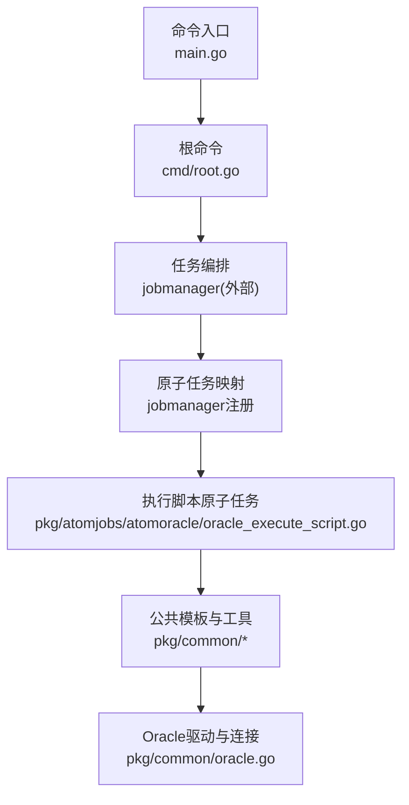
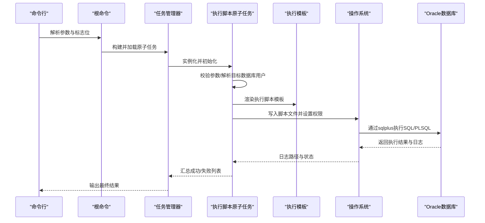
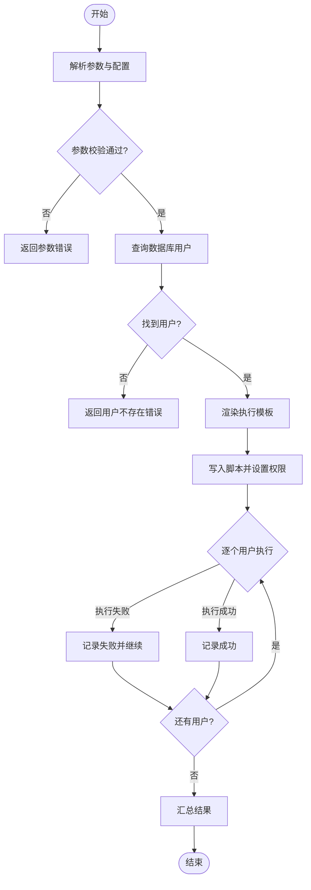
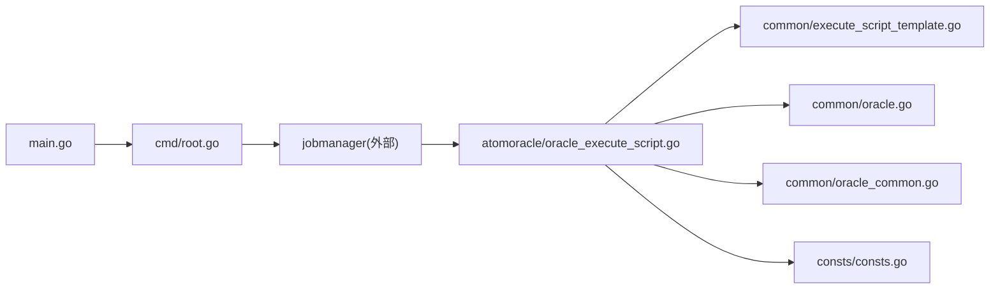

# Oracle脚本执行

<cite>
**本文引用的文件**
- [main.go](file://dbm-services/oracle/db-tools/dbactuator/main.go)
- [root.go](file://dbm-services/oracle/db-tools/dbactuator/cmd/root.go)
- [oracle_execute_script.go](file://dbm-services/oracle/db-tools/dbactuator/pkg/atomjobs/atomoracle/oracle_execute_script.go)
- [base_job.go](file://dbm-services/oracle/db-tools/dbactuator/pkg/atomjobs/atomoracle/base_job.go)
- [execute_script_template.go](file://dbm-services/oracle/db-tools/dbactuator/pkg/common/execute_script_template.go)
- [oracle.go](file://dbm-services/oracle/db-tools/dbactuator/pkg/common/oracle.go)
- [oracle_common.go](file://dbm-services/oracle/db-tools/dbactuator/pkg/common/oracle_common.go)
- [oracle_init_shell.go](file://dbm-services/oracle/db-tools/dbactuator/pkg/common/oracle_init_shell.go)
- [consts.go](file://dbm-services/oracle/db-tools/dbactuator/pkg/consts/consts.go)
- [README.md](file://dbm-services/oracle/db-tools/dbactuator/README.md)
</cite>

## 目录
1. [简介](#简介)
2. [项目结构](#项目结构)
3. [核心组件](#核心组件)
4. [架构总览](#架构总览)
5. [详细组件分析](#详细组件分析)
6. [依赖分析](#依赖分析)
7. [性能考虑](#性能考虑)
8. [故障排查指南](#故障排查指南)
9. [结论](#结论)
10. [附录](#附录)

## 简介
本文件面向Oracle数据库脚本执行场景，系统化阐述在本仓库中的实现机制与最佳实践。内容涵盖：
- SQL脚本执行、PL/SQL块运行与存储过程调用的执行链路
- 安全机制（权限控制、最小暴露面、日志与审计）
- 执行计划优化与性能分析要点
- 具体命令与参数配置
- 调试方法、错误处理与性能分析
- 复杂SQL与PL/SQL编程建议及脚本执行效率优化技巧

## 项目结构
Oracle脚本执行能力由独立的dbactuator子项目承载，采用“命令入口 + 任务编排 + 原子任务”的分层设计：
- 命令入口：解析参数、加载原子任务并执行
- 任务编排：统一管理任务生命周期、参数解码与日志输出
- 原子任务：封装具体执行逻辑（如脚本执行）
- 公共模块：通用工具、模板、常量与数据库访问

图表来源
- [main.go:1-13](file://dbm-services/oracle/db-tools/dbactuator/main.go#L1-L13)
- [root.go:66-104](file://dbm-services/oracle/db-tools/dbactuator/cmd/root.go#L66-L104)
- [oracle_execute_script.go:32-121](file://dbm-services/oracle/db-tools/dbactuator/pkg/atomjobs/atomoracle/oracle_execute_script.go#L32-L121)
- [oracle.go:13-36](file://dbm-services/oracle/db-tools/dbactuator/pkg/common/oracle.go#L13-L36)

章节来源
- [README.md:1-84](file://dbm-services/oracle/db-tools/dbactuator/README.md#L1-L84)
- [main.go:1-13](file://dbm-services/oracle/db-tools/dbactuator/main.go#L1-L13)
- [root.go:66-104](file://dbm-services/oracle/db-tools/dbactuator/cmd/root.go#L66-L104)

## 核心组件
- 命令入口与根命令
  - 入口程序负责启动命令行框架，解析持久化标志位，构建任务管理器并执行原子任务列表
  - 支持payload传参（base64或原始）、任务清单、节点/流程标识等
- 执行脚本原子任务
  - 解析参数、生成执行脚本模板、按数据库用户逐个执行、收集结果与日志
  - 提供重试次数与失败回显能力
- 公共模板与工具
  - Shell模板用于sqlplus执行SQL/PLSQL，含错误退出、时间/回显开关、日志切片
  - 文件创建与属主变更工具，确保安全权限
  - Oracle连接工具，短连接模式避免连接池干扰
- 常量与路径
  - 统一的安装/缓存/日志路径、操作系统账户与组、工具路径等

章节来源
- [root.go:150-170](file://dbm-services/oracle/db-tools/dbactuator/cmd/root.go#L150-L170)
- [oracle_execute_script.go:18-54](file://dbm-services/oracle/db-tools/dbactuator/pkg/atomjobs/atomoracle/oracle_execute_script.go#L18-L54)
- [execute_script_template.go:3-20](file://dbm-services/oracle/db-tools/dbactuator/pkg/common/execute_script_template.go#L3-L20)
- [oracle_common.go:12-39](file://dbm-services/oracle/db-tools/dbactuator/pkg/common/oracle_common.go#L12-L39)
- [oracle.go:13-36](file://dbm-services/oracle/db-tools/dbactuator/pkg/common/oracle.go#L13-L36)
- [consts.go:44-86](file://dbm-services/oracle/db-tools/dbactuator/pkg/consts/consts.go#L44-L86)

## 架构总览
下图展示从命令行到脚本执行的关键交互：

图表来源
- [root.go:73-104](file://dbm-services/oracle/db-tools/dbactuator/cmd/root.go#L73-L104)
- [oracle_execute_script.go:56-121](file://dbm-services/oracle/db-tools/dbactuator/pkg/atomjobs/atomoracle/oracle_execute_script.go#L56-L121)
- [execute_script_template.go:4-20](file://dbm-services/oracle/db-tools/dbactuator/pkg/common/execute_script_template.go#L4-L20)
- [oracle.go:13-36](file://dbm-services/oracle/db-tools/dbactuator/pkg/common/oracle.go#L13-L36)

## 详细组件分析

### 命令行与任务编排
- 参数与标志位
  - 支持uid/root_id/node_id/version_id等流程追踪字段
  - payload/payload_file用于传递原子任务参数（支持base64或文件）
  - atom-job-list用于声明要执行的原子任务序列
  - user/group用于指定OS执行用户与属组
- 执行流程
  - 优先使用payload，若未提供则尝试从payload_file读取并编码
  - 构造任务管理器，加载原子任务并执行
  - debug子命令支持列出任务、进程查看与参数打印

章节来源
- [root.go:150-170](file://dbm-services/oracle/db-tools/dbactuator/cmd/root.go#L150-L170)
- [root.go:73-104](file://dbm-services/oracle/db-tools/dbactuator/cmd/root.go#L73-L104)
- [root.go:107-140](file://dbm-services/oracle/db-tools/dbactuator/cmd/root.go#L107-L140)
- [README.md:13-30](file://dbm-services/oracle/db-tools/dbactuator/README.md#L13-L30)

### 执行脚本原子任务（SQL/PLSQL）
- 参数模型
  - 包含应用名、任务ID、主机、端口、服务名、模糊匹配的数据库用户集合、管理员账号密码、执行用户密码、脚本文件列表等
- 执行步骤
  - 初始化：解析payload、确定执行目录、拼接脚本格式
  - 参数校验：基于结构体验证必填项
  - 用户发现：根据模糊条件查询实际数据库用户
  - 脚本生成：为每个数据库用户渲染模板，写入脚本并设置权限
  - 串行执行：逐个调用bash执行脚本，记录日志并统计结果
  - 结果汇总：输出成功/失败列表，失败时返回错误
- 错误处理
  - 捕获执行异常，截取最后若干行日志辅助定位
  - 失败后记录失败用户列表，便于后续重试或告警

图表来源
- [oracle_execute_script.go:56-121](file://dbm-services/oracle/db-tools/dbactuator/pkg/atomjobs/atomoracle/oracle_execute_script.go#L56-L121)
- [oracle_execute_script.go:172-223](file://dbm-services/oracle/db-tools/dbactuator/pkg/atomjobs/atomoracle/oracle_execute_script.go#L172-L223)
- [oracle_execute_script.go:225-256](file://dbm-services/oracle/db-tools/dbactuator/pkg/atomjobs/atomoracle/oracle_execute_script.go#L225-L256)

章节来源
- [oracle_execute_script.go:18-54](file://dbm-services/oracle/db-tools/dbactuator/pkg/atomjobs/atomoracle/oracle_execute_script.go#L18-L54)
- [oracle_execute_script.go:56-121](file://dbm-services/oracle/db-tools/dbactuator/pkg/atomjobs/atomoracle/oracle_execute_script.go#L56-L121)
- [oracle_execute_script.go:172-223](file://dbm-services/oracle/db-tools/dbactuator/pkg/atomjobs/atomoracle/oracle_execute_script.go#L172-L223)
- [oracle_execute_script.go:225-256](file://dbm-services/oracle/db-tools/dbactuator/pkg/atomjobs/atomoracle/oracle_execute_script.go#L225-L256)

### 执行模板与安全
- 模板特性
  - 使用sqlplus执行，启用计时、时间戳与回显
  - spool日志追加写入，便于分段分析
  - WHENEVER SQLERROR EXIT SQL.SQLCODE，确保错误即刻中断
  - 以本地连接LOCALDB执行，减少网络与代理开销
- 权限与安全
  - 脚本文件写入后设置属主与权限，降低敏感信息泄露风险
  - 模板中避免明文密码硬编码，通过变量注入
  - OS层面限制执行用户与目录权限

章节来源
- [execute_script_template.go:3-20](file://dbm-services/oracle/db-tools/dbactuator/pkg/common/execute_script_template.go#L3-L20)
- [oracle_common.go:12-39](file://dbm-services/oracle/db-tools/dbactuator/pkg/common/oracle_common.go#L12-L39)
- [consts.go:44-50](file://dbm-services/oracle/db-tools/dbactuator/pkg/consts/consts.go#L44-L50)

### Oracle连接与数据库访问
- 连接策略
  - 短连接模式，避免连接池复用导致的状态污染
  - 显式Ping确认连通性
  - 查询后及时关闭rows与db句柄
- 参数构造
  - 使用连接字符串组合host/port/serviceName
  - 设置时区与独立连接参数

章节来源
- [oracle.go:13-36](file://dbm-services/oracle/db-tools/dbactuator/pkg/common/oracle.go#L13-L36)

### 基础任务与工具方法
- 基类职责
  - 提供步骤化执行框架、目录切换、目录清理等通用能力
  - 统一日志记录与错误包装
- 工具方法
  - 目录移除保护（禁止根目录）
  - 步骤化执行与错误传播

章节来源
- [base_job.go:14-96](file://dbm-services/oracle/db-tools/dbactuator/pkg/atomjobs/atomoracle/base_job.go#L14-L96)

### OS初始化与目录准备
- 作用
  - 在OS层面创建/挂载必要目录，设置属主与权限，建立软链接
  - 为后续脚本执行提供稳定的工作空间
- 适用场景
  - 首次部署或环境初始化阶段

章节来源
- [oracle_init_shell.go:3-24](file://dbm-services/oracle/db-tools/dbactuator/pkg/common/oracle_init_shell.go#L3-L24)

## 依赖分析
- 组件耦合
  - 命令入口仅负责参数解析与任务委派，耦合度低
  - 原子任务内部依赖公共模板与工具，但对外暴露统一接口
  - 数据库访问通过公共模块隔离，便于替换与测试
- 外部依赖
  - Oracle驱动：godror
  - 命令行框架：cobra
  - 参数校验：validator
- 可能的循环依赖
  - 未见直接循环导入；各包职责清晰

图表来源
- [main.go:1-13](file://dbm-services/oracle/db-tools/dbactuator/main.go#L1-L13)
- [root.go:66-104](file://dbm-services/oracle/db-tools/dbactuator/cmd/root.go#L66-L104)
- [oracle_execute_script.go:3-16](file://dbm-services/oracle/db-tools/dbactuator/pkg/atomjobs/atomoracle/oracle_execute_script.go#L3-L16)
- [execute_script_template.go:3-20](file://dbm-services/oracle/db-tools/dbactuator/pkg/common/execute_script_template.go#L3-L20)
- [oracle.go:4-16](file://dbm-services/oracle/db-tools/dbactuator/pkg/common/oracle.go#L4-L16)
- [oracle_common.go:3-10](file://dbm-services/oracle/db-tools/dbactuator/pkg/common/oracle_common.go#L3-L10)
- [consts.go:1-2](file://dbm-services/oracle/db-tools/dbactuator/pkg/consts/consts.go#L1-L2)

章节来源
- [README.md:79-84](file://dbm-services/oracle/db-tools/dbactuator/README.md#L79-L84)

## 性能考虑
- 连接与会话
  - 使用短连接避免连接池状态污染，适合一次性脚本执行
  - 对于大批量用户执行，建议评估串行执行的总耗时，必要时在业务侧进行并发控制
- 日志与IO
  - spool追加写入，注意磁盘IO与日志文件大小；建议在模板中控制输出范围
  - 脚本文件写入后立即设置权限，减少临时文件暴露窗口
- 执行超时
  - 原子任务内置超时控制，可根据脚本复杂度调整
- 并发与资源
  - 串行执行简化了锁竞争与资源争用，适合数据库DDL/变更场景
  - 若需并行，请在任务层引入队列或信号量，并确保sqlplus会话互不干扰

## 故障排查指南
- 常见问题与定位
  - 参数校验失败：检查payload结构与必填字段
  - 用户不存在：核对模糊匹配规则与数据库用户列表
  - 脚本执行失败：查看对应日志末尾几行，结合模板中的错误退出机制
  - 权限不足：确认OS用户属主、脚本权限与sqlplus可执行性
- 调试手段
  - 使用debug子命令列出可用原子任务与参数
  - 查看进程与系统负载，排除资源瓶颈
  - 分步执行：先单独运行生成的脚本，再交由原子任务统一调度
- 建议的日志与监控
  - 记录每次执行的开始/结束时间、成功/失败用户列表
  - 对失败用户进行重试或人工介入

章节来源
- [root.go:107-140](file://dbm-services/oracle/db-tools/dbactuator/cmd/root.go#L107-L140)
- [oracle_execute_script.go:225-256](file://dbm-services/oracle/db-tools/dbactuator/pkg/atomjobs/atomoracle/oracle_execute_script.go#L225-L256)

## 结论
本实现以“命令行入口 + 任务编排 + 原子任务 + 公共模板与工具”的架构，提供了稳定、可扩展的Oracle脚本执行能力。通过短连接、模板化执行、严格的权限控制与日志切片，满足生产环境对安全性与可观测性的要求。建议在复杂SQL与PL/SQL场景中遵循本文提供的最佳实践与优化建议，持续提升执行效率与稳定性。

## 附录

### 命令与参数速查
- 基本用法
  - 帮助：查看所有可用标志位
  - 执行：指定uid/root_id/node_id/version_id、payload或payload_file、atom-job-list
- 关键标志位
  - -A/--atom-job-list：原子任务列表（以逗号分隔）
  - -p/--payload：任务参数（base64或原始）
  - -f/--payload_file：任务参数文件（JSON/YAML）
  - -u/--user、-g/--group：OS执行用户与属组
  - -D/--data_dir、-B/--backup_dir：数据与备份目录（可由环境变量覆盖）

章节来源
- [README.md:13-30](file://dbm-services/oracle/db-tools/dbactuator/README.md#L13-L30)
- [root.go:150-170](file://dbm-services/oracle/db-tools/dbactuator/cmd/root.go#L150-L170)

### 安全机制与权限控制
- 最小权限原则
  - 仅授予执行所需权限的数据库账号
  - 脚本文件属主与权限严格控制
- 传输与存储
  - payload可采用base64编码，避免明文参数出现在命令行
- 审计与日志
  - 启用sqlplus回显与计时，结合spool日志便于审计与复盘

章节来源
- [oracle_common.go:12-39](file://dbm-services/oracle/db-tools/dbactuator/pkg/common/oracle_common.go#L12-L39)
- [execute_script_template.go:3-20](file://dbm-services/oracle/db-tools/dbactuator/pkg/common/execute_script_template.go#L3-L20)

### 执行计划优化与性能分析
- SQL层面
  - 使用绑定变量，避免硬解析
  - 控制回显与计时输出范围，减少IO压力
- PL/SQL层面
  - 合理使用批量处理与集合类型，减少客户端-服务器往返
  - 避免在循环中执行昂贵操作
- 运行时优化
  - 串行执行简化并发问题；如需并行，务必在任务层做并发控制
  - 对长耗时脚本设置合理超时，防止阻塞

章节来源
- [execute_script_template.go:9-19](file://dbm-services/oracle/db-tools/dbactuator/pkg/common/execute_script_template.go#L9-L19)

### 复杂SQL与PL/SQL编程最佳实践
- 结构化与可维护性
  - 将复杂逻辑拆分为可复用的函数/过程
  - 使用注释与命名规范，提升可读性
- 错误处理
  - 明确异常分支与回滚策略
  - 通过whenever sqlerror exit配合日志快速定位
- 性能
  - 使用合适的索引与分区策略
  - 避免全表扫描与不必要的排序/聚合

### 脚本执行效率优化技巧
- 减少IO与网络
  - 使用本地连接与短连接
  - 合理切分脚本，避免单次执行过长
- 并发与批处理
  - 在任务层引入并发队列，控制同时执行的用户数量
- 监控与告警
  - 基于日志与执行时间阈值建立告警